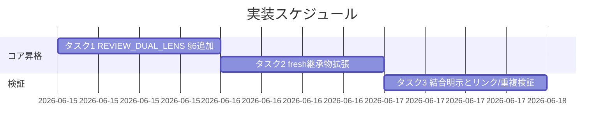

# 実装計画書: 二観点 must-preserve のラウンド継承

**プロジェクト名**: 二観点 must-preserve のラウンド継承（親「コア取り込み漏れ補完」S4）
**作成日**: 2026 年 06 月 15 日
**最終更新**: 2026 年 06 月 15 日

> **重要**: **このドキュメントは常に更新**: 実装計画の変更、進捗状況の更新、バグの記録などがあった場合は、即座にこのドキュメントを更新してください。ドキュメントは「生きているドキュメント」として扱い、実装内容と常に同期させます。
> **必須項目**: 「必須」と明記した欄は空欄・抽象語のみで提出しないこと。テスト観点・BDD 仕様は具体ケースを 1 件以上記載すること。
>
> **用語**: [.agents/CONCEPTS.md §用語規約](../../../../../../.agents/CONCEPTS.md#用語規約) を参照。

---

## 1. 実装概要

### 1.1 実装方針（必須）

[02_設計.md](./02_設計.md) に従い、must-preserve のラウンド継承（退行防止）を**コアの 2 か所に節単位で加法的・直交追加**する。(a) [REVIEW_DUAL_LENS.md](../../../../../../.agents/REVIEW_DUAL_LENS.md) に反復ループ結合節（新 §6）を追加し、(b) `CLOSEOUT.md §fresh サブ分割`（S5 未完時は [implement-feature.md §fresh サブ分割](../../../../../../.agents/commands/implement-feature.md)）の継承物に収束保証と**対**で must-preserve を追加する。**既存正本（REVIEW_DUAL_LENS §1〜§5・収束保証文言）を改変せず、二重記述を作らない**。

### 1.2 実装順序（必須: 1 件以上）

1. **タスク 1**: REVIEW_DUAL_LENS.md に反復ループ結合節（新 §6）を直交追加（退行検知原則の正本）。
2. **タスク 2**: fresh サブ分割節（CLOSEOUT.md／暫定 implement-feature.md）の継承物に must-preserve を対で追加（収束保証は不変）。
3. **タスク 3**: 結合の明示と未解決リンク・二重記述ゼロの検証。



---

## 2. タスク分解

**用語**: [.agents/CONCEPTS.md §用語規約](../../../../../../.agents/CONCEPTS.md#用語規約) を参照。

**必須**: 各タスクには **「テスト観点」（2.x.3）** と **「単体テスト仕様（BDD）」（2.x.4）** を必ず記載すること。テスト観点の定義は **02_設計 §6** および **RULES のテスト戦略・[TEST_BDD_FORMAT.md](../../../../../../.agents/TEST_BDD_FORMAT.md)** を参照する。

### 2.1 タスク 1: REVIEW_DUAL_LENS.md に反復ループ結合節（新 §6）を直交追加

#### 2.1.1 概要（必須）

must-preserve リストを各レビュー・ラウンドへ継承して退行を検知する原則を REVIEW_DUAL_LENS.md に新 §6 として明文化する（[02 §3.1](./02_設計.md)）。

#### 2.1.2 実装内容（必須: 1 件以上）

- REVIEW_DUAL_LENS.md の §4 と §5 の間（または §5 直後）に新 §6「反復ループへの must-preserve 継承（退行検知）」を追加する。
- 新 §6 に次を記す: (1) 指摘 0 まで反復する各ラウンドへ §2.2/§3 の must-preserve リストを継承する、(2) 各ラウンドで修正が不変条件を壊していないか（退行）を確認し退行は要修正に倒す、(3) fresh 構成での継承物としての扱いは **fresh サブ分割節**へリンク委譲する。
- **委譲リンク先の確定（必須・S5 整合）**: (3) の委譲リンクおよび下記 §5 参照の追記リンクは、§fresh サブ分割節の**実在ファイル**を指すこと。`test -f .agents/CLOSEOUT.md` で確定し、存在すれば [CLOSEOUT.md §fresh サブ分割](../../../../../../.agents/CLOSEOUT.md)、無ければ（S5 未着地）暫定で [implement-feature.md §fresh サブ分割](../../../../../../.agents/commands/implement-feature.md#fresh-サブ分割) を指す。S5 完了時に CLOSEOUT.md へ付け替える（タスク 2 の編集先確定と同一の節単位帰属に従い、未解決リンクを生まない）。
- §5 参照に上記で確定した「fresh サブ分割節」への 1 行を追記（結合の発見性。リンク先は CLOSEOUT.md 実在時 CLOSEOUT.md、未着地時 implement-feature.md §fresh サブ分割）。
- 既存 §1〜§5・§汎用/固有境界・frontmatter document_id は改変しない。
- **収束保証（却下済み指摘＋理由）の文言は §6 に書かない**（退行防止のみ）。

#### 2.1.3 テスト観点（必須）

**参照**: 観点の定義は [02_設計 §6](./02_設計.md) および [RULES のテスト戦略・TEST_BDD_FORMAT](../../../../../../.agents/RULES.md#テスト戦略必須要件) を参照。以下は本タスクの具体ケース。

##### 単体（本タスクの具体ケース・必須 1 件以上）

- 正常系: `grep -n 'must-preserve' .agents/REVIEW_DUAL_LENS.md` が §6（ラウンド継承）にヒットし、ラウンド継承＝退行検知の原則が 1 か所明文化されている。
- 退行検知（既存不変）: `git diff .agents/REVIEW_DUAL_LENS.md` で §1〜§5・§汎用/固有境界・document_id に変更がない（追加のみ）。
- 重複回避: `grep -n '却下済み' .agents/REVIEW_DUAL_LENS.md` が 0 件（収束保証を書いていない）。

##### 結合/API（本タスクの具体ケース・該当時は必須 1 件以上）

- 該当なし（ドキュメント。リンク解決はタスク 3 で結合検証）。

##### E2E/受け入れ（本タスクの具体ケース・未達時は理由記載）

- 受け入れ: 01 ストーリー 1 受け入れ基準「コアに『must-preserve を各ラウンドへ継承し退行を検知する』原則が明文化」「収束保証を改変せず対として退行防止が追加」を §6 が満たす。

##### バリデーション（該当する場合の具体ケース）

- PF 中立: §6 に具体ティア・CI コマンド・固有値が含まれない（具体運用は `.agents-project/` へ委譲の記述）。

#### 2.1.4 単体テスト仕様（BDD）（必須）

**BDD 形式のテストケース（高レベル仕様）**:

```gherkin
Feature: REVIEW_DUAL_LENS への反復ループ結合節
  Scenario: must-preserve のラウンド継承が退行検知原則として明文化される
    Given REVIEW_DUAL_LENS.md に新§6を追加する
    When grep と git diff で内容を検証する
    Then §6 に「各ラウンドへ must-preserve を継承し退行を検知する」原則が記載され
    And §1〜§5 と汎用/固有境界は変更されず
    And 収束保証（却下済み指摘＋理由）の文言は §6 に含まれない
```

**テストコード例（必須: インラインコメントで Given/When/Then を明記）**

```bash
# Given: REVIEW_DUAL_LENS.md に新§6を追加済みとする
file=.agents/REVIEW_DUAL_LENS.md
# When: 退行検知原則の存在・既存不変・収束保証非混入を検査する
grep -q 'ラウンド' "$file" && grep -q 'must-preserve' "$file"   # §6 の主旨
test "$(grep -c '却下済み' "$file")" -eq 0                        # 収束保証を書いていない
git diff --unified=0 "$file" | grep -E '^\-' | grep -v '^\---' || true  # 削除行=既存改変が無いこと（追加のみ）
# Then: 上記がすべて満たされれば合格（退行検知原則が1か所・既存不変・重複なし）
```

#### 2.1.5 依存関係

- なし（先頭タスク）。must-preserve 定義は REVIEW_DUAL_LENS §2.2/§3（既存）を参照するのみ。

#### 2.1.6 見積もり

- **工数**: 0.5 時間
- **優先度**: 高

### 2.2 タスク 2: fresh サブ分割節の継承物に must-preserve を対で追加

#### 2.2.1 概要（必須）

fresh reviewer／fresh サブ構成時の継承物に、収束保証（却下済み指摘＋理由）と**対**で must-preserve リスト（退行防止）を加える（[02 §3.2](./02_設計.md)）。

#### 2.2.2 実装内容（必須: 1 件以上）

- **編集先確定（必須・先行手順）**: `test -f .agents/CLOSEOUT.md` で S5 の完了状態を確認する。存在すれば編集先は `CLOSEOUT.md §fresh サブ分割`、無ければ暫定で `implement-feature.md §fresh サブ分割`（S5 完了時に S4 追加文言ごと CLOSEOUT.md へ移設される）。
- 既存の収束保証文言（「却下済みの指摘とその理由を後続サブへ継承し…蒸し返し・無限反復を防ぐ」）を**改変せず維持**する。
- 同節に退行防止を対で追加: 「収束保証に**加えて**、退行を防ぐため **must-preserve リスト（不変条件）も後続サブへ継承**する」。
- 対構造を 1 文で明記し、退行検知の原則は [REVIEW_DUAL_LENS.md §6](../../../../../../.agents/REVIEW_DUAL_LENS.md)、must-preserve 定義は [REVIEW_DUAL_LENS.md §2.2/§3](../../../../../../.agents/REVIEW_DUAL_LENS.md) へリンク委譲する（原則本文・定義をここに重複させない）。
- **共有ファイル衝突回避**: 編集は §fresh サブ分割の 1 節内の加法的行追加のみとし、他節（commit／別セッション引継ぎ／clear 境界／verify-実経路検証）に触れない（[02 §2.2.3](./02_設計.md)）。

#### 2.2.3 テスト観点（必須）

**参照**: [02_設計 §6](./02_設計.md) 参照。以下は本タスクの具体ケース。

##### 単体（本タスクの具体ケース・必須 1 件以上）

- 正常系: 編集先の §fresh サブ分割に「must-preserve」が継承物として追加され、「却下済み」の収束保証文言も残存している（対で併記）。
- 退行検知（既存不変）: `git diff` で収束保証の既存文言が変更されておらず、他節（commit／clear 境界等）に差分がない。
- 重複回避: 編集先節内に「退行検知の原則本文」「must-preserve の定義（契約・後方互換…）」が**再記述されていない**（リンク委譲のみ）。

##### 結合/API（本タスクの具体ケース・該当時は必須 1 件以上）

- 該当なし。

##### E2E/受け入れ（本タスクの具体ケース・未達時は理由記載）

- 受け入れ: 01 ストーリー 2 受け入れ基準「fresh 継承物に must-preserve が含まれる」「収束保証と退行防止が対で重複なく記述」を満たす。

##### バリデーション（該当する場合の具体ケース）

- 編集先がファイル存在判定で機械的に確定でき、S5 順序に依らず昇格内容が同一（節単位帰属）。

#### 2.2.4 単体テスト仕様（BDD）（必須）

**BDD 形式のテストケース（高レベル仕様）**:

```gherkin
Feature: fresh サブ分割の継承物拡張
  Scenario: 収束保証を改変せず退行防止を対で追加する
    Given fresh サブ分割節が却下済み指摘＋理由を継承している（収束保証・既存）
    When 継承物に must-preserve リスト（退行防止）を追加する
    Then 収束保証の文言は不変で維持され
    And must-preserve が対として継承物に追加され
    And 退行検知の原則本文と must-preserve 定義は再記述されずリンク委譲される
```

**テストコード例（必須: インラインコメントで Given/When/Then を明記）**

```bash
# Given: 編集先を S5 完了状態で確定する
target=$(test -f .agents/CLOSEOUT.md && echo .agents/CLOSEOUT.md || echo .agents/commands/implement-feature.md)
# When: 継承物拡張後、対併記・既存不変・定義非重複を検査する
grep -q 'must-preserve' "$target"      # 退行防止が継承物に追加
grep -q '却下済み' "$target"            # 収束保証が維持（対）
# Then: must-preserve と却下済みが対で残り、退行検知の原則本文/定義は当該節に再記述されていない（査読＋リンク委譲確認）
```

#### 2.2.5 依存関係

- タスク 1（REVIEW_DUAL_LENS §6）に**リンク委譲先として依存**（§6 が無いと委譲リンクが未解決になるため、タスク 1 を先行）。

#### 2.2.6 見積もり

- **工数**: 0.5 時間
- **優先度**: 高

### 2.3 タスク 3: 結合の明示と未解決リンク・二重記述ゼロの検証

#### 2.3.1 概要（必須）

二観点（REVIEW_DUAL_LENS）と反復ループ・fresh サブ分割（CLOSEOUT／implement-feature）の結合がリンクで明示され、未解決リンク 0 件・二重記述 0 件であることを検証する（[02 §6](./02_設計.md)）。

#### 2.3.2 実装内容（必須: 1 件以上）

- §6 ⇔ §fresh サブ分割の相互リンクが解決可能であることを確認する（§fresh サブ分割側の実在ファイル＝CLOSEOUT.md または S5 未着地時 implement-feature.md を指していること）。
- must-preserve **定義**＝REVIEW_DUAL_LENS §2.2/§3、**退行検知原則**＝REVIEW_DUAL_LENS §6、**fresh 継承物列挙**＝§fresh サブ分割、**収束保証**＝§fresh サブ分割（既存）の正本が各 1 か所であることを確認する（重複なし）。
- 未解決リンク検証スクリプトを実行し 0 件を確認する。

#### 2.3.3 テスト観点（必須）

**参照**: [02_設計 §6](./02_設計.md) 参照。

##### 単体（本タスクの具体ケース・必須 1 件以上）

- 正常系: §6 と §fresh サブ分割の相互リンク・§2.2/§3 への定義リンクがすべて解決（未解決 0 件）。
- 重複回避（クリティカル）: 「退行検知の原則」「must-preserve の定義」「収束保証」がそれぞれ 1 か所のみに本文を持ち、二重定義が無い（査読＋ grep）。

##### 結合/API（本タスクの具体ケース・該当時は必須 1 件以上）

- リンク解決: 追加・変更したリンク（CLOSEOUT §fresh サブ分割 / REVIEW_DUAL_LENS §6 / §2.2/§3）の実在を検証。

##### E2E/受け入れ（本タスクの具体ケース・未達時は理由記載）

- 受け入れ: 01 ストーリー 3 受け入れ基準「二観点と反復ループ・fresh サブ分割の結合がリンクで結ばれ、同一内容の二重記述が無い」を満たす。

##### バリデーション（該当する場合の具体ケース）

- 該当なし。

#### 2.3.4 単体テスト仕様（BDD）（必須）

**BDD 形式のテストケース（高レベル仕様）**:

```gherkin
Feature: 結合の明示と重複ゼロ
  Scenario: 二観点と反復ループ/fresh継承がリンクで結合し二重記述が無い
    Given §6 と §fresh サブ分割を追加・拡張した
    When 未解決リンク検証と正本の単一性を検査する
    Then 追加リンクはすべて解決し未解決 0 件であり
    And 退行検知原則・must-preserve 定義・収束保証はそれぞれ 1 か所のみに本文を持つ
```

**テストコード例（必須: インラインコメントで Given/When/Then を明記）**

```bash
# Given: §6 追加と継承物拡張が適用済みとする
# 編集対象ファイルを S5 完了状態で確定（CLOSEOUT.md 実在時はそれ・未着地時は implement-feature.md）
fresh_file=$(test -f .agents/CLOSEOUT.md && echo .agents/CLOSEOUT.md || echo .agents/commands/implement-feature.md)
# When: 未解決リンク 0 件と二重記述ゼロを検査する（REVIEW_DUAL_LENS と確定した fresh 節保有ファイルを対象）
fail=0
grep -rEon '\]\(([^)]+\.md)(#[^)]*)?\)' .agents/REVIEW_DUAL_LENS.md "$fresh_file" 2>/dev/null \
  | while IFS=: read -r f n link; do
      rel=$(printf '%s' "$link" | sed -E 's/^\]\(//; s/\).*$//; s/#.*$//')
      target=$(realpath -m "$(dirname "$f")/$rel")
      [ -e "$target" ] || { echo "UNRESOLVED: $f:$n -> $rel"; fail=1; }
    done
# Then: UNRESOLVED が出力されず（§6 と §5 追記の委譲先が実在ファイルを指す）、退行検知原則/定義/収束保証が各1か所であること（査読で確認）
```

#### 2.3.5 依存関係

- タスク 1・タスク 2 完了後に実施。

#### 2.3.6 見積もり

- **工数**: 0.5 時間
- **優先度**: 高

---

## テスト観点

本実装計画全体のテスト観点の要約（具体ケースは各 §2.x.3 に記載）:

- **must-preserve のラウンド継承（退行検知原則）がコアに明文化**されている（REVIEW_DUAL_LENS §6・タスク 1）。
- **既存の収束保証（却下済み指摘＋理由継承）と重複しない**こと（収束保証文言が REVIEW_DUAL_LENS §6 に混入せず、fresh 節では既存維持＋対追加、退行検知原則・定義は再記述せずリンク委譲＝タスク 1・2・3）。
- **二観点と反復ループ・fresh 継承の結合が暗黙でなくリンクで明示**され、未解決リンク 0 件（タスク 3）。
- 既存正本（REVIEW_DUAL_LENS §1〜§5・収束保証文言）が**不変**（直交追加・退行なし）。

---

## 単体テスト

- 単体テストは grep / git diff / リンク解決スクリプトによる構造検証で代替する（ドキュメント成果物）。各タスク §2.x.4 の BDD 仕様に従う。

---

## BDD

- 各タスク §2.x.4 の Gherkin を参照。Given/When/Then 形式は [TEST_BDD_FORMAT.md](../../../../../../.agents/TEST_BDD_FORMAT.md) に従う。01 の BDD（ユースケース 1・2）と本 03 のタスク 1・2・3 が対応する。

---

## 3. 実装スケジュール

### 3.1 マイルストーン

| マイルストーン | 期日 | 成果物 |
| ------------------ | ------ | -------- |
| 退行検知原則の昇格 | 2026-06-15 | REVIEW_DUAL_LENS.md §6 |
| 継承物拡張 | 2026-06-15 | CLOSEOUT.md／implement-feature.md §fresh サブ分割の must-preserve 追加 |
| 結合検証 | 2026-06-15 | 未解決リンク 0・二重記述 0 の証跡 |

### 3.2 実装フェーズ

#### フェーズ 1: コア昇格

- **期間**: 1 日
- **タスク**: タスク 1・タスク 2

#### フェーズ 2: 検証

- **期間**: 1 日
- **タスク**: タスク 3

---

## 4. テスト計画

テスト観点・レベル・BDD 形式の定義は **02_設計 §6** および **RULES のテスト戦略・TEST_BDD_FORMAT** を参照。各タスク §2.x.3 にタスクごとの具体ケース、§2.x.4 に BDD 仕様を記載した。

### 4.1 テストの優先順位

- クリティカル: 退行検知原則の単一明文化（タスク 1）と二重記述ゼロ（タスク 3）。
- 回帰: 既存正本（REVIEW_DUAL_LENS §1〜§5・収束保証文言）の不変を git diff で必ず確認する。

---

## 5. リスク管理

### 5.1 実装リスク

- **リスク**: 退行検知の原則／must-preserve 定義／収束保証を二重記述し、1 ファイル 1 責務・重複禁止に違反する。
  - **対策**: 定義＝REVIEW_DUAL_LENS §2.2/§3、原則＝REVIEW_DUAL_LENS §6、継承物列挙＝§fresh サブ分割、収束保証＝§fresh サブ分割（既存）と正本を各 1 か所に固定し、他はリンク委譲。タスク 3 で grep＋査読検証。
- **リスク**: S5（CLOSEOUT.md 新設）未完了時に編集先を取り違える。
  - **対策**: タスク 2 冒頭で `test -f .agents/CLOSEOUT.md` により編集先を機械的に確定。節単位帰属のため昇格内容は順序に依らず同一。
- **リスク**: CLOSEOUT.md は S1/S2 と共有のため編集衝突する。
  - **対策**: §fresh サブ分割の 1 節内の加法的行追加のみに限定し他節に触れない（[02 §2.2.3](./02_設計.md)）。

---

## 6. 参考資料

### プロジェクトドキュメント

- [`02_設計.md`](./02_設計.md) - 設計
- [`01_要件定義.md`](./01_要件定義.md) - 要件定義

### その他の参考資料

- [.agents/REVIEW_DUAL_LENS.md](../../../../../../.agents/REVIEW_DUAL_LENS.md)、[.agents/commands/implement-feature.md](../../../../../../.agents/commands/implement-feature.md)
- S5: [`../クローズアウトとissue起票の構造是正/02_設計.md`](../クローズアウトとissue起票の構造是正/02_設計.md)
- [.agents/TEST_BDD_FORMAT.md](../../../../../../.agents/TEST_BDD_FORMAT.md)、[.agents/RULES.md](../../../../../../.agents/RULES.md)

---

## 7. 前のステップ

この実装計画書は、以下のドキュメントを基に作成されています：

- **前**: [`02_設計.md`](./02_設計.md) - 設計フェーズ

---

## 8. 次のステップ

この実装計画書の承認後、以下のいずれかのステップに進みます：

- **プロジェクトが 1 つの issue（またはタスク）である場合**: 実装フェーズ（execution）に直接進む（本 S4 はサブ issue 単体のため、実装フェーズで 02/03 に従いコアへ昇格を適用する）。

**用語**: [.agents/CONCEPTS.md §用語規約](../../../../../../.agents/CONCEPTS.md#用語規約) を参照。
