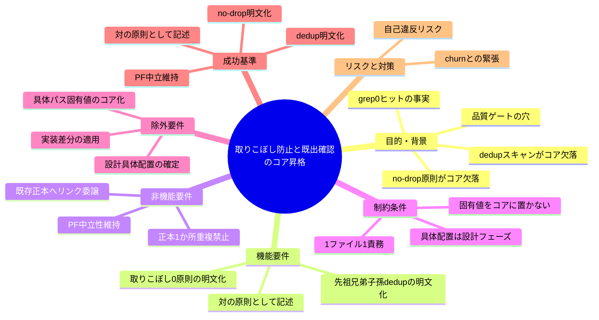
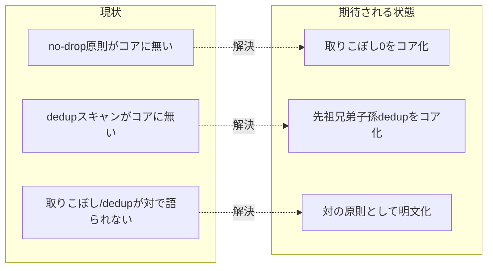

# 要求定義書: 取りこぼし防止と既出確認のコア昇格

**プロジェクト名**: 取りこぼし防止と既出確認のコア昇格
**作成日**: 2026 年 06 月 15 日
**最終更新**: 2026 年 06 月 15 日

> **重要**:
>
> - 要求定義書は、プロジェクトの全体像を把握するためのものです。詳細な技術仕様や実装方法は要件定義書以降で記載します。必要最低限の情報に収めることを心掛けてください。
> - **このドキュメントは常に更新**: 要求の変更や追加があった場合は、即座にこのドキュメントを更新してください。ドキュメントは「生きているドキュメント」として扱い、実装内容と常に同期させます。
> - **必須項目**: 以下の「必須」と明記した項目は空欄・抽象語のみ（例: 「{説明}」のまま）で提出しないこと。判定可能な形（目的は1文・成功基準は○/×で判定できる記載等）で記入すること。
>
> **用語**: [.agents/CONCEPTS.md §用語規約](../../../../../../.agents/CONCEPTS.md#用語規約) を参照。

---

## 要求定義の全体像

**注意**:

- 上記の「プロジェクト名」は例です。実際のプロジェクト名に置き換えてください。
- マインドマップは全体像を把握するためのものです。主要なセクション名程度に留め、詳細は記載しないでください。

---

## 1. 目的・背景

### 1.1 目的（必須）

クローズ時の取りこぼし0と起票前の既出確認をコアへ汎用原則として昇格する。

### 1.2 背景

- **現状の課題**:
  - 元ポリシー `IMPLEMENTATION_CLOSEOUT_POLICY.md`（3 節 / 3.0 節）の核心 2 要素――(a) **取りこぼし0**: クローズ時に挙がったフォローアップ/残件は必ず「追跡可能な issue/サブ issue」に落とし、散文・memo 言及だけで終わらせない、(b) **既出確認（二重起票防止）**: 起票前に必ず issue ツリーの**先祖(ancestors)・兄弟(siblings)・子孫(descendants)**を grep 等で機械的に走査し、既出（追跡可能 issue が存在）なら新規起票せず既存へ紐付け、記述はあるが追跡可能 issue 化されていない場合は出自パスを参照に明記して起票する――が、コア（`.agents/`）に**完全欠落**している。
  - grep 確認の事実: `.agents/` 配下で `取りこぼし / 既出確認 / 重複起票 / 二重起票 / 先祖 / 兄弟 / 子孫 / 申し送り` は **0 ヒット**。コアは `90_issues.md` の出力要件（`.agents/commands/implement-feature.md:49,58`）しか持たず、no-drop 原則と dedup スキャンの双方が欠けている。
  - 親 issue があれば課題有無に関わらず 90_issues.md 更新は必須、という元ポリシーの規律も、コアでは「サブ issue を作成した場合のみ 90_issues.md を作成」止まりで、no-drop の文脈を伴わない。

- **必要性**:
  - フォローアップ/残件が散文・memo に埋もれて追跡不能になる「取りこぼし」を構造的に防ぐため、no-drop 原則をコアの普遍ルールとして明文化する必要がある。
  - 同一論点が複数の issue に重複起票される「二重起票」を防ぐため、起票前の先祖・兄弟・子孫スキャンをコアの普遍ルールとして明文化する必要がある。
  - 両者は対の関係（取りこぼし0＝落とし忘れ防止／dedup＝起票しすぎ防止）にあり、片方だけでは churn を招く。`.agents/REVIEW_DUAL_LENS.md` の churn 防止と同型の緊張関係として、対で記述する必要がある。

#### 1.2.x 取り込み先候補（本 issue は要求・要件まで）

- 取り込み先候補: `.agents/commands/implement-feature.md §クローズアウト（欠落工程の補完）` に新節を追加、または独立コアファイル化（親 issue の S5「構造是正」と関係）。**具体配置は本 issue の設計フェーズ（02_設計）で決める。本 issue は要求・要件までを範囲とする。**
- コアの既存クローズアウト節は、既存正本（[REVIEW_RULE.md] / [run_command.md §Constraints] / [RULES.md]）へリンク委譲し抽象形のみを置く方針であり、本原則もこの方針に整合させる。

### 1.3 期待される効果（必須: 1 件以上）

- **効果 1**: コアに「フォローアップは追跡可能 issue に必ず落とす（取りこぼし0）」原則が明文化される（○/×: `.agents/` 配下に no-drop の抽象原則が 1 か所明記されているか）。
- **効果 2**: コアに「起票前に先祖・兄弟・子孫を走査し既出なら新規起票せず紐付ける（二重起票防止）」原則が明文化される（○/×: `.agents/` 配下に dedup スキャンの抽象原則が 1 か所明記されているか）。
- **効果 3**: 取りこぼし0 と dedup が**対の原則**として（churn 防止と同型の緊張関係で）記述される（○/×: 両者が対であることが本文に表現されているか）。

**現状と期待される状態の比較**（必要に応じて）:

---

## 2. 機能要件

### 2.1 既存機能の維持（該当する場合）

- 既存のコア・クローズアウト節（`.agents/commands/implement-feature.md §クローズアウト`）と 90_issues.md 出力要件（同 :49,58）を破壊せず、欠落分の追記・補完にとどめる。
- コアの PF 中立性、1 ファイル 1 責務・重複禁止、既存正本へのリンク委譲を維持する。

### 2.2 新規機能要件

- **取りこぼし0（no-drop）のコア化**: クローズ時に挙がったフォローアップ/残件を、散文・memo 言及だけで終わらせず必ず追跡可能な issue/サブ issue に落とす、という抽象原則をコアに明文化する。
- **既出確認（dedup スキャン）のコア化**: 起票前に先祖・兄弟・子孫を機械的に走査し、既出なら新規起票せず既存へ紐付ける（記述はあるが追跡可能 issue 化されていない場合は出自パスを参照に明記して起票する）、という抽象原則をコアに明文化する。
- **対の原則としての記述**: 取りこぼし0 と dedup を、落とし忘れ防止と起票しすぎ防止の緊張関係（churn 防止と同型）にある**対の原則**として記述する。

### 2.3 サブ issue の作成範囲（本 issue の境界）

- 本サブ issue が作成するのは **00_要求定義.md と 01_要件定義.md のみ**。02_設計以降（具体配置の確定・差分適用）は後続フェーズで扱う。
- 親の 90_issues.md は本 issue では編集しない（状態列の更新は別サブが一括で行う＝競合回避）。

---

## 3. 非機能要件

### 3.1 パフォーマンス

- 本原則はクローズアウト工程に組み込まれる軽量な規律であり、通常作業のコンテキスト効率を悪化させない。

### 3.2 セキュリティ

- 高リスク操作は伴わない。本 issue は要求・要件文書の作成のみで、コア正本への編集は後続フェーズで扱う。

### 3.3 互換性

- コアの PF 中立性を壊さない。具体ファイル名・90_issues パス・固有値はコアに混入させない。

### 3.4 保守性

- 抽象原則のみをコアに置き、固有値・具体パスは置かない。既存正本（REVIEW_RULE / RULES / run_command 等）へリンク委譲し、定義を 2 か所に重複させない（1 ファイル 1 責務）。

---

## 4. 制約条件

### 4.1 技術的制約

- **PF 中立**: コアは抽象原則のみ。具体ファイル名・90_issues パス・タグ運用・固有値はコアに置かない。
- **1 ファイル 1 責務・重複禁止**: 既存正本へリンク委譲する。
- **本 issue の範囲**: 要求・要件まで。具体配置（新節 or 独立ファイル）は設計フェーズで決める。

### 4.2 既存システムとの互換性

- 既存クローズアウト節・90_issues 出力要件を破壊せず、欠落分の補完にとどめる方針を後続フェーズに引き継ぐ。

### 4.3 移行期間・スケジュール

- 親 issue（`docs/maintainer/workflow/20260615_055806_コア取り込み漏れ補完/`）の確定起票順序表で起票順 1・優先 🔴（最重要）。S1 を先頭とする。

---

## 5. 除外要件

- **コア正本への実際の差分適用**（新節執筆・独立ファイル化の実装）。02 設計以降で扱う。
- **具体配置の確定**（`implement-feature.md §クローズアウト` 新節 か 独立コアファイル化 か）。設計フェーズで決める。
- **固有値・具体パスのコア化**（具体ファイル名・90_issues パス等）。PF 中立性を維持する。
- 親の 90_issues.md の編集（別サブが一括更新）。

---

## 6. 成功基準（必須: 1 件以上）

- コアに no-drop（取りこぼし0：フォローアップは追跡可能 issue に必ず落とす）原則が明文化されている（○/×）。
- コアに dedup（起票前に先祖・兄弟・子孫を走査し既出なら新規起票せず紐付ける）原則が明文化されている（○/×）。
- 取りこぼし0 と dedup が**対の原則**として（churn 防止と同型の緊張関係で）記述されている（○/×）。
- 具体ファイル名・90_issues パス等の固有値がコアに混入していない＝PF 中立が維持されている（○/×）。
- 本サブ issue は 00_要求定義.md と 01_要件定義.md のみを作成し、親 90_issues.md を編集しない（○/×）。

---

## 7. リスクと対策

### 7.1 技術的リスク

- **リスク**: no-drop だけを強化すると、念のための過剰起票（churn）を招き、二重起票が増える。
  - **対策**: 取りこぼし0 と dedup を必ず対で記述し、起票前の先祖・兄弟・子孫スキャンを no-drop と一体の規律とする。
- **リスク**: 本原則をコアへ昇格する際、具体パス・固有値を混入させて PF 中立性に自己違反する。
  - **対策**: コアは抽象原則のみ、固有値は `.agents-project/`、既存正本へリンク委譲、を 00/01 の制約として明記し後続フェーズに引き継ぐ。

### 7.2 スケジュールリスク

- **リスク**: 兄弟サブ issue（S5 構造是正）との取り込み先（新節 or 独立ファイル）の判断が前後し、配置が競合する。
  - **対策**: 具体配置は本 issue の設計フェーズで S5 との関係を踏まえて決める旨を明記し、要求・要件段階では配置を固定しない。

---

## 8. 参考資料

### プロジェクトドキュメント

- 親 issue: [`../../00_要求定義.md`](../../00_要求定義.md) - コア取り込み漏れ補完（親）/ issue_id: 434c7b86-4222-45e7-a0ef-1ae455f15313
- 親 issue 一覧: [`../../90_issues.md`](../../90_issues.md) - 確定起票順序表（本 issue は起票順 1・🔴）

### その他の参考資料

- 元ポリシー核心: `IMPLEMENTATION_CLOSEOUT_POLICY.md` 3 節 / 3.0 節（取りこぼし0・既出確認）
- コアの該当箇所: `.agents/commands/implement-feature.md §クローズアウト（欠落工程の補完）`・同 :49,58（90_issues 出力要件）
- 既存正本（リンク委譲先候補）: `.agents/REVIEW_RULE.md`、`.agents/RULES.md`、`.agents/skills/agent/run_command.md §Constraints`、`.agents/REVIEW_DUAL_LENS.md`（churn 防止の同型）
- 設計原則: `.agents/spec/01_設計原則.md`、`.agents/spec/06_設計判断の優先順位.md`
- 関連背景（別物・取り込み調査側）: `docs/maintainer/workflow/close/20260614_162712_コア取り込み候補調査/`（4 ポリシーの取り込み調査であり、本件＝取り込み後の漏れ補完とは別物）

---

## 9. 次のステップ

この要求定義書の承認後、以下のドキュメントを作成します：

- **次**: [`01_要件定義.md`](./01_要件定義.md) - 要件定義フェーズ
