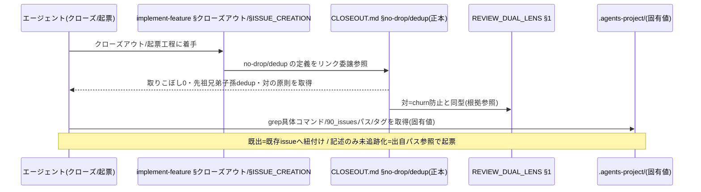
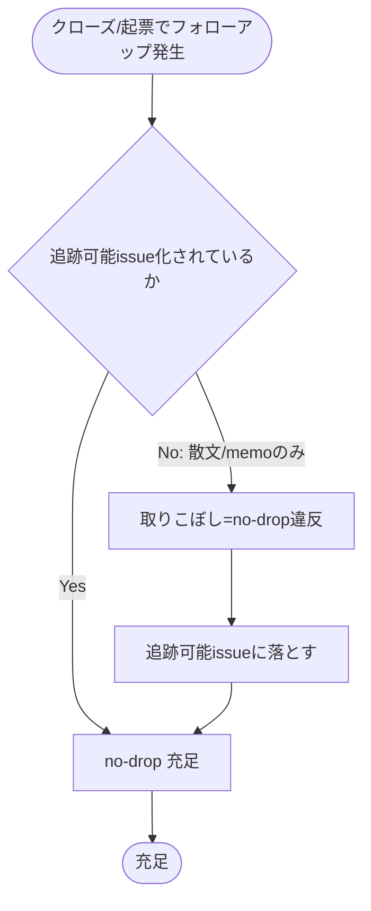
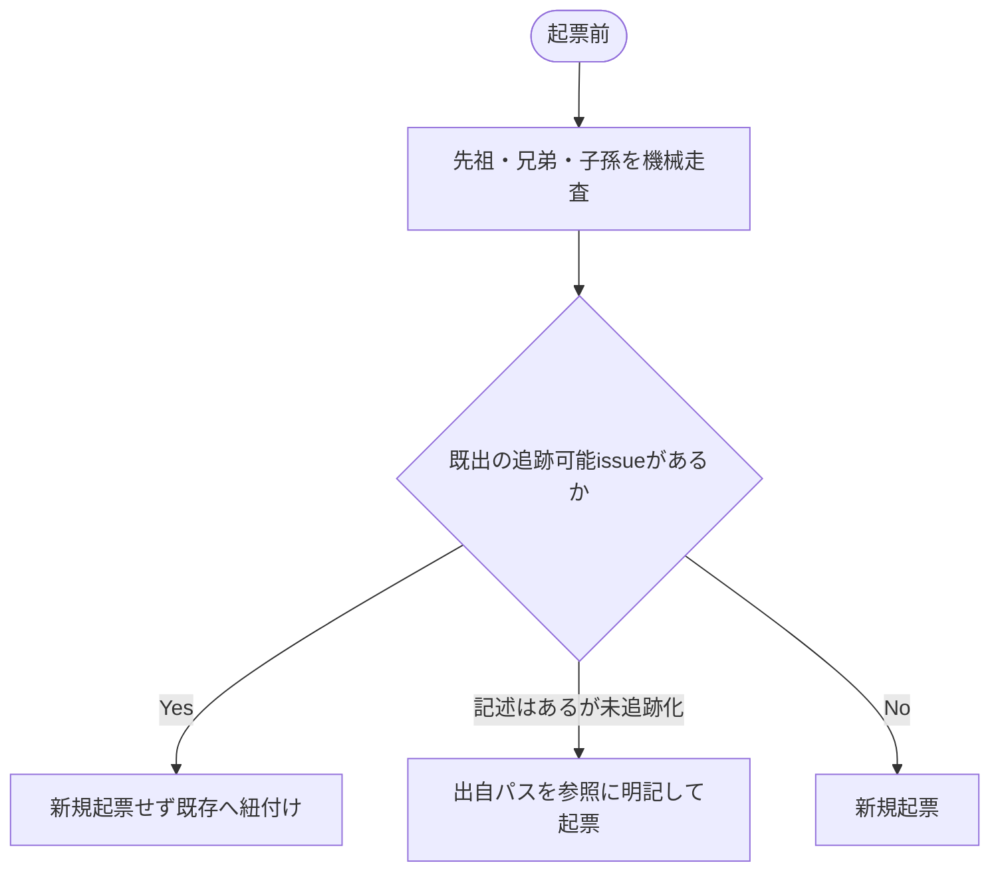

# 設計書: 取りこぼし防止と既出確認のコア昇格

**プロジェクト名**: 取りこぼし防止と既出確認のコア昇格（親「コア取り込み漏れ補完」S1）
**作成日**: 2026 年 06 月 15 日
**最終更新**: 2026 年 06 月 15 日

> **重要**: **このドキュメントは常に更新**: 設計の変更や追加があった場合は、即座にこのドキュメントを更新してください。ドキュメントは「生きているドキュメント」として扱い、実装内容と常に同期させます。
>
> **用語**: [.agents/CONCEPTS.md §用語規約](../../../../../../.agents/CONCEPTS.md#用語規約) を参照。

---

## 参照元

- **親 issue**: `docs/maintainer/workflow/20260615_055806_コア取り込み漏れ補完/`（issue_id: `434c7b86-4222-45e7-a0ef-1ae455f15313`）
- **本サブ issue**: `90_issues/取りこぼし防止と既出確認のコア昇格/`（issue_id: `de775cbb-02e9-4b22-88bd-16b8fb15b8dc`）
- 本 issue 00: [`./00_要求定義.md`](./00_要求定義.md) / 本 issue 01: [`./01_要件定義.md`](./01_要件定義.md)
- 兄弟 S5（構造是正・独立ファイル化の正本）: [`../クローズアウトとissue起票の構造是正/01_要件定義.md`](../クローズアウトとissue起票の構造是正/01_要件定義.md)（issue_id: `10b7821c-d49d-427c-b39c-03339eef1c76`）

---

## 1. 設計概要

**必須**: 設計方針・原則は [.agents/spec/01_設計原則.md](../../../../../../.agents/spec/01_設計原則.md) を先に参照した上で、本プロジェクトに適用するものを選び記載する。

### 1.1 設計方針

クローズアウト工程における 2 つの汎用原則――**取りこぼし0（no-drop）**と**既出確認（dedup スキャン）**――を、抽象形（PF 中立）でコアに 1 か所だけ明文化し、両者を「落とし忘れ防止 ⇔ 起票しすぎ防止」の**対の原則**として記述する。具体値（grep コマンド・90_issues パス・固有のタグ運用等）は置かず、既存正本へリンク委譲することで 1 ファイル 1 責務・重複禁止を保つ。本 issue は**設計・実装計画まで**を範囲とし、コアへの実差分適用は実装フェーズで行う。

### 1.2 設計原則（本プロジェクトで適用するもの）

- **単一責務**: no-drop と dedup の正本を **1 ファイル 1 責務**で 1 か所に置く。既存正本（REVIEW_RULE / RULES / REVIEW_DUAL_LENS / implement-feature §クローズアウト）への重複記載をしない（[01_設計原則 §単一責務](../../../../../../.agents/spec/01_設計原則.md)）。
- **明確な境界**: 「抽象原則＝コア」「具体値＝`.agents-project/`」の境界を厳守する（PF 中立。[06_設計判断の優先順位 §原則](../../../../../../.agents/spec/06_設計判断の優先順位.md)）。
- **UNIX 哲学**: 小さく作り、既存骨格（クローズアウト・起票工程）に直交追加する。組み合わせ可能にする（既存正本へリンクで結線）。
- **AI フレンドリー設計**: 小さな責務・明確な意図・1 か所定義。エージェントが迷わず参照・適用できる節構成にする（[01_設計原則 §AIフレンドリー設計](../../../../../../.agents/spec/01_設計原則.md#aiフレンドリー設計)）。

---

## 2. アーキテクチャ設計

### 2.1 責務・境界・参照関係

#### 2.1.1 責務一覧

ここでの「コンポーネント」は**コア（`.agents/`）配下のドキュメント正本**を指す（コードの API ではなく、ドキュメント原則の配置設計）。

| コンポーネント | 責務（1 文） |
| -------------- | ------------ |
| 昇格先コアファイル（**`.agents/CLOSEOUT.md` の 1 節**＝後述の確定先） | no-drop / dedup / 対の原則の**抽象原則正本**を 1 か所に保持する |
| `implement-feature.md §クローズアウト` | クローズアウト工程の**手順**側。no-drop の定義を再記述せず昇格先へリンク委譲する |
| `REVIEW_DUAL_LENS.md` | churn/退行防止の二観点正本。dedup と no-drop の「対＝churn 防止と同型」の根拠としてリンク参照される（再定義はしない） |
| `.agents-project/`（採用先で拡張） | grep 具体コマンド・90_issues パス・タグ運用等の**固有値**を保持（コアには置かない） |
| LOAD_POLICY / CORE | 昇格先への到達経路（トリガー表・読了義務）を結線する索引 |

#### 2.1.2 境界

- **入力**: 01 の機能要件（no-drop・dedup・対の原則・PF 中立）と、S5 が確定した「独立コアファイル化採用」の構造判断。
- **出力**: 昇格先コアファイル（CLOSEOUT.md）に追加する**抽象原則 1 節**の設計と、LOAD_POLICY トリガー表・CORE 索引の必要変更点。実差分の適用は本 issue の範囲外（実装フェーズ）。
- **他責務との境界**:
  - **S5（構造是正）との境界**: 独立コアファイル化の採否・新規ファイル新設（CLOSEOUT.md / CONTEXT_EFFICIENCY.md）・`CORE.md:NNN` 行番号直リンクの安定参照化は **S5 の責務**。本 S1 は「**S1 の原則をどのファイルのどの節に置くか**」と「その節本文の設計」のみを担う。ファイルの**新設・骨格**は S5、**当該 1 節の中身**は S1、と切り分ける。
  - **S4 との境界**: S4 は REVIEW_DUAL_LENS.md を更新する。本 S1 は同ファイルを**参照のみ**で更新しない（編集競合を避ける）。
  - **固有値の境界**: 具体 grep コマンド・90_issues パス・タグは `.agents-project/`。コアには抽象原則のみ。

#### 2.1.3 参照関係

依存の向き（呼び出し元 → 呼び出し先）。循環参照は持たない。

- `implement-feature.md §クローズアウト` → `CLOSEOUT.md §取りこぼし0と既出確認（no-drop / dedup）`（no-drop 手順の根拠を委譲参照）
- `CLOSEOUT.md §取りこぼし0と既出確認` → `REVIEW_DUAL_LENS.md §1 目的（churn/退行防止）`（対の原則が churn 防止と同型である根拠）
- `CLOSEOUT.md §取りこぼし0と既出確認` → `.agents-project/`（具体 grep コマンド・90_issues パス等の固有値）
- `LOAD_POLICY §トリガー表` → `CLOSEOUT.md`（クローズアウト/起票時に読むファイルとして結線）
- 90_issues 出力要件（`implement-feature.md` の OUTPUT/DONE）は no-drop の**具体的帰結の一例**として参照されるが、再定義はしない（リンク委譲）。

### 2.2 システムアーキテクチャ

**必須**: 設計判断は [.agents/spec/](../../../../../../.agents/spec/) を先に参照する。

- **採用パターン**: ドキュメント正本の**単一責務配置（1 ファイル 1 責務）＋直交追加**。新概念を既存骨格に埋め込まず、独立ファイルの 1 節として加法的に追加し、既存正本へはリンクで結線する。
- **根拠**: [06_設計判断の優先順位](../../../../../../.agents/spec/06_設計判断の優先順位.md)（可読性 > 単一責務 > 仕様整合性／再利用のために責務を曖昧にしない）と CORE §境界（正本 1 か所・重複禁止）。REVIEW_DUAL_LENS.md が「直交追加し既存骨格を改変しない」前例を持つため、これに倣う。

#### 2.2.1 昇格先の確定（1 ファイル 1 責務・概念帰属での判断）

**確定先: `.agents/CLOSEOUT.md` の 1 節**（節名案: `## 取りこぼし0と既出確認（no-drop / dedup）`）。

判断の根拠（概念帰属 × 1 ファイル 1 責務）:

| 候補 | 概念帰属 | 1 ファイル 1 責務との整合 | 判定 |
| ---- | -------- | ------------------------- | ---- |
| **A. `CLOSEOUT.md` の 1 節**（採用） | no-drop / dedup は元 `IMPLEMENTATION_CLOSEOUT_POLICY.md` の 3 節（クローズアウトの一部）由来であり、**概念的にクローズアウト寄り**。「クローズ/起票時のフォローアップ追跡」はクローズアウト工程そのもの。 | CLOSEOUT.md の責務（クローズアウト正本）に**包含**される。専用ファイルを増やすより責務が一貫する。 | ◎ 採用 |
| B. 新規 `ISSUE_HYGIENE.md` 独立ファイル | dedup（起票衛生）に着目すれば独立しうるが、no-drop はクローズアウト工程と不可分で、2 ファイルに割ると**対の原則**が分断される。 | ファイルが 1 つ増え、no-drop と dedup が別ファイルに散る＝**対の記述**が引き裂かれ責務が曖昧化。 | × 非採用 |
| C. `CONTEXT_EFFICIENCY.md` 併置 | CONTEXT_EFFICIENCY は「大規模一括起票時のコンテキスト肥大防止」が責務。dedup は起票時に関わるが、no-drop はクローズアウトで効率原則とは別概念。 | 効率原則と衛生原則が同居し責務が混ざる。 | × 非採用 |

**結論**: no-drop と dedup は**対で一体**に記述する必要があり、その共通の概念帰属は**クローズアウト**である。よって独立 ISSUE_HYGIENE.md に分離せず、S5 が新設する **`CLOSEOUT.md` の 1 節**に対で置く。これにより「対の原則」を 1 か所・1 節で表現でき、1 ファイル 1 責務（CLOSEOUT.md＝クローズアウト正本）を保つ。

> **dedup の起票フェーズ帰属に関する補足**: dedup は概念上「起票時」にも作用する。ただし本原則の出自（元 3 節）と no-drop との対構造を優先し、正本は CLOSEOUT.md に置く。起票時の参照は `implement-feature.md §issue 起票時のコンテキスト効率（ISSUE_CREATION）` 側から CLOSEOUT.md の当該節へ**リンク委譲**で結線する（定義は二重化しない）。

#### 2.2.2 S5 依存とファイル新設の前提

本設計が前提とする `.agents/CLOSEOUT.md` は、**S5（クローズアウトと issue 起票の構造是正）が新設するファイル**である。S5 の確定構造判断（独立コアファイル化採用）に S1 は従う。実装フェーズの編集順は **S5（ファイル新設）→ S1（当該 1 節の追記）** を基本とする。万一 S5 が CLOSEOUT.md を未新設のまま S1 実装に着手する場合は、03 のタスクで「CLOSEOUT.md が無ければ最小骨格を新設し、その 1 節として追記する」フォールバックを定義する（§2.4・03 §2.1.5 参照）。

#### 2.2.3 加法的・節単位の衝突回避（CLOSEOUT.md 共有方針）

CLOSEOUT.md は S2/S4/S5 も触れうる**共有ファイル**になる。本 S1 の設計は以下を厳守し、他 issue と衝突しない構成とする。

- **加法的**: 既存節を改変せず、**新規 1 節を末尾相当に追加**する（直交追加）。
- **節単位**: 追加は `## 取りこぼし0と既出確認（no-drop / dedup）` の**1 節に閉じる**。他節（commit / clear 境界 / verify-実経路検証 等）には触れない。
- **リンク委譲のみで他正本に触れない**: REVIEW_DUAL_LENS.md・implement-feature.md・RULES.md 等は**参照リンクのみ**。これらの本文を S1 では編集しない（S4 の REVIEW_DUAL_LENS 編集等と競合させない）。

#### 2.2.4 アーキテクチャ図（本プロジェクトの構成）

```mermaid
flowchart TD
    IF["implement-feature.md<br/>§クローズアウト / §ISSUE_CREATION"] -->|リンク委譲| C["CLOSEOUT.md<br/>§取りこぼし0と既出確認(no-drop/dedup)<br/>＝本S1が追加する1節(正本)"]
    C -->|churn防止と同型(参照)| RDL["REVIEW_DUAL_LENS.md<br/>§1 目的(churn/退行防止)"]
    C -->|固有値(grep/90_issues/タグ)| AP[".agents-project/"]
    LP["LOAD_POLICY §トリガー表"] -->|読むファイル結線| C
    CORE["CORE.md(索引/読了義務)"] -.経路.-> LP
```

### 2.3 コンポーネント構成

- **正本（1 節）**: `CLOSEOUT.md §取りこぼし0と既出確認（no-drop / dedup）`。no-drop・dedup・対の原則・出自参照例外（記述はあるが未追跡化なら出自パス参照で起票）を**抽象形**で記述。
- **委譲元（手順側）**: `implement-feature.md §クローズアウト`・同 §ISSUE_CREATION。定義を持たず正本へリンク。
- **参照（根拠）**: `REVIEW_DUAL_LENS.md §1`（churn 防止の同型）。
- **固有値置き場**: `.agents-project/`（コア外）。

各コンポーネントは単一責務（正本は 1 か所、手順側は手順、固有値は project）を満たす。

### 2.4 データフロー

ここでの「データ」はエージェントの**参照フロー**（どの順でどの正本を辿るか）を指す。



イベント駆動・CQRS は本件（ドキュメント原則配置）には適用しない（状態変更を伴わないため）。

---

## 3. 機能設計

### 3.1 機能 1: 取りこぼし0（no-drop）原則のコア化

#### 3.1.1 概要

クローズ/起票時に挙がったフォローアップ・残件を、散文・memo 言及だけで終わらせず**必ず追跡可能な issue/サブ issue に落とす**抽象原則を CLOSEOUT.md の 1 節に明文化する。

#### 3.1.2 処理フロー



#### 3.1.3 入力・出力

- **入力**: クローズアウト/起票工程で挙がったフォローアップ・残件。
- **出力**: 追跡可能 issue 化（散文・memo 言及のみは不可）。親 issue があれば 90_issues 更新（再定義せず既存出力要件へリンク委譲）。

#### 3.1.4 エラーハンドリング

- 残件が memo にのみ記載され追跡可能 issue 化されていない状態を **no-drop 違反**として判定できる記述を置く（受け入れ基準: 01 §2.2 ユースケース1 シナリオ2）。

### 3.2 機能 2: 既出確認（dedup スキャン）原則のコア化

#### 3.2.1 概要

起票前に issue ツリーの**先祖・兄弟・子孫**を機械的に走査し、既出なら新規起票せず既存へ紐付ける。記述はあるが追跡可能 issue 化されていない場合は**出自パスを参照に明記して起票**する、という抽象原則を明文化する。

#### 3.2.2 処理フロー



#### 3.2.3 入力・出力

- **入力**: 起票しようとする論点。
- **出力**: 既存紐付け / 出自参照付き新規起票 / 新規起票 の三分岐。走査は機械的（grep 等）に行う旨のみコアに置き、**具体コマンド・パスはコアに固定しない**（`.agents-project/` 委譲）。

#### 3.2.4 エラーハンドリング

- 三系統（先祖・兄弟・子孫）の**いずれかの走査欠落**を網羅性違反として扱える記述（must-preserve: 三系統走査の網羅性）。
- 「記述はあるが未追跡化」分岐の欠落を防ぐ（must-preserve: 出自参照例外分岐）。

### 3.3 機能 3: 対の原則としての記述

#### 3.3.1 概要

no-drop（落とし忘れ防止）と dedup（起票しすぎ防止）を、**緊張関係にある対の原則**として、`REVIEW_DUAL_LENS.md` の churn 防止と同型である旨を示して記述する（同型根拠はリンク委譲）。

#### 3.3.2 入力・出力

- **入力**: 機能 1・2 の抽象原則。
- **出力**: 両者が対であること（片方のみの強化は churn を招く）を本文 1 節内で明示。REVIEW_DUAL_LENS.md §1 への参照リンク。

---

## 4. データ設計

該当なし（DB・テーブルは扱わない。成果物は Markdown のコア原則 1 節と索引結線のみ）。

---

## 5. API 設計

該当なし（コードの API は新設しない）。本件の「インターフェース」はドキュメント参照契約であり、§2.1.3 参照関係・§2.4 データフローに記載済み。

---

## 6. テスト戦略

テスト戦略の観点定義は [RULES.md §テスト戦略必須要件](../../../../../../.agents/RULES.md#テスト戦略必須要件) を、BDD 形式は [TEST_BDD_FORMAT.md](../../../../../../.agents/TEST_BDD_FORMAT.md) を参照。本件は**コード実装を伴わないドキュメント原則の追加**のため、検証は**コア成果物に対する静的検証（grep ベースの存在/不在チェック）**で行う。本ドキュメントでは対象ごとのテスト割当のみ記載する。

### 6.1 対象ごとのテスト割り当て

「単体」相当＝grep による存在/不在の静的検証。E2E は該当しない（自動実行可能なランタイムが無いドキュメント変更のため、理由を明記）。

| 対象 | 単体(静的grep) | 結合/API | E2E | クリティカル観点 | バリデーション観点 | 未達理由/補足 |
| ---- | ---- | ---- | ---- | ---- | ---- | ---- |
| no-drop 原則のコア存在 | ○ | × | × | コアに no-drop 抽象原則が 1 か所存在 | 「散文/memo のみは違反」記述の存在 | E2E 不可（静的ドキュメント） |
| dedup 原則のコア存在 | ○ | × | × | 先祖・兄弟・子孫の三系統語がコアに存在 | 「記述あるが未追跡化→出自参照で起票」分岐の存在 | 同上 |
| 対の原則の記述 | ○ | × | × | no-drop⇔dedup が対であり churn 同型と読める | REVIEW_DUAL_LENS への参照リンク存在 | 同上 |
| PF 中立（固有値不在） | ○ | × | × | 具体 grep コマンド/90_issues パス/タグがコアに不在 | 固有値が `.agents-project/` 委譲になっている | 同上 |
| 1 ファイル 1 責務（重複不在） | ○ | × | × | no-drop/dedup 定義がコアで 1 か所のみ（多重定義不在） | 既存正本はリンク委譲のみ | 同上 |
| 参照リンク解決 | ○ | × | × | 追加節からのリンクが解決可能（未解決 0 件） | — | 相対リンク階層整合 |

### 6.2 監査・レビューでの確認（証跡）

- 本設計 §6.1 の割当表と 03 のタスク別テスト観点・BDD が揃っていることを確認する。
- 01 の BDD（§2.2 ユースケース 1〜3）と 03 のテスト観点が 1:1 対応していることを確認する（§3 マッピングは 03 §2.x.3 に記載）。
- 静的 grep 検証コマンド例は 03 に具体ケースとして記載（実行は実装フェーズ）。

---

## 7. UI 設計

該当なし。

---

## 8. セキュリティ設計

該当なし（高リスク操作を伴わない。本 issue は設計・計画のみ。コア編集は実装フェーズ）。

---

## 9. 非機能要件への対応

### 9.1 パフォーマンス

クローズアウト工程に組み込まれる軽量な 1 節であり、通常作業のコンテキスト効率を悪化させない（01 §3.1）。

### 9.2 可用性

既存クローズアウト節・90_issues 出力要件を破壊せず、欠落分を加法的に補完する。追加節からのリンクは未解決 0 件であること。

---

## 10. 参考資料

### プロジェクトドキュメント

- [`01_要件定義.md`](./01_要件定義.md) - 要件定義
- [`00_要求定義.md`](./00_要求定義.md) - 要求定義
- 親 [`../../90_issues.md`](../../90_issues.md) - 確定起票順序表（本 issue では編集しない）
- 兄弟 S5 [`../クローズアウトとissue起票の構造是正/01_要件定義.md`](../クローズアウトとissue起票の構造是正/01_要件定義.md) - 独立コアファイル化の正本

### その他の参考資料

- 昇格先（S5 新設）: `.agents/CLOSEOUT.md`（本 S1 は 1 節を追加する正本）
- 委譲元: [.agents/commands/implement-feature.md §クローズアウト・§ISSUE_CREATION](../../../../../../.agents/commands/implement-feature.md)
- 対の根拠: [.agents/REVIEW_DUAL_LENS.md §1 目的](../../../../../../.agents/REVIEW_DUAL_LENS.md#1-目的churn退行防止)
- 索引/結線: [.agents/boot/LOAD_POLICY.md](../../../../../../.agents/boot/LOAD_POLICY.md)、[.agents/boot/CORE.md](../../../../../../.agents/boot/CORE.md)
- 設計原則: [.agents/spec/01_設計原則.md](../../../../../../.agents/spec/01_設計原則.md)、[.agents/spec/06_設計判断の優先順位.md](../../../../../../.agents/spec/06_設計判断の優先順位.md)

---

## 11. 前のステップ

この設計書は、以下のドキュメントを基に作成されています：

- **前**: [`01_要件定義.md`](./01_要件定義.md) - 要件定義フェーズ

---

## 12. 次のステップ

この設計書の承認後、以下のドキュメントを作成します：

- **次**: [`03_実装計画.md`](./03_実装計画.md) - 実装計画フェーズ（コア編集タスクの具体ファイル:節列挙と静的検証 BDD）
