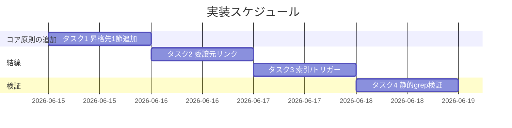
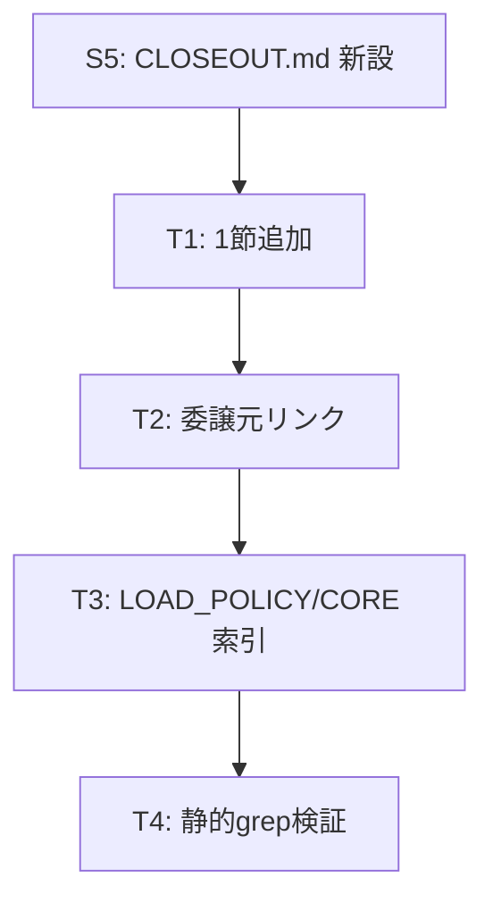

# 実装計画書: 取りこぼし防止と既出確認のコア昇格

**プロジェクト名**: 取りこぼし防止と既出確認のコア昇格（親「コア取り込み漏れ補完」S1）
**作成日**: 2026 年 06 月 15 日
**最終更新**: 2026 年 06 月 15 日

> **重要**: **このドキュメントは常に更新**: 実装計画の変更、進捗状況の更新、バグの記録などがあった場合は、即座にこのドキュメントを更新してください。ドキュメントは「生きているドキュメント」として扱い、実装内容と常に同期させます。
> **必須項目**: 「必須」と明記した欄は空欄・抽象語のみで提出しないこと。テスト観点・BDD 仕様は具体ケースを 1 件以上記載すること。
>
> **用語**: [.agents/CONCEPTS.md §用語規約](../../../../../../.agents/CONCEPTS.md#用語規約) を参照。

---

## 1. 実装概要

### 1.1 実装方針（必須）

S5 が新設する `.agents/CLOSEOUT.md` に**1 節を加法的に追加**して no-drop / dedup / 対の原則を抽象形で明文化し、既存正本（implement-feature §クローズアウト・§ISSUE_CREATION、REVIEW_DUAL_LENS）はリンク委譲・参照のみとする。検証はコード実行ではなく**静的 grep（存在/不在）チェック**で行う。本実装計画はコア編集タスクを**ファイル:節**で列挙するが、**実差分の適用は実装フェーズ**で行う（本 issue は設計・計画まで）。

### 1.2 実装順序（必須: 1 件以上）

1. タスク 1: 昇格先 1 節の追加（CLOSEOUT.md §取りこぼし0と既出確認）
2. タスク 2: 委譲元の結線（implement-feature §クローズアウト・§ISSUE_CREATION からのリンク委譲）
3. タスク 3: LOAD_POLICY トリガー表・CORE 索引の必要変更
4. タスク 4: PF 中立・1 ファイル 1 責務・リンク解決の静的検証



> **前提（S5 依存）**: 本計画のタスクはいずれも `.agents/CLOSEOUT.md` の存在を前提とする。S5（構造是正）でのファイル新設後に着手するのが基本。S5 未完で着手する場合のフォールバックは §2.1.5 に定義。

---

## 2. タスク分解

**必須**: 各タスクには「テスト観点」（2.x.3）と「単体テスト仕様（BDD）」（2.x.4）を記載する。観点定義は 02 §6 および RULES §テスト戦略・[TEST_BDD_FORMAT.md](../../../../../../.agents/TEST_BDD_FORMAT.md) を参照し、本書では具体ケースのみ記載する。

### 2.1 タスク 1: 昇格先 1 節の追加（CLOSEOUT.md）

#### 2.1.1 概要（必須）

`.agents/CLOSEOUT.md` に `## 取りこぼし0と既出確認（no-drop / dedup）` の 1 節を加法的に追加し、no-drop・dedup・対の原則を抽象形で明文化する。

#### 2.1.2 実装内容（必須: 1 件以上）

- **編集ファイル:節**: `.agents/CLOSEOUT.md` → 新規節 `## 取りこぼし0と既出確認（no-drop / dedup）`（末尾相当に追加。既存節は改変しない）。
- 節本文に以下を**抽象形**で記す（固有値・具体コマンドは置かない）:
  - **取りこぼし0（no-drop）**: クローズ/起票時のフォローアップ・残件は必ず**追跡可能 issue/サブ issue** に落とす。散文・memo 言及だけで終えることは no-drop 違反。
  - **既出確認（dedup）**: 起票前に issue ツリーの**先祖・兄弟・子孫**を機械的に走査する。既出（追跡可能 issue が存在）なら新規起票せず既存へ紐付ける。**記述はあるが追跡可能 issue 化されていない場合は出自パスを参照に明記して起票**してよい（例外分岐）。
  - **対の原則**: no-drop（落とし忘れ防止）と dedup（起票しすぎ防止）は緊張関係にある対であり、片方のみの強化は churn を招く。同型根拠は [REVIEW_DUAL_LENS.md §1](../../../../../../.agents/REVIEW_DUAL_LENS.md#1-目的churn退行防止) へリンク委譲。
  - **固有値委譲**: 具体 grep コマンド・90_issues パス・タグ運用は `.agents-project/` に委ねる旨を明記（コアに固定しない）。
- **加法的・節単位**を厳守（02 §2.2.3）: 当該 1 節のみに閉じ、CLOSEOUT.md の他節・他正本本文には触れない。

#### 2.1.3 テスト観点（必須）

**参照**: 観点定義は [02 §6](./02_設計.md) および [RULES §テスト戦略](../../../../../../.agents/RULES.md#テスト戦略必須要件)。以下は本タスクの具体ケース。01 の BDD 対応を併記する。

##### 単体（静的 grep・必須 1 件以上）

- **正常系（no-drop 存在 / 01 §2.2 UC1）**: `grep -nE '取りこぼし|no-drop' .agents/CLOSEOUT.md` が 1 件以上ヒットし、「散文・memo 言及だけで終わらせない／追跡可能 issue に落とす」旨が読み取れる。
- **正常系（三系統 dedup 存在 / 01 §2.2 UC2 シナリオ1）**: `grep -n '先祖' .agents/CLOSEOUT.md` ／ `兄弟` ／ `子孫` が**いずれも**ヒット（三系統の網羅）。
- **正常系（出自参照例外 / 01 §2.2 UC2 シナリオ2）**: `grep -nE '出自|未.*追跡|追跡可能 issue 化されていない' .agents/CLOSEOUT.md` がヒットし「記述はあるが未追跡化なら出自パス参照で起票」分岐が存在。
- **正常系（対の原則 / 01 §2.2 UC3 シナリオ1）**: 当該節に no-drop と dedup が対であり churn と同型である旨が記述され、REVIEW_DUAL_LENS への参照リンクが存在。
- **異常系（PF 中立違反の不在 / 01 §2.2 UC3 シナリオ2）**: `grep -nE 'grep -[a-zA-Z]|90_issues|\.workflow/|TZ=Asia' .agents/CLOSEOUT.md` が**当該節内で 0 ヒット**（固有値・具体コマンドがコアに混入していない）。
- **境界（1 ファイル 1 責務）**: no-drop/dedup の**定義本文**が `.agents/` 内で CLOSEOUT.md の 1 か所のみ（他コアファイルに重複定義が無い）。

##### 結合/API（該当時は必須 1 件以上）

- 該当なし（コードの API・エンドポイントを持たない）。

##### E2E/受け入れ（未達時は理由記載）

- 自動実行可能なランタイムが無い静的ドキュメント変更のため E2E は該当なし。受け入れは静的 grep（上記単体）で代替する。

##### バリデーション（該当する場合）

- リンク解決: 追加節の参照リンク（REVIEW_DUAL_LENS・implement-feature 等）が解決可能で未解決 0 件（タスク 4 で一括検証）。

#### 2.1.4 単体テスト仕様（BDD）（必須）

```gherkin
Feature: 取りこぼし0（no-drop）と既出確認（dedup）のコア化
  Scenario: クローズ時のフォローアップを追跡可能 issue に落とす（no-drop）
    Given クローズアウト工程でフォローアップ/残件が挙がっている
    When エージェントが CLOSEOUT.md の no-drop 原則を参照する
    Then 「散文・memo 言及だけで終わらせず追跡可能 issue に落とす」旨が読み取れる

  Scenario: 起票前に先祖・兄弟・子孫を走査し既出なら紐付け（dedup）
    Given 起票しようとする論点について先祖・兄弟・子孫を機械的に走査する
    When 既出の追跡可能 issue が見つかる
    Then 新規起票せず既存 issue へ紐付ける旨が CLOSEOUT.md から読み取れる

  Scenario: 記述はあるが未追跡化なら出自を参照に起票（例外分岐）
    Given 走査で論点の記述は見つかるが追跡可能 issue は存在しない
    When 新規起票する
    Then 出自パスを参照に明記して起票する旨が読み取れる
```

**静的検証コマンド例（実装フェーズで実行・インライン Given/When/Then 明記）**

```bash
# Given: CLOSEOUT.md に no-drop/dedup 節を追加済みの状態
# When: コア成果物に対し静的 grep を実行する
# Then: no-drop・三系統 dedup・出自参照例外がいずれも存在する
grep -nE '取りこぼし|no-drop' .agents/CLOSEOUT.md       # Then: no-drop 存在
grep -n '先祖' .agents/CLOSEOUT.md && grep -n '兄弟' .agents/CLOSEOUT.md && grep -n '子孫' .agents/CLOSEOUT.md  # Then: 三系統
grep -nE '出自|追跡可能 issue 化されていない' .agents/CLOSEOUT.md   # Then: 出自参照例外分岐
```

#### 2.1.5 依存関係

- **S5（構造是正）**: `.agents/CLOSEOUT.md` の新設が前提。編集順は S5 → S1。
- **フォールバック**: S5 未完で本タスクに着手する場合は、CLOSEOUT.md の最小骨格（タイトル＋責務 1 文）を新設し、その 1 節として追加する。ただし**ファイルの正式な骨格・配置確定は S5 の責務**であり、S1 は当該 1 節に閉じる（02 §2.2.2）。
- **S4**: REVIEW_DUAL_LENS.md は**参照のみ**。S1 では編集しない（競合回避）。



#### 2.1.6 見積もり

- **工数**: 0.5 日
- **優先度**: 高

### 2.2 タスク 2: 委譲元の結線（リンク委譲）

#### 2.2.1 概要（必須）

`implement-feature.md` のクローズアウト/起票工程から、no-drop/dedup の定義を**再記述せず** CLOSEOUT.md の当該節へリンク委譲する。

#### 2.2.2 実装内容（必須: 1 件以上）

- **編集ファイル:節**: `.agents/commands/implement-feature.md §クローズアウト（欠落工程の補完）` に、no-drop の根拠として CLOSEOUT.md §取りこぼし0と既出確認 への 1 行リンク委譲を追加（定義は二重化しない）。
- **編集ファイル:節**: 同 `§issue 起票時のコンテキスト効率（ISSUE_CREATION）` に、dedup（既出確認）の根拠として同節への 1 行リンク委譲を追加。
- 既存の 90_issues 出力要件（OUTPUT/DONE）は no-drop の帰結例として**そのまま**（再定義しない）。

#### 2.2.3 テスト観点（必須）

##### 単体（静的 grep・必須 1 件以上）

- **正常系**: `grep -n 'CLOSEOUT' .agents/commands/implement-feature.md` が §クローズアウト・§ISSUE_CREATION の双方近傍でヒット（結線済み）。
- **異常系（重複定義不在）**: implement-feature.md 内に no-drop/dedup の**定義本文**（先祖・兄弟・子孫の手順本体）が再記述されていない（リンクのみ）。`grep -nE '先祖.*兄弟.*子孫|出自パスを参照' .agents/commands/implement-feature.md` が定義本文として 0 ヒット（リンク文言は可）。

##### 結合/API

- 該当なし。

##### E2E/受け入れ

- 該当なし（静的ドキュメント・理由はタスク 1 と同様）。

##### バリデーション

- リンク先（CLOSEOUT.md §当該節アンカー）が解決可能（タスク 4）。

#### 2.2.4 単体テスト仕様（BDD）（必須）

```gherkin
Feature: クローズアウト/起票工程からのリンク委譲
  Scenario: 定義を二重化せず正本へ委譲する
    Given CLOSEOUT.md に no-drop/dedup の正本が存在する
    When implement-feature.md §クローズアウト・§ISSUE_CREATION を参照する
    Then 定義本文ではなく CLOSEOUT.md 当該節へのリンク委譲が置かれている
```

```bash
# Given: 委譲元に CLOSEOUT 正本へのリンクを追加した状態
# When: 結線と非重複を静的 grep で確認する
# Then: リンクは存在し、定義本文の再記述は無い
grep -n 'CLOSEOUT' .agents/commands/implement-feature.md           # Then: 結線存在
grep -nE '先祖.*兄弟.*子孫' .agents/commands/implement-feature.md  # Then: 定義本文の二重記述が無い(0件期待)
```

#### 2.2.5 依存関係

- タスク 1（昇格先節の存在）に依存。

#### 2.2.6 見積もり

- **工数**: 0.25 日
- **優先度**: 高

### 2.3 タスク 3: LOAD_POLICY トリガー表・CORE 索引の必要変更

#### 2.3.1 概要（必須）

クローズアウト/起票工程で CLOSEOUT.md §当該節に到達できるよう、LOAD_POLICY のトリガー表（および必要なら CORE の読了経路）を結線する。

#### 2.3.2 実装内容（必須: 1 件以上）

- **編集ファイル:節**: `.agents/boot/LOAD_POLICY.md §トリガー → 読むファイル`。「検証・クローズ command」行または「command を実行するとき」行に、CLOSEOUT.md（§取りこぼし0と既出確認 を含む）を読む対象として結線する（S5 が CLOSEOUT.md をトリガー表に登録する場合は、S1 は当該節への到達が成立することの確認に留め、二重登録しない＝S5 と調整）。
- **CORE 索引**: CORE.md は「正本 1 か所・読了義務」の索引であり、CLOSEOUT.md 自体の登録は LOAD_POLICY 側が正本。**CORE への変更は原則不要**。必要が生じても行番号直リンクは新規に使わず §名アンカー参照とする（S5 の行番号直リンク廃止方針に整合）。
- **S5 との非重複**: トリガー表への CLOSEOUT.md 登録が S5 と重なる場合は S5 を優先し、S1 は当該節への参照成立のみ担保する。

#### 2.3.3 テスト観点（必須）

##### 単体（静的 grep・必須 1 件以上）

- **正常系**: `grep -n 'CLOSEOUT' .agents/boot/LOAD_POLICY.md` がヒット（トリガー表から到達可能）、もしくは既存トリガー（検証・クローズ command）経由で CLOSEOUT.md §当該節へ辿れることが説明されている。
- **異常系（CORE への固有値/行番号直リンク不在）**: 仮に CORE を触る場合 `grep -nE 'CORE\.md:[0-9]+' .agents/CLOSEOUT.md` が 0 件（行番号直リンクを新規に作らない）。

##### 結合/API

- 該当なし。

##### E2E/受け入れ

- 該当なし（静的ドキュメント）。

##### バリデーション

- トリガー → CLOSEOUT.md → §当該節の参照経路が解決可能（未解決 0 件・タスク 4）。

#### 2.3.4 単体テスト仕様（BDD）（必須）

```gherkin
Feature: トリガー表からの到達経路
  Scenario: クローズ/起票時に CLOSEOUT.md 当該節へ辿れる
    Given LOAD_POLICY のトリガー表が更新されている
    When クローズ・起票のトリガーで読むファイルを辿る
    Then CLOSEOUT.md §取りこぼし0と既出確認 に到達できる
```

```bash
# Given: LOAD_POLICY に CLOSEOUT 結線を追加(またはS5登録)した状態
# When: トリガー表から到達経路を確認する
# Then: CLOSEOUT への参照が存在し、CORE に行番号直リンクを新設していない
grep -n 'CLOSEOUT' .agents/boot/LOAD_POLICY.md          # Then: 到達経路の結線
grep -nE 'CORE\.md:[0-9]+' .agents/CLOSEOUT.md           # Then: 行番号直リンク不在(0件期待)
```

#### 2.3.5 依存関係

- タスク 1 に依存。S5（トリガー表登録・行番号直リンク廃止）と調整。

#### 2.3.6 見積もり

- **工数**: 0.25 日
- **優先度**: 中

### 2.4 タスク 4: PF 中立・1 ファイル 1 責務・リンク解決の静的検証

#### 2.4.1 概要（必須）

成功基準（01 §6・02 §6.1）を静的検証で確認する。PF 中立（固有値不在）・1 ファイル 1 責務（定義 1 か所）・リンク解決（未解決 0 件）を一括検証する。

#### 2.4.2 実装内容（必須: 1 件以上）

- 固有値不在の grep（grep コマンド・90_issues パス・`.workflow/`・TZ 等がコア当該節に無い）。
- no-drop/dedup 定義が `.agents/` 内で 1 か所のみであることの確認。
- 追加・改変した参照リンクの解決検証（未解決 0 件）。`.agents-project/自己拡張ワークフロー.md §close 移動時の相対リンク補正` のリンク検証スクリプトと同型の手法を用いてよい（固有手順は project 側）。

#### 2.4.3 テスト観点（必須）

##### 単体（静的 grep・必須 1 件以上）

- **正常系（PF 中立 / 01 §6）**: `grep -rnE 'grep -[a-zA-Z]|90_issues|\.workflow/|TZ=Asia|🔴|🟠' .agents/CLOSEOUT.md` が当該節内 0 件。
- **正常系（1 ファイル 1 責務）**: no-drop/dedup の定義本文が CLOSEOUT.md のみ（`grep -rn '先祖' .agents/` の定義ヒットが CLOSEOUT.md に限られる）。
- **境界（リンク解決）**: 追加リンクの参照先がすべて実在（未解決 0 件）。

##### 結合/API

- 該当なし。

##### E2E/受け入れ

- 該当なし（静的検証で受け入れを代替）。

##### バリデーション

- 相対リンク階層の整合（成果物が close 配下に移動した場合の階層補正は project 側手順に従う。本検証は移動前の現状階層で行う）。

#### 2.4.4 単体テスト仕様（BDD）（必須）

```gherkin
Feature: PF 中立・1 ファイル 1 責務・リンク解決の検証
  Scenario: コアに固有値が混入していない
    Given 昇格後のコア記述を確認する
    When 具体ファイル名・90_issues パス・具体 grep コマンド等の固有値を探す
    Then それらはコア当該節に存在せず .agents-project へ委譲されている

  Scenario: 定義が 1 か所のみ
    Given no-drop/dedup の定義
    When .agents/ 全体を走査する
    Then 定義本文は CLOSEOUT.md の 1 か所のみで重複が無い
```

```bash
# Given: 全タスク反映後のコア状態
# When: PF中立・単一責務・リンク解決を静的検証する
# Then: 固有値0件・定義1か所・未解決リンク0件
grep -rnE 'grep -[a-zA-Z]|90_issues|\.workflow/|TZ=Asia' .agents/CLOSEOUT.md   # Then: 固有値不在
grep -rln '先祖' .agents/                                                       # Then: 定義はCLOSEOUT.mdのみ
```

#### 2.4.5 依存関係

- タスク 1〜3 完了後に実行。

#### 2.4.6 見積もり

- **工数**: 0.25 日
- **優先度**: 中

---

## テスト観点

本実装計画全体のテスト観点は**静的 grep（存在/不在）検証**に集約される。各タスクの §2.x.3 に具体ケースを記載した。要点:

- **存在**: no-drop・先祖/兄弟/子孫の三系統 dedup・出自参照例外・対の原則・REVIEW_DUAL_LENS 参照。
- **不在**: 固有値（grep コマンド・90_issues パス・タグ）・行番号直リンク・定義の重複。
- **整合**: 委譲リンクの解決（未解決 0 件）・01 BDD（UC1〜3）との 1:1 対応。

---

## 単体テスト

コード単体テストは無し（ドキュメント原則のため）。代替として各タスクの §2.x.4 に**静的 grep 検証**を BDD 形式で定義した。実行は実装フェーズ。

---

## BDD

BDD シナリオは各タスク §2.x.4 に記載。Given/When/Then は [TEST_BDD_FORMAT.md](../../../../../../.agents/TEST_BDD_FORMAT.md) に従う。01 §2.2（ユースケース 1〜3）と本書のシナリオが対応する。

---

## 3. 実装スケジュール

### 3.1 マイルストーン

| マイルストーン | 期日 | 成果物 |
| ---- | ---- | ---- |
| 昇格先 1 節の追加 | 実装フェーズ Day1 | CLOSEOUT.md §取りこぼし0と既出確認 |
| 結線（委譲元・索引） | 実装フェーズ Day1-2 | implement-feature/LOAD_POLICY のリンク委譲 |
| 静的検証通過 | 実装フェーズ Day2 | grep 検証ログ（固有値0・定義1か所・リンク解決） |

### 3.2 実装フェーズ

#### フェーズ 1: コア原則の追加と結線

- **期間**: 実装フェーズ（本 issue 範囲外）
- **タスク**: タスク 1〜4

---

## 4. テスト計画

テスト観点・レベル・BDD 形式の定義は 02 §6 および RULES §テスト戦略・TEST_BDD_FORMAT を参照。本件はコード実装が無いため、テスト＝**静的 grep 検証**。各タスク §2.x.3 に具体ケース、§2.x.4 に BDD を記載した。

### 4.1 テストの優先順位

- クリティカル: no-drop/dedup/対の原則の**存在**と PF 中立（固有値**不在**）。
- 回帰: 既存クローズアウト節・90_issues 出力要件の非破壊（加法的変更のみ）。

---

## 5. リスク管理

### 5.1 実装リスク

- **リスク**: S5 が CLOSEOUT.md を未新設のまま S1 実装に着手し、配置が宙に浮く。
  - **対策**: 編集順を S5 → S1 とし、未完時は §2.1.5 のフォールバック（最小骨格新設＋1 節追加・S5 範囲に踏み込まない）に従う。
- **リスク**: CLOSEOUT.md 共有編集で S2/S4/S5 と競合する。
  - **対策**: 加法的・節単位に限定（02 §2.2.3）。他節・他正本本文に触れない。S4 の REVIEW_DUAL_LENS は参照のみ。
- **リスク**: no-drop だけ強化し churn（過剰起票）を招く。
  - **対策**: dedup と**対**で 1 節に記述し、対の緊張を本文に明示（タスク 1）。
- **リスク**: 昇格時に固有値を混入し PF 中立に自己違反。
  - **対策**: タスク 4 の固有値不在 grep を受け入れ条件に含める。

---

## 6. 参考資料

### プロジェクトドキュメント

- [`02_設計.md`](./02_設計.md) - 設計
- [`01_要件定義.md`](./01_要件定義.md) - 要件定義
- [`00_要求定義.md`](./00_要求定義.md) - 要求定義
- 兄弟 S5 [`../クローズアウトとissue起票の構造是正/01_要件定義.md`](../クローズアウトとissue起票の構造是正/01_要件定義.md)

### その他の参考資料

- 昇格先（S5 新設）: `.agents/CLOSEOUT.md`
- 委譲元: [.agents/commands/implement-feature.md](../../../../../../.agents/commands/implement-feature.md)
- 対の根拠: [.agents/REVIEW_DUAL_LENS.md §1](../../../../../../.agents/REVIEW_DUAL_LENS.md#1-目的churn退行防止)
- 索引: [.agents/boot/LOAD_POLICY.md](../../../../../../.agents/boot/LOAD_POLICY.md)
- 固有値の置き場: [.agents-project/自己拡張ワークフロー.md](../../../../../../.agents-project/自己拡張ワークフロー.md)

---

## 7. 前のステップ

この実装計画書は、以下のドキュメントを基に作成されています：

- **前**: [`02_設計.md`](./02_設計.md) - 設計フェーズ

---

## 8. 次のステップ

この実装計画書の承認後、以下のいずれかのステップに進みます：

- 本サブ issue は単一の論理変更（コア 1 節の追加と結線）であり、実装フェーズ（execution）に直接進む。
- 親 90_issues.md は本 issue では編集しない（別サブが一括更新）。

**用語**: [.agents/CONCEPTS.md §用語規約](../../../../../../.agents/CONCEPTS.md#用語規約) を参照。
