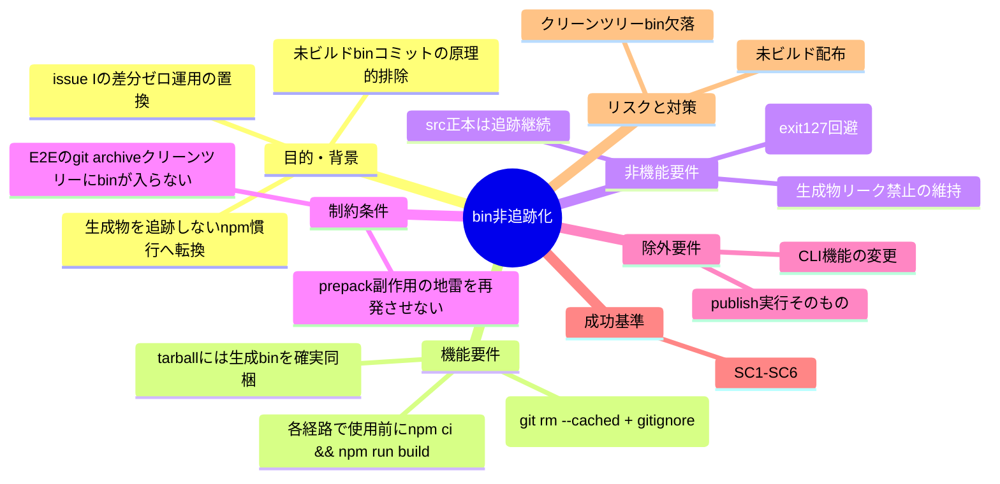
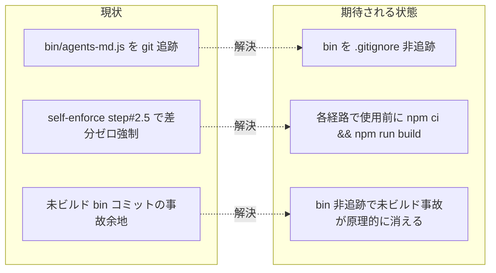

# 要求定義書: bin 生成物の gitignore 化と publish 時ビルド

**プロジェクト名**: bin 生成物の gitignore 化と publish 時ビルド
**作成日**: 2026 年 06 月 15 日
**最終更新**: 2026 年 06 月 15 日

> **重要**:
>
> - 要求定義書は、プロジェクトの全体像を把握するためのものです。詳細な技術仕様や実装方法は要件定義書以降で記載します。必要最低限の情報に収めることを心掛けてください。
> - **このドキュメントは常に更新**: 要求の変更や追加があった場合は、即座にこのドキュメントを更新してください。
>
> **用語**: [.agents/CONCEPTS.md §用語規約](../../../../.agents/CONCEPTS.md#用語規約) を参照。

---

## 要求定義の全体像

**注意**:

- マインドマップは全体像の把握用であり、詳細は本文各節に記載する。

---

## 1. 目的・背景

### 1.1 目的（必須）

生成物 bin を非追跡化し、配布・検証・CI の各経路で使用前にビルドする。

### 1.2 背景

- **現状の課題**:
  - `bin/agents-md.js` は `src/agents-md.ts` を `tsc` でビルドした**生成物**だが、現在 git 追跡されている（`git ls-files bin/` が `bin/agents-md.js` を返す）。生成物を追跡するのは npm 慣行から外れている。
  - issue I では「追跡 bin ＋ CI 差分ゼロ検証（`self-enforce.yml` step #2.5）」方式を採用したが、これは「src を変えたら bin を再ビルドしてコミットし直す」運用を人手・CI に強制し続ける必要があり、未ビルド bin がコミットされる事故余地が残る。
  - issue I では `prepack` を一度採用したが、`npm pack --dry-run` でも `prepack` が走り、node_modules 無しのクリーン clone で `tsc: not found` → exit 127 となり E2E（`git archive` ツリー）を壊した。この地雷は再発させてはならない。

- **必要性**:
  - 生成物は追跡せず、配布（publish）/検証（E2E・pack）/CI の各経路で**使う直前に `npm ci && npm run build` で生成**する方式へ転換し、npm 慣行（生成物は追跡せず publish 直前 build で配布）へ揃える。
  - `src/agents-md.ts`（正本）の追跡は継続し、bin は完全に派生物として扱う。

### 1.3 期待される効果（必須: 1 件以上）

- **効果 1**: bin が非追跡化され、`git ls-files bin/` が空になる（○/× 判定可能）。
- **効果 2**: src を変更しても「未ビルドの bin がコミットされる」事象が**原理的に**起きなくなる（bin が追跡対象でないため。SC6）。
- **効果 3**: クリーン環境（node_modules/tsc 無し相当）でも `npm pack --dry-run`（`--ignore-scripts`）が壊れない（exit 127 等が出ない。SC3）。

**現状と期待される状態の比較**:

---

## 2. 機能要件

### 2.1 既存機能の維持（該当する場合）

- CLI（`agents-md` の `init` / `uninstall` / `version` / `help` 等）の機能・振る舞いは変更しない。
- npm 配布物の allowlist（`package.json` の `files`：`.agents/`, `AGENTS.md`, `CLAUDE.md`, `.workflow/templates/`, `bin/`, `README.md`）の意図は維持する（tarball には生成 bin が含まれること）。
- 生成物リーク禁止（`verify-npm-pack.sh` が `src/`・`tsconfig.json`・`*.map`・`package-lock.json`・`.adapters/` 等を拒否）を維持する。

### 2.2 新規機能要件

- **bin 非追跡化**: `git rm --cached bin/agents-md.js` ＋ `.gitignore` に `bin/agents-md.js`（または `/bin/`）を追加。`src/agents-md.ts` は正本のまま追跡。
- **tarball への生成 bin 同梱**: `files` allowlist に `bin/` がある状態で、tarball に生成 `bin/agents-md.js` が確実に含まれるようにする。手段（prepack か publish 直前 build か）は**設計フェーズで選択**。ただし上記 prepack の地雷（`npm pack --dry-run` でも走り clean clone で exit 127）を必ず回避する。
- **各経路でのビルド前置**: E2E（`test/e2e-install-uninstall.sh`）・`verify-npm-pack.sh`・CI（`self-enforce.yml` / `release.yml`）が bin を使う前に `npm ci && npm run build` する。
- **E2E クリーンツリーの bin 欠落吸収**: E2E は `git archive HEAD | tar -x` でクリーンツリーを作るため、bin 非追跡化で**クリーンツリーに bin が入らなくなる**。これを吸収する（手段は設計）。
- **step #2.5 の除去**: issue I で追加した `self-enforce.yml` step #2.5「CLI typecheck & build diff-zero」は bin 非追跡化で無意味になるため除去する（typecheck 自体は残す価値あり＝設計判断）。
- **整合更新**: `docs/maintainer/RELEASE.md`・`release.yml`・`self-enforce.yml`・`.agents-project/COVERAGE_EXCEPTIONS.md`（該当があれば）を整合更新する。

---

## 3. 非機能要件

### 3.1 パフォーマンス

- 各経路に追加する `npm ci && npm run build` は妥当な範囲のオーバーヘッドに収める（既存 CI/E2E の構成と矛盾しない範囲）。

### 3.2 セキュリティ

- 証跡 DB（`workflow.db*`）・リポ固有物（`.agents-project/`・`docs/maintainer/`）が tarball に漏れない状態を維持する。

### 3.3 互換性

- npm 配布物の必須物（`.agents/`・`AGENTS.md`・`CLAUDE.md`・`bin/agents-md.js`・`README.md`・`package.json`・`.workflow/templates/`）が tarball に含まれる状態を維持する。
- `bin/agents-md.js` の shebang（`#!/usr/bin/env node`）・実行権限（`chmod +x`、`build` script 末尾で付与）が配布物で保たれる。

### 3.4 保守性

- 検証ロジックは単一正本に集約する（CI とローカルで二重化しない）原則を維持する。
- bin 非追跡化により、src 変更時に bin を手動再コミットする保守作業が不要になる。

---

## 4. 制約条件

### 4.1 技術的制約

- **prepack 地雷の回避（必須）**: `npm pack --dry-run` で lifecycle script（`prepack` 等）が走ると、node_modules/tsc 無しのクリーン clone（E2E の `git archive` ツリー）で `tsc: not found` → exit 127 となり E2E を壊す。これを再発させない。`verify-npm-pack.sh` は既に `--ignore-scripts` で pack するため、pack 検査は lifecycle に依存しない。
- **本フェーズは要求・要件定義のみ**: コード変更・git 操作（`git rm --cached` 等）は本フェーズでは一切行わない。00/01 の markdown 成果物のみ作成する。
- 実測確認が必要な場合も `mktemp -d` 隔離で行い、本リポの追跡ファイル・bin・`.gitignore` を変更しない。

### 4.2 既存システムとの互換性

- `src/agents-md.ts` は正本として追跡を継続する。`package.json` の `files`・`bin`・`build` script の意図を維持する。
- `.agents-project/自己拡張ワークフロー.md` の名前空間役割分担（`.adapters/` `.claude/` `.cursor/` は生成物として無視）と整合させ、bin も同じ「生成物は追跡しない」原則に組み込む。

### 4.3 移行期間・スケジュール

- 単発 issue として完結（要求 → 要件 → 設計 → 実装計画 → 実装 → 検証 → close）。

---

## 5. 除外要件

- CLI（`agents-md`）の機能・サブコマンド・出力の変更。
- 実 publish（`npm publish` の本実行・`v*` タグ push）の実施。本 issue は配布経路の構成変更のみで、publish 自体は行わない。
- `tsc` ビルド設定（`tsconfig.json`）の根本的な変更（chmod +x の維持等、必要最小の整合は除く）。

---

## 6. 成功基準（必須: 1 件以上）

- **SC1**: `git ls-files bin/` が空（bin は非追跡）。`bin/agents-md.js` が `.gitignore` の対象である。
- **SC2**: `npm ci && npm run build` 後、`npm pack --dry-run --json` の配布物に `bin/agents-md.js` が**含まれ**、`src/`・`tsconfig.json`・`*.map`・`package-lock.json` が**含まれない**（実測 assert）。
- **SC3**: クリーン環境（node_modules/tsc 無し相当）での `npm pack --dry-run`（`verify-npm-pack.sh` は `--ignore-scripts`）が exit 127 等で壊れない。
- **SC4**: `bash test/e2e-install-uninstall.sh` が green（事前 build 前提を満たした上で）。
- **SC5**: `bash test/run-all.sh`（npm test）と `self-enforce.yml` 相当が green。step #2.5 は除去済み。
- **SC6**: src を変更しても「未ビルド bin がコミットされる」事象が原理的に起きない（bin 非追跡のため）。

---

## 7. リスクと対策

### 7.1 技術的リスク

- **リスク**: bin 非追跡化で E2E の `git archive HEAD | tar -x` クリーンツリーに bin が入らず、`node "$CLI"` 起動が失敗する。
  - **対策**: E2E が bin を使う前に `npm ci && npm run build` で bin を生成する（クリーンツリー側／REPO_ROOT 側のどちらを起動するかは設計で確定。E2E の `CLI` 参照点と `make_clean_tree` の関係を設計で精査）。

- **リスク**: tarball に生成 bin を含める手段に prepack を選ぶと、`npm pack --dry-run` で再び exit 127 を招く。
  - **対策**: prepack を採るなら `--ignore-scripts`（既存）に依存し pack 検査では走らせない、または publish 直前 build 方式を採る。手段は設計で「地雷回避」を満たす形に選定する。

- **リスク**: step #2.5 除去で「未ビルド配布」の防止が緩む。
  - **対策**: bin 非追跡化で「未ビルド bin がコミットされる」事象自体が消える（SC6）。各経路の使用前 build と `verify-npm-pack.sh` の必須物検査で配布物の健全性を担保する。typecheck は残す価値があれば残す（設計判断）。

### 7.2 スケジュールリスク

- **リスク**: RELEASE.md・release.yml・self-enforce.yml・COVERAGE_EXCEPTIONS.md の整合更新漏れ。
  - **対策**: 要件（01）で各更新対象を BDD シナリオ化し、設計・実装計画で網羅チェックする。

---

## 8. 参考資料

### プロジェクトドキュメント

- issue I: `docs/maintainer/workflow/20260615_092309_CLIのTypeScript化/`（追跡 bin ＋差分ゼロ運用・prepack 地雷の記録）。
- [.agents-project/自己拡張ワークフロー.md](../../../../.agents-project/自己拡張ワークフロー.md)（名前空間の役割分担：生成物は追跡しない）。
- [docs/maintainer/RELEASE.md](../../RELEASE.md)（publish 手順・§1.5 publish 前ビルド）。

### その他の参考資料

- `.github/workflows/self-enforce.yml`（step #2.5・#3・#4・#6）、`.github/workflows/release.yml`（npm publish ジョブの publish 前 build）。
- `.agents/scripts/verify-npm-pack.sh`（`--ignore-scripts`・必須/禁止パターン）、`test/e2e-install-uninstall.sh`（`git archive` クリーンツリー）。
- `package.json`（`files`・`bin`・`build` script）、ルート `.gitignore`。

---

## 9. 次のステップ

この要求定義書の承認後、以下のドキュメントを作成します：

- **次**: [`01_要件定義.md`](./01_要件定義.md) - 要件定義フェーズ
