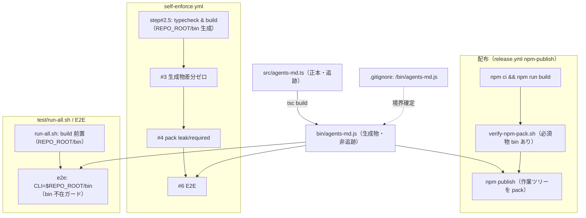
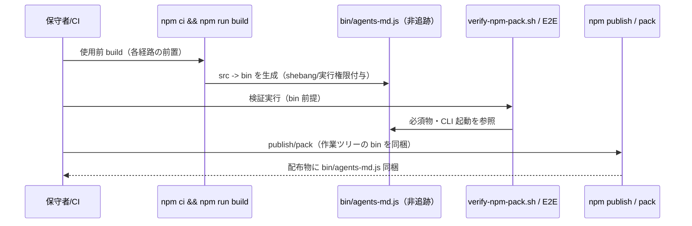
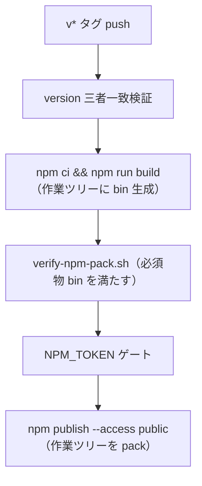
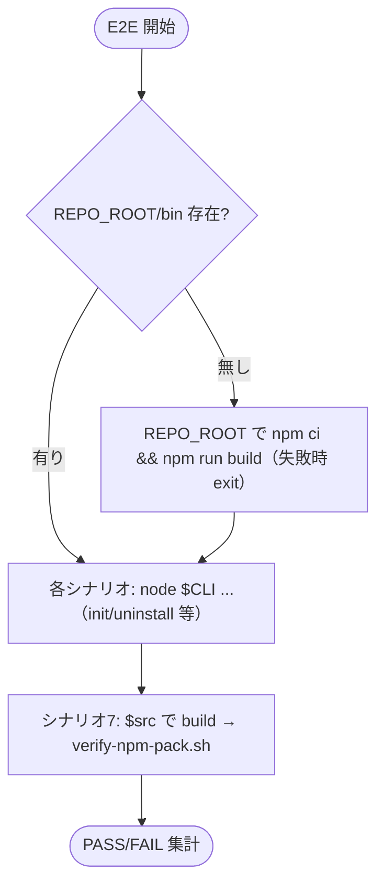

# 設計書: bin 生成物の gitignore 化と publish 時ビルド

**プロジェクト名**: bin 生成物の gitignore 化と publish 時ビルド
**作成日**: 2026 年 06 月 15 日
**最終更新**: 2026 年 06 月 15 日

> **重要**: **このドキュメントは常に更新**: 設計の変更や追加があった場合は、即座にこのドキュメントを更新してください。ドキュメントは「生きているドキュメント」として扱い、実装内容と常に同期させます。
>
> **用語**: [.agents/CONCEPTS.md §用語規約](../../../../.agents/CONCEPTS.md#用語規約) を参照。

---

## 1. 設計概要

**必須**: 設計方針・原則は [.agents/spec/01\_設計原則.md](../../../../.agents/spec/01_設計原則.md) を参照した上で本プロジェクトに適用するものを選んだ。

### 1.1 設計方針

生成物 `bin/agents-md.js` を「派生物」として完全に扱い、git 追跡から外す（`.gitignore`）。配布（publish）・検証（E2E・pack）・CI の各経路は **bin を使う直前に `npm ci && npm run build` で生成**する「使用前 build 方式」へ統一する。これにより issue I の「追跡 bin ＋ CI 差分ゼロ検証」運用を置換し、未ビルド bin がコミットされる事故を原理的に排除する。**prepack は再導入しない**（pack の lifecycle 副作用がクリーン clone を壊す地雷を避ける）。

### 1.2 設計原則（本プロジェクトで適用するもの）

- **UNIX哲学**: 「1 つのことをうまくやる」。bin は src の単純な派生物に徹し、追跡対象は正本（src）1 系統に絞る。各検証スクリプトは単一責務（pack 検査／E2E）を維持し、build は各経路の前置に分離する。
- **単一責務**: 検証ロジックは単一正本（`verify-npm-pack.sh`・`test/e2e-install-uninstall.sh`）に集約し、CI とローカルで二重化しない。build 前置は各 runner / CI step の責務、検証本体はスクリプトの責務、と分離する。
- **明確な境界**: 「正本（追跡：`src/agents-md.ts`）」と「生成物（非追跡：`bin/agents-md.js`）」の境界を `.gitignore` で機械的に確定する。`.adapters/` `.claude/` `.cursor/` `.coverage/` と同じ「生成物は追跡しない」原則の系列に bin を組み込む。
- **AIフレンドリー設計**: 変更は最小・局所（`.gitignore`・`package.json` は据え置き・各 CI step・E2E スクリプト・docs）。各変更の意図を本書 §2.5 の変更ファイル一覧で明示する。

---

## 2. アーキテクチャ設計

### 2.1 責務・境界・参照関係

#### 2.1.1 責務一覧

| コンポーネント | 責務（1 文） |
| -------------- | ------------ |
| `src/agents-md.ts`（正本） | CLI の型ファースト正本。git 追跡を**継続**する唯一の CLI ソース。 |
| `bin/agents-md.js`（生成物） | `tsc` が `src` から生成する配布用 CLI 実体。git 非追跡（`.gitignore`）とし、各経路で使用前に build で生成する。 |
| `.gitignore` | 正本／生成物の境界を機械的に確定する（bin を ignore 対象に加える）。 |
| `package.json`（`files`/`bin`/`build`） | 配布 allowlist・bin 実行エントリ・build script の正本。**本 issue では変更しない**（既存の意図を維持）。 |
| `tsconfig.json` | `tsc` のビルド設定（`rootDir=src`/`outDir=bin`）。**本 issue では変更しない**。 |
| `.agents/scripts/verify-npm-pack.sh` | `npm pack --dry-run --json --ignore-scripts` で配布物の必須物（`bin/agents-md.js` 含む）／禁止物を検査する単一正本。**スクリプト本体は変更しない**。呼び出し側が build 前置を保証する。 |
| `test/e2e-install-uninstall.sh` | install/uninstall・カプセル化の E2E 単一正本。`CLI=$REPO_ROOT/bin/agents-md.js` を起動する。bin 不在ガードを追加して堅牢化する。 |
| `test/run-all.sh` | ローカル一括 runner。E2E など bin 依存テストの前に REPO_ROOT で build を前置する責務を負う。 |
| `.github/workflows/self-enforce.yml` | 自己強制 CI。step #2.5 から「diff-zero 検証」を除去し「typecheck & build」へ再設計。後続 step が REPO_ROOT/bin を前提にできる順序を保証する。 |
| `.github/workflows/release.yml` | publish/marketplace CI。publish 前 build は維持し「追跡 bin 差分ゼロ検証」を除去する。 |
| `docs/maintainer/RELEASE.md` | publish 手順正本。§1.5 を「bin 非追跡・publish 直前 build で配布」へ改稿する。 |
| `.agents-project/COVERAGE_EXCEPTIONS.md` | カバレッジ例外台帳。bin は非実行データ（JS 生成物）で kcov 計測対象外＝影響なし（§9.4 で確認）。 |

#### 2.1.2 境界

- **入力**: `src/agents-md.ts`（正本）。各経路は `npm ci && npm run build` を入力前処理として実行する。
- **出力**: `bin/agents-md.js`（生成物・非追跡）。配布 tarball には pack 時点の作業ツリーから同梱される。
- **他責務との境界**: 本 issue の範囲は「bin の追跡境界の変更（gitignore 化）」と「各経路の build 前置・step #2.5 再設計・docs 整合」のみ。**CLI の機能・サブコマンド・出力、`tsconfig.json` の根本変更、実 publish の実施は範囲外**（00 §5 / 01 §5）。`package.json` の `files`/`bin`/`build` は据え置き（変更不要）。

#### 2.1.3 参照関係

- `bin/agents-md.js` ← 生成 ← `src/agents-md.ts`（`tsc`）。
- `test/run-all.sh` → （build 前置）→ `npm run build` → `test/e2e-install-uninstall.sh`（`$REPO_ROOT/bin` を起動）。
- `self-enforce.yml` step「CLI typecheck & build」→ REPO_ROOT/bin を生成 → 後続 step #3（生成物差分ゼロ）/#4（pack）/#6（E2E）が bin を前提にできる。
- `release.yml` npm-publish job → publish 前 build → `verify-npm-pack.sh`（必須物 bin を満たす）→ publish。
- 循環参照なし（生成は常に src → bin の一方向）。

### 2.2 システムアーキテクチャ

- **採用パターン**: 「生成物非追跡 ＋ 使用前 build（build-before-use）」パイプライン。
- **根拠**: [.agents/spec/06\_設計判断の優先順位.md](../../../../.agents/spec/06_設計判断の優先順位.md) に従い、npm 慣行（生成物は追跡せず publish 直前 build）と「単一正本・最小変更・地雷回避」を優先。prepack 方式は「dry-run でも走り clean clone で exit 127」という既知地雷（issue I）を持つため不採用とする（§3.1 A）。

#### 2.2.1 アーキテクチャ図（本プロジェクトの構成）

### 2.3 コンポーネント構成

境界（正本／生成物）と単一責務（検証本体／build 前置）を分離する。build 前置は各 runner・CI step が担い、検証本体（pack・E2E）は既存スクリプトに据える。`package.json`・`tsconfig.json` は変更しない（境界の変更は `.gitignore` ＋ `git rm --cached` のみで成立する）。

### 2.4 データフロー

発行イベント相当の「起きた事実」: `BinBuilt`（build 完了で bin 生成）、`BinUntracked`（git rm --cached ＋ gitignore で非追跡化）。本 issue は CLI 機能を変えないため実イベント機構は導入しない（概念整理のみ）。

---

## 3. 機能設計（A〜D の決定と根拠）

### 3.1 機能A: tarball へ build 済み bin を含める手段 — **publish 直前 build 方式を採用（prepack 再導入しない）**

#### 3.1.1 概要・決定

**決定**: prepack/prepublishOnly を**導入しない**。`release.yml` の npm-publish job と `RELEASE.md` は既に「prepack 廃止＋publish 直前に明示 build」モデルである。本 issue はこのモデルを**維持**し、issue I が付随させた「追跡 bin＋diff-zero 検証」部分だけを廃する。

#### 3.1.2 処理フロー

#### 3.1.3 根拠（実測で確認）

- npm publish/pack は**作業ツリー**をパックするため、publish/pack 直前に `npm ci && npm run build` すれば、非追跡でも作業ツリーに生成された `bin/agents-md.js` が tarball に含まれる。**実測**: クリーンツリー（bin 不在・node_modules 無し）で `npm ci && npm run build` 後、`npm pack --dry-run --json --ignore-scripts` に `bin/agents-md.js` が **含まれ**、`src/`・`tsconfig.json`・`*.map`・`package-lock.json` は **含まれない**（SC2 充足）。shebang `#!/usr/bin/env node` と実行権限 `-rwxr-xr-x` も保持される。
- prepack を採ると `npm pack --dry-run` でも prepack が走り、node_modules/tsc 無しの clean clone で `tsc: not found` → exit 127（issue I の地雷）。本方式はこの地雷を**完全回避**する（lifecycle に依存しない）。
- `verify-npm-pack.sh` は `--ignore-scripts` で pack するため、検査経路では lifecycle build が走らない。よって「検査時に bin を満たす」責任は**呼び出し側の build 前置**が負う（§3.3 C / §3.4 D / 下記整合）。

#### 3.1.4 verify-npm-pack の `--ignore-scripts` との整合（必須）

- `verify-npm-pack.sh` の必須物検査は `bin/agents-md.js` を required に持つ。`--ignore-scripts` 経路では bin は生成されないため、**検査前に `npm ci && npm run build` で作業ツリーに bin が存在していること**を呼び出し側で保証する。**実測**: build 後にクリーンツリーで `verify-npm-pack.sh` を実行すると PASS（必須物あり・リーク無し）。build 前（bin 不在）に呼ぶと required:bin が MISSING で FAIL する（→ 呼び出し順を build → verify に固定する設計上の制約）。
- スクリプト本体（`--ignore-scripts`・required/forbidden パターン）は**変更しない**。整合は「呼び出し順」で担保する（単一正本維持）。

### 3.2 機能B: E2E クリーンツリー bin 問題（最重要）

#### 3.2.1 概要・bin 参照の実読網羅

`test/e2e-install-uninstall.sh` の bin 参照・CLI 起動・クリーンツリー使用箇所を実読し、各々が bin をどこから得るかを確定した（網羅マッピングは §6.3）。**結論**:

- `CLI="$REPO_ROOT/bin/agents-md.js"`（L27）が唯一の bin 参照点。全 `node "$CLI" ...` 起動（init/uninstall/upgrade/enforce 等）は **REPO_ROOT 側の bin** を使う。
- `make_clean_tree`（`git archive HEAD | tar -x`、L43-46）が作るクリーンツリー（`$src`/`$dst`）は install の**ソース**としてのみ使われる。install 実体は `node "$CLI" init "$dest"` で、CLI は `.agents/scripts/setup.sh` を呼ぶ薄いラッパである。
- **`setup.sh` は bin を一切参照・コピーしない**（実読確認: setup.sh に `bin` の出現は shebang 行のみ）。配備物は `.agents/`・`AGENTS.md`・`CLAUDE.md`・`.workflow/templates`・各ツール生成物のみ。**したがってクリーンツリー（`$src`/`$dst`）側に bin は不要**。
- シナリオ6（build-adapters）・シナリオ7（verify-npm-pack をクリーンツリーで実行）は bin 非依存／別途 build を要する（§6.3 参照）。シナリオ7 はクリーンツリー `$src` で `verify-npm-pack.sh` を呼ぶため、**`$src` 側で build しないと required:bin が欠落**する（下記対策）。

#### 3.2.2 設計（決定）

1. **REPO_ROOT/bin を E2E 実行前に用意する**（CLI 起動元を満たす）:
   - **CI（self-enforce.yml）**: step「CLI typecheck & build」（旧 #2.5）で `npm ci && npm run build` 済みのため、後続の E2E step（#6）時点で REPO_ROOT/bin が存在する。順序保証は step 順で担保。
   - **ローカル（run-all.sh）**: E2E を呼ぶ前に runner が REPO_ROOT で `npm ci && npm run build`（または bin 不在時のみ build）を前置する。
2. **E2E スクリプト自身の堅牢化（bin 不在ガード）**: スクリプト末尾の実行前チェック `[[ -f "$CLI" ]] || { ... exit 2; }` を、**bin 不在時に明示エラー（exit 2＝必須依存欠如＝run-all.sh では SKIP 扱い）**とするか、または**冒頭で bin 不在なら REPO_ROOT で build を試みる**ガードに強化する。実装フェーズで「ガード方式（build を試みる）」を採用し、CI/ローカルどちらの前置が抜けても E2E 単体で自己回復できるようにする。ただし build 失敗時は明示 exit。tmp 隔離を壊さない（REPO_ROOT での build は本リポの追跡物・`.gitignore`・bin の追跡状態を変えない＝bin は非追跡なので生成しても git に差分が出ない）。
3. **シナリオ7（クリーンツリーで verify-npm-pack）対策**: `$src` クリーンツリーには bin が無いため、シナリオ7 内で `verify-npm-pack.sh` を呼ぶ前に **`$src` で `npm ci && npm run build` を実行**してから検査する（既存の npm 不在 SKIP ガードは維持）。これにより required:bin を満たす。**実測**: この順序でクリーンツリー検査が PASS することを確認済み。

#### 3.2.3 E2E 処理フロー（改修後）

### 3.3 機能C: self-enforce.yml step #2.5 の扱い — **diff-zero 除去、typecheck & build は存続**

#### 3.3.1 決定

step #2.5「CLI typecheck & build diff-zero」を **「CLI typecheck & build」へ改名・再設計**する。

- **除去**: `git diff --exit-code -- bin/agents-md.js`（差分ゼロ検証）。bin 非追跡化で `git diff` 対象に bin が無くなり無意味化するため削除。
- **存続**: `npm ci`（devDependencies 導入）／`npm run typecheck`（src strict 検証）／`npm run build`（REPO_ROOT/bin 生成）。typecheck は src 正本の型健全性検証として存続価値があり残す。build は後続 step（#3/#4/#6）が REPO_ROOT/bin を前提にできるよう前置する。

#### 3.3.2 後続 step との順序・step #3 が赤くならないことの確認（必須）

- 順序: step「CLI typecheck & build」（bin 生成）→ #3（生成物差分ゼロ）→ #4（pack）→ #6（E2E）。この順で全後続 step が REPO_ROOT/bin を前提にできる。
- **step #3 が bin 生成で赤くならないことの確認**: #3 は `git status --porcelain --untracked-files=no` で追跡ファイル差分を検知する。bin は `.gitignore` 済み＋非追跡のため、(a) `--untracked-files=no` で未追跡ファイルは無視され、(b) ignore 対象でもあるため、build で bin を生成しても porcelain 出力に **現れない**。**実測**: `.gitignore` に `/bin/agents-md.js` を追加し `git rm --cached` した状態で `npm run build` 後、`git status --porcelain --untracked-files=no` に `bin/agents-md.js` が現れず、`git check-ignore bin/agents-md.js` がマッチすることを確認（SC1・step#3 整合）。
- #3 の `.adapters` 未追跡チェックはそのまま維持（bin と独立）。

### 3.4 機能D: release.yml / RELEASE.md / COVERAGE_EXCEPTIONS 整合

#### 3.4.1 release.yml

- step「Build CLI bin & verify diff-zero (replaces prepack)」から **diff-zero 検証（`git diff --exit-code bin/agents-md.js`）を除去**し、`npm ci && npm run build`（build）は**残す**。step 名を「Build CLI bin (replaces prepack)」等へ改名。build → `verify-npm-pack.sh`（必須物 bin を満たす）→ NPM_TOKEN ゲート → publish の順序を維持（§3.1.2）。
- marketplace job（B 系統）は bin に依存しないため変更不要。

#### 3.4.2 RELEASE.md

- §1.5「publish 前ビルド（生成 bin の最新性担保）」を改稿: 「**追跡物としてコミット済み**」「**差分ゼロを確認**」「step #2.5 でも同じ差分ゼロを検証」の記述を、「`bin/agents-md.js` は**非追跡（`.gitignore`）の生成物**であり、publish 直前に `npm ci && npm run build` で作業ツリーに生成して配布する」へ改める。`git diff --exit-code bin/agents-md.js` の手順例を削除し、build → pack 検査の流れへ更新。§5 #4 の「→ 追跡 bin 差分ゼロ検証」言及も「→ build（bin 生成）」へ更新。
- 「追跡 bin」を前提とする全記述を排除（01 シナリオ4-1）。

#### 3.4.3 COVERAGE_EXCEPTIONS.md（影響有無の実読確認）

- **影響なし**。kcov 計測対象は `INCLUDE_PATHS=.agents/scripts` 配下の bash 本体のみ（COV-003 が「`*.json` 等の非実行データは bash でないため計測対象に元々入らない」と明記）。`bin/agents-md.js`（生成 JS）は計測対象外であり、非追跡化で台帳の分母・例外行に変化は生じない。**本 issue では COVERAGE_EXCEPTIONS.md を変更しない**（影響なしを 02 に記録）。

---

## 4. データ設計

本 issue はデータモデル・テーブルを持たない（CI/ビルド構成の変更）。扱う構造は `npm pack --dry-run --json` の `files[].path` 配列のみ（検証入力。`verify-npm-pack.sh` が解析）。新規スキーマ・DB 変更なし。

---

## 5. API 設計

本 issue は外部公開 API（HTTP 等）を追加しない。CLI（`agents-md` の `init`/`uninstall`/`upgrade`/`version`/`help`/`enforce`/`doctor`）のインターフェースは**変更しない**（01 §4.1）。内部「契約」として扱うのは下表のスクリプト/CI の入出力契約のみ。

| 契約 | 入力 | 出力 | 契約違反時の扱い |
| ---- | ---- | ---- | ---------------- |
| 使用前 build（各経路前置） | `src/agents-md.ts`・lockfile | `bin/agents-md.js`（実行権限付き） | tsc 型エラー/build 失敗で非0 exit。CI/runner が fail |
| `verify-npm-pack.sh`（既存・不変） | 作業ツリー（build 済み bin 前提） | 合格/不合格（exit 0/1/2） | required:bin 欠落で exit 1（→ 呼び出し前 build を保証） |
| E2E `$CLI` 起動（既存・ガード追加） | `$REPO_ROOT/bin/agents-md.js` | 各シナリオ PASS/FAIL | bin 不在時はガードで build 試行、失敗で exit 2 |

---

## 6. テスト戦略

テスト戦略の観点定義は [RULES.md のテスト戦略必須要件](../../../../.agents/RULES.md#テスト戦略必須要件)、BDD 形式は [TEST_BDD_FORMAT.md](../../../../.agents/TEST_BDD_FORMAT.md) を参照。本書は割当・マッピングのみ記載する（BDD 詳細は 03 へ渡す）。

### 6.1 対象ごとのテスト割り当て

| 対象 | 単体 | 結合/API | E2E | クリティカル観点 | バリデーション観点 | 未達理由/補足 |
| ---- | ---- | -------- | --- | ---------------- | ------------------ | ------------- |
| bin 非追跡化（gitignore） | × | ○ | × | `git ls-files bin/` 空・`git check-ignore` マッチ（SC1） | src 追跡継続 | git コマンドの実測 assert |
| 配布物への bin 同梱（pack） | × | ○ | ○ | build 後 pack に bin あり/src・map・lock 無し（SC2） | クリーン環境で exit127 無し（SC3） | mktemp 隔離で実測（§3.1.3 確認済み） |
| 使用前 build 前置（CI/E2E/release） | × | ○ | ○ | E2E green（SC4）・self-enforce 相当 green（SC5） | bin 不在ガードの自己回復 | run-all.sh / step 順で前置 |
| step #2.5 再設計 | × | ○ | × | typecheck/build 存続・diff-zero 除去・#3 が bin で赤くならない | porcelain に bin 出ない（§3.3.2 確認済み） | CI ローカル相当で確認 |
| docs/CI 整合 | ○（grep） | × | × | 「追跡 bin 差分ゼロ」前提の記述が残らない（シナリオ4-1） | RELEASE/release.yml/self-enforce 整合 | テキスト検査 |

### 6.2 監査・レビューでの確認（証跡）

§6.1 の割当と 03 のタスク別テスト観点・BDD が揃うことを確認する。01 の BDD（シナリオ1-1〜4-1）と 03 のテスト観点が 1:1 対応していることを review-dependencies で検証する。

### 6.3 E2E bin 参照の網羅マッピング表（最重要・実読結果）

| 参照箇所（行） | 種別 | bin をどこから得るか | build 場所 | 非追跡化の影響 / 対策 |
| -------------- | ---- | -------------------- | ---------- | --------------------- |
| `CLI="$REPO_ROOT/bin/agents-md.js"`（L27） | bin 参照定義 | **REPO_ROOT 側 bin** | CI step「typecheck & build」/ run-all.sh 前置 / E2E 冒頭ガード | REPO_ROOT で build 前置すれば満たす |
| 全 `node "$CLI" init/uninstall/upgrade/enforce`（各シナリオ） | CLI 起動 | REPO_ROOT 側 bin（同上） | 同上 | REPO_ROOT/bin 前提。クリーンツリー側 bin は不要 |
| `make_clean_tree`（L43-46, `git archive HEAD｜tar -x`） | install ソース生成 | bin を含まない（非追跡） | — | **bin 不要**（setup.sh が bin を参照・コピーしないため。実読確認） |
| `node "$CLI" init "$dest"`（install 実体） | install 実行 | REPO_ROOT 側 bin が CLI を起動 / 配備は setup.sh | — | setup.sh は bin 非依存＝`$dest` に bin 不要 |
| シナリオ6 `build-adapters.sh claude`（L236, `$src` 内で実行） | アダプタ生成 | bin 非依存 | — | 影響なし |
| シナリオ7 `verify-npm-pack.sh`（L287, `$src` 内で実行） | 配布物検査 | **`$src` 側 bin（build 済み前提）** | **シナリオ7 内で `$src` を `npm ci && npm run build`** | bin 不在だと required:bin 欠落 → §3.2.2-3 の build 前置で対策（実測 PASS） |

**結論**: bin 非追跡化で実際に bin を要するのは「① REPO_ROOT 側 bin（CLI 起動元）」と「② シナリオ7 のクリーンツリー `$src` 側 bin（verify-npm-pack の required）」の 2 か所のみ。install ソースのクリーンツリー（`$src`/`$dst`）は setup.sh が bin 非依存のため bin 不要。①は CI step/run-all.sh の前置＋E2E 冒頭ガード、②はシナリオ7 内 build で満たす。

---

## 7. 非機能要件への対応

### 7.1 パフォーマンス

各経路に追加する `npm ci && npm run build` は既存 CI/E2E 構成の範囲内（CI は元々 step #2.5 で `npm ci && build` 実施済み＝純増ほぼ無し）。ローカル run-all.sh は bin 不在時のみ build する条件付け（または冪等 build）でオーバーヘッドを抑える。

### 7.2 可用性・セキュリティ

- `NPM_TOKEN` 未設定時の publish skip ゲートは維持（build/検証は token 非依存）。
- 証跡 DB（`workflow.db*`）・リポ固有物（`.agents-project/`・`docs/maintainer/`・`test/`）の tarball 非混入は `verify-npm-pack.sh` の禁止パターンで維持（変更しない）。

---

## 8. リスクと対策

| リスク | 対策 | 確認 |
| ------ | ---- | ---- |
| step #3「生成物差分ゼロ」が bin 生成で赤くなる | bin を `.gitignore` ＋ `git rm --cached`。#3 は `--untracked-files=no`＋ignore で bin を無視 | §3.3.2 実測：porcelain に bin 出ず・check-ignore マッチ |
| `verify-npm-pack` の required:bin が build 前に欠落 | 全呼び出し経路で build → verify の順を固定（CI step 順・release 順・E2E シナリオ7 内 build） | §3.1.4/§3.2.2 実測：build 後 PASS |
| clean clone での pack dry-run が exit 127（prepack 地雷） | prepack 再導入しない。`verify-npm-pack` は `--ignore-scripts` 維持 | §3.1.3 実測：node_modules 無しでも exit127 無し |
| E2E のクリーンツリーに bin 欠落で CLI 起動失敗 | CLI 起動は REPO_ROOT 側 bin（クリーンツリーは install ソースのみ・setup.sh は bin 非依存）。REPO_ROOT build 前置＋冒頭ガード | §3.2/§6.3 実読・実測 |
| docs に「追跡 bin 差分ゼロ」前提が残る | RELEASE.md §1.5/§5・release.yml・self-enforce.yml を grep で網羅改稿 | シナリオ4-1 で検査 |
| tmp 隔離違反（REPO_ROOT で build して追跡物を汚す） | bin は非追跡のため build しても git 差分ゼロ。本リポの `.agents/`・`.gitignore`・追跡物を変更しない | §3.2.2 注記 |

---

## 9. SC1-6 と設計要素の対応表

| SC | 内容 | 対応する設計要素 |
| -- | ---- | ---------------- |
| SC1 | bin 非追跡・`.gitignore` 対象 | §2.1（境界）・実装で `git rm --cached bin/agents-md.js`＋`.gitignore` に `/bin/agents-md.js`。§3.3.2 実測 |
| SC2 | build 後 pack に bin 含む・src/map/lock/tsconfig 含まない | §3.1.3 実測（pack 配布物の必須/禁止）。`verify-npm-pack.sh` 既存検査 |
| SC3 | クリーン環境の pack（`--ignore-scripts`）が exit127 で壊れない | §3.1.3 実測（prepack 非導入・ignore-scripts 維持） |
| SC4 | E2E green（事前 build 前提） | §3.2（REPO_ROOT build 前置・bin 不在ガード・シナリオ7 内 build） |
| SC5 | run-all.sh / self-enforce 相当 green・step #2.5 除去済み | §3.3（typecheck & build へ再設計）・§3.3.2（#3 が赤くならない） |
| SC6 | src 変更で未ビルド bin がコミットされない（原理的） | §2.1（bin 非追跡）・SC1 と同根拠 |

### 9.4 変更ファイル一覧と意図（実装フェーズへの申し送り）

| # | ファイル | 変更内容 | 意図 | 順序 |
| - | -------- | -------- | ---- | ---- |
| 1 | `.gitignore` | `/bin/agents-md.js` を追加 | 生成物 bin を非追跡化（SC1・境界確定） | 1 |
| 2 | （git 操作） | `git rm --cached bin/agents-md.js` | 追跡解除（SC1）。実装フェーズで実施 | 1（1 と同時） |
| 3 | `.github/workflows/self-enforce.yml` | step #2.5 を「typecheck & build」へ改名・diff-zero 除去 | C：bin 生成は維持・無意味な diff-zero 削除・後続 step に bin 供給 | 2 |
| 4 | `.github/workflows/release.yml` | publish 前 build step から diff-zero 除去・build 維持 | D：publish 直前 build モデル維持 | 2 |
| 5 | `test/e2e-install-uninstall.sh` | 冒頭/末尾に bin 不在ガード（REPO_ROOT build 試行 or exit2）・シナリオ7 で `$src` build 前置 | B：クリーンツリー bin 欠落吸収・自己回復堅牢化 | 3 |
| 6 | `test/run-all.sh` | E2E 前に REPO_ROOT build 前置（bin 不在時 or 冪等 build） | B：ローカルで REPO_ROOT/bin を保証 | 3 |
| 7 | `docs/maintainer/RELEASE.md` | §1.5/§5 を「bin 非追跡・publish 直前 build」へ改稿 | D：追跡 bin 前提記述の排除 | 4 |
| 8 | `.agents-project/COVERAGE_EXCEPTIONS.md` | **変更なし**（影響なしを記録） | D：kcov 計測対象外＝影響なし | — |
| 9 | `package.json` / `tsconfig.json` | **変更なし** | 既存 `files`/`bin`/`build`/`rootDir`/`outDir` の意図を維持 | — |
| 10 | `.agents/scripts/verify-npm-pack.sh` | **変更なし**（呼び出し順で整合） | A：`--ignore-scripts`・required/forbidden を据え置き | — |

> **実装順序の要点**: ①gitignore＋git rm --cached → ②CI（self-enforce/release）の step 改修 → ③E2E/runner の build 前置・ガード → ④docs 整合。各段は前段の bin 非追跡を前提に成立する。検証は必ず `mktemp -d` 隔離で行い、本リポの追跡物・bin・`.gitignore` の追跡状態を破壊しない。

---

## 10. 参考資料

### プロジェクトドキュメント

- [`00_要求定義.md`](./00_要求定義.md) - 要求定義（SC1-6・A〜D 申し送り）
- [`01_要件定義.md`](./01_要件定義.md) - 要件定義（BDD シナリオ）
- issue I: `docs/maintainer/workflow/close/20260615_092309_CLIのTypeScript化/`（追跡 bin＋差分ゼロ・prepack 地雷の記録）

### その他の参考資料

- [.agents-project/自己拡張ワークフロー.md](../../../../.agents-project/自己拡張ワークフロー.md)（名前空間の役割分担：生成物は追跡しない）
- [docs/maintainer/RELEASE.md](../../RELEASE.md)（§1.5 publish 前ビルド）
- `.github/workflows/self-enforce.yml`（step #2.5・#3・#4・#6）、`.github/workflows/release.yml`（publish 前 build）
- `.agents/scripts/verify-npm-pack.sh`（`--ignore-scripts`・必須/禁止）、`test/e2e-install-uninstall.sh`（`git archive` クリーンツリー）、`test/run-all.sh`
- `package.json`（`files`・`bin`・`build`）、`tsconfig.json`、ルート `.gitignore`
- [.agents/spec/01\_設計原則.md](../../../../.agents/spec/01_設計原則.md)、[.agents/spec/06\_設計判断の優先順位.md](../../../../.agents/spec/06_設計判断の優先順位.md)

---

## 11. 前のステップ

- **前**: [`01_要件定義.md`](./01_要件定義.md) - 要件定義フェーズ

---

## 12. 次のステップ

- **次**: [`03_実装計画.md`](./03_実装計画.md) - 実装計画フェーズ
