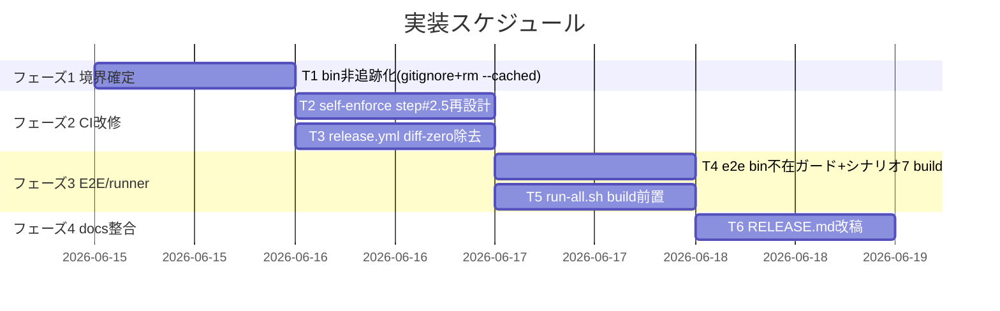
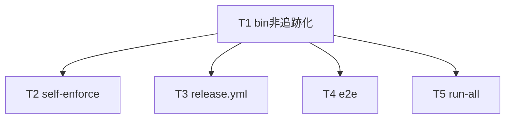

# 実装計画書: bin 生成物の gitignore 化と publish 時ビルド

**プロジェクト名**: bin 生成物の gitignore 化と publish 時ビルド
**作成日**: 2026 年 06 月 15 日
**最終更新**: 2026 年 06 月 15 日

> **重要**: **このドキュメントは常に更新**: 実装計画の変更、進捗状況の更新、バグの記録などがあった場合は、即座にこのドキュメントを更新してください。ドキュメントは「生きているドキュメント」として扱い、実装内容と常に同期させます。
> **必須項目**: 「必須」と明記した欄は空欄・抽象語のみで提出しないこと。テスト観点・BDD 仕様は具体ケースを 1 件以上記載すること。
>
> **用語**: [.agents/CONCEPTS.md §用語規約](../../../../.agents/CONCEPTS.md#用語規約) を参照。

---

## 1. 実装概要

### 1.1 実装方針（必須）

[02_設計](./02_設計.md) §3 の決定 A〜D に厳密に従い、生成物 `bin/agents-md.js` を git 非追跡化（`.gitignore` ＋ `git rm --cached`）し、配布・検証・CI の各経路を「使用前 build（build-before-use）」へ統一する。`package.json`・`tsconfig.json`・`verify-npm-pack.sh`・`COVERAGE_EXCEPTIONS.md` は **変更しない**（02 §9.4 #8〜#10）。

### 1.2 実装順序（必須: 1 件以上）

02 §9.4「実装順序の要点」に従い、①gitignore＋git rm --cached → ②CI（self-enforce/release）step 改修 → ③E2E/runner の build 前置・ガード → ④docs 整合 の 4 段で進める。各段は前段の bin 非追跡を前提に成立する。



---

## 2. タスク分解

**用語**: [.agents/CONCEPTS.md §用語規約](../../../../.agents/CONCEPTS.md#用語規約) を参照。

**必須**: 各タスクには **「テスト観点」（2.x.3）** と **「単体テスト仕様（BDD）」（2.x.4）** を必ず記載すること。テスト観点の定義は **[02_設計 §6](./02_設計.md)** および **RULES のテスト戦略・[TEST_BDD_FORMAT.md](../../../../.agents/TEST_BDD_FORMAT.md)** を参照し、本ドキュメントでは**タスクごとの具体ケース**のみ記載する。

### 2.1 タスク 1: bin 非追跡化（gitignore ＋ git rm --cached）

#### 2.1.1 概要（必須）

生成物 `bin/agents-md.js` を git 追跡から外し `.gitignore` 対象にし、正本／生成物の境界を機械的に確定する（SC1・SC6）。

#### 2.1.2 実装内容（必須: 1 件以上）

- `git rm --cached bin/agents-md.js`（ファイル実体はディスクに残す。commit はしない）。
- `.gitignore` に `/bin/agents-md.js` を追加。コメントで「`src/agents-md.ts` の tsc 生成物。publish/E2E/CI は使用直前に `npm ci && npm run build` で生成」の旨を明記。
- `src/agents-md.ts` は追跡のまま（変更しない）。

#### 2.1.3 テスト観点（必須）

**参照**: 観点の定義は [02_設計 §6](./02_設計.md) および [RULES のテスト戦略・TEST_BDD_FORMAT](../../../../.agents/RULES.md#テスト戦略必須要件) を参照。以下には**本タスクの具体ケース**のみ記載する。

##### 単体（本タスクの具体ケース・必須 1 件以上）

- 該当なし（git コマンドの実測 assert で検証＝結合観点）。

##### 結合/API（本タスクの具体ケース・該当時は必須 1 件以上）

- `git ls-files bin/` が空である（SC1）。
- `git check-ignore bin/agents-md.js` が `bin/agents-md.js` を返す（exit 0・SC1）。
- `git ls-files src/agents-md.ts` が非空（src 正本は追跡継続）。
- `git rm --cached` ＋ `.gitignore` 追加後に `npm run build` しても `git status --porcelain --untracked-files=no` に `bin/agents-md.js` が現れない（SC6・step#3 整合）。

##### E2E/受け入れ（本タスクの具体ケース・未達時は理由記載）

- 該当なし（境界確定は静的に検証。E2E は T4 で扱う）。

##### バリデーション（該当する場合の具体ケース）

- 該当なし。

#### 2.1.4 単体テスト仕様（BDD）（必須）

**BDD 形式のテストケース（高レベル仕様）**:

```gherkin
Feature: bin の非追跡化
  Scenario: bin が git 追跡から外れ .gitignore 対象になる（SC1）
    Given bin/agents-md.js が現在 git 追跡されている
    When git rm --cached bin/agents-md.js を行い .gitignore に /bin/agents-md.js を追加する
    Then git ls-files bin/ が空になる
    And git check-ignore bin/agents-md.js が bin/agents-md.js を返す
    And git ls-files src/agents-md.ts は非空のまま
  Scenario: src 変更で未ビルド bin がコミットされない（SC6）
    Given bin/agents-md.js が非追跡（.gitignore 済み）である
    When npm run build で bin を再生成し git status を確認する
    Then bin/agents-md.js は git status --porcelain --untracked-files=no に現れない
```

**テストコード例（必須: インラインコメントで Given/When/Then を明記）**

```bash
# Given: bin/agents-md.js が .gitignore 済みかつ非追跡である
git rm --cached bin/agents-md.js
# When: 検証コマンドを実行する
out_ls=$(git ls-files bin/)
git check-ignore bin/agents-md.js; rc=$?
# Then: ls-files が空・check-ignore がマッチ（exit 0）
[ -z "$out_ls" ] && [ "$rc" -eq 0 ] || exit 1
```

#### 2.1.5 依存関係

- なし（最初に実施する境界確定）。



#### 2.1.6 見積もり

- **工数**: 0.2h
- **優先度**: 高

### 2.2 タスク 2: self-enforce.yml step #2.5 再設計（diff-zero 除去）

#### 2.2.1 概要（必須）

step #2.5「CLI typecheck & build diff-zero」を「CLI typecheck & build」へ再設計し、無意味化する diff-zero 検証ブロックのみ除去する（02 §3.3）。

#### 2.2.2 実装内容（必須: 1 件以上）

- step 名を「CLI typecheck & build diff-zero (tsc)」→「CLI typecheck & build (tsc)」へ改名。
- `npm ci`／`npm run typecheck`／`npm run build` は **存続**。
- `git diff --exit-code -- bin/agents-md.js` の diff-zero 検証ブロックを **除去**。
- コメントを新方式（bin 非追跡・後続 step が REPO_ROOT/bin を前提）へ更新。
- step 順序（後続 #3 生成物差分ゼロ／#4 pack／#6 E2E より前に build が走る現状順）を維持。

#### 2.2.3 テスト観点（必須）

##### 単体（本タスクの具体ケース・必須 1 件以上）

- 該当なし（YAML 設定変更。静的検査＝結合観点で扱う）。

##### 結合/API（本タスクの具体ケース・該当時は必須 1 件以上）

- step に `git diff --exit-code -- bin/agents-md.js` が残っていない（grep 0 件）。
- step に `npm ci`・`npm run typecheck`・`npm run build` が残っている。
- 後続 step #3（生成物差分ゼロ）が build した bin で赤くならない（`--untracked-files=no`＋ignore で porcelain に bin 出ない・02 §3.3.2 実測）。

##### E2E/受け入れ（本タスクの具体ケース・未達時は理由記載）

- self-enforce 相当（`test/run-all.sh`・`verify-npm-pack.sh`・E2E）が green（SC5）。CI 実発火は orchestrator/push 後に確認。

##### バリデーション（該当する場合の具体ケース）

- 該当なし。

#### 2.2.4 単体テスト仕様（BDD）（必須）

```gherkin
Feature: 各経路でのビルド前置（CI）
  Scenario: step #2.5 を再設計した self-enforce 相当が green（SC5）
    Given self-enforce.yml から step #2.5 の diff-zero 検証が除去され typecheck & build が残る
    When build した bin で step #3（git status --porcelain --untracked-files=no）を確認する
    Then porcelain 出力に bin/agents-md.js が現れない（#3 が赤くならない）
    And step に git diff --exit-code -- bin/agents-md.js が残っていない
```

**テストコード例（必須: インラインコメントで Given/When/Then を明記）**

```bash
# Given: self-enforce.yml の step #2.5 が再設計済み
# When: diff-zero 検証が残っていないか grep する
n=$(grep -c 'git diff --exit-code -- bin/agents-md.js' .github/workflows/self-enforce.yml)
# Then: 0 件であること
[ "$n" -eq 0 ] || exit 1
```

#### 2.2.5 依存関係

- T1（bin 非追跡化）に依存。

#### 2.2.6 見積もり

- **工数**: 0.3h
- **優先度**: 高

### 2.3 タスク 3: release.yml の diff-zero 除去（build 維持）

#### 2.3.1 概要（必須）

publish 直前 build モデルを維持しつつ、「Build CLI bin & verify diff-zero」step から diff-zero 検証を除去する（02 §3.4.1）。

#### 2.3.2 実装内容（必須: 1 件以上）

- step 名「Build CLI bin & verify diff-zero (replaces prepack)」→「Build CLI bin (replaces prepack)」へ改名。
- `npm ci && npm run build` は **維持**。
- `git diff --exit-code bin/agents-md.js` の diff-zero 検証ブロックを **除去**。
- コメントを新方式（bin 非追跡・publish 直前 build で配布）へ更新。
- build → `verify-npm-pack.sh` → NPM_TOKEN ゲート → publish の順序を維持。marketplace job（B 系統）は bin 非依存のため変更しない。

#### 2.3.3 テスト観点（必須）

##### 単体（本タスクの具体ケース・必須 1 件以上）

- 該当なし（YAML 設定変更）。

##### 結合/API（本タスクの具体ケース・該当時は必須 1 件以上）

- npm-publish job に `git diff --exit-code bin/agents-md.js` が残っていない（grep 0 件）。
- npm-publish job に `npm ci`・`npm run build` が残っている。

##### E2E/受け入れ（本タスクの具体ケース・未達時は理由記載）

- 実 publish は範囲外（00 §5）のため CI 発火確認は行わない。静的検査で代替。

##### バリデーション（該当する場合の具体ケース）

- 該当なし。

#### 2.3.4 単体テスト仕様（BDD）（必須）

```gherkin
Feature: 各経路でのビルド前置（release）
  Scenario: release.yml の publish 前 build から diff-zero が除去される
    Given release.yml の npm-publish job が publish 前に build する
    When build step を確認する
    Then npm ci && npm run build が残っている
    And git diff --exit-code bin/agents-md.js が残っていない
```

**テストコード例（必須: インラインコメントで Given/When/Then を明記）**

```bash
# Given: release.yml の build step が再設計済み
# When: diff-zero 検証が残っていないか grep する
n=$(grep -c 'git diff --exit-code bin/agents-md.js' .github/workflows/release.yml)
# Then: 0 件であること
[ "$n" -eq 0 ] || exit 1
```

#### 2.3.5 依存関係

- T1（bin 非追跡化）に依存。

#### 2.3.6 見積もり

- **工数**: 0.2h
- **優先度**: 高

### 2.4 タスク 4: e2e-install-uninstall.sh の bin 不在ガード＋シナリオ7 build 前置

#### 2.4.1 概要（必須）

E2E スクリプトを bin 非追跡化に耐えるよう堅牢化する。bin 不在ガード（REPO_ROOT build 試行 or 明示 exit）と、シナリオ7 のクリーンツリー `$src` build 前置を追加する（02 §3.2）。

#### 2.4.2 実装内容（必須: 1 件以上）

- (a) スクリプト実行前（末尾の `[[ -f "$CLI" ]]` ガード相当箇所）で、`CLI`（=`$REPO_ROOT/bin/agents-md.js`）不在時に **REPO_ROOT で `npm run build`（node_modules があれば）を試み、なお不在なら分かりやすいエラーで exit** するガードへ強化する（02 §3.2.2-2「ガード方式（build を試みる）」を採用）。
- (b) シナリオ7（`test_no_dist_leak`）で `verify-npm-pack.sh` を呼ぶ前に、クリーンツリー `$src` で `npm ci && npm run build`（tmp 隔離内）してから検査する（02 §6.3 マッピング。required:bin を満たす）。既存の npm 不在 SKIP ガードは維持。

#### 2.4.3 テスト観点（必須）

##### 単体（本タスクの具体ケース・必須 1 件以上）

- 該当なし（bash スクリプトの結合/E2E 観点で検証）。

##### 結合/API（本タスクの具体ケース・該当時は必須 1 件以上）

- bin 不在ガードが node_modules ありなら build で自己回復し、build 不可なら exit 2 で停止する。
- シナリオ7 が `$src` で build 後に `verify-npm-pack.sh` を PASS させる（required:bin 充足）。

##### E2E/受け入れ（本タスクの具体ケース・未達時は理由記載）

- `bash test/e2e-install-uninstall.sh` が green（FAIL=0・SC4）。REPO_ROOT/bin が事前 build 済み前提（run-all.sh 前置 or 冒頭ガード）。

##### バリデーション（該当する場合の具体ケース）

- bin 不在かつ node_modules 不在時は明示エラーで exit（誤動作防止）。

#### 2.4.4 単体テスト仕様（BDD）（必須）

```gherkin
Feature: 各経路でのビルド前置（E2E）
  Scenario: E2E が事前 build 前提を満たし green になる（SC4）
    Given bin/agents-md.js が非追跡で REPO_ROOT に build 済み bin が存在する
    When bash test/e2e-install-uninstall.sh を実行する
    Then 全シナリオが PASS する（FAIL=0）
  Scenario: シナリオ7 がクリーンツリー build で verify-npm-pack を満たす
    Given $src クリーンツリーには bin が含まれない
    When シナリオ7 が $src で npm ci && npm run build してから verify-npm-pack.sh を呼ぶ
    Then required:bin が満たされ PASS する
```

**テストコード例（必須: インラインコメントで Given/When/Then を明記）**

```bash
# Given: REPO_ROOT に build 済み bin が存在する（run-all.sh 前置 or 冒頭ガード）
# When: E2E を実行する
bash test/e2e-install-uninstall.sh; rc=$?
# Then: 正常終了（FAIL=0）
[ "$rc" -eq 0 ] || exit 1
```

#### 2.4.5 依存関係

- T1（bin 非追跡化）に依存。

#### 2.4.6 見積もり

- **工数**: 0.5h
- **優先度**: 高

### 2.5 タスク 5: run-all.sh の E2E build 前置

#### 2.5.1 概要（必須）

ローカル一括 runner が E2E を呼ぶ前に REPO_ROOT で bin を用意する build 前置を追加し、REPO_ROOT/bin を保証する（02 §3.2.2-1・§9.4 #6）。

#### 2.5.2 実装内容（必須: 1 件以上）

- メインループで `e2e-install-uninstall` を呼ぶ **前に** REPO_ROOT で bin を用意する build 前置を追加（02 の指示通り）。bin 不在時のみ build（または冪等 build）でオーバーヘッドを抑える（02 §7.1）。
- 既存の test 順序・出力体裁・終了コード契約を壊さない最小変更にする。

#### 2.5.3 テスト観点（必須）

##### 単体（本タスクの具体ケース・必須 1 件以上）

- 該当なし（runner ラッパの結合観点で検証）。

##### 結合/API（本タスクの具体ケース・該当時は必須 1 件以上）

- E2E 実行前に REPO_ROOT/bin が存在する（build 前置が効く）。
- build 前置が既存テスト一覧（TESTS 正本）の順序・SKIP/FAIL 集計を壊さない。

##### E2E/受け入れ（本タスクの具体ケース・未達時は理由記載）

- `bash test/run-all.sh` が green（FAIL=0・SC5）。

##### バリデーション（該当する場合の具体ケース）

- 該当なし。

#### 2.5.4 単体テスト仕様（BDD）（必須）

```gherkin
Feature: 各経路でのビルド前置（runner）
  Scenario: run-all.sh が E2E 前に REPO_ROOT/bin を用意する（SC5）
    Given bin/agents-md.js が非追跡である
    When bash test/run-all.sh を実行する
    Then E2E 呼び出し前に REPO_ROOT で build され bin が存在する
    And 全テストが PASS/SKIP で FAIL=0（exit 0）
```

**テストコード例（必須: インラインコメントで Given/When/Then を明記）**

```bash
# Given: bin 非追跡（必要なら build 前置で生成される）
# When: runner を実行する
bash test/run-all.sh; rc=$?
# Then: FAIL=0（exit 0）
[ "$rc" -eq 0 ] || exit 1
```

#### 2.5.5 依存関係

- T1（bin 非追跡化）・T4（E2E 堅牢化）に依存。

#### 2.5.6 見積もり

- **工数**: 0.3h
- **優先度**: 高

### 2.6 タスク 6: RELEASE.md の §1.5/§5 改稿

#### 2.6.1 概要（必須）

「追跡 bin 差分ゼロ」前提の記述を「bin は非追跡・publish 直前 build で配布」へ改稿する（02 §3.4.2・§D）。

#### 2.6.2 実装内容（必須: 1 件以上）

- §1.5「publish 前ビルド（生成 bin の最新性担保）」を改稿: 「追跡物としてコミット済み」「差分ゼロを確認」「step #2.5 でも同じ差分ゼロを検証」を、「`bin/agents-md.js` は **非追跡（`.gitignore`）の生成物**であり publish 直前に `npm ci && npm run build` で作業ツリーに生成して配布する」へ改める。`git diff --exit-code bin/agents-md.js` 手順例を削除し build → pack 検査の流れへ更新。
- §5 #4「→ 追跡 bin 差分ゼロ検証」言及を「→ build（bin 生成）」へ更新。
- 「追跡 bin」前提の全記述を排除（01 シナリオ4-1）。

#### 2.6.3 テスト観点（必須）

##### 単体（本タスクの具体ケース・必須 1 件以上）

- grep: RELEASE.md に「追跡 bin」「差分ゼロ」を前提とする記述が残っていない。

##### 結合/API（本タスクの具体ケース・該当時は必須 1 件以上）

- 該当なし。

##### E2E/受け入れ（本タスクの具体ケース・未達時は理由記載）

- 該当なし（ドキュメント整合はテキスト検査で代替）。

##### バリデーション（該当する場合の具体ケース）

- 該当なし。

#### 2.6.4 単体テスト仕様（BDD）（必須）

```gherkin
Feature: ドキュメント・設定の整合
  Scenario: RELEASE.md が bin 非追跡・使用前 build と整合する（シナリオ4-1）
    Given bin が非追跡化され step #2.5 の diff-zero が除去された
    When docs/maintainer/RELEASE.md §1.5/§5 を確認する
    Then 「追跡 bin が src と差分ゼロ」を前提とした記述が残っていない
    And 「publish 直前に npm ci && npm run build して配布する」と記述されている
```

**テストコード例（必須: インラインコメントで Given/When/Then を明記）**

```bash
# Given: RELEASE.md 改稿済み
# When: 旧前提の語が残らないか grep する
n=$(grep -c 'git diff --exit-code bin/agents-md.js' docs/maintainer/RELEASE.md)
# Then: 0 件であること
[ "$n" -eq 0 ] || exit 1
```

#### 2.6.5 依存関係

- T1〜T3（bin 非追跡化・CI 改修）に依存（記述が新方式と整合するため）。

#### 2.6.6 見積もり

- **工数**: 0.3h
- **優先度**: 中

---

## テスト観点

本実装計画の各タスク §2.x.3 に具体ケースを記載した。全体としては、(1) git 境界（ls-files/check-ignore/porcelain）の結合 assert（T1・SC1/SC6）、(2) CI/release の static grep（T2/T3）、(3) E2E・runner の green（T4/T5・SC4/SC5）、(4) docs の grep 整合（T6・シナリオ4-1）で 01 の BDD シナリオ1-1〜4-1 を 1:1 で被覆する。自己検証は **すべて `mktemp -d` 隔離**で行い、本リポの追跡物・bin・`.gitignore` の追跡状態を破壊しない（02 §9.4 注記）。

---

## 単体テスト

本 issue は CI/ビルド構成変更でありアプリ単体テストは追加しない。検証は git コマンド・bash スクリプトの結合/E2E（既存 `test/e2e-install-uninstall.sh`・`test/run-all.sh`）で行う。新規テストスクリプトは追加せず、既存正本を堅牢化する最小変更に留める（02 §2.3 単一責務）。

---

## BDD

各タスク §2.x.4 に Given/When/Then を記載。01 の BDD シナリオ（1-1 bin 非追跡、1-2 未ビルド bin 非コミット、2-1 pack 健全性、2-2 exit127 回避、3-1 E2E、3-2 self-enforce、3-3 release、4-1 docs 整合）に対応する。

---

## 3. 実装スケジュール

### 3.1 マイルストーン

| マイルストーン | 期日 | 成果物 |
| -------------- | ---- | ------ |
| 境界確定（T1） | 2026-06-15 | `.gitignore` 更新・bin 追跡解除 |
| CI/E2E/docs 整合（T2〜T6） | 2026-06-15 | self-enforce/release/e2e/run-all/RELEASE.md 改修 |

### 3.2 実装フェーズ

#### フェーズ 1: 境界確定 ＋ 全経路整合

- **期間**: 同日
- **タスク**: T1 → (T2・T3) → (T4・T5) → T6

---

## 4. テスト計画

テスト観点・レベル・BDD 形式の定義は **[02_設計 §6](./02_設計.md)** および **RULES のテスト戦略・TEST_BDD_FORMAT** を参照。本実装計画では各タスクの §2.x.3 にタスクごとの具体ケース、§2.x.4 に BDD 仕様を記載した。

### 4.1 テストの優先順位

- クリティカル: SC1（bin 非追跡）・SC2/SC3（pack 健全性・exit127 回避）・SC4/SC5（E2E・runner green）を厚く実測。
- 回帰: 既存 E2E 全 14 シナリオ・run-all.sh 全テストが green であることを必ず確認する。

---

## 5. リスク管理

### 5.1 実装リスク

- **リスク**: REPO_ROOT で build して本リポの追跡物を汚す。
  - **対策**: bin は非追跡のため build しても git 差分ゼロ。`.agents/`・`.gitignore`・追跡物・並行 issue・`workflow.db` を変更しない（02 §3.2.2 注記）。
- **リスク**: シナリオ7 の `$src` build を入れると重く・npm 不在環境で壊れる。
  - **対策**: 既存 npm 不在 SKIP ガードを維持し、build は tmp 隔離 `$src` 内のみで実行。
- **リスク**: run-all.sh の build 前置が既存出力体裁・終了コード契約を壊す。
  - **対策**: TESTS 配列・集計ロジックは触れず、E2E 呼び出し直前の最小前置に限定する。

---

## 6. 参考資料

### プロジェクトドキュメント

- [`02_設計.md`](./02_設計.md) - 設計（A〜D の決定・§9.4 変更ファイル一覧）
- [`01_要件定義.md`](./01_要件定義.md) - 要件定義（BDD シナリオ）
- [`00_要求定義.md`](./00_要求定義.md) - 要求定義（SC1-6）

### その他の参考資料

- [.agents-project/自己拡張ワークフロー.md](../../../../.agents-project/自己拡張ワークフロー.md)（生成物は追跡しない）
- [docs/maintainer/RELEASE.md](../../RELEASE.md)、`.github/workflows/self-enforce.yml`・`release.yml`、`test/e2e-install-uninstall.sh`・`test/run-all.sh`、ルート `.gitignore`

---

## 7. 前のステップ

この実装計画書は、以下のドキュメントを基に作成されています：

- **前**: [`02_設計.md`](./02_設計.md) - 設計フェーズ

---

## 8. 次のステップ

この実装計画書の承認後、以下のいずれかのステップに進みます：

- **プロジェクトが 1 つの issue（またはタスク）である場合**: 実装フェーズ（execution）に直接進む

**用語**: [.agents/CONCEPTS.md §用語規約](../../../../.agents/CONCEPTS.md#用語規約) を参照。
