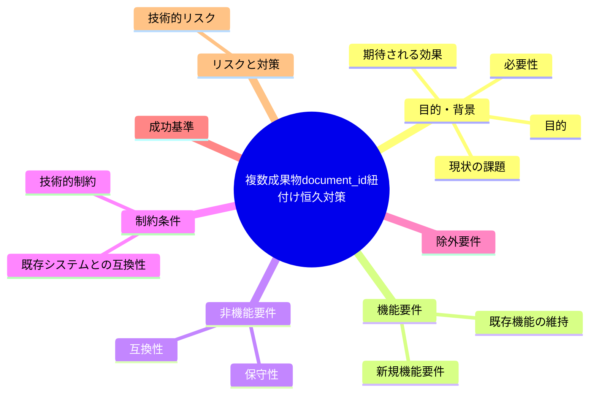
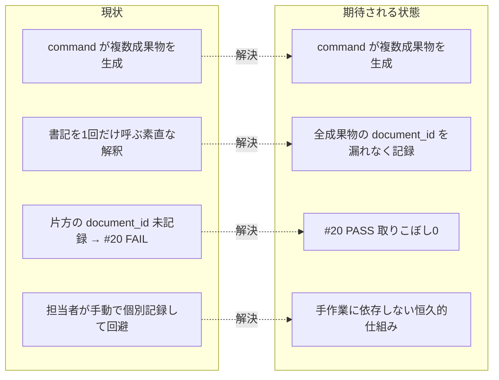

# 要求定義書: audit#20 の複数成果物 document_id 紐付け恒久対策

**プロジェクト名**: audit#20 の複数成果物 document_id 紐付け恒久対策
**作成日**: 2026 年 06 月 15 日
**最終更新**: 2026 年 06 月 15 日

> **重要**:
>
> - 要求定義書は、プロジェクトの全体像を把握するためのものです。詳細な技術仕様や実装方法は要件定義書以降で記載します。必要最低限の情報に収めることを心掛けてください。
> - **このドキュメントは常に更新**: 要求の変更や追加があった場合は、即座にこのドキュメントを更新してください。ドキュメントは「生きているドキュメント」として扱い、実装内容と常に同期させます。
> - **必須項目**: 以下の「必須」と明記した項目は空欄・抽象語のみで提出しないこと。判定可能な形（目的は1文・成功基準は○/×で判定できる記載等）で記入すること。
>
> **用語**: [.agents/CONCEPTS.md §用語規約](../../../../.agents/CONCEPTS.md#用語規約) を参照。

---

## 要求定義の全体像

**注意**:

- マインドマップは全体像を把握するためのものです。主要なセクション名程度に留め、詳細は記載しないでください。

---

## 1. 目的・背景

### 1.1 目的（必須）

1 command が生む全成果物の document_id を漏れなく workflow_log に記録する仕組みを定義する。

### 1.2 背景

- **現状の課題**:
  - audit#20（[.agents/enforcement/ci/audit.sh](../../../../.agents/enforcement/ci/audit.sh) の `check_document_id_linked`・599 行目〜）は、frontmatter に document_id を持つ成果ドキュメント 00/01/02/03/04 **それぞれ**について、workflow_log に同 document_id の行が 1 件以上あることを要求する（[.agents/enforcement/README.md](../../../../.agents/enforcement/README.md) §失敗条件 #20）。
  - 一方、書記スクリプト [.agents/scripts/write-workflow-log.sh](../../../../.agents/scripts/write-workflow-log.sh) は冒頭コメントのとおり **1 回 1 行 INSERT** 設計で、1 回の呼び出しで `DOCUMENT_ID` を **1 件しか記録しない**（INSERT 文・383 行目）。
  - requirement-discovery（[.agents/commands/requirement-discovery.md](../../../../.agents/commands/requirement-discovery.md)）は **1 command で 00_要求定義 と 01_要件定義 の 2 成果物**を生むが、skill chain の PROCESS は extract-goals → identify-assumptions → define-constraints → write-bdd の 4 step のみで write-workflow-log を含まず、末尾の注意書きも「**完了後に書記（write-workflow-log）に依頼して記録させること**」と**単数**で書かれている。書記を 1 回しか呼ばない素直な解釈では、00 か 01 のいずれか一方の document_id しか記録されず、もう一方が **未記録 → #20 FAIL** になる構造になっている。
  - design-feature（02+03）も同型（chain に write-workflow-log なし・注意書きは単数）。verify-and-close は chain に write-workflow-log を 1 step（step 5）だけ持ち、書記スキル（[.agents/skills/logging/write-workflow-log/SKILL.md](../../../../.agents/skills/logging/write-workflow-log/SKILL.md)・README.md）は `DOCUMENT_ID` を「任意・推奨」の**単一値**として渡す前提で書かれている。
  - 実証: 消費者ランタイム DB（`.workflow/workflow.db`）の直近の requirement-discovery 記録は、`20260615_114305_bin生成物のgitignore化` 等で 00 と 01 が**別々の行・別々の document_id**として記録されており、これは書記を成果物ごとに**手動で 2 回**呼んで #20 FAIL を回避した痕跡である。直前の issue でも verify 担当が 00–04 の document_id を**個別に記録して回避**しており、**恒久対策が存在しない**ことが裏付けられている。

- **必要性**:
  - 取りこぼしを各担当者の手作業（成果物の数だけ書記を手で呼ぶ）に依存している限り、見落としで #20 FAIL が再発し、CI を止める。仕組みとして全成果物の記録を保証する必要がある。
  - 監査要求（成果物ごとに document_id の証跡）と記録手段（1 回 1 件）のギャップを、規約・スキル・スクリプトのいずれかの層で恒久的に埋める必要がある。

### 1.3 期待される効果（必須: 1 件以上）

- **効果 1**: 複数成果物を生む command 実行後、当該 issue の**全成果物**の document_id が workflow_log に記録され、audit#20 が**取りこぼし 0**で PASS する（○/× 判定可能: 当該 issue の 00/01/02/03/04 の各 document_id について `SELECT COUNT(*) ... WHERE document_id=?` が全件 ≥1）。
- **効果 2**: 担当者が「成果物の数だけ書記を手で呼ぶ」運用を意識せずとも記録漏れが起きない（手作業依存の解消）。

**現状と期待される状態の比較**:

---

## 2. 機能要件

### 2.1 既存機能の維持（該当する場合）

- 単一成果物 command（design=02 のみを生む場合等）の従来どおりの 1 件記録。
- 既存の単発記録呼び出しインターフェース（`write-workflow-log.sh command summary dod_met ts_utc ...` ＋ `DOCUMENT_ID`/`DOCUMENT_PATH` 環境変数）。
- 既存の証跡因果チェーン（prev_hash/entry_hash・actor_role=scribe・parent_entry_id 等。#12–#19 監査）。
- document_id 不変（#20+: 同一 document_path に別 document_id を後から記録できない）。
- 既存 DB スキーマ（[.agents/ledger/schema.sql](../../../../.agents/ledger/schema.sql)）。

### 2.2 新規機能要件

- 複数成果物を生む command でも、当該 issue の**全成果物**の document_id が漏れなく workflow_log に記録される恒久的な仕組み。手段（書記スクリプトへのバッチ／複数 doc 記録モード追加・各 command の書記 step を成果物ごとに呼ぶ規約化・書記スキルへの「生成した全 document を記録する」明文化、またはその組み合わせ）は**設計フェーズで決定**する。本要求では「何が満たされるべきか」を成功基準として定義する。

---

## 3. 非機能要件

### 3.1 パフォーマンス

- 成果物数に比例した妥当な記録回数（1 issue あたり数件）で完了し、CI 監査時間に有意な悪化を与えないこと。

### 3.2 セキュリティ

- 記録は引き続き書記（AGENT_ROLE=scribe）のみが実行でき、書記以外からの workflow.db 書き込み禁止を維持すること。

### 3.3 互換性

- 既存の単発記録呼び出し・既存 DB スキーマを壊さないこと（後方互換）。
- 消費者ランタイム（`.workflow/` 配下運用）と本リポ自己拡張（`docs/maintainer/workflow/` 配下運用）の双方で同様に機能すること。

### 3.4 保守性

- 取りこぼし防止が「担当者の注意」ではなく仕組み（規約・スキル・スクリプトのいずれか）として表現され、再発を機械的に検出・防止できること。

---

## 4. 制約条件

### 4.1 技術的制約

- 書記スクリプトは 1 回 1 行 INSERT を基本とする現行設計を前提に拡張すること（既存呼び出しを破壊しない）。
- entry_hash/prev_hash の因果チェーン計算（[.agents/ledger/schema.md](../../../../.agents/ledger/schema.md) と同期）を壊さないこと。

### 4.2 既存システムとの互換性

- audit#20/#20+・#12–#19 の既存監査がそのまま PASS すること（回帰なし）。

### 4.3 移行期間・スケジュール

- 既存の `.workflow/workflow.db`（消費者ランタイム生成物・gitignore 対象）への破壊的マイグレーションを要求しないこと。

---

## 5. 除外要件

- audit#20 の判定ロジック自体（成果物ごとに 1 件以上を要求する仕様）の緩和・変更は対象外。本 issue は「記録側で全件を満たす」ことを目的とし、監査要求は維持する。
- document_id 付与のタイミング・UUID 採番ルール（00 新規作成時等）の変更は対象外。
- 04_review 両リスト（#27）など #20 以外の監査項目の変更は対象外。

---

## 6. 成功基準（必須: 1 件以上）

- **SC1**: requirement-discovery（00+01 生成）相当を実行後、audit#20 が 00 と 01 の**両 document_id** について PASS する（取りこぼし 0）。
- **SC2**: 単一成果物 command（例: design=02 のみ）でも従来どおり記録され #20 PASS（回帰なし）。
- **SC3**: 既存の証跡因果チェーン（prev_hash/entry_hash・actor_role=scribe・parent_entry_id 等の #12–#19 監査）を壊さない。
- **SC4**: document_id 不変（#20+: 同一 document_path に別 document_id を後から記録できない）を維持する。
- **SC5**: 後方互換（既存の単発記録呼び出し・既存 DB スキーマ）を壊さない。
- **SC6**: 仕組みは消費者ランタイム（`.workflow/` 配下運用）でも本リポ自己拡張（`docs/maintainer/workflow/` 配下運用）でも同様に機能する。

---

## 7. リスクと対策

### 7.1 技術的リスク

- **リスク**: バッチ／複数 doc 記録を導入する際、複数 INSERT 間で prev_hash の連結が崩れ #12–#19 の因果監査が FAIL する。
  - **対策**: 設計フェーズで、各 INSERT が直前の head を prev_hash として連結する既存の自動連結（write-workflow-log.sh の resolve_head_hash）の上に複数件記録を積む方式を検討し、隔離環境（`mktemp -d`）で #12–#19 と #20 を実測検証する。
- **リスク**: 後方互換を崩す（既存の単発呼び出しが新モードでしか動かなくなる）。
  - **対策**: 既存呼び出しシグネチャを維持し、複数件記録は追加経路（オプトイン）として設計する方針を SC5 で固定する。

### 7.2 スケジュールリスク

- **リスク**: 手段（スクリプト改修 vs 規約化 vs スキル明文化）の選択で設計が発散し長期化する。
  - **対策**: 本 00/01 で「満たすべき SC」を確定し、手段選択は設計フェーズの論点として 02 に集約する（本要求では手段を確定しない）。

---

## 8. 参考資料

### プロジェクトドキュメント

- [.agents/scripts/write-workflow-log.sh](../../../../.agents/scripts/write-workflow-log.sh) - 書記スクリプト（1 回 1 行 INSERT）
- [.agents/skills/logging/write-workflow-log/SKILL.md](../../../../.agents/skills/logging/write-workflow-log/SKILL.md) / [README.md](../../../../.agents/skills/logging/write-workflow-log/README.md) - 書記スキル
- [.agents/enforcement/ci/audit.sh](../../../../.agents/enforcement/ci/audit.sh) - #20/#20+ 実装（check_document_id_linked）
- [.agents/enforcement/README.md](../../../../.agents/enforcement/README.md) - #20/#20+ の定義
- [.agents/commands/requirement-discovery.md](../../../../.agents/commands/requirement-discovery.md) / [design-feature.md](../../../../.agents/commands/design-feature.md) / [verify-and-close.md](../../../../.agents/commands/verify-and-close.md) - 複数成果物を生む command
- [.agents/ledger/schema.sql](../../../../.agents/ledger/schema.sql) / [schema.md](../../../../.agents/ledger/schema.md) - DB スキーマ正本

### その他の参考資料

- 並行 issue: `docs/maintainer/workflow/20260615_055806_コア取り込み漏れ補完/`（本 issue では触れない）

---

## 9. 次のステップ

この要求定義書の承認後、以下のドキュメントを作成します：

- **次**: [`01_要件定義.md`](./01_要件定義.md) - 要件定義フェーズ
