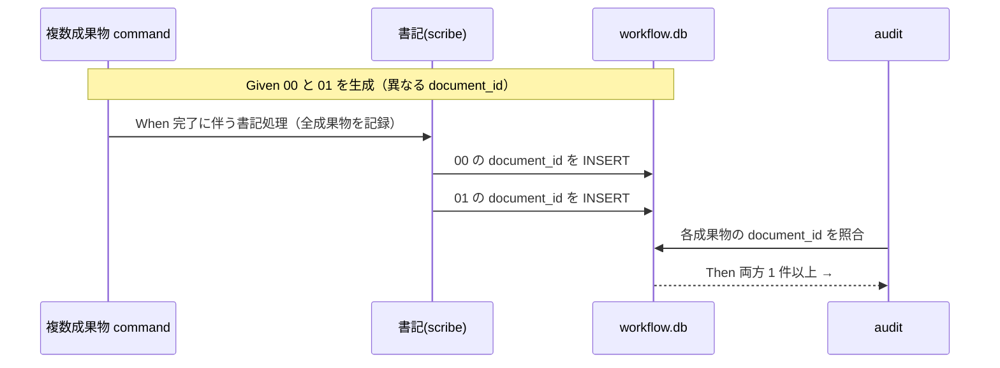

# 要件定義書: audit#20 の複数成果物 document_id 紐付け恒久対策

**プロジェクト名**: audit#20 の複数成果物 document_id 紐付け恒久対策
**作成日**: 2026 年 06 月 15 日
**最終更新**: 2026 年 06 月 15 日

> **重要**: **このドキュメントは常に更新**: 要件の変更や追加があった場合は、即座にこのドキュメントを更新してください。ドキュメントは「生きているドキュメント」として扱い、実装内容と常に同期させます。
>
> **用語**: [.agents/CONCEPTS.md §用語規約](../../../../.agents/CONCEPTS.md#用語規約) を参照。

---

## 1. 概要

### 1.1 システム概要

ワークフロー証跡基盤では、成果ドキュメント（00/01/02/03/04）の frontmatter に付与した `document_id` を、書記（scribe）が `workflow_log`（SQLite）に記録し、audit#20 が「frontmatter に document_id を持つ各成果ドキュメントについて、同 document_id の行が `workflow_log` に 1 件以上あること」を検証する。本要件は、**1 command が複数の成果物を生む**ケース（requirement-discovery=00+01、design-feature=02+03、verify-and-close が複数成果に言及する場合等）で、**全成果物の document_id が漏れなく記録される**恒久的仕組みを定義する。手段は設計フェーズで確定し、本書では満たすべき振る舞い（受け入れ基準・BDD）を規定する。

### 1.2 用語集

| 用語 | 説明 |
| -------- | ------ |
| 成果物 / 成果ドキュメント | frontmatter に document_id を持つ 00/01/02/03/04 の markdown。 |
| document_id | 成果ドキュメントごとに付与する UUID（8-4-4-4-12）。frontmatter に記載。 |
| 書記 / scribe | `AGENT_ROLE=scribe` で `write-workflow-log.sh` を実行し workflow.db に記録する役割。書記のみ書き込める。 |
| 複数成果物 command | 1 回の実行で 2 つ以上の成果ドキュメントを生む command（例: requirement-discovery が 00 と 01）。 |
| audit#20 | document_id 紐付け監査。各成果ドキュメントの document_id が workflow_log に 1 件以上あることを要求。 |
| audit#20+ | document_id 不変監査。同一 document_path に過去記録された document_id と異なる値への変更を FAIL。 |
| 因果チェーン | prev_hash/entry_hash・actor_role=scribe・delegated_by_role=orchestrator・parent_entry_id 等による #12–#19 の順序・整合監査。 |
| 取りこぼし | 生成された成果物の一部の document_id が workflow_log に記録されないこと。本 issue が解消する対象。 |

---

## 2. 機能要件

### 2.1 ユーザーストーリー

#### ストーリー 1: 複数成果物 command 後の全件記録（SC1）

- **As a** ワークフロー基盤の保守者
- **I want to** requirement-discovery のように 1 command で 00 と 01 の 2 成果物を生んだとき、両方の document_id が自動的に（手作業の繰り返しに依存せず）workflow_log に記録される
- **So that** audit#20 が取りこぼし 0 で PASS し、CI が記録漏れで止まらない

**受け入れ基準**:

- requirement-discovery 相当（00+01 生成）を実行した後、00 の document_id と 01 の document_id が**それぞれ** workflow_log に 1 件以上存在する。
- 00 と 01 のいずれか一方でも未記録の場合は不合格とする。

#### ストーリー 2: 単一成果物 command の回帰なし（SC2）

- **As a** ワークフロー基盤の保守者
- **I want to** 1 成果物のみを生む command（例: design が 02 のみ）でも従来どおり記録される
- **So that** 既存運用が新仕組みの導入で壊れない

**受け入れ基準**:

- 単一成果物 command 実行後、その 1 件の document_id が workflow_log に 1 件以上記録され #20 PASS。
- 新仕組みの導入によって単一件記録のインターフェース・挙動が変わらない。

#### ストーリー 3: 因果チェーンの維持（SC3）

- **As a** 監査担当者
- **I want to** 複数件記録しても prev_hash/entry_hash・actor_role=scribe・parent_entry_id 等の #12–#19 監査が壊れない
- **So that** 証跡の改ざん検出・順序保証が維持される

**受け入れ基準**:

- 複数件記録後、#12–#19 の因果・順序監査がすべて PASS する。
- 各記録行の actor_role が scribe、delegated_by_role が orchestrator であり、prev_hash が直前 head に連結される。

#### ストーリー 4: document_id 不変の維持（SC4）

- **As a** 監査担当者
- **I want to** 同一 document_path に対し、後から別の document_id を記録しようとすると拒否される
- **So that** document_id の改ざん（#20+）が防がれる

**受け入れ基準**:

- 既に document_id A が記録された document_path に対し document_id B で記録しようとすると、INSERT が拒否され（exit 1）audit#20+ も FAIL を検出する。
- 複数件記録経路でも、各 document_path × document_id の不変性が単発経路と同等に保たれる。

#### ストーリー 5: 後方互換（SC5）

- **As a** ワークフロー基盤の利用者
- **I want to** 既存の単発記録呼び出し（`write-workflow-log.sh command summary dod_met ts_utc ...` ＋ `DOCUMENT_ID`/`DOCUMENT_PATH`）と既存 DB スキーマがそのまま動く
- **So that** 既存の command・スクリプト・DB を作り直さずに済む

**受け入れ基準**:

- 既存の単発呼び出しシグネチャと環境変数が変更前と同じ結果を返す。
- 既存 `workflow.db` スキーマに対し破壊的マイグレーションを要求しない（必要な追加は後方互換な ADD COLUMN 等に限る）。

#### ストーリー 6: ランタイム共通性（SC6）

- **As a** パッケージ正本かつ自己拡張する消費者である本リポの保守者
- **I want to** 仕組みが消費者ランタイム（`.workflow/` 配下）でも本リポ自己拡張（`docs/maintainer/workflow/` 配下）でも同様に機能する
- **So that** 二役の運用で挙動が分岐しない

**受け入れ基準**:

- `.workflow/<issue>/` 配下の成果物でも `docs/maintainer/workflow/<issue>/` 配下の成果物でも、全成果物の document_id が記録され #20 PASS。
- 仕組みは特定の配置パスに依存しない（document_path はプロジェクトルート相対で扱う）。

### 2.2 BDD ユースケース

#### ユースケース 1: 複数成果物の全件記録（SC1）

requirement-discovery（00+01）のように 1 command が複数成果物を生むとき、全成果物の document_id を workflow_log に記録する。

**シナリオ 1: 00 と 01 の両 document_id が記録され #20 PASS**

```gherkin
Feature: 複数成果物の全件 document_id 記録
  Scenario: requirement-discovery 後に 00 と 01 の両方が記録される
    Given frontmatter に異なる document_id を持つ 00_要求定義.md と 01_要件定義.md を生成した
    And workflow.db には当該 issue の記録がまだ無い
    When 複数成果物 command の完了に伴う書記処理を実行する
    Then workflow_log に 00 の document_id の行が 1 件以上存在する
    And workflow_log に 01 の document_id の行が 1 件以上存在する
    And audit#20 が当該 issue について PASS する（取りこぼし 0）
```

**処理フロー**:



**シナリオ 2: 一方が未記録なら不合格として検出される**

```gherkin
Feature: 複数成果物の全件 document_id 記録
  Scenario: 00 のみ記録し 01 を取りこぼすと #20 が FAIL を返す
    Given 00 と 01 を生成し、00 の document_id だけを workflow_log に記録した
    When audit#20 を実行する
    Then 01 の document_id について「document has document_id but no workflow_log entry (#20)」を報告する
    And 監査が FAIL する
```

#### ユースケース 2: 単一成果物の回帰なし（SC2）

1 成果物のみを生む command では従来どおり 1 件記録し #20 PASS する。

**シナリオ 1: design=02 のみで従来どおり記録される**

```gherkin
Feature: 単一成果物の記録（回帰なし）
  Scenario: 02 のみを生む command で 1 件記録され #20 PASS
    Given frontmatter に document_id を持つ 02_設計.md を 1 つ生成した
    When 単一成果物の書記処理を実行する
    Then workflow_log に 02 の document_id の行が 1 件以上存在する
    And 単発記録のインターフェース・挙動が変更前と同一である
    And audit#20 が PASS する
```

#### ユースケース 3: 因果チェーンと不変性の維持（SC3・SC4）

複数件記録でも因果チェーンと document_id 不変を壊さない。

**シナリオ 1: 複数件記録後も #12–#19 が PASS する**

```gherkin
Feature: 因果チェーンの維持
  Scenario: 複数件記録後も prev_hash 連結・actor/role が保たれる
    Given 複数成果物の document_id を連続して記録した
    When 因果・順序監査（#12-#19）を実行する
    Then 各記録行の actor_role が scribe、delegated_by_role が orchestrator である
    And 各記録行の prev_hash が直前 head の entry_hash に連結している
    And #12-#19 がすべて PASS する
```

**シナリオ 2: 同一 document_path への別 document_id は拒否される（#20+）**

```gherkin
Feature: document_id 不変
  Scenario: 既存 document_path に別 document_id を記録しようとすると拒否される
    Given document_path P に document_id A が既に記録されている
    When 複数件記録経路で document_path P に document_id B を記録しようとする
    Then 記録が拒否される（exit 1 / INSERT 不成立）
    And audit#20+ が document_id mutation を FAIL として検出する
```

#### ユースケース 4: 後方互換とランタイム共通性（SC5・SC6）

既存呼び出し・既存スキーマを壊さず、両ランタイムで機能する。

**シナリオ 1: 既存の単発呼び出しが従来どおり成功する**

```gherkin
Feature: 後方互換
  Scenario: 既存シグネチャの単発呼び出しが変更前と同じ結果になる
    Given 変更前と同じ引数・環境変数で単発の書記呼び出しを行う
    When write-workflow-log を実行する
    Then 1 件の document_id が記録される
    And 既存 DB スキーマに破壊的マイグレーションを要求しない
```

**シナリオ 2: 両ランタイムの配置で同様に機能する**

```gherkin
Feature: ランタイム共通性
  Scenario: .workflow と docs/maintainer/workflow の双方で #20 PASS
    Given 成果物が .workflow/<issue>/ 配下、または docs/maintainer/workflow/<issue>/ 配下にある
    When 複数成果物の書記処理を実行する
    Then どちらの配置でも全成果物の document_id が記録される
    And audit#20 が双方で PASS する（配置パスに依存しない）
```

### 2.3 ビジネスルール

- workflow.db への書き込みは書記（AGENT_ROLE=scribe）のみが行う。
- document_id は成果ドキュメントごとに 1 つ。複数成果物 command では、生成した**全成果物の document_id を漏れなく**記録する。
- 監査要求（#20 が成果物ごとに 1 件以上）は緩和しない。記録側で全件を満たす。
- 取りこぼし防止は担当者の注意ではなく仕組み（規約・スキル・スクリプトのいずれか）として表現する。手段は設計フェーズで確定する。

---

## 3. 非機能要件

### 3.1 パフォーマンス要件

- 1 issue あたりの記録回数は成果物数に比例（数件程度）し、CI 監査時間に有意な悪化を与えない。

### 3.2 セキュリティ要件

- 書記以外からの workflow.db 書き込みを引き続き禁止する（AGENT_ROLE ガードの維持）。

### 3.3 ユーザビリティ要件

- 担当者が成果物の数を数えて手で書記を繰り返さなくても、command の標準手順に従うだけで全件が記録される。

### 3.4 可用性要件

- 複数件記録の途中で 1 件が失敗しても、失敗が検出可能であり（exit 1 等）、原因（どの document_id/document_path か）が分かる。

---

## 4. 外部インターフェース要件

### 4.1 API 要件

- 既存の `write-workflow-log.sh` 単発呼び出し（位置引数 `command summary dod_met ts_utc [issue_path] [changed_files]` ＋ 環境変数 `DOCUMENT_ID`/`DOCUMENT_PATH`/`ISSUE_ID` 等）を後方互換に保つ。
- 複数件記録の追加経路を設ける場合は、既存単発経路と排他にせず、オプトインの追加とする（具体形は設計で決定）。

### 4.2 データ形式要件

- document_id は UUID（8-4-4-4-12）。document_path はプロジェクトルート相対パス。
- 既存 `workflow.db` スキーマ（[.agents/ledger/schema.sql](../../../../.agents/ledger/schema.sql)）に従う。

---

## 5. 制約事項

- **実装フェーズではない**。本フェーズはコード変更・git 操作・DB 書き込みを行わない。実測確認が必要な場合は `mktemp -d` 隔離で行い、本リポ追跡物・`.workflow/workflow.db` を変更しない（[.agents-project/自己拡張ワークフロー.md](../../../../.agents-project/自己拡張ワークフロー.md) §テストの tmp 隔離）。
- entry_hash/prev_hash の計算定義（[.agents/ledger/schema.md](../../../../.agents/ledger/schema.md) と同期）を壊さない。
- audit#20 の判定ロジック緩和は対象外（記録側で満たす）。
- 並行 issue `docs/maintainer/workflow/20260615_055806_コア取り込み漏れ補完/` には触れない。

---

## 6. 参考資料

### プロジェクトドキュメント

- [`00_要求定義.md`](./00_要求定義.md) - 要求定義
- [.agents/scripts/write-workflow-log.sh](../../../../.agents/scripts/write-workflow-log.sh) - 書記スクリプト（1 回 1 行 INSERT）
- [.agents/skills/logging/write-workflow-log/SKILL.md](../../../../.agents/skills/logging/write-workflow-log/SKILL.md) - 書記スキル
- [.agents/enforcement/ci/audit.sh](../../../../.agents/enforcement/ci/audit.sh) - #20/#20+ 実装
- [.agents/enforcement/README.md](../../../../.agents/enforcement/README.md) - #20/#20+ の定義

### その他の参考資料

- [.agents/ledger/schema.sql](../../../../.agents/ledger/schema.sql) / [schema.md](../../../../.agents/ledger/schema.md)
- [.agents/commands/requirement-discovery.md](../../../../.agents/commands/requirement-discovery.md) / [design-feature.md](../../../../.agents/commands/design-feature.md) / [verify-and-close.md](../../../../.agents/commands/verify-and-close.md)

---

## 7. 前のステップ

この要件定義書は、以下のドキュメントを基に作成されています：

- **前**: [`00_要求定義.md`](./00_要求定義.md) - 要求定義フェーズ

---

## 8. 次のステップ

この要件定義書の承認後、以下のドキュメントを作成します：

- **次**: [`02_設計.md`](./02_設計.md) - 設計フェーズ
