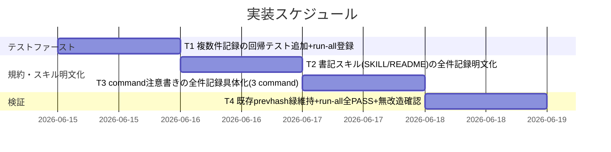
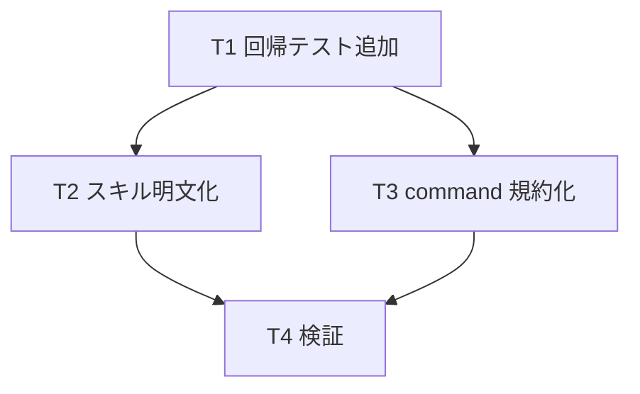

# 実装計画書: audit#20 の複数成果物 document_id 紐付け恒久対策

**プロジェクト名**: audit#20 の複数成果物 document_id 紐付け恒久対策
**作成日**: 2026 年 06 月 15 日
**最終更新**: 2026 年 06 月 15 日

> **重要**: **このドキュメントは常に更新**: 実装計画の変更、進捗状況の更新、バグの記録などがあった場合は、即座にこのドキュメントを更新してください。ドキュメントは「生きているドキュメント」として扱い、実装内容と常に同期させます。
> **必須項目**: 「必須」と明記した欄は空欄・抽象語のみで提出しないこと。テスト観点・BDD 仕様は具体ケースを 1 件以上記載すること。
>
> **用語**: [.agents/CONCEPTS.md §用語規約](../../../../.agents/CONCEPTS.md#用語規約) を参照。

---

## 1. 実装概要

### 1.1 実装方針（必須）

02_設計の決定（手段 (b) 規約化＋(c) スキル明文化を主、(a) スクリプト改造は不採用）に厳密に従う。`write-workflow-log.sh`・`schema.sql` は**無改造**とし、「1 command が複数成果物を生む場合、成果物ごとに書記を 1 回ずつ呼ぶ」ことを**回帰テスト（テストファースト・非配布）**・**書記スキル明文化**・**command 規約化**で恒久化する。#20 本体（document_id 紐付け）は一切緩めない。

### 1.2 実装順序（必須: 1 件以上）

02 §13「実装順序の申し送り」に従い、テストファーストで進める。



**T0（#20s 補助監査）の採否**: 02 §3.1.1 で「任意採用（推奨）」かつ「03 で採否確定」、本 issue 受領指示で「判断に迷う場合は #20 本体不変を最優先し、補助監査は見送って『将来課題』と記す（スコープ最小化）」とされている。**本 03 では #20s 補助監査を見送る（不採用）**。理由は §5.2 に記載し、`audit.sh`・`enforcement/README.md` は**変更しない**。

---

## 2. タスク分解

**用語**: [.agents/CONCEPTS.md §用語規約](../../../../.agents/CONCEPTS.md#用語規約) を参照。

**必須**: 各タスクには **「テスト観点」（2.x.3）** と **「単体テスト仕様（BDD）」（2.x.4）** を必ず記載すること。観点の定義は **02_設計 §6** および **[RULES のテスト戦略・TEST_BDD_FORMAT](../../../../.agents/RULES.md#テスト戦略必須要件)** を参照し、本ドキュメントでは**タスクごとの具体ケース**のみ記載する。

### 2.1 タスク 1: 複数件記録の回帰テスト追加（テストファースト・非配布）

#### 2.1.1 概要（必須）

複数成果物 command が成果物ごとに書記を 1 回ずつ呼ぶ経路を tmp 隔離で検証する回帰テスト `test/test-write-workflow-log-multidoc.sh` を新設し、`test/run-all.sh` の TESTS 一覧に登録する。

#### 2.1.2 実装内容（必須: 1 件以上）

- `test/test-write-workflow-log-multidoc.sh` を新規追加（既存 `test/test-write-workflow-log-prevhash.sh` の作法に倣う。`mktemp -d`＋`PROJECT_ROOT` を tmp に向け、本番 `.workflow/workflow.db` 非破壊を事前/事後計測）。
- `test/run-all.sh` の `default_tests`（TESTS 一覧の正本）に `test-write-workflow-log-multidoc|test-write-workflow-log-multidoc.sh|bash sqlite3` を `test-write-workflow-log-prevhash` の直後に追加。冒頭の依存マトリクス・コメントにも 1 行追記。
- 検証項目（M1〜M4）:
  - **M1**: 00（doc_id A）+01（doc_id B）を成果物ごとに記録すると、行2(01).prev_hash == 行1(00).entry_hash（CHAIN_OK）・中間 NULL なし。
  - **M2**: 両 document_id が #20 相当（`SELECT COUNT(*) ≥ 1`）PASS。N=4（00/01/02/03）でも全件 #20 PASS かつ連結破れ 0。
  - **M3**: 同一 document_path に別 document_id を後追い記録すると exit 1 で拒否（#20+ 維持・行が増えない）。同一 path 同一 id の再記録は許容（exit 0）。
  - **M4**: 両ランタイム（`.workflow/<issue>/00` と `docs/maintainer/workflow/<issue>/00`）のルート相対 document_path でいずれも #20 PASS、document_path はルート相対のまま保存（`./`・絶対化されない）。

#### 2.1.3 テスト観点（必須）

**参照**: 観点の定義は [02_設計 §6](./02_設計.md) および [RULES のテスト戦略・TEST_BDD_FORMAT](../../../../.agents/RULES.md#テスト戦略必須要件) を参照。以下には**本タスクの具体ケース**のみ記載する。

##### 単体（本タスクの具体ケース・必須 1 件以上）

- 正常系: 00+01 を成果物ごとに記録 → 行2.prev_hash == 行1.entry_hash（M1）。
- 境界値: N=4（00/01/02/03）連結 → 全行が直前 entry_hash に連結（連結破れ 0・M2）。

##### 結合/API（本タスクの具体ケース・該当時は必須 1 件以上）

- 正常系: 全 document_id が `COUNT(*) ≥ 1`（audit#20 の SELECT と同型・M2）。
- 異常系: 同一 document_path 別 document_id → `write-workflow-log.sh` が exit 1（#20+・M3）。
- ランタイム差: `.workflow/...` と `docs/maintainer/workflow/...` の双方で #20 PASS（M4）。

##### E2E/受け入れ（本タスクの具体ケース・未達時は理由記載）

- E2E 該当なし（スクリプト/規約のみ。画面・常駐サービスなし）。`bash test/run-all.sh` 全 PASS を受け入れの代替証跡とする。

##### バリデーション（該当する場合の具体ケース）

- DOCUMENT_PATH はルート相対表記のまま保存される（`./`・絶対パスにしない）ことを M4 で検証。

#### 2.1.4 単体テスト仕様（BDD）（必須）

**BDD 形式のテストケース（高レベル仕様）**:

```gherkin
Feature: 複数成果物の全件記録（成果物ごとに書記 1 回）
  Scenario: 00 と 01 を成果物ごとに記録すると prev_hash が連結する
    Given クリーン一時環境（PROJECT_ROOT=tmp）に 00（document_id A）を PREV_HASH 未指定で記録した
    When 続けて 01（document_id B）を PREV_HASH 未指定で記録する
    Then 行2(01) の prev_hash が 行1(00) の entry_hash に一致し、中間 NULL entry が存在しない

  Scenario: 同一 document_path に別 document_id を後追い記録すると拒否される
    Given 00（document_path P・document_id A）を記録済みである
    When 同一 document_path P に別の document_id を記録しようとする
    Then write-workflow-log.sh が exit 1 で拒否し、workflow_log の行数は増えない
```

**テストコード例（必須: インラインコメントで Given/When/Then を明記）**

実装はシェルスクリプト（bash）。`test/test-write-workflow-log-multidoc.sh` の実コードに Given/When/Then のインラインコメントを記載済み。抜粋:

```bash
m1_chain() {
  # Given: クリーン一時環境。00（doc_id A・path .../00）を PREV_HASH 未指定で記録
  local TMP; TMP="$(mktemp -d)"; local DB="$TMP/.workflow/workflow.db"
  record_doc "$TMP" "11111111-..." ".workflow/<issue>/00_要求定義.md" "00 entry" >/dev/null
  # When: 続けて 01（doc_id B・path .../01）も PREV_HASH 未指定で記録（自動連結）
  record_doc "$TMP" "22222222-..." ".workflow/<issue>/01_要件定義.md" "01 entry" >/dev/null
  # Then: 行2(01) の prev_hash = 行1(00) の entry_hash、かつ中間 NULL entry なし（CHAIN_OK）
  assert_eq "$p2" "$e1" "M1 01 の prev_hash = 00 の entry_hash"
  assert_eq "$nulls" "0" "M1 中間 NULL entry が存在しない"
}
```

#### 2.1.5 依存関係

- 先行: なし（テストファースト。T2/T3 より先に作成）。



#### 2.1.6 見積もり

- **工数**: 1.5h
- **優先度**: 高

### 2.2 タスク 2: 書記スキルの全件記録明文化（手段 c）

#### 2.2.1 概要（必須）

`write-workflow-log` スキルに「1 command が複数成果物を生んだ場合、生成・更新した全 document を成果物ごとに 1 回ずつ記録する（取りこぼし禁止・DOCUMENT_PATH はルート相対）」を明文化し、単数解釈を機構的に排除する。

#### 2.2.2 実装内容（必須: 1 件以上）

- [.agents/skills/logging/write-workflow-log/SKILL.md](../../../../.agents/skills/logging/write-workflow-log/SKILL.md) 手順 2 に DOCUMENT_PATH を追記し、「複数成果物は全件・成果物ごとに 1 回ずつ記録（n 件なら n 回）・PREV_HASH 未指定で自動連結・単数解釈禁止」「DOCUMENT_PATH は両ランタイム共通でルート相対に統一」のサブ項目を追記。
- [.agents/skills/logging/write-workflow-log/README.md](../../../../.agents/skills/logging/write-workflow-log/README.md) の手順 2 に同趣旨を反映。

#### 2.2.3 テスト観点（必須）

##### 単体（本タスクの具体ケース・必須 1 件以上）

- 文言照合: SKILL.md / README.md に「全件・成果物ごとに 1 回」「単数解釈禁止」「DOCUMENT_PATH ルート相対」が存在すること（grep / 目視）。

##### 結合/API（本タスクの具体ケース・該当時は必須 1 件以上）

- 該当なし（ドキュメント追記のみ。挙動の結合は T1 の回帰テストが担保）。

##### E2E/受け入れ（本タスクの具体ケース・未達時は理由記載）

- 該当なし（ドキュメント。受け入れは文言整合の目視/grep）。

##### バリデーション（該当する場合の具体ケース）

- 追記中のリンク・参照（SKILL.md 自身を指す相互参照を含む）が実在すること。audit#26（コメント外部参照）対象は src/app/components のソースコードのみで、`.agents/` ドキュメントは対象外（誤検出しない）。

#### 2.2.4 単体テスト仕様（BDD）（必須）

```gherkin
Feature: 書記スキルの全件記録明文化
  Scenario: 複数成果物の記録手順が単数解釈を排除している
    Given write-workflow-log の SKILL.md を読む
    When 手順 2 の記録規約を確認する
    Then 「生成・更新した全成果物のそれぞれについて 1 回ずつ記録（n 件なら n 回）」と「単数解釈の禁止」が明記されている
```

```bash
# Given: SKILL.md を対象にする
# When: 全件記録・単数解釈禁止の文言を grep する
# Then: 1 件以上ヒットする（明文化済み）
grep -q "成果物ごとに 1 回ずつ" .agents/skills/logging/write-workflow-log/SKILL.md
```

#### 2.2.5 依存関係

- 先行: T1（テストファースト）。

#### 2.2.6 見積もり

- **工数**: 0.5h
- **優先度**: 高

### 2.3 タスク 3: command 注意書きの全件記録具体化（手段 b）

#### 2.3.1 概要（必須）

複数成果物を生む command の末尾「書記依頼」注意書きを、「当該 command が生成・更新した全成果物それぞれについて DOCUMENT_ID/DOCUMENT_PATH を渡して記録させる」へ具体化し、単数表現を是正する。

#### 2.3.2 実装内容（必須: 1 件以上）

- [.agents/commands/requirement-discovery.md](../../../../.agents/commands/requirement-discovery.md): 「完了後に書記に依頼」へ「00 と 01 など全成果物それぞれを 1 回ずつ記録・単数解釈禁止」を追記し、SKILL.md へリンク。
- [.agents/commands/design-feature.md](../../../../.agents/commands/design-feature.md): 02 と 03 を対象に同趣旨を追記。
- [.agents/commands/verify-and-close.md](../../../../.agents/commands/verify-and-close.md): step 5 の書記注意書き（§入出力の受け渡し）に「04_review に加え複数成果ドキュメントを作成・更新した場合は全件を 1 回ずつ記録」を追記。

#### 2.3.3 テスト観点（必須）

##### 単体（本タスクの具体ケース・必須 1 件以上）

- 文言照合: 3 command の末尾注意書きに「全成果物それぞれ」「1 回ずつ」「単数解釈は禁止」が存在すること（grep / 目視）。

##### 結合/API（本タスクの具体ケース・該当時は必須 1 件以上）

- 該当なし（規約文言。挙動は T1 の回帰テストが担保）。

##### E2E/受け入れ（本タスクの具体ケース・未達時は理由記載）

- 該当なし（ドキュメント）。

##### バリデーション（該当する場合の具体ケース）

- 追記したリンク `../skills/logging/write-workflow-log/SKILL.md` が 3 command いずれからも実在解決すること。

#### 2.3.4 単体テスト仕様（BDD）（必須）

```gherkin
Feature: command 規約の全件記録具体化
  Scenario: requirement-discovery の書記注意書きが全成果物記録を指示する
    Given requirement-discovery.md の「実行時の注意」を読む
    When 書記依頼の項目を確認する
    Then 「生成・更新した全成果物それぞれについて 1 回ずつ記録」と単数解釈の禁止が明記されている
```

```bash
# Given: requirement-discovery.md を対象にする
# When: 全成果物それぞれの記録指示を grep する
# Then: 1 件以上ヒットする
grep -q "生成・更新した全成果物それぞれ" .agents/commands/requirement-discovery.md
```

#### 2.3.5 依存関係

- 先行: T1（テストファースト）。

#### 2.3.6 見積もり

- **工数**: 0.5h
- **優先度**: 高

### 2.4 タスク 4: 検証（既存緑維持・run-all 全 PASS・無改造確認）

#### 2.4.1 概要（必須）

新テスト単体・`run-all.sh` 全体・既存 prevhash テストの緑、`write-workflow-log.sh`/`schema.sql` 無改造、ドキュメント追記の整合を tmp 隔離・git diff で自己検証する（最終判定は orchestrator が独立再実測）。

#### 2.4.2 実装内容（必須: 1 件以上）

- `bash test/test-write-workflow-log-multidoc.sh` 単体 PASS。
- `bash test/run-all.sh` 全 PASS（新テスト登録込み・既存 prevhash 16/16 含む）。
- `git diff --stat -- .agents/scripts/write-workflow-log.sh .agents/ledger/schema.sql` が空（無改造）。
- 追記文言・リンクの実在を確認。

#### 2.4.3 テスト観点（必須）

##### 単体（本タスクの具体ケース・必須 1 件以上）

- 新テストの全アサーション PASS（FAIL=0）。

##### 結合/API（本タスクの具体ケース・該当時は必須 1 件以上）

- `run-all.sh` の終了コード 0（FAIL=0）。

##### E2E/受け入れ（本タスクの具体ケース・未達時は理由記載）

- `run-all.sh` が全テストを束ねて緑（受け入れの代替証跡）。

##### バリデーション（該当する場合の具体ケース）

- `write-workflow-log.sh`・`schema.sql` の diff が空であること（後方互換の機械的証左）。

#### 2.4.4 単体テスト仕様（BDD）（必須）

```gherkin
Feature: 回帰なしの自己検証
  Scenario: スクリプト無改造のまま新旧テストが緑
    Given 本 issue の変更（テスト追加・ドキュメント追記）を working tree に持つ
    When test/run-all.sh を実行し、write-workflow-log.sh と schema.sql の git diff を取る
    Then run-all.sh は exit 0（FAIL=0）で、両スクリプトの diff は空である
```

```bash
# Given: working tree に本 issue の変更がある
# When: 既存 prevhash テストと無改造判定を実行する
# Then: prevhash 16/16 緑かつ両スクリプトの diff が空
bash test/test-write-workflow-log-prevhash.sh
git diff --stat -- .agents/scripts/write-workflow-log.sh .agents/ledger/schema.sql   # 空であること
```

#### 2.4.5 依存関係

- 先行: T1・T2・T3。

#### 2.4.6 見積もり

- **工数**: 0.5h
- **優先度**: 高

---

## テスト観点

複数成果物 command が「成果物ごとに 1 回ずつ記録」しても (i) prev_hash 因果チェーンが壊れない（#12–#19 相当）、(ii) 全 document_id が #20 PASS（取りこぼし 0）、(iii) #20+（同一 path 別 id 拒否）が維持、(iv) 両ランタイムのルート相対 document_path で #20 PASS、を tmp 隔離の新規回帰テストで担保する。規約・スキルの文言整合は grep / 目視で確認する。既存 prevhash テスト 16/16 緑と `write-workflow-log.sh`/`schema.sql` 無改造を後方互換の証跡とする。

## 単体テスト

- `test/test-write-workflow-log-multidoc.sh`（M1〜M4・本番 DB 非破壊計測込み）。
- 既存 `test/test-write-workflow-log-prevhash.sh`（緑維持＝回帰なし）。
- いずれも `mktemp -d`＋`PROJECT_ROOT` を tmp に向けた tmp 隔離で実行（本番 `.workflow/workflow.db` 非破壊）。

## BDD

- 各タスク §2.x.4 の Given/When/Then を正とする。テストコードのインラインコメントは [TEST_BDD_FORMAT.md](../../../../.agents/TEST_BDD_FORMAT.md) に従う。

---

## 3. 実装スケジュール

### 3.1 マイルストーン

| マイルストーン | 期日 | 成果物 |
| -------------- | ---- | ------ |
| M1: テスト追加・登録 | 2026-06-15 | `test/test-write-workflow-log-multidoc.sh`・`test/run-all.sh` 更新 |
| M2: 規約・スキル明文化 | 2026-06-15 | SKILL.md/README.md・3 command の追記 |
| M3: 自己検証完了 | 2026-06-15 | run-all 全 PASS・無改造 diff 空の実測ログ |

### 3.2 実装フェーズ

#### フェーズ 1: テストファースト

- **期間**: 当日
- **タスク**: T1

#### フェーズ 2: 規約・スキル明文化

- **期間**: 当日
- **タスク**: T2・T3

#### フェーズ 3: 検証

- **期間**: 当日
- **タスク**: T4

---

## 4. テスト計画

観点・レベル・BDD 形式の定義は **02_設計 §6** および **[RULES のテスト戦略・TEST_BDD_FORMAT](../../../../.agents/RULES.md#テスト戦略必須要件)** を参照。各タスク §2.x.3 にタスクごとの具体ケース、§2.x.4 に BDD 仕様を記載した。

### 4.1 テストの優先順位

- クリティカル（prev_hash 連結・#20 全件 PASS・#20+ 拒否）は M1〜M3 で厚くテストする。
- 影響範囲が広い `write-workflow-log.sh` は**無改造**とし、既存 prevhash テストを回帰の防波堤として緑維持する。

---

## 5. リスク管理

### 5.1 実装リスク

- **リスク**: ドキュメント追記が単数解釈を残し取りこぼしが再発する。
  - **対策**: SKILL/README/3 command すべてに「成果物ごとに 1 回ずつ・n 件なら n 回・単数解釈禁止」を明示。挙動面は T1 の #20 全件 PASS テストで機械的に固定。
- **リスク**: スクリプト改造で後方互換が崩れる。
  - **対策**: 02 の決定どおり `write-workflow-log.sh`/`schema.sql` を無改造とし、git diff 空・既存 prevhash 16/16 緑を完了条件にする。

### 5.2 #20s 補助監査の見送り（将来課題）

- **決定**: 02 §3.1.1 で #20s（宣言成果物数 vs 記録件数の突合）は「任意採用（推奨）・03 で採否確定」とされ、本 issue 受領指示は「判断に迷う場合は #20 本体不変を最優先し補助監査は見送り、将来課題と記す（スコープ最小化）」を明示している。
- **理由**:
  1. **スコープ最小化と #20 本体不変の最優先**: #20s は #20 と機能的に冗長（漏れは #20 が既に FAIL 検出する）であり、追加すると `audit.sh` に新ロジック（成果物列挙と件数突合）を持ち込み、#20 本体へ意図せず影響を与えるリスクが生じる。本 issue の核心目的（複数成果物の全件記録の恒久化）は手段 (b)+(c) と T1 回帰テストで完全に満たせ、#20s なしでも取りこぼしは #20 が CI で機械検出する（安全側）。
  2. **後方互換最優先**: `audit.sh` は配布物であり、補助チェック追加は消費者ランタイムの監査挙動に波及する。本 issue では非破壊（規約・スキル・テストのみ）に留める。
- **結果**: `audit.sh`・`enforcement/README.md` は本 issue で**変更しない**。#20s は「将来課題」として、漏れ原因（何件中何件）の可視化が必要になった時点で別 issue で #20 本体不変を保ったまま追加する。

---

## 6. 参考資料

### プロジェクトドキュメント

- [`02_設計.md`](./02_設計.md) - 設計（実装の正本・手段 b/c の決定）
- [`01_要件定義.md`](./01_要件定義.md) - 要件定義（SC1–SC6）
- [`00_要求定義.md`](./00_要求定義.md) - 要求定義

### その他の参考資料

- [.agents/scripts/write-workflow-log.sh](../../../../.agents/scripts/write-workflow-log.sh) - 書記スクリプト（**無改造対象**）
- [.agents/ledger/schema.sql](../../../../.agents/ledger/schema.sql) - DB スキーマ（**無改造対象**）
- [.agents/enforcement/ci/audit.sh](../../../../.agents/enforcement/ci/audit.sh) - #20/#20+（**本 issue では不変**）
- [test/test-write-workflow-log-prevhash.sh](../../../../test/test-write-workflow-log-prevhash.sh) - 既存回帰テスト（緑維持対象・作法の手本）
- [.agents/TEST_BDD_FORMAT.md](../../../../.agents/TEST_BDD_FORMAT.md) - BDD 記法

---

## 7. 前のステップ

この実装計画書は、以下のドキュメントを基に作成されています：

- **前**: [`02_設計.md`](./02_設計.md) - 設計フェーズ

---

## 8. 次のステップ

この実装計画書の承認後、以下のいずれかのステップに進みます：

- **プロジェクトが 1 つの issue（またはタスク）である場合**: 実装フェーズ（execution）に直接進む（本 issue は分割せず単一 issue として実装する）。

**用語**: [.agents/CONCEPTS.md §用語規約](../../../../.agents/CONCEPTS.md#用語規約) を参照。
