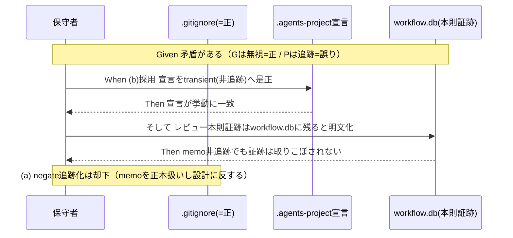

# 要件定義書: 自己拡張 memo の gitignore 矛盾是正

**プロジェクト名**: 自己拡張 memo の gitignore 矛盾是正
**作成日**: 2026 年 06 月 15 日
**最終更新**: 2026 年 06 月 15 日

> **重要**: **このドキュメントは常に更新**: 要件の変更や追加があった場合は、即座にこのドキュメントを更新してください。ドキュメントは「生きているドキュメント」として扱い、実装内容と常に同期させます。
>
> **用語**: [.agents/CONCEPTS.md §用語規約](../../../../.agents/CONCEPTS.md#用語規約) を参照。

---

## 1. 概要

### 1.1 システム概要

本リポジトリは「パッケージ正本」かつ「自己拡張する消費者」の二役を兼ねるため、git の扱いを名前空間で分離している。ところがルート `.gitignore` の `**/memo/*`（44 行、=**正**）が**すべての** memo を無視する一方、`.agents-project/自己拡張ワークフロー.md` は保守者名前空間（`docs/maintainer/workflow/<issue>/memo/`）の memo を「git 追跡対象」と宣言しており矛盾している（=**この宣言が誤りで是正対象**）。

**確定方針**: memo は過渡的スクラッチであり正本ではないため git 管理不要。レビュー（二観点 review-docs 等）の本則証跡は `workflow.db`（消費者ランタイム生成物として gitignore 対象）に残る。したがって git 追跡する成果物は issue ドキュメント（00〜04）のみであり、memo も workflow.db も git 追跡外でよい。本件はこの方針に基づき、**(b) 採用＝宣言を「memo＝非追跡（transient）」へ是正**して `.gitignore`（=正）と一致させ、**(a) 却下＝negate での追跡対象化**とする。

### 1.2 用語集

| 用語 | 説明 |
| -------- | ------ |
| 保守者名前空間 | `docs/maintainer/`。自己拡張 issue の開発記録。git 追跡対象。 |
| 消費者ランタイム名前空間 | `.workflow/{issue}/`。消費者が生成するランタイム。git 無視（配布物に含めない）。 |
| review-docs memo | 二観点ドキュメントレビューの証跡。指摘一覧と指摘 0 収束の記録。 |
| negate パターン | `.gitignore` の `!` で始まる否定行。先行の無視ルールを再追跡対象に戻す。 |

---

## 2. 機能要件

### 2.1 ユーザーストーリー

#### ストーリー 1: 自己拡張 memo の追跡可否が一意に定まる

- **As a** 本リポジトリの保守者
- **I want to** `.agents-project/` の memo 宣言を `.gitignore`（=正）に合わせて「非追跡（transient）」へ是正したい
- **So that** 自己拡張 issue の memo が「追跡されない（transient）」で一意に定まり、矛盾による事故（誤った add・二重管理）を防げる

**受け入れ基準**:

- `.agents-project/自己拡張ワークフロー.md` の §memo に「memo＝非追跡（transient）」と明記され、`.gitignore` の `**/memo/*` と矛盾しない（「git 追跡対象」と読める memo 関連文言が残らない）。
- `docs/maintainer/workflow/**/memo/*` が `git check-ignore -v` で `.gitignore` の `**/memo/*` によって無視されることが一意に説明できる。

#### ストーリー 2: レビュー証跡の本則が workflow.db であると明文化される

- **As a** 後から監査する保守者
- **I want to** 二観点レビュー（review-docs）の証跡が `workflow.db` に残ることを明文で確認したい
- **So that** memo を非追跡にしても S1「取りこぼし防止」原則に反しない（証跡は workflow.db に存在する）と判断できる

**受け入れ基準**:

- `.agents-project/` に「review-docs 等レビューの本則証跡は `workflow.db`（消費者ランタイム正本・gitignore 対象）に残る／memo は過渡的スクラッチで正本ではない」旨が明文化される。
- git 追跡する成果物は issue ドキュメント（00〜04）のみであり、memo・workflow.db は git 追跡外でよい、という設計が記録される。
- **(a) 却下**が理由とともに記録される（memo は正本でない・git 追跡は issue docs のみという設計に反するため、negate での追跡対象化は採らない）。

#### ストーリー 3: 消費者ランタイム memo の無視が維持される

- **As a** パッケージ配布者
- **I want to** `.workflow/{issue}/memo/` の無視を変えずに保ちたい
- **So that** 配布物（npm pack）を memo で汚さず、self-enforce の差分ゼロ検証・pack リーク検査を破らない

**受け入れ基準**:

- `git check-ignore -v .workflow/<任意>/memo/<任意>.md` が無視されること（`.workflow/*` 由来）を確認できる。
- 本件の変更対象は `docs/maintainer/` 名前空間のみに限定される。

### 2.2 BDD ユースケース

#### ユースケース 1: gitignore と宣言の矛盾解消（(b) 採用）

`.gitignore`（=正）は変えず、宣言を実挙動（memo＝非追跡）へ合わせて矛盾を解消する。

**シナリオ 1: 宣言を memo 非追跡（transient）へ是正する**

```gherkin
Feature: 自己拡張memoのgitignore矛盾是正
  Scenario: .agents-project宣言をmemo非追跡へ是正する
    Given ルート.gitignoreに `**/memo/*` があり、これが正である
    And .agents-project/自己拡張ワークフロー.md が誤ってdocs/maintainer配下memoを「git追跡対象」と宣言している
    When .agents-project/自己拡張ワークフロー.md の§memo宣言を「非追跡（transient）」へ是正する
    And レビューの本則証跡はworkflow.db（gitignore対象）に残る旨を明文化する
    Then `.agents-project/` の宣言と.gitignoreの挙動が一致する
    And `git check-ignore -v docs/maintainer/workflow/<issue>/memo/<file>.md` が `**/memo/*` でヒットし無視と確認できる
```

**シナリオ 2: 消費者ランタイム memo は引き続き無視される**

```gherkin
Feature: 自己拡張memoのgitignore矛盾是正
  Scenario: .workflow配下memoの無視が維持される
    Given .gitignoreの `**/memo/*` および `.workflow/*` を変更していない
    When `git check-ignore -v .workflow/<issue>/memo/<file>.md` を実行する
    Then 当該memoは無視される（.workflow/* または **/memo/* 由来のルールがヒットする）
    And 配布物（npm pack）にmemoが混入しない
```

#### ユースケース 2: negate での追跡対象化（(a) 却下）

代替案として検討したが**却下**する。

**シナリオ 1: (a) は採用しない**

```gherkin
Feature: 自己拡張memoのgitignore矛盾是正
  Scenario: negateで保守者memoを追跡対象化する案を却下する
    Given negateパターン（!docs/maintainer/.../memo/）でmemoをgit追跡対象にする代替案がある
    When 確定方針（memoは正本でない・git追跡する成果物はissueドキュメント00〜04のみ）に照らす
    Then 当該案はmemoを正本扱いする点で設計に反するため却下する
    And 却下理由（memoは過渡的スクラッチ・証跡本則はworkflow.db）を記録する
```

**処理フロー**（確定方針）:



### 2.3 ビジネスルール

- 本件の変更対象は `docs/maintainer/` 名前空間のみ。`.workflow/` 配下 memo の無視は不可侵。
- 配布物（npm pack）に memo を混入させない。self-enforce の差分ゼロ検証・`verify-npm-pack.sh` のリーク検査を破らない。
- 矛盾の単一情報源を明確化し、宣言と挙動の二重管理を残さない。

---

## 3. 非機能要件

### 3.1 パフォーマンス要件

- ビルド/実行時パフォーマンスに影響を与えないこと。

### 3.2 セキュリティ要件

- memo を追跡対象化する場合、秘匿情報を memo に記載しない既存運用を前提とする（本件で新たな秘匿情報経路を作らない）。

### 3.3 ユーザビリティ要件

- 是正後、保守者が memo の追跡可否を `git check-ignore -v` 一発で判定できること。

### 3.4 可用性要件

- 該当なし（git 設定・ドキュメントの整合のみ）。

---

## 4. 外部インターフェース要件

### 4.1 API 要件

- 該当なし。

### 4.2 データ形式要件

- `.gitignore` のパターン構文（glob・`!` 否定）に従うこと。

---

## 5. 制約事項

- `.gitignore` のパターン順序・有効性に注意（後勝ち・否定パターンは親ディレクトリが無視されていると効かない）。
- 名前空間分離（`.agents-project/自己拡張ワークフロー.md` §理由）の役割分担を維持すること。

### 方針の確定（(b) 採用・(a) 却下）

**確定方針**: memo は過渡的スクラッチであり正本ではないため git 管理不要。証跡の本則は `workflow.db`（消費者ランタイム生成物として gitignore 対象）。git 追跡する成果物は issue ドキュメント（00〜04）のみであり、memo も workflow.db も git 追跡外でよい。これに基づき下記で一意化する。

- **(b) 採用 — 宣言を非追跡（transient）へ是正**: `.gitignore` の `**/memo/*`（=正）を変えず、`.agents-project/自己拡張ワークフロー.md` の §memo の「git 追跡対象」宣言を「memo＝非追跡（transient）」へ是正し、レビューの本則証跡は `workflow.db` に残る旨を明文化する。
  - 利点: 確定方針（memo は正本でない）と一致。変更が小さく gitignore のパターン事故リスクがない。
  - S1「取りこぼし防止」との整合: memo を非追跡にしても二観点レビューの本則証跡は `workflow.db`（gitignore だが消費者ランタイム正本）に残るため、取りこぼしではない。
- **(a) 却下 — negate パターンで追跡対象化**: `!docs/maintainer/.../memo/` 等で memo を git 追跡対象に戻す案は**却下**する。
  - 却下理由: memo を正本扱いすることになり、「memo は正本でない／git 追跡する成果物は issue ドキュメント（00〜04）のみ」という確定方針に反する。加えてパターン順序・親ディレクトリ無視との相互作用による事故リスクを負う必要がない。
- **設計フェーズへの申し送り**: 本件は `.gitignore` を変更しないため negate の順序検証は不要。設計では `.agents-project/` の §memo・§issue 作成場所・§理由（名前空間の役割分担の表）の「追跡対象」記述の是正範囲と、本則証跡＝workflow.db の明文化箇所を確定する（実ファイル編集は実装フェーズで行う）。

---

## 6. 参考資料

### プロジェクトドキュメント

- [`00_要求定義.md`](./00_要求定義.md) - 要求定義
- [`.agents-project/自己拡張ワークフロー.md`](../../../../.agents-project/自己拡張ワークフロー.md) - §memo の作成場所・§理由
- ルート [`.gitignore`](../../../../.gitignore) - 44 行 `**/memo/*`（コメント 42〜43 行）

### 参照元 / 関連

- 親 issue「コア取り込み漏れ補完」: [`docs/maintainer/workflow/20260615_055806_コア取り込み漏れ補完/`](../20260615_055806_コア取り込み漏れ補完/)（issue_id 434c7b86-4222-45e7-a0ef-1ae455f15313）。配下の S1「取りこぼし防止と既出確認のコア昇格」で codify 中の原則と相互参照する。**本件は一見「review-docs memo 11 件の未追跡＝取りこぼし」に見えるが、レビューの本則証跡は `workflow.db` に残るため取りこぼしではない**。memo 非追跡（transient）を明文化し、証跡は workflow.db に存在すると整理することで S1 と整合する実例として関連する。

### 既出確認の結論（dedup）

- 既存 issue ツリー（active + `close/`）を `grep -rl 'gitignore'` 等で横断確認した結果、**memo/gitignore 追跡の矛盾を主題とする既存 issue は無く、新規起票する**。gitignore に言及する既存 issue（bin 生成物・配布構成・カバレッジ等）は別主題。親「コア取り込み漏れ補完」配下にも同主題は無い。

---

## 7. 前のステップ

この要件定義書は、以下のドキュメントを基に作成されています：

- **前**: [`00_要求定義.md`](./00_要求定義.md) - 要求定義フェーズ

---

## 8. 次のステップ

この要件定義書の承認後、以下のドキュメントを作成します：

- **次**: [`02_設計.md`](./02_設計.md) - 設計フェーズ
