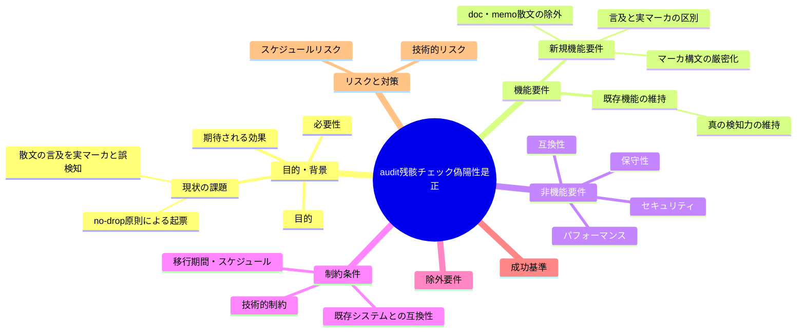
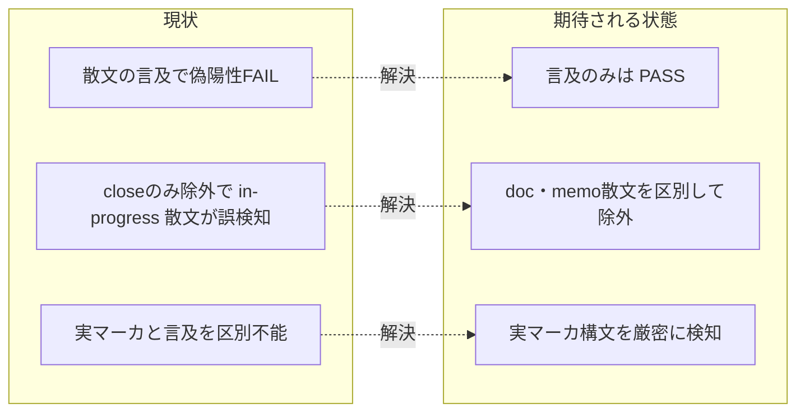

# 要求定義書: audit.sh 残骸・マーカ系チェックの散文誤検知（偽陽性）是正

**プロジェクト名**: audit.sh 残骸・マーカ系チェックの散文誤検知（偽陽性）是正
**作成日**: 2026 年 06 月 15 日
**最終更新**: 2026 年 06 月 15 日

> **重要**:
>
> - 要求定義書は、プロジェクトの全体像を把握するためのものです。詳細な技術仕様や実装方法は要件定義書以降で記載します。必要最低限の情報に収めることを心掛けてください。
> - **このドキュメントは常に更新**: 要求の変更や追加があった場合は、即座にこのドキュメントを更新してください。ドキュメントは「生きているドキュメント」として扱い、実装内容と常に同期させます。
> - **必須項目**: 以下の「必須」と明記した項目は空欄・抽象語のみで提出しないこと。判定可能な形（目的は1文・成功基準は○/×で判定できる記載等）で記入すること。
>
> **用語**: [.agents/CONCEPTS.md §用語規約](../../../../.agents/CONCEPTS.md#用語規約) を参照。

---

## 要求定義の全体像

**注意**:

- マインドマップは全体像を把握するためのものです。主要なセクション名程度に留め、詳細は記載しないでください。

---

## 1. 目的・背景

### 1.1 目的（必須）

audit.sh の残骸・マーカ系チェックが散文の言及を実マーカと誤検知する偽陽性を是正する。

### 1.2 背景

- **現状の課題**:
  - `.agents/enforcement/ci/audit.sh` の **#7「重要パスに TODO または FIXME が残っていないか」**（audit.sh:296-317）は、走査対象 `*.md` に対して `grep -qE 'TODO|FIXME'` を実行する。このパターンは**実マーカ（例 `// TODO: fix`）と、散文中の言及（例 チェック項目名としての「TODO/FIXME 残骸チェック」、レビュー証跡の「残骸タグ（TODO 等）0件を確認した」）を区別できず、後者でも FAIL（偽陽性）する**。
  - 偽陽性の実証（本 issue 起票時に確認）: 次の 2 行はいずれも `grep -qE 'TODO|FIXME'` に MATCH し、実マーカと同様に #7 を発火させる。
    - `本 issue では「TODO/FIXME 残骸チェック」の偽陽性を是正する。`（チェック項目名としての言及）
    - `レビュー証跡: 残骸タグ（TODO 等）0件を確認した。`（「0件」という残骸ゼロの証跡なのに発火）
  - #7 の `/close/` 配下除外ガード（audit.sh:303）は**完了 issue にしか効かない**。**in-progress の issue ドキュメント（00〜04・memo）が、まさにこのチェック自体や残骸タグを散文で説明・記録すると偽陽性が出る**。
  - 走査基点は `WORKFLOW_SCAN_DIRS`（`.agents-project` 上書きにより `docs/maintainer/workflow` を含む）であり、**自己拡張 issue の散文が直接この偽陽性の対象になる**。
  - 親 issue「コア取り込み漏れ補完」の**全5サブ（S1〜S5）の verify-and-close 監査で、この偽陽性が繰り返し観測**された。いずれも各サブのスコープ外で、成果物起因ではない（残骸そのものは存在しないのに、残骸を語る散文が FAIL を生む）。

- **必要性**:
  - 本来検知すべき「実マーカ／実残骸」と、それを**説明・記録する散文（チェック項目名・レビュー証跡・要件記述）**を区別しないと、issue を進めるたびに偽陽性 FAIL が発生し、監査の信頼性とワークフローの自動化が損なわれる。
  - S1 でコア昇格した **no-drop 原則**（残件を散文で終わらせず追跡可能 issue に落とす）に従い、繰り返し観測された本問題を独立 issue として追跡する。

### 1.3 期待される効果（必須: 1 件以上）

- **効果 1**: 散文の言及（チェック項目名・レビュー証跡・要件記述）が原因の偽陽性 FAIL が解消される（○/×: 言及のみを含む `.md` で audit.sh の該当チェックが PASS する）。
- **効果 2**: 実マーカ／実残骸に対する検知力は維持される（○/×: 実マーカを含む `.md` で従来どおり FAIL する）。
- **効果 3**: 自己拡張 issue 監査で、残骸チェック起因の偽陽性によるブロックがなくなる（○/×: 本 issue 配下の 00/01 散文自体が該当チェックを FAIL させない）。

**現状と期待される状態の比較**:

---

## 2. 機能要件

### 2.1 既存機能の維持（該当する場合）

- audit.sh の残骸・マーカ系チェックが持つ**真の検知力**を維持する。実マーカ（例 行頭/コロン付き `TODO:` `FIXME:` 等の実コメント形式）や実残骸を検知する能力を弱めない。
- 既存の除外ガード（templates 除外・`/close/` 配下除外）および他の失敗条件（#1〜#29）の挙動は変えない。

### 2.2 新規機能要件

- **言及と実マーカ／実残骸の区別**: アンカー／構文要件の付与、マーカ構文の厳密化等により、実マーカと散文中の単なる語の言及を区別する。
- **doc・memo 散文の除外**: チェック項目名・レビュー証跡・要件記述としての言及を偽陽性にしない（除外条件の付与、または検知パターンの構文厳密化のいずれか・両方を後続フェーズで設計）。
- **対象チェックの範囲**: 少なくとも #7「TODO/FIXME 残骸チェック」を是正する。task で言及された「残骸タグチェック」は、本リポでは #7 と同一の `TODO|FIXME` 系マーカ検知（および同種のマーカ／残骸を語の部分一致で拾う検知）を指すものとして同一の方針で扱う（後続の要件定義で対象チェックを確定する）。

---

## 3. 非機能要件

### 3.1 パフォーマンス

- audit.sh は CI で実行されるため、検知ロジックの変更で実行時間が体感できるほど悪化しないこと（既存の find + grep の走査量を大きく増やさない）。

### 3.2 セキュリティ

- 特になし（ローカル／CI のファイル走査のみ。外部アクセスを伴わない）。

### 3.3 互換性

- 汎用消費者ランタイム（`.workflow` のみ走査）と、本リポの自己拡張（`docs/maintainer/workflow` も走査）の両方で同一の改善が効くこと。後方互換を壊さない。
- macOS / Linux 双方の bash・grep（BSD/GNU）で動作すること（既存 audit.sh の方針に合わせる）。

### 3.4 保守性

- 検知パターンと除外条件は意図が明確に読めること（[設計判断の優先順位](../../../../.agents/spec/06_設計判断の優先順位.md): 可読性 > 単一責務 > 仕様整合 …）。
- 配布物（`.agents/`）の正本を変更した場合、アダプタ生成物（`.adapters/claude/.agents/...`・`.adapters/cursor/.agents/...`）との整合は build/setup の正規フローで再生成する（手で二重編集しない）。

---

## 4. 制約条件

### 4.1 技術的制約

- 検知の厳密化と除外は、**実マーカ／実残骸の見逃し（偽陰性）を新たに生まないこと**を最優先する。誤 FAIL を消すために検知力を犠牲にしてはならない。
- 既存の他チェック（#1〜#6, #8〜#29）の挙動・出力を変えない（本 issue のスコープは残骸・マーカ系チェックの偽陽性是正に限定）。

### 4.2 既存システムとの互換性

- `WORKFLOW_SCAN_DIRS` / `WORKFLOW_DIRS` の解決仕様（audit.sh の resolve_workflow_dirs）はそのまま用いる。
- templates 除外・`/close/` 除外の既存ガードを撤去しない（重畳して用いる）。

### 4.3 移行期間・スケジュール

- 単発の是正であり段階移行は不要。実装フェーズで test/test-audit.sh にケースを追加し回帰を防ぐ。

---

## 5. 除外要件

- 02_設計・03_実装計画・実装そのもの（本 issue は要求 phase まで。具体的な検知パターン・除外条件の確定は後続フェーズ）。
- #7 以外の失敗条件の仕様変更（マーカ／残骸系以外のチェックの是正は対象外）。
- audit.sh の走査基点（WORKFLOW_SCAN_DIRS）の仕様変更。

---

## 6. 成功基準（必須: 1 件以上）

- **SC1**: 散文の言及のみ（実マーカを含まない）`.md`（例: 「TODO/FIXME 残骸チェック」「残骸タグ（TODO 等）0件」）に対して、是正後の audit.sh は該当チェックで FAIL しない（○/×: 言及サンプルで PASS）。
- **SC2**: 実マーカ／実残骸を含む `.md`（例: 行頭または行内の `TODO:` `FIXME:` 形式の未解決マーカ）に対して、是正後も従来どおり FAIL する（○/×: 実マーカサンプルで FAIL）。
- **SC3**: 既存の audit テスト（test/test-audit.sh）が全て PASS し、本是正の偽陽性／検知力の回帰テストが追加されている（○/×: テスト追加＋全 PASS）。
- **SC4**: 本 issue 配下の 00/01 散文自体が、是正後の該当チェックを FAIL させない（○/×: 本 issue ドキュメントに対して PASS）。

---

## 7. リスクと対策

### 7.1 技術的リスク

- **リスク**: 散文除外・構文厳密化を進めすぎて、実マーカの見逃し（偽陰性）を生む。
  - **対策**: SC2／SC3 で実マーカ検知の回帰テストを必須にし、見逃しゼロを担保する。アンカー（行頭/コロン付き等）の構文要件は実マーカの実形に基づいて後続設計で確定する。
- **リスク**: 配布物（`.agents/audit.sh`）とアダプタ生成物の二重管理で不整合が生じる。
  - **対策**: 正本のみ編集し、アダプタは build/setup の正規フローで再生成する（手編集しない）。

### 7.2 スケジュールリスク

- **リスク**: 検知パターンの構文設計に想定外の工数がかかる。
  - **対策**: 本 issue は要求 phase までで区切り、設計・実装は後続フェーズで分離して進める。

---

## 8. 参考資料

### プロジェクトドキュメント

- [`.agents/enforcement/ci/audit.sh`](../../../../.agents/enforcement/ci/audit.sh) - 是正対象（#7 はおおよそ 296-317 行付近）
- [`.agents/enforcement/README.md`](../../../../.agents/enforcement/README.md) - 失敗条件と差し戻しの正本
- [`.agents/spec/06_設計判断の優先順位.md`](../../../../.agents/spec/06_設計判断の優先順位.md) - 設計判断の優先順位
- [`.agents-project/自己拡張ワークフロー.md`](../../../../.agents-project/自己拡張ワークフロー.md) - 本リポ固有の作成場所・close 規約

### その他の参考資料

- 親 issue「コア取り込み漏れ補完」（全5サブ S1〜S5 の verify-and-close 監査での偽陽性観測が起票根拠）
- S1 でコア昇格した no-drop 原則（残件を散文で終わらせず追跡可能 issue に落とす）

---

## 9. 次のステップ

この要求定義書の承認後、以下のドキュメントを作成します：

- **次**: [`01_要件定義.md`](./01_要件定義.md) - 要件定義フェーズ
