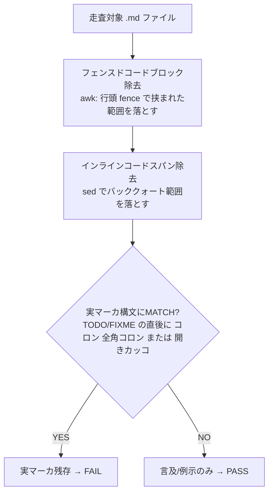
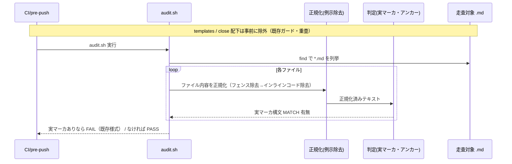

# 設計書: audit.sh 残骸・マーカ系チェックの散文誤検知（偽陽性）是正

**プロジェクト名**: audit.sh 残骸・マーカ系チェックの散文誤検知（偽陽性）是正
**作成日**: 2026 年 06 月 16 日
**最終更新**: 2026 年 06 月 16 日

> **重要**: **このドキュメントは常に更新**: 設計の変更や追加があった場合は、即座にこのドキュメントを更新してください。ドキュメントは「生きているドキュメント」として扱い、実装内容と常に同期させます。
>
> **用語**: [.agents/CONCEPTS.md §用語規約](../../../../.agents/CONCEPTS.md#用語規約) を参照。

---

## 1. 設計概要

**必須**: 設計方針・原則は [.agents/spec/01\_設計原則.md](../../../../.agents/spec/01_設計原則.md) を先に参照した上で、本プロジェクトに適用するものを選び記載する。

### 1.1 設計方針

`.agents/enforcement/ci/audit.sh` の #7（重要パスに TODO/FIXME 残存）の検知パターンを、**散文中の語の言及・例示と実マーカを構文で判別できる形に厳密化**する。具体的には「ファイルから (a)**フェンスドコードブロック**（行頭 ``` ``` ``` ``` ``` で囲まれた範囲）と (b)**インラインコードスパン**（バッククォートで囲まれた例示）を除去した上で、**実マーカ構文（マーカ語の直後にコロンまたは開きカッコが続く形）にアンカーした正規表現**で検知する」という**三段（(a) フェンス除去 → (b) インライン除去 → (c) アンカー判定）**の判別を採る。本書では正規化 2 段（フェンス＋インライン）と判定 1 段をまとめて「三段正規化（＋判定）」と呼ぶ。**偽陰性ゼロを最優先**とし、検知力を弱めない範囲で偽陽性のみを除去する。

> **設計確定の経緯（重要）**: 当初はインラインコードスパン除去のみを採る案だったが、本 issue の設計・実装計画書（02/03）自身が BDD 仕様・テストコードの**フェンスドコードブロック内に例示マーカ（`` `// TODO: fix` `` 等）を記述**するため、フェンスドブロックを除去しないと 02/03 自身が #7 を FAIL させる（SC4 違反）ことが実測で判明した。よって**フェンスドコードブロックの除去を必須**とし、設計を二層除去（フェンス＋インライン）に確定した。

### 1.2 設計原則（本プロジェクトで適用するもの）

[.agents/spec/06\_設計判断の優先順位.md](../../../../.agents/spec/06_設計判断の優先順位.md)（可読性 > 単一責務 > 仕様整合 …）に従う。

- **UNIX哲学**: 1 つのチェック（#7）の検知ロジックのみを差し替える。grep / sed / find の小さな組み合わせで実現し、走査構造（find + ループ）は既存を踏襲する。
- **単一責務**: 是正は #7 のセクション（audit.sh:296-317）に局所化する。他チェック（#1〜#6, #8〜#29）には一切触れない。
- **AIフレンドリー設計**: 検知パターンの意図（「実マーカ＝コロン/カッコ・アンカー」「例示＝インラインコード除去」）をコメントで明示し、可読性を最優先にする（[01\_設計原則 §AIフレンドリー設計](../../../../.agents/spec/01_設計原則.md#aiフレンドリー設計)）。

---

## 2. アーキテクチャ設計

### 2.1 責務・境界・参照関係

#### 2.1.1 責務一覧

| コンポーネント | 責務（1 文） |
| -------------- | ------------ |
| audit.sh #7 セクション（296-317 行） | WORKFLOW_SCAN_DIRS 配下の `*.md` を走査し、**実マーカ（解決すべき未処理）**が残存していれば FAIL する。 |
| 実マーカ判定（新規・#7 内のローカルロジック） | 1 行から「散文中の例示・言及」を取り除いた上で、実マーカ構文にアンカーした検知を行う。 |
| 既存の除外ガード（templates 除外・`/close/` 除外） | 走査対象外のパスを除外する（**本是正では撤去せず重畳して維持**）。 |
| `resolve_workflow_dirs`（既存・不変） | 走査基点 WORKFLOW_SCAN_DIRS を解決する（**本是正では一切変更しない**）。 |

#### 2.1.2 境界

- **入力**: WORKFLOW_SCAN_DIRS 配下の `*.md` ファイル（templates・`/close/` 配下を除外済み）の各行。
- **出力**: 実マーカが 1 件以上あれば `FAIL: 重要パスに TODO/FIXME が残存 …` を stderr へ出力し `EXIT_CODE=1`。なければ #7 は無出力で PASS。
- **他責務との境界**:
  - **本是正の範囲内**: #7 の `grep -qE 'TODO|FIXME'`（audit.sh:304）一箇所の検知ロジックの差し替えのみ。
  - **本是正の範囲外**: 走査基点の解決（`resolve_workflow_dirs`）、引数・環境変数 I/F（PROJECT_ROOT, GIT_RANGE, WORKFLOW_DIR(S), WORKFLOW_SCAN_DIRS）、find のファイル収集ロジック、templates/`/close/` 除外ガード、他チェック #1〜#6・#8〜#29、出力様式（FAIL メッセージ・ROLLBACK_MSG）。これらは不変。

#### 2.1.3 参照関係

- `#7 セクション` → `is_real_marker_line`（新規・後述のローカル判定。関数化するか inline かは 03 のタスクで確定）
- `#7 セクション` → `find`（既存・走査対象 `*.md` の列挙。不変）
- 既存の templates 除外・`/close/` 除外ガード → #7 セクション内のループ先頭で先に評価（不変・重畳）
- 循環参照なし。`resolve_workflow_dirs` への参照・依存は不変。

### 2.2 システムアーキテクチャ

- **採用パターン**: パイプライン（行ごとの「正規化 → 判定」の二段フィルタ）。
- **根拠**: [06\_設計判断の優先順位](../../../../.agents/spec/06_設計判断の優先順位.md) の可読性・単一責務に従い、「例示の除去」と「実マーカの構文判定」を 2 段に分けることで各段の意図を明確化する。新しい層・抽象は導入せず、既存 #7 のループ内に閉じる。

#### 2.2.1 検知ロジックの構成（本プロジェクトの構成で記載）



### 2.3 コンポーネント構成

是正は audit.sh の #7 セクション内に閉じる。新規ファイル・新規モジュールは作らない（単一責務・最小変更）。検知の中核は次の正規化 2 段 ＋ 判定 1 段で構成する（**ファイル単位**に適用する）。

1. **正規化段 (a)（フェンスドコードブロック除去）**: ファイルから行頭フェンス（バッククォート 3 連／チルダ 3 連）で挟まれた範囲を awk で除去する。BDD 仕様・テストコードのコードブロック内に書かれた例示マーカ（コードコメント形のマーカ等）を取り除く。
2. **正規化段 (b)（インラインコードスパン除去）**: 残った行からバッククォートで囲まれた範囲を除去する。プロセ中の例示 `` `TODO:` `` を取り除く。
3. **判定段（実マーカ・アンカー検知）**: 正規化後のテキストに対し、実マーカ構文 `(TODO|FIXME)[[:space:]]*[:：(]` を `grep -qE` で評価する。MATCH すれば実マーカ残存とみなし FAIL。

> **実マーカの検知が維持される根拠**: 実際の積み残しマーカは散文（プロセ・箇条書き）として書かれるのが支配的であり、これらはフェンス外・バッククォート外のため正規化後も残り検知される（§3.1.2・03 のテストで実証）。コードブロック内に書かれるマーカは「コード例・テスト fixture としての例示」が支配的であり、これを除外することが偽陽性除去の目的に合致する。

### 2.4 データフロー



---

## 3. 機能設計

### 3.1 機能 1: 実マーカと散文言及の構文判別（#7 是正）

#### 3.1.1 概要

#7 の検知を「素の `grep -qE 'TODO|FIXME'`（語の部分一致）」から「**例示除去 → 実マーカ構文アンカー**」に差し替え、散文の言及・例示を偽陽性にせず、実マーカは従来どおり FAIL させる。

#### 3.1.2 是正方針の確定（候補比較）

task で挙げられた候補 ①アンカー/構文要件付与・②doc/memo 散文の除外・③マーカ構文の厳密化を、偽陰性ゼロ最優先で比較する。

| 案 | 内容 | 検知力（偽陰性） | 偽陽性除去 | 判定 |
| -- | ---- | ---------------- | ---------- | ---- |
| ① 構文アンカーのみ（`(TODO|FIXME)[[:space:]]*[:：(]`） | マーカ語の直後にコロン/開きカッコが続く形のみを実マーカとみなす | 維持（実マーカは原則コロン/カッコ付き）。素の `grep TODO` を弱めるが、コロン無し裸 TODO は実務上「言及」が大半 | 言及「TODO/FIXME 残骸チェック」「残骸タグ（TODO 等）0件」は除去。ただし**例示（バッククォート内・コードブロック内のコロン付きマーカ）は依然 MATCH** | 不十分（SC4 で本 issue 02/03 が FAIL する） |
| ② doc/memo の一律除外 | 特定ディレクトリ（doc・memo）を #7 から除外 | **偽陰性を生む（実マーカが除外パスにあると見逃す）** | 偽陽性は消えるが検知力を犠牲にする | 不採用（偽陰性ゼロ原則に反する） |
| ③ 構文厳密化のみ | ① と同義で素パターンを厳密化 | ① と同様 | ① と同様に例示（バッククォート/コードブロック内）を取りこぼせない | 単独では不十分 |
| ④ ①＋インラインコード除去のみ | バッククォート `` `…` `` のみ除去 → ① で判定 | 維持 | インライン例示は除去。**だがフェンスドコードブロック内の例示（BDD/テストコードの `// TODO: fix`）は残り MATCH** | 不十分（**本 issue 02/03 の BDD/テストコードブロックで SC4 違反**＝実測で判明） |
| **採用: ①＋フェンスドブロック除去＋インラインコード除去の二層正規化** | (a) ``` ``` ``` ``` フェンス範囲を除去（awk）→ (b) `` `…` `` を除去（sed）→ ① の構文アンカーで判定 | **維持**。コードブロック外・バッククォート外の実マーカ（プロセの `TODO: 〜`・箇条書き `- TODO:`）は除去されず検知される | 例示（インライン・コードブロック双方）＋語の言及を確実に除去 | **採用** |

**採用理由（偽陰性ゼロの担保・SC4 達成）**:

- ② のような「パス単位の除外」は、除外パスに実マーカが置かれたとき見逃す（偽陰性）。本採用案は**パスを除外せず**、**例示構文（フェンスドコードブロック・インラインコードスパン）だけ**を構文単位で除去するため、同じパスにある散文の実マーカは検知される。
- 実マーカの一般形（コードコメント `// TODO:`・HTML コメント `<!-- TODO: -->`・箇条書き `- TODO:`・全角コロン `TODO：`・所有者付き `TODO(owner):`）はすべてコロンまたは開きカッコを伴う。散文・箇条書きとして書かれていれば構文アンカーで MATCH する（§3.1.3・03 のテストで実証）。
- **④ の不採用理由は本 issue 自身の実測**: 本 issue の 02/03 は BDD 仕様（gherkin）・テストコード（bash）の**フェンスドコードブロック内に例示マーカ `` `// TODO: fix` `` 等を必然的に記述**する。インライン除去のみではこれらが残り SC4 を満たせないことを実測で確認した。よってフェンスドブロック除去を必須とする。
- 検知力の理論的低下は「コードブロック／バッククォート内に書かれた**実**マーカ」の 1 形態に限られる。これは「コード例・fixture としての例示」が支配的であり、偽陽性除去の便益（SC1・SC4 の達成）が上回ると判断する。

#### 3.1.3 実マーカの定義（厳密化）

**実マーカ**＝走査対象ファイルから**フェンスドコードブロックとインラインコードスパンを除去した後**に、次の正規表現に MATCH する文字列。

```
(TODO|FIXME)[[:space:]]*[:：(]
```

- マーカ語 `TODO` または `FIXME` の直後に、任意個の空白を挟んで **ASCII コロン `:`／全角コロン `：`／開きカッコ `(`** のいずれかが続く形。
- ERE（`grep -E`）のみを使用。`\b`・`\w`・PCRE（`grep -P`）・後方参照は使わない（§5 移植性）。
- **PASS とする散文/例示の根拠（実測・§検証で確認）**:
  - 「TODO/FIXME 残骸チェック」… マーカ語の直後が `/` または空白＋日本語であり、`[:：(]` が続かない → no match。
  - 「残骸タグ（TODO 等）0件を確認した」… `TODO` の直後が空白＋「等」→ no match。
  - バッククォート例示 `` `TODO:` `` `` `FIXME:` ``（本 issue 00/01 型）… インラインコード除去段で消える → no match。
  - **フェンスドコードブロック内の例示**（BDD/テストコードの `// TODO: fix`・`TODO(alice):` 等。本 issue 02/03 型）… フェンス除去段で消える → no match（**SC4 達成の要**）。
- **FAIL を維持する実マーカ（実測・§検証で確認。コードブロック外・バッククォート外の散文として書かれた場合）**: `// TODO: fix`（プロセ行）／`<!-- FIXME: x -->`／`# FIXME:later`／`- TODO: 残対応`（箇条書き）／`TODO(alice): do`／`TODO ：全角`。

#### 3.1.4 対象チェックの範囲確定

- audit.sh の実体を精読（audit.sh:296-317）した結果、task で言及の「残骸タグチェック」は本リポでは **#7 と同一**（`grep -qE 'TODO|FIXME'` による TODO/FIXME 系の単一チェック）であることを確定した。残骸タグ専用の別チェックは存在しない。
- したがって**是正対象は #7 のみ**。enforcement/README.md の失敗条件表でも #7 が唯一の「TODO/FIXME 残存」項目（README:197, 233）。
- **#7 以外（#1〜#6, #8〜#29）の検知ロジック・出力・閾値は一切変更しない**。

#### 3.1.5 既存ガードとの重畳（不変条件）

- #7 ループ先頭の **templates 除外**（`[[ "$f" == *"/templates/"* ]] && continue`、audit.sh:301）を維持。
- **`/close/` 除外**（audit.sh:303）を維持。
- これらは検知パターン差し替えと**直交**であり、撤去・移動・順序変更をしない。検知パターンのみを差し替える。

#### 3.1.6 入力・出力

- **入力**: 走査対象 `*.md` のファイル内容（フェンス除去・インラインコード除去はファイル単位で適用）。
- **出力**: 実マーカを含むファイルがあれば既存様式の FAIL（`FAIL: 重要パスに TODO/FIXME が残存 …` ＋ 該当ファイルパス列挙 ＋ ROLLBACK_MSG）。`EXIT_CODE=1`。なければ無出力で PASS。**出力様式は不変**（[01 §3.3 ユーザビリティ要件]と整合）。

#### 3.1.7 エラーハンドリング

- `awk`／`sed`／`grep` の非ゼロ終了（no-match 等）で `set -e` により致命停止しないよう、既存と同様に `2>/dev/null` 相当のガードを保つ。検知の有無は終了コードを `if` 条件で評価し、コマンド失敗で audit 全体が異常終了しないようにする（既存 #7 の `grep -qE … 2>/dev/null` の方針を踏襲）。パイプライン（`awk … | sed … | grep -qE …`）の終了コードは末尾 `grep` のものを使う（`pipefail` を #7 局所で有効化しない＝既存挙動への影響を避ける）。
- 空ファイル・バイナリ・巨大ファイルでも find の収集対象は従来どおり `*.md` のみであり、走査量は増えない（[01 §3.1 パフォーマンス要件]）。

---

## 4. データ設計

本是正はデータモデル（DB・テーブル）を持たない。workflow.db への読み書きは行わず、ファイル走査のみ。該当なし。

---

## 5. 移植性設計（macOS/Linux・BSD/GNU 両対応）

- **grep**: `grep -E`（ERE）のみ使用。`-P`（PCRE・BSD grep 非対応）、`\b`・`\w`（GNU 拡張）、後方参照は使わない。文字クラスは `[[:space:]]`・`[:：(]` のみ。
- **awk（フェンス除去）**: フェンス開閉のトグルとプリント抑制のみで、GNU awk 固有機能を使わない POSIX awk 構文に限定する（BSD/macOS の awk でも動作）。行頭の連続バッククォート（およびチルダ）をフェンス開始/終了として扱い、フェンス内行を出力しない。**ただし未閉フェンス（フェンス行が奇数個）への偽陰性対策（§5.1）を必須で組み込む。**
- **sed（インラインコード除去）**: `sed -E` でバッククォート対を非貪欲相当（`` `[^`]*` ``）に除去する。基本的な置換で BSD/GNU 双方で同一挙動。
- **全角コロン `：`**: UTF-8 バイト列としてパターンに直接含める。ロケール依存の照合（collation）を避けるため、**判定段の `grep` は `LC_ALL=C` を採用に確定する**（#26 が `LC_ALL=C` を採る前例あり・audit.sh:697-699）。実測（mktemp -d 隔離）で全角 `TODO：` は **`LC_ALL=C` 有無いずれでも検知（FAIL 維持）**することを確認済みであり、`LC_ALL=C` を付与しても主形（ASCII コロン）の偽陰性は生じない（安全側）。ASCII コロン `:` での検知は `LC_ALL=C` 有無にかかわらず成立する。
- 既存 audit.sh の移植性方針（`date`・`stat` の GNU/BSD 両対応関数を持つ・audit.sh:113-143）と整合させる。

### 5.1 未閉フェンスの偽陰性対策（必須・偽陰性ゼロ最優先との整合）

フェンス除去 awk を「行頭フェンスで `infence` をトグルしフェンス内行を出力しない」素朴実装にすると、**ファイル内のフェンス行が奇数個（＝最後の開きフェンスが閉じられていない＝未閉フェンス）**のとき、最後の開きフェンス以降の全行が「フェンス内」と誤判定されて抑制される。この行に実マーカが書かれていると見逃し（偽陰性）となり、**§1.1 の偽陰性ゼロ最優先方針・00 SC2 に抵触する**。

- **採る対策（必須・保険）**: フェンス除去 awk は、**フェンス内と判定した行をその場で捨てずにバッファし、対応する閉じフェンスが現れたときに初めて破棄**する。走査が **EOF に達した時点で `infence` が立っている（＝未閉）場合は、バッファした行を出力にフォールバック**する。これにより、閉じられたコードブロック内の例示マーカは従来どおり除去され（SC4b 維持）、**未閉フェンス以降の実マーカは抑制されず判定段に渡って検知される（偽陰性ゼロ維持）**。
- **許容根拠より保険を優先する理由**: 「Markdown 正書法上フェンスは必ず閉じる」前提に依拠して未閉を射程外とする選択肢もあるが、audit 対象は人手で書かれる散文 `.md` であり未閉フェンスの混入はあり得る。偽陰性ゼロ最優先（§1.1）に照らし、許容ではなく保険を採用する。
- **実測（mktemp -d 隔離・実装スニペット骨格は 03 §2.2.2）**: 未閉フェンス直後に `// TODO: after unclosed fence` を置いたケースで、**フォールバック無しの素朴トグルは PASS（実マーカ見逃し＝偽陰性）**、**本対策ありで FAIL（検知）**となることを確認した。閉じたフェンスに挟まれた散文の実マーカ（前後にバランスしたフェンス）も FAIL 維持を確認済み（この経路は元々問題なし）。

---

## 6. テスト戦略

テスト戦略の観点定義は [RULES.md のテスト戦略必須要件](../../../../.agents/RULES.md#テスト戦略必須要件)、BDD 形式の定義は [TEST_BDD_FORMAT.md](../../../../.agents/TEST_BDD_FORMAT.md) を参照する。本書では**対象ごとのテスト割当**のみ記載し、具体ケース（BDD）は 03_実装計画 §2 に記載する。

### 6.1 対象ごとのテスト割り当て

| 対象 | 単体 | 結合/API | E2E | クリティカル観点 | バリデーション観点 | 未達理由/補足 |
| ---- | ---- | -------- | --- | ---------------- | ------------------ | ------------- |
| #7 実マーカ判別（言及/例示=PASS） | ○ | × | × | 偽陽性除去（SC1/SC4） | 言及・例示サンプルが PASS | E2E は CI 実行で代替 |
| #7 実マーカ判別（実マーカ=FAIL） | ○ | × | × | **偽陰性ゼロ**（SC2） | 実マーカ各形が FAIL 維持 | 最重要・複数形態を網羅 |
| 既存ガード重畳（templates/close 除外不変） | ○ | × | × | 非干渉（既存挙動） | 除外パスは PASS のまま | 既存 test-audit と整合 |
| 既存 audit テスト全 PASS（非干渉） | ○ | × | × | 他チェック不変（SC3） | test/test-audit.sh 全 PASS | 回帰の網 |

### 6.2 テスト観点

- **観点 1（SC1）**: WORKFLOW_SCAN_DIRS 配下の `.md` が「言及のみ（実マーカなし）」のとき #7 は FAIL しない。
- **観点 2（SC4）**: (a) 本 issue 00/01 型の「バッククォート例示 `` `TODO:` `` ＋日本語散文」、(b) 本 issue 02/03 型の「BDD/テストコードのフェンスドコードブロック内の例示マーカ `// TODO: fix`」を含む `.md` が #7 を FAIL させない（フェンス除去段・インラインコード除去段で除去される）。**本 issue 02/03 自身が PASS することを実走査で確認する**。
- **観点 3（SC2・偽陰性ゼロ）**: コードブロック外・バッククォート外の散文/箇条書きとして書かれた `// TODO:`・`<!-- FIXME: -->`・`- TODO:`・`TODO(owner):`・全角 `TODO：` の各実マーカ形で #7 が従来どおり FAIL する。
- **観点 4（SC3・非干渉）**: 既存 test/test-audit.sh が全 PASS する（他チェック・既存ガードの挙動不変）。
- **観点 5（移植性）**: 使用構文が ERE のみで、`grep -P`・`\b`・`\w` を含まない（静的確認）。
- **観点 6（未閉フェンスの偽陰性ゼロ・§5.1）**: 未閉フェンス（フェンス行が奇数個）の直後に書かれた実マーカ（例: `// TODO: …`）を含む `.md` が #7 を FAIL させる（フォールバック保険が効く）。フォールバック保険の退行検知の主対象とする。
- 01 の BDD（シナリオ1=言及 PASS・シナリオ2=実マーカ FAIL・UC2=非干渉）と観点 1/2・観点 3・観点 4 が 1:1 で対応する。観点 6 は SC2（偽陰性ゼロ）の境界ケースとして §1.1・§5.1 に対応する。

### 6.3 監査・レビューでの確認（証跡）

本書 §6.1 の割当表と 03_実装計画のタスク別テスト観点・BDD が揃っていること、01 の受け入れ基準（SC1〜SC4）に追加テストが対応していることを verify-and-close（実装後）で確認する。

---

## 7. 正本/アダプタ整合

- **編集する正本は `.agents/enforcement/ci/audit.sh` の 1 ファイルのみ**。
- `.adapters/claude/.agents/…`・`.adapters/cursor/.agents/…`・`.claude/` 等の生成物は**手編集しない**。正本変更後に build/setup の正規フロー（`.agents/SETUP.md` のビルド手順）で再生成して整合させる（[00 §3.4・§7.1 対策]と整合）。
- テスト（test/test-audit.sh への追加）は配布対象外の保守者自己テスト（`.agents-project/自己拡張ワークフロー.md` の役割分担表）であり、正本 audit.sh と同一コミットで追加する。

---

## 8. セキュリティ設計

外部アクセスを伴わない（ローカル／CI のファイル走査のみ）。追加の認証・データ保護要件は該当なし（[01 §3.2]）。

---

## 9. 非機能要件への対応

### 9.1 パフォーマンス

- find の収集対象（`*.md`）・ループ構造は不変。**ファイル単位**に `awk | sed | grep -qE` のパイプを 1 回呼ぶ形とし、行ごとのプロセス起動は発生させない。素の `grep` 1 回が `awk`＋`sed`＋`grep` の 3 プロセスに増えるが、走査ファイル数・対象は同一であり実行時間への体感影響はない（[01 §3.1]）。

### 9.2 可用性

- macOS/Linux・BSD/GNU grep/sed 双方で動作（§5）。汎用消費者ランタイム（`.workflow` のみ）と自己拡張（`docs/maintainer/workflow` も）の双方で同一是正が効く（WORKFLOW_SCAN_DIRS の解決仕様は不変・[01 ストーリー3]）。

---

## 10. 参考資料

### プロジェクトドキュメント

- [`01_要件定義.md`](./01_要件定義.md) - 要件定義
- [`00_要求定義.md`](./00_要求定義.md) - 要求定義
- [`.agents/enforcement/ci/audit.sh`](../../../../.agents/enforcement/ci/audit.sh) - 是正対象（#7 は 296-317 行）
- [`.agents/enforcement/README.md`](../../../../.agents/enforcement/README.md) - 失敗条件と差し戻しの正本（#7 は :197, :233）
- [`test/test-audit.sh`](../../../../test/test-audit.sh) - 回帰テストの追加先
- [`.agents/spec/06_設計判断の優先順位.md`](../../../../.agents/spec/06_設計判断の優先順位.md) - 設計判断の優先順位
- [`.agents-project/自己拡張ワークフロー.md`](../../../../.agents-project/自己拡張ワークフロー.md) - 作成場所・close・tmp 隔離規約

### その他の参考資料

- 親 issue「コア取り込み漏れ補完」（全5サブ S1〜S5 の verify-and-close 監査での偽陽性観測が起票根拠）

---

## 11. 前のステップ

この設計書は、以下のドキュメントを基に作成されています：

- **前**: [`01_要件定義.md`](./01_要件定義.md) - 要件定義フェーズ

---

## 12. 次のステップ

この設計書の承認後、以下のドキュメントを作成します：

- **次**: [`03_実装計画.md`](./03_実装計画.md) - 実装計画フェーズ
