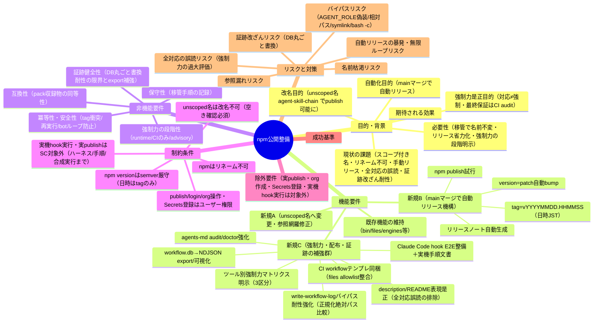

# 要求定義書: npm 公開整備（パッケージ改名 agent-skill-chain ＋ main マージ時の自動リリース機構）

**プロジェクト名**: npm 公開整備（パッケージ改名 agent-skill-chain ＋ main マージ時の自動リリース機構）
**作成日**: 2026 年 06 月 16 日
**最終更新**: 2026 年 06 月 16 日

> **重要**:
>
> - 要求定義書は、プロジェクトの全体像を把握するためのものです。詳細な技術仕様や実装方法は要件定義書以降で記載します。必要最低限の情報に収めることを心掛けてください。
> - **このドキュメントは常に更新**: 要求の変更や追加があった場合は、即座にこのドキュメントを更新してください。ドキュメントは「生きているドキュメント」として扱い、実装内容と常に同期させます。
> - **必須項目**: 以下の「必須」と明記した項目は空欄・抽象語のみで提出しないこと。判定可能な形で記入すること。
>
> **用語**: [.agents/CONCEPTS.md §用語規約](../../../../.agents/CONCEPTS.md#用語規約) を参照。

---

## 要求定義の全体像



**注意**:

- マインドマップは全体像把握用であり、詳細は本文の各セクションに記載する。

---

## 1. 目的・背景

### 1.1 目的（必須）

unscoped 名で publish 可能にし、main マージで自動リリースする CI を整備する。

### 1.2 背景

本 issue は当初「npm スコープ無し公開（将来の組織移管前提）」として起票したが、ユーザー方針により **(A) パッケージ改名（unscoped 名 `agent-skill-chain`）** と **(B) main マージ時の自動リリース機構の整備** を統合した「npm 公開整備」スコープへ拡張する（ディレクトリ名は据え置き）。さらに**外部レビュー指摘**を受け、**(C) 強制力・配布・証跡の補強群**を統合する。

**外部レビューの結論（C の起点）**: 「**『対応している』と『強制できる』は別**。強制力はツールごとに段階が違い、最終保証は CI audit にある」。本パッケージは複数 AI ツール（Claude Code / Cursor / Gemini / Copilot / Codex）へ `.agents` を正本として配備するが、各ツールの強制力は一様ではない（Claude Code は runtime hook で物理ブロックできる一方、他ツールはルール配布・方針適用にとどまる段階がある）。この事実を仕様・配布物・証跡の各面で正しく表現・強化することを (C) の目的とする。

- **現状の課題**:
  - `package.json` の `name` が `@techbeansjp-free/agents-md`（スコープ付き）であり、npm 未公開（レジストリ 404）。`@techbeansjp` も `@techbeansjp-free` も npm org/スコープが未存在（Scope not found）。
  - npm は**パッケージのリネーム不可**。スコープを後から変える（`@A/x` → `@techbeansjp/x`）のは新規 publish＋旧 deprecate＝作り直しになり、ダウンロード実績・依存が分断される。
  - 将来 `techbeansjp` 組織（npm org）へ「個人 → 組織」移管する前提があるが、スコープ付きのままでは移管時に名前を保てない。
  - **リリースが手動運用である**。現行 `.github/workflows/release.yml` は「タグ push（`v*`）」をトリガとする手動タグ運用であり、main へのマージのたびに人手でのバージョン採番・タグ付与・リリース作成・publish が必要になる。
  - **（C 起点）「対応」と「強制」が混同されている**。`package.json` の `description` は「Claude Code / Cursor / Gemini / Copilot / Codex 向けに配備する」と記し、**全ツールに一様に対応・強制できるかのように読める**。実態はツールごとに強制力の段階が異なり、最終保証は CI audit にある。表現と実装の双方でこの段階性を明示できていない。
  - **（C 起点）Claude Code hook の検証が合成 JSON テストにとどまる**。`test/test-pretooluse-hook.sh` は stdin JSON を流す**合成テスト**であり、実機 Claude Code の hooks 配線（settings.json の PreToolUse 配線・実プロセスからの呼び出し）を通した **E2E 動作保証**と実機手順の文書化が無い。
  - **（C 起点）`write-workflow-log.sh` の許可判定にバイパス余地がある**。書記実行ガードは `AGENT_ROLE=scribe` の**文字列一致**であり、PreToolUse.sh の write-workflow-log.sh 単独実行判定は basename 一致＋first-token の realpath 解決にとどまる。**相対パス・シンボリックリンク・`bash -c`・ラッパー経由・`AGENT_ROLE` 偽装**に対する正規化済み絶対パス比較・回帰テストが不足している。
  - **（C 起点）導入状態・enforcement 状態・証跡健全性を確認する CLI が弱い**。`agents-md audit` サブコマンドは存在せず（audit は `.agents/enforcement/ci/audit.sh` のみ）、`agents-md doctor` は AGENTS.md・hook・sqlite3 の存在確認にとどまる。利用者が「強制が効いているか」「証跡が健全か」を自己診断する手段が不足している。
  - **（C 起点）消費者向け CI audit テンプレートが整っていない**。`.workflow/templates/github/workflows/` に `ci-check.yml`（frontend/backend 向け）・`subagent-guard.yml` はあるが、**消費者が「hook が効かない環境の最後の砦」として audit を回すための CI テンプレート**として整理・同梱（`files` allowlist 整合）が確認できていない。
  - **（C 起点）証跡（workflow.db）の可視化・改ざん耐性が不足**。`workflow.db` は `prev_hash`/`entry_hash` のハッシュチェーンを持つが、**DB を丸ごと書き換える攻撃には不完全**で、Git 管理・署名・append-only 化できる **NDJSON export 経路**や「誰が誰に何を依頼したか」を可視化する手段が無い。

- **必要性**:
  - **unscoped 名なら所有権移管（owner transfer）で名前不変**のまま個人 → 組織へ移せる。これが「移管時にパッケージ名を保てる」唯一の現実的ルートである。
  - そのため、まず unscoped の公開名を確定し、その名前で publish 可能な状態（メタデータ・参照整合・pack 健全性）に仕上げる必要がある。
  - **main マージ（PR マージ）で自動的にバージョン採番・タグ付与・リリースノート生成・GitHub Release 作成・npm publish 試行を行う CI** を整備することで、リリースの手間とヒューマンエラーを削減する。改名と自動リリースは同じ `release.yml`・`package.json` を触るため、同一 issue で統合して整合させる。
  - **（C）強制力を正しく表現し、配布・証跡を強化する必要がある**。利用者の「全ツールで一様に強制される」という誤解を防ぎ、各ツールの強制力段階（runtime 強制 / CI のみ / advisory のみ）を明示し、hook の実効性を実機で保証し、証跡のバイパス・改ざん耐性を高め、最後の砦である CI audit を消費者が回せるようにする。これらは配布物（README・description・テンプレート・CLI・証跡経路）の信頼性に直結するため、公開整備の一環として同一 issue で整合させる。

### 1.3 期待される効果（必須: 1 件以上）

- **効果 1**: `package.json` の `name` が空き確認済みの unscoped 確定名 `agent-skill-chain` になり、`npm publish` をユーザーが実行すれば公開できる状態になる（○/× 判定可能）。
- **効果 2**: 将来の組織移管時に、unscoped 名の所有権移管で**パッケージ名を変えずに**個人 → 組織へ移せる（移管手順が文書として残る）。
- **効果 3**: リポジトリ内の旧パッケージ名参照が解消され、インストール手順・CLI 表示・ドキュメントが新名と一致する。
- **効果 4**: main へのマージ（PR マージ）で CI が自動的に `package.json` の version を patch +1 し、`vYYYYMMDD.HHMMSS`（JST）タグと GitHub Release（自動生成リリースノート付き）を作成し、npm publish を試行する（○/×: `release.yml` に該当ジョブ定義が存在し構文上妥当）。
- **効果 5**: バージョニング方式（version=semver patch 自動 / tag=日時）が `release.yml` の実装方針と一致して文書化され、手動タグ運用への依存がなくなる。
- **効果 6（C-1 強制力マトリクス）**: README および仕様ドキュメントに、ツール別の強制力段階を **3 区分（runtime 強制あり / CI のみ / advisory のみ）** で示す表が存在する（○/×: 該当表が README と .agents 仕様ドキュメントに存在）。
- **効果 7（C-2 表現是正）**: `package.json` の `description` と README から「全ツール対応」と誤読される表現が排除され、「`.agents` を正本に各ツールへ段階的に配備し、強制力はツールごとに異なり、最終保証は CI audit で行う」という趣旨に是正される（○/×: 旧表現の残存ゼロ・是正表現の存在）。
- **効果 8（C-3 hook E2E）**: 実機 Claude Code hook の E2E テストハーネスと実機実行手順の文書が存在し、合成環境で `test/` から実行できる（○/×: ハーネス＋手順文書の存在・合成環境での実行可能）。
- **効果 9（C-4 バイパス耐性）**: `write-workflow-log.sh` の許可判定が正規化済み絶対パス比較になり、相対パス・シンボリックリンク・`bash -c`・`AGENT_ROLE` 偽装の回避に対する回帰テストが存在する（○/×: 比較方式の変更＋回帰テストの存在）。
- **効果 10（C-5 CLI 強化）**: `agents-md audit` / `agents-md doctor` が強化され、導入状態・enforcement 状態・証跡健全性を確認でき、その自己テストが存在する（○/×: 強化機能＋自己テストの存在）。
- **効果 11（C-6 CI テンプレ同梱）**: 消費者が使える CI（audit 実行）ワークフローテンプレートがパッケージに同梱され、`files` allowlist 内かつ `npm pack --dry-run` 収録物に含まれる（○/×: テンプレートの allowlist 整合・pack 収録）。
- **効果 12（C-7 NDJSON export）**: `workflow.db` から NDJSON を export して Git 管理・署名・append-only 化でき、「誰が誰に何を依頼したか」を可視化する CLI/手順が存在し、export 結果の検証テストがある（○/×: export 経路＋検証テストの存在）。

**現状と期待される状態の比較**:

```mermaid
flowchart LR
    subgraph 現状["現状"]
        A1[name=@techbeansjp-free/agents-md]
        A2[未公開・スコープ未存在]
        A3[リネーム不可で移管時に名前変わる]
        A4[リリースは手動タグpushが前提]
        A5[全対応に読める表現/強制力段階が不明示]
        A6[hookは合成テストのみ・証跡バイパス余地]
    end

    subgraph 期待される状態["期待される状態"]
        B1[name=agent-skill-chain]
        B2[publish可能な状態に整備]
        B3[所有権移管で名前不変]
        B4[mainマージで自動リリース<br/>version=patch自動/tag=日時]
        B5[強制力マトリクス明示<br/>表現是正・最終保証はCI audit]
        B6[hook E2E＋手順/正規化絶対パス比較<br/>audit/doctor強化/NDJSON export]
    end

    A1 -.->|解決| B1
    A2 -.->|解決| B2
    A3 -.->|解決| B3
    A4 -.->|解決| B4
    A5 -.->|解決| B5
    A6 -.->|解決| B6
```

---

## 2. 機能要件

### 2.1 既存機能の維持（該当する場合）

以下のパッケージ整備は崩さず維持する（名前変更の波及で壊さない）。

- `bin: agents-md`（CLI コマンド名は据え置き）
- `files` allowlist（`.agents/`, `AGENTS.md`, `CLAUDE.md`, `.workflow/templates/`, `bin/`, `README.md`）
- `engines.node >=20`
- `publishConfig.access: public`（unscoped public でも問題なし）
- `license: MIT`、`keywords`、`repository`/`homepage`/`bugs` 等のメタデータ

### 2.2 新規機能要件

- `package.json` の `name` を unscoped の確定名 **`agent-skill-chain`** へ変更する（空き確認済み。`npm view agent-skill-chain version` → 404）。
  - **確定名**: `agent-skill-chain`（unscoped）。
  - **確定理由**: 第一候補 `agents-md` は既に使用中（v1.1.0）のため不可。`techbeans` ブランドは名前に含めない方針（ユーザー決定）。プロジェクトの本質（`agent` ＋ `command = skill chain` という中核構造。CORE.md は「AI 実行契約の正本」）を表す名前として `agent-skill-chain` を採用。npm の unscoped 名規約（小文字・URL safe）に適合。
  - **publish 直前の再確認**: unscoped 名は publish 後に改名不可のため、確定名 `agent-skill-chain` を実際に publish する直前に再度 `npm view agent-skill-chain version` で空き（404）を確認する。
- 旧パッケージ名（`@techbeansjp-free/agents-md`）のリポジトリ内**参照箇所を網羅修正**する。現時点で確認された主な参照（active・close を除く）:
  - `package.json` / `package-lock.json`
  - `src/agents-md.ts`（CLI のヘルプ・`npx <name>` 例示。`bin` 名 `agents-md` は維持）
  - `README.md`（インストール手順）
  - `.agents/SETUP.md`、`docs/maintainer/RELEASE.md`、`docs/maintainer/adapters.md`
  - **`.github/workflows/release.yml`**（旧名 `@techbeansjp-free/agents-md` を line 13 付近に含み、"scoped public publish" 表記を line 8 / line 36 付近に含む。改名＋自動リリース化で**全面改訂対象**）
  - （`docs/maintainer/workflow/close/...` 配下は完了 issue の**歴史的記録**であり、原則改変しない。表記方針は後続フェーズで判断）
- 将来の組織移管手順（unscoped → org の所有権移管・名前不変）を参考資料/ドキュメントとして記録する。

- **（新規 B）main マージ時の自動リリース機構**を `.github/workflows/release.yml` に整備する。トリガは **main ブランチへの push（PR マージ）**。自動処理（要求レベル。詳細手順は設計フェーズ）は次のとおり:
  1. マージ日時（**JST**）を取得し、タグ名 `vYYYYMMDD.HHMMSS` を決定する。
  2. `package.json` の `version` を **semver の patch を +1** する（version bump。例 0.1.0 → 0.1.1 → …）。
  3. マージされた PR/コミットからリリースノートを**自動生成**する（GitHub Release の自動生成ノート等）。
  4. 上記タグを作成し、**GitHub Release** をそのタグに紐付けて公開する（自動生成ノート付き）。
  5. **npm へ publish** する（unscoped public パッケージ `agent-skill-chain`）。
  6. version bump のコミットを main に反映する方式（`[skip ci]` 等で再発火を防ぐ）か否かは**設計判断事項**として申し送る（下記 §8）。
- **バージョニング方式（案C・確定）**: `package.json` の `version` は **semver の patch を自動インクリメント**し、**git タグはマージ日時 `vYYYYMMDD.HHMMSS`（JST）** とする。version 自体には日時を載せない（semver エコシステムとの相性を優先）。
  - **理由（記録）**: npm の `version` は semver 厳守（`v` 接頭辞不可・3 セグメント `MAJOR.MINOR.PATCH` 必須・先頭ゼロ不可）であり、日時文字列（`20260616.130000` のような形）は version には使えない。そのため**日時はタグのみ**に持たせ、version は semver patch 自動採番とする設計を採用した。
- **既存 release.yml の全面改訂**: 現行 `release.yml` は **(a) 旧パッケージ名 `@techbeansjp-free/agents-md` の参照**（ファイル冒頭コメント line 13 付近）と **(b) "scoped public publish" 前提の表記**（line 8 / line 36 付近のコメント、および `npm publish --access public` 周辺）を含み、**(c) トリガが「タグ push `v*`」の手動運用**である。本 issue の改名＋自動リリース化に伴い、`release.yml` は**全面改訂対象**であり、波及修正対象一覧に明示する（§8・M1 解消）。

> 具体的な置換実装・各ファイルの修正差分・CI ステップの具体手順（GitHub Actions の権限・トークン・bump コミット方式・タグ衝突対策の実装）は設計/実装フェーズで確定する。本フェーズでは「網羅対象の洗い出しと方針・確定したバージョニング方式」までを要求として固定する（実 `release.yml` は本フェーズでは書かない）。

### 2.3 新規機能要件（C・外部レビュー由来の補強群）

> **方針**: 以下は**要求と受け入れ基準**を定義する。**実装方式の詳細（具体ロジック・テストコード・README/仕様本文の改変）は設計/実装フェーズに委譲**する。本フェーズで実コード・実テスト・README 本文は改変しない。

- **C-1 ツール別 強制力マトリクスの明示（最優先）**: README および適切な `.agents` 仕様ドキュメント（例: `.agents/enforcement/README.md` または専用節）に、ツールごとの強制力段階を**表で明示**する。
  - 区分の例: **Claude Code** = Runtime hook による強制対応（PreToolUse で物理ブロック） / **Cursor** = ルール配布・一部誘導 / **Gemini** = 方針・プロンプト適用予定 / **Copilot** = 方針・リポジトリルール適用予定 / **Codex** = 方針・AGENTS.md 適用予定 / **CI** = 全ツール共通の最後の強制層（audit）。
  - 各ツールを **「runtime 強制あり / CI のみ / advisory のみ」の 3 区分**に分類して明示する。区分の配置・どのドキュメントに正本を置くか（重複禁止・相互参照）は設計で確定する。
- **C-2 `package.json` description と README の表現是正**: 「Claude / Cursor / Gemini / Copilot / Codex 向けに配備する」という**全対応に読める表現**を、「`.agents` を正本に各ツールへ**段階的に配備**し、**強制力はツールごとに異なり、最終保証は CI audit で行う**」という趣旨へ是正する。現行 description（`package.json` の `description` フィールド。実体は `package.json:4`）と README の該当表現が対象。
- **C-3 Claude Code hook の E2E 整備**: 合成 JSON テスト（現行 `test/test-pretooluse-hook.sh`）に加え、**実機 Claude Code での hook 動作を保証する E2E テストハーネス**を整備し、**実機での実行手順を文書化**する。実機実行自体はユーザー/CI 環境前提とし、本 issue の成果は「E2E ハーネス＋手順が存在し、合成環境で実行可能」までとする。
- **C-4 `write-workflow-log.sh` のバイパス耐性強化**: 許可判定（書記実行ガード・write-workflow-log.sh 単独実行判定）を**文字列一致ではなく正規化済み絶対パス比較**にする。併せて **`AGENT_ROLE` 偽装・`bash -c`・ラッパー・シンボリックリンク経由の回避**に対する耐性向上を要求に含める。現行は `AGENT_ROLE=scribe` の文字列一致（`write-workflow-log.sh:45`）と PreToolUse.sh の basename ＋ first-token realpath 判定（`PreToolUse.sh:167-184`）にとどまる。具体策（正規化手順・回避ベクタごとの防御）は設計で確定する。
- **C-5 `agents-md audit` / `agents-md doctor` の強化**: 利用者が**導入状態・enforcement 状態・証跡健全性**を確認できる CLI を強化する。現状 `agents-md audit` は存在せず（audit は `.agents/enforcement/ci/audit.sh` のみ）、`doctor` は AGENTS.md・hook・sqlite3 の存在確認にとどまる。不足機能（audit サブコマンドの追加可否・doctor の診断項目拡張・証跡健全性チェックの内容）は設計で確定する。
- **C-6 CI workflow テンプレートの同梱**: hook が効かない環境の**最後の砦**として、消費者が使える **CI（audit 実行）ワークフローテンプレート**をパッケージに同梱する。`files` allowlist（現状 `.workflow/templates/` を含む）と整合させ、`npm pack --dry-run` 収録物に含める。既存テンプレート（`.workflow/templates/github/workflows/ci-check.yml`・`subagent-guard.yml`）との関係・新規/流用の判断は設計で確定する。
- **C-7 `workflow.db` の export / 可視化**: `workflow.db` から **NDJSON を export** して **Git 管理・署名・append-only 化**できる経路を用意し、「**誰が誰に何を依頼したか**」（actor_role / delegated_by_role / command / issue_id 等）を可視化する CLI/手順を要求に含める。証跡の改ざん検知（`prev_hash`/`entry_hash` のハッシュチェーン）は **DB 丸ごと書換に対しては不完全**である旨と、export による補強方針を非機能/リスクに明記する（§3.6・§7）。export 経路の実装（CLI サブコマンド or スクリプト・署名/append-only の方式）は設計で確定する。

> 上記 C 群は**実装方式の詳細を設計フェーズへ委譲**する。本フェーズでは要求・受け入れ基準（§6 SC-8〜SC-14）までを固定し、実コード・実テスト・README/仕様本文・実 CLI は改変しない。

---

## 3. 非機能要件

### 3.1 パフォーマンス

- 特段の性能要件なし（CLI 配布パッケージのため）。

### 3.2 セキュリティ

- 本 issue のスコープでは npm への login・publish・org 作成/移管といった**認証・権限を要する操作は行わない**（read-only の空き確認のみ実施可）。これらはユーザー操作・権限が前提。
- **認証情報の準備はユーザー責務**。自動リリースの npm publish に必要なトークン（例 `NPM_TOKEN`）の **GitHub Secrets への登録**、npm アカウント/ログイン、組織作成/移管は**ユーザー操作**であり、本 issue（CI 定義の整備）のスコープ外（SC 対象外）とする。Secrets 未設定時は publish ステップを安全に skip する方式（既存 release.yml のトークンゲート踏襲）を設計で検討する。

### 3.3 互換性

- `npm pack --dry-run` が成功し、収録物（tarball 内ファイル一覧）が `files` allowlist の範囲に収まること。`files` allowlist・`bin` は変えない。
- unscoped public パッケージとして公開可能であること（`publishConfig.access: public` を維持）。

### 3.4 保守性

- 将来の組織移管手順を文書として残し、再現可能にする（移管時に名前不変であることの根拠を含む）。

### 3.5 冪等性・安全性（自動リリース）

- **タグ衝突**: 同一秒に複数マージが発生した場合 `vYYYYMMDD.HHMMSS` が衝突しうる。衝突時の扱い（リトライ・サフィックス付与・直列化等）を設計で定める。
- **publish 失敗時の再実行可否**: npm publish が失敗した場合の再実行可否（既に bump 済み version の扱い・部分成功時のリカバリ）を設計で定める。
- **bot コミットによる無限ループ防止**: version bump を main へコミットする方式を採る場合、その push が再度ワークフローを発火させない仕組み（`[skip ci]` 等）を必須とする。

### 3.6 強制力の段階性・証跡健全性（C 群）

- **強制力の段階性（C-1）**: 強制力はツールごとに異なる事実を「runtime 強制あり / CI のみ / advisory のみ」の 3 区分で明示する。**最終保証は CI audit**（`.agents/enforcement/ci/audit.sh`）にあり、hook が効かない環境ではここが最後の砦であることを仕様で一貫して表す。
- **hook 実効性（C-3）**: Claude Code hook は合成テストに加え実機 E2E ハーネス＋手順で実効性を担保する。実機実行はユーザー/CI 環境前提とし、合成環境での実行可能性までを保証範囲とする。
- **バイパス耐性（C-4）**: 証跡記録経路の許可判定は正規化済み絶対パス比較を採り、`AGENT_ROLE` 偽装・相対パス・シンボリックリンク・`bash -c`・ラッパー経由の回避に耐えること。耐性は回帰テストで継続検証する。
- **証跡改ざん耐性の限界と補強（C-7）**: `workflow.db` のハッシュチェーン（`prev_hash`/`entry_hash`）は**逐次改ざんは検知できるが、DB を丸ごと差し替える攻撃には不完全**である。この限界を仕様に明記し、NDJSON export ＋ Git 管理・署名・append-only による外部証跡で補強する方針を採る。
- **配布物整合（C-6）**: 同梱する CI テンプレートは `files` allowlist 内に置き、`npm pack --dry-run` の収録物に含まれること（allowlist 範囲を超えないこと）。

---

## 4. 制約条件

### 4.1 技術的制約

- **npm はパッケージのリネーム不可**。スコープ変更は新規 publish＋旧 deprecate になるため採らない。unscoped 名で publish し、組織へは**所有権移管（名前不変）**で移す方針を採る。
- **unscoped 名は publish 後に改名できない**ため、名前の確定と空き確認が必須。
- 空き確認は `npm view <name> version`（404=空き、version 返却=使用中）で行う read-only 操作のみ許可。publish はしない。
- **npm の version は semver 厳守**（`v` 接頭辞不可・`MAJOR.MINOR.PATCH` の 3 セグメント必須・各セグメント先頭ゼロ不可）。日時文字列を version に載せられないため、**日時はタグ（`vYYYYMMDD.HHMMSS`）のみ**に持たせ、version は patch 自動採番とする（案C）。
- **自動リリースのトリガは main への push（PR マージ）**。手動タグ push 運用（現行 `release.yml` の `on: push: tags: v*`）から自動運用へ改める。

### 4.2 既存システムとの互換性

- `bin: agents-md`・`files`・`engines`・`publishConfig.access`・`license` 等の既存パッケージ整備を崩さない。

### 4.3 移行期間・スケジュール

- 実 publish のタイミングはユーザー判断。本 issue は「publish 可能な状態に仕上げる」「main マージで自動リリースする CI 定義を整備する」ところまでを成果とする。
- 自動リリース CI の**実発火（実 publish・実タグ作成）はユーザー操作（PR マージおよび Secrets 登録）が前提**であり、CI 定義の妥当性（構文上妥当・ジョブ定義の存在）までを本 issue の成果とする。

---

## 5. 除外要件

- **実 publish の実行**（`npm publish`）は本 issue のスコープ外（ユーザー操作・権限前提）。CI 定義としての publish ステップは整備するが、実発火の成否は SC に含めない。
- **npm login / org 作成 / 所有権移管操作**の実行は対象外（手順の記録のみ行う）。
- **`NPM_TOKEN` 等の GitHub Secrets 登録**は対象外（ユーザー操作）。CI 定義はトークン名を前提として書くが、登録自体は申し送る。
- スコープ付き名（`@techbeansjp/...`）への将来的な切替自体は採らない（リネーム不可のため。本 issue は unscoped＋所有権移管ルートを前提とする）。
- 実 `release.yml` の記述（CI 実装）・bump コミット方式やタグ衝突対策の具体実装は**設計/実装フェーズ**で行う（本要求・要件フェーズでは方針確定までに留める）。

---

## 6. 成功基準（必須: 1 件以上）

- **SC-1**: `package.json` の `name` が**空き確認済みの unscoped 確定名 `agent-skill-chain`** になっている（`npm view agent-skill-chain version` が 404 を返す名前。publish 直前に再確認）。
- **SC-2**: 旧パッケージ名フルトークン `@techbeansjp-free/agents-md` の参照が **tracked な active ソースで残存ゼロ**である。**判定対象は tracked な active ソース（`files` allowlist 収録物＋リポジトリ追跡ソース）に限定**し、**`.summary/` 等の生成物・untracked ファイル・`docs/maintainer/workflow/close/` 配下の歴史記録は判定対象から除外**する。判定 grep は対象範囲を tracked active に固定して実行する（例: `git ls-files | grep -v '^docs/maintainer/workflow/close/' | xargs grep -lI '@techbeansjp-free/agents-md'` のヒット 0 件、または `files` allowlist 収録物＋`src/` に対する `grep -rIo '@techbeansjp-free/agents-md'` のヒット 0 件）。**`.summary/`（untracked・非 ignore・allowlist 外の生成サマリ）が偽陽性で残存ヒットしないよう、走査対象を tracked active に限定する**。この判定対象範囲の定義が 00/01 に明記されている。
- **SC-3**: `npm pack --dry-run` が成功し、収録物が **`files` allowlist の範囲に収まり**、`npm pack --dry-run` が成功すること（tarball ファイル一覧が allowlist 範囲内）。
- **SC-4**: 将来の組織移管手順（unscoped 名 `agent-skill-chain` の所有権移管・名前不変で `techbeansjp` 組織へ）が要求/参考資料に記録されている。
- **SC-5**: 第一候補 `agents-md` の空き確認結果と、確定 unscoped 名 `agent-skill-chain`・確定理由が 00/01 に記載されている。
- **SC-6（自動リリース）**: main マージで CI が `package.json` の version を **patch +1** し、`vYYYYMMDD.HHMMSS`（JST）タグと **GitHub Release（自動生成リリースノート付き）** を作成し、**npm publish を試行する** ジョブが `release.yml` に定義され、構文上妥当である（○/×: 該当ジョブ定義が存在し YAML として妥当）。
- **SC-7（バージョニング整合）**: バージョニング方式（**version=semver patch 自動 / tag=日時 `vYYYYMMDD.HHMMSS`**）が `release.yml` の実装方針と一致して 00/01 および CI 定義に記述されている。
- **SC-8（C-1 強制力マトリクス）**: README/仕様に**ツール別強制力マトリクス**が存在し、各ツールが **3 区分（runtime 強制あり / CI のみ / advisory のみ）**に分類して明示されている（○/×: 該当表が README と .agents 仕様ドキュメントに存在し 3 区分が読み取れる）。
- **SC-9（C-2 表現是正）**: `package.json` の `description` と README から「全ツール対応」と誤読される表現が排除され、**段階配備＋CI 最終保証**の表現になっている（○/×: 旧誤読表現の残存ゼロ・是正表現の存在）。
- **SC-10（C-3 hook E2E）**: 実機 Claude Code hook の **E2E テストハーネス＋実機手順文書**が存在し、合成環境で `test/` から実行可能である（○/×: ハーネス＋手順文書が存在し合成環境で実行できる）。
- **SC-11（C-4 バイパス耐性）**: `write-workflow-log.sh`（および関連する許可判定経路）の許可判定が**正規化絶対パス比較**で実装され、回避（相対パス・シンボリックリンク・`bash -c`・`AGENT_ROLE` 偽装）に対する**回帰テスト**が追加されている（○/×: 比較方式変更＋回帰テストの存在）。
- **SC-12（C-5 CLI 強化）**: `agents-md audit` / `agents-md doctor` が強化され（導入状態・enforcement 状態・証跡健全性の確認）、状態確認の**自己テスト**が追加されている（○/×: 強化機能＋自己テストの存在）。
- **SC-13（C-6 CI テンプレ同梱）**: CI workflow テンプレート（audit 実行）が同梱され（`files` allowlist 内）、`npm pack --dry-run` の収録物に含まれる（○/×: テンプレートが allowlist 内かつ pack 収録物に含まれる）。
- **SC-14（C-7 NDJSON export）**: `workflow.db` → NDJSON export の CLI/手順が存在し、**export 結果の検証テスト**がある（○/×: export 経路＋検証テストの存在）。
- ※ 実 publish の成否・`NPM_TOKEN` 等 Secrets 登録は本 issue の SC に含めない（ユーザー操作前提）。**CI 定義の妥当性まで**を SC とする。
- ※ **実機 hook の実行・実 Secrets 登録・実 publish はユーザー操作前提で SC 対象外**。C 群は**定義・ハーネス・テストの存在と合成環境での実行まで**を SC とする（SC-10/SC-11/SC-12/SC-14）。

---

## 7. リスクと対策

### 7.1 技術的リスク

- **リスク**: 第一候補 `agents-md` が**既に他者により使用中**（本フェーズ調査で `version 1.1.0` を確認）。unscoped 名は改名不可のため、誤って既存名を当てると publish 不能になる。
  - **対策**: 空き確認（404）を満たす名前のみを候補とする。確定名は **`agent-skill-chain`**（`npm view agent-skill-chain version` → 404 を確認済み）。unscoped 名は publish 後に改名不可のため、確定名を publish する直前に再度 `npm view agent-skill-chain version` で空きを再確認する。

- **リスク**: パッケージ名の**参照漏れ**（修正し損ねた箇所が残ると、インストール手順や CLI 表示が不整合になる）。`release.yml` 内の旧名・"scoped public publish" 表記も対象。
  - **対策**: 旧名フルトークン `@techbeansjp-free/agents-md` を**機械的に洗い出して active 対象を網羅修正**する。`release.yml` は全面改訂対象に含める。**判定（SC-2）の走査対象は tracked な active ソース（`files` allowlist 収録物＋リポジトリ追跡ソース）に限定**し、`docs/maintainer/workflow/close/` 配下の歴史的記録に加え、**`.summary/` 等の生成物・untracked ファイルも判定対象から除外**する（例: `git ls-files | grep -v '^docs/maintainer/workflow/close/' | xargs grep -lI '@techbeansjp-free/agents-md'`、または allowlist＋`src/` に対する `grep -rIo`）。**素直な全走査 `grep -rIo` をリポジトリ全体に対して実行すると、`.summary/AGENTS.md_project_summary.txt`（untracked・非 ignore・allowlist 外の生成サマリ）が多数ヒットして偽陽性で SC-2 が×判定になりうる**ため、走査対象を tracked active に固定する。この方針を 00/01 に記録する。

- **リスク（自動リリース）**: main マージのたびに自動 publish/タグ作成が走るため、**暴発・無限ループ・タグ衝突**が起こりうる。bump コミットの push が再度ワークフローを発火させると無限ループになる。同秒マージで `vYYYYMMDD.HHMMSS` が衝突しうる。publish 失敗時の半端な状態（version は上がったが publish 失敗）も起こりうる。
  - **対策**: bump コミット方式では `[skip ci]` 等で再発火を防ぐ（または bump を main へ書き戻さない方式を設計で選択）。タグ衝突・publish 失敗時の再実行可否を設計の冪等性要件（§3.5）で定める。Secrets 未設定時は publish を安全に skip するゲートを設ける。具体策は設計フェーズで確定。

- **リスク（C-1/C-2 強制力の過大評価）**: description/README が「全ツール対応」と読めると、利用者が**強制が効かない環境でも強制されていると誤解**し、ガバナンスを過信する。
  - **対策**: 強制力マトリクス（3 区分）を明示し、description/README を段階配備＋CI 最終保証の表現へ是正する（C-1/C-2・SC-8/SC-9）。

- **リスク（C-4 証跡記録のバイパス）**: 文字列一致・basename 一致の許可判定は、相対パス・シンボリックリンク・`bash -c`・ラッパー・`AGENT_ROLE` 偽装で回避されうる。回避されると証跡が欠落・偽装される。
  - **対策**: 正規化済み絶対パス比較へ変更し、各回避ベクタに対する回帰テストを追加する（C-4・SC-11）。具体防御は設計で確定。

- **リスク（C-7 証跡の丸ごと改ざん）**: `prev_hash`/`entry_hash` のハッシュチェーンは逐次改ざんは検知できるが、**DB ファイルを丸ごと差し替える攻撃には不完全**。攻撃者が DB を作り直すと改ざんが検知できない。
  - **対策**: NDJSON export ＋ Git 管理・署名・append-only による外部証跡で補強する。限界を仕様に明記する（C-7・SC-14・§3.6）。

- **リスク（C-3 hook 実効性の見かけ上の保証）**: 合成 JSON テストだけでは実機 Claude Code の配線（settings.json・実プロセス呼び出し）を通した動作を保証できず、「テストは通るが実機で効かない」状態が起こりうる。
  - **対策**: 実機 E2E ハーネス＋実機手順文書を整備し、合成環境で実行可能にする。実機実行はユーザー/CI 前提で SC 対象外とする（C-3・SC-10）。

### 7.2 スケジュールリスク

- **リスク**: 実 publish・org 作成/移管はユーザー権限が前提のため、本 issue 完了後にユーザー操作待ちが発生する。
  - **対策**: 本 issue の DoD を「publish 可能な状態に仕上げる」までに限定し、ユーザー操作（publish・移管）を明確に分離して申し送る。

---

## 8. 参考資料

### プロジェクトドキュメント

- [`docs/maintainer/RELEASE.md`](../../../RELEASE.md) - リリース手順（旧名参照の修正対象。自動リリース化に伴い手順記述の見直し対象）
- [`docs/maintainer/adapters.md`](../../../adapters.md) - アダプタ説明（旧名参照の修正対象）
- [`.github/workflows/release.yml`](../../../../.github/workflows/release.yml) - リリース CI（旧名・scoped publish・手動タグ運用を含む。**全面改訂対象**）
- 過去 issue（close 済・参考）: `docs/maintainer/workflow/close/20260615_054821_npm-publish検証と手順整備/`、`.../20260614_124435_配布とパッケージ構成の再設計/`
- （C 群の現状調査対象）[`.agents/enforcement/README.md`](../../../../.agents/enforcement/README.md)・[`.agents/enforcement/claude/PreToolUse.sh`](../../../../.agents/enforcement/claude/PreToolUse.sh)・[`.agents/enforcement/ci/audit.sh`](../../../../.agents/enforcement/ci/audit.sh)・[`.agents/scripts/write-workflow-log.sh`](../../../../.agents/scripts/write-workflow-log.sh)・[`.agents/ledger/schema.sql`](../../../../.agents/ledger/schema.sql)・[`bin/agents-md.js`](../../../../bin/agents-md.js)・[`test/test-pretooluse-hook.sh`](../../../../test/test-pretooluse-hook.sh)・[`.workflow/templates/github/workflows/`](../../../../.workflow/templates/github/workflows/)（既存 CI テンプレ）

### その他の参考資料

- npm 公式: パッケージのリネーム不可・unscoped パッケージの所有権移管（owner transfer）。組織への移管は名前を保ったまま owner / maintainer を組織へ移すことで行える。
- 空き確認コマンド: `npm view <name> version`（404=空き）。調査結果:
  - **`agent-skill-chain` → 404（空き＝確定名）**
  - `agents-md` → **使用中（1.1.0）**（第一候補だったが不可）
  - `agents-md-techbeans` → 404（空き・不採用＝ブランド名を含めない方針）
  - `techbeans-agents-md` → 404（空き・不採用＝同上）
  - `@techbeansjp-free/agents-md`（旧名）→ 404（未公開）

### 申し送り（後続フェーズ向け）

- **旧名 → 新名の波及修正対象（実装フェーズで直す active 箇所）**: `package.json`・`package-lock.json`・`src/agents-md.ts`・`README.md`・`.agents/SETUP.md`・`docs/maintainer/RELEASE.md`・`docs/maintainer/adapters.md`・**`.github/workflows/release.yml`** 等。確定後に `grep -rIo '@techbeansjp-free/agents-md'`（フルトークン固定）で全参照を機械的に洗い出し、active 対象を網羅修正する。`docs/maintainer/workflow/close/...` 配下は完了 issue の歴史的記録のため**改変対象外**。
- **`.github/workflows/release.yml` の全面改訂方針（M1 解消）**: 現行は (a) 旧名 `@techbeansjp-free/agents-md`（line 13 付近）、(b) "scoped public publish" 表記（line 8 / line 36 付近）、(c) トリガ `on: push: tags: v*`（手動タグ運用）を含む。改名後の unscoped 名 `agent-skill-chain`・unscoped public publish・**main push トリガの自動リリース**へ全面改訂する。version bump（patch 自動）・タグ採番（`vYYYYMMDD.HHMMSS`）・リリースノート自動生成・GitHub Release 作成・npm publish の各ステップを設計/実装で定義する。
- **bin 名の扱い（設計フェーズ判断事項）**: パッケージ名（`name`）と bin 名は**独立**であり、`name` を `agent-skill-chain` に変えても `bin: agents-md` を維持できる（00 §2.1）。一方で CLI コマンド名 `agents-md` を `agent-skill-chain` に揃えるかは UX・互換性の観点で**要検討**。揃える場合はヘルプ・ドキュメント・`src/agents-md.ts` の例示の整合も必要。本フェーズでは bin 名は変更せず、揃えるか否かは**設計フェーズで判断**する。
- **自動リリースの設計判断事項（設計フェーズ）**:
  - **version bump コミットの main 反映方式**: bump 結果を main へ書き戻すか／書き戻さないか。書き戻す場合は `[skip ci]` 等での再発火防止が必須。
  - **タグ衝突対策**: 同秒マージ時の `vYYYYMMDD.HHMMSS` 衝突の扱い（リトライ・直列化・サフィックス等）。
  - **publish 失敗時の再実行可否**: 部分成功（version bump 済・publish 未）のリカバリ方針。
  - **Secrets 名**: npm publish 用トークン名（既存 `release.yml` 踏襲なら `NPM_TOKEN`）。登録自体はユーザー操作（本 issue 対象外）。
  - **`vYYYYMMDD.HHMMSS` の JST 取得方法**: CI ランナーのタイムゾーン（既定 UTC）に依存しない JST 取得（`TZ=Asia/Tokyo` 等）。
  - **既存 marketplace（案A）ジョブとの統合**: 現行 `release.yml` の (B) marketplace リリースジョブ（`release/marketplace` ブランチへの生成物 commit）をトリガ変更後どう扱うか。

- **C 群（強制力・配布・証跡の補強）の設計判断事項（実装着手点付き）**:
  - **【規模・サブ issue 分割の判断（N-5・推奨）】**: A（改名波及）＋B（`release.yml` 全面改訂・自動リリース）＋C-1〜C-7 を 1 issue/1 PR に統合しているが、**C-3/C-4/C-5/C-7 はそれぞれ独立に実装・テスト可能な塊**であり、PR レビュー単位が肥大化しうる（A→B は `release.yml` で合流するが C 群は独立性が高い）。**設計フェーズで 90_issues 化（C 群のサブ issue 分割）の要否を 02 で判断する**こと（必須ではないが推奨）。分割する場合は親ワークフロー直下に `90_issues.md` を作成する。
  - **C-1 強制力マトリクスの正本配置**: README と `.agents` 仕様（候補: `.agents/enforcement/README.md` または新節）のどちらを正本にし、どちらを相互参照にするか（重複禁止）。3 区分（runtime 強制あり / CI のみ / advisory のみ）への各ツール分類の確定。
  - **C-2 表現是正の対象箇所**: `package.json` の `description` フィールド（実体は `package.json:4`。現「Claude Code / Cursor / Gemini / Copilot / Codex 向けに配備する」）と README の該当表現を、段階配備＋CI 最終保証の文言へどう是正するか。`keywords` の見直し要否も判断。
  - **C-3 hook E2E ハーネスの実現方式**: 実機 Claude Code を起動できない CI/合成環境で「実機相当」をどこまで再現するか（settings.json 配線の検証・実プロセスからの stdin JSON 注入・PostToolUse 連携）。実機手順文書の置き場（`test/` 配下 or docs）。現行 `test/test-pretooluse-hook.sh`（合成）との関係。
  - **C-4 正規化絶対パス比較の実装点**: `write-workflow-log.sh:45`（`AGENT_ROLE=scribe` 文字列一致）と `PreToolUse.sh:167-184`（basename ＋ first-token realpath）を正規化済み絶対パス比較へ。`bash -c`・ラッパー・symlink・`AGENT_ROLE` 偽装の各回避ベクタの防御方式と回帰テストの設計。R4 複合シェル禁止との整合。
    - **【別防御として分離（N-3）】「正規化絶対パス比較」と「`AGENT_ROLE` 偽装耐性」は別防御である**。前者は **(i) PreToolUse.sh のスクリプトパス判定**（basename/first-token を realpath で正規化した絶対パスで比較する）に効く。一方、後者の **`AGENT_ROLE=scribe` 偽装は環境変数の問題であり、パス正規化では防げない**（`write-workflow-log.sh:45` は値の文字列比較でパス比較対象ではない）。`AGENT_ROLE` 偽装には**値の出所制御・hook 側での強制**等の別経路の防御が必要である。設計では両者を**同一の「正規化絶対パス比較」で一括りにせず分離**して扱い、パス正規化に env 偽装防御まで負わせる過剰要求化を避けること。
  - **C-5 audit/doctor 強化の範囲**: `agents-md audit` サブコマンドを新設するか（既存 `.agents/enforcement/ci/audit.sh` を CLI から呼ぶ薄ラッパー or 別実装）。`doctor`（`bin/agents-md.js` の `runDoctor`）に enforcement 配線状態・証跡健全性（hash チェーン検証等）の診断を追加するか。自己テストの設計。
  - **C-6 CI テンプレートの新規/流用**: 既存 `.workflow/templates/github/workflows/`（`ci-check.yml`＝frontend/backend 向け、`subagent-guard.yml`＝ガード）に対し、**audit 実行に特化した消費者向けテンプレート**を新規追加するか既存を流用/改修するか。`files` allowlist（`.workflow/templates/` を含む）整合と `npm pack --dry-run` 収録の確認。
  - **C-7 NDJSON export の実装方式**: export を CLI サブコマンド（例 `agents-md export`）にするか `.agents/scripts/` のスクリプトにするか。出力スキーマ（`workflow_log` の全カラム → 1 行 1 JSON）、署名・append-only 化の方式、Git 管理する出力先、改ざん耐性補強の検証テスト設計。`schema.sql`（`.agents/ledger/schema.sql`）が単一正本である点と整合させる。
    - **【可視化の主眼（N-4）】「誰が誰に何を依頼したか」可視化の実価値は `parent_entry_id`／`command`／`issue_id` の連鎖側にある**。`actor_role`（=`scribe`）・`delegated_by_role`（=`orchestrator`）の 2 列は `schema.sql` の CHECK 制約で**固定値**であり（実体確認済）、export しても定数である。可視化設計は role 2 列の固定を踏まえ、依頼連鎖を表す `parent_entry_id`／`command`／`issue_id` を主眼に据えること（role 2 列は可視化の主眼ではない）。

> **現状調査で判明した実装着手点（設計の起点）**: ① `write-workflow-log.sh` の許可判定は `AGENT_ROLE=scribe` 文字列一致（:45）＋ DB パス固定（`.workflow/workflow.db`）、PreToolUse.sh は basename＋realpath 判定（:167-184）。② `agents-md` CLI に `audit`/`export` サブコマンドは無く、`doctor` は AGENTS.md・hook・sqlite3 の存在確認のみ（`bin/agents-md.js`）。③ `files` allowlist は `[".agents/", "AGENTS.md", "CLAUDE.md", ".workflow/templates/", "bin/", "README.md"]`（CI テンプレは `.workflow/templates/` 配下に置けば収録される）。④ `schema.sql` は `.agents/ledger/schema.sql`（`workflow_log` の単一正本・hash チェーン列あり）。⑤ `release.yml` は現行タグ push トリガ・scoped publish・旧名参照を含み全面改訂対象（既出 M1）。⑥ hook E2E は `test/test-pretooluse-hook.sh` が合成 JSON のみ（tmp 隔離クリーン clone 方式）。

---

## 9. 次のステップ

この要求定義書の承認後、以下のドキュメントを作成します：

- **次**: [`01_要件定義.md`](./01_要件定義.md) - 要件定義フェーズ
