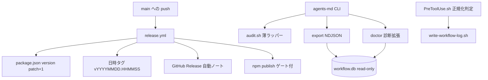
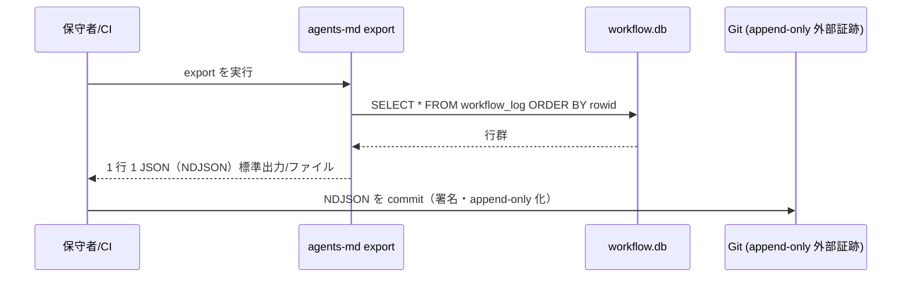

# 設計書: npm 公開整備（パッケージ改名 agent-skill-chain ＋ main マージ時の自動リリース機構）

**プロジェクト名**: npm 公開整備（パッケージ改名 agent-skill-chain ＋ main マージ時の自動リリース機構）
**作成日**: 2026 年 06 月 16 日
**最終更新**: 2026 年 06 月 16 日

> **重要**: **このドキュメントは常に更新**: 設計の変更や追加があった場合は、即座にこのドキュメントを更新してください。
>
> **用語**: [.agents/CONCEPTS.md §用語規約](../../../../.agents/CONCEPTS.md#用語規約) を参照。

---

## 1. 設計概要

### 1.1 設計方針

[01_要件定義.md](./01_要件定義.md) の A（改名）/B（自動リリース）/C-1〜C-7（補強群）を、**正本のみを編集しアダプタは正規フローで再生成する**方針で実装する設計を定める。実装方式の確定（bin 名・release.yml の bump/tag/publish フロー・C-4 の二防御分離・C-5 audit/doctor 強化・C-7 export スキーマ）と、SC-1〜SC-14 ↔ テストの対応、90_issues 化の要否判断を本書で行う。

### 1.2 設計原則（本プロジェクトで適用するもの）

- **UNIX哲学**: 既存スクリプト（`audit.sh`・`write-workflow-log.sh`・`verify-npm-pack.sh`）を**組み合わせ**、CLI/CI から**薄く呼ぶ**。新ロジックの二重実装を避ける（C-5 audit は `audit.sh` の薄ラッパー、C-7 export は単一スクリプト）。
- **単一責務**: 改名（A）・リリース（B）・補強（C-1〜C-7）を機能単位で分離。C-4 は「パス正規化」と「AGENT_ROLE 偽装耐性」を**別防御**として分離（N-3）。
- **明確な境界**: 正本（`.agents/`・`package.json`・`README.md`・`.github/`・`bin/`・`src/`）のみ編集。`.adapters/`・`.claude/` は build/setup の生成物であり**手編集禁止**。
- **AIフレンドリー設計**: 既存スクリプトの責務・命名を踏襲し、診断出力・export 出力は機械可読（行ベース・NDJSON）にする。

---

## 2. アーキテクチャ設計

### 2.1 責務・境界・参照関係

#### 2.1.1 責務一覧

| コンポーネント | 責務（1 文） |
| -------------- | ------------ |
| **A. 改名（メタデータ＋参照修正）** | `package.json:name` を `agent-skill-chain` にし、旧名フルトークンを tracked active 8 ファイルから除去する。 |
| **B. release.yml（自動リリース）** | main への push を契機に version patch +1・日時タグ・GitHub Release・npm publish を実行する CI を定義する。 |
| **C-1 強制力マトリクス** | ツール別強制力を 3 区分で示す表を正本 1 か所に置き、もう一方から参照する。 |
| **C-2 表現是正** | `package.json:description` と README の「全ツール対応」誤読表現を段階配備＋CI 最終保証へ是正する。 |
| **C-3 hook E2E ハーネス** | 実機相当の settings.json 配線＋実プロセス stdin JSON 注入を合成環境で再現する E2E テスト＋手順文書を提供する。 |
| **C-4a パス正規化判定** | PreToolUse.sh の write-workflow-log.sh 単独実行判定を正規化済み絶対パス比較にする。 |
| **C-4b AGENT_ROLE 偽装耐性** | env 偽装は別防御（hook 側の env 出所制御）として分離して設計する。 |
| **C-5 audit/doctor 強化** | `agents-md audit`（audit.sh 薄ラッパー）新設と `doctor` の enforcement/証跡健全性診断拡張を行う。 |
| **C-6 CI テンプレート同梱** | audit 実行特化の消費者向け workflow テンプレートを `.workflow/templates/` 配下に置き pack 収録する。 |
| **C-7 NDJSON export** | workflow.db の `workflow_log` を NDJSON で書き出す CLI/スクリプトと検証テストを提供する。 |

#### 2.1.2 境界

- **入力**: 確定済み 00/01（SC-1〜SC-14・US1〜12・UC1〜11）、現状の正本ファイル群。
- **出力**: 改変された正本ファイル群（A/B/C）＋新規テスト＋手順文書。
- **他責務との境界（本 issue の範囲外）**: 実 `npm publish`・GitHub Secrets（`NPM_TOKEN`）登録・npm org 作成/所有権移管・実機 Claude Code での hook 実行は**ユーザー操作**。C 群は「定義・ハーネス・テストが存在し合成環境で実行可能」まで。`.adapters/`・`.claude/` の生成物は本 issue で手編集しない（setup/build の正規フローで再生成）。

#### 2.1.3 参照関係

- `release.yml` → `package.json`（version 読取・bump）、`sync-version.sh`（廃止/改修判断）、`verify-npm-pack.sh`（pack 検査）。
- `agents-md audit`（bin/src）→ `.agents/enforcement/ci/audit.sh`（薄ラッパー呼び出し）。
- `agents-md doctor`（bin/src）→ `PreToolUse.sh` 実在判定・`workflow.db`（read-only の hash チェーン検証）。
- `agents-md export`（または `.agents/scripts/export-ndjson.sh`）→ `workflow.db`（read-only SELECT）、`.agents/ledger/schema.sql`（カラム順の正本）。
- C-3 E2E → `PreToolUse.sh`・`platforms/claude/settings.enforce.json`（配線契約）。
- 循環参照なし（CLI → スクリプト → DB の一方向）。

### 2.2 システムアーキテクチャ

- **採用パターン**: 既存「薄い CLI ラッパ＋スクリプト正本」構造の踏襲（CLI は spawnSync でスクリプトを呼ぶ／ロジックはスクリプトに置く）。
- **根拠**: spec/06 の優先順位（可読性＞単一責務＞仕様整合）と spec/01 UNIX 哲学（組み合わせ・二重実装回避）に従い、`audit.sh`/`write-workflow-log.sh` の既存正本を壊さず薄く拡張する。

#### 2.2.1 CQRS

- **Command（状態変更）**: release.yml の version bump/tag/publish、`write-workflow-log.sh` の INSERT（既存）。
- **Query（状態取得・副作用なし）**: `agents-md audit`/`doctor` の診断、`export` の SELECT、`write-workflow-log.sh --print-head`（既存 read 経路）。export と doctor は read-only に厳守（query に副作用を書かない）。

#### 2.2.2 アーキテクチャ図



### 2.3 コンポーネント構成

- **正本編集レイヤ**: `package.json`・`README.md`・`.github/workflows/release.yml`・`bin/agents-md.js`＋`src/agents-md.ts`（ビルド元）・`.agents/enforcement/claude/PreToolUse.sh`・`.agents/scripts/`（新規 export スクリプト）・`.agents/enforcement/README.md`（C-1 正本候補）。
- **テストレイヤ（非配布・`test/`）**: hook E2E（C-3）、C-4 回帰、audit/doctor 自己テスト（C-5）、export 検証（C-7）、改名後 pack 検査（SC-2/SC-3/SC-13）。`run-all.sh` の TESTS 配列に追加（runner I/F 踏襲）。
- **テンプレートレイヤ（配布・`.workflow/templates/github/workflows/`）**: C-6 の audit 実行テンプレート。

### 2.4 データフロー

`workflow_log`（既存スキーマ）への書き込みは `write-workflow-log.sh` のみ（不変）。C-7 export は読み出し専用。イベント発行はしない（同期処理で十分。spec/06「単純な同期処理で十分なら無理に導入しない」）。



---

## 3. 機能設計

### 3.1 A: パッケージ改名 `agent-skill-chain`

#### 3.1.1 概要・設計判断

- `package.json:name` を `@techbeansjp-free/agents-md` → **`agent-skill-chain`** へ変更。`publishConfig.access: public` は維持（unscoped public も問題なし）。`files`・`engines`・`license` 不変。
- **bin 名の設計判断（00 §8 申し送り N・確定）**: **bin 名は `agents-md` を据え置く**。
  - **根拠**: ①パッケージ名と bin 名は npm 上で独立しており据え置き可能。②CLI コマンド名変更は後方互換性の破壊（既存利用者の `npx agents-md ...`・ドキュメント・hook 配線・`test/e2e-install-uninstall.sh` の前提に波及）であり、spec/06 の「可読性＞変更容易性」に照らしても改名の UX 利得が小さい。③`src/agents-md.ts`・`bin/agents-md.js` のファイル名も bin と整合しているため据え置きが一貫。
  - **波及**: bin 据え置きのため `src/agents-md.ts` の**ヘルプ内 `npx @techbeansjp-free/agents-md <command>` 例示と例セクションのパッケージ名のみ**を新名へ是正する（bin 呼び出し名 `agents-md` は変えない）。`printHelp()` 内の `name = "agents-md"` は bin 名なので不変。
- **旧名波及修正（tracked active 8 ファイル・close 除外）**: `package.json` / `package-lock.json` / `src/agents-md.ts` / `README.md` / `.agents/SETUP.md` / `docs/maintainer/RELEASE.md` / `docs/maintainer/adapters.md` / `.github/workflows/release.yml`。本フェーズ調査の `git ls-files | grep -v '^docs/maintainer/workflow/close/' | xargs grep -lI` ヒットと一致（実装時に再走査して網羅）。
  - `package-lock.json` は name フィールド（`"name"` の root と `packages.""`）を新名に整合（`npm install`/`npm i --package-lock-only` 再生成で同期するのが安全）。
- **author/homepage/repository/bugs の URL（`techbeansjp-free`）はリポジトリ org であり旧**パッケージ**名ではない**ため SC-2 のフルトークン `@techbeansjp-free/agents-md` には該当せず、本 issue では変更しない（移管時に別途。SC-2 判定は org URL を誤検知しない＝フルトークン固定で担保）。

#### 3.1.2 SC-2 判定方法（テスト観点）

tracked active に走査対象を固定し、旧名フルトークンのヒット 0 件を判定する。`.summary/` 等 untracked・allowlist 外生成物の偽陽性を排除する。

```bash
git ls-files | grep -v '^docs/maintainer/workflow/close/' \
  | xargs grep -lI '@techbeansjp-free/agents-md'   # ヒット 0 件で PASS
```

### 3.2 B: main マージ自動リリース（release.yml 全面改訂）

#### 3.2.1 概要・確定フロー（案C）

トリガを現行 `on: push: tags: v*` から **`on: push: branches: [main]`** へ全面改訂する。ジョブ構成（確定）:

1. **checkout**（`fetch-depth: 0`・tags 取得）→ **setup-node**（registry-url 設定）→ **sqlite3 導入**（既存踏襲・DB 検査が要る場合）。
2. **JST 日時タグ決定**: `TZ=Asia/Tokyo date +v%Y%m%d.%H%M%S` でランナー TZ（既定 UTC）に依存しない日時タグを生成し `GITHUB_OUTPUT` に出力。
3. **version bump（patch +1）**: `npm version patch --no-git-tag-version` で `package.json` の PATCH を +1（git tag は npm に作らせず後段で日時タグを作る＝semver と日時タグの分離）。`sync-version.sh` が plugin.json 等と同期する場合は bump 後に整合させる。
4. **publish 前検査**: `npm ci && npm run build`（bin 生成）→ `verify-npm-pack.sh`（リーク/必須物・allowlist）。**改名後の name で pack が成功すること**を SC-3 と兼ねる。
5. **GitHub Release 作成**: 日時タグを作成し、`gh release create <tag> --generate-notes`（または `softprops/action-gh-release` の `generate_release_notes: true`）で自動生成ノート付き Release を公開。
6. **npm publish（ゲート付）**: 既存の `NPM_TOKEN` ゲート（未設定なら skip・ジョブ失敗にしない）を踏襲し、`npm publish --access public`（unscoped public `agent-skill-chain`）。

#### 3.2.2 設計判断事項の確定

- **version bump コミットの main 反映方式（再発火防止）**: bump 結果を main へ**書き戻す**。書き戻しコミットメッセージに **`[skip ci]`**（および `paths-ignore` で `package.json`/`package-lock.json` のみの push を無視する保険）を付け、push が再度ワークフローを発火させない。bot push 用に `permissions: contents: write` と `github-actions[bot]` の author を使う（既存 marketplace ジョブと同方式）。これにより**無限ループを防止**する。
- **タグ衝突対策（同秒マージ・リトライ段数の明示・N-C）**: `vYYYYMMDD.HHMMSS` の作成前に `git fetch --tags` し、同名タグが存在する場合は**秒に +1 した代替**（または `-2`/`-3` のサフィックス）を採る。`concurrency: group=release, cancel-in-progress: false` でジョブを**直列化**し同秒衝突確率を下げる。**リトライ段数の上限（確定）**: 直列化されていても同一秒内に連続実行されれば日時タグは同値になりうる（直列＝時刻が進む保証ではない）ため、**最大 3 段**（候補: `+0` 元秒 → `+1` 秒 → `-2` サフィックス → `-3` サフィックス＝合計 4 候補・3 回リトライ）まで試行し、それでも衝突する場合は**ジョブを明示的に失敗させる（取りこぼしを成功と誤認させない）**。極端な同秒多重は実害が低いため上限 3 段で打ち切る。
- **bump 起点の取り直し（並行マージ・N-B）**: `npm version patch --no-git-tag-version` は checkout した main の `package.json` を起点に +1 する。`concurrency: {group=release, cancel-in-progress:false}` で直列化されるため、後続ジョブは前段の bump 書き戻し後の main を checkout でき競合は基本回避される。ただし「書き戻し push が前段 publish より前に main へ反映完了している」前提が崩れると 2 連続マージで同一 patch を二度採番しうる。**緩和手順（確定）**: ①bump 直前に `git fetch origin main && git pull --rebase origin main` で**最新 main を取り直してから** bump する（起点を最新化）。②それでも version が衝突した場合は publish ステップの冪等性（次項 `npm view` skip）が安全網となる。③書き戻し push が `non-fast-forward` で reject された場合は `git pull --rebase` の上で 1 回再試行する。
- **publish 失敗時の再実行可否**: version bump は publish 成功とは独立に main へ反映されうるため、**publish ステップを冪等に**する（`npm view <name>@<version>` で当該 version が既に存在すれば skip＝再実行で二重 publish しない）。部分成功（version 上がり・publish 失敗）時は同一 version で再 publish 可能（既存なら skip）とし、tag/Release も `gh release view` で既存判定して二重作成を避ける。
- **bot 無限ループ防止**: 上記 `[skip ci]`＋`concurrency`＋（保険として）`if: github.actor != 'github-actions[bot]'` の二重化。
- **書き戻しに用いるトークン種別（無限ループ防止の主因・N-A）**: bump 結果の書き戻し push には **GitHub Actions の既定 `GITHUB_TOKEN`（`secrets.GITHUB_TOKEN` / `actions/checkout` の既定認証）を用いる**。**既定 `GITHUB_TOKEN` による push は `on: push` workflow を再トリガしない**という GitHub の仕様が**無限ループ防止の主因（第一防御）**である。PAT や deploy key を用いると再発火しうるため、本設計では**書き戻しに PAT/deploy key を使わない**ことを明記する。`[skip ci]`・`concurrency`・`actor != github-actions[bot]` は belt-and-suspenders の補助防御（PAT を使う場合や将来トークンを差し替えた場合の保険）として位置づける。`paths-ignore` で `package.json`/`package-lock.json` のみの push を無視する保険は **workflow 単位の発火抑止**であり、通常 PR が package.json 変更を伴う場合に当該 push を誤って無視しうるため、**主防御（既定 token 非再トリガ）を前提に補助としてのみ採用**し、誤抑止を避けたい場合は付けない（実装で確定）。
- **既存 marketplace ジョブ（案A・`release/marketplace` へ生成物 commit）との統合・tag 比較の撤去（M-2）**: トリガが tag→main へ変わると、現行 release.yml の **npm-publish ジョブ `:56-66` と marketplace（release）ジョブ `:135-147` の inline 比較 `tag="${GITHUB_REF_NAME#v}"` → `tag == package.json` は `GITHUB_REF_NAME=main`（非 semver）となり必ず失敗する**。よって**両ジョブの tag 起点比較ブロックを撤去し、bump 後の `package.json` version を基準に置換する**。
  - **新仕様（置換後ロジック）**:
    1. **tag を比較基準にしない**。version の単一の真実源は **bump 後の `package.json:version`**（手順 §3.2.1 step 3 で `npm version patch --no-git-tag-version` により確定した値）とする。`GITHUB_REF_NAME` を semver として解釈する箇所（`#v` 除去・`tag == pkg` 比較）を**両ジョブから削除**する。
    2. **日時タグ**（`vYYYYMMDD.HHMMSS`）は **package.json の semver patch とは独立な「リリースの目印」**であり、`package.json:version`（semver）と一致させる対象ではない（semver と日時タグの分離。§3.2.1 step 2/3）。よって「tag == package.json」という不変条件自体が新フローでは成立しないため撤去が正しい。
    3. **package.json ↔ plugin.json の整合**は引き続き `sync-version.sh --check`（pkg vs plugin の比較で tag 非依存）で担保する。`sync-version.sh` 自体は改修不要。**release.yml 内 inline の tag 比較のみを撤去**する（sync-version.sh の呼び出しは残す）。
    4. **marketplace（release）ジョブ**は bump 後 `package.json` を checkout した状態で build-adapters → 決定性チェック → 生成物 commit を行う（version 同期検証は plugin.json 整合のみに縮約）。commit メッセージの `${GITHUB_REF_NAME}` 参照（`:202`）は main push では `main` になるため、**bump 後 version か日時タグを参照する**ように合わせる（実装で確定）。
  - **決定性チェック（再 build diff ゼロ）は維持**。
- **Secrets**: `NPM_TOKEN` 名を踏襲（登録はユーザー操作・SC 対象外）。

### 3.3 C-1: ツール別強制力マトリクス

- **正本配置（確定）**: 正本は **`.agents/enforcement/README.md`**（強制の正本・4 層表が既にある）に「## ツール別強制力マトリクス」節として置く。README.md からは**参照リンクのみ**（重複禁止）。
- **3 区分の各ツール分類**:

| ツール | 強制力区分 | 手段 |
| ------ | ---------- | ---- |
| Claude Code | runtime 強制あり | PreToolUse hook で exit 2 物理ブロック |
| Cursor | advisory のみ | agents-core.mdc によるルール配布・一部誘導 |
| Gemini | advisory のみ | 方針・プロンプト適用（予定） |
| Copilot | advisory のみ | リポジトリルール適用（予定） |
| Codex | advisory のみ | AGENTS.md 適用（予定） |
| CI（全ツール共通） | CI のみ（最後の砦） | audit.sh による事後検知・reject |

- 「最終保証は CI audit」を表に明記。既存 4 層表（Layer1〜4）との重複は避け、相互参照する。

### 3.4 C-2: description / README の表現是正

- `package.json:4` の description を是正例: 「`.agents` を正本に各 AI ツールへ段階的に配備するワークフロー仕様パッケージ。強制力はツールごとに異なり（Claude Code は runtime hook で強制、他はルール配布/方針適用）、最終保証は CI audit が担う。」
- README の該当箇所（導入節等）も同趣旨へ是正し、C-1 マトリクスへリンク。`keywords` は「全ツール対応」の含意がないため**原則維持**（`agents-md` キーワードは旧 bin 由来で残してよい＝SC-2 はフルトークン判定であり keyword の `agents-md` は非該当）。実装時に keyword の妥当性を再確認（advisory 系の誤読を生むものがあれば調整）。

### 3.5 C-3: Claude Code hook E2E ハーネス

- **実機相当の再現方式**: 既存 `test/test-pretooluse-hook.sh`（合成 JSON・tmp 隔離クリーン clone）を**起点に拡張**し、新規 `test/e2e-claude-hook.sh` を追加する。実機 Claude Code は起動できないため「実機相当」を次で再現:
  1. tmp 隔離環境に `agents-md init` 相当 → `enforce on` を適用し、**`.claude/settings.json` の PreToolUse 配線（`settings.enforce.json` 由来）を実構成**する。
  2. settings.json の hook コマンド指定を解釈し、**実プロセスとして hook を spawn し stdin に実機形式 JSON を注入**（`{"tool_name":...,"tool_input":{"command":...,"file_path":...}}`）して exit code を検証（block=2/allow=0）。
  3. AGENT_ROLE は settings.json の env 経由で渡る経路を再現。
- **合成テストとの関係**: `test-pretooluse-hook.sh` は hook 単体の入力契約（jq 有無両系統）を担保し続け、`e2e-claude-hook.sh` は**settings.json 配線を通した経路**を担保する（責務分離・重複は配線部分のみ）。
- **実機手順文書の置き場（確定）**: `docs/maintainer/` 配下に新規 `claude-hook-e2e.md`（実機 Claude Code での設定・確認手順）。`test/` には合成ハーネスを置き、文書は docs（保守者向け・非配布）に置く（配布物肥大化を避ける）。

### 3.6 C-4: write-workflow-log バイパス耐性（二防御分離・N-3）

#### 3.6.1 C-4a パス正規化（PreToolUse.sh のスクリプトパス判定）

- **対象**: `PreToolUse.sh:167-184`（R5 write-workflow-log.sh 単独実行判定）の first-token realpath 処理を**強化**。
- **実装方式**: ①CMD の第 1 トークンを取り出し、②`realpath`（無ければ `readlink -f`、無ければ `cd+pwd` フォールバック）で**正規化済み絶対パス**へ解決、③その絶対パスの basename が `write-workflow-log.sh` であることに加え、④**解決先が許可された正本パスに一致**することを確認する（symlink で別実体を指していても実体パスで弾く）。相対パス（`./x/write-workflow-log.sh`）も realpath 正規化で同一判定に収れんさせる。
- **許可正本パスの解決方式（消費者環境での誤 block 回避・N-E）**: **許可正本パスは開発リポの絶対パス固定ではなく、「実行 cwd 起点の配備先 `.agents/scripts/write-workflow-log.sh` を realpath で解決した値」とする**。消費者環境では `write-workflow-log.sh` は `agents-md init` 後に**消費者リポの `.agents/scripts/` 配下**へ配備されるため、開発リポの絶対パスだけを許可正本にすると、消費者の正当な実行経路を誤って block してしまう。よって許可正本は**実行時に `realpath "${PWD}/.agents/scripts/write-workflow-log.sh"`（または hook が解決した配備先）で算出した絶対パス**と一致比較する。固定文字列のハードコードは禁止。これにより開発リポ・消費者リポの双方で「配備先の正規 write-workflow-log.sh の単独実行」を正しく allow し、symlink/別実体は実体 realpath 不一致で block する。
- **R4/R5/R6 整合**: 既存 R4（複合シェル `;|&&||` 禁止）・R6（sqlite3 直接禁止）・R5（単独実行）の判定順序は維持し、C-4a は R5 のパス比較部分のみを正規化絶対パス比較へ差し替える（既存ガードを壊さない）。`bash -c "..."` は CMD 第 1 トークンが `bash` になり basename 不一致で弾かれる（既存挙動を維持・強化）。
- **write-workflow-log.sh:14-17 の DB パス**: 既に `realpath` ではないが固定パス組み立て。許可判定強化に合わせ、`write-workflow-log.sh` 側でも自スクリプトの正規化（`SCRIPT_DIR` は既に `cd+pwd` 済）を踏襲（DB パスは固定で引数上書き不可＝現状維持で安全）。

#### 3.6.2 C-4b AGENT_ROLE 偽装耐性（別防御）

- **分離の根拠（N-3）**: `write-workflow-log.sh:45` の `AGENT_ROLE=scribe` は**値の文字列比較**でありパス比較対象ではない。env 偽装はパス正規化では防げないため**別経路の防御**として設計する。

- **主防御＝runtime hook（PreToolUse）での env 出所制御（C-4b の主たる対策・M-1 反映）**: AGENT_ROLE 偽装に対する**主防御は runtime hook 側に置く**。現状の `PreToolUse.sh` は `ROLE="${AGENT_ROLE:-${CLAUDE_AGENT_ROLE:-unknown}}"` で**呼び出し元 env の AGENT_ROLE をそのまま信頼**しており（実体確認済）、ユーザー/サブが任意に `export AGENT_ROLE=scribe` した値を区別できない。これを次の方式で**出所を制御する**:
  1. **期待 nonce と実 nonce を別出所にする（実装方式・出所分離）**: scribe 権限の付与は、setup/enforce が配線した経路でのみ正規とする。**実 nonce** は `settings.json` の env（`AGENTS_SCRIBE_NONCE`）として hook 起動時に env 継承させ、**期待 nonce** は `enforce on` が生成して `${AGENTS_ROOT}/.scribe-nonce` ファイル（`0600`）へ書く。PreToolUse は「`AGENT_ROLE=scribe` を主張する呼び出しは、env の実 nonce が**ファイル出所の期待 nonce**と一致する場合に限り scribe として扱う」判定を入れる（不一致は `unknown` へ降格＝write-workflow-log.sh 実行を block）。ファイルが無い環境のみ env の期待 nonce（`AGENTS_EXPECTED_SCRIBE_NONCE`）にフォールバックする（後方互換）。**期待値をファイルから読むことで、env だけを掌握した相手が実 nonce と env 期待 nonce を同値に揃えても、`0600` ファイルを書けない限り一致させられない**（= 素朴な手動 `export AGENT_ROLE=scribe` の遮断）。
  2. **限界の正直化（過剰主張の除去・原理的な不完全性）**: この出所分離は**素朴な手動 `export AGENT_ROLE=scribe` を遮断**するに留まる。Claude Code の hook env は settings で配線されるため、**env 空間全体（および `0600` ファイルの読取）まで掌握できる相手に対する完全な防御ではない**。よって「nonce を知らないため scribe になれない」「scribe 偽装を確実に block する」等の**過剰主張はしない**。最終保証は CI audit ＋ 外部証跡（NDJSON export / 署名 / append-only）が担う（下記「CI audit の限界」と整合）。文書（enforcement/README）には「AGENT_ROLE をシェルで手動 export して scribe を騙ることは契約違反であり、ファイル出所の期待 nonce で遮断される（ただし完全防御ではない）」と明記する。
  - **回帰テスト（SC-11 の主基準）**: 「正規経路（ファイル出所の期待 nonce と一致する実 nonce）でのみ scribe として write-workflow-log.sh が allow され、**手動 export した AGENT_ROLE=scribe（env のみで実 nonce/期待 nonce を同値に揃えてもファイル出所と不一致）は block される**」ことを hook の回帰テストで検証する（**実在しない CI 検知に依存しない**）。

- **CI audit の限界（既知の残存リスク・正直記述・M-1 反映）**: **CI audit（`audit.sh`）は AGENT_ROLE 偽装 INSERT を完全には検知できない**。理由: `workflow_log` の行には**出所情報（誰が AGENT_ROLE を設定したか）が無く**、`schema.sql` の `CHECK (actor_role='scribe')` / `CHECK (delegated_by_role='orchestrator')` により**全行が必ず `scribe`/`orchestrator` で記録される**ため、偽装者が `AGENT_ROLE=scribe` で INSERT した行も `actor_role='scribe'` となり **audit #12（`actor_role != 'scribe'` を FAIL）・#13（`delegated_by_role NOT IN('orchestrator')` を FAIL）は PASS（非検知）**になる。#25 は「成果物変更があるのに委譲・証跡の対応がない」ケースの検知であり、**偽装 INSERT そのものを actor 出所で検知する仕組みではない**。よって「#12/#13/#25 が env 偽装を事後検知する」という従前の主張は**現状の audit.sh では成立しない**。
  - **位置づけ（補強としての CI）**: CI audit は env 偽装の**直接検知器ではなく**、export（C-7）＋ Git append-only／署名（外部証跡）による**事後監査での補強**に位置づける。export 済 NDJSON を外部で保全することで「DB 改ざん・後付け INSERT」を**外部突合で検知**する経路を主とする。
  - **任意の緩和（過剰設計にしない・doctor/audit の警告）**: 偽装が疑われる**痕跡**を doctor/audit が**警告**する緩和を**任意施策**として記す（必須ではない）。例: ①hash チェーン不整合（`doctor` の hash 検証＝§3.7・後付け改ざんの痕跡）、②想定外の連続 INSERT（短時間に同一 issue へ多数の scribe INSERT 等のヒューリスティック警告）。これらは「偽装の確証」ではなく「要確認の痕跡」として `[WARN]` を出すに留め、過剰設計化させない。

- **過剰要求の回避**: C-4 を「正規化絶対パス比較で env 偽装まで防ぐ」と誤って一括りにしない。02 では C-4a（パス正規化）と C-4b（env 出所制御＝主防御 + CI 限界の正直記述）を別防御として独立に記述する。AGENT_ROLE 偽装防御の主体は**runtime hook の env 出所制御**であり、CI は**完全検知できない既知残存リスク**を抱えたまま外部証跡で補強する、という二段構えを正本とする。

### 3.7 C-5: agents-md audit / doctor 強化

- **audit サブコマンド（確定・薄ラッパー）**: `agents-md audit [dir]` を新設。**`.agents/enforcement/ci/audit.sh` を spawnSync で呼ぶ薄ラッパー**とし、判定ロジックを CLI に再実装しない（UNIX 哲学・二重実装回避）。引数 `dir`（既定 cwd）と `AUDIT_GIT_RANGE` 等の env を透過。終了コードを audit.sh のものへ pass-through。
  - **妥当性**: 既存 audit.sh が単一正本であり、CLI から利用者が「強制が効いているか／証跡が健全か」を 1 コマンドで回せる UX 価値が高い。薄ラッパーなら drift しない。
- **doctor 拡張**: 既存の存在確認に加え、(a) **enforcement 配線状態**（enforce on/off は既存・拡張で `settings.enforce.json` と実 settings の差分検知）、(b) **証跡健全性**＝`workflow.db` の **hash チェーン検証**（read-only。各行 `entry_hash` 再計算と `prev_hash` 連結の照合）、(c) **整合性**（`PRAGMA integrity_check`）。
- **hash 検証は `gen_entry_hash` 共有関数からの呼び出しを must とする（再実装禁止・N-D）**: doctor の hash 再計算は **`write-workflow-log.sh` の `gen_entry_hash` と同一の共有ソース（共有関数）を呼び出すことを必須**とする。式は **14 フィールド `eid|pid|docid|ts|ar|dr|cmd|iid|rid|ip|rp|cf|sum|dod` を `|` 連結 → `sha256sum`**（`write-workflow-log.sh:92-94` で実体確認済）。**doctor 側で再実装すると 1 文字でもズレた瞬間に全行が false positive（健全 DB を改ざんと誤検知）になる**ため、`.agents/scripts/` 配下に `gen_entry_hash` を共有関数として切り出し、`write-workflow-log.sh`（書込時）・`doctor`（検証時）・`export`（必要時）が**同一実装を source/呼び出し**する。doctor 内独自実装・式の二重定義は禁止（03 T5 の DoD に必須化）。
- **自己テスト**: `test/test-cli-audit-doctor.sh`（新規）で、(1) audit ラッパーが audit.sh の終了コードを透過、(2) doctor が改ざん DB（hash 不整合・integrity 破損）を検知して [NG] を出す、を tmp 隔離で検証。

### 3.8 C-6: CI workflow テンプレート同梱

- **新規 vs 流用（確定）**: 既存 `subagent-guard.yml` は audit を**任意ステップ**（"optional"）として呼ぶに留まる。消費者が「最後の砦」として audit を**必須実行**する専用テンプレートを**新規追加**する: `.workflow/templates/github/workflows/audit.yml`。
  - 内容: `on: [pull_request, push]`、checkout（`fetch-depth: 2` で `HEAD~1..HEAD` 差分）、sqlite3 導入、`.agents/enforcement/ci/audit.sh .` を**必須実行**（exit 非 0 で fail）。`PR_BODY` を env で渡す。
  - subagent-guard.yml と役割が重複しないよう、audit.yml は「audit 単体の最後の砦」、subagent-guard.yml は「guard＋optional audit」と棲み分け（README で用途を案内）。
- **allowlist 整合**: `files` allowlist は `.workflow/templates/` を含むため**追加変更不要**で pack 収録される。`npm pack --dry-run` 収録物に `audit.yml` が含まれることをテストで確認（SC-13）。

### 3.9 C-7: workflow.db → NDJSON export

- **実装形態（確定）**: **`.agents/scripts/export-ndjson.sh`** を新規追加し、CLI から `agents-md export [dir]` で呼ぶ薄ラッパーを bin/src に追加（C-5 audit と同方式）。スクリプト正本は `.agents/scripts/`（配布物 allowlist 内）。
- **出力スキーマ（NDJSON・1 行 1 JSON）**: `workflow_log` の全カラムを `rowid` 昇順（INSERT 順＝因果順）で出力。カラム順の正本は `.agents/ledger/schema.sql`。各行例:

```json
{"entry_id":"...","parent_entry_id":"...","document_id":"...","ts_utc":"...","created_at":"...","actor_role":"scribe","delegated_by_role":"orchestrator","command":"design-feature","issue_id":"...","review_id":null,"issue_path":"...","review_path":null,"document_path":"...","changed_files_json":"[]","summary":"...","dod_met":1,"prev_hash":"...","entry_hash":"..."}
```

- **可視化の主眼（N-4）**: `actor_role`（=scribe）・`delegated_by_role`（=orchestrator）は `schema.sql` の CHECK で**固定値**＝定数のため可視化の主眼にしない。**「誰が誰に何を依頼したか」の実価値は `parent_entry_id` / `command` / `issue_id` の連鎖側**にある。export はこれらを必ず含め、補助として `parent_entry_id → entry_id` の連鎖を辿れる出力（同一 NDJSON で再構成可能）にする。
- **実装方式**: `sqlite3` で 1 行 1 JSON を生成（`SELECT json_object(...)` が利用可なら使用、無ければ `-json` モードや `escape_sql` 相当でフィールド組立）。read-only（query に副作用なし）。`sqlite3` 不在時は明示エラー終了。
- **改ざん耐性の限界と補強（仕様明記）**: `prev_hash`/`entry_hash` のハッシュチェーンは**逐次改ざんは検知できるが DB 丸ごと差し替えには不完全**。export した NDJSON を **Git 管理（追跡）・コミット署名・append-only 運用**することで外部証跡として補強する方針を doctor/export の文書と 00/01 §3.6・§7 に整合させて明記。export 自体は DB を変更しない。
- **検証テスト**: `test/test-export-ndjson.sh`（新規）で、(1) 既知の workflow.db から行数・各行が妥当 JSON・`parent_entry_id`/`command`/`issue_id` を含むこと、(2) rowid 昇順、(3) read-only（export 後に DB 不変）を tmp 隔離で検証。

---

## 4. データ設計

### 4.1 データモデル

`workflow_log` テーブルは既存スキーマ（`.agents/ledger/schema.sql`）を**変更しない**（C-7 は read-only export のみ・C-4/C-5 はスキーマ非依存）。export の NDJSON は当該テーブルの列の写像であり新テーブルは作らない。

| テーブル名 | 説明 | 主キー |
| ---------- | ---- | ------ |
| workflow_log | 証跡ログ（既存・不変） | entry_id |

NDJSON export はテーブルの 1 行を 1 JSON オブジェクトへ射影するのみ（リレーション追加なし）。

---

## 5. API 設計

### 5.1 API（CLI/CI/スクリプト）一覧

| インターフェース | 種別 | 説明 |
| ---------------- | ---- | ---- |
| `agents-md audit [dir]` | CLI | audit.sh の薄ラッパー（終了コード透過） |
| `agents-md doctor` | CLI | 導入/enforcement/証跡健全性（hash チェーン・integrity）診断 |
| `agents-md export [dir]` | CLI | workflow.db → NDJSON（export-ndjson.sh 薄ラッパー） |
| `.agents/scripts/export-ndjson.sh [db]` | スクリプト | NDJSON 出力の正本ロジック |
| `release.yml`（main push） | CI | bump+tag+release+publish |
| `.workflow/templates/github/workflows/audit.yml` | テンプレート | 消費者向け audit 必須実行 CI |

### 5.2 API 詳細

#### agents-md export

- **入力**: `[dir]`（既定 cwd。`<dir>/.workflow/workflow.db` を読む）。
- **出力**: 標準出力に NDJSON（1 行 1 JSON）。エラー時は stderr＋非 0。
- **契約違反の扱い**: DB 不在 → 明示エラー非 0。`sqlite3` 不在 → 明示エラー非 0。`workflow_log` 不在 → 空出力＋警告。read-only（DB を変更しない）。

#### agents-md audit

- **入力**: `[dir]`（既定 cwd）。env（`AUDIT_GIT_RANGE`/`WORKFLOW_DIRS`/`PR_BODY`）透過。
- **出力**: audit.sh の stdout/stderr をそのまま。**終了コードは audit.sh のものを pass-through**。
- **契約違反の扱い**: audit.sh 不在（壊れたパッケージ）→ 明示エラー非 0。

---

## 6. テスト戦略

### 6.1 対象ごとのテスト割り当て

| 対象 | 単体 | 結合/E2E | クリティカル観点 | バリデーション観点 | 未達理由/補足 |
| ---- | ---- | -------- | ---------------- | ------------------ | ------------- |
| A 改名（SC-1/SC-2/SC-5） | ○ | ○(pack) | 旧名残存ゼロ・name=agent-skill-chain | grep フルトークン固定・走査 tracked active 限定 | 実 publish は SC 対象外。**SC-4（移管手順）・SC-5（名前確定理由）はテストコード化できない＝ドキュメント存在確認（00 §8 / RELEASE.md の該当記述を grep で存在確認）で代替・N-F** |
| A pack 健全性（SC-3） | × | ○ | allowlist 範囲内・dry-run 成功 | tarball 一覧検査 | verify-npm-pack.sh 流用 |
| B release.yml（SC-6/SC-7） | × | ○(構文/方針) | main トリガ・patch bump・日時タグ・publish ジョブ存在 | YAML 妥当性・bump/tag/skip-ci/ゲート | 実発火はユーザー操作・SC 対象外 |
| C-1 マトリクス（SC-8） | ○(grep) | × | 3 区分が README＋enforcement に存在 | 表構造・相互参照 | — |
| C-2 表現是正（SC-9） | ○(grep) | × | 旧誤読表現ゼロ・是正表現存在 | description/README | — |
| C-3 hook E2E（SC-10） | ○ | ○ | settings 配線経由 block/allow | stdin JSON 契約 | 実機実行は SC 対象外 |
| C-4a パス正規化（SC-11） | ○ | ○ | 相対/symlink/bash -c を弾く | 正規化絶対パス比較 | — |
| C-4b env 偽装（SC-11） | ○ | ○ | 主防御=hook の env 出所制御（素朴な手動 export scribe を block・完全防御ではない） | 期待 nonce はファイル(0600)出所・実 nonce は env 出所で一致時のみ allow | CI は完全検知不可の既知残存リスク→export+append-only で補強（M-1） |
| C-5 audit/doctor（SC-12） | ○ | ○ | audit 終了コード透過・doctor が改ざん検知 | hash チェーン・integrity | — |
| C-6 CI テンプレ（SC-13） | × | ○(pack) | allowlist 内・pack 収録 | audit.yml 構文 | — |
| C-7 export（SC-14） | ○ | ○ | NDJSON 妥当・連鎖列含む・read-only | rowid 昇順・json 妥当性 | — |

### 6.2 監査・レビューでの確認（証跡）

§6.1 の割当と 03 のタスク別テスト観点・BDD（UC1〜11 対応）が揃っていることを確認する。テストは `test/run-all.sh` の TESTS 配列に追加し、tmp 隔離（`.agents-project/自己拡張ワークフロー.md §テストの tmp 隔離`）を厳守する。

---

## 7. UI 設計

該当なし（CLI・CI・スクリプト・ドキュメントのみ。画面 UI を持たない）。

---

## 8. セキュリティ設計

### 8.1 認証・認可

- 実 publish・npm login・org 移管・`NPM_TOKEN` 登録は本 issue で実行しない（ユーザー操作）。CI 定義はトークン名前提のみ。
- C-4 の許可判定強化（パス正規化）と env 偽装の別防御で証跡記録経路の信頼性を高める。

### 8.2 データ保護

- C-7 export はハッシュチェーンの限界（DB 丸ごと書換）を補う外部証跡（Git append-only・署名）方針を明記。export は read-only で DB を破壊しない。

---

## 9. 非機能要件への対応

### 9.1 パフォーマンス

- CLI/CI/スクリプトのため特段の性能要件なし。export は read-only の単一クエリ。

### 9.2 可用性・冪等性

- release.yml の**無限ループ防止の主因は「既定 `GITHUB_TOKEN` による書き戻し push は `on: push` を再トリガしない」という GitHub 仕様**（§3.2.2・N-A）。`[skip ci]`・`concurrency`・`actor != bot`・`paths-ignore` は補助防御。publish/tag/Release の既存判定（冪等）で暴発・タグ衝突（最大 3 段リトライ・§3.2.2）・部分成功を回避。`NPM_TOKEN` 未設定時は publish を安全に skip。

### 9.3 90_issues 化の判断（N-5・必須記載）

- **判断: 単一 issue 内で 03 のタスク分解により管理し、サブ issue 分割（90_issues 化）はしない。**
- **根拠**: ①A→B は `release.yml`・`package.json` で合流し密結合のため分割すると整合検証が二重化する。②C 群は独立性が高い（C-3/C-4/C-5/C-7）が、いずれも既存正本（`PreToolUse.sh`・`audit.sh`・`write-workflow-log.sh`・`workflow.db`）への**薄い追加**であり、PR レビュー単位として 1 PR でレビュー可能な規模に収まる（新規ロジックの大半は薄ラッパー＋テスト）。③spec/06「可読性＞単一責務」に照らし、issue 分割によるトレーサビリティ分断より、1 issue 内のタスク分解（03 で SC↔タスク対応を明示）で管理する方が見通しが良い。
- **帰結**: 親ワークフロー直下に `90_issues.md` は**作成しない**（サブ issue 0 件）。03 でタスクを SC 単位に分解し、PR が肥大化した場合の分割は実装フェーズの判断余地として申し送る。

---

## 10. 参考資料

### プロジェクトドキュメント

- [`01_要件定義.md`](./01_要件定義.md) - 要件定義
- [`00_要求定義.md`](./00_要求定義.md) - 要求定義
- 現状正本: [`.github/workflows/release.yml`](../../../../.github/workflows/release.yml)・[`.agents/enforcement/claude/PreToolUse.sh`](../../../../.agents/enforcement/claude/PreToolUse.sh)・[`.agents/scripts/write-workflow-log.sh`](../../../../.agents/scripts/write-workflow-log.sh)・[`.agents/enforcement/ci/audit.sh`](../../../../.agents/enforcement/ci/audit.sh)・[`bin/agents-md.js`](../../../../bin/agents-md.js)・[`.agents/ledger/schema.sql`](../../../../.agents/ledger/schema.sql)

### その他の参考資料

- spec: [01_設計原則](../../../../.agents/spec/01_設計原則.md)・[06_設計判断の優先順位](../../../../.agents/spec/06_設計判断の優先順位.md)
- [.agents-project/自己拡張ワークフロー.md](../../../../.agents-project/自己拡張ワークフロー.md)（正本/アダプタ・tmp 隔離）

---

## 11. 前のステップ

- **前**: [`01_要件定義.md`](./01_要件定義.md) - 要件定義フェーズ

---

## 12. 次のステップ

- **次**: [`03_実装計画.md`](./03_実装計画.md) - 実装計画フェーズ
