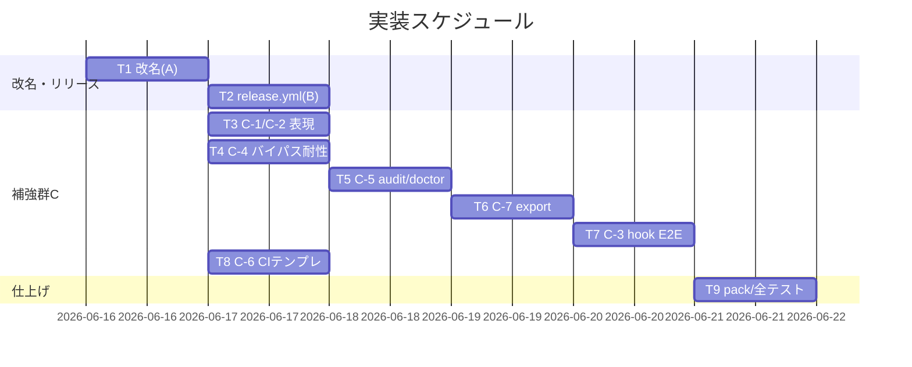

# 実装計画書: npm 公開整備（パッケージ改名 agent-skill-chain ＋ main マージ時の自動リリース機構）

**プロジェクト名**: npm 公開整備（パッケージ改名 agent-skill-chain ＋ main マージ時の自動リリース機構）
**作成日**: 2026 年 06 月 16 日
**最終更新**: 2026 年 06 月 16 日

> **重要**: 実装計画の変更・進捗・バグは即時更新すること。
> **必須項目**: テスト観点・BDD 仕様は具体ケースを 1 件以上記載する。
>
> **用語**: [.agents/CONCEPTS.md §用語規約](../../../../.agents/CONCEPTS.md#用語規約) を参照。

---

## 1. 実装概要

### 1.1 実装方針

[02_設計.md](./02_設計.md) に従い、正本のみ編集（`.adapters/`・`.claude/` は build/setup で再生成・手編集禁止）し、既存スクリプト（audit.sh・write-workflow-log.sh・verify-npm-pack.sh）を薄く拡張・流用する。タスクは SC 単位に分解し、各タスクにテスト観点・BDD を付す。サブ issue 分割はしない（02 §9.3。`90_issues.md` 不作成）。

### 1.2 実装順序



---

## 2. タスク分解

> **必須**: 各タスクに「テスト観点」(2.x.3) と「単体テスト仕様(BDD)」(2.x.4) を記載。tmp 隔離（`mktemp -d`・本番 `.agents/`/`workflow.db` 不破壊）を厳守。

### 2.1 タスク 1（T1）: パッケージ改名 A（SC-1/SC-2/SC-3/SC-5・UC1/UC2/UC3）

#### 2.1.1 概要

`package.json:name` を `agent-skill-chain` にし、旧名フルトークンを tracked active 8 ファイルから除去する（bin 名 `agents-md` 据え置き）。

#### 2.1.2 実装内容

- `package.json:name` → `agent-skill-chain`（`publishConfig.access: public`・`files`・`engines`・`bin` 不変）。publish 直前に `npm view agent-skill-chain version` で 404 再確認（手順記載）。
- `package-lock.json` の name フィールド整合（`npm i --package-lock-only` 再生成）。
- 旧名波及修正: `src/agents-md.ts`（ヘルプ `npx ...` 例示と例セクションのパッケージ名のみ。bin 名 `agents-md` は不変）→ `npm run build` で `bin/agents-md.js` 再生成、`README.md`・`.agents/SETUP.md`・`docs/maintainer/RELEASE.md`・`docs/maintainer/adapters.md`。
- 組織移管手順（unscoped 所有権移管・名前不変）の記録確認（00 §8 に既載。RELEASE.md にも反映可）。

#### 2.1.3 テスト観点

**参照**: 観点定義は [02_設計 §6](./02_設計.md)。本タスクの具体ケース:

##### 単体（必須）
- `package.json:name` が `agent-skill-chain`（正常系）。
- `bin.agents-md` が不変（境界: 改名で bin を壊さない）。

##### 結合/E2E（必須）
- SC-2 grep（tracked active 固定・フルトークン）ヒット 0 件。
- `npm pack --dry-run` 成功＋収録物 allowlist 範囲内（SC-3。`verify-npm-pack.sh` 流用）。

##### バリデーション
- 旧名フルトークン `@techbeansjp-free/agents-md` のみ判定（org URL `techbeansjp-free` は非該当＝誤検知しない）。
- **SC-4/SC-5 はドキュメント存在確認（テストコード化不可・N-F）**: SC-4（組織移管手順）・SC-5（名前確定理由）は実行コードでなく文書記述のため、**grep でドキュメント存在を確認**する。例: `grep -q '移管' docs/maintainer/RELEASE.md`（移管手順の記述存在）・`00_要求定義.md §8` に名前確定理由の記述が存在すること。テストコード化できない旨と確認方法を明記（PHASES §テスト「テストコード化できない場合は理由明記」に準拠）。

#### 2.1.4 単体テスト仕様（BDD）

```gherkin
Feature: パッケージ改名 A
  Scenario: 改名後に旧名フルトークンが tracked active からゼロになる
    Given package.json の name を agent-skill-chain へ変更し波及修正した
    When git ls-files で close を除外し grep -lI '@techbeansjp-free/agents-md' を実行する
    Then ヒットが 0 件である
    And bin の agents-md は変更されていない
```

```bash
# Given: 改名・波及修正後の作業ツリー
# When: tracked active へフルトークン走査
# Then: 0 件・bin 不変・pack 成功
git ls-files | grep -v '^docs/maintainer/workflow/close/' | xargs grep -lI '@techbeansjp-free/agents-md'   # 0 件
node -p "require('./package.json').name"                                                                   # agent-skill-chain
node -p "Object.keys(require('./package.json').bin)[0]"                                                     # agents-md
bash .agents/scripts/verify-npm-pack.sh                                                                     # 成功
```

#### 2.1.5 依存関係
- なし（先行）。`src/` 変更後は `npm run build` 必須。

#### 2.1.6 見積もり
- **工数**: 半日 / **優先度**: 高

### 2.2 タスク 2（T2）: release.yml 全面改訂 B（SC-6/SC-7・UC4）

#### 2.2.1 概要
main push トリガで version patch+1・日時タグ・GitHub Release・npm publish を行う CI を定義する（案C）。

#### 2.2.2 実装内容
- トリガを `on: push: branches: [main]`（＋bump 書き戻し再発火防止の `paths-ignore`）へ全面改訂。
- 日時タグ: `TZ=Asia/Tokyo date +v%Y%m%d.%H%M%S`（ランナー TZ 非依存）。
- version bump: `npm version patch --no-git-tag-version` → main へ `[skip ci]` コミット書き戻し。
- `concurrency: {group: release, cancel-in-progress: false}` で直列化。タグ衝突時の秒+1/サフィックスリトライ。
- pack 検査（`verify-npm-pack.sh`）→ `gh release create <tag> --generate-notes`（自動ノート）→ `NPM_TOKEN` ゲート付き `npm publish --access public`（既存 version なら skip＝冪等）。
- **tag 比較の撤去/置換（M-2）**: npm-publish ジョブ `release.yml:56-66` と marketplace（release）ジョブ `:135-147` の inline `tag="${GITHUB_REF_NAME#v}"` → `tag == package.json` 比較を**両ジョブから撤去**し、**bump 後 `package.json:version` を単一基準**に置換（02 §3.2.2）。`GITHUB_REF_NAME` を semver 解釈する箇所を削除。pkg↔plugin 整合は `sync-version.sh --check`（tag 非依存）で維持し、release.yml 内 inline の tag 比較のみ除去。commit メッセージの `${GITHUB_REF_NAME}` 参照（`:202`）は main では `main` になるため bump 後 version か日時タグへ置換。
- 書き戻し push は**既定 `GITHUB_TOKEN`**（再発火しない・N-A）を用い、PAT/deploy key を使わない旨をコメント/設計と整合。
- bump 起点の取り直し（`git pull --rebase` で最新 main を取り直してから bump・N-B）、日時タグ衝突リトライ上限 3 段・打ち切り失敗（N-C）を反映。
- 既存 marketplace ジョブをタグ前提→main 採番基準へ整合（`sync-version.sh --check` の tag 依存 inline ブロック撤去。version 同期検証は plugin.json 整合のみに縮約）。
- 旧名・"scoped public publish"・手動タグ運用の表記を全削除（M1 解消・SC-2 と兼ねる）。

#### 2.2.3 テスト観点

##### 単体（必須）
- `release.yml` が YAML として妥当（パース成功）。
- `on.push.branches` に main、bump/tag/release/publish の各ステップ・`NPM_TOKEN` ゲート・`[skip ci]`・`concurrency` の存在（grep）。
- **tag 比較撤去の検証（M-2・必須）**: 両ジョブから tag 起点比較が**残っていない**こと。`grep -E 'GITHUB_REF_NAME#v|tag.*==.*pkg|"\$tag" != "\$pkg"'` が**ヒット 0 件**（撤去確認）。bump 後 `package.json:version` 基準への置換が入っていること（`npm version patch` 後の version を参照）。pkg↔plugin 整合の `sync-version.sh --check` 呼び出しは残存（grep でヒット）。
- marketplace（release）ジョブが新トリガ（main push）で壊れないこと: commit メッセージ等の `GITHUB_REF_NAME` 直参照が `main` 固定にならない置換になっていること（grep）。

##### 結合/E2E（該当時）
- 該当なし（実発火はユーザー操作・SC 対象外）。構文・方針一致・tag 比較撤去の静的検証まで。

##### バリデーション
- 日時タグ書式 `vYYYYMMDD.HHMMSS`・version は semver patch（日時を version に載せない）。「tag == package.json」不変条件が**撤去**されていること（新フローでは成立しないため）。
- 書き戻し push が既定 `GITHUB_TOKEN` 前提（PAT/deploy key 不使用・N-A）。タグ衝突リトライ上限 3 段で打ち切り失敗（N-C）。

#### 2.2.4 単体テスト仕様（BDD）

```gherkin
Feature: main マージ自動リリース
  Scenario: release.yml が main トリガで案C のジョブを定義する
    Given release.yml を全面改訂した
    When YAML をパースし主要ステップを検査する
    Then on.push.branches に main が含まれる
    And version=patch bump・日時タグ・GitHub Release・npm publish の各ステップが存在する
    And NPM_TOKEN ゲートと [skip ci] 再発火防止が存在する
    And 旧名 @techbeansjp-free/agents-md の参照が無い
    And tag 起点比較（GITHUB_REF_NAME#v / tag==pkg）が両ジョブから撤去されている
```

```bash
# Given: 改訂後の release.yml
# When/Then: 構文・キーワード検査
python3 -c "import yaml,sys; yaml.safe_load(open('.github/workflows/release.yml'))"   # パース成功
grep -q 'branches:' .github/workflows/release.yml && grep -q 'npm version patch' .github/workflows/release.yml
grep -q 'skip ci' .github/workflows/release.yml && grep -q 'NPM_TOKEN' .github/workflows/release.yml
! grep -q '@techbeansjp-free/agents-md' .github/workflows/release.yml
# M-2: tag 起点比較が残っていないこと（撤去確認・ヒット 0 件で PASS）
! grep -E 'GITHUB_REF_NAME#v|"\$tag" *!= *"\$pkg"' .github/workflows/release.yml
grep -q 'sync-version.sh --check' .github/workflows/release.yml   # pkg↔plugin 整合は維持
```

#### 2.2.5 依存関係
- T1（改名後の name 前提）。

#### 2.2.6 見積もり
- **工数**: 半日 / **優先度**: 高

### 2.3 タスク 3（T3）: C-1 マトリクス＋C-2 表現是正（SC-8/SC-9・UC5/UC6）

#### 2.3.1 概要
ツール別強制力マトリクス（3 区分）を `.agents/enforcement/README.md` に正本配置し README から参照。description/README の全対応誤読を是正。

#### 2.3.2 実装内容
- `.agents/enforcement/README.md` に「## ツール別強制力マトリクス」節（02 §3.3 の表・最終保証=CI audit）。`README.md` から参照リンク（重複禁止）。
- `package.json:4` description を段階配備＋CI 最終保証へ是正。README 該当箇所も是正＋マトリクスへリンク。keywords 妥当性確認。

#### 2.3.3 テスト観点
##### 単体（必須）
- enforcement/README に 3 区分（runtime 強制あり/CI のみ/advisory のみ）と全ツール行が存在（grep）。
- description/README に「全ツール対応」誤読表現ゼロ・是正表現存在（grep）。
##### バリデーション
- 正本は enforcement/README 1 か所・README は参照のみ（重複行なし）。

#### 2.3.4 単体テスト仕様（BDD）

```gherkin
Feature: 強制力マトリクスと表現是正
  Scenario: 3 区分マトリクスが存在し誤読表現が排除される
    Given enforcement/README にマトリクス節を追加し description を是正した
    When README・enforcement/README・package.json を検査する
    Then runtime強制あり/CIのみ/advisoryのみ の3区分が読み取れる
    And 「最終保証は CI audit」が示される
    And description から全ツール対応の誤読表現が排除されている
```

```bash
# Given: 是正後 / When-Then: grep 検査
grep -q 'advisory' .agents/enforcement/README.md && grep -q 'runtime 強制' .agents/enforcement/README.md
node -p "require('./package.json').description" | grep -qv '向けに配備する'   # 旧誤読表現が無い
```

#### 2.3.5 依存関係 / 2.3.6 見積もり
- 依存: なし / 工数: 半日 / 優先度: 高（C-1 最優先）

### 2.4 タスク 4（T4）: C-4 バイパス耐性（SC-11・UC8）

#### 2.4.1 概要
PreToolUse.sh の write-workflow-log.sh 単独実行判定を正規化絶対パス比較へ（C-4a）。AGENT_ROLE 偽装は別防御として分離（C-4b）。

#### 2.4.2 実装内容
- `PreToolUse.sh:167-184` の R5 判定を、第 1 トークン→正規化絶対パス解決→basename 一致＋**許可正本パス一致**へ強化。許可正本パスは**実行 cwd 起点の配備先 `.agents/scripts/write-workflow-log.sh` を realpath で解決した値**とする（開発リポ絶対パス固定にしない＝消費者で誤 block しない・02 §3.6.1・N-E）。R4/R6 と順序整合（既存ガード非破壊）。
- C-4b（M-1 反映・主防御は hook 側 env 出所制御・**出所分離で実装**）: `PreToolUse.sh` の `ROLE="${AGENT_ROLE:-...}"`（現状は呼び出し元 env を素通し）を、**実 nonce（env `AGENTS_SCRIBE_NONCE`）が、別出所の期待 nonce と一致する場合のみ scribe を許可**する判定へ強化する。期待 nonce は `enforce on`（`src/agents-md.ts` の `enforceOn`）が生成して `${AGENTS_ROOT}/.scribe-nonce` ファイル（`0600`）へ書き、hook はそのファイルから期待値を読む（ファイル無しなら env `AGENTS_EXPECTED_SCRIBE_NONCE` にフォールバック＝後方互換）。`settings.enforce.json` は hook 起動時に実 nonce のみ env 配線（期待 nonce を env に渡さない＝出所分離）。手動 `export AGENT_ROLE=scribe`（env だけで実/期待 nonce を同値に揃えてもファイル出所と不一致）は `unknown` 降格＝write-workflow-log.sh 実行を block（02 §3.6.2）。enforcement/README に「AGENT_ROLE の手動 export 偽装は契約違反（ただし env 空間全体掌握への完全防御ではない）」を明記。`.scribe-nonce` は `.gitignore` で非追跡（生成物・秘匿値）。
- **CI audit の限界を正直に記述（M-1）**: `audit.sh` #12/#13 は `schema.sql` の `CHECK(actor_role='scribe')`/`CHECK(delegated_by_role='orchestrator')` 制約により**全行が scribe/orchestrator で記録される**ため、偽装 INSERT を**完全検知できない既知残存リスク**である旨を enforcement/README・export/doctor 文書に明記。env 偽装の事後検知は **export（C-7）＋ Git append-only／署名の外部証跡突合**で補強する位置づけとする。doctor/audit の hash チェーン不整合・想定外連続 INSERT を `[WARN]` で示す緩和は**任意施策**（過剰設計化しない）。

#### 2.4.3 テスト観点
##### 単体（必須）
- 相対パス（`./...write-workflow-log.sh`）・symlink（別実体を指す同名）・`bash -c "write-workflow-log.sh ..."`・`bash -c` 経由が **block(exit 2)** される。
- 正規の配備先絶対パス（`realpath .agents/scripts/write-workflow-log.sh`）単独実行は **allow(exit 0)**（境界: 正当経路を壊さない・N-E）。許可正本パスは固定文字列でなく実行時 realpath 解決値であること（消費者配備先で誤 block しない回帰）。
- **C-4b 主防御の回帰（M-1・出所分離）**: 手動 `export AGENT_ROLE=scribe` での write-workflow-log.sh 実行が **block(exit 2)** される。とくに、env だけで実 nonce（`AGENTS_SCRIBE_NONCE`）と env 期待 nonce（`AGENTS_EXPECTED_SCRIBE_NONCE`）を同値に揃えても、**ファイル出所の期待 nonce（`${AGENTS_ROOT}/.scribe-nonce`）と不一致なら block** されること。正規経路（ファイル出所の期待 nonce と一致する env 実 nonce）でのみ scribe として **allow(exit 0)**。`enforce on` が `.scribe-nonce`（`0600`）と settings env の実 nonce を同値で生成すること（tmp 隔離）。※**実在しない CI 検知に依存しない**こと。
##### 結合/E2E
- **CI 限界の文書化検証（M-1・置換後）**: 「AGENT_ROLE=scribe 偽装 INSERT 行は `actor_role='scribe'` となり audit #12/#13 では検知されない（既知残存リスク）」旨が enforcement/README・export/doctor 文書に**明記されている**ことを grep で確認。env 偽装の事後検知は export+append-only の外部証跡突合に委ねる旨が記述されていること。
- （任意施策の検証）doctor の hash チェーン検証が改ざん DB を `[NG]`/`[WARN]` 検知すること（T5 と兼ねる）。

#### 2.4.4 単体テスト仕様（BDD）

```gherkin
Feature: write-workflow-log バイパス耐性
  Scenario: 回避ベクタを正規化絶対パス比較で弾く
    Given PreToolUse.sh の R5 を正規化絶対パス比較へ強化した
    When 相対パス/symlink/bash -c 経由で write-workflow-log.sh 実行を試す
    Then いずれも exit 2 で block される
    And 正規の絶対パス単独実行は exit 0 で allow される

  Scenario: 手動 export した AGENT_ROLE=scribe は hook が block する（主防御・出所分離）
    Given ${AGENTS_ROOT}/.scribe-nonce に攻撃者の知らない期待 nonce がある
    And 攻撃者は env で AGENT_ROLE=scribe と実 nonce/期待 nonce を同値に揃えた（ファイル値とは異なる）
    When write-workflow-log.sh の単独実行を PreToolUse hook 経由で試す
    Then exit 2 で block される（ファイル出所と不一致 → unknown 降格）
    And 正規経路（ファイル出所の期待 nonce と一致する env 実 nonce）でのみ exit 0 で allow される

  Scenario: CI audit は env 偽装 INSERT を完全検知できない既知残存リスクである
    Given schema.sql の CHECK により全行が actor_role=scribe / delegated_by_role=orchestrator で記録される
    When 仮に偽装 INSERT 行ができても audit.sh #12/#13 を実行する
    Then #12/#13 は PASS となり偽装は検知されない（限界）
    And その限界が文書に明記され export+append-only 外部証跡で補強される旨が記述されている
```

```bash
# Given: 強化後 hook（tmp 隔離・クリーン clone）
# When/Then: 各回避ベクタの exit code を検証（test/ で実装）
```

#### 2.4.5 依存関係 / 2.4.6 見積もり
- 依存: なし / 工数: 1 日 / 優先度: 高

### 2.5 タスク 5（T5）: C-5 audit/doctor 強化（SC-12・UC9）

#### 2.5.1 概要
`agents-md audit`（audit.sh 薄ラッパー）新設＋`doctor` に enforcement/証跡健全性（hash チェーン・integrity）診断を追加。

#### 2.5.2 実装内容
- `src/agents-md.ts`（→build で bin 反映）に `audit` ケース追加: `spawnSync` で `.agents/enforcement/ci/audit.sh` を呼び終了コード透過。env（AUDIT_GIT_RANGE 等）透過。
- `runDoctor` 拡張: settings.enforce 差分・workflow.db の **hash チェーン検証**（`prev_hash` 連結照合）・`PRAGMA integrity_check`。read-only。
- **hash 検証は `gen_entry_hash` 共有関数からの呼び出しを must とする（再実装禁止・N-D）**: hash 再計算は `write-workflow-log.sh:92-94` の `gen_entry_hash`（14 フィールド `eid|pid|docid|ts|ar|dr|cmd|iid|rid|ip|rp|cf|sum|dod` を `|` 連結 → sha256）を **`.agents/scripts/` の共有関数に切り出し、doctor/write-workflow-log/export が同一実装を source/呼び出す**。doctor 内で式を**再実装しない**（1 文字のズレで全行 false positive になるため）。式の二重定義は禁止。

#### 2.5.3 テスト観点
##### 単体（必須）
- `agents-md audit` が audit.sh の終了コードを透過（0/非 0）。
- `doctor` が hash 不整合・integrity 破損 DB を [NG] 検知。健全 DB は [OK]。
##### バリデーション
- doctor/audit/export が DB を変更しない（read-only）。
- **DoD（必須・N-D）**: doctor の hash 検証が **`gen_entry_hash` 共有関数を呼び出している**こと（再実装していないこと）を検証。健全 DB が誤検知（false positive）されないこと（共有式の同一性回帰）。

#### 2.5.4 単体テスト仕様（BDD）

```gherkin
Feature: agents-md audit / doctor 強化
  Scenario: 改ざん DB を doctor が検知する
    Given workflow.db の 1 行の entry_hash を改ざんした
    When agents-md doctor を実行する
    Then hash チェーン不整合を [NG] として報告する
    And DB は変更されない

  Scenario: audit ラッパーが終了コードを透過する
    Given audit.sh が FAIL する状態
    When agents-md audit を実行する
    Then 非 0 終了コードが透過される
```

```bash
# tmp 隔離で健全/改ざん DB を作り doctor・audit の出力と exit code を検証（test/ 実装）
```

#### 2.5.5 依存関係 / 2.5.6 見積もり
- 依存: T1（CLI build）/ 工数: 1 日 / 優先度: 中

### 2.6 タスク 6（T6）: C-7 NDJSON export（SC-14・UC11）

#### 2.6.1 概要
`.agents/scripts/export-ndjson.sh` 新設＋`agents-md export` 薄ラッパー。read-only で workflow_log を NDJSON 出力。

#### 2.6.2 実装内容
- `export-ndjson.sh`: `<db>` の `workflow_log` を rowid 昇順で 1 行 1 JSON 出力（全カラム・schema.sql 準拠）。DB/sqlite3 不在は明示エラー。
- `src/agents-md.ts` に `export` ケース（spawnSync 薄ラッパー）。
- 改ざん耐性の限界＋外部証跡補強（Git append-only・署名）を export/doctor 文書と 00/01 §3.6/§7 に整合明記。

#### 2.6.3 テスト観点
##### 単体（必須）
- 各行が妥当 JSON で `parent_entry_id`/`command`/`issue_id` を含む（可視化主眼 N-4）。
- rowid 昇順（因果順）。
- 固定列 `actor_role=scribe`/`delegated_by_role=orchestrator` が定数で含まれる（主眼ではないが出力される）。
##### 結合/E2E
- export 後に DB が不変（read-only）。空テーブル/DB 不在の扱い。

#### 2.6.4 単体テスト仕様（BDD）

```gherkin
Feature: workflow.db NDJSON export
  Scenario: 依頼連鎖が可視化できる NDJSON を出力する
    Given 既知のログを持つ workflow.db がある
    When agents-md export を実行する
    Then 各行が妥当 JSON で parent_entry_id/command/issue_id を含む
    And 出力は rowid 昇順である
    And export 後も DB は変更されない
```

```bash
# tmp 隔離で既知 DB を作り export 出力を jq/json 検証・行数・順序・DB 不変を確認（test/ 実装）
```

#### 2.6.5 依存関係 / 2.6.6 見積もり
- 依存: T1（CLI build）/ 工数: 1 日 / 優先度: 中

### 2.7 タスク 7（T7）: C-3 hook E2E ハーネス（SC-10・UC7）

#### 2.7.1 概要
settings.json 配線経由の実プロセス stdin JSON 注入を合成環境で再現する `test/e2e-claude-hook.sh`＋実機手順文書 `docs/maintainer/claude-hook-e2e.md`。

#### 2.7.2 実装内容
- tmp 隔離クリーン clone に `init`＋`enforce on` で `.claude/settings.json` の PreToolUse 配線を構成。
- settings.json の hook コマンドを解釈し実プロセス spawn・実機形式 stdin JSON 注入で exit code 検証（block=2/allow=0・AGENT_ROLE は settings env 経由）。
- 既存 `test-pretooluse-hook.sh`（hook 単体・jq 両系統）との責務分離を文書化。
- 実機手順は docs（非配布）に置き、ハーネスは test/（非配布）。

#### 2.7.3 テスト観点
##### 単体/E2E（必須）
- settings 配線経由で orchestrator の Write が block、Read が allow。
- 合成環境（`test/` から）で実行可能・実機実行は SC 対象外。
##### バリデーション
- 本番 `.agents/`/`.claude/`/`workflow.db` を破壊しない（tmp 隔離）。

#### 2.7.4 単体テスト仕様（BDD）

```gherkin
Feature: Claude Code hook 実機相当 E2E
  Scenario: settings.json 配線を通して違反操作が block される
    Given tmp 隔離で init + enforce on により settings.json を配線した
    When 実機形式 stdin JSON（orchestrator の Write）を hook プロセスへ注入する
    Then exit 2 で block される
    And 正当な Read 注入は exit 0 で allow される
```

```bash
# tmp 隔離・settings 配線経由で hook を spawn し stdin JSON 注入・exit code 検証（test/ 実装）
```

#### 2.7.5 依存関係 / 2.7.6 見積もり
- 依存: T1（init 経路）/ 工数: 1 日 / 優先度: 中

### 2.8 タスク 8（T8）: C-6 CI テンプレ同梱（SC-13・UC10）

#### 2.8.1 概要
audit 必須実行の `.workflow/templates/github/workflows/audit.yml` を新規追加し pack 収録を確認。

#### 2.8.2 実装内容
- `audit.yml`: `on:[pull_request,push]`・checkout(`fetch-depth:2`)・sqlite3 導入・`.agents/enforcement/ci/audit.sh .` 必須実行（非 0 で fail）・`PR_BODY` env。subagent-guard.yml との棲み分けを README に追記。

#### 2.8.3 テスト観点
##### 単体（必須）
- `audit.yml` が YAML 妥当・audit.sh を必須実行（grep）。
##### 結合/E2E
- `npm pack --dry-run` 収録物に `.workflow/templates/github/workflows/audit.yml` が含まれ allowlist 範囲内（SC-13）。

#### 2.8.4 単体テスト仕様（BDD）

```gherkin
Feature: 消費者向け audit CI テンプレ同梱
  Scenario: audit.yml が pack 収録される
    Given audit.yml を templates に追加した
    When npm pack --dry-run の収録物を検査する
    Then .workflow/templates/github/workflows/audit.yml が含まれる
    And allowlist 範囲を超えない
```

```bash
npm pack --dry-run --json | node -e "const a=JSON.parse(require('fs').readFileSync(0));const f=a[0].files.map(x=>x.path);process.exit(f.includes('.workflow/templates/github/workflows/audit.yml')?0:1)"
```

#### 2.8.5 依存関係 / 2.8.6 見積もり
- 依存: なし / 工数: 半日 / 優先度: 中

### 2.9 タスク 9（T9）: pack/全テスト仕上げ（SC-3/SC-13 統合・回帰）

#### 2.9.1 概要
`run-all.sh` の TESTS 配列へ新規テスト（C-3/C-4/C-5/C-7・改名/pack）を追加し、全テスト PASS と pack 健全性を確認。

#### 2.9.2 実装内容
- `test/run-all.sh` の `default_tests` に新規テストを登録（依存マトリクスも追記）。
- 改名後 `verify-npm-pack.sh`・`npm pack --dry-run` 成功確認。

#### 2.9.3 テスト観点
##### 単体/結合（必須）
- `bash test/run-all.sh` が FAIL=0（SKIP は失敗扱いにしない）。
- pack 収録物が allowlist 範囲内。

#### 2.9.4 単体テスト仕様（BDD）

```gherkin
Feature: 回帰・pack 健全性
  Scenario: 全テストが通り pack が健全
    Given 全タスクの実装とテストを追加した
    When bash test/run-all.sh と npm pack --dry-run を実行する
    Then FAIL=0 で pack が成功し収録物が allowlist 範囲内である
```

#### 2.9.5 依存関係 / 2.9.6 見積もり
- 依存: T1〜T8 / 工数: 半日 / 優先度: 高

---

## テスト観点

- A 改名: name=agent-skill-chain・旧名フルトークン 0 件（tracked active）・bin 不変・pack 健全（SC-1/2/3/5）。
- B release.yml: YAML 妥当・main トリガ・patch bump・日時タグ・Release・publish ゲート・[skip ci]・concurrency・旧名ゼロ・**tag 起点比較の撤去（両ジョブ・M-2）**・既定 GITHUB_TOKEN 書き戻し（N-A）・タグ衝突リトライ上限 3 段（N-C）（SC-6/7）。
- C-1/C-2: 3 区分マトリクス存在・最終保証=CI audit・誤読表現ゼロ（SC-8/9）。
- C-3: settings 配線経由 block/allow・合成実行可能（SC-10）。
- C-4: 相対/symlink/bash -c を block・正当経路 allow（C-4a・許可正本は配備先 realpath）／手動 export AGENT_ROLE=scribe を hook が block（C-4b 主防御・M-1）。CI audit は env 偽装を完全検知できない既知残存リスクであり export+append-only 外部証跡で補強する旨を文書化（SC-11）。
- C-5: audit 終了コード透過・doctor が改ざん/integrity 検知（SC-12）。
- C-6: audit.yml pack 収録・allowlist 内（SC-13）。
- C-7: NDJSON 妥当・連鎖列含む・rowid 昇順・read-only（SC-14）。

## 単体テスト

- 新規: `test/e2e-claude-hook.sh`（C-3）、C-4 回帰（`test-pretooluse-hook.sh` 拡張 or 新規）、`test/test-cli-audit-doctor.sh`（C-5）、`test/test-export-ndjson.sh`（C-7）、改名/pack（`verify-npm-pack.sh` 流用＋新規 assert）。すべて tmp 隔離。
- `test/run-all.sh` の TESTS 配列に登録（runner I/F・終了コード 0=PASS/2=SKIP/他=FAIL）。

## BDD

各タスク §2.x.4 の Gherkin（UC1〜11 対応）。Given/When/Then はインラインコメントで記載（TEST_BDD_FORMAT 準拠）。

### SC ↔ テストケース対応表

| SC | 対応タスク/テスト | 判定 |
| -- | ---------------- | ---- |
| SC-1 name | T1 単体 | name=agent-skill-chain |
| SC-2 旧名ゼロ | T1 結合（grep tracked active） | フルトークン 0 件 |
| SC-3 pack | T1/T9（verify-npm-pack.sh） | dry-run 成功・allowlist 内 |
| SC-4 移管手順 | T1（00 §8/RELEASE.md・grep でドキュメント存在確認・N-F） | 記録あり（テストコード化不可） |
| SC-5 名前確定理由 | T1（00/01 既載・grep でドキュメント存在確認・N-F） | 記載あり（テストコード化不可） |
| SC-6 自動リリース | T2（YAML 妥当・ジョブ存在） | ステップ存在 |
| SC-7 バージョニング | T2（patch/日時タグ整合） | 方針一致記述 |
| SC-8 マトリクス | T3 単体（grep 3 区分） | README＋enforcement に存在 |
| SC-9 表現是正 | T3 単体（grep） | 誤読ゼロ・是正存在 |
| SC-10 hook E2E | T7（e2e-claude-hook.sh） | 配線経由 block/allow |
| SC-11 バイパス耐性 | T4（C-4a 回帰＋C-4b hook 出所制御回帰＋CI 限界の文書化・M-1） | 回避 block・手動 export scribe を hook が block・CI 限界明記＋外部証跡補強 |
| SC-12 audit/doctor | T5（test-cli-audit-doctor.sh） | 透過・改ざん検知 |
| SC-13 CI テンプレ | T8（pack 収録 assert） | allowlist 内・収録 |
| SC-14 export | T6（test-export-ndjson.sh） | NDJSON 妥当・検証テスト |

---

## 3. 実装スケジュール

### 3.1 マイルストーン

| マイルストーン | 期日 | 成果物 |
| -------------- | ---- | ------ |
| M1 改名＋リリース | T1/T2 完了 | name 変更・release.yml |
| M2 補強群 | T3〜T8 完了 | C-1〜C-7 実装＋テスト |
| M3 仕上げ | T9 完了 | 全テスト PASS・pack 健全 |

### 3.2 実装フェーズ
- フェーズ1（改名・リリース）: T1→T2。
- フェーズ2（補強）: T3/T8 並行可、T4→T5→T6、T7。
- フェーズ3（仕上げ）: T9。

---

## 4. テスト計画

- クリティカル: SC-2（旧名ゼロ）・SC-11（バイパス耐性）・SC-3/SC-13（pack）は厚く検証。
- 回帰: 既存 `test-pretooluse-hook.sh`・`test-audit.sh`・`e2e-install-uninstall.sh` を壊さないこと（C-4/CLI 変更の影響範囲）。

---

## 5. リスク管理

- **リスク**: release.yml 改訂で bump 書き戻しが無限ループ。→ 対策: **主因は「既定 GITHUB_TOKEN による push は `on: push` を再トリガしない」GitHub 仕様（N-A）**。`[skip ci]`＋`concurrency`＋`if actor != bot`＋`paths-ignore` は補助（02 §3.2.2）。
- **リスク**: トリガ tag→main 変更で release.yml の inline tag 比較（`:56-66`/`:135-147`）が `GITHUB_REF_NAME=main` で必ず失敗し marketplace ジョブが回らない（M-2）。→ 対策: tag 比較を撤去し bump 後 package.json 基準へ置換。T2 で grep（tag 比較ゼロ）検証。
- **リスク**: 並行マージで同一 patch を二度採番（N-B）。→ 対策: bump 前に `git pull --rebase` で最新 main 取り直し＋publish 冪等（`npm view` skip）。タグ同秒衝突はリトライ上限 3 段で打ち切り失敗（N-C）。
- **リスク**: C-4 強化で正当な write-workflow-log.sh 経路を誤 block。→ 対策: 許可正本パス一致＋allow 経路の回帰テスト必須。
- **リスク**: SC-2 走査の偽陽性（`.summary/` 等）。→ 対策: tracked active 固定走査（02 §3.1.2）。
- **リスク**: bin 据え置き判断が後続で覆る。→ 申し送り: 揃える場合の波及（ヘルプ/docs/e2e）を実装フェーズで再評価。

---

## 6. 参考資料

### プロジェクトドキュメント
- [`02_設計.md`](./02_設計.md) - 設計
- [`01_要件定義.md`](./01_要件定義.md) / [`00_要求定義.md`](./00_要求定義.md)

### その他の参考資料
- [.agents-project/自己拡張ワークフロー.md](../../../../.agents-project/自己拡張ワークフロー.md)（tmp 隔離・正本/アダプタ）
- [.agents/TEST_BDD_FORMAT.md](../../../../.agents/TEST_BDD_FORMAT.md)

---

## 7. 前のステップ
- **前**: [`02_設計.md`](./02_設計.md) - 設計フェーズ

---

## 8. 次のステップ
- 本 issue は単一 issue（サブ issue 分割なし・`90_issues.md` 不作成。02 §9.3）。実装フェーズ（implement-feature）へ進む。
