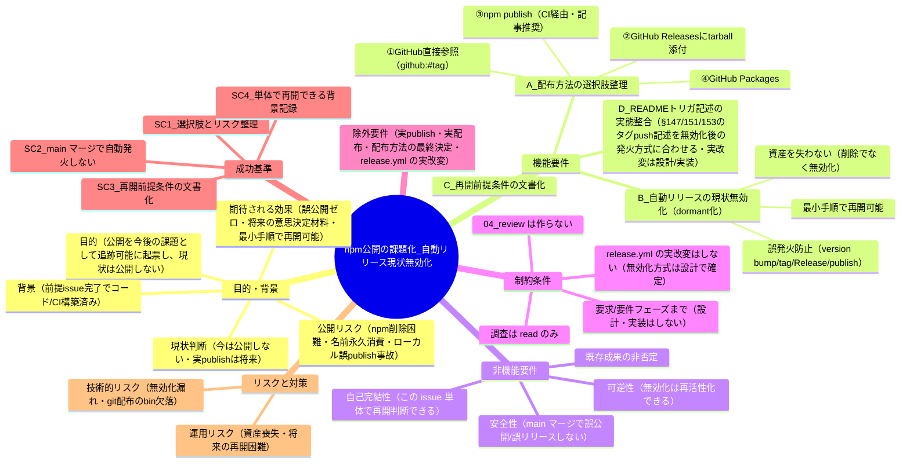
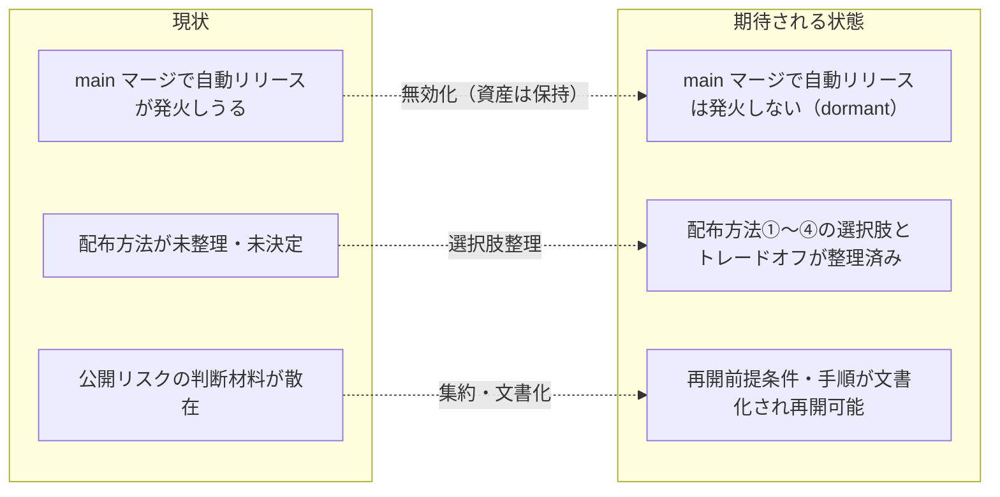

# 要求定義書: npm 公開を「今後の課題」として起票し、自動リリースを現状無効化する

**プロジェクト名**: npm 公開を「今後の課題」として起票し、自動リリースを現状無効化する
**作成日**: 2026 年 06 月 16 日
**最終更新**: 2026 年 06 月 16 日

> **重要**:
>
> - 要求定義書は、プロジェクトの全体像を把握するためのものです。詳細な技術仕様や実装方法は要件定義書以降で記載します。必要最低限の情報に収めることを心掛けてください。
> - **このドキュメントは常に更新**: 要求の変更や追加があった場合は、即座にこのドキュメントを更新してください。ドキュメントは「生きているドキュメント」として扱い、実装内容と常に同期させます。
> - **必須項目**: 以下の「必須」と明記した項目は空欄・抽象語のみで提出しないこと。判定可能な形で記入すること。
>
> **用語**: [.agents/CONCEPTS.md §用語規約](../../../../.agents/CONCEPTS.md#用語規約) を参照。

---

## 要求定義の全体像

**注意**:

- マインドマップは全体像把握用であり、詳細は本文の各セクションに記載する。

---

## 1. 目的・背景

### 1.1 目的（必須）

npm 公開を今後の課題として起票し、自動リリースを現状無効化する。

### 1.2 背景

- **現状の課題**:
  - 前提 issue `20260616_042911_npmスコープ無し公開_将来組織移管`（以下「前提 issue」）で、改名 `agent-skill-chain` と **main マージ自動リリース（案C: version patch 自動 bump / 日時タグ `vYYYYMMDD.HHMMSS` / リリースノート自動生成 / npm publish unscoped public）** を含むコードと CI（[.github/workflows/release.yml](../../../../.github/workflows/release.yml)）が**構築済み**である。
  - しかし npm 公開には固有の**公開リスク**がある: 公開後の**削除が困難**（npm は unpublish 制限が厳しい）、**名前の永久消費**（`agent-skill-chain` の名前空間を一度公開すると取り戻せない）、**ローカル個人 publish の事故**（手元からの誤 publish）など。これらを踏まえ、**現時点では npm 公開しない**判断とする。
  - 現状の `release.yml` は **`on: push: branches: [main]`** で発火し、main マージのたびに version bump・日時タグ・GitHub Release 自動生成までは**実行されてしまう**。`NPM_TOKEN` 未設定なら publish 本体は skip されるが、version bump（package.json への書き戻し commit）・タグ・GitHub Release は走る。公開判断が下る前にこれらが自動で動くことは望ましくない。
  - 配布方法（どの経路でユーザーに届けるか）は**まだ確定していない**。npm publish 以外にも複数の選択肢があり、トレードオフを整理して将来比較・決定する必要がある。

- **必要性**:
  - 公開という重い判断を、適切なタイミング（配布方法の確定・体制整備後）に下せるよう、**「今後の課題」として追跡可能な形で残す**必要がある。
  - 公開判断が下るまで **main マージで誤公開・誤リリースが起きない**ようにする必要がある（自動リリース機構の現状無効化）。
  - 将来の意思決定者が**この issue 単体で背景・選択肢・再開手順を把握できる**よう、判断材料を集約する必要がある。

- **前提 issue で完了済みの事項（本 issue はこれらを否定しない）**:
  - 改名 `agent-skill-chain`、`release.yml` 案C 自動リリースの構築、強制力マトリクス・配布補強・セキュリティ是正、個人情報の全履歴 noreply 化まで完了（前提 issue の [04_review.md](../20260616_042911_npmスコープ無し公開_将来組織移管/04_review.md) で独立検証済み）。
  - 本 issue が行う「自動リリースの無効化」は**削除ではなく dormant 化**であり、将来公開時に**再活性化する資産**として扱う。

### 1.3 期待される効果（必須: 1 件以上）

- **効果 1**: 配布方法の選択肢（①〜④）と公開リスク・各トレードオフが 00 に整理され、将来の意思決定にそのまま使える状態になる（○/×: 00 に①〜④の各メリット/デメリットと公開リスクが列挙されているか）。
- **効果 2**: main へマージしても自動リリースが発火せず、**誤公開・誤リリースがゼロ**になる（○/×: 設計・実装後に main 相当のマージで version bump / tag / Release / publish が起きないこと）。
- **効果 3**: 公開を再開する際の前提条件・手順が文書化され、**最小手順で再開できる**状態になる（○/×: 再開前提条件と有効化手順が文書化されているか）。
- **効果 4**: この issue 単体で「あとから再開」できる十分な背景・選択肢・再開手順が記録される（○/×: 第三者が本 issue のみを読んで再開判断と作業に着手できるか）。
- **効果 5**: `README.md` のリリース手順記述（§147「publish と marketplace 公開は `vX.Y.Z` タグの push で CI が自動実行」/§151「version と一致するタグを push」/§153「`v*` タグを push すると publish」）が、無効化後の実 `release.yml` の発火方式と整合し、**将来の再開時に README を信じてタグ push しても発火せず再開に失敗する**という誤導線が解消される（○/×: 設計・実装後に README のトリガ記述が無効化後の実態と一致しているか）。これは効果 3・効果 4（最小手順で・単体で再開できる）の正確性を担保する（SC-3／SC-4 に紐付く）。

**現状と期待される状態の比較**:

---

## 2. 機能要件

> 本 issue の現フェーズ成果は「課題の起票」＋「自動リリースの現状無効化（の要求・要件整理）」までである。実 publish・実配布・配布方法の最終決定・`release.yml` の実改変は対象外（将来フェーズ／設計・実装フェーズ）。

### 2.1 既存機能の維持（該当する場合）

- 前提 issue で構築した資産（改名 `agent-skill-chain`、`release.yml` 案C 自動リリース、強制力マトリクス、配布補強、セキュリティ是正）は**いずれも削除せず維持**する。本 issue の無効化対応は**設定資産を失わない**形で行う（将来の再活性化を保証）。

### 2.2 新規機能要件

- **A. 配布方法の選択肢とトレードオフの整理（00 に記載）**: 将来の意思決定のため、下記①〜④を各メリット/デメリット・公開リスクとともに 00 に整理する。

  | # | 配布方法 | 概要 | 主なメリット | 主なデメリット・留意点 |
  |---|----------|------|--------------|------------------------|
  | ① | GitHub 直接参照 | `npm i github:techbeansjp-free/AGENTS.md#<tag>` でレポジトリを直接参照 | レジストリ非公開・**公開リスク最小**（npm 名前空間を消費しない・削除困難問題が無い）・トークン不要（public repo） | `bin/` はビルド生成物（`files` allowlist に含むが正本にコミットしていない）。git 参照では `npm` の `prepare` スクリプト等でインストール時ビルドが必要、または bin をコミットする運用調整が要る。タグ運用・SHA 固定の周知が必要 |
  | ② | GitHub Releases に tarball 添付 | `npm pack` 生成物を Release アセットに添付し、URL/ファイルでインストール | レジストリ非公開・配布物を pack 同等に固定できる・ビルド済み bin を同梱可能 | Release 作成・アセット添付の運用が必要。インストール手順が npm より煩雑。バージョン解決が手動寄り |
  | ③ | npm publish を CI 経由 | 現状の `release.yml` 案C（記事推奨の方式）。`NPM_TOKEN` で CI から publish | エコシステム標準・`npm i agent-skill-chain` で最も簡単・semver 解決が自然 | **公開リスク最大**（削除困難・名前の永久消費）。`NPM_TOKEN` 登録（ユーザー権限）が必要。誤 publish 事故の影響が大きい |
  | ④ | GitHub Packages | GitHub の npm レジストリへ publish | GitHub 組織と権限統合・private/public 選択可 | 利用側に `.npmrc` レジストリ設定・認証が必要で導入摩擦が高い。スコープ付き名前（`@owner/name`）が前提になりやすく現行 unscoped 名と整合しない |

  - 上表に加え、**選択軸**（公開リスク／導入の容易さ／運用コスト／bin ビルドの扱い／レジストリ依存）を 00 に明記し、将来比較できる形にする。最終決定は本 issue の対象外（除外要件）。

- **B. 自動リリースの現状無効化（dormant 化）の要求**: main へマージしても `release.yml` が **version bump / 日時タグ / GitHub Release / npm publish のいずれも自動発火しない**こと。`NPM_TOKEN` 未登録なら publish は既に skip されるが、version bump・タグ・GitHub Release の自動生成も**今は走らせない**こと。無効化は**設定資産を失わない**形（削除ではない dormant 化）で行い、**公開再開時に最小手順で有効化できる**こと。
  - **無効化方式の候補**（実方式は設計フェーズで確定。本フェーズは要求として候補の提示まで）:
    - 候補(a): `on:` から `push: branches: [main]` を外し **`workflow_dispatch`（手動トリガ）のみ**にする。再開は `on:` を戻すだけ。
    - 候補(b): リポジトリ変数（例 `vars.RELEASE_ENABLED`）等の**ゲート条件**で各 job を `if:` skip する。再開は変数を `true` にするだけ。
    - 候補(c): 上記の組合せ（手動トリガ＋ゲート）で二重に誤発火を防ぐ。
  - 各候補のトレードオフ（再開手順の簡潔さ／誤発火耐性／既存 step の保全）の評価は設計フェーズへ申し送る。

- **C. 公開再開の前提条件・手順の文書化（要求）**: 公開を再開する際の前提条件を文書化する。少なくとも次を含む:
  - 配布方法（①〜④）の確定。
  - ③ を採る場合: `NPM_TOKEN`（npmjs Automation トークン）をリポジトリ Secrets に登録（ユーザー権限）。
  - ① を採る場合: git 参照で bin が解決されるよう `prepare` スクリプト追加または bin コミットの調整。
  - workflow の有効化手順（無効化方式に対応した戻し手順）。

- **D. README のトリガ記述を実態と整合させる（本 issue の是正対象に含める／要求）**: 現状の `README.md` は §147「publish と marketplace 公開は **`vX.Y.Z` タグの push** で CI が自動実行」・§151「version と一致するタグを push」・§153「`v*` タグを push すると publish」と記載するが、実 `release.yml` は **`on: push: branches: [main]`**（タグ起点ではなく main マージ起点）であり、現状でも記述が実態と不整合である。本 issue の自動リリース無効化（dormant 化）はトリガ条件／ゲートを変える（候補 a/b/c）ため、README のトリガ記述も**無効化後の発火方式と整合させることを本 issue の是正対象に含める**。
  - この README 是正を放置すると、無効化後も README が誤ったトリガ（タグ push）を案内し続け、将来の保守者が README を信じて `v*` タグを push しても（実態と不整合のため）何も起きず、**再開に失敗**しうる（A-2 連動。SC-3／SC-4 の再開手順の正確性を毀損する）。
  - **README の実改変は設計・実装フェーズで行う**。本フェーズ（要求・要件）は「是正対象に含める」ことの確定と要件化までとし、実コード／README／`release.yml` には触れない（§4.1・§5 と整合）。

---

## 3. 非機能要件

### 3.1 パフォーマンス

- 特段の性能要件はない。無効化対応は CI のトリガ条件・ゲートの変更にとどまり、実行時間に影響しない。

### 3.2 セキュリティ

- 無効化により、**意図しない公開（誤 publish・誤 Release）を防止**する（公開リスクの最小化が本 issue の主眼の一つ）。
- 再開時に `NPM_TOKEN` 等の機微情報を扱う場合は Secrets で管理し、平文でコミットしない（前提 issue の方針を踏襲）。

### 3.3 互換性

- 前提 issue の成果（改名・CI 構築・配布補強）と互換であること。無効化は既存資産を**削除せず保持**するため、将来の再活性化と互換である。

### 3.4 保守性

- 無効化は**可逆**であり、再開手順が文書化されていること。設定資産（`release.yml` の各 step）を失わないこと。
- 本 issue 単体で背景・選択肢・再開手順を把握でき、将来の保守者が文脈を再構築せずに着手できること。

---

## 4. 制約条件

### 4.1 技術的制約

- 本フェーズは**要求（必要なら要件）まで**。設計（02）・実装（03 以降、`release.yml` の実改変）は行わない。無効化の具体方式は**設計フェーズで確定**する。
- npm は一度公開した名前のリネーム・容易な削除ができない（公開リスクの根拠）。
- `bin/` はビルド生成物であり正本（main）にコミットしていない（`files` allowlist には含む）。① GitHub 直接参照を採る場合の bin 解決に影響する（要 `prepare` or bin コミット）。
- 調査は **read のみ**。本番改変・`workflow.db` への直接書込みをしない（書込みは書記のみ）。リポジトリルートに `workflow.db` を作らない（正規 DB は `.workflow/workflow.db`）。

### 4.2 既存システムとの互換性

- 前提 issue の成果を否定しない。自動リリースは「無効化」であって削除ではなく、将来公開時に再活性化する資産として扱う。

### 4.3 移行期間・スケジュール

- 実 publish・実配布・配布方法の最終決定は**将来フェーズ**。本 issue の現フェーズ成果は「課題の起票」＋「自動リリースの現状無効化」までとする。

---

## 5. 除外要件

- 実 npm publish の実行。
- 実配布（GitHub Releases へのアセット添付・GitHub Packages 公開等の実施）。
- 配布方法（①〜④）の**最終決定**。
- `release.yml` の**実改変**（無効化方式の確定・実装は設計・実装フェーズ）。
- `README.md` の**実改変**（§147/151/153 等のトリガ記述の書き換えは設計・実装フェーズ）。**ただし「README のトリガ記述を実態と整合させること」を本 issue の是正対象に含める判断は本フェーズで確定済み**（§2.2 D・効果 5・SC-5）であり、別課題化はしない。
- `NPM_TOKEN` の実登録や organization 作成・組織移管の実施。
- 04_review.md の作成（実装前のため。レビュー証跡は memo に残す）。

---

## 6. 成功基準（必須: 1 件以上）

- **SC-1**: 配布方法の選択肢（①〜④）と公開リスク・各トレードオフが 00 に整理され、将来の意思決定に使える形である（○/×: ①〜④の各メリット/デメリットと公開リスク・選択軸が 00 に列挙されている）。
- **SC-2**: main へマージしても `release.yml` が自動で version bump / 日時タグ / GitHub Release / npm publish を**発火しない**（○/×: 設計・実装後に main 相当のマージで上記 4 つのいずれも起きないこと。誤公開・誤リリースが起きない）。
- **SC-3**: 公開を再開する際の前提条件（配布方法の確定・必要なら `NPM_TOKEN` 登録・[git 配布の場合] bin の `prepare` 調整・workflow 有効化手順）が文書化されている（○/×: 再開前提条件と有効化手順が記載されている）。
- **SC-4**: この issue 単体で「あとから再開」できる十分な背景・選択肢・再開手順が記録されている（○/×: 第三者が本 issue のみで再開判断・着手ができる）。
- **SC-5**: `README.md` のリリース手順のトリガ記述（§147/151/153 等）が、無効化後の実 `release.yml` の発火方式と整合している（○/×: 設計・実装後に README のトリガ記述が実態と一致し、誤って「タグ push で発火」と案内していない。SC-3／SC-4 の再開手順の正確性を担保する）。

> SC-2／SC-3／SC-5 の「実装後」確認は将来の設計・実装フェーズで満たす。本要求フェーズの成果は、これらを満たす要求・要件・選択肢・再開手順を 00（必要なら 01）に整備することである。
>
> **SC-2 の検証方法（安全側の線引き）**: SC-2 は**実マージをして発火を観測する方法では検証しない**（実マージは誤発火しうるため危険）。`release.yml` の**静的確認**（`on:` にタグ／ブランチの自動起点が無いこと・各 job の `if:` ゲートが効くこと）と必要に応じたドライ検証で判定する（詳細は [01 §2.3 ビジネスルール・UC2](./01_要件定義.md) に記載）。

---

## 7. リスクと対策

### 7.1 技術的リスク

- **リスク**: 無効化漏れ（`on: push` を残す／ゲートが一部 job にしか効かない）で main マージ時に一部が発火してしまう。
  - **対策**: 設計フェーズで無効化方式を確定し、release-npm と release-marketplace の**両ジョブ**を対象に検証する。実装後に main 相当のマージで 4 つのいずれも発火しないことを確認する（SC-2）。
- **リスク**: 将来 ① GitHub 直接参照を採る場合に、bin がビルド生成物のためインストール時に解決されない（CLI が動かない）。
  - **対策**: 再開前提条件として「`prepare` スクリプト追加 or bin コミットの調整」を文書化する（SC-3）。設計時に方式を確定する。

### 7.2 スケジュールリスク

- **リスク**: 公開判断が長期化し、無効化したまま再開手順の文脈が失われる（後任が再開できない）。
  - **対策**: 本 issue 単体で背景・選択肢・再開手順を完結させる（SC-4）。無効化は削除ではなく dormant 化とし、設定資産を保持する。
- **リスク**: 既存資産を誤って削除し、将来の再活性化コストが増える。
  - **対策**: 無効化は削除でなく可逆な dormant 化に限定する制約を明記（§4.2）。

---

## 8. 参考資料

### プロジェクトドキュメント

- 前提 issue: [`20260616_042911_npmスコープ無し公開_将来組織移管/00_要求定義.md`](../20260616_042911_npmスコープ無し公開_将来組織移管/00_要求定義.md)（改名・自動リリース・C 群補強の要求）
- 前提 issue: [`20260616_042911_npmスコープ無し公開_将来組織移管/04_review.md`](../20260616_042911_npmスコープ無し公開_将来組織移管/04_review.md)（独立検証結果）

### その他の参考資料

- [.github/workflows/release.yml](../../../../.github/workflows/release.yml)（現状の自動リリース定義。`on: push: branches: [main]`・案C）
- [package.json](../../../../package.json)（`name: agent-skill-chain`・`bin`・`files` allowlist・`publishConfig.access: public`）
- [README.md](../../../../README.md)（npm 主導線・marketplace 副導線・配布の説明）
- ローカル個人 publish のリスクと CI 化の推奨（公開リスク判断の参考）

---

## 9. 次のステップ

この要求定義書の承認後、以下のドキュメントを作成します：

- **次**: [`01_要件定義.md`](./01_要件定義.md) - 要件定義フェーズ（必要に応じて。本 issue は要求が主体だが、SC を BDD で検証可能化するため 01 を作成する）
