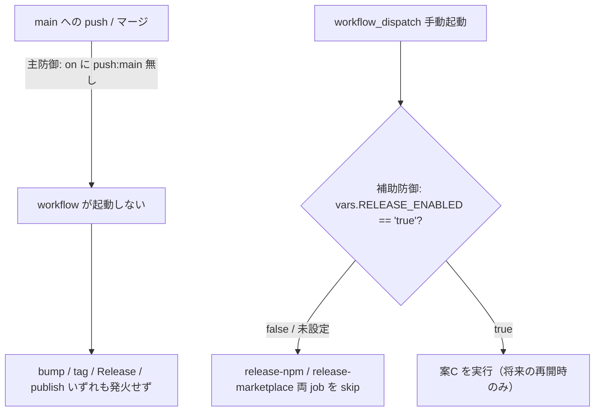

# 設計書: npm 公開を「今後の課題」として起票し、自動リリースを現状無効化する

**プロジェクト名**: npm 公開を「今後の課題」として起票し、自動リリースを現状無効化する
**作成日**: 2026 年 06 月 16 日
**最終更新**: 2026 年 06 月 16 日

> **重要**: **このドキュメントは常に更新**: 設計の変更や追加があった場合は、即座にこのドキュメントを更新してください。ドキュメントは「生きているドキュメント」として扱い、実装内容と常に同期させます。
>
> **用語**: [.agents/CONCEPTS.md §用語規約](../../../../.agents/CONCEPTS.md#用語規約) を参照。

---

## 1. 設計概要

**必須**: 設計方針・原則は [.agents/spec/01\_設計原則.md](../../../../.agents/spec/01_設計原則.md) を先に参照した上で、本プロジェクトに適用するものを選び記載すること。

### 1.1 設計方針

`release.yml` の自動リリース機構（案C）を**削除せず・可逆な dormant 化**で停止し、main マージで自動発火 4 要素（version bump / 日時タグ / GitHub Release / npm publish）のいずれも発火しない状態にする。あわせて `README.md` のリリース手順（タグ起点と誤記述している §147/151/153）を、無効化後の実 `release.yml` の発火方式と整合させる。設計判断は [.agents/spec/06\_設計判断の優先順位.md](../../../../.agents/spec/06_設計判断の優先順位.md) に従い、**仕様との整合性（誤公開ゼロ）・変更容易性（最小手順の再開）・可読性（dormant であることがファイルから読める）** を上位に置く。

### 1.2 設計原則（本プロジェクトで適用するもの）

- **単一責務**: 本 issue は「自動発火の停止（dormant 化）」と「トリガ記述整合（`README.md` および詳細正本 `docs/maintainer/RELEASE.md`）」のみを責務とする。配布方法の最終決定・実 publish・実配布は責務外（00 §5 除外要件）。
- **明確な境界**: 編集対象は正本 3 ファイル（`.github/workflows/release.yml`・`README.md`・`docs/maintainer/RELEASE.md`）に限定する。RELEASE.md は README のリリース手順の詳細リンク先（正本）であり、ここのタグ起点記述を放置すると README だけ整合しても正本側に誤導線が残る（SC-5 の趣旨＝再開手順の正確性・タグ push 誤導線解消が正本側で未達）ため、トリガ記述の dormant 整合対象に含める。生成物（`.adapters/`・`.claude/`）・前提 issue の資産（各 step 定義・SHA ピン）には触れない。
- **AIフレンドリー設計**: 無効化の意図・再開手順を**ファイル内コメント**として release.yml 先頭に明示し、第三者が文脈を再構築せず読めるようにする（[01\_設計原則 §AIフレンドリー設計](../../../../.agents/spec/01_設計原則.md#aiフレンドリー設計)）。

> 本件は CI 設定ファイル（YAML）と Markdown の編集であり、CQRS・イベント駆動・データモデル等の適用対象ではない（§4・§5・§7・§8 は該当なしとして簡潔に記す）。

---

## 2. アーキテクチャ設計

### 2.1 責務・境界・参照関係

#### 2.1.1 責務一覧

| コンポーネント | 責務（1 文） |
| -------------- | -------------- |
| `.github/workflows/release.yml`（`on:` トリガ） | 自動発火の**起点**を制御する（dormant 化の主防御＝起点除去）。 |
| `.github/workflows/release.yml`（各 job の `if:` ゲート） | リポジトリ変数 `RELEASE_ENABLED` による**実行可否ゲート**を提供する（dormant 化の補助防御＝多層防御）。 |
| `.github/workflows/release.yml`（先頭コメントブロック） | 現在 dormant であること・再開手順を**ファイル内で読める**形で明示する。 |
| `README.md` §リリース手順（§147/151/153 付近） | ユーザー・保守者へ**現状の発火方式（dormant）と再開手順**を正しく案内する。 |
| `docs/maintainer/RELEASE.md` §5（:121-148 付近）・§6 参照 | 再開手順の**正本**として、現状の発火方式（dormant・main 起点・タグでは発火しない）と再開手順を正しく案内する。README の詳細リンク先であるため、ここにタグ起点誤導線が残ると正本側に誤導線が残存する。 |

#### 2.1.2 境界

- **入力**: 01 の SC-1〜SC-5・UC1〜UC3・ストーリー 1〜3。現状の `release.yml`（`on: push: branches:[main]`・`release-npm`／`release-marketplace` 両 job）と `README.md` の現記述、および `docs/maintainer/RELEASE.md` §5（:121-148・タグ push で CI publish と案内＝実態 main 起点と不整合・dormant 化後はさらに誤りになる）・§6（:148 タグ push による publish/marketplace CI と記載）の現記述。
- **出力**: dormant 化された `release.yml`（実装フェーズで適用）と整合済み `README.md`・`docs/maintainer/RELEASE.md`（実装フェーズで適用）。本設計フェーズの出力は 02／03 のドキュメントのみ（release.yml/README/RELEASE.md の実改変はしない）。
- **他責務との境界**: 配布方法①〜④の**最終決定**・実 publish・実配布・`NPM_TOKEN` 実登録は範囲外（将来フェーズ）。前提 issue `20260616_042911` の資産（案C 各 step・SHA ピン・無限ループ防止策）は**改変・削除しない**。生成物 `.adapters/`・`.claude/` は対象外（正本のみ編集）。

#### 2.1.3 参照関係

- `README.md` §リリース手順 → `docs/maintainer/RELEASE.md`（詳細正本）→ `release.yml`（README は要約＋リンク、RELEASE.md が再開手順の詳細正本、いずれも workflow の実発火方式を単一の真実源として正しく反映する）。README は要約＋リンク、RELEASE.md は詳細手順を担い、**手順の重複を生まない**（README に手順を全コピーしない）。
- `release.yml` の `if:` ゲート → リポジトリ変数 `vars.RELEASE_ENABLED`（GitHub の Repository variables）。
- 循環参照なし。前提 issue の資産への参照は「保持（不変）」の一方向のみ。

### 2.2 システムアーキテクチャ

**必須**: 設計判断は [.agents/spec/](../../../../.agents/spec/)（[00_spec概要.md](../../../../.agents/spec/00_spec概要.md)、[01\_設計原則.md](../../../../.agents/spec/01_設計原則.md)、[06\_設計判断の優先順位.md](../../../../.agents/spec/06_設計判断の優先順位.md)）を先に参照すること。

- **採用パターン**: 設定ファイルの**多層防御（defense-in-depth）による可逆な無効化**。「起点除去（手動トリガ化）」＋「ゲート変数による job skip」を併用する。
- **根拠**: spec/06 の優先順位（仕様との整合性＞変更容易性＞可読性）に基づく。SC-2 の検証が「(1) `on:` に自動起点が無い **かつ** (2) 各 job の `if:` ゲートで skip される」の**二重確認**（01 §2.2 UC2 シナリオ1）を要求しているため、いずれか片方ではなく**両方**を満たす方式が仕様と最も整合する。

#### 2.2.1 無効化方式の選定（候補 a / b / c の評価）

01 §2.3・00 §2.2 B が提示する候補を、**可逆性・資産保持・最小手順の再開・誤発火耐性**の観点で評価する。

| 観点 | 候補(a) 手動トリガ化（`workflow_dispatch` のみ） | 候補(b) ゲート変数（`if: vars.RELEASE_ENABLED == 'true'`） | 候補(c) (a)+(b) 併用 |
| ---- | ---- | ---- | ---- |
| main push での発火 | しない（起点が無い） | **workflow 自体は起動**し job が skip される（起点は残る） | しない（起点が無い） |
| SC-2 静的確認の二重充足 | `on:` 条件は満たすが `if:` ゲートは無い | `if:` 条件は満たすが `on:` に自動起点が残る | **両方満たす** |
| 資産保持（各 step 定義） | 保持（`on:` のみ変更） | 保持（`if:` のみ追加） | 保持（`on:` 変更＋`if:` 追加。step 本体不変） |
| 誤発火耐性 | 中（誤って `push:` を戻すと即発火） | 中（変数 default が true 等になると発火） | **高**（起点除去＋ゲートの二重。片方が崩れても他方が止める） |
| 再開手順の最小性 | `on:` に `push: branches:[main]` を 3 行戻す | `vars.RELEASE_ENABLED` を `true` に設定（コード変更不要） | 同左 2 手だが、**ゲートだけ true でも push 起点が無ければ発火しない**＝意図しない部分再開を防げる |
| 手動テスト可否 | 可（`workflow_dispatch`） | 可（push で起動はするが skip。手動で `RELEASE_ENABLED=true`＋dispatch 併用が要る） | 可（`workflow_dispatch`＋変数 true） |

**選定: 候補(c)（手動トリガ化＋ゲート変数の併用）を採用する。**

- **根拠1（仕様整合・最重要）**: SC-2 の合格条件が `on:` 起点除去**と**各 job `if:` ゲートの**二重**確認である（01 §2.2 UC2 シナリオ1 の Then「`on:` にタグ/ブランチの自動起点が無い **（または）** 各 job が if: で skip」を、本設計では安全側に**両方**満たす形へ強める）。
- **根拠2（誤発火耐性）**: 00 §7.1 のリスク「ゲートが一部 job にしか効かない／`on: push` を残す」に対し、起点除去（主防御）とゲート（補助防御）の多層で、片方の事故では発火しないようにする。
- **根拠3（可逆性・資産保持）**: (a) は `on:` の 3 行差し替え、(b) は各 job への `if:` 1 行追加のみで、案C の step 本体・SHA ピン・無限ループ防止策・marketplace job の生成ロジックは一切改変しない。再活性化は「`on:` に push:main を戻す」＋「`RELEASE_ENABLED=true` を設定」の最小手順。

#### 2.2.2 多層防御の構成図



### 2.3 コンポーネント構成

- **`release.yml` 先頭コメント＋`on:`**: 主防御。`on: push: branches:[main]` を撤去し `workflow_dispatch:` のみとする。先頭コメントに「現在 dormant（main マージで自動リリースしない）。再開手順: …」を明記する（明確な境界・AIフレンドリー）。
- **`release.yml` 各 job の `if:`**: 補助防御。`release-npm`・`release-marketplace` の**両 job**の既存 `if: github.actor != 'github-actions[bot]'` に、ゲート `vars.RELEASE_ENABLED == 'true'` を**AND 連結**する（既存ガードを壊さず追加）。両 job 必須（marketplace は `needs: release-npm` だが、起点除去後の単独再開・将来の改変耐性のため独立にもゲートを置く）。
- **`README.md` §リリース手順**: §147 の「`vX.Y.Z` タグ push で CI が自動実行」、§151「version と一致するタグを push」、§153「`v*` タグを push すると publish」を、**「現在 npm 公開は今後の課題として保留中。自動リリースは無効化（dormant）。再開時は <手順>」**へ置換し、あわせて「タグ起点」誤記述（実態は元々 `push: main` 起点）を解消する。

### 2.4 データフロー

イベント駆動・データモデルは該当なし（CI 設定と Markdown の編集）。発火フローの状態遷移は §2.2.2 の図に集約する。

---

## 3. 機能設計

### 3.1 機能 1: release.yml の可逆 dormant 化（候補 c）

#### 3.1.1 概要

案C の各 step を保持したまま、main push 自動発火を停止する。起点除去（主防御）＋ゲート変数（補助防御）の二層。

#### 3.1.2 処理フロー（実装フェーズで release.yml に適用する変更の論理）

- **(1) 起点の差し替え（主防御）**: 現状
  ```yaml
  on:
    push:
      branches:
        - main
  ```
  を
  ```yaml
  on:
    # NOTE(dormant): main への自動リリースは現在無効化（dormant）。
    # 自動発火（version bump / 日時タグ / GitHub Release / npm publish）を止めるため
    # push: branches:[main] を撤去し、手動 workflow_dispatch のみ残す。
    # 再開時は push: branches:[main] を戻す（§再開手順 参照）。
    workflow_dispatch:
  ```
  へ差し替える（手動テストは `workflow_dispatch` で可能）。
- **(2) ゲートの追加（補助防御・両 job）**: `release-npm` と `release-marketplace` の `if:` を
  ```yaml
  if: github.actor != 'github-actions[bot]' && vars.RELEASE_ENABLED == 'true'
  ```
  とする。`RELEASE_ENABLED` 未設定（既定）では空文字となり `== 'true'` は false → 両 job が skip される。
- **(3) 先頭コメントブロック**: ファイル冒頭に「現在 dormant である理由・関連 issue・再開手順」を 5〜8 行で明記する。
- **(4) 案C 資産の不変**: bump / sync-version / build / verify-npm-pack / commit&push / datetag / GitHub Release / NPM_TOKEN gate / npm publish / marketplace 生成の各 step、SHA ピン（`actions/checkout@34e1148…`・`actions/setup-node@49933ea…`）、無限ループ防止（`[skip ci]`・`concurrency`・actor ガード）は**一切変更しない**。

#### 3.1.3 入力・出力

- **入力**: 現状の `release.yml`。
- **出力（実装フェーズ）**: dormant 化された `release.yml`（`on:` が `workflow_dispatch` のみ・両 job に `RELEASE_ENABLED` ゲート・先頭コメント）。

#### 3.1.4 エラーハンドリング

- YAML 構文不正を防ぐため、編集後に **python yaml による構文検証**（本環境では `actionlint` 不可のため `python3 -c "import yaml; yaml.safe_load(...)"` を採用）を必須化する（§6・03 のテスト仕様）。
- ゲート式は GitHub Actions の式構文（`vars.<NAME>`）に準拠。未定義変数は空文字に評価され false 側へ倒れる（安全側）。

### 3.2 機能 2: README・RELEASE.md トリガ記述の実態整合

#### 3.2.1 概要

README §147/151/153 の「タグ push で自動 publish/marketplace 公開」記述、および詳細正本 `docs/maintainer/RELEASE.md` §5（:121-148）・§6（:148）の「`vX.Y.Z` タグ push で CI publish/marketplace 公開」記述を、dormant 化後の実態（自動リリースは無効・main 起点・タグでは発火しない・再開手順あり）に整合させる。README だけ整合させ RELEASE.md を放置すると、README の詳細リンク先（正本）にタグ起点誤導線が残り、SC-5 の趣旨（再開手順の正確性・タグ push 誤導線解消）が正本側で未達となるため、RELEASE.md も本 issue の是正対象に含める。

#### 3.2.2 処理フロー（実装フェーズで README に適用する変更の方針）

- §147 要約文「publish と marketplace 公開は `vX.Y.Z` タグの push で CI が自動実行する」→「**現在 npm 公開は今後の課題として保留中。自動リリース（[.github/workflows/release.yml](.github/workflows/release.yml)）は無効化（dormant）されており、main マージ・タグ push のいずれでも自動 publish/marketplace 公開は発火しない。** 再開する場合は <再開手順> を参照」へ置換。
- §151「version と一致するタグを push する（例: `git tag v0.1.0 && git push origin v0.1.0`）。CI が …」→ タグ push が発火条件であるかのような手順を削除/書き換え、**再開後の発火方式（main push 起点・案C）**を正しく案内する。タグ起点ではなく `push:main` 起点だった既存の不整合もここで解消する。
- §153「`v*` タグを push すると publish」→「（dormant のため）タグ push では発火しない。再開は §再開手順」へ。
- **再開手順の明記**（README から参照可能に）: ①配布方法を確定 ②（③採用時）`NPM_TOKEN` を Secrets 登録 ③`release.yml` の `on:` に `push: branches:[main]` を戻す ④リポジトリ変数 `RELEASE_ENABLED=true` を設定。詳細手順の正本は 00 §2.2 C・§9 と `docs/maintainer/RELEASE.md` 側に置き、README は要約＋リンクとする（重複を避ける）。
- **`docs/maintainer/RELEASE.md` の整合（A-1・正本側の誤導線解消）**: §5（:121-148）の「実 publish と marketplace 公開は `vX.Y.Z` タグの push をトリガに CI が実行する」「version と一致するタグを push する（`git tag v0.1.0 && git push origin v0.1.0`）」「タグ push を含む push は高リスク操作」等のタグ起点案内を、無効化後の実態（**dormant・main 起点・タグでは発火しない**）と再開手順（上記①〜④。`on:` への `push:main` 復活＋`RELEASE_ENABLED=true`）へ整合させる。§6（:148）の「タグ push による publish/marketplace CI」という `release.yml` の説明文も実態（main 起点・dormant）へ整合させる。RELEASE.md が再開手順の詳細正本である関係（README は要約＋リンク、RELEASE.md は詳細）を保ち、手順を README と二重記載しない。実 publish はユーザー承認・`NPM_TOKEN` 必須・CI 上のみという既存の安全弁記述（:7-8,:140 付近）は壊さない（must-preserve B-8）。

#### 3.2.3 入力・出力

- **入力**: 現状の `README.md` §143〜153、および `docs/maintainer/RELEASE.md` §5（:121-148）・§6（:148）。
- **出力（実装フェーズ）**: dormant 実態・再開手順と整合した `README.md` と `docs/maintainer/RELEASE.md`。両ファイルともタグ起点誤記述が grep で残らない。

#### 3.2.4 エラーハンドリング

- 関連記述の取りこぼし防止のため、編集後に `grep -nE 'v\*|vX\.Y\.Z|タグ.*push.*(publish|公開|自動)'` で誤導線の残存 0 件を **`README.md` と `docs/maintainer/RELEASE.md` の両方**について確認する（§6・03）。

---

## 4. データ設計

該当なし（データモデル・テーブルは扱わない）。

---

## 5. API 設計

該当なし（外部 API は無い。関係する外部インターフェースは GitHub Actions のトリガ `on:`・GitHub リポジトリ変数 `vars.RELEASE_ENABLED` のみ。01 §4.1 参照）。

| インターフェース | 種別 | 説明 |
| ---------------- | ---- | ---- |
| `on: workflow_dispatch` | トリガ | 手動起動のみ許可（自動起点なし）。 |
| `vars.RELEASE_ENABLED` | リポジトリ変数 | `'true'` のときのみ両 job を実行。未設定/その他で skip。再開時に設定。 |

---

## 6. テスト戦略

テスト戦略の観点定義は [RULES.md のテスト戦略必須要件](../../../../.agents/RULES.md#テスト戦略必須要件)、BDD 形式は [TEST_BDD_FORMAT.md](../../../../.agents/TEST_BDD_FORMAT.md) を参照。本件は CI 設定・Markdown の編集であり**実マージによる発火観測は禁止**（誤発火危険。01 §2.3・SC-2 安全側の線引き）。検証は**静的確認＋構文検証**で行う。

### 6.1 対象ごとのテスト割り当て

| 対象 | 単体（静的検査） | 結合/API | E2E | クリティカル観点 | バリデーション観点 | 未達理由/補足 |
| ---- | ---- | ---- | ---- | ---- | ---- | ---- |
| release.yml `on:` の起点除去 | ○ | × | × | 自動起点（`push: branches`/`push: tags`）が無い | `on:` に `workflow_dispatch` が存在 | E2E（実マージ発火観測）は安全側に**禁止**（静的確認で代替） |
| release.yml 両 job の `if:` ゲート | ○ | × | × | `release-npm`/`release-marketplace` 両方に `RELEASE_ENABLED=='true'` ゲートが付与 | 既存 actor ガードを壊さず AND 連結 | 同上 |
| release.yml YAML 構文 | ○ | × | × | 編集後も valid YAML | `python3 -c "import yaml; yaml.safe_load(open(...))"` が成功 | actionlint は本環境に無し → python yaml で代替 |
| release.yml 資産保持 | ○ | × | × | 案C 各 step・SHA ピン・無限ループ防止が不変 | step 名・SHA・`[skip ci]`/`concurrency`/actor ガードが残存 | — |
| README トリガ記述整合 | ○ | × | × | タグ起点誤記述が残らない・再開手順が記載 | grep で `v*`/`vX.Y.Z`/「タグ push で自動」が誤導線として残らない | — |
| RELEASE.md（§5/§6）トリガ記述整合（A-1） | ○ | × | × | 正本側にもタグ起点誤記述が残らない・dormant/再開記載あり | grep で `v*`/`vX.Y.Z`/「タグ push で自動」が `docs/maintainer/RELEASE.md` に誤導線として残らない（SC-5 の検証対象に RELEASE.md を含める） | README の詳細リンク先（正本）であり放置すると SC-5 の実効性が削がれるため対象に含める。安全弁記述（実 publish はユーザー承認・NPM_TOKEN 必須）は不変 |
| 既存テスト非破壊 | ○ | × | × | `test/run-all.sh` が緑のまま | self-enforce/audit 系テストへの回帰なし | release.yml 専用 lint は既存に無し（追加は任意） |

### 6.2 監査・レビューでの確認（証跡）

- 01 の BDD（UC2 シナリオ1/2・UC3 シナリオ2）と 03 のタスク別テスト観点・BDD が対応していること。
- SC-1〜SC-5 ↔ テスト観点の対応（§6.1 と 03 §2 のタスク）が取れていること。**SC-5 の検証対象には `README.md` に加え `docs/maintainer/RELEASE.md` を含める**（要求の SC-5 文言自体は変えず、設計・検証の対象に RELEASE.md を含める形で正本側の誤導線解消を担保する。A-1 反映）。本フェーズは設計のため実改変・実行はしない（実改変は実装フェーズで、上記静的確認を 04_review 時に実行する）。

---

## 7. UI 設計

該当なし。

---

## 8. セキュリティ設計

### 8.1 認証・認可

- 再開時に扱う `NPM_TOKEN` は GitHub Secrets で管理し平文コミット禁止（01 §3.2）。本設計では `NPM_TOKEN gate` step を**そのまま保持**する（未設定で publish skip の既存安全弁は不変）。

### 8.2 データ保護

- dormant 化により誤 publish・誤 Release・名前の永久消費を構造的に防止する（多層防御）。

---

## 9. 非機能要件への対応

### 9.1 パフォーマンス

- 影響なし（トリガ条件・`if:` ゲートの変更のみ。候補(c) は main push で workflow 自体が起動しないため、runner 分の消費も発生しない＝(b) 単独より優れる）。

### 9.2 可用性

- 可逆性: `on:` に push:main を戻す＋`RELEASE_ENABLED=true` の最小 2 手で再活性化。設定資産（各 step）は不変のため、いつでも復帰可能（01 §3.4）。

---

## 10. 参考資料

### プロジェクトドキュメント

- [`01_要件定義.md`](./01_要件定義.md) - 要件定義
- [`00_要求定義.md`](./00_要求定義.md) - 要求定義
- 前提 issue: [`20260616_042911_npmスコープ無し公開_将来組織移管/`](../20260616_042911_npmスコープ無し公開_将来組織移管/00_要求定義.md)（案C 資産の正本）

### その他の参考資料

- [.github/workflows/release.yml](../../../../.github/workflows/release.yml)（dormant 化対象）
- [README.md](../../../../README.md)（§143〜153 リリース手順・トリガ記述整合対象）
- [docs/maintainer/RELEASE.md](../../../RELEASE.md)（§5 :121-148・§6 :148 タグ起点記述・トリガ記述整合対象＝A-1。再開手順の詳細正本）
- [.agents/spec/06\_設計判断の優先順位.md](../../../../.agents/spec/06_設計判断の優先順位.md)

---

## 11. 前のステップ

- **前**: [`01_要件定義.md`](./01_要件定義.md) - 要件定義フェーズ

---

## 12. 次のステップ

- **次**: [`03_実装計画.md`](./03_実装計画.md) - 実装計画フェーズ
