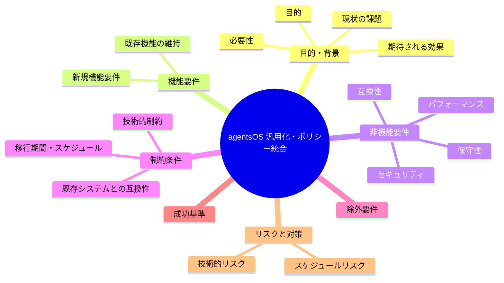
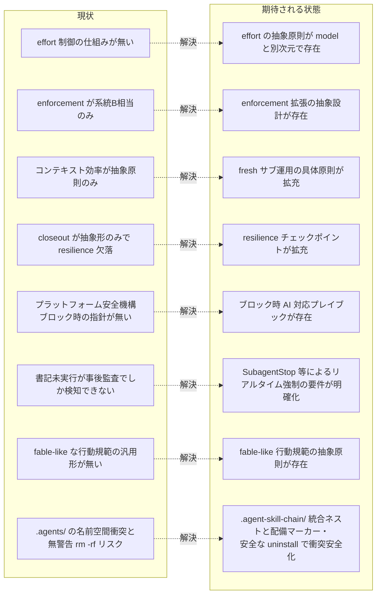

# 要求定義書: agentsOS 汎用化・ポリシー統合（system-graph 由来の発展ポリシー取り込み）

**プロジェクト名**: agentsOS 汎用化・ポリシー統合
**作成日**: 2026 年 07 月 11 日
**最終更新**: 2026 年 07 月 11 日

> **重要**:
>
> - 要求定義書は、プロジェクトの全体像を把握するためのものです。詳細な技術仕様や実装方法は要件定義書以降で記載します。必要最低限の情報に収めることを心掛けてください。
> - **このドキュメントは常に更新**: 要求の変更や追加があった場合は、即座にこのドキュメントを更新してください。ドキュメントは「生きているドキュメント」として扱い、実装内容と常に同期させます。
> - **必須項目**: 以下の「必須」と明記した項目は空欄・抽象語のみ（例: 「{説明}」のまま）で提出しないこと。判定可能な形（目的は1文・成功基準は○/×で判定できる記載等）で記入すること。
>
> **用語**: [.agents/CONCEPTS.md §用語規約](../../../../.agents/CONCEPTS.md#用語規約) を参照。

---

## 要求定義の全体像

**注意**:

- 上記の「プロジェクト名」は例です。実際のプロジェクト名に置き換えてください。
- マインドマップは全体像を把握するためのものです。主要なセクション名程度に留め、詳細は記載しないでください。

---

## 1. 目的・背景

### 1.1 目的（必須）

system-graph の発展ポリシー群から汎用化可能な部分を抽出し本パッケージへ統合するとともに、パッケージ管理ディレクトリの名前空間衝突を安全化する。

### 1.2 背景

- **現状の課題**:
  - 本パッケージ（`agent-skill-chain`）には reasoning effort（推論深度）を役割別に制御する仕組みが皆無であり、`MODEL_SELECTION.md` が扱う model ティア次元とは別次元の統制が欠落している。
  - `.agents/enforcement/` は「orchestrator の直接編集を拒否する」系統（system-graph でいう系統B相当）のみを備え、(a) 品質ゲートのモデルティア切り下げを検知する仕組み（系統A相当）、(b) 進行役の Read/Grep 過大読込を機械抑制する仕組み（系統C相当）、(c) `.agents-project/` 優先で hooks を overlay 配備する仕組み（系統D相当）を持たない。
  - `CONTEXT_EFFICIENCY.md` は issue 起票時のコンテキスト効率化の**抽象原則のみ**を持ち、issue-persist 境界に相当する安全境界の定義・fresh サブ（1 issue = 1 fresh サブ）パイプラインの構造化ハンドオフ・仕様 inventory の索引化＋スライス渡しといった、実際にトークン爆発を防ぐための具体運用手順を欠いている。
  - `CLOSEOUT.md` は実装完了後クローズアウトの**抽象形のみ**を持ち、(a) phase 中間（設計・レビューラウンド・fix ラウンド等）の停止耐性チェックポイント（書記＋再開プロンプト）、(b) 委譲ツール発行の malformed 自己検証、(c) 発見した課題を「起票しただけで放置しない」責任完遂の判定手順、を持たない。
  - Claude Code の auto mode classifier のような、プラットフォーム側の実行時安全機構にツール呼び出しをブロックされた際に AI がどう振る舞うべきかのプレイブックが本パッケージに存在しない。
  - 参考プロジェクト `system-graph` は、上記いずれについても `.agents-project/` 配下の固有ポリシーおよび `.claude/hooks/`・`.claude/agents/` で具体的な仕組みを先行して発展させており、本パッケージ側にその汎用部分を汲み上げられていない。
  - **（追加要求1）** `.agents/enforcement/README.md` が明記するとおり、書記（write-workflow-log）未実行の検知は現状 **audit.sh による事後的・間接的パターンマッチ**（04_review 存在なのにログ無し、等）に留まり、サブエージェントの作業完了時点で**リアルタイムに**記録を強制する仕組みが無い。system-graph の `.claude/hooks/` も同様に、記録強制は runtime（PreToolUse 系統B）と CI（audit.sh）の二段構えであり、サブエージェント終了時点のリアルタイム強制は確立していない。
  - **（追加要求2）** 本パッケージには、上位モデル的な行動様式（結論先行・進捗の実証・スコープ規律・その場しのぎの決定を防ぐ規律等）をサブエージェント運用に組み込む汎用の行動規範が無い。別プロジェクト `/home/adachi/projects/検証ツール/` の `.agents-project/fable-like行動規範.md` が、この種の行動規範を「プロジェクト実行契約を常に優先させた上でのサブエージェント運用強化」という形で先行して整備している。
  - **（追加要求3）** 本パッケージの管理ディレクトリ名 `.agents/` は汎用的な名称であり、他 OSS ツールが同名・同種のディレクトリ名を採用しうる名前空間衝突の懸念がある。かつ現行の `.agents/scripts/setup.sh` は、配備先に既存の `.agents/` が存在する場合、由来の確認や検知なしに `rm -rf` して再コピーするため、別ツール由来のディレクトリを無警告で全消去する事故リスクがある（一次情報の詳細は [`01_要件定義.md`](./01_要件定義.md) §2.1 ストーリー8 背景）。

- **必要性**:
  - 複数の採用プロジェクトで個別に類似ルールが発展すると、車輪の再発明とルールのドリフト（同種の問題への対処が食い違う）が継続する。
  - 本パッケージは既に「コア（`.agents/`）に抽象原則、`.agents-project/` に具体値」という汎用/固有境界の設計パターン（`MODEL_SELECTION.md`・`CONTEXT_EFFICIENCY.md`・`CLOSEOUT.md`・`REVIEW_DUAL_LENS.md` に共通する構造）を確立しており、この設計を崩さずに適用範囲を広げることで「どのプロジェクトでも使える agentsOS」に近づける。
  - 証跡記録の実効性（事後監査だけでなくリアルタイム強制の検討）と、サブエージェントの行動品質（進捗の実証・スコープ規律）は、いずれも「エージェントが逸脱できない構造にする」という enforcement の目的（`.agents/enforcement/DESIGN.md`）そのものであり、汎用化の対象として整合する。

### 1.3 期待される効果（必須: 1 件以上）

- **効果 1**: reasoning effort（推論深度）の役割別静的割当という**新しい制御次元**の抽象原則が `.agents/` に追加され、model ティア次元（`MODEL_SELECTION.md`）と分離した形で参照できる（達成判定: 新規ファイルが `.agents/` 配下に存在し、CORE または run_command から参照される）。
- **効果 2**: `enforcement/README.md`・`enforcement/DESIGN.md` に、品質ゲートのモデルティア切り下げ検知・進行役の読み取り量抑制・`.agents-project/` 優先の hooks overlay 配備、の 3 つの拡張仕様（抽象設計）が追記され、採用先がオプトインで具体実装できる状態になる（達成判定: 該当節が追記されている）。
- **効果 3**: `CONTEXT_EFFICIENCY.md` に、issue-persist 境界相当の安全境界定義と fresh サブパイプラインの具体運用原則（索引化・スライス渡し・確定順序の正本化）が拡充される（達成判定: 該当節が追記され既存の抽象原則と矛盾しない）。
- **効果 4**: `CLOSEOUT.md` に、phase 単位の停止耐性チェックポイント・委譲ツール発行の自己検証・課題の責任完遂（起票は必要条件だが十分条件ではない）の抽象原則が拡充される（達成判定: 該当節が追記されている）。
- **効果 5**: プラットフォーム安全機構にブロックされた際の AI 対応プレイブック（回避禁止・即座停止と透明な説明・ユーザー本人の明示的承認・自己報告の独立検証）の抽象原則が新設される（達成判定: 新規ファイルが存在し HEARTBEAT.md 等から参照される）。
- **効果 6（追加要求1）**: サブエージェントの作業記録を workflow.db へリアルタイムに強制記録させる仕組みについて、Claude Code hooks（`SubagentStop` 等）で技術的に何が可能かの調査結果と、それを踏まえた抽象要件が `enforcement/README.md` またはその拡張仕様に反映される（達成判定: `SubagentStop` 相当のイベントを用いたリアルタイム強制の実現可能性が 01 に明記され、後続の設計フェーズで評価できる形になっている）。
- **効果 7（追加要求2）**: fable-like 行動規範（結論先行・即行動・進捗の実証・スコープ規律・ターン終了規律・境界・委譲・長時間運用）を、プロジェクト実行契約（CORE 等）を常に優先させた上で汎用化する抽象原則が `.agents/` に追加される（達成判定: 新規ファイルまたは既存ファイルへの節追加が存在し、特に進捗の実証＝未検証の明言・捏造進捗の禁止が明記される）。
- **効果 8（追加要求3）**: パッケージ管理ディレクトリ群（`.agents/`・`.agents-project/`・`.workflow/`）が `.agent-skill-chain/{source,project,runtime}/` へ統合ネストされ（プロジェクトオーナーの最終決定＝[`02_設計.md`](./02_設計.md) §2.6.9。当初の「`.agents/` 単体改称」案・設計フェーズでの 2 度のネスト不採用評価を経た方針転換であり、経緯 ADR は同 §2.6.9.0）、setup が配備マーカーによる由来検知・本パッケージ由来と確認できない場合の `rm -rf` 中止・再配備前のバックアップ退避・旧 3 ディレクトリ配備からの統合移行判定・安全な `agents-md uninstall`（既定＝パッケージ所有物のみ削除・ユーザー資産保持）を備える（達成判定: 01 ストーリー8 の受け入れ基準が定義され、`.agents-project/`・`.workflow/`・`.summary/` の扱い（ネスト統合案の採否を含む）と移行パス・uninstall 契約の結論が [`02_設計.md`](./02_設計.md) §2.6（確定設計は §2.6.9）で確定している）。

**現状と期待される状態の比較**:

---

## 2. 機能要件

### 2.1 既存機能の維持（該当する場合）

現行の `.agents/`（`boot/`・`workflow/`・`commands/`・`skills/`・`spec/`・`enforcement/`・`MODEL_SELECTION.md`・`CONTEXT_EFFICIENCY.md`・`CLOSEOUT.md`・`REVIEW_DUAL_LENS.md`・`HEARTBEAT.md` 等）一式を破壊的に変更しない。既存の command / skill chain・enforcement 4 層モデル（物理・契約・配備・完了）・「1 ファイル 1 責務・正本一元化」の設計方針を維持したまま拡張する。ただし、追加要求3（ストーリー8）によるパッケージ管理ディレクトリ群の統合ネスト（`.agents/`・`.agents-project/`・`.workflow/` → `.agent-skill-chain/{source,project,runtime}/`。プロジェクトオーナーの最終決定＝[`02_設計.md`](./02_設計.md) §2.6.9）のみ例外とし、各ディレクトリの内容・保持契約（`project/` 不可侵・`runtime/` ユーザー資産保持）を維持したまま配置のみ統合し、既存採用先には移行パス（[`02_設計.md`](./02_設計.md) §2.6.3・§2.6.9.5）を設ける。

### 2.2 新規機能要件

- reasoning effort（推論深度）の役割別静的割当に関する抽象原則ファイルの新設（model 次元との分離・対象外環境（effort が解決できないプラットフォーム）でのフォールバックを含む）。
- `enforcement/README.md`・`enforcement/DESIGN.md` への拡張仕様の追記: (a) 品質ゲートのモデルティア切り下げ検知（宣言ティアと実 model の自己矛盾検知）、(b) 進行役の Read/Grep 過大読込の機械抑制、(c) `.agents-project/` 優先の hooks overlay 配備（ファイル単位で固有が汎用を上書き）。
- `CONTEXT_EFFICIENCY.md` の拡充: issue-persist 境界相当の安全境界定義、fresh サブ（1 issue = 1 fresh サブ）パイプラインの構造化ハンドオフ内容、仕様 inventory の索引化＋スライス渡しの運用原則。
- `CLOSEOUT.md` の拡充: phase 単位の停止耐性チェックポイント（書記＋再開プロンプト）義務、委譲ツール発行の malformed 自己検証手順、発見した課題の責任完遂（起票は必要条件だが十分条件ではない）判定原則。
- プラットフォーム安全機構ブロック時の AI 対応プレイブック（抽象原則）の新設: 回避絶対禁止・即座停止と透明な説明・ユーザー本人の明示的承認・サブエージェント自己報告の独立検証。
- 上記に伴う `HEARTBEAT.md` の自己診断項目追加（該当する場合）。
- **（追加要求1）** サブエージェント作業記録のリアルタイム強制に関する要件整理: (a) 現状（audit.sh による事後検知）の限界の明文化、(b) Claude Code hooks（`SubagentStop`／`Stop` 等）で技術的に何が可能かの調査結果、(c) 調査結果を踏まえた抽象要件（`enforcement/README.md` への追記候補としての方向性）。本 issue では調査・要件整理と、その結論に基づく抽象仕様の `enforcement/README.md` への追記（実装フェーズ）までを行い、hook スクリプトの実装そのものは行わない。
- **（追加要求2）** fable-like 行動規範の汎用化に関する抽象原則ファイルの新設候補の整理: `検証ツール/.agents-project/fable-like行動規範.md` の 8 章構成（結論先行・即行動・進捗の実証・スコープ規律・ターン終了規律・境界・委譲・長時間運用）のうち、プロジェクト実行契約優先の読み替え規則（同ファイル §0）ごと汎用化する。特に「進捗の実証」（未検証の明言・捏造進捗の禁止・テスト失敗は出力ごと報告）を明確な要件として扱う。
- **（追加要求3）** パッケージ管理ディレクトリの名前空間衝突安全化: `.agents/`・`.agents-project/`・`.workflow/` の `.agent-skill-chain/{source,project,runtime}/` への統合ネスト（プロジェクトオーナーの最終決定＝[`02_設計.md`](./02_設計.md) §2.6.9。当初要求は `.agents/` 単体の改称だったが、ユーザー再提案と最終決定により統合ネストへ転換）、setup 実行時の配備マーカー（`.package-manifest`）による既存ディレクトリの由来検知、本パッケージ由来と確認できない場合の `rm -rf` 中止（エラーメッセージで人間判断を促す）、本パッケージ由来と確認できた場合の再配備前のタイムスタンプ付きバックアップ退避、旧 3 ディレクトリ配備からの統合移行パス、および安全な `agents-md uninstall` コマンド（既定＝パッケージ所有物のみ削除・ユーザー資産保持。唯一の公式アンインストール手段）。`.agents-project/`・`.workflow/`・`.summary/` の扱い（実装着手前のユーザー再提案＝ 4 ディレクトリを `.agent-skill-chain/` 配下へネストして一括ユニーク化する案の採否を含む）と移行パスの結論は設計フェーズで確定する（結論は [`02_設計.md`](./02_設計.md) §2.6。確定設計は §2.6.9＝ネスト採用・`.summary/` のみスコープ外維持）。本要件のみ例外的に実行コード（`.agents/scripts/setup.sh`・`src/agents-md.ts`）の変更・ディレクトリ統合ネスト・テスト更新を伴う（§5 の除外の例外を参照）。

---

## 3. 非機能要件

### 3.1 パフォーマンス

- ドキュメント中心の変更でありランタイム性能要件は無い。コンテキスト効率化に関する拡充自体が「トークン消費を抑える」ことを目的とするため、追記内容自体が冗長にならないよう既存原則への参照でつなぐ（重複記載を避ける）。

### 3.2 セキュリティ

- enforcement 拡張は既存方針（fail-open 優先・過剰ブロックを避ける・保守的に倒す）を踏襲する。
- nonce・秘密情報等の機微な仕組みを安易に複製しない。導入する場合は既存の `PreToolUse.sh` の scribe nonce 分離設計と整合させる。
- **（追加要求3）** ストーリー8 の衝突検知・移行判定のみ、対象が「ユーザー既存ファイルの破壊的削除」であるため fail-open ではなく **fail-closed**（判定できない場合は処理を中止し既存ファイルを保護する）を既定とする（[`02_設計.md`](./02_設計.md) §2.6.4）。

### 3.3 互換性

- 既存の `.agents/` ファイル構成・`CORE.md`／`LOAD_POLICY.md` の読込順・既存の `PreToolUse.sh` 契約（stdin JSON・exit code 規約）を破壊しない。ただし、追加要求3 によるパッケージ管理ディレクトリ群の統合ネスト（`.agent-skill-chain/{source,project,runtime}/`）のみ例外とし（§2.1）、既存採用先向けの移行パスを設計フェーズで確定して既存の保持・上書き契約（`SETUP.md`）の保護水準を弱めない（[`02_設計.md`](./02_設計.md) §2.6.3・§2.6.9.5）。
- マルチプラットフォーム中立性を維持する。Claude Code 固有機構（`effort` frontmatter・auto mode classifier・hooks の `updatedInput` 等）に依存する原則は、既存の `MODEL_SELECTION.md` と同型の「適用条件」「対象外環境のフォールバック」を明記した抽象原則としてのみ `.agents/` に取り込む。

### 3.4 保守性

- 「汎用/固有境界」（コア＝抽象原則の必須最小集合、`.agents-project/`＝具体値・対応表・数値閾値）を各追記箇所に明記し、コアへ具体値（モデル名・閾値・対応表本体）を持ち込まない。
- 正本一元化・二重持ち禁止の既存方針を踏襲し、新設ファイルは既存ファイル（`MODEL_SELECTION.md`・`CONTEXT_EFFICIENCY.md`・`CLOSEOUT.md`・`enforcement/README.md` 等）と重複せず相互参照でつなぐ。

---

## 4. 制約条件

### 4.1 技術的制約

- 本パッケージはマルチプラットフォーム（Claude Code / Cursor 等）中立を掲げる。Claude Code 固有の技術的実現手段（`.claude/agents/*.md` frontmatter の `effort` フィールド、hooks の `updatedInput`、auto mode classifier 等）は、それ単体をコアの必須要件にはせず、「適用条件を満たすランタイムでのみ発動し、それ以外は既存デフォルト動作を阻害しない」形で抽象化する。
- 本 issue は要求・要件（requirement-discovery）から設計（design-feature）・実装計画・実装（implement-feature。`.agents/` 配下の抽象原則ドキュメントの新設・追記まで）を**同一 issue 内のフェーズ**として扱う。hook スクリプト等の**実行コードの実装は原則として本 issue の対象外**とする（§5 除外要件）。ただし追加要求3（ストーリー8）の配備ロジック（`.agents/scripts/setup.sh`・`src/agents-md.ts`）の変更・ディレクトリ統合ネスト・安全な uninstall コマンド・テスト更新のみ、§5 の定める例外として実装フェーズの対象に含める。サブ issue 分割の要否は設計フェーズで判定する（判定結果は [`02_設計.md`](./02_設計.md) §サブ issue 分割の要否＝分割不要）。

### 4.2 既存システムとの互換性

- 既存の commands（`requirement-discovery`／`design-feature`／`implement-feature`／`verify-and-close` 等）の skill chain 定義・IO_CONTRACT・enforcement の 4 層モデルとの整合を保つ。

### 4.3 移行期間・スケジュール

- 特段のスケジュール制約は無い。ただし対象範囲が広い（reasoning effort・enforcement 拡張・コンテキスト効率・closeout resilience・プラットフォーム対応プレイブック・サブエージェント作業記録のリアルタイム強制・fable-like 行動規範・ディレクトリ名前空間衝突安全化の計 8 系統）ため、設計フェーズでサブ issue 分割を検討する（検討結果は §4.1・§7.2 のとおり分割不要と判断済み）。

---

## 5. 除外要件

- system-graph 固有のスタック依存ポリシーは汎用性が低いため、本 issue の汎用化対象**外**とする。
  - `DOCSTRING_MARKUP_POLICY.md`（Python docstring の RST markup 規約）
  - `INPUT_VALIDATION_VALUE_OBJECT_POLICY.md`（Python backend の値オブジェクトによる入力検証パターン）
  - `WORKFLOW_REFERENCE_POLICY.md`（system-graph 固有パスへの参照禁止・セクション記号禁止という当該プロジェクト固有の運用ルール）
- `CODE_COMMENT_REFERENCE_POLICY.md` の「ソースコードは自己完結させ、陳腐化する外部参照をコメントに埋め込まない」という**原則自体**は汎用性があるが、本パッケージには既に [`.agents/CODE_COMMENT_RULES.md`](../../../../.agents/CODE_COMMENT_RULES.md) が同じ**広い原則**（コメントはソースコード内で完結させる。issue/PR 番号に限らず、仕様ドキュメント名・章節番号・一時的な管理 ID 等の外部参照を禁止し、grep 追跡可能なコード参照のみ許可）の正本として存在し、CI 検出（`enforcement/README.md` 失敗条件 #26）も実装済みである。したがって本 issue では**新規の取り込み対象・新規要件としない**（正本 1 か所・二重持ち禁止）。既存カバレッジで拾いきれない追加パターン（AI が書きがちな一時メモ的コメント等）の扱いの要否判定のみ設計フェーズで行う（判定結果は [`02_設計.md`](./02_設計.md) §2.5 に記載）。
- 本 issue では hook スクリプトの新規実装・`.claude/agents/*.md` の実ファイル新設等の**実行コードの実装**は行わない。本 issue の実装フェーズで行うのは `.agents/` 配下の抽象原則ドキュメントの新設・追記までとする。**ただし、追加要求3（ストーリー8）の配備ロジック（`.agents/scripts/setup.sh`・`src/agents-md.ts`）の変更・ディレクトリ統合ネスト（`.agents/`・`.agents-project/`・`.workflow/` → `.agent-skill-chain/{source,project,runtime}/`）・安全な uninstall コマンド・参照更新・テスト更新のみ、この除外の例外として本 issue の実装フェーズの対象に含める**（hook スクリプト（系統A/C/D/E 相当）・機構的強制の実装は引き続き対象外）。
- **（追加要求2 のスコープ切り分け）** fable-like 行動規範の**行動規範としての明文化**（08 章の抽象原則化・凝縮版の委譲時転記運用の定義）は本 issue の対象に含める。一方、ユーザーが留保付きで言及した「その場しのぎの決定を防ぐ**機構的強制**」（レビュー必須化・断定前の証拠突合の強制等、hooks/CI による物理強制）は、実現可否の評価自体を含めて**設計フェーズ（02_設計.md）での検討課題**とし、本 00・01（要求・要件定義フェーズ）では「検討が必要な論点」として明記するに留める（評価結論は [`02_設計.md`](./02_設計.md) §2.5.3 で確定済み＝機構としての実装は行わない）。
- **（追加要求1 のスコープ切り分け）** サブエージェント作業記録のリアルタイム強制について、`SubagentStop` 等の hook イベントを用いた具体的な hook スクリプトの実装・配備は本 issue の対象外とする（要否・時期は将来の別 issue に委ねる）。本 issue で扱うのは、技術的実現可能性の調査結果・抽象要件の整理と、その結論に基づく抽象仕様の `enforcement/README.md` への追記（実装フェーズ）までとする。

---

## 6. 成功基準（必須: 1 件以上）

- 00〜03 の各ドキュメントが `.workflow/templates/` の対応テンプレートの必須セクションを欠かさず満たしている。
- system-graph 側の調査対象（`.agents-project/` 配下 13 ファイル、`.agents/HEARTBEAT.md`・`enforcement/`、`.claude/hooks/`・`.claude/settings.json`・`.claude/agents/*.md`、`.cursor/agents-core.mdc`）を実際に読了した上での差分（汎用化候補／対象外）が 01 の受け入れ基準に反映されている。
- 対象 8 系統（汎用化候補 7 系統: reasoning effort・enforcement 拡張・コンテキスト効率・closeout resilience・プラットフォーム対応プレイブック・サブエージェント作業記録のリアルタイム強制・fable-like 行動規範、＋追加要求3: ディレクトリ名前空間衝突安全化）と除外対象（3 系統＋機構的強制の検討先送り）の切り分けが明記されている。
- 後続の設計フェーズ（design-feature）に引き継げる程度の具体性（対象ファイル名・追加/変更方針の方向性）を持つ。
- **（追加要求1）** `SubagentStop` 等 Claude Code hooks で技術的に何が可能か（ブロック可否・受け取れる情報）が一次情報（公式ドキュメント URL＋原文相当の要約）で裏付けられた形で 01 に記載されている。
- **（追加要求2）** `検証ツール/.agents-project/fable-like行動規範.md` を実際に読了した上で、8 章のうちどの部分を汎用化するか（特に §3 進捗の実証）が 01 の受け入れ基準に反映されている。
- **（追加要求3）** 現行 `setup.sh` の無条件 `rm -rf`（52〜61 行目）・`SETUP.md` の保持・上書き契約表・名前空間衝突の調査結果（`microsoft/apm`・`buildermethods/agent-os` による既存占有、現行パッケージ名「agent-skill-chain」の衝突なし）が一次情報として 01 に反映され、`.agents-project/` の扱いと旧名配備からの移行パスについて設計フェーズで結論を出すことが要件化されている。

---

## 7. リスクと対策

### 7.1 技術的リスク

- **リスク**: Claude Code 固有機構をコアに持ち込みすぎ、マルチプラットフォーム中立性が損なわれる。
  - **対策**: 既存の `MODEL_SELECTION.md` パターン（適用条件・対象外環境のフォールバック・具体値は `.agents-project/` へ委譲）を踏襲する。
- **リスク**: 汎用化の粒度を誤り、コアが肥大化して「1 ファイル 1 責務」原則に反する。
  - **対策**: 既存ファイル（`CONTEXT_EFFICIENCY.md`・`CLOSEOUT.md`・`MODEL_SELECTION.md`・`enforcement/README.md`）への追記・拡張を基本とし、新設は本当に新しい関心事（reasoning effort、プラットフォーム安全機構対応、fable-like 行動規範）のみに限定する。

- **リスク（追加要求1）**: `SubagentStop` 等のブロック可能な hook を安易に導入すると、false positive（正当な完了を誤って差し戻す）で自走を阻害するリスクがある。
  - **対策**: system-graph の既存 hook（`PreToolUse-model-tier.sh`・`PreToolUse-context-economy.sh`）が採用する「fail-open・高信頼ケースのみブロック・それ以外は警告に留める」設計方針を踏襲し、実装可否の判断自体を設計フェーズに委ねる。
- **リスク（追加要求2）**: fable-like 行動規範を汎用化する際、既存の CORE.md「メインは実作業を行わない」等の絶対制約と字面上の解釈違いが生じうる（例: 「即行動」を根拠にメインが直接編集してよいと誤読される）。
  - **対策**: 参照元ファイルの §0（プロジェクト実行契約が常に優先）の読み替え規則を汎用化時も必ず維持し、コア（CORE.md 等）と矛盾しないことを設計フェーズで確認する。
- **リスク（追加要求3）**: 配備マーカーは本 issue で新設するため、既存の旧バージョン配備（旧名 `.agents/`）にはマーカーが存在せず、単純なマーカー判定では正規の既存採用先が全員移行できなくなる。
  - **対策**: フィンガープリント判定による限定的な自動移行と、判定不能時に人間判断を促す fail-closed フォールバックを設計フェーズで確定する（[`02_設計.md`](./02_設計.md) §2.6.3 で確定済み。最終決定〈同 §2.6.9.5〉により移行対象は 3 ディレクトリ〈存在するもののみ〉へ拡張）。

### 7.2 スケジュールリスク

- **リスク**: 対象ファイルが多数（system-graph 側 13 ファイル＋ enforcement／hooks／`.claude/agents`、および `検証ツール` 側 1 ファイル）に及び、1 issue で扱いきれない。
  - **対策**: 設計フェーズで 8 系統（reasoning effort／enforcement 拡張／コンテキスト効率／closeout resilience／プラットフォーム対応プレイブック／サブエージェント作業記録のリアルタイム強制／fable-like 行動規範／ディレクトリ名前空間衝突安全化）ごとのサブ issue 分割を検討する（検討結果: [`02_設計.md`](./02_設計.md) §サブ issue 分割の要否で「分割不要」と判断済み。ストーリー8 のみ実装計画内で 9 サブタスクに細分化して管理粒度を確保する〈ネスト統合案採用に伴い旧 7 個から uninstall 実装・README 警告の 2 個を追加＝03_実装計画 §2.8.1〉）。

---

## 8. 参考資料

### プロジェクトドキュメント

- [`.agents-project/自己拡張ワークフロー.md`](../../../../.agents-project/自己拡張ワークフロー.md) — 本リポジトリの issue 作成場所の上書き定義。
- [`.agents/MODEL_SELECTION.md`](../../../../.agents/MODEL_SELECTION.md)・[`.agents/CONTEXT_EFFICIENCY.md`](../../../../.agents/CONTEXT_EFFICIENCY.md)・[`.agents/CLOSEOUT.md`](../../../../.agents/CLOSEOUT.md)・[`.agents/REVIEW_DUAL_LENS.md`](../../../../.agents/REVIEW_DUAL_LENS.md) — 既存の「汎用/固有境界」パターンの先例。
- [`.agents/enforcement/README.md`](../../../../.agents/enforcement/README.md)・[`.agents/enforcement/DESIGN.md`](../../../../.agents/enforcement/DESIGN.md) — 既存の enforcement 4 層モデル。

### その他の参考資料

- 参考プロジェクト `/home/adachi/projects/system-graph/` の `.agents-project/EFFORT_POLICY.md`・`MODEL_SELECTION_POLICY.md`・`ISSUE_CREATION_CONTEXT_POLICY.md`・`IMPLEMENTATION_CLOSEOUT_POLICY.md`・`RESILIENCE_CHECKPOINT_POLICY.md`・`AUTO_MODE_CLASSIFIER_RESPONSE_POLICY.md`・`REVIEW_DUAL_LENS_POLICY.md`・`CODE_COMMENT_REFERENCE_POLICY.md`・`DOCSTRING_MARKUP_POLICY.md`・`INPUT_VALIDATION_VALUE_OBJECT_POLICY.md`・`WORKFLOW_REFERENCE_POLICY.md`・`README.md`。
- 同 `.agents/HEARTBEAT.md`・`.agents/enforcement/`（README.md・DESIGN.md・`claude/PreToolUse.sh`）・`.agents-project/enforcement/claude/`（`PreToolUse-model-tier.sh`＝系統A・`PreToolUse-context-economy.sh`＝系統C）。
- 同 `.claude/settings.json`・`.claude/hooks/`（`PreToolUse.sh`・`PreToolUse-model-tier.sh`・`PreToolUse-context-economy.sh`・`PostToolUse.sh`・`lib/hook-json.sh`）・`.claude/agents/*.md`（`worker.md`・`auditor.md`・`architect.md`・`architect-deep.md`・`researcher.md`・`scribe.md`・`orchestrator.md`）・`.cursor/agents-core.mdc`。
- **（追加要求1）** 参考プロジェクト `/home/adachi/projects/AGENTS.md/`（本パッケージ自身）の [`.agents/enforcement/README.md`](../../../../.agents/enforcement/README.md)（書記未実行の検知が audit.sh の事後・間接検知に留まる現状の記載）。Claude Code 公式ドキュメント `https://code.claude.com/docs/en/hooks.md`（`SubagentStop` イベントの存在・入力フィールド（`agent_id`／`agent_type`／`last_assistant_message` を含む。ほかに `session_id`・`transcript_path`・`cwd` 等の共通入力フィールドあり）・exit code 2 でサブエージェントの終了をブロックできる仕様の一次情報）。
- **（追加要求2）** 参考プロジェクト `/home/adachi/projects/検証ツール/` の [`.agents-project/fable-like行動規範.md`](/home/adachi/projects/検証ツール/.agents-project/fable-like行動規範.md)（Fable 5 的行動様式の 8 章構成・§0 プロジェクト実行契約優先の読み替え規則・第3章サブエージェント向け凝縮版）。
- **（追加要求3）** 本パッケージ自身の [`.agents/scripts/setup.sh`](../../../../.agents/scripts/setup.sh)（既存 `.agents/` の無条件 `rm -rf`。52〜61 行目）・[`.agents/SETUP.md`](../../../../.agents/SETUP.md)（§init/upgrade/uninstall の保持・上書き契約）。名前空間衝突の調査結果（2026-07-11 時点。詳細は [`01_要件定義.md`](./01_要件定義.md) §1.2 用語集・§2.1 ストーリー8 背景）: `microsoft/apm`（Microsoft 公式 OSS「APM (Agent Package Manager)」）・`buildermethods/agent-os`（「Agent OS」）が既存名称を占有、現行パッケージ名「agent-skill-chain」は GitHub 検索・npm registry ともに衝突なし。

---

## 9. 次のステップ

この要求定義書の承認後、以下のドキュメントを作成します：

- **次**: [`01_要件定義.md`](./01_要件定義.md) - 要件定義フェーズ
