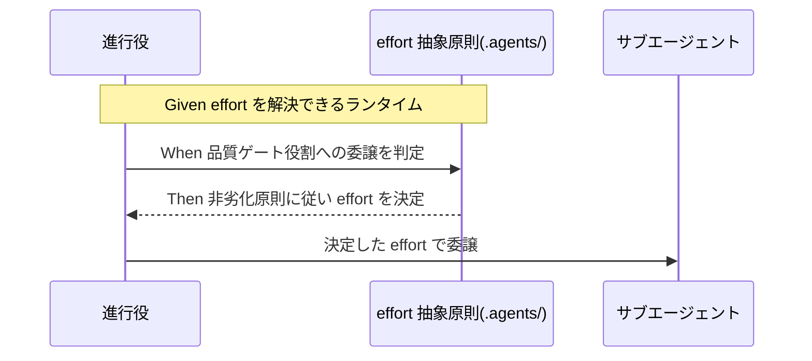

# 要件定義書: agentsOS 汎用化・ポリシー統合（system-graph 由来の発展ポリシー取り込み）

**プロジェクト名**: agentsOS 汎用化・ポリシー統合
**作成日**: 2026 年 07 月 11 日
**最終更新**: 2026 年 07 月 11 日

> **重要**: **このドキュメントは常に更新**: 要件の変更や追加があった場合は、即座にこのドキュメントを更新してください。ドキュメントは「生きているドキュメント」として扱い、実装内容と常に同期させます。
>
> **用語**: [.agents/CONCEPTS.md §用語規約](../../../../.agents/CONCEPTS.md#用語規約) を参照。

---

## 1. 概要

### 1.1 システム概要

本パッケージ（`agent-skill-chain`）の `.agents/` は、LLM エージェント向けの実行契約・ワークフロー仕様を配布する正本である。参考プロジェクト `system-graph` は、この `.agents/` を採用した上で `.agents-project/`・`.claude/hooks/`・`.claude/agents/`・`.cursor/` に独自の発展ポリシーを積み重ねており、その中には「どのプロジェクトでも使える」汎用原則へ昇格できるものが含まれる。また別プロジェクト `検証ツール` は、サブエージェント運用を上位モデル的な行動様式で強化する行動規範を独自に整備している。本要件は、その汎用化候補を 7 系統（reasoning effort・enforcement 拡張・issue 起票時コンテキスト効率・実装クローズアウトの resilience・プラットフォーム安全機構ブロック時対応・サブエージェント作業記録のリアルタイム強制・fable-like 行動規範）に整理し、各系統について「何を・どこに・どのように」取り込むかを要件化する。さらにユーザーからの追加要求3として、パッケージ管理ディレクトリの名前空間衝突安全化（`.agents/`・`.agents-project/`・`.workflow/` の `.agent-skill-chain/{source,project,runtime}/` への統合ネスト・配備マーカーによる由来検知・バックアップ・移行パス・安全な uninstall。ストーリー8。統合ネストはプロジェクトオーナーの最終決定＝02_設計 §2.6.9 による）を第 8 の系統として要件化する（計 8 系統）。

### 1.2 用語集

| 用語 | 説明 |
| --- | --- |
| 汎用/固有境界 | 本パッケージの既存設計パターン。`.agents/`（コア）には全採用先に共通する**抽象原則の必須最小集合**のみを置き、具体的な数値・対応表・モデル名・閾値等は採用先の `.agents-project/` に委ねる（`MODEL_SELECTION.md`・`CONTEXT_EFFICIENCY.md`・`CLOSEOUT.md`・`REVIEW_DUAL_LENS.md` に共通する構造）。 |
| reasoning effort（推論深度） | サブエージェントに指定する思考の深さ（`low`/`medium`/`high`/`xhigh`/`max` 等）。model ティア（どのモデルを使うか）とは独立な別次元の制御軸。 |
| model ティア | サブエージェント委譲時にどのモデル（haiku/sonnet/opus 等のエイリアス）を使うかの選択軸。本パッケージでは `MODEL_SELECTION.md` が抽象原則の正本。 |
| issue-persist 境界 | system-graph の `ISSUE_CREATION_CONTEXT_POLICY.md` が定める、issue 作成側の安全な文脈切断点（00〜03 の充足＋レビュー指摘 0 収束＋書記記録＋親登録が揃った状態）。実装側の commit 境界に相当する概念。 |
| fresh サブ（fresh サブパイプライン） | 1 つの長寿命サブに複数の issue／工程を連続して抱えさせず、issue ごと・工程ごとに使い捨てのサブへ分割して委譲する方式。コンテキスト肥大化（トークン爆発）の主因対策。 |
| 停止耐性チェックポイント（resilience checkpoint） | 各 phase 完了ごとに書記記録＋再開プロンプトを恒久メモリへ反映し、セッション中断・`/clear` からでも損失なく再開できる状態を維持する仕組み。 |
| auto mode classifier | Claude Code（Anthropic 側）のランタイム安全機構。本パッケージの enforcement（`.agents/enforcement/`）とは別レイヤーであり、危険とみなしたツール呼び出しをブロックする。 |
| 系統A〜D（enforcement の呼称。system-graph 由来） | 系統A: 品質ゲートのモデルティア切り下げ検知 hook。系統B: orchestrator 直接編集拒否 hook（本パッケージに既存）。系統C: 進行役の Read/Grep 過大読込抑制 hook。系統D: `.agents-project/` 優先の hooks overlay 配備。 |
| `SubagentStop`（Claude Code hook イベント） | サブエージェントの作業完了時に発火する hook イベント。`agent_id`・`agent_type`・`last_assistant_message` を受け取り（ほかに `session_id`・`transcript_path`・`cwd` 等の共通入力フィールドを含む）、exit code 2 で「サブエージェントの終了そのものをブロックし継続させる」ことができる（一次情報: `https://code.claude.com/docs/en/hooks.md`。2026-07-11 に原典の exit code 対応表 "Can block: Yes / Prevents the subagent from stopping" を取得・確認済み）。事後監査（audit.sh）とは異なり、作業完了の**その場**で検査・差し戻しできる点が新しい。 |
| リアルタイム強制（追加要求1） | 書記（write-workflow-log）未実行の検知を、事後の CI 監査（audit.sh）ではなく、サブエージェントの作業完了時点（`SubagentStop` 等）で行い、未記録なら即座に差し戻す方式。既存の audit.sh 事後検知（enforcement/README.md「失敗条件」）を置き換えるのではなく補完する位置づけの候補。 |
| fable-like 行動規範 | 別プロジェクト `検証ツール` の `.agents-project/fable-like行動規範.md` が定める、Sonnet/Opus を上位モデル的な行動様式（結論先行・即行動・進捗の実証・スコープ規律・ターン終了規律・境界・委譲・長時間運用の 8 章）で運用するための行動規範。§0 で「プロジェクト実行契約が常に優先」と明記し、既存の実行契約と矛盾しない設計になっている。 |
| 進捗の実証 | fable-like 行動規範 §3。報告前に各主張をツール結果と突合し、未検証は未検証と明言し、テスト失敗は出力ごと報告し、捏造された進捗報告を最悪の失敗として扱う原則。 |
| 配備マーカー（package manifest） | setup が配備先ディレクトリ配下に置く、本パッケージによる配備であることを示す小さなファイル（例: `.agent-skill-chain/.package-manifest` に name + version を記載）。setup 実行時に既存ディレクトリの由来（本パッケージ由来か、別ツール由来・別バージョン由来か）を判定するために用いる（ストーリー8）。 |
| 名前空間衝突（namespace collision） | 本パッケージの管理ディレクトリ名・パッケージ名が、既に広く使われている別 OSS ツールの名称・ディレクトリ名と衝突すること。調査の結果、「APM (Agent Package Manager)」は Microsoft 公式 OSS（`microsoft/apm`。2026-07-11 時点 ⭐3,163・活発に更新中）が、「Agent OS」「agentsOS」系は `buildermethods/agent-os`（同時点 ⭐5,043・活発に更新中。コードベース標準・スペック駆動開発ツール、Claude Code/Cursor 対応で概念的にも近接）が既に強く占有していることが判明した。現行パッケージ名「agent-skill-chain」は GitHub 検索・npm registry ともに衝突なしを確認済み（ストーリー8）。 |

> 系統の呼称整理（誤読防止）: 本 01 でいう「8 系統」（ポリシー統合 7 系統＋ストーリー8 のディレクトリ名前空間衝突安全化）は 00 §1.3／§6 の 8 効果・8 成功基準に対応し、上記の enforcement 内部呼称「系統A〜D」（system-graph 由来の hook 命名。02 で系統Eを追加）とは別の分類軸である。両者を混同しないこと。

---

## 2. 機能要件

### 2.1 ユーザーストーリー

#### ストーリー 1: reasoning effort（推論深度）の役割別制御

- **As a** 本パッケージ（agent-skill-chain）を採用するプロジェクトの保守者
- **I want to** サブエージェントの役割（scribe／researcher／worker／architect／auditor 等）ごとに reasoning effort を静的に割り当てる**抽象原則**を `.agents/` に持ちたい
- **So that** 品質ゲート（監査・verify-and-close 等）の effort を、model ティアとは独立に「コスト都合で切り下げない」仕組みを、具体的な対応表を汚さずコアに組み込める

**受け入れ基準**:

- `.agents/` 配下に、reasoning effort の役割別静的割当に関する抽象原則を扱う正本ファイルが存在する（新設または既存ファイルへの節追加のいずれでもよいが、正本は 1 か所）。
- 当該ファイルに、(a) 適用条件（effort を解決できるランタイムでのみ適用）、(b) 対象外環境でのフォールバック（デフォルト動作を阻害しない）、(c) model ティア次元（`MODEL_SELECTION.md`）とは独立した別次元であることの明記、(d) 品質ゲート相当の役割は effort を非劣化（切り下げ禁止）とする原則、の 4 点が含まれる。
- 具体的な role×effort 対応表・モデル名・閾値は `.agents-project/` へ委譲する旨が明記されており、コア側に具体値を持ち込んでいない。

#### ストーリー 2: enforcement hook の拡充（抽象仕様）

- **As a** 保守者
- **I want to** (a) 品質ゲートのモデルティア切り下げ検知、(b) 進行役の Read/Grep 過大読込抑制、(c) `.agents-project/` 優先の hooks overlay 配備、の 3 つの拡張仕様を `enforcement/README.md`・`enforcement/DESIGN.md` に持ちたい
- **So that** 採用先プロジェクトがオプトインでこれらの hook を具体実装・配備でき、既存の 4 層強制モデル（物理・契約・配備・完了）の一貫性を保ったまま拡張できる

**受け入れ基準**:

- `enforcement/README.md` の「強制の4層と現状」または同等の節に、上記 (a)(b)(c) の拡張仕様（対象・fail-open 方針・false positive 回避方針を含む）が抽象レベルで追記されている。
- `enforcement/DESIGN.md` に、(c) の overlay 配備（同名ファイルは `.agents-project/enforcement/claude/` が `.agents/enforcement/claude/` を上書きする）の設計思想が追記されている。
- 追記内容は既存の `PreToolUse.sh`（系統B相当）の stdin JSON 契約・exit code 規約と矛盾しない。
- 追記は「抽象仕様」であり、hook スクリプトの実装コード自体は本 issue のスコープ外であることが明記されている。

#### ストーリー 3: issue 起票時コンテキスト効率の具体化

- **As a** 保守者
- **I want to** issue-persist 境界に相当する安全境界の定義、fresh サブ（1 issue = 1 fresh サブ）パイプラインの構造化ハンドオフ内容、仕様 inventory の索引化＋スライス渡しの運用原則を `CONTEXT_EFFICIENCY.md` に拡充したい
- **So that** 大規模一括起票時にトークン爆発を起こさないための具体的な手順（何を・いつ・どう文脈を切るか）が、既存の抽象原則に沿った形で手に入る

**受け入れ基準**:

- `CONTEXT_EFFICIENCY.md` に、issue 作成側の安全な文脈切断点（00〜03 充足・レビュー指摘収束・書記記録・親登録の充足条件）に相当する抽象原則が追記されている。
- fresh サブへ渡す構造化ハンドオフの最小情報（対象・親要点の抜粋・担当スライス・既出確認結果）が抽象レベルで示されている。
- 適用のスケーリング（単一/少数 issue では軽量運用、大規模一括起票では全機構を発動）という既存 `CONTEXT_EFFICIENCY.md` の思想と矛盾しない。
- 既存の `.agents-project/自己拡張ワークフロー.md` 等プロジェクト固有の上書き定義とは独立した抽象原則として書かれている（具体パス名を埋め込まない）。

#### ストーリー 4: 実装クローズアウトの resilience 強化

- **As a** 保守者
- **I want to** (a) phase 単位の停止耐性チェックポイント（書記＋再開プロンプト）、(b) 委譲ツール発行の malformed 自己検証、(c) 発見した課題の責任完遂（起票は必要条件だが十分条件ではない）判定原則、を `CLOSEOUT.md` に拡充したい
- **So that** セッション中断や `/clear`、委譲ツール呼び出しの記法ミスからでも損失なく再開でき、かつ発見した課題が「起票して放置」で終わらない

**受け入れ基準**:

- `CLOSEOUT.md` に、既存の「fresh サブ分割」節と整合する形で、phase 完了ごとのチェックポイント義務（書記記録＋再開プロンプトの反映）が抽象原則として追記されている。
- 委譲ツール発行の受理確認・malformed 検知時のフォールバック手順（同一記法での再試行をしない等）が抽象原則として追記されている。
- 課題の責任完遂（起票後に「当該作業内で fix」「責任スレッドが拾う順送り」「明確な理由がある場合のみ繰延」のいずれかに必ず落とす）という原則が、既存の「取りこぼし0と既出確認（no-drop / dedup）」節と重複せず補完する形で追記されている。
- 具体的な繰延理由のカテゴリ表・具体の再開プロンプト書式等の実値は `.agents-project/` へ委譲する旨が明記されている。

#### ストーリー 5: プラットフォーム安全機構ブロック時の AI 対応プレイブック

- **As a** 保守者
- **I want to** Claude Code の auto mode classifier のような、本パッケージの enforcement とは別レイヤーのプラットフォーム側安全機構にツール呼び出しをブロックされた際の AI 対応原則を新設したい
- **So that** ブロックされた際に迂回を試みず、透明に説明し、ユーザー本人の明示的な承認を得てから安全に前進できる

**受け入れ基準**:

- 新規ファイル（または既存ファイルへの新設節）に、(a) 回避絶対禁止、(b) 即座停止と透明な説明、(c) ユーザー本人の言葉での明示的承認、(d) サブエージェント自己報告の独立検証、の 4 原則が抽象レベルで記載されている。
- 適用条件（当該安全機構が存在するランタイムでのみ適用）と対象外環境のフォールバックが明記されている。
- 本パッケージ自身の enforcement（`.agents/enforcement/`）とは別レイヤーであることが明記され、両者の責務が混同されていない。
- `HEARTBEAT.md` の自己診断チェックリストから参照される（新設した詳細規範を HEARTBEAT 本文に複製しない）。

#### ストーリー 6（追加要求1）: サブエージェント作業記録の workflow.db リアルタイム強制

- **As a** 保守者
- **I want to** サブエージェントが作業を完了する時点で、書記（write-workflow-log）による workflow.db への記録が済んでいるかを**その場で**検査し、未記録なら差し戻す仕組みの要件を整理したい
- **So that** 現状の audit.sh による事後的・間接的検知（04_review 存在なのにログ無し、等のパターンマッチ）だけに頼らず、記録漏れをサブエージェント終了前に検出できる

**前提（技術的実現可能性の調査結果・一次情報）**:

- 本パッケージの既存 Layer2（Tool hook: `PreToolUse.sh`）は「メタデータ（ツール名・対象パス・コマンド・ロール）が渡る環境でのみ exit 2 で物理ブロックし、渡らない環境では案内のみ exit 0＋CI（audit.sh）補完」という**条件付き強制**として既に実装済みである（`enforcement/README.md` §強制の4層と現状・§Layer2）。したがって「ハーネス（hooks）による強制」自体は本 issue の新規実現事項ではなく、本ストーリーはこの既存の条件付き強制モデルを「ツール実行前」から「サブエージェント終了時点」へ**拡張・汎用化**するものである。
- Claude Code は `SubagentStop` という hook イベントを提供する。これは「サブエージェントが終了する時」に発火し、入力に `agent_id`・`agent_type`・`last_assistant_message` を含む（ほかに `session_id`・`transcript_path`・`cwd` 等の共通入力フィールドを含むが、workflow_log の行と 1:1 で紐付く issue_id・document_id 等のキーは含まれない。一次情報: `https://code.claude.com/docs/en/hooks.md`。2026-07-11 取得・確認済み）。
- `SubagentStop` フックが exit code 2 を返すと、**サブエージェントの終了そのものをブロックし、作業を継続させる**ことができる（同一次情報の exit code 対応表: `SubagentStop` は "Can block: Yes" "Prevents the subagent from stopping"）。
- したがって、「サブエージェント完了時点で workflow.db に対応する記録が存在するかを検査し、無ければ exit 2 でブロックして書記の実行を促す」という**リアルタイム強制は技術的に実現可能**と判断できる（ただし hook スクリプトの実装・配備は本 issue では行わない＝00 §5 除外要件。本 issue で行うのは抽象仕様の追記まで）。
- 本パッケージの既存 `.agents/enforcement/README.md` は、書記未実行の検知を audit.sh の「失敗条件 #5・#9・#18・#19」等の**事後的パターンマッチ**として定義しており、`SubagentStop` 相当のリアルタイム機構は現状記載が無い。

**受け入れ基準**:

- 01 に、`SubagentStop` の技術的実現可能性（ブロック可否・受け取れる情報）が一次情報（URL＋原文相当の要約）で裏付けられた形で記載されている（本節で充足済み）。
- 既存の audit.sh 事後検知（enforcement/README.md「失敗条件」表）と、`SubagentStop` 相当のリアルタイム強制の**関係**（置き換えではなく補完、両方併用する設計にするか等）が抽象要件として整理されている。
- リアルタイム強制導入時の false positive リスク（正当な完了を誤ってブロックする）と、それに対する既存 hook（`PreToolUse-model-tier.sh` 等）の「fail-open・高信頼ケースのみブロック」という設計方針との整合が要件に明記されている。
- 本 issue のスコープは、調査結果＋抽象要件の整理と、設計フェーズ（02 §2.5.2）の結論に基づく抽象仕様の `enforcement/README.md` への追記（実装フェーズ）までであり、`SubagentStop` を用いた具体的な hook スクリプトの実装・配備は本 issue では行わない（要否・時期は将来の別 issue に委ねる。00 §5）ことが明記されている。

#### ストーリー 7（追加要求2）: fable-like 行動規範の統合

- **As a** 保守者
- **I want to** `検証ツール/.agents-project/fable-like行動規範.md` の内容（結論先行・即行動・進捗の実証・スコープ規律・ターン終了規律・境界・委譲・長時間運用の 8 章、および §0 のプロジェクト実行契約優先の読み替え規則）を実際に読了した上で、汎用化候補として本パッケージへ取り込みたい
- **So that** サブエージェントが「未検証を未検証と明言する」「捏造進捗を報告しない」「安易なその場しのぎの決定をしない」という行動規律を、既存の実行契約（CORE 等）と矛盾しない形で持てる

**受け入れ基準**:

- `検証ツール/.agents-project/fable-like行動規範.md` を実際に読了した内容が 01 に反映されている（本節および用語集で充足済み）。
- 8 章のうち、特に **§3 進捗の実証**（未検証の明言・捏造進捗の禁止・テスト失敗は出力ごと報告・スキップした手順は明言・完了済みはヘッジせず言い切る）を明確な要件として扱うことが受け入れ基準に含まれている。
- §0（プロジェクト実行契約が常に優先）の読み替え規則を汎用化時も必ず維持することが要件に明記されている（メインが実作業をしない等の CORE.md の絶対制約と矛盾させない）。
- **成果物の切り分け（必須）**: 「行動規範としての明文化」（8 章の抽象原則化・サブエージェント向け凝縮版の委譲時転記運用）を本 issue の**確実な成果物**とし、ユーザーが留保付きで言及した「安易なその場しのぎの決定を防ぐ**機構的強制**」（レビュー必須化・断定前の証拠突合の強制等の hooks/CI による物理的強制）は、**実現可否の評価を含めて設計フェーズ（02_設計.md）での検討課題**として明記し、両者を混同しない。
- 委譲時にサブエージェント向け凝縮版（第3章相当）を Constraints 末尾へ転記する運用が、本パッケージの委譲の共通 I/F（`run_command.md`）と矛盾しない形で要件化されている。

#### ストーリー 8（追加要求3）: ディレクトリ名前空間の衝突安全化（`.agent-skill-chain/{source,project,runtime}/` への統合ネスト・配備マーカー・バックアップ・安全な uninstall）

- **As a** 本パッケージ（agent-skill-chain）を採用するプロジェクトの保守者・採用先の利用者
- **I want to** 本パッケージの管理ディレクトリ群（`.agents/`・`.agents-project/`・`.workflow/`）を `.agent-skill-chain/` 配下の `source/`（パッケージ正本）・`project/`（プロジェクト固有オーバーライド）・`runtime/`（issue 履歴・`workflow.db`）へ統合ネストし、setup 実行時に配備マーカーで既存ディレクトリの由来を検知し、本パッケージ由来と確認できない場合は `rm -rf` を中止して人間の判断を促し、本パッケージ由来と確認できた場合の再配備でもバックアップを取ってから上書きし、さらに安全な `agents-md uninstall` コマンド（既定＝パッケージ所有物のみ削除・ユーザー資産保持）を唯一の公式アンインストール手段として持ちたい
- **So that** 対象プロジェクトに別ツール由来・別バージョン由来の同名ディレクトリが既に存在する場合でも無警告で全消去してしまう事故を防ぎ、「APM」「Agent OS」等の既存 OSS との名前空間衝突を避け、かつ統合ネストにより本パッケージ関連ディレクトリの発見性・多プロジェクト運用性を高められる

> **要件確定の経緯（2026-07-11）**: 本ストーリーは当初「`.agents/` 単体の `.agent-skill-chain/` への改称」として要件化され、実装着手前のユーザー再提案（ネスト統合案）は設計フェーズで 2 度「不採用」と結論された（02_設計 §2.6.5・§2.6.8）。その後、orchestrator が提示した緩和策（`.git/` の前例・安全な uninstall コマンドの必須化）を条件として、**プロジェクトオーナーがネスト統合案の採用を最終決定した**（02_設計 §2.6.9。経緯 ADR は同 §2.6.9.0）。本節のユーザーストーリー・受け入れ基準はこの最終決定を反映した現行版である。

**背景（一次情報による裏付け）**:

- 現状 `.agents/scripts/setup.sh` は、既存の `.agents/` ディレクトリが存在する場合、確認や検知なしに `rm -rf` して再コピーする（52〜61 行目）。`.claude/hooks`・`.claude/skills`・`.cursor/` 配下は既に「パッケージ所有分のみ更新・ユーザー独自分は保持」という衝突安全な実装（`sync_skills_selective`・`copy_owned_files`）になっているが、`.agents/` 自体はこの安全策の対象外である（`.agents/SETUP.md §init/upgrade/uninstall の保持・上書き契約` の「パッケージ管理」表で「.agents/」は種別「正本コピー（再 init で再配備し最新化）」の無条件上書き対象に分類されていることを確認済み。なお `.workflow/templates/` も同表で無条件最新化の対象（`setup.sh` の実装上は `rm -rf` 後再コピー）だが、こちらはパッケージ生成テンプレート専用の置き場でありユーザー資産・他ツールとの名称衝突の懸念が `.agents/` より小さいため、当初はマーカーによる衝突検知の対象を `.agents/` に限定し `.workflow/templates/` には置換前バックアップ退避のみを適用する結論だった（[`02_設計.md`](./02_設計.md) §2.6.6）が、最終決定（同 §2.6.9）により `.workflow/` は `.agent-skill-chain/runtime/` としてネストされ、ルートの配備マーカー検知の傘下に入る＋`runtime/templates/` の置換前バックアップは維持される、へ拡張された）。
- 名前空間衝突の調査結果: 「APM (Agent Package Manager)」は Microsoft 公式 OSS（`microsoft/apm`、⭐3,163、活発に更新中）が既に使用している。「Agent OS」「agentsOS」系は `buildermethods/agent-os`（⭐5,043、活発に更新中、コードベース標準・スペック駆動開発ツール、Claude Code/Cursor 対応）が既に強力に占有し、概念的にも近接する。「agent-skill-chain」（現行パッケージ名）は GitHub 検索・npm registry ともに衝突なしを確認済み。

**受け入れ基準**:

- 本パッケージの管理ディレクトリ群を `.agent-skill-chain/` 配下へ統合ネストする方針（現行パッケージ名を採用し、追加のブランド名選定は行わない。配下は `source/`＝パッケージ正本・`project/`＝プロジェクト固有オーバーライド・`runtime/`＝issue 履歴・`workflow.db` の 3 サブディレクトリで所有区分を名前だけで可視化する）が要件として明記されている（確定設計は [`02_設計.md`](./02_設計.md) §2.6.9.1・§2.6.9.2）。
- setup 実行時、配備先に `.agent-skill-chain/` が既に存在する場合、`.agent-skill-chain/.package-manifest`（name + version を記載）の有無・内容を確認し、(a) マーカーが無い、または (b) マーカーの name が本パッケージと異なる、のいずれかに該当する場合は `rm -rf` を**中止**し、エラーメッセージで人間の判断を促すことが要件化されている。
- 本パッケージ由来と確認できた場合の通常の再配備（init/upgrade）時も、上書き前にタイムスタンプ付きバックアップへ退避する仕組み（`.claude/settings.json` の `enforce on` が採る `.bak` 退避パターンに倣う）が要件化されている。この退避は `.agent-skill-chain/source/` に加え、setup が同様に無条件置換する `.agent-skill-chain/runtime/templates/`（旧 `.workflow/templates/`）にも適用する（[`02_設計.md`](./02_設計.md) §2.6.6 で追加・§2.6.9 でも維持）。
- `.agents-project/` の扱い（(a) 据え置き／(b) `.agent-skill-chain-project/` 等への統一／(c) `.agent-skill-chain/` 配下へのネスト統合＝実装着手前のユーザー再提案）について、いずれかへ**設計フェーズ（02_設計.md）で実際に結論を出す**ことが要件化されている（先送りにしない。判断は一次情報＝現行 `SETUP.md` の保持・上書き契約表に基づくこと。設計フェーズの当初結論は [`02_設計.md`](./02_設計.md) §2.6.2＝(a) 据え置きだったが、**プロジェクトオーナーの最終決定（同 §2.6.9）により (c) ネスト統合＝`.agent-skill-chain/project/` へ移動が確定**した。setup が `project/` を一切 touch しない不可侵性は移行後も維持される）。
- **（実装着手前のユーザー再提案・2026-07-11）** `.agent-skill-chain/` を新設しその配下へ `.agents/`・`.agents-project/`・`.workflow/`・`.summary/` をネストして一括ユニーク化する案（ネスト統合案）について、既存結論とのトレードオフを比較表で評価のうえ採否を**設計フェーズで確定する**ことが要件化されている（設計フェーズで 2 度不採用と評価された後〈[`02_設計.md`](./02_設計.md) §2.6.5・§2.6.8〉、**プロジェクトオーナーの最終決定により採用が確定**した〈同 §2.6.9。経緯 ADR は §2.6.9.0〉。`runtime/templates/` の置換前バックアップは同 §2.6.6 の結論を維持、`.summary/` は非配布・非配備の保守者ローカルツールでありスコープ外＝同 §2.6.6・§2.6.9 でも変更なし）。
- **（プロジェクトオーナーの最終決定に伴う追加要件・2026-07-11）** 安全な `agents-md uninstall` コマンドを**唯一の公式アンインストール手段**として実装することが要件化されている: 既定（`--purge` 無し）はパッケージ所有物（`source/`・`runtime/templates/` 等）のみを削除し、`project/`・`runtime/` のユーザー資産（issue 履歴・`workflow.db`）を保持する。完全削除は `--purge --yes` の明示指定のみで行う。`rm -rf .agent-skill-chain/` は非公式操作であることを `.agent-skill-chain/README.md`（警告文。setup が配備の都度最新化）と `SETUP.md` に明記する（確定設計は [`02_設計.md`](./02_設計.md) §2.6.9.3・§2.6.9.4）。
- 既存に本パッケージ配備済みの `.agents/`（旧名）を持つプロジェクトが本変更を取り込む場合の移行パス（`agents-md upgrade` 実行時の自動移行の可否・条件、または人間判断を促す設計）について、**設計フェーズ（02_設計.md）で結論を出す**ことが要件化されている。特に、配備マーカーは本ストーリーで新設するものであり、既存の旧バージョン配備には元々マーカーが存在しない点（移行判定の技術的制約）を考慮することが明記されている（結論は [`02_設計.md`](./02_設計.md) §2.6.3＝フィンガープリント判定による限定的な自動移行＋判定不能時は人間判断。最終決定に伴い移行対象は `.agents/` 単体から `.agents/`・`.agents-project/`・`.workflow/` の 3 ディレクトリ〈存在するもののみ〉へ拡張された＝同 §2.6.9.5。本リポジトリ自身も自己適用ケースとして移行対象に含む）。
- 名前空間衝突の調査結果（上記「背景」の一次情報）が 01 に反映されている。

### 2.2 BDD ユースケース

#### ユースケース 1: reasoning effort の抽象原則追加

新設または拡張したファイルが、model ティアと独立した effort 制御の抽象原則を提供できているかを検証する。

**シナリオ 1: 適用条件を満たすランタイムでの効果**

```gherkin
Feature: reasoning effort の役割別静的割当（抽象原則）
  Scenario: effort を解決できるランタイムで委譲する
    Given 進行役が effort フィールドを解決できるランタイム上でサブへ委譲しようとしている
    When 委譲する役割が品質ゲート相当（監査・verify-and-close 等）である
    Then 進行役は当該役割の effort を非劣化（切り下げ禁止）の原則に従って選定する
```

**処理フロー**（必要に応じて）:



**シナリオ 2: 対象外環境でのフォールバック**

```gherkin
Feature: reasoning effort の役割別静的割当（抽象原則）
  Scenario: effort の概念が存在しないランタイムで委譲する
    Given 進行役が effort フィールドを解決できないランタイム上で動作している
    When サブへ委譲しようとする
    Then 進行役は effort 指定を行わず、当該ランタイムの既定動作のまま委譲する
```

#### ユースケース 2: enforcement 拡張仕様の追記

**シナリオ 1: 品質ゲートのモデルティア切り下げ検知（抽象仕様）**

```gherkin
Feature: enforcement 拡張（品質ゲートのモデルティア切り下げ検知）
  Scenario: 品質ゲート語を含む委譲でティアの自己矛盾を検知する
    Given 委譲パケットが品質ゲート相当の作業（監査・verify-and-close 等）を含む
    And 委譲パケット中の宣言ティア明記行が top 相当である
    When 実際に指定された model パラメータが下位ティアである
    Then enforcement 拡張仕様は当該委譲を自己矛盾として検知対象に含める
```

**シナリオ 2: 進行役の Read/Grep 過大読込抑制（系統C・fail-open）**

```gherkin
Feature: enforcement 拡張（進行役の Read/Grep 過大読込抑制）
  Scenario: 進行役の読み取り呼び出しが閾値を超過する
    Given 進行役（orchestrator）セッションの Read/Grep 呼び出し履歴が採用先（.agents-project/）定義の閾値を超過している
    When 進行役がさらに Read/Grep を呼び出す
    Then enforcement 拡張仕様は fail-open 方針に従い、ブロックせず警告と要約読込への誘導に留める
```

**シナリオ 3: `.agents-project/` 優先の hooks overlay 配備**

```gherkin
Feature: enforcement 拡張（hooks overlay 配備）
  Scenario: 汎用 hook と固有 hook が同名で存在する
    Given `.agents/enforcement/claude/` と `.agents-project/enforcement/claude/` の双方に同名の hook ファイルが存在する
    When setup 相当の配備処理が `.claude/hooks/` へ展開する
    Then `.agents-project/` 側のファイルが優先して配備される
```

#### ユースケース 3: issue 起票時コンテキスト効率の具体化

**シナリオ 1: 大規模一括起票での fresh サブ運用**

```gherkin
Feature: issue 起票時コンテキスト効率（fresh サブパイプライン）
  Scenario: 多数の issue を一括起票する
    Given 進行役が多数（数十件規模）の issue を一括起票する作業に着手している
    When 各 issue の起票を委譲する
    Then 進行役は 1 issue = 1 fresh サブを原則とし、前 issue の会話往復を引き継がずに構造化ハンドオフのみを渡す
```

**シナリオ 2: 単一 issue での軽量運用（過剰適用の回避）**

```gherkin
Feature: issue 起票時コンテキスト効率（適用のスケーリング）
  Scenario: 単一の軽量 issue を起票する
    Given 起票対象が単一または少数の軽量 issue である
    When 進行役が起票作業を委譲する
    Then 進行役は安全境界と最小限のフェーズ省略禁止原則のみを適用し、索引化・確定起票順序表等の全機構は発動しない
```

#### ユースケース 4: 実装クローズアウトの resilience 強化

**シナリオ 1: phase 完了ごとのチェックポイント**

```gherkin
Feature: 実装クローズアウトの停止耐性チェックポイント
  Scenario: 設計フェーズが完了する
    Given 進行役が設計（00〜03 相当）フェーズを完了した
    When 次フェーズへ遷移する前に自己確認を行う
    Then 進行役は書記への記録と再開プロンプトの更新を行ってから次フェーズへ進む
```

**シナリオ 2: 発見した課題の責任完遂**

```gherkin
Feature: 実装クローズアウトにおける課題の責任完遂
  Scenario: クローズアウト中に主題外の課題を発見する
    Given 進行役が実装完了後のレビューで現 issue の主題から外れる課題を発見した
    When 当該課題を起票する
    Then 進行役は起票のみで終えず、責任スレッドが拾う順送り、または明確な理由を伴う繰延のいずれかに判定を落とす
```

#### ユースケース 5: プラットフォーム安全機構ブロック時対応

**シナリオ 1: ブロック検知時の即座停止と説明**

```gherkin
Feature: プラットフォーム安全機構ブロック時の AI 対応
  Scenario: auto mode classifier 相当の機構にツール呼び出しをブロックされる
    Given 進行役またはサブエージェントのツール呼び出しがプラットフォーム側安全機構にブロックされた
    When ブロックを検知する
    Then AI は別ツール・別の言い回しでの迂回を一切試みず、直ちに停止し、何を実行しようとしたか・推定される拒否理由・次にどうしたいかをユーザーへ説明する
```

**シナリオ 2: ユーザー本人の明示的承認を待つ**

```gherkin
Feature: プラットフォーム安全機構ブロック時の AI 対応
  Scenario: 高リスク操作の再試行を検討する
    Given ブロック後にユーザーへ説明を行った
    When ユーザーから「進めてよい」等の一般的な同意のみを得た
    Then AI は具体的な対象（ツール名・パス・コマンド）をユーザー自身の言葉で明示してもらうまで実行に進まない
```

**シナリオ 3: サブエージェント自己報告の独立検証**

```gherkin
Feature: プラットフォーム安全機構ブロック時の AI 対応
  Scenario: サブエージェントがブロックを自己報告する
    Given サブエージェントが「プラットフォーム安全機構にブロックされた」と自己報告した
    When 進行役が当該報告を受けて次の対応を判断する
    Then 進行役はサブエージェントの自己報告を鵜呑みにせず、何がどうブロックされたかを独立に検証してから、ユーザーへの説明・明示的承認の手続きに進む
```

#### ユースケース 6（追加要求1）: サブエージェント作業記録のリアルタイム強制

**シナリオ 1: 書記記録済みでサブエージェントが正常終了する**

```gherkin
Feature: サブエージェント作業記録のリアルタイム強制（SubagentStop 相当）
  Scenario: 書記への記録を済ませてからサブエージェントが完了する
    Given サブエージェントが委譲された command の skill chain を最後まで実行し、write-workflow-log.sh により workflow.db への記録を完了している
    When サブエージェントが作業を終了しようとする
    Then SubagentStop 相当の検査は workflow.db に対応する記録が存在することを確認し、終了をブロックしない
```

**シナリオ 2: 書記未記録のままサブエージェントが終了しようとする**

```gherkin
Feature: サブエージェント作業記録のリアルタイム強制（SubagentStop 相当）
  Scenario: 書記への記録を済ませずにサブエージェントが終了しようとする
    Given サブエージェントが成果物（00〜04 等）を生成・更新したが、write-workflow-log.sh による workflow.db への記録がまだ無い
    When サブエージェントが作業を終了しようとする
    Then SubagentStop 相当の検査は記録の不在を検知し、終了をブロックして書記の実行を促す
```

**シナリオ 3: 判定材料不足時の fail-open（CI 事後検知への委譲）**

```gherkin
Feature: サブエージェント作業記録のリアルタイム強制（SubagentStop 相当）
  Scenario: 判定材料が不足したままサブエージェントが終了しようとする
    Given SubagentStop 相当の検査が、完了報告パターンの不一致または突合材料の不足により「未記録」を高信頼で判定できない
    When サブエージェントが作業を終了しようとする
    Then 検査は fail-open 方針に従い終了をブロックせず、記録漏れの検知は既存の CI 事後検知（audit.sh）に委ねる
```

#### ユースケース 7（追加要求2）: fable-like 行動規範の適用

**シナリオ 1: 進捗の実証（未検証の明言）**

```gherkin
Feature: fable-like 行動規範（進捗の実証）
  Scenario: サブエージェントが未検証の項目を含む結果を報告する
    Given サブエージェントが一部の項目についてツール結果で裏付けを取れていない
    When 進捗を報告する
    Then サブエージェントは当該項目を「未検証」と明言し、検証済みの項目と混同しない
```

**シナリオ 2: プロジェクト実行契約優先の読み替え（§0）**

```gherkin
Feature: fable-like 行動規範（プロジェクト実行契約優先）
  Scenario: 行動規範の「即行動」原則と CORE.md の委譲強制が衝突しうる場面
    Given メイン（orchestrator）が fable-like 行動規範の「即行動」原則と CORE.md の「メインは実作業を行わない」制約の双方を認識している
    When 行動規範の解釈に迷う
    Then メインは §0 の読み替え規則に従い、「即行動」を「委譲パケットの即時発行」と読み替え、直接の Write/Edit/Shell を正当化しない
```

#### ユースケース 8（追加要求3）: ディレクトリ名前空間の衝突安全化（統合ネスト・安全な uninstall）

> 本ユースケースのシナリオは、プロジェクトオーナーの最終決定（02_設計 §2.6.9＝統合ネスト採用・安全な uninstall 必須化）を反映した現行版であり、03_実装計画 §2.8.4 の BDD と 1 対 1 で対応する（改訂前のリネームのみ版シナリオは経緯として 02_設計 §2.6.9.0 の ADR から辿れる）。

**シナリオ 1: 本パッケージ由来の既存ディレクトリへの再配備（バックアップ後上書き）**

```gherkin
Feature: 配備マーカーによる衝突検知（本パッケージ由来の場合）
  Scenario: 有効な配備マーカーを持つ既存ディレクトリへ再配備する
    Given 配備先に .agent-skill-chain/.package-manifest が存在し、name が本パッケージと一致している
    When setup（init/upgrade 相当）が実行される
    Then setup は上書き前に source/・runtime/templates/ をタイムスタンプ付きでバックアップへ退避してから、最新の内容で再配備する（project/・runtime/ の他は touch しない）
```

**シナリオ 2: 配備マーカーが無い、または別パッケージ由来と判定される場合（rm -rf 中止）**

```gherkin
Feature: 配備マーカーによる衝突検知（本パッケージ由来と確認できない場合）
  Scenario: マーカーが無い、または name が異なる既存ディレクトリへ配備しようとする
    Given 配備先に .agent-skill-chain/ が存在するが、配備マーカーが存在しない、または name が本パッケージと異なる
    When setup が実行される
    Then setup は当該ディレクトリの rm -rf を中止し、エラーメッセージで人間の判断を促し、それ以上の破壊的操作を行わない
```

**シナリオ 3: 新規インストール（既存ディレクトリなし）**

```gherkin
Feature: 新規配備時の配備マーカー付与
  Scenario: 配備先に .agent-skill-chain/ が存在しない状態で初回セットアップする
    Given 配備先プロジェクトに .agent-skill-chain/ が存在しない
    When setup（init 相当）が実行される
    Then setup は .agent-skill-chain/source/・runtime/templates/ を新規配備し、配備マーカー（name + version）と README 警告を書き込む（project/ は作成しない）
```

**シナリオ 4: 旧 3 ディレクトリからの統合移行（upgrade 時の互換性判定）**

```gherkin
Feature: 旧 3 ディレクトリからの統合移行パス
  Scenario: 本パッケージの旧バージョン配備（.agents/・.agents-project/・.workflow/、マーカー無し）を持つプロジェクトで upgrade する
    Given 配備先に .agent-skill-chain/ は存在せず、旧名 .agents/ が存在し、かつ本パッケージ配備物に一意なファイル構成（フィンガープリント）と一致する
    When agents-md upgrade が実行される
    Then setup は存在する各レガシーディレクトリ（.agents/・.agents-project/・.workflow/）を個別にバックアップ退避のうえ、それぞれ source/・project/・runtime/ へ移動し、新規に配備マーカーと README 警告を生成する（存在しないディレクトリはエラーにせずスキップする）
```

**シナリオ 5: 再配備時の `runtime/templates/` 置換前バックアップ**

```gherkin
Feature: 再配備時の runtime/templates/ 置換前バックアップ
  Scenario: 本パッケージ由来の再配備で runtime/templates/ を最新化する
    Given 配備先に既存の .agent-skill-chain/runtime/templates/ が存在する
    When setup（init/upgrade 相当）が実行される
    Then setup は runtime/templates/ を置換する前にタイムスタンプ付きバックアップへ退避してから最新化する
```

**シナリオ 6: 既定 uninstall によるユーザー資産の保持**

```gherkin
Feature: 既定 uninstall によるユーザー資産の保持
  Scenario: --purge を指定せずに uninstall を実行する
    Given .agent-skill-chain/project/ にユーザー独自のオーバーライドが、runtime/ に issue 履歴と workflow.db が存在する
    When agents-md uninstall（既定モード）が実行される
    Then source/・runtime/templates/ のみが削除され、project/・runtime/ の issue 履歴・workflow.db は変更されず、.agent-skill-chain/ 自体は残置される
```

**シナリオ 7: `--purge` uninstall による完全削除**

```gherkin
Feature: --purge uninstall による完全削除
  Scenario: --purge --yes を指定して uninstall を実行する
    Given .agent-skill-chain/ に source/・project/・runtime/ のすべてが存在する
    When agents-md uninstall --purge --yes が実行される
    Then .agent-skill-chain/ 配下のすべて（project/・runtime/ の issue 履歴・workflow.db を含む）が削除される
```

### 2.3 ビジネスルール

- 新設・拡充する各原則は、既存の「汎用/固有境界」（コア＝抽象原則の必須最小集合、`.agents-project/`＝具体値）を必ず踏襲する。コア側に具体的な数値・モデル名・スクリプト実装を持ち込まない。
- 既存ファイルとの重複記載を禁止する（正本 1 か所・二重持ち禁止）。既存原則（`MODEL_SELECTION.md`・`CONTEXT_EFFICIENCY.md`・`CLOSEOUT.md`・`REVIEW_DUAL_LENS.md`・`HEARTBEAT.md`）と関係する箇所は相互参照でつなぐ。
- 除外要件（00 §5）に該当する system-graph 固有スタック依存ポリシーは本要件の対象に含めない。
- コメント/docstring の参照規約（コメントは**ソースコード内で完結**させ、issue/PR 番号に限らず仕様ドキュメント名・章節番号・一時的な管理 ID 等の外部参照を埋め込まず、grep 追跡可能なコード参照のみ許可する）は、既存の [`.agents/CODE_COMMENT_RULES.md`](../../../../.agents/CODE_COMMENT_RULES.md) §1〜§3 が正本として既にカバーし、CI 検出（`enforcement/README.md` 失敗条件 #26）も実装済みである。本要件はこれを**新規要件化・重複定義しない**（00 §5）。既存 grep パターンで拾いきれない追加検出パターン（AI が書きがちな一時メモ的コメント等）は、CODE_COMMENT_RULES §汎用/固有境界の定めに従い採用先 `.agents-project/` 側の拡張として扱い、コア変更の要否判定は 02_設計 §2.5 の結論に従う。
- 本要件（requirement-discovery）の範囲では実装を行わない。設計・実装計画・実装（`.agents/` 配下の抽象原則ドキュメントの新設・追記）は**本 issue 内の後続フェーズ**（design-feature／implement-feature）に委ね、hook スクリプト・`.claude/agents/*.md` の新設等の**実行コードの実装**は本 issue の対象外とする（00 §5）。ただしストーリー8（追加要求3）の配備ロジック（`setup.sh`・`src/agents-md.ts`）の変更・ディレクトリ統合ネスト（`.agent-skill-chain/{source,project,runtime}/`）・安全な uninstall コマンド・参照更新・テスト更新のみ、00 §5 の定める例外として実装フェーズの対象に含める。
- **（追加要求1）** リアルタイム強制の技術調査で得た一次情報（`SubagentStop` の仕様）は、後続の設計フェーズで再調査せずそのまま引き継げるよう、URL と要旨を 01 に残す（グラウンディングの使い回し・二重調査の回避）。
- **（追加要求2）** fable-like 行動規範の「機構的強制」（レビュー必須化・証拠突合の強制等）は、ユーザー自身が実現性に留保を付けている論点であるため、本要件では**確約された成果物として扱わない**。設計フェーズでの評価対象として明記するに留める。

---

## 3. 非機能要件

### 3.1 パフォーマンス要件

- 追記・新設するドキュメントは、既存原則への参照で簡潔に保ち、command 実行時の読了コスト（トークン消費）を不必要に増やさない。

### 3.2 セキュリティ要件

- enforcement 拡張の抽象仕様は fail-open（過剰ブロックしない）方針を踏襲する。
- 機微情報（nonce 等）を伴う仕組みを安易に複製しない。
- **（追加要求1）** `SubagentStop` 相当のリアルタイム強制は、正当な作業完了を誤ってブロックする false positive を避けるため、既存 hook（`PreToolUse-model-tier.sh` 等）と同様に「高信頼ケースのみブロック、それ以外は警告に留める」設計方針を要件レベルで踏襲する。
- **（追加要求3）** ストーリー8 の衝突検知・移行判定のみ、対象が「ユーザー既存ファイルの破壊的削除」であるため、上記の fail-open 方針とは異なり **fail-closed**（判定できない場合は処理を中止し既存ファイルを保護する）を既定とする（結論は [`02_設計.md`](./02_設計.md) §2.6.4）。

### 3.3 ユーザビリティ要件

- 保守者が「どの系統がどのファイルに対応するか」を一目で追えるよう、00・01 内および今後の設計ドキュメントで対応表を維持する。

### 3.4 可用性要件

- 該当なし（ドキュメント中心の変更であり実行時可用性への影響は無い）。

---

## 4. 外部インターフェース要件

### 4.1 API 要件

- 該当なし。

### 4.2 データ形式要件

- 追記・新設するドキュメントは Markdown とし、既存の frontmatter（`document_id` 等）規約に従う。

---

## 5. 制約事項

- 00 §4（制約条件）を参照。マルチプラットフォーム中立性の維持、配布物以外を変更しないこと、本 issue のスコープを 00 §4.1・§5 のとおり「`.agents/` 配下の抽象原則ドキュメントの新設・追記まで（hook スクリプト等の実行コードの実装は対象外。ただしストーリー8 の配備ロジック変更・ディレクトリ統合ネスト・安全な uninstall コマンド・参照更新・テスト更新は 00 §5 の定める例外として対象に含む）」に限定すること。

---

## 6. 参考資料

### プロジェクトドキュメント

- [`00_要求定義.md`](./00_要求定義.md) - 要求定義

### その他の参考資料

- 00 §8 参考資料を参照。

---

## 7. 前のステップ

この要件定義書は、以下のドキュメントを基に作成されています：

- **前**: [`00_要求定義.md`](./00_要求定義.md) - 要求定義フェーズ

---

## 8. 次のステップ

この要件定義書の承認後、以下のドキュメントを作成します：

- **次**: [`02_設計.md`](./02_設計.md) - 設計フェーズ
