# 設計書: agentsOS 汎用化・ポリシー統合（system-graph 由来の発展ポリシー取り込み）

**プロジェクト名**: agentsOS 汎用化・ポリシー統合
**作成日**: 2026 年 07 月 11 日
**最終更新**: 2026 年 07 月 11 日

> **重要**: **このドキュメントは常に更新**: 設計の変更や追加があった場合は、即座にこのドキュメントを更新してください。ドキュメントは「生きているドキュメント」として扱い、実装内容と常に同期させます。
>
> **用語**: [.agents/CONCEPTS.md §用語規約](../../../../.agents/CONCEPTS.md#用語規約) を参照。

---

## 1. 設計概要

**必須**: 設計方針・原則は [.agents/spec/01_設計原則.md](../../../../.agents/spec/01_設計原則.md) を**先に参照**した上で、本プロジェクトに**適用するものを選び**記載すること。

### 1.1 設計方針

本設計は「ドキュメント（`.agents/` 配下の正本ファイル）を成果物とする拡張」を主とするが、**ストーリー8（ディレクトリ名前空間衝突安全化）のみ、`.agents/scripts/setup.sh`・`src/agents-md.ts` という実行コードの変更を伴う**点でストーリー1〜7（ドキュメントのみ）と性質が異なる（この非対称性は §2.1.2 の境界・§6 のテスト戦略に明示する）。既存の「汎用/固有境界」パターン（コア＝抽象原則の必須最小集合、`.agents-project/`＝具体値）を 8 系統すべてに一貫して適用し、正本 1 か所・二重持ち禁止・相互参照を徹底する。

### 1.2 設計原則（本プロジェクトで適用するもの）

- **単一責務**: 新設・拡張する 14 コンポーネント（対象ファイル 13 件＋ディレクトリ統合ネスト 1 件。§2.1.1 の表は `enforcement/README.md` を系統A/C/D と系統Eの 2 行に分けた 15 行）はそれぞれ 1 つの関心事（1 系統）のみを担当し、既存ファイルへの追記も当該ファイルの既存責務の範囲内（節の追加）に留める。
- **明確な境界**: 「抽象仕様（コア）」と「hook 実装コード」の境界を全系統で明示する。本 issue のスコープは前者のみであり、後者（系統A/C/D/E の実スクリプト）は対象外とする（00 §5 除外要件・下記 §2.1.2）。
- **UNIX哲学（1つのことをうまくやる・組み合わせ可能）**: 新設ファイル（`EFFORT_POLICY.md`・`PLATFORM_SAFETY_RESPONSE.md`・`AGENT_CONDUCT.md`）はいずれも既存の `MODEL_SELECTION.md`・`CLOSEOUT.md` と同型の小さな単機能ファイルとし、他ファイルから参照される形で組み合わせる。
- **AIフレンドリー設計**: 小さなファイル・明確な責務・意図が分かる命名（`EFFORT_POLICY.md` は `MODEL_SELECTION.md` と対になる命名、`PLATFORM_SAFETY_RESPONSE.md` はプラットフォーム安全機構対応であることが名前から分かる、`AGENT_CONDUCT.md` は Fable 等の固有名詞を避けた汎用命名）を徹底する。
- **CQRS・イベント駆動**: 本プロジェクトはランタイムの状態変更／イベント発行を持たないドキュメント拡張のため**適用しない**（該当なし。ランタイムコンポーネントを持つ機能実装ではないため）。

---

## 2. アーキテクチャ設計

### 2.1 責務・境界・参照関係

[01_設計原則 §明確な境界・§単一責務](../../../../.agents/spec/01_設計原則.md) に従い、コンポーネントの責務・境界・参照関係を明示する。

#### 2.1.1 責務一覧

| コンポーネント | 責務（1 文） | 対応ストーリー |
| --- | --- | --- |
| `.agents/EFFORT_POLICY.md`（新設） | reasoning effort（推論深度）の役割別静的割当の抽象原則（適用条件・フォールバック・model ティアとの独立性・品質ゲート非劣化）を持つ。 | ストーリー1 |
| `.agents/enforcement/README.md`（拡張・系統A/C/D） | 品質ゲートのモデルティア切り下げ検知（系統A）・進行役の Read/Grep 過大読込抑制（系統C）・`.agents-project/` 優先の hooks overlay 配備（系統D）の抽象仕様を「強制の 4 層と現状」節・「失敗条件 → 実装の所在 → 強制レベル 対応表」（系統D は「配置するファイル一覧」節）に追記する。 | ストーリー2 |
| `.agents/enforcement/DESIGN.md`（拡張） | 系統D（`.agents-project/` 優先の hooks overlay 配備）の設計思想（同名ファイルの優先解決規則）を追記する。 | ストーリー2 |
| `.agents/CONTEXT_EFFICIENCY.md`（拡充） | issue-persist 境界相当の安全境界定義・fresh サブの構造化ハンドオフ最小情報・仕様 inventory の索引化＋スライス渡し運用原則を追記する。 | ストーリー3 |
| `.agents/CLOSEOUT.md`（拡充） | phase 単位の停止耐性チェックポイント（書記＋再開プロンプト）・委譲ツール発行の malformed 自己検証・課題の責任完遂（起票は必要条件だが十分条件ではない）を追記する。 | ストーリー4 |
| `.agents/PLATFORM_SAFETY_RESPONSE.md`（新設） | プラットフォーム安全機構（auto mode classifier 相当）にブロックされた際の AI 対応プレイブック（回避絶対禁止・即座停止と透明な説明・ユーザー本人の明示的承認・サブエージェント自己報告の独立検証）を持つ。 | ストーリー5 |
| `.agents/HEARTBEAT.md`（追記） | 自己診断チェックリストに `PLATFORM_SAFETY_RESPONSE.md` への参照項目を 1 件追加する（詳細規範は複製しない）。 | ストーリー5 |
| `.agents/enforcement/README.md`（拡張・系統E） | サブエージェント作業記録の workflow.db リアルタイム強制（`SubagentStop` 相当）の抽象仕様と、既存 audit.sh 事後検知との関係（補完）を追記する。 | ストーリー6 |
| `.agents/AGENT_CONDUCT.md`（新設） | fable-like 行動規範の汎用化（結論先行・即行動・進捗の実証・スコープ規律・ターン終了規律・境界・委譲・長時間運用の 8 原則＋§0 プロジェクト実行契約優先の読み替え規則＋サブエージェント向け凝縮版）を持つ。 | ストーリー7 |
| `.agents/skills/agent/run_command.md`（追記） | 委譲パケットへの effort 明記義務（`EFFORT_POLICY.md` 参照、ストーリー1）・行動規範凝縮版の Constraints 末尾転記運用（`AGENT_CONDUCT.md` 参照、ストーリー7）を Constraints に追記する。 | ストーリー1・7 |
| `.agents/`・`.agents-project/`・`.workflow/` →`.agent-skill-chain/{source,project,runtime}/`（統合ネスト・改称） | パッケージ管理ディレクトリ・プロジェクト固有オーバーライド・消費者ランタイム生成物の 3 ディレクトリを `.agent-skill-chain/` 配下へ集約し、所有区分が名前だけで分かるサブディレクトリ（`source/`・`project/`・`runtime/`）に分離する（§2.6.9。プロジェクトオーナーの最終決定によりネスト統合案を採用）。 | ストーリー8 |
| `.agents/scripts/setup.sh`（拡張・配備マーカー／衝突検知／バックアップ／統合ネスト移行／uninstall） | 配備マーカー（`.agent-skill-chain/.package-manifest`）の生成・確認、本パッケージ由来と確認できないディレクトリ検知時の `rm -rf` 中止、再配備前のタイムスタンプ付きバックアップ退避（`runtime/templates/` の置換前バックアップを含む）、旧 3 ディレクトリ（`.agents/`・`.agents-project/`・`.workflow/`）からの統合移行（フィンガープリント判定）、および安全な uninstall（既定＝`source/`・`runtime/templates/` のみ削除。`project/`／`runtime/` のユーザー資産は保持し、完全削除は `--purge --yes` のみ）のロジックを持つ（§2.6.9）。 | ストーリー8 |
| `src/agents-md.ts`（拡張・CLI 側パス参照更新／uninstall 拡張） | `PACKAGE_ROOT` 配下の参照パス定数（`SETUP_PATH`・`AUDIT_PATH`・`EXPORT_NDJSON_PATH`・`GEN_ENTRY_HASH_PATH`・`ENFORCE_TEMPLATE_PATH`・nonce ファイルパス）・`DEPLOYED_ARTIFACTS`・配備痕跡検知ロジックを `.agent-skill-chain/source/` 基準に更新し、`runUninstall` を §2.6.9.3 の安全な削除範囲（既定=`source/`・`runtime/templates/` のみ、`--purge`=`project/`・`runtime/` 含め完全削除）に拡張する。 | ストーリー8 |
| `.agent-skill-chain/README.md`（新設・生成物） | ルート直下に配置する rm -rf 禁止・uninstall コマンド案内の警告文（§2.6.9.4）。setup が新規配備・再配備のたびに最新化する。 | ストーリー8 |
| `.agents/SETUP.md`（改訂・改称後 `.agent-skill-chain/source/SETUP.md`） | ディレクトリ構成変更（統合ネスト）・配備マーカー契約・バックアップ契約・`project/`／`runtime/` の扱い・所有区分の対応・移行パス（3 ディレクトリ統合移行。§2.6.9.5）・安全な uninstall コマンドの契約（§2.6.9.3）・README 警告の転記（§2.6.9.4）を「保持・上書き契約」表および新設の移行パス節に反映する。 | ストーリー8 |

> **行数の注記**: 表は 15 行だがコンポーネントは 14 件（対象ファイル 13 件＋ディレクトリ統合ネスト 1 件）である（`enforcement/README.md` のみ、責務の異なる系統A/C/D と系統Eの 2 行に分割して記載するため行数が 1 多い。§2.6.9 のネスト統合案採用に伴い `.agent-skill-chain/README.md` を新規コンポーネントとして 1 行追加）。

#### 2.1.2 境界

- **入力**: `00_要求定義.md`・`01_要件定義.md`（本 issue）、参考プロジェクト `system-graph` の該当ポリシー群・`検証ツール/.agents-project/fable-like行動規範.md`（いずれも 01 で読了済み・要旨反映済み。本設計フェーズでの再読了・再調査は行わない＝グラウンディングの使い回し）。
- **出力**: 上記 §2.1.1 の各コンポーネント（対象ファイル 13 件）への新設・追記内容の**確定仕様**（本 02 の §3〜§5 および `03_実装計画.md`）。**実ファイルへの反映（実際の Write/Edit・ディレクトリリネーム・コード変更）は本 issue の設計フェーズの責務ではなく、後続の実装フェーズ（implement-feature）の責務**である。
- **他責務との境界（本 issue のスコープ外）**:
  1. 系統A・C・D・E の **hook スクリプト実装コード**（`.claude/hooks/*.sh` 相当の実体）は対象外。02/03 に記載するのは**抽象仕様**（対象・fail-open 方針・false positive 回避方針）のみであり、実コードは将来の別 issue（実装が必要になった時点）に委ねる（00 §5 除外要件と整合）。
  2. `.agents-project/` 側の具体値（role×effort 対応表・具体閾値・具体スクリプト）は対象外。コアに具体値を持ち込まない（汎用/固有境界）。
  3. system-graph 固有スタック依存ポリシー（`DOCSTRING_MARKUP_POLICY.md` 等 3 系統）は対象外（00 §5）。
  4. その場しのぎの決定を防ぐ**機構的強制**の実装そのものは対象外。実現可否の評価結論は本 02 §2.5 で確定するが、機構（hooks/CI）としての実装は行わない（§2.5.3 の結論により、全面実装は妥当でないと判断したため）。
  5. コメント/docstring 参照規約の新設・拡張は対象外。既存の `CODE_COMMENT_RULES.md`（＋CI 検出 audit #26）が広い原則として既にカバーしており、取り込み不要と判定した（§2.5.4）。
  6. ストーリー8（ディレクトリ名前空間衝突安全化）は、パッケージ管理ディレクトリ・プロジェクト固有オーバーライド・消費者ランタイム生成物の**統合先の名称・構成**（`.agent-skill-chain/{source,project,runtime}/`）とそこへの**配備・移行・uninstall ロジック**（`setup.sh`・`src/agents-md.ts`）を対象とする（§2.6.9・プロジェクトオーナーの最終決定によりネスト統合案を採用）。setup が生成する**プラットフォーム固定名の下流配備先**（`.claude/hooks/`・`.claude/skills/`・`.cursor/`）のディレクトリ名・配置ロジック自体は変更しない（これらはプラットフォーム側の固定名でありネスト不可能。§2.6.5 比較表）。`.summary/` は §2.6.6 の結論どおり本 issue のスコープ外のまま（配備されないため）。実際のディレクトリ移動・実装コード変更（テスト更新含む）は本 issue の**実装フェーズ**の責務であり、本設計フェーズは §2.6（特に §2.6.9）の結論と §3.8 の仕様確定までを行う。

#### 2.1.3 参照関係

- `EFFORT_POLICY.md` は `MODEL_SELECTION.md` を参照する（model ティアと reasoning effort が独立次元であることを相互に明記するため）。
- `EFFORT_POLICY.md` は `REVIEW_DUAL_LENS.md §5` を参照する（品質ゲート非劣化の根拠として、レビューの実効性と effort の関係を接続）。
- `enforcement/README.md`（系統A/C/D/E 拡張）は `enforcement/DESIGN.md`・`enforcement/claude/PreToolUse.sh` の既存契約（stdin JSON・exit code 規約）を参照する（矛盾させない）。
- `enforcement/DESIGN.md`（系統D）は `enforcement/README.md §配置するファイル一覧` を参照する（overlay 配備の展開先定義との整合）。
- `CONTEXT_EFFICIENCY.md` 拡充は `CLAUDE.md §issue 作成タスク受領時の標準フロー`・`REVIEW_DUAL_LENS.md §6` を参照する（fresh サブ運用と must-preserve 継承の整合）。
- `CLOSEOUT.md` 拡充は `REVIEW_DUAL_LENS.md §6`・`skills/agent/run_command.md §Constraints` を参照する（既存の fresh サブ分割・委譲形式との重複回避）。
- `HEARTBEAT.md` は `PLATFORM_SAFETY_RESPONSE.md` を参照する（詳細規範は HEARTBEAT 本文に複製しない・逆方向の参照は無い）。
- `run_command.md`（追記）は `EFFORT_POLICY.md`・`AGENT_CONDUCT.md` を参照する（委譲パケット構築時の参照先として）。
- `AGENT_CONDUCT.md` は `boot/CORE.md`（§0 読み替え規則の根拠として）を参照する。
- `.agents/scripts/setup.sh`（拡張）は `.agents/SETUP.md`（改訂後の保持・上書き契約）を実装として反映する関係にある。`src/agents-md.ts`（拡張）は `setup.sh` と同一の配備マニフェスト・所有集合の判断規則（フィンガープリント含む）を Node 側にミラーする関係にある（既存の `list_owned_skill_names` 等と同型の「単一定義をミラーする」構造を踏襲。§2.6.9.5）。
- 循環参照は存在しない（すべて「拡張ファイル →（参照）→ 既存正本」の一方向）。

### 2.2 システムアーキテクチャ

**必須**: 設計判断は [.agents/spec/](../../../../.agents/spec/)（[00_spec概要.md](../../../../.agents/spec/00_spec概要.md)、[01_設計原則.md](../../../../.agents/spec/01_設計原則.md)、[06_設計判断の優先順位.md](../../../../.agents/spec/06_設計判断の優先順位.md)）を**先に**参照すること。

- **採用パターン**: 「汎用/固有境界の踏襲拡張パターン」（既存 `MODEL_SELECTION.md`・`CONTEXT_EFFICIENCY.md`・`CLOSEOUT.md`・`REVIEW_DUAL_LENS.md` と同型の構造をそのまま複製する）。
- **根拠**: [06_設計判断の優先順位.md](../../../../.agents/spec/06_設計判断の優先順位.md) の優先順位（可読性 > 単一責務 > 仕様との整合性 > ...）に基づき、既存パターンとの整合性（仕様との整合性）と可読性（採用先が既知の構造で新ファイルを読める）を優先し、新規パターンの導入は行わない。

#### 2.2.1 CQRS（Command/Query 分離）

該当なし（§1.2 参照）。本プロジェクトの大半（ストーリー1〜7）はドキュメント拡張であり、状態変更／状態取得の分離を持つランタイムコンポーネントを含まない。ストーリー8（`setup.sh`／`agents-md.ts`）は既存の配備スクリプトの拡張であり、新規のランタイムコンポーネントを追加するものではないため、これも該当なしとする。

#### 2.2.2 アーキテクチャ図（本プロジェクトの構成で記載）

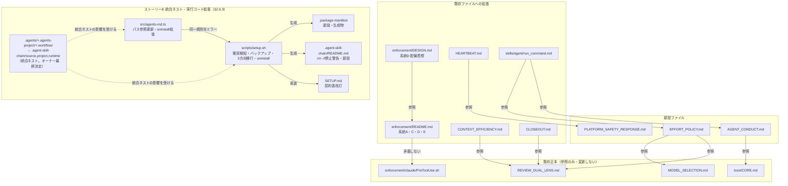

### 2.3 コンポーネント構成

上記 2.1 の責務一覧を踏まえたコンポーネントの配置・説明を行う。**境界・単一責務**: 各コンポーネント・モジュールは**単一責務**を満たすよう構成する。[01_設計原則 §明確な境界・§単一責務](../../../../.agents/spec/01_設計原則.md) を参照。

- **`EFFORT_POLICY.md`**: `MODEL_SELECTION.md` の姉妹ファイルとして `.agents/` 直下に置く。責務は effort 次元のみ。model ティア・具体対応表は持たない。
- **`enforcement/README.md`・`enforcement/DESIGN.md`**: 既存の「強制の 4 層と現状」（箇条書きの節）・「失敗条件 → 実装の所在 → 強制レベル 対応表」・「配置するファイル一覧」という既存構造に**新しい記述・行を追加**する形で拡張する（既存構造を破壊しない。「ツール別強制力マトリクス」はツール別の分類軸のため変更しない）。
- **`CONTEXT_EFFICIENCY.md`**: 既存の 3 行の抽象原則リストに、3 つの新規節（issue-persist 境界／fresh サブ構造化ハンドオフ／仕様 inventory 索引化）を追加する。
- **`CLOSEOUT.md`**: 既存の「commit ステップ」等と並ぶ節構成に、3 つの新規節（停止耐性チェックポイント／malformed 自己検証／責任完遂）を追加する。
- **`PLATFORM_SAFETY_RESPONSE.md`**: `.agents/` 直下の新設ファイル。責務はプラットフォーム安全機構対応のみ。本パッケージ自身の enforcement（`.agents/enforcement/`）とは別レイヤーであることを冒頭に明記する。
- **`AGENT_CONDUCT.md`**: `.agents/` 直下の新設ファイル。§0 読み替え規則＋8 原則本文（§1〜§8）＋サブエージェント向け凝縮版の 3 部構成（参照元 `検証ツール/.agents-project/fable-like行動規範.md` の第2章 §0〜§8・第3章凝縮版に対応する構成を汎用化して踏襲）。**表記規約**: 本設計で「AGENT_CONDUCT §3」と書いた場合は 8 原則中の §3（進捗の実証）を指す。凝縮版は常に「凝縮版」と表記し「§3」とは呼ばない（参照元ファイルの「第3章」との混同防止）。
- **`.agent-skill-chain/`（旧 `.agents/`＋`.agents-project/`＋`.workflow/` の統合ネスト。§2.6.9）**: パッケージのソースディレクトリ名・配備先ディレクトリ名の双方をこの名称へ改称し、配下を `source/`（旧 `.agents/`）・`project/`（旧 `.agents-project/`）・`runtime/`（旧 `.workflow/`）の 3 サブディレクトリに分離する（§2.6.9.2 の命名根拠）。本設計内の他コンポーネント説明が言及する `.agents/`・`.agents-project/`・`.workflow/` は、実装フェーズ完了後は読み替えてそれぞれ `.agent-skill-chain/source/`・`.agent-skill-chain/project/`・`.agent-skill-chain/runtime/` を指すことになる（本 02 自体は改称前の記述を用いて既存構造との対応を示すため、意図的に旧表記を残す。実装計画タスク8 §2.8.2 で改称タスクとして明示する）。
- **`.agents/scripts/setup.sh`・`src/agents-md.ts`**: 既存の「所有分のみ更新・ユーザー資産は保持」という衝突安全設計（`copy_owned_files`／`sync_skills_selective`）を、統合ルート `.agent-skill-chain/` にも同水準で適用する。責務は配備マーカーの生成・確認・バックアップ・3 ディレクトリ統合移行判定・安全な uninstall（§2.6.9.3）のみであり、既存の hooks/skills 配備ロジック自体は変更しない。`runtime/templates/` の最新化ロジックも構造自体は変更せず、置換前バックアップの追加のみ行う（§2.6.9.5）。
- **`.agent-skill-chain/README.md`（新設）**: ルート直下に配置する rm -rf 禁止・uninstall コマンド案内の警告文（§2.6.9.4）。setup が新規配備・再配備のたびに最新化する。
- **`.agents/SETUP.md`（改称後 `.agent-skill-chain/source/SETUP.md`）**: 「保持・上書き契約」の「パッケージ管理」表を、`source/`・`project/`・`runtime/` の 3 行（またはそれに相当する構成）へ改訂し、配備マーカー・バックアップ・安全な uninstall 契約（§2.6.9.3）は同表の説明・注記の拡充で、移行パス（§2.6.9.5 の 3 ディレクトリ統合移行ロジック）は新設の移行パス節で反映する。同表の既存の列構成（対象・種別・説明）は変更しない（なお「対象・init/upgrade・enforce on・enforce off・uninstall」の列構成を持つのは同ファイルの settings.json 契約表であり、本改訂の対象ではない）。

### 2.4 データフロー

**イベント駆動**: 該当なし（§2.2.1 と同様の理由。ランタイムイベント発行を持たない）。

以下は「進行役がサブへ委譲する際に、新設・拡張ファイルがどう参照されるか」の参照フローである（レイヤー名は本プロジェクトの実際の構成要素名）。

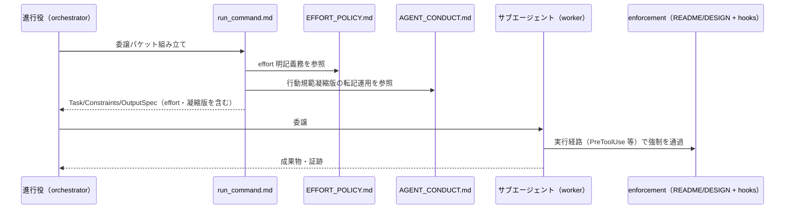

### 2.5 横断設計判断: 機構的強制の実現可否評価ほか（ストーリー6・7 対応・先送りにしない結論）

01 で「設計フェーズでの検討課題」と明記された 2 論点（(a)(b)）と、00 §5 で設計フェーズ判定に委ねられた 1 論点（(c)）について、本設計フェーズで結論を確定する。

#### 2.5.1 対象論点

- **(a)** workflow.db リアルタイム強制（`SubagentStop` 相当）の hook 実装可否（ストーリー6）。
- **(b)** その場しのぎの決定を防ぐ機構的強制の可否（ストーリー7。fable-like 行動規範「§3 進捗の実証」等を hooks/CI で物理的に強制できるか）。
- **(c)** system-graph `CODE_COMMENT_REFERENCE_POLICY.md` の汎用原則の取り込み要否（00 §5 除外要件からの委任）。

#### 2.5.2 結論(a): SubagentStop によるリアルタイム強制は「限定的に実現可能」。系統Eとして抽象仕様のみ確定する

- **一次情報**（01 §2.1 ストーリー6 前提を正とする。2026-07-11 に原典を取得・確認済み）: `SubagentStop` は exit code 2 でサブエージェントの終了をブロックできる（原典 exit code 対応表: "Can block: Yes / Prevents the subagent from stopping"）。入力は `agent_id`／`agent_type`／`last_assistant_message` に加え、共通入力フィールド（`session_id`・`transcript_path`・`cwd` 等）を含む（`https://code.claude.com/docs/en/hooks.md`）。
- **技術的制約（本設計フェーズで新たに評価した点）**: `SubagentStop` の入力には、workflow_log の該当行を一意に紐付けるキー（issue_id・document_id 等）が含まれない。したがって「このサブエージェントの作業に対応する記録が無いこと」を**厳密な1:1で証明することはできない**。
- **設計判断**: 厳密な1:1突合を前提にせず、既存 hook（`PreToolUse-model-tier.sh` 等・system-graph 先行実装）と同じ「fail-open・高信頼ケースのみ block」方針を踏襲したヒューリスティックとして系統Eを設計する（詳細は §3.6）。この設計は、本パッケージ既存の Layer2（`PreToolUse.sh`）が採る「メタデータが渡る環境でのみ物理ブロック・それ以外は CI 補完」という条件付き強制モデル（`enforcement/README.md` §強制の 4 層と現状）の**拡張**であり、ハーネス強制の新規導入ではない。
  - **高信頼判定（block 対象）**: `last_assistant_message` が完了報告パターンに一致し、かつ当該サブエージェント起動時刻以降に workflow_log への INSERT が 1 件も存在しない場合。
  - **それ以外**（判定材料不足・完了報告パターン不一致）は exit 0 で許可し、CI（audit.sh 既存の失敗条件 #5・#9・#18・#19）による事後検知で補完する。
  - 既存 audit.sh 事後検知は**置き換えではなく補完**である。リアルタイム側は「その場で気付かせる即応性」、CI 側は「厳密な因果・順序監査」を担う二層構成とする（`enforcement/README.md §強制の 4 層と現状` と同型の二段構え）。
- **本 issue のスコープ確定**: 上記の抽象仕様を `enforcement/README.md` に系統Eとして追記するところまでを本 issue（および後続実装計画）の対象とする。**実際の hook スクリプト実装・配備は対象外**（00 §5 で既に除外要件として明記済みであり、本評価はその除外を覆さない）。

#### 2.5.3 結論(b): その場しのぎの決定を防ぐ機構的強制は「全面的には不可能」。部分的な構造的代替に留める

- **評価**: 「その場しのぎの決定をしない」「断定前に証拠を突合する」は思考プロセスの質そのものであり、ツール呼び出しメタデータ・git 差分・workflow.db のいずれにも一意の痕跡を残さない。これは既存 `enforcement/README.md §失敗条件 #22–#24`（自立進行ルール違反・高リスク確認省略）が「未実装・runtime/人手監査」に分類している限界と**同型**である。
- **結論**: `AGENT_CONDUCT.md §3 進捗の実証` を**機構（hooks/CI）で直接強制することはしない**。以下の既存の物理強制済み仕組みを「構造的代替（部分的な代理指標）」として位置づけ、AGENT_CONDUCT.md 内に明記する。
  1. `REVIEW_DUAL_LENS.md §3` の両リスト必須化（既存 CI 強制 #27）を「進捗の実証」の代理指標とする（証拠なき断定は敵対的観点レビューで拾われる）。
  2. `CLOSEOUT.md` 新設「委譲ツール発行の malformed 自己検証」（§3.4）を「即行動の実証」の代理指標とする（発行した委譲が正しい形式で受理されたかを自己確認する）。
  3. `document_id` 紐付け（audit #20/#20+）を「捏造された進捗報告」の間接検知として位置づける（記録の無い完了主張は audit #5/#9/#18/#19 で事後検知）。
- **enforcement/README.md への反映**: 「失敗条件→実装の所在→強制レベル対応表」に新規番号（#30 を想定）「AGENT_CONDUCT §3 進捗の実証違反（捏造進捗・未検証の断定）」を追加し、強制レベルは #22–#24 と同じく「未実装・runtime/人手監査」に分類する（機構的強制を偽装せず正直に記述する。DESIGN.md の思想「規約で教育するのではなく構造で逸脱不能にする」を満たせない領域があることを隠さない）。
- **本判断の位置づけ**: この結論は 00 §5「実現可否の評価自体を含めて設計フェーズでの検討課題とする」を満たす。機構としての実装を行わない判断そのものが評価結果であり、先送りではない。

#### 2.5.4 結論(c): CODE_COMMENT_REFERENCE_POLICY の取り込みは「不要（既存カバレッジで充足）」とする

- **判定対象**: 00 §5 で設計フェーズ判定に委ねられた、system-graph `CODE_COMMENT_REFERENCE_POLICY.md` の汎用原則（ソースコードのコメント/docstring はソースコード内で完結させ、外部参照を埋め込まない）の取り込み要否。
- **評価**: 本パッケージの既存正本 [`CODE_COMMENT_RULES.md`](../../../../.agents/CODE_COMMENT_RULES.md) が同じ**広い原則**を既に定義している。issue/PR 番号の直書き禁止に限らず、§1（外部参照によるコメントの陳腐化防止・正本1か所の原則をコメント層でも保つ）・§2（仕様ドキュメント名・章節番号・PR/issue/タスク番号の禁止）・§3（grep 追跡可能なコード参照のみ許可）・§4（文章補足は外部参照を伴わない自然文へ書き換え）で「コメントのソースコード内完結」をカバーし、§5 の CI grep 検出は audit.sh 失敗条件 #26（`check_code_comment_external_ref`）として実装済みである。
- **結論**: コアへの新規ファイル追加・既存ファイルへの節追加は行わない（正本1か所・二重持ち禁止。取り込み不要＝既存参照で完結）。AI が書きがちな一時メモ的コメント（一時的なタスク管理 ID・作業経緯の物語的説明等）のうち機械検出可能なパターンの追加は、CODE_COMMENT_RULES §汎用/固有境界の定めるとおり採用先 `.agents-project/` 側の grep パターン**拡張**として扱い、本 issue のコンポーネント（§2.1.1）には含めない。
- **本判断の位置づけ**: 00 §5 の「取り込み要否は設計フェーズで判定する」を充足する。

### 2.6 横断設計判断: ディレクトリ名前空間衝突安全化（ストーリー8 対応・先送りにしない結論）

01 で「設計フェーズで実際に判断し結論を出す」と明記された 2 論点（(d)(e)）に加え、実装着手前のユーザー再提案（2026-07-11）で追加された 2 論点（(f)(g)）、独立レビュー・ユーザーからの重ねての再指摘（同日）で追加された 2 論点（(h)(i)）、およびプロジェクトオーナーの最終決定（同日・4 回目）による論点（(j)）について、本設計フェーズで結論を確定する。

#### 2.6.1 対象論点

- **(d)** `.agents-project/` の扱い（据え置き／`.agent-skill-chain-project/` 等への統一。ネスト統合の変形案は (f) で併せて評価する）。
- **(e)** 既存に本パッケージ配備済みの `.agents/`（旧名）を持つプロジェクトの移行パス（`agents-md upgrade` 実行時の自動リネーム可否・条件）。
- **(f)** ユーザー提案（実装着手前の再検討依頼）: `.agent-skill-chain/` を新設し、その配下へ `.agents/`・`.agents-project/`・`.workflow/`・`.summary/` の 4 ディレクトリをネストして一括ユニーク化する案（以下「ネスト統合案」）の採否（結論は §2.6.5）。
- **(g)** (f) の検討で顕在化した派生論点: `.workflow/`（特に setup が無条件 `rm -rf` する `.workflow/templates/`）および `.summary/` の扱い（結論は §2.6.6）。
- **(h)** 独立レビューでの再指摘（2026-07-11）: `.workflow/` の対象外判断がこれまで「setup が破壊的に触らない」という論拠のみに依拠していたが、これは `.agents/` が改称前に抱えていた本質的リスク（**名前の汎用性による別ツールとの名前空間衝突**）そのものへの回答になっていない。`.workflow/` にも同型の衝突リスクが残存していないかを独立に検証する（結論は §2.6.7）。
- **(i)** ユーザーからの重ねての再指摘（2026-07-11・3 回目）: 「`.agents/`・`.agents-project/`・`.summary/`・`.workflow/` の 4 ディレクトリ全てが汎用名ゆえに様々なプロジェクトで衝突しうる」という主張、および「単一ルート（`.agent-skill-chain/`）への集約の方が様々なプロジェクトでの採用・理解・削除の観点でシンプルで便利ではないか」という主張。前者は 4 ディレクトリを一律に扱わず、配備有無・衝突時の性質の違いを踏まえて個別に再検証し（結論は §2.6.2 追記・§2.6.6・§2.6.7・§2.6.8 総括表）、後者はネスト統合案の比較表（§2.6.5）に新しい評価軸として追加した上で、一貫性バイアスを排し虚心坦懐に再評価する（結論は §2.6.5 追記）。
- **(j)** **プロジェクトオーナーの最終決定（2026-07-11・4 回目）**: レビュー担当が (f)〜(i) の検証を経て 2 度「ネスト統合案は不採用」と結論づけた（§2.6.5・§2.6.8）後、orchestrator が「誤解リスク」（単一ルートを丸ごと `rm -rf` すると利用者データも消えるという §2.6.5 の指摘）への具体的な緩和策（`.git/` の前例・安全な uninstall コマンドの必須化）を提示したところ、**プロジェクトオーナーがネスト統合案の採用を最終決定した**。これは技術的な優劣が覆ったのではなく、緩和策とのセットでオーナーが受容コストを判断したという**意思決定**である（結論・確定設計は §2.6.9）。

> **⚠️ 2026-07-11 追記（プロジェクトオーナーの最終決定・論点(j)）**: 論点(f)〜(i) についてレビュー担当は 2 度「ネスト統合案は不採用」と結論づけた（§2.6.5・§2.6.8）。しかし、この結論は**プロジェクトオーナーの最終意思決定により覆され、ネスト統合案を採用する方針へ転換した**（確定内容・条件は §2.6.9 を正とする）。**§2.6.2〜§2.6.8 は削除せず、「何を検討し、なぜ一度は不採用と判断したか」という意思決定の経緯（ADR）として保持する**が、**現在の確定設計は §2.6.9 である**。以下の §2.6.2〜§2.6.8 を読む際は、各節の**結論**が §2.6.9 により上書き（または拡張）されていることに注意すること（各節の該当箇所にも上書きの注記を残す）。ただし §2.6.4（配備マーカー・衝突検知・バックアップの共通ロジック）は上書きではなく §2.6.9 に**そのまま継承**される（同節の注記を参照）。

#### 2.6.2 結論(d): `.agents-project/` は「据え置き」とする（改称しない）

> **⚠️ 本節の結論は §2.6.9（プロジェクトオーナーの最終決定）により上書きされた**。`.agents-project/` は `.agent-skill-chain/project/` へ改称・移動される。本節は「なぜ一度は据え置きと判断したか」の経緯として保持する。

- **一次情報（`.agents/SETUP.md §init/upgrade/uninstall の保持・上書き契約`）**: 同ファイルの契約表で `.agents-project/` は「ユーザー資産（保持・破壊しない）」区分に分類され、「setup は touch しない」と明記されている。すなわち `.agents-project/` は setup のいかなるフェーズでも `rm -rf` 等の破壊的操作の対象になったことが無く、**本ストーリーの発端である「無警告 rm -rf による全消去リスク」がそもそも存在しない**。
- **比較**:
  | 観点 | (a) `.agents-project/` 据え置き | (b) `.agent-skill-chain-project/` へ統一 |
  | --- | --- | --- |
  | 安全性への寄与 | 既に setup が touch しないため寄与ゼロ（リスクが元から無い箇所への改称） | 同左（改称してもリスクは変化しない） |
  | 既存採用先への影響 | 影響なし（無変更） | **全採用先が `.agents-project/` を手動リネームする必要**（本リポジトリ自身の `.agents-project/自己拡張ワークフロー.md` 等を含む、破壊的な移行コスト） |
  | 命名一貫性（可読性） | `.agent-skill-chain/` と接頭辞が異なり、対応関係が名前だけでは自明でない（ただしドキュメントへの対応関係明記で実害の無いレベルに解消可能） | `.agent-skill-chain/` と対になり一目で対応が分かる（ただしその利益はドキュメント明記で代替可能） |
  | 06_設計判断の優先順位との整合 | 最上位基準「可読性」の差はドキュメント明記で解消できるため両案は実質同等。残る差分（変更容易性・保守性）で優位 | 可読性の利益は代替手段があり僅少である一方、破壊的な移行コスト（変更容易性・保守性の劣位）が確実に残る |
- **決定**: **(a) `.agents-project/` は据え置く**。命名一貫性（可読性）の差は、`.agents/SETUP.md` および新設 `.agent-skill-chain/README.md`（またはそれに相当する既存 README.md）に「`.agents-project/` は `.agent-skill-chain/` のプロジェクト固有オーバーライドディレクトリである」旨を明記することで実害の無いレベルに解消できるため、[06_設計判断の優先順位.md](../../../../.agents/spec/06_設計判断の優先順位.md) の最上位基準「可読性」において両案は実質同等になる。その上で残る差分は (b) の破壊的な移行コスト（全採用先が `.agents-project/` を手動リネームする必要）のみであり、安全性上の実利益（rm -rf 事故防止）を伴わない改称で移行コストを強いることは、同優先順位の下位基準（変更容易性・保守性）および「新設は本当に新しい関心事のみに限定する」（00 §7.1 対策・01 §2.3 ビジネスルールの正本一元化方針）に反する。よって (a) を採用する。なお、`.agents-project/` を `.agent-skill-chain/` 配下へネストする変形案（論点(f)のネスト統合案の一部）についても §2.6.5 で評価したが、本結論（据え置き）は覆らない（ネストは改称と同等の全採用先移行コストに加え、所有区分の混在という追加の安全性劣化を伴うため。§2.6.5 比較表）。
- **「衝突」軸の独立検証（ユーザー再指摘・2026-07-11。論点(i)）**: 上記の判断はいずれも「setup が破壊的操作を行うか」という**安全性**の軸のみで評価していた。ユーザーは別の軸として「`.agents-project/` という汎用名自体が、別ツールの同名ディレクトリと**衝突**（内容の混同・誤読）しうるのではないか」を独立に指摘している。この軸を切り分けて検証する。
  - **一次情報（`.agents/boot/CORE.md §ルールの優先順位`）**: AI は `.agents-project/` 配下に**同名または同目的のファイルがある場合にのみ**、それを `.agents/` の対応ファイルより優先して採用する（「該当が無い場合は `.agents/` の標準に従う」）。すなわち、`.agents-project/` に無関係な別ツールの内容が存在していても、本パッケージが認識する既知のファイル名・目的（`CORE.md`・`RULES.md` 等の同名オーバーライドや、系統D の `enforcement/claude/` 配下の同名 hook ファイル等）と一致しない限り、AI はそれを一切参照・採用しない。
  - **衝突が起きた場合の性質**: `setup.sh` は `.agents-project/` を**一切作成・書込・削除しない**（§2.6.2 一次情報のとおり）ため、衝突が起きてもデータの破壊は発生しない。起こりうるのは「別ツールが偶然 `.agents-project/` 配下に、たまたま本パッケージの既知ファイル名・目的と一致するファイルを置いていた場合に、AI がそれを誤ってオーバーライドルールとして採用する」という**解釈上の誤読リスク**に限られる。これは `.agents/` 改称前の「無警告・全消去」という**データ破壊リスク**とは性質が異なり、(1) 発生条件がより狭い（単なるディレクトリ名一致ではなく、内部ファイルの名前・目的まで一致する必要がある）、(2) 発生しても AI の挙動異常として人間が気づける（サイレントなデータ消失ではない）。
  - **改称コストの再確認**: `.agents-project/` は `CORE.md §ルールの優先順位`・`enforcement/README.md`（系統D）・`SETUP.md`・本リポジトリ自身の `.agents-project/自己拡張ワークフロー.md` を含む複数箇所に名称がハードコードされている（§2.8.7 実測で単独 40 件参照）。既存採用先を壊さず新旧両名を恒久的に併存対応させるコスト、または既存採用先に破壊的な一括リネームを強いるコストのいずれかが必要になり、後述§2.6.5 で新設ディレクトリのネストを退けた「恒久的な二重対応コスト」と同型の問題を抱える。
  - **決定**: 上記の軸で見ても **(a) 据え置き（改称しない）の結論は変わらない**。理由: 衝突の発生確率は狭い条件（内部ファイルの名前・目的一致）を要するため低く、発生時の影響もデータ破壊ではなく観測可能な挙動異常に留まる一方、改称コスト（恒久的な二重対応、または既存採用先への破壊的移行）は確実に生じる。この非対称性（低い期待損失 vs 確実なコスト）は [06_設計判断の優先順位.md](../../../../.agents/spec/06_設計判断の優先順位.md) の下位基準（変更容易性・保守性）に照らして改称を正当化しない。「setup が触らないから安全」という論拠だけでなく、「衝突自体の発生確率・影響も検討した上で対応不要と判断した」旨をここに明記する。

#### 2.6.3 結論(e): 移行パスは「フィンガープリント判定による限定的な自動リネーム」とし、判定不能時は人間判断を促す

> **⚠️ 本節の結論は §2.6.9（プロジェクトオーナーの最終決定）により拡張された**。フィンガープリント判定の基本思想（マーカー未存在時の限定的救済・判定不能時は人間判断）は維持されるが、移行対象が `.agents/` 1 ディレクトリのみから `.agents/`・`.agents-project/`・`.workflow/` の 3 ディレクトリへ拡張される。本節は基本思想の初出として保持し、拡張後の確定仕様は §2.6.9 を正とする。

- **技術的制約（本設計フェーズで新たに評価した点）**: 配備マーカー（`.package-manifest`）はストーリー8で**新設**するものであり、本バージョン以前に配備された既存の `.agents/`（旧名・正規の旧バージョン配備）には元々マーカーが存在しない。したがって「マーカー無し＝別ツール由来」という新規配備時の判定ロジック（§2.6.4）をそのまま upgrade 時にも適用すると、**正規の既存採用先全員が移行できなくなる**（false positive で全員が人間判断待ちに落ちる）。
- **設計判断**: upgrade（再 init）実行時、配備先に `.agent-skill-chain/` が存在せず、かつ旧名 `.agents/` が存在する場合に限り、以下のフィンガープリント判定を行う。
  - **フィンガープリント条件**: `.agents/boot/CORE.md`・`.agents/scripts/setup.sh`・`.agents/enforcement/ci/audit.sh`・`.agents/ledger/schema.sql` の**4 ファイルすべてが存在する**こと（本パッケージが配備する構成に一意な組み合わせ。単一ファイルでは他パッケージとの偶然の一致を排除できないため複数ファイルの AND 条件とする）。
  - **一致する場合**: 「本パッケージの正規の旧配備」と高信頼で判定し、(1) タイムスタンプ付きバックアップへ退避 → (2) `.agents/` を `.agent-skill-chain/` へリネーム → (3) `.agent-skill-chain/.package-manifest` を新規生成、の順で自動移行する。
  - **一致しない場合**（4 ファイルのうち 1 件以上が欠落している場合。本判定は存在確認の AND のみで行い、内容の同一性検査は行わない）: 自動移行を行わず、新規配備時の衝突検知（§2.6.4）と同じ安全側方針でエラーメッセージを出し、人間の判断を促す。
- **自動移行の対象は `.agents/` のリネームのみ**: ネスト統合案の不採用（§2.6.5）により、移行時に移動するのは旧名 `.agents/` → `.agent-skill-chain/` の 1 ディレクトリだけである。`.agents-project/`（§2.6.2 据え置き）・`.workflow/`（workflow.db・issue 成果物・templates を含む。§2.6.6）・`.summary/`（§2.6.6 スコープ外）は移行のいかなる分岐でも移動・改称・削除しない。
- **移行期間限定のロジックである旨の明記**: フィンガープリント判定は「配備マーカー導入前の旧配備」を救済するための**移行期間限定**のロジックであり、恒久的な判定手段ではない。配備マーカー導入後に新規配備・移行を経たプロジェクトは、以降常にマーカーによる判定（§2.6.4）のみを用いる。この位置づけを `enforcement/README.md` 相当ではなく `.agents/SETUP.md`（移行パス節）に明記し、恒久ロジックと誤認されないようにする。
- **本判断の位置づけ**: この結論は 01 の「移行パスについて設計フェーズで結論を出す」を満たす。

#### 2.6.4 配備マーカー・衝突検知・バックアップの抽象仕様（新規配備・再配備時の共通ロジック）

> **注記（§2.6.9 との関係）**: 本節の共通ロジック（配備マーカー・fail-closed 中止・バックアップ）は §2.6.9 により**上書きされず、そのまま継承**される。§2.6.9 採用後は、バックアップ・置換の対象を `.agent-skill-chain/source/`・`.agent-skill-chain/runtime/templates/`（本文中の `.workflow/templates/` は `runtime/templates/` と読み替え）として適用する。

- **配備マーカー**: `.agent-skill-chain/.package-manifest`（JSON または key=value 形式。最低限 `name`（本パッケージ名）・`version` を含む）。setup が新規配備・移行完了の都度、最新の `package.json` の値で書き込む。
- **衝突検知（新規配備・再配備共通）**: 配備先に `.agent-skill-chain/` が既に存在する場合、setup は次の順で判定する。
  1. `.agent-skill-chain/.package-manifest` が存在し、`name` が本パッケージと一致する → 本パッケージ由来と確認。§バックアップへ進む。
  2. 上記 1 を満たさず、かつ §2.6.3 のフィンガープリント条件（旧名 `.agents/` からの移行専用）にも該当しない → **`rm -rf` を中止**し、エラーメッセージ（検知した内容・人間が確認すべき手順）を出力して終了する。
- **バックアップ**: 本パッケージ由来と確認できた場合の通常の再配備（init/upgrade）でも、上書き前に `.agent-skill-chain.bak.<タイムスタンプ>/`（または同等の命名）へ退避してから最新内容で上書きする。既存の `.claude/settings.json` の `enforce on` が採る `.bak` 退避パターン（`.agents/SETUP.md §enforcement の opt-in` の `enforce on` 行）と同型の設計を踏襲する。setup が同様に無条件置換する `.workflow/templates/` にも、置換前の同型バックアップを適用する（§2.6.6。退避関数は共用し二重実装しない）。
- **fail-open/fail-closed の位置づけ**: 本ロジックは他の enforcement 抽象仕様（系統A/C/E）と異なり **fail-closed**（判定できない場合は安全側＝処理中止）を既定とする。理由は、対象が「ユーザーの既存ファイルの破壊的削除」であり、系統A/C/E（委譲のブロック・警告に留まる）よりも取り返しのつかない結果（データ消失）を招くため。既存の `enforce on` の「無効 JSON の場合は破壊を避けるため中止する」（`.agents/SETUP.md §enforcement の opt-in` の「安全策」注記）という既存の fail-closed 前例と整合する。

#### 2.6.5 結論(f): ネスト統合案（ユーザー提案）は不採用とし、「`.agents/` のみ改称」（§2.6.2〜§2.6.4 の現行確定案）を維持する

> **⚠️ 本節の結論（不採用）は §2.6.9（プロジェクトオーナーの最終決定・2026-07-11）により覆された。** 本節が指摘した「誤解リスク」（単一ルートを丸ごと `rm -rf` すると利用者データも消える。下記比較表の新軸を参照）自体は正しい分析であり撤回しない。ただし、この誤解リスクは「安全な uninstall コマンドの必須実装」＋「README 警告」という具体的な緩和策とセットで受容する、というのがオーナーの最終判断である。本節はその判断に至るまでの比較検討の経緯として保持する。確定設計は §2.6.9。

- **提案内容**: `.agent-skill-chain/` を新設し、その配下へ `.agents/`・`.agents-project/`・`.workflow/`・`.summary/` の 4 ディレクトリをネストする。名前空間を単一ルートへ集約し、残る汎用名（`.workflow/`・`.agents-project/` 等）も含めて一括でユニーク化することが狙い。
- **提案の利点として認めた点**: (1) 採用先プロジェクトのルートに現れる本パッケージ関連ディレクトリが 1 個に集約され、「どれが本パッケージのものか」の発見性が上がる。(2) `.workflow/`・`.agents-project/` という汎用名の他ツールとの衝突可能性も同時に解消される。
- **比較**（§2.6.2 と同フォーマット。実測値は 2026-07-11 再計測。基準は 03_実装計画 §2.8.7 と同じ「close・issue 記録を除く現行運用文書・コードの git 追跡ファイル」）:

  | 観点 | 現行確定案（`.agents/` → `.agent-skill-chain/` の改称のみ） | ネスト統合案（4 ディレクトリを配下へ集約） |
  | --- | --- | --- |
  | 安全性（誤 rm -rf の爆発半径） | 誤削除・置換ロジックのバグが破壊しうるのは**再配備で復元可能なパッケージコピーのみ**。ユーザー資産（`.agents-project/`）・証跡 DB（workflow.db・改ざん検知ハッシュチェーン）・issue 成果物（`.workflow/<issue>/`）は物理的に別名前空間で到達不能 | **1 つの誤った `rm -rf`（または選択的置換ロジックの 1 つのバグ）が、ユーザー資産・全 issue 成果物・証跡 DB を同時に消しうる**。爆発半径が最大化され、「無警告全消去の事故防止」というストーリー8 の目的そのものに逆行する |
  | 「丸ごと置換」契約の成立（単一責務） | `.agent-skill-chain/` は setup が完全所有し、「マーカー確認＋バックアップの上で丸ごと置換してよい」という単一の契約で管理できる（§2.6.4 の安全化メカニズムの前提） | 配下に「置換可（パッケージ正本）」「不可侵（ユーザー資産）」「生成物（gitignore 対象）」の 3 所有区分が混在し、選択的削除・除外リスト管理が必須になる。既存 setup が `.claude/`・`.cursor/` で実装している selective 更新と同種の複雑さを、安全化のために新設するディレクトリへ自ら持ち込むことになる |
  | 可読性（06 最上位基準） | トップレベル分離が所有区分（`SETUP.md` 保持・上書き契約表の区分）と 1:1 対応し、名前空間そのものが「消してよいか」を伝える。パス深さも現状維持（spec/01 AI フレンドリー設計「深すぎないディレクトリ構造」と整合） | ルートは 1 個に見えるが、所有区分の情報が名前空間から消える。最頻参照パスの全部が 1 階層深くなる。「1 か所に集約され見つけやすい」利益は、SETUP.md/README への名前空間ファミリー一覧の明記で代替可能（§2.6.2 の可読性差の解消と同じ論法） |
  | gitignore・git 追跡 | 既存のルート 1 行規則（`/.workflow/*` ＋例外）を維持 | 単一ルート配下に追跡対象（ユーザー資産相当）と無視対象（ランタイム生成物相当）が混在する。git は無視されたディレクトリ配下の再包含（`!` 否定）を辿らない仕様があり、ネスト混在規則は設定ミスが事故（追跡漏れ・秘匿値の混入）に直結しやすい |
  | 既存採用先の移行コスト | `.agents/` のリネームのみ（§2.6.3 の自動移行で救済可能） | 全採用先が `.agents-project/`（手動リネーム）に加え、**`.workflow/`（稼働中の workflow.db・-wal/-shm を含む）の移動**を強いられる。稼働中 SQLite DB の移動は証跡破損リスクを伴う |
  | 参照更新の実測 | 約 102 件（`.agents/` 参照。§2.8.7 再計測） | 約 122 件（`.agents/`・`.agents-project`・`.workflow/` のいずれかを参照する現行運用文書・コードの合算実測。約 1.2 倍） |
  | ユニーク化の完全性 | `.workflow/`・`.agents-project/` は汎用名のまま残る（残存リスクは §2.6.2・§2.6.6・§2.6.7 で個別に評価し比例的に緩和する） | プラットフォーム固定名の配備先（`.claude/`・`.cursor/`）はネスト不可能なため、**どのみち単一ルートへは集約できない**。得られる利益は部分的に留まる |
  | **単一ルート集約による発見性・単純さ・多プロジェクト運用性**（ユーザー再指摘・2026-07-11・3 回目。既存の安全性・移行コスト軸とは独立の評価軸として追加） | トップレベルに現れるのは最大 3 エントリ（`.agent-skill-chain/`・`.agents-project/`・`.workflow/`。`.summary/` は配備されないため採用先には現れない。§2.6.8）。各名前がその役割（正本／プロジェクト固有オーバーライド／ランタイム）を単独で示す。`.git/`・`.github/`・`.gitignore`・`.gitattributes` が同じ「git 関連」でも役割ごとに別名で並存し、これを「バラバラで分かりにくい」とは通常言わない慣習と同型 | ルートのエントリは 1 個に減るが、開けば内部に同じ 3 つの役割（正本／オーバーライド／ランタイム）のサブディレクトリが現れるだけであり、**学習すべき名前の数は変わらず、単に 1 階層下へ移動するだけ**（発見性の実質的な改善は乏しい）。加えて、単一ルートへの集約は「このフォルダ 1 個を消せば丸ごとアンインストールできる」という直感を利用者に与えやすい。だが実際には内部にユーザー資産（`.agents-project/` 相当）・issue 履歴・証跡 DB（`.workflow/` 相当）が同居するため、その直感どおりに `rm -rf .agent-skill-chain/` を実行すると、**利用者自身の手で**それらを巻き添えに全消去してしまう。これは本ストーリーが `.agents/` の改称・マーカー・fail-closed 中止によって防ごうとした「無警告全消去」と**同型の事故**を、setup のバグとしてではなく利用者の誤操作として再現するものであり、単一ルート化の「分かりやすさ」がむしろ安全側の直感を歪める方向に働く |

- **決定**: **ネスト統合案は不採用**とし、§2.6.2〜§2.6.4 の現行確定案を維持する。**この結論はユーザーからの 3 回にわたる再指摘を受けて改めて虚心坦懐に再評価した上での結論であり、単なる従前結論の防御ではない**（追加した上表の新軸を含め、一貫性バイアスを排して再検証した）。[06_設計判断の優先順位.md](../../../../.agents/spec/06_設計判断の優先順位.md) の最上位基準「可読性」を新軸も含めて評価すると、ネスト案の「発見性・単純さ」の利益は表面的には存在するが、(1) 内部構造を開けば同じ学習コストが単に 1 階層下へ移動するだけで実質は解消されておらず、(2) むしろ「1 個のフォルダ＝1 個の安全な削除単位」という誤った直感を利用者に与え、本ストーリーの目的（無警告全消去の防止）に**利用者の手を経由する形で**逆行する新たな安全性コストを生む。したがって新軸を追加してもなお、所有区分の混在（単一責務の毀損）・誤削除の爆発半径拡大（仕様との整合性）・全採用先の移行コストと参照更新の増大（変更容易性・保守性）という既存の劣化要因に、この新たな安全性コストが加わるのみであり、結論を覆す根拠にはならない。個別ディレクトリの残存論点は次のとおり分解して処置する: `.agents-project/`＝§2.6.2（据え置き・変更なし。衝突軸の独立検証を追記済み）、`.workflow/`（templates の無条件置換）＝§2.6.6（バックアップ退避を追加）・`.workflow/` 全体の残存リスク＝§2.6.7（既知の残存リスクとして明記）、`.summary/`＝§2.6.6（スコープ外・衝突が物理的に成立しない）。
- **本判断の位置づけ**: ユーザー提案の狙い（残る汎用名ディレクトリの衝突安全化）自体は正当と評価する。本結論は狙いの却下ではなく、「ネストという手段のみ不採用とし、狙いは §2.6.6・§2.6.7 の比例的な緩和策で部分充足する」という整理である。
- **ユーザー向け平易な結論サマリー**: 「関連ディレクトリを 1 か所にまとめた方がシンプルで使いやすいのでは」というご指摘は直感として自然であり、その狙い自体は正しいと考えています。しかし実際に検証すると、まとめても中身は結局 3 種類の性質の異なるもの（パッケージ本体・ユーザー独自ルール・実行時の記録）に分かれているため、フォルダを 1 つにまとめても「覚える名前の数」は減らず、単に一段深い場所に移動するだけでした。それどころか、フォルダが 1 つにまとまっていると「このフォルダを丸ごと消せば綺麗にアンインストールできる」と誤解しやすくなり、その誤解どおりに操作すると、まとめた中に同居しているユーザー自身の設定・作業履歴・記録まで一緒に消えてしまいます。これはまさに本件（ストーリー8）が防ごうとしている「うっかり大事なものを消してしまう事故」を、今度は仕組みのバグとしてではなく人の操作として再現してしまうことになります。そのため、まとめる方向ではなく、名前ごとに役割が一目でわかる形（正本＝`.agent-skill-chain/`、独自ルール＝`.agents-project/`、実行記録＝`.workflow/`）を維持し、その対応関係はドキュメントに明記する、という現状の方針を維持することにしました。

#### 2.6.6 結論(g): `.workflow/templates/` には置換前バックアップを追加し、`.summary/` はストーリー8 のスコープ外とする

- **`.workflow/templates/`（実在する残存リスク・バックアップで緩和）**:
  - **一次情報**: 現行 `setup.sh` は、配備先の `.workflow/templates/` がパッケージソースと同一パスの場合（パッケージリポジトリ自身への自己適用）を除き、既存の `.workflow/templates/` を由来確認なしに `rm -rf` して再コピーする（65〜77 行目。2026-07-11 実装確認。採用先への配備＝別パスの通常ケースでは無条件の置換となる）。仮に採用先が `.workflow/` 名前空間を別ツールと共用していた場合、当該ツールの templates 相当物が無警告で消える。01 ストーリー8 背景はこれを「懸念が `.agents/` より小さい」としてスコープ外に置いていたが、ネスト統合案の検討（論点(f)）により残存リスクとして再評価した。
  - **決定**: ネストによる名称ユニーク化は行わず（§2.6.5）、**置換前にタイムスタンプ付きバックアップへ退避してから最新化する**処置を追加する（§2.6.4 のバックアップと同一の退避関数を共用する）。マーカーによる由来検知・fail-closed 中止までは適用**しない**。理由（比例原則）: 中身は再生成可能なパッケージ生成テンプレート専用置き場であり、誤置換の被害はバックアップにより完全に復元可能となる一方、由来検知まで広げると templates 用のマーカー管理が別途必要になり、複雑さの増加が利益を上回るため。
  - この処置により、ネスト統合案が `.workflow/` について与えるはずだった保護（別ツール資産の無警告消去の防止）を、採用先の移行コストゼロで実効的に充足する。
  > **⚠️ `.workflow/templates/` バックアップのみで由来検知は行わないという上記の結論は §2.6.9 により上書きされた**。ネスト統合案採用後は `.workflow/`（→ `runtime/`）全体が `.agent-skill-chain/` ルートの配備マーカー・フィンガープリント判定の対象に含まれるため、`templates/` サブディレクトリも含めて統一的な由来検知の恩恵を受ける。本節の分析（バックアップの要否・比例原則の考え方）自体は §2.6.9 の設計にも引き継がれる。
- **`.summary/`（スコープ外。この結論は §2.6.9 でも変更なし＝維持）**:
  - **正体（実ファイル調査・2026-07-11）**: 本リポジトリ直下の保守者ローカルツール置き場である（ソース要約生成スクリプト `output_*.py` 一式と生成物 `*_summary.txt`。ツール一式のみ git 追跡し、生成物は `.summary/` 内側の `.gitignore` で除外。`.summary/README.md` 自身が「GENERATED / NOT SOURCE OF TRUTH」と明記）。`package.json` の `files` allowlist に含まれず**非配布**であり、`setup.sh`・`src/agents-md.ts` のいずれの配備・削除経路にも現れない**非配備**である。
  - **決定**: **ストーリー8 のスコープ外**とする。理由: ストーリー8 が扱う衝突安全化は「setup が採用先プロジェクトへ配備・削除するディレクトリ」の由来検知・保護であり、`.summary/` には配備経路が無く採用先に存在し得ないため、衝突・誤削除のリスクがそもそも発生しない。本リポジトリ内ローカルの改称・移動は安全性に寄与せず、参照更新コストのみが生じる。
  - **「衝突」自体が成立しない旨の明示（ユーザー再指摘・2026-07-11。論点(i)）**: ユーザーは「`.agents-project/`・`.summary/`・`.workflow/` も汎用名ゆえ様々なプロジェクトで衝突しうる」と 4 ディレクトリを一律に主張したが、`.summary/` はこの中で唯一「衝突」という概念自体が成立しない。衝突とは「同じ名前空間を 2 つの主体が奪い合う」状態を指すが、本パッケージは `.summary/` という名前空間を**採用先プロジェクトのどこにも一切主張していない**（`package.json` の `files` allowlist・`setup.sh`・`src/agents-md.ts` のいずれの配備・削除・検知対象にも `.summary` の文字列自体が存在しない。2026-07-11 実ファイル確認済み）。したがって、ある採用先プロジェクトに偶然 `.summary/` という名前のディレクトリが存在していたとしても、それは他ツール・利用者自身の名前空間であり、本パッケージとは何ら関係を持たない（「本パッケージ側の `.summary/` が存在しないので衝突しようがない」）。これは `.agents/`（配備される・衝突しうる・改称で対応済み）・`.agents-project/`（配備される・衝突しうるが低確率かつ非破壊・据え置きで対応済み）・`.workflow/`（配備される・衝突しうるが `.agents/` より軽微・残存リスクとして明記。§2.6.7）とは**カテゴリが異なる**ことを明記する。

#### 2.6.7 結論(h): `.workflow/` 全体の名前空間衝突残存リスクは「実在するが `.agents/` 改称前より本質的に軽微」と評価し、マーカー導入・改称のいずれも行わない。既知の残存リスクとして明記し、setup の沈黙スキップ改善は将来課題とする

> **⚠️ 「マーカー導入・改称は行わない」という結論は §2.6.9（プロジェクトオーナーの最終決定）により上書きされた**。`.workflow/` は `.agent-skill-chain/runtime/` として改称・ネストされ、ルートの配備マーカー・フィンガープリント判定の対象に含まれる。ただし、本節が特定した `workflow.db` の**ファイル単位の由来検知欠如**（sqlite3 有効性・`workflow_log` テーブル有無の検査が無い）という残存論点は、ルート単位のマーカー導入だけでは解消されない**別軸の課題**であり、サブ issue「[`workflowDB由来検知欠如是正`](./90_issues/20260711_062125_workflowDB由来検知欠如是正/00_要求定義.md)」として引き続き有効（パスは `runtime/workflow.db` に読み替える）。本節の実機検証・比較表は §2.6.9 の設計判断の根拠として引き継がれる。

- **検証観点（独立レビューでの再指摘・2026-07-11）**: これまでの `.workflow/` 対象外の論拠は「setup が `.workflow/` を破壊的に触らない」点のみに依拠していた。しかしこれは、`.agents/` が改称前に抱えていた本質的な問題（**汎用的すぎる名前ゆえに、消費者プロジェクトに既に存在する別ツールの同名ディレクトリと衝突しうる**というリスクそのもの）への回答になっていない。「setup がその場で何を rm -rf するか」は影響範囲（blast radius）の論点であり、「衝突がそもそも起こりうるか」への回答ではないため、両者を混同していた可能性がある。本節でこれを独立に検証する。
- **一次情報（実装確認・2026-07-11）**:
  1. `setup.sh` は `.workflow/` ディレクトリ自体を rm -rf しない。無条件 rm -rf の対象は `.workflow/templates/` サブディレクトリに限定される（65〜77 行目。既に §2.6.6 で残存リスクとして特定済み・置換前バックアップで緩和済み）。
  2. `.workflow/<issue>/` ディレクトリは `mkdir -p` 相当で作成され、既存内容を削除しない。ディレクトリ名は `YYYYMMDD_HHMMSS_<title>`（秒単位タイムスタンプ）を含むため（`skills/agent/run_command.md §Constraints`「issue フォルダ作成時」）、別ツールが偶然同一パスを使う確率は実務上無視できる。
  3. `.workflow/workflow.db` は `write-workflow-log.sh`（273〜277 行目）・`setup.sh` の `init_workflow_db`（150〜159 行目）のいずれも **`[[ -f "$db" ]]` の存在確認のみ**でスキーマ初期化の要否を判定しており、当該ファイルが本パッケージ由来かを検証する処理は一切存在しない。`.agent-skill-chain/.package-manifest` 相当のマーカー・由来検知は `.workflow/` には一切実装されていない（衝突検知は `.agent-skill-chain/` 本体にしか実装されない設計であることを確認した）。
  4. **実機検証（2026-07-11・隔離環境）**: `.workflow/workflow.db` に本パッケージ非由来の任意テキストファイルを事前配置した状態で `sqlite3 "$db" "PRAGMA table_info(workflow_log);"` を実行すると `Error: file is not a database`（exit code 26）で失敗し、当該ファイルの内容は変更されなかった。sqlite3 自体が非 DB ファイルへの書き込みを拒否するため、**サイレントなデータ破壊は生じない**。ただし `setup.sh` の `init_workflow_db` は `[[ -f "$db" ]]` が真の時点で**エラーも警告も出さず `return 0` する**ため、setup 自体は「成功」として完了し、由来不明ファイルの存在は利用者に一切通知されない。次にサブエージェントが `write-workflow-log.sh` を実行した時点で、上記の sqlite3 エラーにより `set -e` でスクリプトが異常終了し、書記（scribe）ステップがブロックされる（証跡記録が完了できず CORE の「証跡省略禁止」ゲートに引っかかる形で問題が事後的に顕在化する）。
- **`.agents/` 改称前のリスクとの異同（結論の根拠）**:

  | 観点 | `.agents/`（改称前） | `.workflow/`（現状） |
  | --- | --- | --- |
  | 衝突時の即時挙動 | 検知なしに `rm -rf` → 別ツールの内容を**無警告・全消去**（サイレントなデータ破壊） | `templates/` サブパスのみ同型リスク（§2.6.6 で緩和済み）。`workflow.db` は sqlite3 が非 DB ファイルへの書き込みを拒否し**エラー終了**（サイレントなデータ破壊は生じない）。`<issue>/` はタイムスタンプ命名により事実上衝突しない |
  | 衝突の発見しやすさ | 発見不能（削除後は痕跡が残らない） | setup は沈黙スキップするが、直後の書記ステップで sqlite3 エラーとして事後的に**顕在化**する |
  | 影響範囲（blast radius） | ディレクトリ配下**全体**が対象（内容を問わず無条件で全消去） | 対象パスは `templates/` サブディレクトリと `workflow.db` ファイルの 2 か所に限定され、`<issue>/` 配下の issue 成果物は対象外 |

- **決定**: **(a) 残存リスクとして明記し、マーカー・フィンガープリント等の追加機構は導入せず、`.workflow/` の名称変更も行わない。** 根拠:
  1. **安全性（06 優先順位・仕様との整合性）**: 最悪ケースでも `.agents/` 改称前のような「無警告・全データ消去」は起こらない（上表）。`templates/` は既にバックアップで緩和済み（§2.6.6）。`workflow.db` は sqlite3 の性質上サイレント破壊しない（実機検証済み）。残る実害は「setup 完了後、最初の書記ステップで原因不明のエラーが起きる」という**顕在化する不便**であり、`.agents/` が抱えていた**サイレントなデータ消失**とは質的に異なる。
  2. **改称のコスト（可読性・変更容易性、§2.6.2 の `.agents-project/` 据え置き判断と同型の論法）**: `.workflow/` は git 追跡されない（ルート `.gitignore`）ため `.agents/`・`.agents-project/` と異なりコミット履歴・PR 差分に一切現れず、改称による発見性向上の利益は `.agents/` ほど大きくない。一方、`.workflow/` は issue 作成・memo・書記記録のたびに毎回参照される最頻出パスであり（§2.8.7 実測で現行運用文書・コードだけで単独 74 件参照）、改称は `run_command.md`・`RULES.md`・`.agents-project/自己拡張ワークフロー.md` 等の運用記述・利用者の操作習慣を広範囲に書き換えるコストを伴う。
  3. **比例原則（`.summary/`・`.workflow/templates/` の判断と整合）**: 実際の衝突条件（ディレクトリ名＋ファイル/サブディレクトリ名の 2 階層一致が必要）と実害（顕在化するエラーであり、サイレント破壊ではない）を踏まえると、マーカー機構追加の複雑さが得られる安全性の利益を上回る（§2.6.6 の `.workflow/templates/` に対する判断と同じ比例原則を適用した）。
- **将来課題（本 issue のスコープ外として明記・起票済み）**: `setup.sh` の `init_workflow_db` が既存ファイルの存在のみで「良し」として `return 0` する沈黙スキップは、由来不明ファイルの存在を利用者に一切知らせない点で改善余地がある（例: 既存ファイルが有効な sqlite3 DB か・`workflow_log` テーブルを持つかを軽量に検査し、一致しなければ警告を出す）。ただしこれは `.agent-skill-chain/` 本体のようなマーカー付与・fail-closed 中止までを要する変更ではなく**警告追加のみの軽量な改善**であり、本 issue（ストーリー8）のスコープには含めない。CLOSEOUT.md 新設「課題の責任完遂」原則（起票は必要条件だが十分条件ではない）に従い、放置せず本親 issue のサブ issue 5「[`workflowDB由来検知欠如是正`](./90_issues/20260711_062125_workflowDB由来検知欠如是正/00_要求定義.md)」として起票済み（要求・要件定義完了・設計フェーズ待ち。着手時期は親 issue ストーリー8 の実装完了後を目安とする）。

#### 2.6.8 4 ディレクトリの衝突リスク総括表（ユーザー再指摘の統合検証・論点(i)）

> **⚠️ 本節は「4 ディレクトリを一律ではなく個別に評価する」という分析方法自体は §2.6.9 でも踏襲されるが、`.agents-project/`・`.workflow/` の結論欄（据え置き・マーカー導入せず）は §2.6.9 により上書きされた。** `.summary/`（スコープ外）の結論のみ変更なし。

ユーザーは「`.agents/`・`.agents-project/`・`.summary/`・`.workflow/` の 4 ディレクトリ全てが汎用名ゆえに衝突しうる」と一律に主張したが、検証の結果、**4 ディレクトリは性質が異なり同一結論には至らない**。個別節（§2.6.2〜§2.6.7）の結論を、ユーザーが求める「配備されて実在するか」「衝突時の性質」の軸で総括する。

| ディレクトリ | 消費者プロジェクトへの配備 | 衝突が起きた場合の性質 | 結論 | 参照節 |
| --- | --- | --- | --- | --- |
| `.agent-skill-chain/`（旧 `.agents/`） | される（パッケージ正本のコピー） | 由来検知なしの無条件 `rm -rf` → データの**無警告全消去**（4 ディレクトリ中最も深刻。本ストーリーの発端） | 改称＋配備マーカー＋フィンガープリント判定＋fail-closed 中止で対応済み | §2.6.3・§2.6.4 |
| `.agents-project/` | される（プロジェクト固有オーバーライド置き場として案内） | setup は一切 touch しないため削除は起きない。同名・同目的のファイルが偶然一致した場合に限り、AI がそれを誤ってオーバーライドルールとして採用しうる（**解釈上の誤読リスク**。データ破壊ではなく観測可能な挙動異常） | 据え置き（改称しない）。衝突軸を独立評価した上でも結論不変（低確率・非破壊 vs 確実な改称コストの非対称性） | §2.6.2 |
| `.workflow/` | される（`templates/` の配備＋ランタイム生成物） | `templates/` は無条件 `rm -rf` 対象（バックアップ退避で緩和済み）。`workflow.db` は由来検知が無いが sqlite3 が非 DB ファイルへの書込みを拒否し**エラー終了**（サイレント破壊なし・事後的に顕在化）。`<issue>/` はタイムスタンプ命名で実質衝突しない | マーカー等の追加機構は導入せず、既知の残存リスクとして明記。setup の沈黙スキップ改善は将来課題 | §2.6.6・§2.6.7 |
| `.summary/` | **されない**（`package.json` の `files` allowlist 外・`setup.sh`／`src/agents-md.ts` のいずれの配備・削除経路にも文字列自体が存在しない） | **「衝突」という概念が物理的に成立しない**（本パッケージが当該名前空間をどこにも主張していないため、奪い合う相手が存在しない） | スコープ外（対応不要） | §2.6.6 |

**総括**: 「配備されて消費者プロジェクトに実在する」3 ディレクトリ（`.agent-skill-chain/`・`.agents-project/`・`.workflow/`）は、いずれも汎用名に起因する衝突の可能性それ自体は否定できないが、(1) 衝突時の性質（データ破壊 vs 解釈誤読 vs 事後的に顕在化するエラー）と (2) 対応コスト（改称・マーカー導入の要否）は 3 者で大きく異なるため、個別に比例的な結論を出した（一律の対応を行っていない）。「配備されず実在しえない」`.summary/` は、他の 3 つとカテゴリが異なり、対応不要である。

#### 2.6.9 最終決定（プロジェクトオーナーによる方針転換・論点(j)）: ネスト統合案を採用する。所有区分の可視化・安全な uninstall コマンドの必須化を条件とする

**本節が §2.6 全体の確定設計（正）である。** §2.6.2〜§2.6.8 は削除せず、本決定に至るまでの検討の経緯（ADR）として保持する。

##### 2.6.9.0 意思決定の経緯（ADR）

- **第 1 回主張（実装着手前・2026-07-11）**: ユーザーが `.agent-skill-chain/` 配下へ `.agents/`・`.agents-project/`・`.workflow/`・`.summary/` の 4 ディレクトリをネストする案（ネスト統合案）を提案。
- **第 1 回結論（レビュー担当・design-feature）**: §2.6.5 にて**不採用**と結論。根拠は安全性（誤 rm -rf の爆発半径拡大）・所有区分の混在（単一責務の毀損）・既存採用先の移行コスト・参照更新の増大（約 1.2 倍）・ユニーク化の不完全性（`.claude/`・`.cursor/` はネスト不能）の比較表による。
- **第 2 回主張（独立レビュー中・2026-07-11）**: ユーザーが「`.workflow/`・`.agents-project/`・`.summary/` も汎用名ゆえ衝突しうるのでは」と再指摘。独立レビュー担当が `.workflow/`（§2.6.7）・`.agents-project/`（§2.6.2 追記）・`.summary/`（§2.6.6 追記）を個別に実機検証・再検証。
- **第 2 回結論（独立レビュー担当）**: §2.6.8 にて 4 ディレクトリを配備有無・衝突時の性質で個別評価し、いずれも「ネストせず個別の比例的対応で足りる」と再確認（不採用の維持）。
- **第 3 回主張（同日・3 回目）**: ユーザーが「単一ルートへの集約の方が多プロジェクトでの採用・理解・削除の観点でシンプルではないか」と単一ルート集約自体の利便性を再主張。
- **第 3 回結論（独立レビュー担当）**: §2.6.5 に新軸「単一ルート集約による発見性・単純さ・多プロジェクト運用性」を追加し再評価。結論は変わらず不採用（新軸を加味しても、内部を開けば同じ学習コストが1階層下に移動するだけで実質改善が乏しい一方、「1 個のフォルダ＝1 個の安全な削除単位」という誤解を招き、単一ルートの `rm -rf` が利用者資産を巻き添えにする**新たな安全性コスト**を生むと判断）。
- **orchestrator による緩和策の提示（2026-07-11・4 回目のやり取り）**: orchestrator が、独立レビュー担当の指摘した「誤解リスク」（単一ルートを丸ごと `rm -rf` すると利用者データも消える）そのものへの**具体的な緩和策**をユーザーに提示した。
  1. **`.git/` の前例**: `.git/` はシステム領域（オブジェクト・参照・設定）と利用者操作の対象（ブランチ・コミット履歴等の利用者が生成したデータ）を同一ディレクトリ配下に同居させているが、これは実務上問題視されていない。理由は、利用者が `.git/` を直接 `rm -rf` する運用を前提とせず、**正規コマンド（`git` サブコマンド群）を介した操作が慣習として徹底されている**ためである。「システム領域とユーザーデータの同居」自体は、正規の操作経路が確立していれば実務上許容されるという前例になる。
  2. **安全な uninstall コマンドの必要性**: 上記前例を本パッケージに適用するには、`.git` コマンド群に相当する「正規の安全な操作経路」が本パッケージ側にも必要である。既存の `agents-md uninstall` コマンドを、ネスト後の所有区分（パッケージ本体のみ削除・プロジェクト固有オーバーライド／ランタイム生成物は保持またはユーザー確認の上でのみ削除）を正しく扱えるよう拡張し、これを**唯一の公式なアンインストール手段**と位置づけることで、`.git/` と同型の安全性を実現できる。
- **プロジェクトオーナーの最終決定**: 上記の緩和策（`.git/` 前例＋安全な uninstall コマンドの必須化）を条件として、**ネスト統合案を採用する**とオーナーが最終決定した。
- **本決定の性質（誤解防止のため明記）**: **これは技術的な優劣の判断が覆ったのではない。** §2.6.5・§2.6.8 が指摘した安全性・移行コスト・ユニーク化不完全性のトレードオフは、分析として誤っていたわけではなく、事実として今も有効である。プロジェクトオーナーは、これらのコスト（特に「誤解リスク」）を「安全な uninstall コマンドの必須実装」と「README 警告」という具体的な緩和策とセットで受容する、という**意思決定**を行った。レビュー担当・独立レビュー担当の分析は無駄ではなく、オーナーが情報に基づいた判断を行うための材料として機能した。

##### 2.6.9.1 確定事項1: `.agent-skill-chain/` を統合ルートとする

`.agent-skill-chain/` を新設し、その配下に以下を集約する。

- パッケージ本体（現行の `.agents/` の中身）
- プロジェクト固有オーバーライド（現行の `.agents-project/` 相当）
- 消費者ランタイム生成物（現行の `.workflow/` 相当。issue 履歴・`workflow.db`）
- `.summary/` は §2.6.6 の既存結論どおり**スコープ外のまま**（配備されないため対象外。この結論は §2.6.9 でも変更しない）

##### 2.6.9.2 確定事項2: 所有区分の可視化（サブディレクトリ命名）

内部を以下の 3 サブディレクトリに明確に分離し、「消してよいもの」と「消してはいけないもの」を**名前だけで区別できる**ことを必須要件とする。

```
.agent-skill-chain/                # 統合ルート（旧 .agents/ + .agents-project/ + .workflow/）
├── .package-manifest               # 配備マーカー（name/version）。ルート直下＝全体の由来検知に使用
├── README.md                       # 警告文（§2.6.9.4）。setup が生成・最新化
├── source/                         # 旧 .agents/ 相当。パッケージ正本。setup が完全所有・置換可
│   ├── boot/ workflow/ commands/ skills/ spec/ enforcement/ ...（既存 .agents/ 配下構成をそのまま踏襲）
│   └── SETUP.md 等トップレベル個別ファイル
├── project/                        # 旧 .agents-project/ 相当。ユーザー資産。setup は絶対に touch しない
└── runtime/                        # 旧 .workflow/ 相当。消費者ランタイム名前空間
    ├── templates/                  # パッケージ生成テンプレート。setup が置換前バックアップの上で最新化
    ├── <issue>/                    # issue 成果物。ユーザー資産・保持
    └── workflow.db*                # 証跡 DB（-wal/-shm 含む）。ユーザー資産・保持
```

- **命名根拠**: `source`（正本・置換可）／`project`（プロジェクト固有・不可侵）／`runtime`（実行時生成物）という 3 語は、いずれも既存の `.agents/SETUP.md` 保持・上書き契約表の区分名（「正本コピー」「project 固有ルール」「消費者ランタイム」）をそのまま英語化した命名であり、新規の概念・語彙を持ち込まない（06_設計判断の優先順位「可読性」「仕様との整合性」に整合）。
- **`runtime/` 内部の所有混在について**: `runtime/templates/`（パッケージ所有・置換可）と `runtime/<issue>/`・`runtime/workflow.db*`（ユーザー資産・保持）は同一の `runtime/` 直下に同居し、所有区分がサブディレクトリ名だけでは完全に分離しきれない。ただし、この混在は**ネストの採用によって新たに生じたものではなく、現行の `.workflow/` 直下に既に存在する構造をそのまま引き継いだもの**である（§2.6.6 で分析済み・現行運用で問題化していない）。新たな複雑さの追加ではないため、この点を理由にネスト採用の可否を左右しない。
- **`.package-manifest`／`README.md` をルート直下に置く理由**: これらは `source/`・`project/`・`runtime/` のいずれか 1 つの所有物ではなく、**統合ルート全体の識別・警告**という役割を持つため、3 サブディレクトリと並ぶ位置（ルート直下）に配置する。

##### 2.6.9.3 確定事項3: 安全な uninstall コマンドの必須実装

`setup.sh`・`src/agents-md.ts` の双方に、正規の uninstall 経路（既存 `agents-md uninstall` の拡張）を実装する。

- **既定（`--purge` 無し）の削除範囲**:
  - 削除する: `.agent-skill-chain/source/` 全体、`.agent-skill-chain/runtime/templates/`（いずれもパッケージ完全所有・再配備で復元可能）、および既存どおりのルート契約ファイル（`AGENTS.md`・`CLAUDE.md`）と `.claude/hooks`・`.claude/skills`・`.cursor/` の所有エントリ（`.agents/SETUP.md §アンインストール` の既存契約を踏襲）。
  - 保持する: `.agent-skill-chain/project/`（ユーザー資産）、`.agent-skill-chain/runtime/<issue>/`・`.agent-skill-chain/runtime/workflow.db*`（issue 履歴・証跡 DB）。
  - **後片付けの判定**: `source/`・`runtime/templates/` 削除後、`.agent-skill-chain/` 配下に `project/` またはユーザー資産を含む `runtime/`（`<issue>/`・`workflow.db*`）が**残っている場合**は、`.agent-skill-chain/` 自体・`.package-manifest`・`README.md` は削除せず残す（理由: `.package-manifest` を残すことで、将来の再 init/upgrade 時にこのディレクトリが本パッケージ由来と正しく認識され、`source/` を安全に再配備できる。`README.md` の警告も、ユーザー資産が残っている間は引き続き有効であるべきため残す）。**残っている場合は「ユーザー資産を含むため `.agent-skill-chain/` を残しました。完全削除は `--purge` を使用してください」という趣旨のメッセージを表示する。** 残っていない場合（`project/` 不在かつ `runtime/` が空またはテンプレートのみ）は `.agent-skill-chain/`・マーカー・README ごと削除する。
- **`--purge --yes` 指定時**: 上記に加えて `.agent-skill-chain/project/`・`.agent-skill-chain/runtime/`（`workflow.db*`・issue 履歴を含む）も削除し、`.agent-skill-chain/` を完全に除去する（既存の `PURGE_ARTIFACTS` 拡張で実装。既存の `--purge` 契約と同型）。
- **`rm -rf .agent-skill-chain/` を公式な削除手段としないことの明記**: `SETUP.md`・`.agent-skill-chain/README.md` の双方に、`rm -rf .agent-skill-chain/` は非公式操作であり、プロジェクト固有設定・監査履歴を無警告で失うことを明記する。公式な削除手段は常に `agents-md uninstall`（既定=`source/`・`runtime/templates/` のみ削除／`--purge`=完全削除）であることを明記する。
- **実装位置**: 既存の `runUninstall`（`src/agents-md.ts`）・`copy_owned_files`/`sync_skills_selective`（`setup.sh` 系ヘルパー）と同型の「所有エントリのみ選択的に扱う」パターンを踏襲する（新規のパターン導入ではなく、対象パスをネスト後の構造へ再マッピングする形の拡張）。
- **既存 uninstall 安全策の維持（must-preserve）**: 既存契約の (1) **`--yes` を付けない限り削除は行わず dry-run（削除対象の一覧表示のみ）に留める**、(2) **配備の痕跡が無い場合は誤削除防止のため uninstall を中止する**（痕跡判定は旧 `.agents/`／`AGENTS.md` 基準から `.agent-skill-chain/`〈`.package-manifest` 含む〉／`AGENTS.md` 基準へ更新）、(3) `.claude/`・`.cursor/` を丸ごと削除せず所有エントリのみ除去する、の 3 点は本拡張後も**弱めずに維持**する（`.agents/SETUP.md §アンインストール` の既存安全策）。

##### 2.6.9.4 確定事項4: README 警告の設置

`.agent-skill-chain/README.md`（setup が新規配備・再配備のたびに最新化するファイル）に、以下の趣旨の警告を明記する。

```markdown
# ⚠️ このフォルダを直接 rm -rf しないでください

`.agent-skill-chain/` には、パッケージ本体（source/）だけでなく、
このプロジェクト固有の設定（project/）と監査履歴・issue 記録（runtime/）が同居しています。

- `rm -rf .agent-skill-chain/` を実行すると、プロジェクト固有の設定・監査履歴・
  issue 記録がすべて失われます。これは公式なアンインストール手順ではありません。
- 安全にアンインストールするには次のコマンドを使用してください:

    npx agent-skill-chain uninstall

  既定ではパッケージ所有物（source/ と再生成可能な runtime/templates/）のみを削除し、
  project/ と runtime/ のユーザー資産（issue 記録・監査履歴）は保持します。
  監査履歴・issue 記録も含めて完全に削除する場合は --purge --yes を指定してください。
```

- **配置理由**: ルート直下（`.agent-skill-chain/README.md`）に置くことで、当該ディレクトリを開いた利用者が最初に目にするファイルとする（README.md はディレクトリ一覧でアルファベット順先頭に近く、エディタ・ファイラのプレビューでも表示されやすい一般的な慣習を利用する）。
- **`.agents/SETUP.md`（改称後 `.agent-skill-chain/source/SETUP.md`）にも同趣旨を転記**し、正本ドキュメント側からも参照できるようにする（正本 1 か所・二重持ち禁止の原則には反しない。README は「その場で目に入る警告」、SETUP.md は「契約としての正本記載」という役割分担のため、警告文の要旨転記であり詳細規範の複製ではない）。

##### 2.6.9.5 確定事項5: 移行パス（本リポジトリ自身を含む全既存採用先への影響）

**§2.6.3 のフィンガープリント判定を拡張し、3 ディレクトリの移行（バックアップ→移動→集約）を扱う。**

- **検出の優先順位**（`agents-md upgrade`／`setup.sh` 実行時）:
  1. `.agent-skill-chain/.package-manifest` が存在し `name` が一致する → 既に新構造へ移行済み。通常の再配備（§2.6.9.3 と同型の選択的更新）を行う。
  2. `.agent-skill-chain/` は存在するがマーカー不一致・不在 → 本パッケージ由来と確認できないため **fail-closed で処理中止**（§2.6.4 の方針を継承。ルート単位の衝突検知は据え置き）。
  3. `.agent-skill-chain/` が存在せず、旧名 `.agents/` が存在し、かつフィンガープリント（`boot/CORE.md`・`scripts/setup.sh`・`enforcement/ci/audit.sh`・`ledger/schema.sql` の 4 ファイル AND 条件。§2.6.3 から変更なし）が一致する → **レガシー移行**（下記）を実行する。
  4. 上記いずれにも該当しない（`.agent-skill-chain/` も旧 `.agents/` も存在しない） → 新規配備（`source/`・`runtime/templates/` を新規作成。`project/` は既存の「setup では `.agents-project/` を作成しない」慣習を継承し作成しない）。
- **レガシー移行の手順**（3 の分岐）:
  1. **バックアップ**: 存在する各レガシーディレクトリ（`.agents/` は 3 の分岐で必ず存在。`.agents-project/`・`.workflow/` は存在する場合のみ）を、それぞれ独立にタイムスタンプ付きバックアップへ退避する（`.agents.bak.<ts>/`・`.agents-project.bak.<ts>/`・`.workflow.bak.<ts>/`。§2.6.4 の既存バックアップ関数を 3 回呼び出す形で共用し、新規のバックアップ形式は導入しない）。
  2. **移動**: `.agents/` → `.agent-skill-chain/source/`、`.agents-project/`（存在する場合）→ `.agent-skill-chain/project/`、`.workflow/`（存在する場合）→ `.agent-skill-chain/runtime/`（`templates/`・`<issue>/`・`workflow.db*` を内部構造そのまま維持して移動する）。
  3. **生成**: `.agent-skill-chain/.package-manifest`・`.agent-skill-chain/README.md`（§2.6.9.4）を新規生成する。
  4. **最新化（移行後の再配備継続）**: 移行完了後、同一実行内でそのまま分岐 1（本パッケージ由来の再配備）と同じ選択的更新経路へ続行し、`source/`・`runtime/templates/` を最新のパッケージ内容で配備する（移動しただけでは旧バージョンの内容のまま残るため、upgrade の目的である最新化までを 1 回の実行で完了させる。移行直後の再バックアップは、手順 1 の移行時バックアップが同一実行内の退避として機能するため省略してよい）。
  - **`.agents-project/`・`.workflow/` が存在しない場合の扱い**: `.agents-project/` が存在しない場合、`project/` は**作成しない**（新規配備の分岐 4 と同じ。「setup では `.agents-project/` 相当を作成しない」既存慣習を移行時も踏襲し、無いものを無理に作らない）。`.workflow/` が存在しない場合、`runtime/` は手順 4 の最新化で `runtime/templates/` のみが新規配備された状態になる（`<issue>/`・`workflow.db*` を先回りして作らない）。いずれの不在もエラーにしない（存在するもののみをバックアップ・移動する）。
- **本リポジトリ自身（パッケージ正本・自己拡張の二重役）も移行対象に含まれることの明記**: `.agents-project/自己拡張ワークフロー.md` を含む本リポジトリ自身の `.agents/`・`.agents-project/`・`.workflow/templates/`（および `.workflow/.gitignore`）は、Task 8 実装時に実際に `.agent-skill-chain/source/`・`.agent-skill-chain/project/`・`.agent-skill-chain/runtime/templates/` へ物理的に `git mv` される（本リポジトリは PACKAGE_ROOT と PROJECT_ROOT が一致する自己適用ケースであり、上記のランタイム移行ロジックの実行対象ではなく、実装フェーズでの一括リポジトリ構成変更として扱う。既存の「同一パスならコピーをスキップする」自己適用分岐は新パスでも同様に機能する）。`docs/maintainer/workflow/` 配下の issue 記録自体は `.agents-project/自己拡張ワークフロー.md` の既存の上書き定義により `.workflow/`（→ `runtime/`）と無関係の名前空間であるため、本移行の対象外のまま変わらない。
- **ルート `.gitignore`・`package.json` の追随（本リポジトリ自身の構成変更に付随）**:
  - ルート `.gitignore` の `.workflow/` 系規則（`/.workflow/*`・`!/.workflow/.gitignore`・`!/.workflow/templates/`・`.workflow/workflow.db*`）は、同型のまま `/.agent-skill-chain/runtime/*`・`!/.agent-skill-chain/runtime/.gitignore`・`!/.agent-skill-chain/runtime/templates/`・`.agent-skill-chain/runtime/workflow.db*` へ書き換える。nonce の無視規則（`/.agents/.scribe-nonce`）も `/.agent-skill-chain/source/.scribe-nonce` へ書き換える。**無視規則はネスト後も `runtime/` サブツリー（と nonce 1 ファイル）に限定され、ルート `.agent-skill-chain/` 自体を無視しない**ため、§2.6.5 比較表が懸念した「無視されたディレクトリ配下の再包含（`!` 否定）を git が辿らない問題」は発生しない（現行 `.workflow/` と同じ構造の平行移動である）。
  - `package.json` の `files` allowlist（現行 `[".agents/", "AGENTS.md", "CLAUDE.md", ".workflow/templates/", "bin/", "README.md"]`）は `.agents/` → `.agent-skill-chain/source/`、`.workflow/templates/` → `.agent-skill-chain/runtime/templates/` へ更新する（配布物の範囲は変えない）。
- **影響範囲の再計測（03_実装計画 §2.8.7 で詳細化）**: ネスト採用により、`.agents/`・`.agents-project/`・`.workflow/` のいずれかを参照する全ファイルが更新対象になる。2026-07-11 時点の実測は 122 件（union。旧ネスト比較表 §2.6.5 の実測値と同一基準）であり、旧確定案（`.agents/` 単体改称）の 102 件から拡大する。なお同基準（Markdown/Shell/JS/JSON/YAML/TypeScript の拡張子フィルタ）は拡張子を持たない・対象外拡張子の追跡ファイルを取りこぼすため、参照更新の実施時は `git ls-files` ベースの全追跡テキストファイルへ基準を広げること（2026-07-11 実測でフィルタ外は 4 件: ルート `.gitignore`・`.agents/enforcement/cursor/agents-core.mdc`・`.workflow/templates/github/scripts/pre-push`・`.summary/.summaryignore`。03 §2.8.2 ⑥・§2.8.7 に対象として明記）。
- **既存サブ issue「[`workflowDB由来検知欠如是正`](./90_issues/20260711_062125_workflowDB由来検知欠如是正/00_要求定義.md)」との関係**: 当該サブ issue が指摘する「`workflow.db` のファイル単位の由来検知欠如」は、本決定によるルート単位のマーカー導入では解消されない別軸の課題として引き続き有効である（対象パスは移行後 `.agent-skill-chain/runtime/workflow.db` に読み替える）。

##### 2.6.9.6 06_設計判断の優先順位との整合（オーナー決定の位置づけ）

[06_設計判断の優先順位.md](../../../../.agents/spec/06_設計判断の優先順位.md) の優先順位はあくまで「設計判断に迷った場合」の技術的な指針であり、プロジェクトオーナーが緩和策とのトレードオフを踏まえて行った明示的な意思決定を上書きするものではない。§2.6.5・§2.6.8 で特定された技術的コスト（所有区分の混在・移行コスト・参照更新の増大・誤解リスク）は、本決定によって消えたわけではなく、「安全な uninstall コマンド」「README 警告」という緩和策とセットで**オーナーが引き受けた**。実装フェーズ（03_実装計画 §2.8）では、これらの緩和策を**必須サブタスク**として実装することで、引き受けたコストを実効的に抑制する。

---

## 3. 機能設計

### 3.1 ストーリー1: reasoning effort（推論深度）の役割別制御

#### 3.1.1 概要

`.agents/EFFORT_POLICY.md` を新設し、reasoning effort の役割別静的割当を model ティアとは独立した抽象原則として定義する。

#### 3.1.2 処理フロー

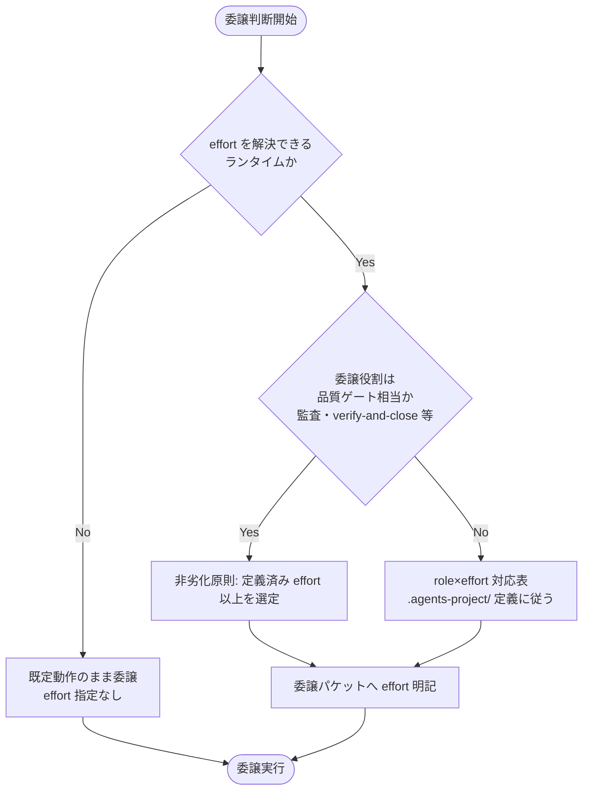

#### 3.1.3 入力・出力

- **入力**: 委譲する役割（scribe／researcher／worker／architect／auditor 等）、ランタイムの effort 解決可否。
- **出力**: 委譲パケットに明記する effort 値（対象外環境では未指定）。

#### 3.1.4 エラーハンドリング

- effort フィールドを解決できないランタイムでは、`EFFORT_POLICY.md` の強制は発火せず、当該ランタイムの既定動作を阻害しない（`MODEL_SELECTION.md §1 適用条件` と同型のフォールバック）。
- 品質ゲート相当の役割に対して具体対応表が `.agents-project/` に無い場合は、非劣化原則（切り下げ禁止）のみを適用し、具体値の欠如を理由に effort 指定を省略しない。

### 3.2 ストーリー2: enforcement hook の拡充（抽象仕様）

#### 3.2.1 概要

`enforcement/README.md`・`enforcement/DESIGN.md` に、(a) 品質ゲートのモデルティア切り下げ検知（系統A）、(b) 進行役の Read/Grep 過大読込抑制（系統C）、(c) `.agents-project/` 優先の hooks overlay 配備（系統D）の 3 拡張仕様を追記する。

#### 3.2.2 処理フロー

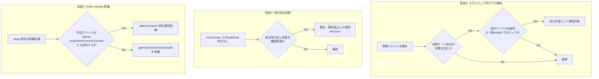

#### 3.2.3 入力・出力

- **入力（系統A）**: 委譲パケットの宣言ティア明記行・実際の model パラメータ。
- **入力（系統C）**: orchestrator セッションの Read/Grep 呼び出し履歴（閾値は `.agents-project/` 定義）。
- **入力（系統D）**: `.agents/enforcement/claude/` と `.agents-project/enforcement/claude/` の両ディレクトリのファイル一覧。
- **出力**: いずれも抽象仕様として `enforcement/README.md`（系統A・C は「強制の 4 層と現状」節への記述追加および「失敗条件 → 実装の所在 → 強制レベル 対応表」への行追加、系統D は「配置するファイル一覧」節への追記）に反映。「ツール別強制力マトリクス」はツール別の分類軸のため変更しない。系統Dの設計思想は `enforcement/DESIGN.md` にも追記。

#### 3.2.4 エラーハンドリング（契約違反の扱い）

- 系統A・C はいずれも**fail-open**（誤検知が疑われる場合は警告に留め、ブロックしない）を既定方針とする。既存 `PreToolUse-model-tier.sh`・`PreToolUse-context-economy.sh`（system-graph 側の先行実装）と同じ設計方針を踏襲する旨を明記し、具体閾値・スクリプト実体は `.agents-project/` に委ねる。
- 系統D は「ファイル単位で `.agents-project/` が `.agents/` を上書きする」という決定的規則であり fail-open の余地はないが、**両ディレクトリのいずれにも当該ファイルが無い場合は展開先ディレクトリのみ作成する**（既存 `enforcement/README.md §配置するファイル一覧` の既定動作を踏襲）。

### 3.3 ストーリー3: issue 起票時コンテキスト効率の具体化

#### 3.3.1 概要

`CONTEXT_EFFICIENCY.md` に、issue-persist 境界相当の安全境界定義、fresh サブの構造化ハンドオフ最小情報、仕様 inventory の索引化＋スライス渡しの運用原則を追記する。

#### 3.3.2 処理フロー

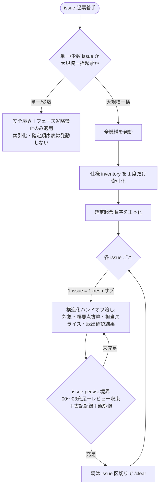

#### 3.3.3 入力・出力

- **入力**: 起票対象 issue 件数、仕様 inventory（既存の spec・docs 群）、親要点（当該 issue 群を束ねる背景）。
- **出力**: fresh サブへ渡す構造化ハンドオフ（対象・親要点の抜粋・担当スライス・既出確認結果の 4 要素）、issue-persist 境界の充足判定基準。

#### 3.3.4 エラーハンドリング

- 単一/少数 issue で全機構（索引化・確定順序表）を強制発動させることは**過剰適用**として明示的に回避する（01 ユースケース3シナリオ2）。
- issue-persist 境界が未充足のまま親が /clear した場合、後続 fresh サブは親要点を再構築できず手戻りとなる。境界充足の 4 条件（00〜03充足・レビュー指摘収束・書記記録・親登録）は必須のチェックリストとして明記する。

### 3.4 ストーリー4: 実装クローズアウトの resilience 強化

#### 3.4.1 概要

`CLOSEOUT.md` に、(a) phase 単位の停止耐性チェックポイント、(b) 委譲ツール発行の malformed 自己検証、(c) 課題の責任完遂原則、を追記する。

#### 3.4.2 処理フロー

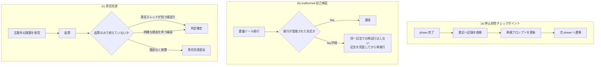

#### 3.4.3 入力・出力

- **入力（a）**: phase 完了イベント（要求・要件・設計・実装計画・実装の各完了）。
- **入力（b）**: 委譲ツール（Task 等）発行結果。
- **入力（c）**: クローズアウト中に発見した主題外の課題。
- **出力**: (a) 書記記録＋再開プロンプトの更新、(b) 受理確認結果、(c) 「責任スレッドが拾う順送り」または「明確な理由を伴う繰延」のいずれかへの判定。

#### 3.4.4 エラーハンドリング

- (a) は既存の「fresh サブ分割」節と**整合**させ重複させない（fresh サブ分割時の収束保証・must-preserve 継承の**上位**にチェックポイント義務を置く形）。
- (b) は「同一記法での再試行をしない」ことを明記し、malformed の繰り返し発行によるループを防ぐ。
- (c) は既存の「取りこぼし0と既出確認（no-drop / dedup）」節と**重複せず補完**する（no-drop は起票の要否、責任完遂は起票後の判定確定の要否）。

### 3.5 ストーリー5: プラットフォーム安全機構ブロック時の AI 対応プレイブック

#### 3.5.1 概要

`.agents/PLATFORM_SAFETY_RESPONSE.md` を新設し、`HEARTBEAT.md` から参照する。

#### 3.5.2 処理フロー

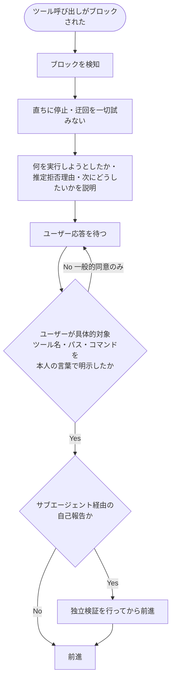

#### 3.5.3 入力・出力

- **入力**: プラットフォーム側安全機構（auto mode classifier 相当）によるブロックイベント。
- **出力**: 停止・説明・ユーザー明示的承認・（該当時）独立検証の 4 ステップの実施記録。

#### 3.5.4 エラーハンドリング

- 当該安全機構が存在しないランタイムでは本ファイルの強制は発火しない（対象外環境のフォールバック。`MODEL_SELECTION.md` と同型）。
- 本パッケージ自身の enforcement（`.agents/enforcement/`）とは**別レイヤー**であることを冒頭に明記し、責務混同（enforcement 違反時の挙動と本プレイブックを同一視すること）を防ぐ。
- `HEARTBEAT.md` には参照項目を 1 件追加するのみとし、詳細規範（4 原則の本文）は複製しない。

### 3.6 ストーリー6（追加要求1）: サブエージェント作業記録の workflow.db リアルタイム強制

#### 3.6.1 概要

`SubagentStop` 相当の hook イベントによるリアルタイム強制を「系統E」として `enforcement/README.md` に抽象仕様を追記する。**実現可否の評価結論は §2.5.2 を正とする**（本節では処理フロー・入出力のみを記載し、評価根拠は重複させない）。

#### 3.6.2 処理フロー

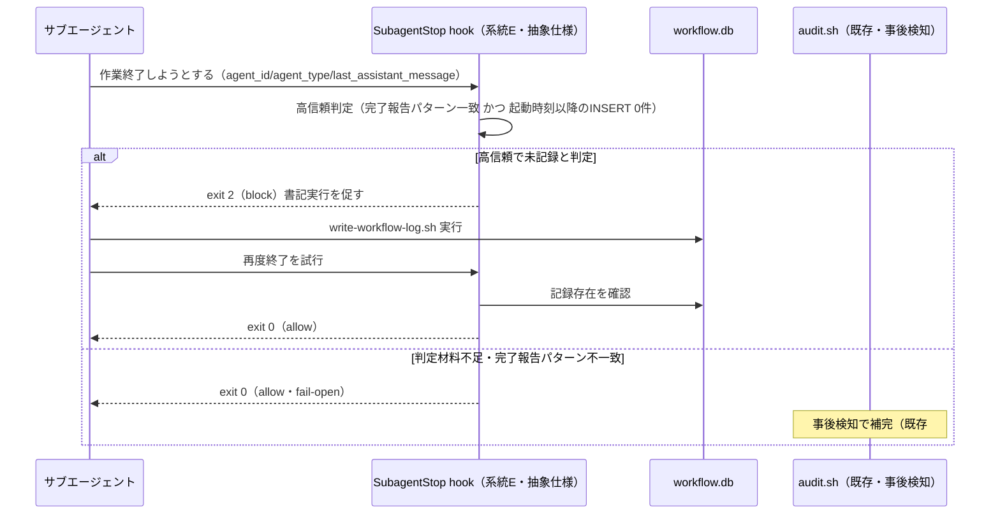

#### 3.6.3 入力・出力

- **入力**: `SubagentStop` の `agent_id`／`agent_type`／`last_assistant_message`、当該サブエージェント起動時刻以降の workflow_log INSERT 有無。
- **出力**: exit code（2=block／0=allow）。抽象仕様として `enforcement/README.md` の「強制の 4 層と現状」節に系統Eの記述を追加し、「失敗条件 → 実装の所在 → 強制レベル 対応表」に「系統E: 未実装（抽象仕様のみ確定・hook実体は本issue範囲外）」の行を追加する。

#### 3.6.4 エラーハンドリング

- 高信頼判定に該当しない（完了報告パターン不一致、または workflow_log 突合に必要な起動時刻情報が取得できない）場合は **exit 0 で許可**し、CI（audit.sh 既存の失敗条件 #5・#9・#18・#19）による事後検知で補完する。**厳密な1:1証明ができないことを前提に fail-open を既定とする**（§2.5.2）。
- `SubagentStop` イベント自体が提供されない・ブロックできないランタイムでは、系統Eの強制は発火せず、既存の CI 事後検知のみで運用する（対象外環境のフォールバック）。

### 3.7 ストーリー7（追加要求2）: fable-like 行動規範の統合

#### 3.7.1 概要

`.agents/AGENT_CONDUCT.md` を新設し、`検証ツール/.agents-project/fable-like行動規範.md` の 8 章・§0 読み替え規則・凝縮版を汎用化して踏襲する。**「その場しのぎの決定を防ぐ機構的強制」の実現可否評価結論は §2.5.3 を正とする**（本節では成果物構成のみを記載し、評価根拠は重複させない）。

#### 3.7.2 処理フロー

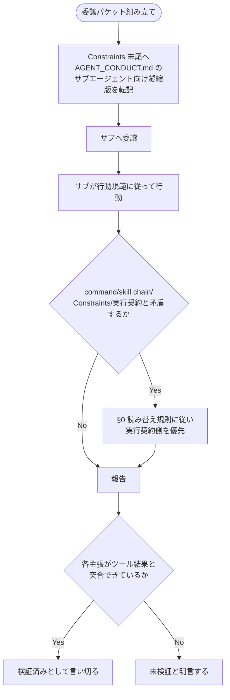

#### 3.7.3 入力・出力

- **入力**: `検証ツール/.agents-project/fable-like行動規範.md` の 8 章構成（結論先行・即行動・進捗の実証・スコープ規律・ターン終了規律・境界・委譲・長時間運用）と §0 読み替え規則。
- **出力**: `AGENT_CONDUCT.md`（8 原則の抽象化本文＋§0 読み替え規則＋サブエージェント向け凝縮版）、`run_command.md` への「委譲時に Constraints 末尾へ凝縮版を転記する」運用の追記。

#### 3.7.4 エラーハンドリング

- 8 原則のうち CORE.md の絶対制約（メインは実作業をしない等）と字面上衝突しうる箇所（「即行動」「ターン終了規律」）は、**§0 読み替え規則を必ず併記**し、「委譲パケットの即時発行」への読み替えを明示する（誤読による orchestrator 直接編集の正当化を防ぐ）。
- 「進捗の実証」（§3 相当）は行動規範として明文化するのみで、**機構的強制は行わない**（§2.5.3 の結論）。誤って「AGENT_CONDUCT.md があるので機構的に強制されている」と解釈されないよう、当該ファイル内に強制レベル（advisory のみ・CI 非強制）を明記する。

### 3.8 ストーリー8（追加要求3）: ディレクトリ名前空間衝突安全化（統合ネスト。§2.6.9）

#### 3.8.1 概要

パッケージ管理ディレクトリ・プロジェクト固有オーバーライド・消費者ランタイム生成物を `.agent-skill-chain/{source,project,runtime}/` へ統合ネストし、`setup.sh`・`src/agents-md.ts` に配備マーカー生成・衝突検知・バックアップ・3 ディレクトリ統合移行判定・安全な uninstall のロジックを追加する。**確定内容（統合ネストの採用・所有区分命名・uninstall 契約・移行パス）は §2.6.9 を正とする**（本節では処理フロー・入出力のみを記載し、判断根拠は重複させない）。

#### 3.8.2 処理フロー（setup／init・upgrade）

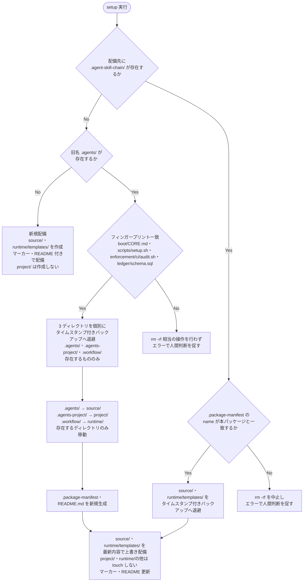

#### 3.8.3 処理フロー（uninstall。§2.6.9.3）

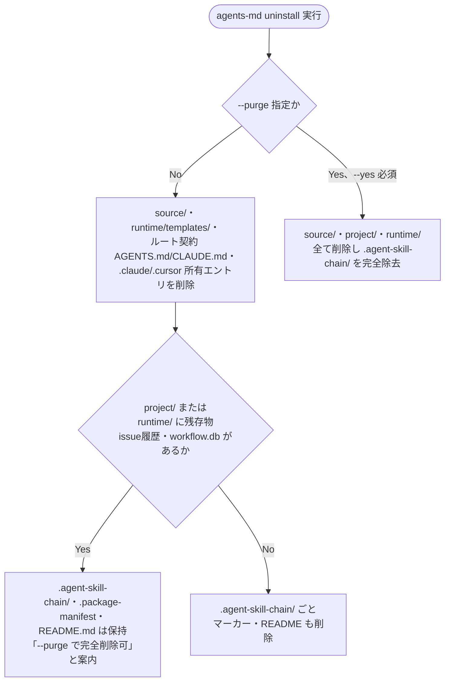

※ 上記 2 図は `.agent-skill-chain/` 本体（`source/`・`project/`・`runtime/`）の分岐を示す。`runtime/templates/` の最新化は §2.6.9.5 の同型バックアップ（`.agent-skill-chain/` 本体と同一の退避関数）を経てから上書きする（`runtime/<issue>/`・`runtime/workflow.db*` は touch しない）。レガシー移行（`MigrateGen`）後は同一実行内で最新内容の配備（`Redeploy`）まで続行する（§2.6.9.5 手順 4。移行時バックアップが同一実行内の退避として機能するため、この経路では `Backup` を再実行しない）。uninstall はいずれの分岐も `--yes` なしでは dry-run（削除対象の一覧表示のみ）に留まる（§2.6.9.3「既存 uninstall 安全策の維持」。図では省略）。

#### 3.8.4 入力・出力

- **入力（init/upgrade）**: 配備先ディレクトリの状態（`.agent-skill-chain/` 存在有無・`.package-manifest` 内容・旧名 `.agents/`／`.agents-project/`／`.workflow/` の存在有無・フィンガープリント対象 4 ファイルの存在有無）。
- **入力（uninstall）**: `--purge`／`--yes` フラグの有無、`.agent-skill-chain/project/`・`.agent-skill-chain/runtime/` の残存物有無。
- **出力**: (a) 新規配備（マーカー・README 付き）、(b) バックアップ後の再配備（`source/`・`runtime/templates/` のみ更新）、(c) 旧 3 ディレクトリからの統合移行（バックアップ→移動→マーカー・README 新規生成→最新内容の配備）、(d) 処理中止（エラーメッセージ・人間判断待ち）、(e) 既定 uninstall（`source/`・`runtime/templates/` のみ削除・残存物次第で `.agent-skill-chain/` 自体を残置）、(f) `--purge` uninstall（完全削除）のいずれか。

#### 3.8.5 エラーハンドリング

- 衝突検知・移行判定はいずれも **fail-closed**（判定できない場合は処理を中止し、既存ファイルを保護する）を既定とする（§2.6.4 の理由。§2.6.9 でも踏襲）。既存の enforcement 抽象仕様（系統A/C/E）の fail-open 方針とは意図的に異なる旨を `setup.sh`・`SETUP.md` の双方に明記し、読み手が両者を混同しないようにする。
- バックアップ書き込み自体が失敗する（ディスク容量不足等）場合は、上書きを行わずエラー終了する（バックアップの成立を上書きの前提条件とする）。3 ディレクトリ統合移行時のバックアップ（§2.6.9.5）も同じ前提条件を適用し、3 つのうち 1 つでもバックアップに失敗すれば移行全体を中止する（部分移行による不整合を避ける）。
- `.agent-skill-chain/project/`（旧 `.agents-project/`）は init/upgrade のいかなる分岐でも touch しない（§2.6.2 の「setup は touch しない」原則を移行後も維持）。`.agent-skill-chain/runtime/`（旧 `.workflow/`）は `templates/` の置換前バックアップ＋最新化のみ行い、`<issue>/`・`workflow.db*` は touch しない。`.summary/` は §2.6.6 の結論どおり本ストーリーのいかなる分岐でも対象外（配備されないため）。
- uninstall の既定モードは `project/`・`runtime/` の残存物（ユーザー資産）を検出できない場合、安全側（保持）に倒す。`--purge` 実行には常に明示的な `--yes` を要求し、確認なしの完全削除を許可しない（既存の `--purge --yes` 契約を踏襲）。

---

## 4. データ設計

### 4.1 データモデル

該当なし。本プロジェクトは新規データモデル・テーブルを追加しない。ストーリー6（§3.6・§2.5.2）で言及する `workflow_log` は既存スキーマ（`.agents/ledger/schema.sql`）を参照するのみであり、スキーマ変更は行わない。

#### リレーション図

該当なし（新規テーブル無し）。

#### テーブル一覧

該当なし。

#### テーブル詳細

該当なし。

#### リレーション

該当なし。

### 4.2 データ構造

新設ファイルの frontmatter は既存規約（`document_id` UUID）に従う。それ以外の新規データ構造は無い。

---

## 5. API 設計

**適用の読み替え（本プロジェクト固有）**: 本プロジェクトの大半（ストーリー1〜7）はドキュメント拡張でありランタイム API を持たないため、「API」を**ドキュメント契約**（他ファイル・hooks・CI が依存してよい必須セクション見出しと、その意味）として読み替える。design-api-contract の目的（外部に公開する入出力の契約を定義する）は、「後続の実装フェーズ・hooks・CI が参照する必須構造を定義する」ことで満たす。**ストーリー8のみ例外**で、`setup.sh`・`src/agents-md.ts` は実際に実行される CLI であるため、§5.1 の該当行は「ドキュメント契約」ではなく実行時の**入出力契約**（配備マーカーのファイル形式・終了コード・標準エラー出力の扱い）として記載する（§5.2 契約4）。

### 5.1 API 一覧（ドキュメント契約一覧）

| ファイル | 契約種別 | 説明 |
| --- | --- | --- |
| `EFFORT_POLICY.md` | 抽象原則ファイル契約 | 必須節: 適用条件／model ティアとの別次元性／品質ゲート非劣化（effort 切り下げ禁止）／対象外フォールバック／汎用固有境界。`run_command.md` が参照する。 |
| `enforcement/README.md`（系統A/C/D/E 追記） | 強制仕様契約 | 既存の「強制の 4 層と現状」節（箇条書き）への**記述追加**と、「失敗条件 → 実装の所在 → 強制レベル 対応表」への**行追加**。対応表の列構成（# / 対象・実装の所在・強制レベル）を変更しない（「ツール別強制力マトリクス」はツール別の分類軸のため系統追加では変更しない）。 |
| `enforcement/DESIGN.md`（系統D 追記） | 設計思想契約 | 既存の「強制の4層」節に整合する形で overlay 配備の優先解決規則を追記。 |
| `CONTEXT_EFFICIENCY.md` | 抽象原則ファイル契約 | 必須節: issue-persist 境界／fresh サブ構造化ハンドオフ／仕様 inventory 索引化。既存 3 行リストとの重複を避ける。 |
| `CLOSEOUT.md` | 抽象原則ファイル契約 | 必須節: 停止耐性チェックポイント／malformed 自己検証／責任完遂。既存節（fresh サブ分割・no-drop/dedup）と重複せず補完する参照を持つ。 |
| `PLATFORM_SAFETY_RESPONSE.md` | 抽象原則ファイル契約 | 必須節: 適用条件・対象外フォールバック／4 原則（回避絶対禁止・即座停止と説明・明示的承認・独立検証）／enforcement との別レイヤー明記。`HEARTBEAT.md` が参照する。 |
| `AGENT_CONDUCT.md` | 抽象原則ファイル契約 | 必須節: §0 読み替え規則／8 原則本文／サブエージェント向け凝縮版／機構的強制の非対象明記（§2.5.3 反映）。`run_command.md` が参照する。 |
| `HEARTBEAT.md`（追記） | チェックリスト契約 | 既存チェックリスト項目形式（番号付き）を維持し、新規 1 項目（PLATFORM_SAFETY_RESPONSE 参照）を追加。 |
| `run_command.md`（追記） | Constraints 契約 | 既存 Constraints 箇条書き形式を維持し、effort 明記義務・行動規範凝縮版転記運用の 2 箇条を追加。 |
| `.agent-skill-chain/.package-manifest`（新設・生成物） | 配備マーカー契約 | 必須キー: `name`（本パッケージ名）・`version`。setup が新規配備・再配備・統合移行完了の都度書き込む。読み手は `setup.sh`・`src/agents-md.ts` 自身（自己参照による衝突検知）。 |
| `.agent-skill-chain/README.md`（新設・生成物） | 警告文契約 | rm -rf 禁止・`agents-md uninstall` 案内の警告文（§2.6.9.4）。setup が新規配備・再配備のたびに最新化する。 |
| `.agents/scripts/setup.sh`（拡張）・`src/agents-md.ts`（拡張） | CLI 実行時契約 | §2.6.9.5 の衝突検知・バックアップ（`runtime/templates/` の置換前バックアップを含む）・3 ディレクトリ統合移行判定、および §2.6.9.3 の安全な uninstall（既定＝`source/`・`runtime/templates/` のみ削除、`--purge`＝完全削除）を実装する。fail-closed（判定不能時は処理中止・非ゼロ終了コード）。 |
| `.agents/SETUP.md`（改訂・改称後 `.agent-skill-chain/source/SETUP.md`） | 保持・上書き契約（改訂） | 既存の「保持・上書き契約」の「パッケージ管理」表の `.agents/` 行を `source/`・`project/`・`runtime/` の構成へ改訂し、配備マーカー・バックアップ・安全な uninstall 契約は説明・注記の拡充、移行パスは新設節として追記する（列構成 対象・種別・説明は変更しない。§2.3）。 |

### 5.2 API 詳細（ドキュメント契約詳細）

#### 契約1: EFFORT_POLICY.md

- **利用者**: `run_command.md`（委譲パケット組み立て時）、進行役（サブへの effort 明記時）。
- **入力（読み手が渡すもの）**: 委譲する役割種別、ランタイムの effort 解決可否。
- **出力（本ファイルが定義するもの）**: 品質ゲート相当役割の非劣化原則、対象外環境のフォールバック規則。
- **契約違反の扱い**: 対象外環境で effort 指定を強制しようとした場合は、本ファイルの適用条件外として**無視**する（エラーにしない。`MODEL_SELECTION.md` と同型）。

#### 契約2: enforcement/README.md（系統E 追記部分）

- **利用者**: 将来の hook 実装者（本 issue 範囲外）、audit.sh（既存の事後検知ロジックとの関係整理のため参照）。
- **入力**: `SubagentStop` の `agent_id`／`agent_type`／`last_assistant_message`。
- **出力**: 高信頼 block 条件、fail-open 条件、既存 audit.sh との補完関係。
- **契約違反の扱い**: 高信頼判定に該当しない場合は必ず allow（exit 0）に倒す。本契約は「抽象仕様の確定」までであり、hook 実体の契約（stdin JSON スキーマ等の実装詳細）は本 issue の範囲外として明記する。

#### 契約3: AGENT_CONDUCT.md

- **利用者**: 進行役（Constraints 末尾への凝縮版転記時）、サブエージェント（行動規範の適用主体）。
- **入力**: 委譲パケット（command / skill chain / Constraints / 実行契約）。
- **出力**: §0 読み替え規則に基づく優先順位判定、8 原則の適用。
- **契約違反の扱い**: 実行契約（CORE 等）と矛盾する場合は§0 に従い実行契約側が常に優先される。機構的強制は行わない（§2.5.3）ため、本ファイル単体は advisory 契約であり、CI による契約違反検知は行わない（新設する失敗条件 #30 は「未実装・人手監査」区分であることを明記）。

#### 契約4: `.agent-skill-chain/.package-manifest` ＋ `setup.sh`／`src/agents-md.ts` の衝突検知・バックアップ・統合移行・uninstall（ストーリー8・唯一の実行時契約。§2.6.9）

- **利用者**: `setup.sh`（bash 実装）・`src/agents-md.ts`（Node/TypeScript 実装）自身。両者は同一の判定規則を独立に実装する（既存の `list_owned_skill_names` ミラー方式と同型。§2.1.3）。
- **入力（init/upgrade）**: 配備先の `.agent-skill-chain/` 存在有無、`.package-manifest` の `name`/`version`、旧名 `.agents/`・`.agents-project/`・`.workflow/` の存在有無、フィンガープリント対象 4 ファイル（§2.6.9.5）の存在有無、`runtime/templates/` の存在有無（置換前バックアップの要否判定）。
- **入力（uninstall）**: `--purge`／`--yes` フラグの有無、`.agent-skill-chain/project/`・`.agent-skill-chain/runtime/` の残存物有無（§2.6.9.3）。
- **出力**: 新規配備／バックアップ後再配備（`source/`・`runtime/templates/` のみ）／3 ディレクトリ統合移行／処理中止／既定 uninstall（`source/`・`runtime/templates/` のみ削除）／`--purge` uninstall（完全削除）のいずれか（§3.8.2・§3.8.3 のフロー）と、対応する終了コード（正常系 0・fail-closed 中止時は非ゼロ）。
- **契約違反の扱い**: 本パッケージ由来と確認できない、またはフィンガープリントが不一致の場合は**必ず処理を中止**する（fail-closed。§2.6.4・§2.6.9.5）。他の契約（契約1〜3・系統A/C/E）が fail-open を既定とするのとは対称的に異なる方針であることを、当該コード・`SETUP.md` の双方に明記する。バックアップ書き込み自体の失敗も中止扱いとする（3 ディレクトリ統合移行では 1 つでも失敗すれば移行全体を中止）。`rm -rf .agent-skill-chain/` は非公式操作であり、`agents-md uninstall` が唯一の公式契約であることを `SETUP.md`・`.agent-skill-chain/README.md` の双方に明記する（§2.6.9.3・§2.6.9.4）。

---

## 6. テスト戦略

テスト戦略の**観点の定義**は [RULES.md のテスト戦略必須要件](../../../../.agents/RULES.md#テスト戦略必須要件) を、**BDD 形式の定義**は [TEST_BDD_FORMAT.md](../../../../.agents/TEST_BDD_FORMAT.md) を参照すること。本ドキュメントでは**対象ごとのテスト割当**のみ記載する。

### 6.1 対象ごとのテスト割り当て

| 対象 | 単体 | 結合/API | E2E | クリティカル観点 | バリデーション観点 | 未達理由/補足 |
| --- | --- | --- | --- | --- | --- | --- |
| `EFFORT_POLICY.md` | ○ | ○ | × | 品質ゲート非劣化原則が明記されているか | 対象外環境フォールバックの明記有無 | E2E: ランタイムを跨いだ実行確認は本 issue のスコープ外（ドキュメントのみ） |
| `enforcement/README.md`（系統A/C/D） | ○ | ○ | × | fail-open 方針・既存契約との非矛盾 | 表の列構成が既存と一致しているか | E2E: hook 実体が無いため該当なし |
| `enforcement/DESIGN.md`（系統D） | ○ | ○ | × | overlay 優先解決規則の一意性 | 既存「配置するファイル一覧」との整合 | 同上 |
| `CONTEXT_EFFICIENCY.md` | ○ | ○ | × | issue-persist 境界の 4 条件網羅 | 既存 3 行リストとの非重複 | E2E: 該当なし（運用原則） |
| `CLOSEOUT.md` | ○ | ○ | × | 責任完遂の 2 分岐（順送り／繰延）網羅 | 既存節との重複回避 | 同上 |
| `PLATFORM_SAFETY_RESPONSE.md` | ○ | ○ | × | 4 原則の網羅・enforcement との別レイヤー明記 | 対象外環境フォールバックの明記有無 | 同上 |
| `enforcement/README.md`（系統E） | ○ | ○ | × | fail-open ヒューリスティックの条件網羅・§2.5.2 との整合 | 「未実装（抽象仕様のみ）」の明記有無 | E2E: hook 実体が無いため該当なし |
| `AGENT_CONDUCT.md` | ○ | ○ | × | §0 読み替え規則の網羅・機構的強制の非対象明記（§2.5.3） | CORE.md との字面衝突チェック | 同上 |
| `HEARTBEAT.md`（追記） | ○ | ○ | × | 既存項目番号を壊さず 1 項目追加できているか | PLATFORM_SAFETY_RESPONSE への参照リンク解決 | 同上 |
| `run_command.md`（追記） | ○ | ○ | × | effort 明記義務・凝縮版転記運用の記載有無 | 既存 Constraints 箇条書き形式との整合 | 同上 |
| `.agents/scripts/setup.sh`（拡張・衝突検知・バックアップ・統合移行・uninstall） | ○ | ○ | **○** | 衝突検知の fail-closed 網羅（マーカー無し・name 不一致・フィンガープリント不一致の 3 分岐）、バックアップの実施順序（`runtime/templates/` の置換前バックアップを含む）、3 ディレクトリ統合移行の網羅、uninstall の既定／`--purge` の削除範囲網羅 | マーカー必須キー（name/version）の書き込み確認、README 警告文の設置確認 | E2E: 該当あり（本ストーリーのみ実行コードを持つため）。既存の `test/e2e-install-uninstall.sh` と同型の隔離環境（`mktemp -d`）で新規配備・再配備（templates バックアップ含む）・3 ディレクトリ統合移行・uninstall（既定／`--purge`）の各パターンを実行検証する。 |
| `src/agents-md.ts`（拡張・CLI 側パス参照更新・uninstall 拡張） | ○ | ○ | **○** | `setup.sh` と同一の衝突検知・フィンガープリント判定結果を返すこと（実装二重化のドリフト検知）、`runUninstall` が `source/`・`runtime/templates/` のみ既定削除し `project/`・`runtime/` 残存物を保持すること | `DEPLOYED_ARTIFACTS`・nonce パス等の参照パスが `.agent-skill-chain/source/` に更新されていること | E2E: 該当あり。上記 `setup.sh` と同一シナリオを CLI 経由（`node bin/agents-md.js`）でも実行検証する。 |
| `.agent-skill-chain/README.md`（新設・警告文） | ○ | ○ | **○** | rm -rf 禁止・`agents-md uninstall` 案内の警告文が明記されているか | 既定生成先（ルート直下）への配置確認 | E2E: 新規配備・再配備の都度、警告文が生成・最新化されることを `test/e2e-install-uninstall.sh` で確認する。 |
| `.agents/SETUP.md`（改訂・保持・上書き契約） | ○ | ○ | × | `source/`・`project/`・`runtime/` 構成への改訂・配備マーカー／バックアップ／統合移行パス／安全な uninstall 契約記載の網羅性（§2.3。列構成は変更しない） | 既存の他エントリ（`.claude/hooks` 等）との表フォーマット整合 | E2E: 契約表自体はドキュメントのため該当なし（実効性は上記 setup.sh/agents-md.ts の E2E で検証） |

- 「単体」= 各ファイル単体で必須節・記載内容が満たされているかの確認（レビュー・監査）。ストーリー8 の実行コードのみ、加えて既存のシェル/TypeScript テスト（`test/` 配下）の単体観点を適用する。
- 「結合/API」= §5 のドキュメント契約（相互参照リンク・表構成）または実行時契約（§5.2 契約4）が解決すること。
- 「E2E」= 実行時の振る舞い確認。ストーリー1〜7 は hook 実体・ランタイム機構を持たないため該当なし（将来 hook を実装する際に別途定義）。**ストーリー8 は例外的に該当あり**（setup.sh・CLI という実行コードそのものを変更するため）。既存の `test/e2e-install-uninstall.sh`（R1 再インストール保持・R2 upgrade 保持・R3 uninstall 保持のシナリオ構成）に、本ストーリー用の新規シナリオ（衝突検知・バックアップ・3 ディレクトリ統合移行・安全な uninstall・README 警告）を追加する形で実装する（実装計画タスク8・§2.8.3 参照）。

### 6.2 監査・レビューでの確認（証跡）

証跡の確認観点は RULES §テスト戦略必須要件および workflow/PHASES.md の監査観点を参照。本設計書 §6.1 の割当表と `03_実装計画.md` のタスク別テスト観点・BDD が揃っていることを確認する。

---

## 7. UI 設計

### 7.1 画面遷移図

該当なし。本プロジェクトはドキュメント拡張のみであり、画面・UI コンポーネントを持たない。

### 7.2 画面設計

該当なし。

---

## 8. セキュリティ設計

### 8.1 認証・認可

該当なし。ただし、系統A・C・D・E（§3.2・§3.6）の抽象仕様は、既存の `PreToolUse.sh` の AGENT_ROLE 出所制御（C-4b・nonce 分離）を弱めない設計とする。特に系統D（hooks overlay 配備）は「ファイル単位の優先解決」のみを行い、ロール判定・nonce 検証ロジック自体には介入しない。

### 8.2 データ保護

- 00 §3.2 の方針（nonce・秘密情報等の機微な仕組みを安易に複製しない）を踏襲する。系統Eの抽象仕様（§3.6・§2.5.2）は、既存の `AGENTS_SCRIBE_NONCE` / `.scribe-nonce` の仕組みを再利用する前提とし、新規の秘密情報保管機構を導入しない。
- `AGENT_CONDUCT.md`・`PLATFORM_SAFETY_RESPONSE.md` はいずれもプロンプト・行動規範のみであり、機微データを扱わない。

---

## 9. 非機能要件への対応

### 9.1 パフォーマンス

00 §3.1 の方針（既存原則への参照で簡潔に保つ）を踏襲する。各拡張ファイルの追記は該当節の追加に限定し、既存内容の要約的な再掲は行わない（相互参照でつなぐ）。

### 9.2 可用性

該当なし（ドキュメント中心の変更であり実行時可用性への影響は無い。01 §3.4 可用性要件と同じ）。

---

## 10. 参考資料

### プロジェクトドキュメント

- [`01_要件定義.md`](./01_要件定義.md) - 要件定義

### その他の参考資料

- [`00_要求定義.md`](./00_要求定義.md) §8 参考資料 に列挙された system-graph・検証ツール側の参照資料一式（01 で読了済み・再掲はしない）。
- [`.agents/enforcement/claude/PreToolUse.sh`](../../../../.agents/enforcement/claude/PreToolUse.sh) — 系統A/C/D/E の抽象仕様が既存契約と矛盾しないことを確認する際の参照実体。
- [`.agents/workflow/PHASES.md §レビュー成果物の配置ルール・§完了 issue の close 移動`](../../../../.agents/workflow/PHASES.md) — CLOSEOUT 拡充（§3.4）と重複させないための参照。

---

## 11. 前のステップ

この設計書は、以下のドキュメントを基に作成されています：

- **前**: [`01_要件定義.md`](./01_要件定義.md) - 要件定義フェーズ

---

## 12. 次のステップ

この設計書の承認後、以下のドキュメントを作成します：

- **次**: [`03_実装計画.md`](./03_実装計画.md) - 実装計画フェーズ

**サブ issue 分割の要否（判断・結論）**: 本プロジェクトは 8 系統に及ぶ。ストーリー1〜7 は「既存 `.agents/` 正本ファイルへの節追加」または「小さな新設ファイル 1 個」という**均質かつ独立した**ドキュメント編集であり、実コードの実装・相互依存する実行時結合を持たない。**ストーリー8 のみ実行コード（`setup.sh`・`src/agents-md.ts`）の変更を伴う**が、変更範囲は「配備マーカー・衝突検知・バックアップ・統合移行判定・安全な uninstall」という単一の関心事（名前空間衝突安全化）に閉じており、他ストーリーと相互依存しない。system-graph・検証ツール側の一次調査は 01 で完了済みで本設計フェーズの再調査は不要だった。したがって、**本設計が扱う 8 系統の分割目的でのサブ issue 分割は行わない**（分割目的の `90_issues.md` は作成しない。なお PR 指摘対応等、本判断と別目的のサブ issue が本 issue 配下に起票される場合はこの判断の対象外であり、その場合の `90_issues.md` 作成要否は run_command §Constraints の一般規則に従う）。`03_実装計画.md` ではタスクをストーリー単位（8 タスク）に分解し、影響範囲が特に大きいタスク8（ストーリー8）は §2.6.9 のネスト統合案採用（プロジェクトオーナーの最終決定）に伴いさらに 9 個のサブタスクへ分解することで、分割相当の管理粒度を単一 issue 内の実装計画で確保する（サブ issue という別成果物単位への分割は行わないが、実装計画内のタスク粒度を細分化する）。
