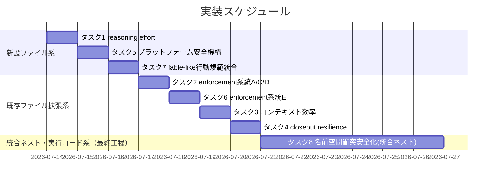
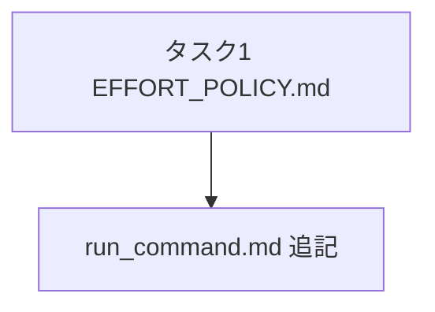
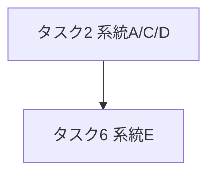
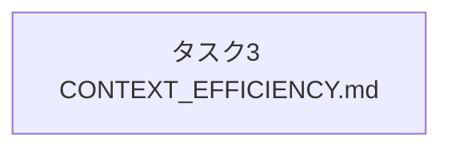
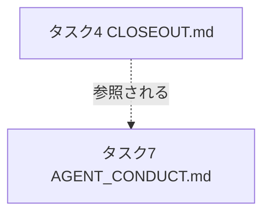
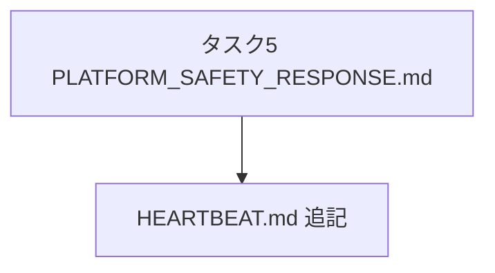
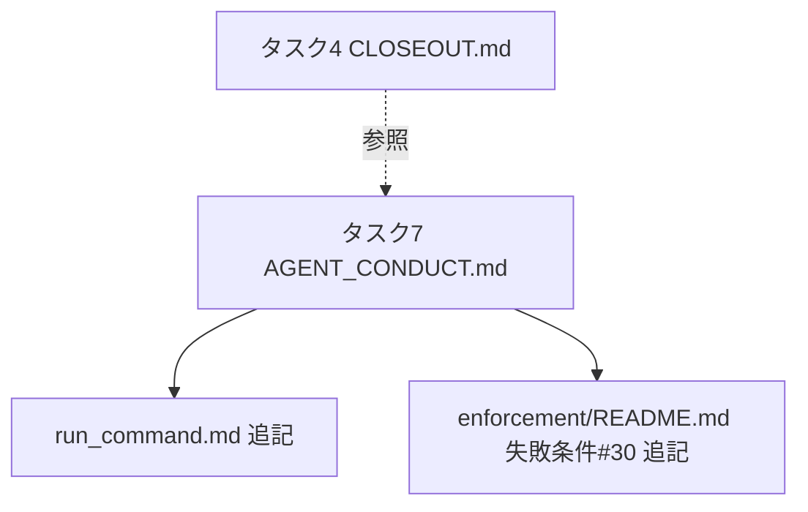
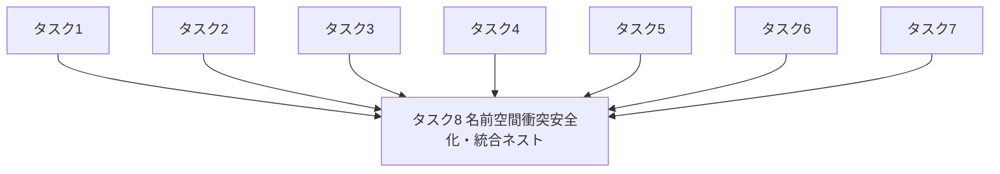

# 実装計画書: agentsOS 汎用化・ポリシー統合（system-graph 由来の発展ポリシー取り込み）

**プロジェクト名**: agentsOS 汎用化・ポリシー統合
**作成日**: 2026 年 07 月 11 日
**最終更新**: 2026 年 07 月 11 日

> **重要**: **このドキュメントは常に更新**: 実装計画の変更、進捗状況の更新、バグの記録などがあった場合は、即座にこのドキュメントを更新してください。ドキュメントは「生きているドキュメント」として扱い、実装内容と常に同期させます。
> **必須項目**: 「必須」と明記した欄は空欄・抽象語のみで提出しないこと。テスト観点・BDD 仕様は具体ケースを 1 件以上記載すること。
>
> **用語**: [.agents/CONCEPTS.md §用語規約](../../../../.agents/CONCEPTS.md#用語規約) を参照。

---

## 1. 実装概要

### 1.1 実装方針（必須）

02_設計 §2.1.1 の 14 コンポーネント（対象ファイル 13 件＋ディレクトリ統合ネスト 1 件）を、01_要件定義の 8 ストーリーに対応する 8 タスクへ分解する。タスク1〜7 は既存 `.agents/` 正本ファイルへの節追加、または小さな新設ファイル 1 個の作成であり、相互依存が薄いため独立して実装・レビュー可能である（02 §「サブ issue 分割の要否」で分割不要と判断済み）。**タスク8（ストーリー8: ディレクトリ名前空間衝突安全化・統合ネスト）のみ実行コード（`setup.sh`・`src/agents-md.ts`）の変更とディレクトリの物理再構成を伴う**ため、後述のとおり他タスクとは異なる位置づけ（最終工程として全タスク完了後に実施）とする。実装は本 issue のスコープ（00 §5 除外要件）に従い、タスク1〜7 は**hook スクリプトの実コード（系統A/C/D/E）・機構的強制の実装は行わず、ドキュメント（抽象仕様）の追記・新設のみ**を行う。タスク8 は例外的に実行コードの変更を伴うが、対象は「配備マーカー・衝突検知・バックアップ・3 ディレクトリ統合移行判定・安全な uninstall コマンド」に限定し、hook スクリプト実体（系統A/C/D/E）や機構的強制の実装には踏み込まない（00 §5 の除外を維持）。**プロジェクトオーナーの最終決定（02_設計 §2.6.9）によりネスト統合案が採用されたため、対象は `.agents/` 単体の改称ではなく `.agents/`・`.agents-project/`・`.workflow/` 3 ディレクトリの統合ネストへ拡大している。**

### 1.2 実装順序（必須: 1 件以上）

タスク1〜7 は相互依存が薄いため並行実施可能だが、参照関係（02 §2.1.3）に従い、参照先となる新設ファイル（タスク1・5・7）を先行させ、それを参照する `run_command.md`・`HEARTBEAT.md` の追記（タスク1・5・7 内に含む）を同一タスク内で完結させる。タスク2・6 は同一ファイル（`enforcement/README.md`）を扱うため連番で実施する。

**タスク8 は必ず最後に実施する**: タスク8 は `.agents/`・`.agents-project/`・`.workflow/` の 3 ディレクトリを `.agent-skill-chain/{source,project,runtime}/` へ統合ネストする（02_設計 §2.6.9・プロジェクトオーナーの最終決定）。タスク1〜7 が生成・追記する新設ファイル（`EFFORT_POLICY.md`・`PLATFORM_SAFETY_RESPONSE.md`・`AGENT_CONDUCT.md` 等）はいずれも統合ネスト前の `.agents/` 配下に作成されるため、タスク8（統合ネスト・参照更新）をタスク1〜7 の**すべての完了後**に実施すれば、ディレクトリ再構成 1 回でタスク1〜7 の成果物も自動的に新パスへ移動し、二重の参照更新（旧パス→中間パス→新パスのような手戻り）を避けられる。タスク8 を先行させると、タスク1〜7 が「新パス（`.agent-skill-chain/source/`）を前提に書くか、02/03 記載の `.agents/` 表記のまま書くか」で混乱するため、この順序は必須（推奨ではない）とする。



---

## 2. タスク分解

**用語**: [.agents/CONCEPTS.md §用語規約](../../../../.agents/CONCEPTS.md#用語規約) を参照。

**必須**: 各タスクには **「テスト観点」（2.x.3）** と **「単体テスト仕様（BDD）」（2.x.4）** を必ず記載する。観点の定義は **02_設計 §6** および **RULES のテスト戦略・[TEST_BDD_FORMAT.md](../../../../.agents/TEST_BDD_FORMAT.md)** を参照し、本ドキュメントでは**タスクごとの具体ケース**のみ記載する。各タスクの BDD は [01_要件定義.md §2.2](./01_要件定義.md) の対応するユースケースと 1 対 1 で対応させる。

### 2.1 タスク 1: reasoning effort（推論深度）の役割別制御（ストーリー1・ユースケース1 対応）

#### 2.1.1 概要（必須）

`.agents/EFFORT_POLICY.md` を新設し、model ティアと独立した effort 制御の抽象原則（適用条件・非劣化原則・対象外フォールバック・汎用固有境界）を定義する。あわせて `skills/agent/run_command.md §Constraints` に effort 明記義務の 1 箇条を追記する。

#### 2.1.2 実装内容（必須: 1 件以上）

- `.agents/EFFORT_POLICY.md` を新設し、02_設計 §5.2 契約1 の入出力契約に従い次の節を記載する: 適用条件／ティア明記義務との別次元性／品質ゲート非劣化原則／対象外環境のフォールバック／汎用固有境界。`MODEL_SELECTION.md` を frontmatter の `document_id` 付きで倣う。
- `skills/agent/run_command.md §Constraints` に「委譲時の effort 明記（`EFFORT_POLICY.md` 参照。品質ゲート相当役割は非劣化）」の 1 箇条を、既存の「委譲時のティア明記」箇条の直後に追記する。

#### 2.1.3 テスト観点（必須）

**参照**: 観点の定義は [02_設計 §6](./02_設計.md) および [RULES のテスト戦略・TEST_BDD_FORMAT](../../../../.agents/RULES.md#テスト戦略必須要件) を参照。以下には**本タスクの具体ケース**のみ記載する。

##### 単体（本タスクの具体ケース・必須 1 件以上）

- `EFFORT_POLICY.md` に「適用条件」「対象外フォールバック」「model ティアとの独立性」「品質ゲート非劣化」の 4 点がすべて記載されていること（01 ストーリー1 受け入れ基準と 1 対 1 対応）。
- `EFFORT_POLICY.md` に role×effort の具体対応表・モデル名・閾値が**記載されていない**こと（コアへの具体値混入禁止の検証）。

##### 結合/API（本タスクの具体ケース・該当時は必須 1 件以上）

- `run_command.md` から `EFFORT_POLICY.md` への相互参照リンクが解決すること（02 §5.1 契約1）。
- `EFFORT_POLICY.md` から `MODEL_SELECTION.md`・`REVIEW_DUAL_LENS.md §5` への参照リンクが解決すること。

##### E2E/受け入れ（本タスクの具体ケース・未達時は理由記載）

- 該当なし。理由: ランタイムの effort フィールド解決自体は本パッケージの管理外（Claude Code 側の機構）であり、E2E で実行時検証する対象を持たない（02 §6.1 と同一理由）。

##### バリデーション（該当する場合の具体ケース）

- 新設ファイルの frontmatter に `document_id`（UUID 8-4-4-4-12 形式）が付与されていること。

#### 2.1.4 単体テスト仕様（BDD）（必須）

**BDD 形式のテストケース（高レベル仕様）**:

```gherkin
Feature: reasoning effort の役割別静的割当（抽象原則）
  Scenario: effort を解決できるランタイムで委譲する
    Given 進行役が effort フィールドを解決できるランタイム上でサブへ委譲しようとしている
    When 委譲する役割が品質ゲート相当（監査・verify-and-close 等）である
    Then 進行役は当該役割の effort を非劣化（切り下げ禁止）の原則に従って選定する

  Scenario: effort の概念が存在しないランタイムで委譲する
    Given 進行役が effort フィールドを解決できないランタイム上で動作している
    When サブへ委譲しようとする
    Then 進行役は effort 指定を行わず、当該ランタイムの既定動作のまま委譲する
```

**レビューチェック例（インラインコメントで Given/When/Then を明記）**

ドキュメント成果物のため実行コードは持たない。レビュー（04_review 相当）で以下をチェックリスト化して確認する。

```markdown
- [ ] // Given: レビュアーが EFFORT_POLICY.md を開いている
      // When: 「適用条件」節を確認する
      // Then: effort を解決できるランタイムでのみ適用される旨が明記されている
- [ ] // Given: レビュアーが EFFORT_POLICY.md を開いている
      // When: 「対象外環境」節を確認する
      // Then: effort が存在しないランタイムでは既定動作を阻害しない旨が明記されている
```

#### 2.1.5 依存関係

- なし（先行タスクへの依存無し）。



#### 2.1.6 見積もり

- **工数**: 0.5〜1 日
- **優先度**: 中

### 2.2 タスク 2: enforcement hook の拡充・系統A/C/D（抽象仕様）（ストーリー2・ユースケース2 対応）

#### 2.2.1 概要（必須）

`enforcement/README.md`・`enforcement/DESIGN.md` に、系統A（モデルティア切り下げ検知）・系統C（Read/Grep 過大読込抑制）・系統D（`.agents-project/` 優先 hooks overlay 配備）の抽象仕様を追記する。

#### 2.2.2 実装内容（必須: 1 件以上）

- `enforcement/README.md` の「強制の 4 層と現状」節（箇条書き）に、系統A・系統Cの対象・fail-open 方針・false positive 回避方針（02 §3.2.4）を追記し、「失敗条件 → 実装の所在 → 強制レベル 対応表」に対応する行を追加する（「ツール別強制力マトリクス」はツール別の分類軸のため変更しない。02 §3.2.3）。
- `enforcement/README.md §配置するファイル一覧` に、系統D（`.agents-project/enforcement/claude/` が同名ファイルを優先する規則）を追記する。
- `enforcement/DESIGN.md` に、系統D の設計思想（ファイル単位で固有が汎用を上書きする理由・既存 overlay 配備思想との整合）を追記する。
- 追記内容は「抽象仕様であり hook スクリプトの実装コードは対象外」であることを明記する（00 §5・02 §2.1.2 と同一の除外を各追記箇所で再掲）。

#### 2.2.3 テスト観点（必須）

##### 単体

- 系統A・C・D それぞれについて、対象・fail-open 方針・false positive 回避方針の 3 点が記載されていること（01 ストーリー2 受け入れ基準）。
- 追記内容が既存 `PreToolUse.sh` の stdin JSON 契約・exit code 規約と矛盾する記述を含まないこと（既存契約の再読合わせで確認）。

##### 結合/API

- `enforcement/DESIGN.md`（系統D）から `enforcement/README.md §配置するファイル一覧` への参照リンクが解決すること。

##### E2E/受け入れ

- 該当なし。理由: hook 実装コードを含まないため実行時検証対象が無い（02 §6.1）。

##### バリデーション

- 追記が「抽象仕様であり本 issue のスコープは実装を含まない」旨を明記していること。

#### 2.2.4 単体テスト仕様（BDD）（必須）

```gherkin
Feature: enforcement 拡張（品質ゲートのモデルティア切り下げ検知）
  Scenario: 品質ゲート語を含む委譲でティアの自己矛盾を検知する
    Given 委譲パケットが品質ゲート相当の作業（監査・verify-and-close 等）を含む
    And 委譲パケット中の宣言ティア明記行が top 相当である
    When 実際に指定された model パラメータが下位ティアである
    Then enforcement 拡張仕様は当該委譲を自己矛盾として検知対象に含める

Feature: enforcement 拡張（進行役の Read/Grep 過大読込抑制）
  Scenario: 進行役の読み取り呼び出しが閾値を超過する
    Given 進行役（orchestrator）セッションの Read/Grep 呼び出し履歴が採用先（.agents-project/）定義の閾値を超過している
    When 進行役がさらに Read/Grep を呼び出す
    Then enforcement 拡張仕様は fail-open 方針に従い、ブロックせず警告と要約読込への誘導に留める

Feature: enforcement 拡張（hooks overlay 配備）
  Scenario: 汎用 hook と固有 hook が同名で存在する
    Given .agents/enforcement/claude/ と .agents-project/enforcement/claude/ の双方に同名の hook ファイルが存在する
    When setup 相当の配備処理が .claude/hooks/ へ展開する
    Then .agents-project/ 側のファイルが優先して配備される
```

**レビューチェック例**

```markdown
- [ ] // Given: レビュアーが enforcement/README.md の追記箇所を開いている
      // When: 系統A・C の記載を確認する
      // Then: fail-open 方針（誤検知が疑われる場合は警告に留める）が明記されている
```

#### 2.2.5 依存関係

- タスク6（系統E）と同一ファイル（`enforcement/README.md`）を扱うため、競合を避けるためタスク2 → タスク6 の順で実施する。



#### 2.2.6 見積もり

- **工数**: 1 日
- **優先度**: 中

### 2.3 タスク 3: issue 起票時コンテキスト効率の具体化（ストーリー3・ユースケース3 対応）

#### 2.3.1 概要（必須）

`CONTEXT_EFFICIENCY.md` に issue-persist 境界・fresh サブ構造化ハンドオフ・仕様 inventory 索引化の運用原則を追記する。

#### 2.3.2 実装内容（必須: 1 件以上）

- `CONTEXT_EFFICIENCY.md` に「issue-persist 境界」節を新設し、境界充足の 4 条件（00〜03 充足・レビュー指摘収束・書記記録・親登録）を記載する。
- 同ファイルに「fresh サブ構造化ハンドオフ」節を新設し、渡す最小情報（対象・親要点の抜粋・担当スライス・既出確認結果）を記載する。
- 同ファイルに「仕様 inventory の索引化＋スライス渡し」節を新設し、既存 3 行リストの「仕様 inventory は一度だけ索引化」を具体化する形で記載する。
- 単一/少数 issue では軽量運用（境界とフェーズ省略禁止のみ適用）、大規模一括起票では全機構発動という**適用のスケーリング**を明記する。

#### 2.3.3 テスト観点（必須）

##### 単体

- issue-persist 境界の 4 条件がすべて列挙されていること。
- 適用のスケーリング（単一/少数 vs 大規模一括）が既存の思想と矛盾しないこと。

##### 結合/API

- `CONTEXT_EFFICIENCY.md` から `CLAUDE.md §issue 作成タスク受領時の標準フロー`・`REVIEW_DUAL_LENS.md §6` への参照リンクが解決すること。

##### E2E/受け入れ

- 該当なし。理由: 運用原則であり実行時コンポーネントを持たない。

##### バリデーション

- 具体パス名（`.agents-project/自己拡張ワークフロー.md` 等）を埋め込んでいないこと（01 ストーリー3 受け入れ基準の抽象原則要件）。

#### 2.3.4 単体テスト仕様（BDD）（必須）

```gherkin
Feature: issue 起票時コンテキスト効率（fresh サブパイプライン）
  Scenario: 多数の issue を一括起票する
    Given 進行役が多数（数十件規模）の issue を一括起票する作業に着手している
    When 各 issue の起票を委譲する
    Then 進行役は 1 issue = 1 fresh サブを原則とし、前 issue の会話往復を引き継がずに構造化ハンドオフのみを渡す

Feature: issue 起票時コンテキスト効率（適用のスケーリング）
  Scenario: 単一の軽量 issue を起票する
    Given 起票対象が単一または少数の軽量 issue である
    When 進行役が起票作業を委譲する
    Then 進行役は安全境界と最小限のフェーズ省略禁止原則のみを適用し、索引化・確定起票順序表等の全機構は発動しない
```

**レビューチェック例**

```markdown
- [ ] // Given: レビュアーが CONTEXT_EFFICIENCY.md の追記箇所を開いている
      // When: 「issue-persist 境界」節を確認する
      // Then: 00〜03充足・レビュー指摘収束・書記記録・親登録の 4 条件が明記されている
```

#### 2.3.5 依存関係

- なし（独立タスク）。



#### 2.3.6 見積もり

- **工数**: 0.5〜1 日
- **優先度**: 中

### 2.4 タスク 4: 実装クローズアウトの resilience 強化（ストーリー4・ユースケース4 対応）

#### 2.4.1 概要（必須）

`CLOSEOUT.md` に phase 単位の停止耐性チェックポイント・委譲ツール発行の malformed 自己検証・課題の責任完遂原則を追記する。

#### 2.4.2 実装内容（必須: 1 件以上）

- 「停止耐性チェックポイント」節を新設し、phase 完了ごとの書記記録＋再開プロンプト更新義務を、既存「fresh サブ分割」節と整合させて記載する。
- 「委譲ツール発行の malformed 自己検証」節を新設し、受理確認手順・malformed 検知時のフォールバック（同一記法での再試行禁止）を記載する。
- 「課題の責任完遂」節を新設し、起票後の判定確定（責任スレッドが拾う順送り／明確な理由を伴う繰延のいずれかへ必ず落とす）を、既存「取りこぼし0と既出確認」節と重複させず補完する形で記載する。

#### 2.4.3 テスト観点（必須）

##### 単体

- 3 節（チェックポイント／malformed 自己検証／責任完遂）がそれぞれ独立した節として存在すること。
- 「責任完遂」節が既存「no-drop / dedup」節の内容を再掲していない（重複禁止）こと。

##### 結合/API

- `CLOSEOUT.md` から `REVIEW_DUAL_LENS.md §6`・`skills/agent/run_command.md §Constraints` への参照リンクが解決すること。

##### E2E/受け入れ

- 該当なし。理由: 運用原則であり実行時コンポーネントを持たない。

##### バリデーション

- 繰延理由のカテゴリ表・再開プロンプト書式等の実値を `.agents-project/` へ委譲する旨が明記されていること（01 ストーリー4 受け入れ基準）。

#### 2.4.4 単体テスト仕様（BDD）（必須）

```gherkin
Feature: 実装クローズアウトの停止耐性チェックポイント
  Scenario: 設計フェーズが完了する
    Given 進行役が設計（00〜03 相当）フェーズを完了した
    When 次フェーズへ遷移する前に自己確認を行う
    Then 進行役は書記への記録と再開プロンプトの更新を行ってから次フェーズへ進む

Feature: 実装クローズアウトにおける課題の責任完遂
  Scenario: クローズアウト中に主題外の課題を発見する
    Given 進行役が実装完了後のレビューで現 issue の主題から外れる課題を発見した
    When 当該課題を起票する
    Then 進行役は起票のみで終えず、責任スレッドが拾う順送り、または明確な理由を伴う繰延のいずれかに判定を落とす
```

**レビューチェック例**

```markdown
- [ ] // Given: レビュアーが CLOSEOUT.md の追記箇所を開いている
      // When: 「委譲ツール発行の malformed 自己検証」節を確認する
      // Then: 同一記法での再試行をしない旨が明記されている
```

#### 2.4.5 依存関係

- なし（独立タスク）。ただし 02_設計 §2.5.3（機構的強制の構造的代替）で参照されるため、タスク7（AGENT_CONDUCT.md）より前に完了しているとタスク7 のレビューで参照しやすい（厳密な依存ではない）。



#### 2.4.6 見積もり

- **工数**: 0.5〜1 日
- **優先度**: 中

### 2.5 タスク 5: プラットフォーム安全機構ブロック時の AI 対応プレイブック（ストーリー5・ユースケース5 対応）

#### 2.5.1 概要（必須）

`.agents/PLATFORM_SAFETY_RESPONSE.md` を新設し、`HEARTBEAT.md` に参照項目を追加する。

#### 2.5.2 実装内容（必須: 1 件以上）

- `.agents/PLATFORM_SAFETY_RESPONSE.md` を新設し、適用条件・対象外フォールバック・4 原則（回避絶対禁止・即座停止と透明な説明・ユーザー本人の明示的承認・サブエージェント自己報告の独立検証）・enforcement との別レイヤー明記を記載する。
- `HEARTBEAT.md §Heartbeat Checklist` に新規 1 項目（例: 「7. プラットフォーム安全機構にブロックされていないか」）を追加し、`PLATFORM_SAFETY_RESPONSE.md` を参照させる。詳細規範は HEARTBEAT 本文に複製しない。

#### 2.5.3 テスト観点（必須）

##### 単体

- 4 原則がすべて記載されていること（01 ストーリー5 受け入れ基準）。
- 本パッケージ自身の enforcement とは別レイヤーである旨が明記されていること。

##### 結合/API

- `HEARTBEAT.md` の新規項目から `PLATFORM_SAFETY_RESPONSE.md` への参照リンクが解決すること。

##### E2E/受け入れ

- 該当なし。理由: プラットフォーム側安全機構の発火自体は本パッケージの管理外。

##### バリデーション

- 適用条件（当該安全機構が存在するランタイムでのみ適用）と対象外フォールバックが明記されていること。

#### 2.5.4 単体テスト仕様（BDD）（必須）

```gherkin
Feature: プラットフォーム安全機構ブロック時の AI 対応
  Scenario: auto mode classifier 相当の機構にツール呼び出しをブロックされる
    Given 進行役またはサブエージェントのツール呼び出しがプラットフォーム側安全機構にブロックされた
    When ブロックを検知する
    Then AI は別ツール・別の言い回しでの迂回を一切試みず、直ちに停止し、何を実行しようとしたか・推定される拒否理由・次にどうしたいかをユーザーへ説明する

  Scenario: 高リスク操作の再試行を検討する
    Given ブロック後にユーザーへ説明を行った
    When ユーザーから「進めてよい」等の一般的な同意のみを得た
    Then AI は具体的な対象（ツール名・パス・コマンド）をユーザー自身の言葉で明示してもらうまで実行に進まない

  Scenario: サブエージェントがブロックを自己報告する
    Given サブエージェントが「プラットフォーム安全機構にブロックされた」と自己報告した
    When 進行役が当該報告を受けて次の対応を判断する
    Then 進行役はサブエージェントの自己報告を鵜呑みにせず、何がどうブロックされたかを独立に検証してから、ユーザーへの説明・明示的承認の手続きに進む
```

**レビューチェック例**

```markdown
- [ ] // Given: レビュアーが HEARTBEAT.md を開いている
      // When: チェックリストの新規項目を確認する
      // Then: PLATFORM_SAFETY_RESPONSE.md への参照のみで詳細規範が複製されていない
```

#### 2.5.5 依存関係

- なし（独立タスク）。



#### 2.5.6 見積もり

- **工数**: 0.5〜1 日
- **優先度**: 中

### 2.6 タスク 6: サブエージェント作業記録の workflow.db リアルタイム強制・系統E（抽象仕様）（ストーリー6・ユースケース6 対応）

#### 2.6.1 概要（必須）

`enforcement/README.md` に `SubagentStop` 相当のリアルタイム強制（系統E）の抽象仕様を追記する。実現可否評価の結論は 02_設計 §2.5.2 を正とし、本タスクではその結論に基づく記載のみを行う。

#### 2.6.2 実装内容（必須: 1 件以上）

- `enforcement/README.md §強制の 4 層と現状`（箇条書きの節）に系統Eの記述を追加し、02_設計 §2.5.2 の高信頼判定条件（完了報告パターン一致 かつ 起動時刻以降の workflow_log INSERT 0 件）と fail-open 条件を記載する。
- 「失敗条件→実装の所在→強制レベル対応表」に「系統E: 未実装（抽象仕様のみ確定・hook 実体は本 issue 範囲外）」の行を追加する。
- 既存 audit.sh 事後検知（失敗条件 #5・#9・#18・#19）との関係を「補完（置き換えではない）」と明記する。

#### 2.6.3 テスト観点（必須）

##### 単体

- 高信頼判定条件と fail-open 条件の両方が記載されていること。
- 「本 issue の範囲外（hook 実体は未実装）」であることが明記されていること（00 §5 除外要件との整合）。

##### 結合/API

- 追記内容が既存の `enforcement/README.md` 表構成（列: 対象・実装の所在・強制レベル）を破壊しないこと。

##### E2E/受け入れ

- 該当なし。理由: hook 実体を持たないため実行時検証対象が無い。

##### バリデーション

- 既存 audit.sh 失敗条件番号（#5・#9・#18・#19）への参照が正しいこと（enforcement/README.md 現行内容との突合）。

#### 2.6.4 単体テスト仕様（BDD）（必須）

```gherkin
Feature: サブエージェント作業記録のリアルタイム強制（SubagentStop 相当）
  Scenario: 書記への記録を済ませてからサブエージェントが完了する
    Given サブエージェントが委譲された command の skill chain を最後まで実行し、write-workflow-log.sh により workflow.db への記録を完了している
    When サブエージェントが作業を終了しようとする
    Then SubagentStop 相当の検査は workflow.db に対応する記録が存在することを確認し、終了をブロックしない

  Scenario: 書記未記録のままサブエージェントが終了しようとする
    Given サブエージェントが成果物（00〜04 等）を生成・更新したが、write-workflow-log.sh による workflow.db への記録がまだ無い
    When サブエージェントが作業を終了しようとする
    Then SubagentStop 相当の検査は記録の不在を検知し、終了をブロックして書記の実行を促す

  Scenario: 判定材料が不足したままサブエージェントが終了しようとする
    Given SubagentStop 相当の検査が、完了報告パターンの不一致または突合材料の不足により「未記録」を高信頼で判定できない
    When サブエージェントが作業を終了しようとする
    Then 検査は fail-open 方針に従い終了をブロックせず、記録漏れの検知は既存の CI 事後検知（audit.sh）に委ねる
```

**レビューチェック例**

```markdown
- [ ] // Given: レビュアーが enforcement/README.md の系統E追記箇所を開いている
      // When: 高信頼判定条件を確認する
      // Then: 完了報告パターン一致 かつ INSERT 0件、の 2 条件が AND で明記されている
- [ ] // Given: レビュアーが同箇所を確認している
      // When: hook 実体の扱いを確認する
      // Then: 「本issue範囲外・抽象仕様のみ確定」と明記されている
```

#### 2.6.5 依存関係

- タスク2（同一ファイル `enforcement/README.md` を扱う）の後に実施する。


#### 2.6.6 見積もり

- **工数**: 0.5 日
- **優先度**: 中

### 2.7 タスク 7: fable-like 行動規範の統合（ストーリー7・ユースケース7 対応）

#### 2.7.1 概要（必須）

`.agents/AGENT_CONDUCT.md` を新設し、`run_command.md` に凝縮版転記運用を追記する。あわせて機構的強制の非対象を明記する（02_設計 §2.5.3 の結論を反映）。

#### 2.7.2 実装内容（必須: 1 件以上）

- `.agents/AGENT_CONDUCT.md` を新設し、§0 読み替え規則（プロジェクト実行契約が常に優先）・8 原則本文（結論先行・即行動・進捗の実証・スコープ規律・ターン終了規律・境界・委譲・長時間運用）・サブエージェント向け凝縮版の 3 部構成で記載する（`検証ツール/.agents-project/fable-like行動規範.md` を汎用化・固有名詞排除）。
- 同ファイルに、02_設計 §2.5.3 の結論（機構的強制は行わない・構造的代替 3 点・強制レベルは advisory のみ）を明記する。
- `enforcement/README.md §失敗条件` に新規番号（#30 を想定）「AGENT_CONDUCT §3 進捗の実証違反」を追加し、強制レベルを「未実装・runtime/人手監査」に分類する（02 §2.5.3）。
- `skills/agent/run_command.md §Constraints` に「委譲時に Constraints 末尾へ `AGENT_CONDUCT.md` のサブエージェント向け凝縮版（参照元ファイル第3章に対応する部）を転記する」運用の 1 箇条を追記する。

#### 2.7.3 テスト観点（必須）

##### 単体

- §3 進捗の実証（未検証の明言・捏造進捗の禁止・テスト失敗は出力ごと報告・スキップした手順は明言・完了済みはヘッジせず言い切る）が明確な要件として記載されていること（01 ストーリー7 受け入れ基準）。
- §0 読み替え規則が「即行動」「ターン終了規律」の解釈に明示的に接続していること（CORE.md 委譲強制との字面衝突防止）。
- 機構的強制を行わない旨と、その代替3点（REVIEW_DUAL_LENS両リスト／malformed自己検証／document_id紐付け）が明記されていること。

##### 結合/API

- `run_command.md` から `AGENT_CONDUCT.md` への参照リンクが解決すること。
- `enforcement/README.md` の新規失敗条件 #30 が、既存 #22–#24 と同じ表フォーマット（実装の所在・強制レベル）で記載されていること。

##### E2E/受け入れ

- 該当なし。理由: 行動規範は advisory であり実行時にブロックする機構を持たない（本タスクの対象範囲では意図的に持たせない）。

##### バリデーション

- 委譲時の凝縮版転記運用が、既存の委譲共通 I/F（Task/Constraints/OutputSpec）と矛盾しない形で記載されていること。

#### 2.7.4 単体テスト仕様（BDD）（必須）

```gherkin
Feature: fable-like 行動規範（進捗の実証）
  Scenario: サブエージェントが未検証の項目を含む結果を報告する
    Given サブエージェントが一部の項目についてツール結果で裏付けを取れていない
    When 進捗を報告する
    Then サブエージェントは当該項目を「未検証」と明言し、検証済みの項目と混同しない

  Scenario: プロジェクト実行契約優先の読み替え（§0）
    Given メイン（orchestrator）が fable-like 行動規範の「即行動」原則と CORE.md の「メインは実作業を行わない」制約の双方を認識している
    When 行動規範の解釈に迷う
    Then メインは §0 の読み替え規則に従い、「即行動」を「委譲パケットの即時発行」と読み替え、直接の Write/Edit/Shell を正当化しない
```

**レビューチェック例**

```markdown
- [ ] // Given: レビュアーが AGENT_CONDUCT.md を開いている
      // When: 「機構的強制」の記載箇所を確認する
      // Then: 全面的な機構的強制は行わないこと・代替3点・advisory区分であることが明記されている
```

#### 2.7.5 依存関係

- タスク4（`CLOSEOUT.md` の malformed 自己検証節。§2.5.3 の代替2として参照）の後に実施することを推奨する（厳密な依存ではない）。



#### 2.7.6 見積もり

- **工数**: 1 日
- **優先度**: 中

### 2.8 タスク 8: ディレクトリ名前空間衝突安全化・統合ネスト（ストーリー8・ユースケース8 対応）

#### 2.8.1 概要（必須）

パッケージ管理ディレクトリ（`.agents/`）・プロジェクト固有オーバーライド（`.agents-project/`）・消費者ランタイム生成物（`.workflow/`）を `.agent-skill-chain/{source,project,runtime}/` へ統合ネストし、`setup.sh`・`src/agents-md.ts` に配備マーカー生成・衝突検知（fail-closed）・バックアップ・3 ディレクトリ統合移行判定・**安全な uninstall コマンド**のロジックを追加する。

**注記（設計方針の転換・2026-07-11）**: 実装着手前のユーザー提案（ネスト統合案）は、レビュー担当により当初 2 度「不採用」と結論づけられた（02_設計 §2.6.5・§2.6.8）。その後、orchestrator が提示した緩和策（`.git/` の前例・安全な uninstall コマンドの必須化）を条件として、**プロジェクトオーナーがネスト統合案の採用を最終決定した**（02_設計 §2.6.9）。本タスクはこの最終決定を実装するものであり、旧確定案（`.agents/` 単体改称のみ）は行わない。意思決定の経緯（ADR）は 02_設計 §2.6.9.0 を参照。

**タスク1〜7 のすべてが完了した後に実施する**（§1.2 実装順序）。影響範囲が大きいため、下記 9 個のサブタスクに分解する（旧 7 個から、安全な uninstall コマンド実装・README 警告設置の 2 サブタスクを追加）。

#### 2.8.2 実装内容（必須: 1 件以上）

- **①ディレクトリ構成変更（統合ネスト）**: パッケージ内のソースディレクトリ構成を、`.agents/` → `.agent-skill-chain/source/`、`.agents-project/` → `.agent-skill-chain/project/`、`.workflow/`（`templates/`・`.gitignore`）→ `.agent-skill-chain/runtime/` へ `git mv` 相当で再構成する（パッケージ自身のリポジトリでの構成変更。採用先プロジェクトへの配備先ディレクトリ構成も同様に変更。02_設計 §2.6.9.2 の命名根拠に従う）。併せて、ルート `.gitignore` の `.workflow/` 系規則・nonce 規則を新構造（`/.agent-skill-chain/runtime/*`＋同型例外・`/.agent-skill-chain/source/.scribe-nonce`）へ書き換え、`package.json` の `files` allowlist（`.agents/`・`.workflow/templates/`）を `.agent-skill-chain/source/`・`.agent-skill-chain/runtime/templates/` へ更新する（02_設計 §2.6.9.5「ルート `.gitignore`・`package.json` の追随」。無視規則は `runtime/` サブツリーに限定しルートを無視しないため、`!` 再包含問題は生じない）。
- **②マーカー・検知ロジック**: `.agents/scripts/setup.sh`（改称後は `.agent-skill-chain/source/scripts/setup.sh`）と `src/agents-md.ts` の双方に、02_設計 §2.6.4／§2.6.9.5 の衝突検知ロジック（`.agent-skill-chain/.package-manifest` の存在確認・`name` 一致確認）を実装する。両実装が同一の判定規則を持つことを確認する（既存の `list_owned_skill_names` ミラー方式と同型。02 §2.1.3）。
- **③バックアップロジック**: 本パッケージ由来と確認できた場合の再配備前に、`source/`・`runtime/templates/` をタイムスタンプ付きバックアップへ退避するロジックを `setup.sh`・`src/agents-md.ts` の双方に実装する（02_設計 §2.6.4。`.claude/settings.json enforce on` の `.bak` 退避と同型）。退避関数は `.agent-skill-chain/` 本体・`runtime/templates/` で共用し、二重実装しない。
- **④`project/`（旧 `.agents-project/`）・名前空間一覧の反映**: 02_設計 §2.6.2 の分析（衝突軸の独立検証を含む）・§2.6.9 の最終決定に従い、`.agent-skill-chain/source/SETUP.md`（改称後）および `README.md` に「`project/` はプロジェクト固有オーバーライドディレクトリであり、setup は touch しない」旨を明記する。所有区分一覧（`source/`＝パッケージ正本・置換可、`project/`＝ユーザー資産・不可侵、`runtime/`＝消費者ランタイム生成物、配備先 `.claude/`・`.cursor/`＝プラットフォーム固定名でネスト対象外）を SETUP.md に明記する（既存の保持・上書き契約表の拡充で足りる場合は新設節を作らない）。`.summary/` の移動・改称は行わない（02_設計 §2.6.6・§2.6.9 で変更なしのまま維持）。`.agent-skill-chain/runtime/workflow.db` の由来検知欠如（サイレントスキップ）の是正は、本 issue のスコープ外としてサブ issue「[`workflowDB由来検知欠如是正`](./90_issues/20260711_062125_workflowDB由来検知欠如是正/00_要求定義.md)」に起票済みであるため、当該注記からもこのサブ issue を参照させる（対象パスは `runtime/workflow.db` に読み替える旨を明記）。
- **⑤移行パス（3 ディレクトリ統合移行）**: 02_設計 §2.6.9.5 のフィンガープリント判定（`boot/CORE.md`・`scripts/setup.sh`・`enforcement/ci/audit.sh`・`ledger/schema.sql` の 4 ファイル AND 条件。§2.6.3 から変更なし）を `setup.sh`・`src/agents-md.ts` の upgrade 経路に実装する。一致時は (a) `.agents/`・`.agents-project/`（存在する場合）・`.workflow/`（存在する場合）をそれぞれ独立にタイムスタンプ付きバックアップへ退避 → (b) `.agents/` → `source/`、`.agents-project/` → `project/`（存在する場合のみ）、`.workflow/` → `runtime/`（存在する場合のみ）へ移動 → (c) `.package-manifest`・`README.md` を新規生成 → (d) 同一実行内でそのまま通常再配備経路へ続行し `source/`・`runtime/templates/` を最新のパッケージ内容で配備、の順で自動移行する（02_設計 §2.6.9.5 手順 1〜4。`.agents-project/` が存在しない場合 `project/` は作成しない＝新規配備と同じ）。不一致時は処理中止＋エラーメッセージとする（既存ファイルは一切変更しない）。3 つのバックアップのうち 1 つでも失敗すれば移行全体を中止する。
- **⑥ドキュメント一式の参照更新**: 本リポジトリ内で `.agents/`・`.agents-project/`・`.workflow/` のいずれかを参照するファイルのうち、過去 issue の履歴記録（`docs/maintainer/workflow/close/**`・本 issue 自身の `00〜03` 等）を除いた**現行運用文書・コード**（機械調査で **122 件**。§2.8.7 参照。ネスト統合案採用に伴い、旧確定案での更新対象 102 件〈`.agents/` 参照のみ〉から、`.agents-project`・`.workflow/` も含む union 122 件へ拡大する）を `.agent-skill-chain/source/`・`.agent-skill-chain/project/`・`.agent-skill-chain/runtime/` の新パス表記へ一括更新する。**grep の対象基準は拡張子フィルタ（Markdown/Shell/JS/JSON/YAML/TypeScript）ではなく `git ls-files` ベースの全追跡テキストファイルへ広げる**こと（拡張子フィルタでは 2026-07-11 実測でルート `.gitignore`・`.agents/enforcement/cursor/agents-core.mdc`・`.workflow/templates/github/scripts/pre-push`・`.summary/.summaryignore` の 4 件を取りこぼす。これら 4 件も更新対象に含める。02_設計 §2.6.9.5）。過去 issue の履歴記録（close 配下・本 issue 自身の 00〜03 等）は**改変しない**（履歴の不変性を優先し、当時の記述のまま残す）。**本リポジトリ自身（`.agents-project/自己拡張ワークフロー.md` を含む）も移行対象に含まれる**（02_設計 §2.6.9.5。PACKAGE_ROOT=PROJECT_ROOT の自己適用ケースとして、実装フェーズで一括 `git mv` する）。タスク1〜7 の実装成果物が本計測後に加わるため、**⑥実施直前に §2.8.7 と同基準の grep を再実行し、その結果を更新対象の正とする**こと。
- **⑦テスト更新**: `test/e2e-install-uninstall.sh` に、新規配備（マーカー・README 付与確認）・本パッケージ由来の再配備（`source/`・`runtime/templates/` のバックアップ確認）・非本パッケージ由来ディレクトリへの配備試行（rm -rf 中止確認）・旧 3 ディレクトリ（`.agents/`・`.agents-project/`・`.workflow/`）からの統合移行（フィンガープリント一致／不一致の両分岐、3 ディレクトリそれぞれの存在有無パターン）の新規シナリオを追加する。既存シナリオ（R1 再インストール保持・R2 upgrade 保持・R3 uninstall 保持）はディレクトリ構成のみ `.agent-skill-chain/{source,project,runtime}/` に置き換えて回帰確認する。
- **⑧安全な uninstall コマンドの実装（新規サブタスク・02_設計 §2.6.9.3）**: `src/agents-md.ts` の `runUninstall` を拡張し、既定モード（`--purge` 無し）では `.agent-skill-chain/source/`・`.agent-skill-chain/runtime/templates/`（および既存どおりの `AGENTS.md`・`CLAUDE.md`・`.claude/hooks`・`.claude/skills`・`.cursor/` 所有エントリ）のみを削除し、`.agent-skill-chain/project/`・`.agent-skill-chain/runtime/<issue>/`・`runtime/workflow.db*` は保持する。削除後、`project/` またはユーザー資産を含む `runtime/` が残っている場合は `.agent-skill-chain/`・`.package-manifest`・`README.md` を残し「ユーザー資産を含むため残しました。完全削除は `--purge` を使用してください」と案内する。残っていない場合はルートごと削除する。`--purge --yes` 指定時は `project/`・`runtime/` を含め完全削除する。`setup.sh` 側にも同型の uninstall 補助ロジック（既存 CLI 呼び出し経路との整合）を実装する。既存 uninstall の安全策（`--yes` なしは dry-run 表示のみ・配備痕跡なし時は中止〈痕跡判定は `.agent-skill-chain/`／`AGENTS.md` 基準へ更新〉・`.claude/`／`.cursor/` の選択的削除）は弱めずに維持する（02_設計 §2.6.9.3「既存 uninstall 安全策の維持」）。
- **⑨README 警告の設置（新規サブタスク・02_設計 §2.6.9.4）**: `.agent-skill-chain/README.md` を新設し、setup が新規配備・再配備のたびに最新化する。内容は「`rm -rf .agent-skill-chain/` を公式なアンインストール手段としないこと」「安全な削除には `agents-md uninstall`（既定=`source/`・`runtime/templates/` のみ削除、`--purge`=完全削除）を使用すること」の警告文（02_設計 §2.6.9.4 の文面）とする。`.agent-skill-chain/source/SETUP.md` にも同趣旨を転記する（正本は README・詳細契約は SETUP.md という役割分担。二重持ちではなく要旨転記）。

#### 2.8.3 テスト観点（必須）

##### 単体（本タスクの具体ケース・必須 1 件以上）

- `.package-manifest` に `name`・`version` が書き込まれること（新規配備直後の単体確認）。
- フィンガープリント判定の 4 ファイル AND 条件が、1 件でも欠落すると不一致と判定されること。
- `.agent-skill-chain/README.md` に rm -rf 禁止・uninstall コマンド案内の警告文が含まれること。

##### 結合/API（本タスクの具体ケース・該当時は必須 1 件以上）

- `setup.sh` と `src/agents-md.ts` の衝突検知・フィンガープリント判定が同一の判定結果を返すこと（実装の二重化によるドリフト検知）。
- `.agents/SETUP.md`（改称後 `.agent-skill-chain/source/SETUP.md`）の「保持・上書き契約」表の行数・列構成が既存フォーマットと一致すること。
- `runUninstall` の既定モードが `project/`・`runtime/`（テンプレート以外）を一切変更しないこと。

##### E2E/受け入れ（本タスクの具体ケース・未達時は理由記載）

- **該当あり**（本 issue で唯一 E2E が必須のタスク）。`test/e2e-install-uninstall.sh` に追加する新規シナリオ（上記⑦⑧⑨）を `mktemp -d` 隔離環境で実行し、(a) 新規配備でマーカー・README が書き込まれること、(b) 本パッケージ由来の既存ディレクトリへの再配備で `source/`・`runtime/templates/` がバックアップされてから上書きされること、(c) マーカー無し／name 不一致のディレクトリへの配備試行が非ゼロ終了コードで中止し対象ディレクトリが変更されないこと、(d) フィンガープリント一致の旧 3 ディレクトリ（`.agents/`・`.agents-project/`・`.workflow/`）が統合移行されること（3 ディレクトリの存在有無パターンを網羅）、(e) 既定 uninstall が `source/`・`runtime/templates/` のみ削除し `project/`・`runtime/` の issue 履歴・`workflow.db` を保持すること、(f) `--purge --yes` uninstall が完全削除すること、を確認する。

##### バリデーション（該当する場合の具体ケース）

- 改称後、パッケージ自身のテスト（`npm test`）が全て PASS すること（既存テストスイートの回帰確認）。
- ⑥の参照更新後、`git ls-files` ベースの全追跡テキストファイルに対する `grep -lE '\.agents/|\.agents-project|\.workflow/'`（過去 issue 履歴記録を除く。拡張子フィルタ外の 4 件〈`.gitignore`・`agents-core.mdc`・`pre-push`・`.summaryignore`〉を含む）が 0 件になること。

#### 2.8.4 単体テスト仕様（BDD）（必須）

```gherkin
Feature: 配備マーカーによる衝突検知（本パッケージ由来の場合）
  Scenario: 有効な配備マーカーを持つ既存ディレクトリへ再配備する
    Given 配備先に .agent-skill-chain/.package-manifest が存在し、name が本パッケージと一致している
    When setup（init/upgrade 相当）が実行される
    Then setup は上書き前に source/・runtime/templates/ をタイムスタンプ付きでバックアップへ退避してから、最新の内容で再配備する

Feature: 配備マーカーによる衝突検知（本パッケージ由来と確認できない場合）
  Scenario: マーカーが無い、または name が異なる既存ディレクトリへ配備しようとする
    Given 配備先に .agent-skill-chain/ が存在するが、配備マーカーが存在しない、または name が本パッケージと異なる
    When setup が実行される
    Then setup は当該ディレクトリの rm -rf を中止し、エラーメッセージで人間の判断を促し、それ以上の破壊的操作を行わない

Feature: 新規配備時の配備マーカー付与
  Scenario: 配備先に .agent-skill-chain/ が存在しない状態で初回セットアップする
    Given 配備先プロジェクトに .agent-skill-chain/ が存在しない
    When setup（init 相当）が実行される
    Then setup は .agent-skill-chain/source/・runtime/templates/ を新規配備し、配備マーカー（name + version）と README 警告を書き込む

Feature: 旧 3 ディレクトリからの統合移行パス
  Scenario: 本パッケージの旧バージョン配備（.agents/・.agents-project/・.workflow/、マーカー無し）を持つプロジェクトで upgrade する
    Given 配備先に .agent-skill-chain/ は存在せず、旧名 .agents/ が存在し、かつ本パッケージ配備物に一意なファイル構成（フィンガープリント）と一致する
    When agents-md upgrade が実行される
    Then setup は存在する各レガシーディレクトリ（.agents/・.agents-project/・.workflow/）を個別にバックアップ退避のうえ、それぞれ source/・project/・runtime/ へ移動し、新規に配備マーカーと README 警告を生成する

Feature: 既定 uninstall によるユーザー資産の保持
  Scenario: --purge を指定せずに uninstall を実行する
    Given .agent-skill-chain/project/ にユーザー独自のオーバーライドが、runtime/ に issue 履歴と workflow.db が存在する
    When agents-md uninstall（既定モード）が実行される
    Then source/・runtime/templates/ のみが削除され、project/・runtime/ の issue 履歴・workflow.db は変更されず、.agent-skill-chain/ 自体は残置される

Feature: --purge uninstall による完全削除
  Scenario: --purge --yes を指定して uninstall を実行する
    Given .agent-skill-chain/ に source/・project/・runtime/ のすべてが存在する
    When agents-md uninstall --purge --yes が実行される
    Then .agent-skill-chain/ 配下のすべて（project/・runtime/ の issue 履歴・workflow.db を含む）が削除される
```

**レビューチェック例**

```markdown
- [ ] // Given: レビュアーが setup.sh・src/agents-md.ts の衝突検知箇所を開いている
      // When: fail-closed の分岐を確認する
      // Then: マーカー無し・name不一致・フィンガープリント不一致のいずれでも rm -rf 等の破壊的操作の前に処理が中止されている
- [ ] // Given: レビュアーが grep -rlE '\.agents/|\.agents-project|\.workflow/'（過去issue履歴記録を除く）の結果を確認している
      // When: ⑥の参照更新が完了しているか確認する
      // Then: 現行運用文書・コードに旧 3 パス表記が残っていない（過去issue履歴記録は意図的に除外されている）
- [ ] // Given: レビュアーが runUninstall（既定モード）の実装を確認している
      // When: project/・runtime/ の扱いを確認する
      // Then: 既定モードではこれらに一切書込み・削除が行われない
```

#### 2.8.5 依存関係

- タスク1〜7（すべて）の完了後に実施する（§1.2 実装順序で必須と規定）。



#### 2.8.6 見積もり

- **工数**: 4〜5.5 日（① 0.5〜1 日〈統合ネスト対象が 1→3 ディレクトリへ拡大〉・②③ 1 日・④⑤ 1 日〈3 ディレクトリ統合移行ロジックの追加〉・⑥ 1〜1.5 日〈更新対象が 102→122 件へ拡大〉・⑦ 0.5〜1 日・⑧⑨ 0.5〜1 日〈新規: uninstall 拡張・README 警告〉の合算。ファイル数の多い⑥・移行ロジックの複雑化した⑤・⑦がボトルネック）
- **優先度**: 中（安全性向上が目的であり、既存機能の緊急障害対応ではないため）

#### 2.8.7 影響範囲の機械調査結果（参考）

**ネスト統合案採用（02_設計 §2.6.9・プロジェクトオーナーの最終決定）に伴い、旧確定案での更新対象（`.agents/` 参照のみ・102 件）から、`.agents-project`・`.workflow/` も含む union へ更新対象が拡大する。**

`grep -rlE '\.agents/|\.agents-project|\.workflow/'`（Markdown/Shell/JS/JSON/YAML/TypeScript の git 追跡ファイル対象。非追跡の memo 等は除外）による現行調査（2026-07-11 実測。旧ネスト比較表 §2.6.5・独立レビュー時の再計測と同一基準・同一値）: 過去 issue 履歴記録・現行 issue 記録を除いた**現行運用文書・コードで union 122 件**（`.agents/` 単独 102 件・`.workflow/` 単独 74 件・`.agents-project` 単独 40 件の和集合）。内訳の詳細（`.agents/` 配下自身 49 件、`.workflow/templates/` 20 件、`test/` 14 件、`.agents-project/` 3 件、ルート個別ファイル 5 件、`docs/maintainer/` 個別ファイル 5 件、YAML/TypeScript 拡張子分 6 件、および `.workflow/`・`.agents-project` 独自参照分）は旧確定案時点の機械調査（本節旧版）で洗い出し済みであり、**⑥実施直前に grep を再実行し、その結果を更新対象の正とする**（タスク1〜7 の実装成果物・本タスクの新設ファイル〈`.agent-skill-chain/README.md` 等〉が本計測後に加わるため、122 件は下限値。再実行時の対象基準は拡張子フィルタではなく `git ls-files` ベースの全追跡テキストファイルへ広げること＝拡張子フィルタで漏れる 4 件〈ルート `.gitignore`・`.agents/enforcement/cursor/agents-core.mdc`・`.workflow/templates/github/scripts/pre-push`・`.summary/.summaryignore`。2026-07-11 実測〉を含む。§2.8.2 ⑥・02_設計 §2.6.9.5）。

**過去 issue 履歴記録・現行 issue 記録の扱い**: 過去 issue 履歴記録 `docs/maintainer/workflow/close/**`（130 件）・他の現行 issue 記録（`20260614_173500_multi-tool対応` 等）・本 issue 自身の `00〜03`・`90_issues/` 配下は、旧確定案時点と同様に**改変しない**（履歴の不変性を優先）。

**本リポジトリ自身の移行**: 本リポジトリは PACKAGE_ROOT と PROJECT_ROOT が一致する自己適用ケースであり、`.agents/`・`.agents-project/自己拡張ワークフロー.md`・`.workflow/templates/`（`.workflow/.gitignore` 含む）は、Task 8 実装時に実際に `git mv` で `.agent-skill-chain/source/`・`.agent-skill-chain/project/`・`.agent-skill-chain/runtime/templates/` へ移動する（02_設計 §2.6.9.5）。`docs/maintainer/workflow/` 配下の issue 記録自体は `.agents-project/自己拡張ワークフロー.md`（移行後は `.agent-skill-chain/project/自己拡張ワークフロー.md`）の既存の上書き定義により無関係の名前空間のままであり、本移行の対象外である。

---

## テスト観点

本実装計画全体のテスト観点は、02_設計 §6.1 の対象別割当表に集約されている。要約すると、全対象（02 §6.1 の割当表 14 行・対象ファイル 13 件。ネスト統合案採用に伴う `.agent-skill-chain/README.md` 追加により旧 13 行/12 件から拡大）のうち、タスク1〜7 に対応する対象は「単体（必須節の存在確認）」「結合/API（相互参照リンクの解決）」を必須とし、「E2E」は該当なし（hook 実体・ランタイム機構を持たないドキュメント拡張のため）。**タスク8（ストーリー8）に対応する対象（`setup.sh`・`agents-md.ts`・`.agent-skill-chain/README.md`）のみ「E2E」も必須**（実行コードの変更・生成物の確認を伴うため。02 §6.1 参照）。各タスクの §2.x.3 に具体ケースを記載済み。

---

## 単体テスト

単体テストの方針は、タスク1〜7 は「レビュー（監査）によるチェックリスト確認」であり、自動化されたコードテストではない（対象がドキュメントであるため）。**タスク8 のみ、既存の `test/` 配下のシェル/TypeScript テスト（`test/e2e-install-uninstall.sh` 等）に自動テストとして新規シナリオを追加する**（02 §6.1・本計画 §2.8.3）。各タスクの §2.x.4 に BDD 仕様およびレビューチェック例を記載済み。verify-and-close 実行時に、02 §6.1 の割当表と本計画の BDD が対応していることを 04_review で確認する。

---

## BDD

01_要件定義.md §2.2 のユースケース1〜8 と、本計画のタスク1〜8（§2.x.4）は 1 対 1 で対応する。

| 01 ユースケース | 03 タスク |
| --- | --- |
| ユースケース1: reasoning effort の抽象原則追加 | タスク1（§2.1.4） |
| ユースケース2: enforcement 拡張仕様の追記 | タスク2（§2.2.4） |
| ユースケース3: issue 起票時コンテキスト効率の具体化 | タスク3（§2.3.4） |
| ユースケース4: 実装クローズアウトの resilience 強化 | タスク4（§2.4.4） |
| ユースケース5: プラットフォーム安全機構ブロック時対応 | タスク5（§2.5.4） |
| ユースケース6: サブエージェント作業記録のリアルタイム強制 | タスク6（§2.6.4） |
| ユースケース7: fable-like 行動規範の適用 | タスク7（§2.7.4） |
| ユースケース8: ディレクトリ名前空間衝突安全化・統合ネスト | タスク8（§2.8.4） |

---

## 3. 実装スケジュール

### 3.1 マイルストーン

| マイルストーン | 期日 | 成果物 |
| --- | --- | --- |
| 新設ファイル系（タスク1・5・7）完了 | 実装フェーズ 3 日目 | `EFFORT_POLICY.md`・`PLATFORM_SAFETY_RESPONSE.md`・`AGENT_CONDUCT.md` |
| 既存ファイル拡張系（タスク2・3・4・6）完了 | 実装フェーズ 7 日目 | `enforcement/README.md`・`enforcement/DESIGN.md`・`CONTEXT_EFFICIENCY.md`・`CLOSEOUT.md` の追記完了 |
| 統合ネスト・実行コード系（タスク8）完了 | 実装フェーズ 11〜12.5 日目 | `.agent-skill-chain/{source,project,runtime}/`（統合ネスト後）・`setup.sh`・`src/agents-md.ts`（uninstall 拡張含む）・`.agent-skill-chain/README.md`・参照更新一式・`test/e2e-install-uninstall.sh` 新規シナリオ |
| verify-and-close 完了 | 実装フェーズ完了後 | `04_review.md`・書記記録 |

### 3.2 実装フェーズ

#### フェーズ 1: 新設ファイル系

- **期間**: 3 日
- **タスク**: タスク1・タスク5・タスク7

#### フェーズ 2: 既存ファイル拡張系

- **期間**: 4 日
- **タスク**: タスク2・タスク6・タスク3・タスク4

#### フェーズ 3: 統合ネスト・実行コード系（最終工程）

- **期間**: 4〜5.5 日（§2.8.6 のサブタスク合算と同値。ネスト統合案採用〈02_設計 §2.6.9〉に伴い旧見積もり 3〜4 日から拡大）
- **タスク**: タスク8（フェーズ1・2の**すべて**の完了後に開始する。§1.2 実装順序で必須と規定）

---

## 4. テスト計画

テスト観点・レベル・BDD 形式の定義は **02_設計 §6** および **RULES のテスト戦略・TEST_BDD_FORMAT** を参照。本実装計画では各タスクの **§2.x.3（テスト観点）** にタスクごとの具体ケースを記載し、§2.x.4 に BDD 仕様を記載した。

### 4.1 テストの優先順位

- 系統E（タスク6）・機構的強制の非対象明記（タスク7）は、02 §2.5 の設計判断の正確な反映が最重要のため、レビューで重点的に確認する。
- 既存正本ファイル（`enforcement/README.md`・`CONTEXT_EFFICIENCY.md`・`CLOSEOUT.md`）への追記は、既存内容の破壊（節の削除・表列の変更）が無いことを回帰確認する。

---

## 5. リスク管理

### 5.1 実装リスク

- **リスク**: 系統A・C・D・E の抽象仕様が詳細になりすぎ、実質的な hook 実装コードに近い記述になり、00 §5 の除外要件（実装コードは対象外）に抵触する。
  - **対策**: 各節の末尾に「本 issue の範囲は抽象仕様の確定までであり、hook 実体の実装・配備は対象外」と明記する（02 §2.1.2・§2.5.2 の境界を踏襲）。
- **リスク**: `AGENT_CONDUCT.md` の「即行動」「ターン終了規律」原則が、CORE.md の「メインは実作業をしない」制約と字面上矛盾していると誤読される。
  - **対策**: §0 読み替え規則を必ず先頭近くに配置し、誤読を招く原則の直後に読み替え例を併記する（02 §3.7.4）。
- **リスク**: 系統E（タスク6）の記載が「機構的に完全な強制が実現している」と誤解される。
  - **対策**: 02 §2.5.2 の制約（1:1突合不可・fail-openヒューリスティック）をそのまま `enforcement/README.md` へ引用し、過大な保証を記述しない。
- **リスク**: `.agents/` 直下ファイル数の増加（3 新設）により「1 ファイル 1 責務」が形骸化し発見性が下がる。
  - **対策**: 既存の `README.md`（`.agents/README.md`）に新設 3 ファイルへのポインタを追加することを implement-feature 実施時の追加確認事項とする（02 のコンポーネント一覧に無い軽微な追記のため、実装時に監査で要否判定する）。
- **リスク（タスク8）**: ディレクトリの物理再構成（`.agents/`・`.agents-project/`・`.workflow/` → `.agent-skill-chain/{source,project,runtime}/`）を、参照更新（⑥）が完了する前の中途半端な状態でコミットしてしまい、一部ファイルが旧パス・一部が新パスを参照する不整合が生じる。
  - **対策**: タスク8 は①〜⑨を**単一の作業単位**として扱い、⑥（参照更新）・⑦（テスト更新）・⑧⑨（uninstall・README 警告）を完了し `npm test` が全 PASS することを確認してからコミットする（分割コミットする場合も、mainブランチへの統合は全サブタスク完了後の 1 回に限定する）。
- **リスク（タスク8）**: フィンガープリント判定（§2.6.9.5・§2.8.2 ⑤）の対象 4 ファイルが、将来 `.agents/`（移行後は `source/`）構成が変わった際に陳腐化し、正規の旧ユーザーの移行を誤って拒否する（false negative）。
  - **対策**: フィンガープリント対象ファイルを `enforcement/README.md` 等の頻繁に変更されるファイルではなく、`boot/CORE.md`・`ledger/schema.sql` 等の構造的に安定したファイルで構成する（02 §2.6.3 で選定済み・§2.6.9.5 でも変更なし）。将来の構成変更時はフィンガープリント定義の見直しを contributing ガイド等に明記することを implement-feature 実施時の追加確認事項とする。
- **リスク（タスク8）**: 過去 issue 履歴記録（`docs/maintainer/workflow/close/**`）まで誤って一括置換してしまい、当時の記録（`.agents/`・`.agents-project/`・`.workflow/` という当時の正しい名称）が改変され、履歴の正確性が損なわれる。
  - **対策**: ⑥の参照更新は `docs/maintainer/workflow/close/**` および本 issue 自身の `00〜03` を明示的に除外した grep 対象リストに基づいて実施し、置換後に `git diff --stat` で `close/` 配下の変更が 0 件であることを確認する。
- **リスク（タスク8）**: バックアップ退避先（`.agents.bak.<タイムスタンプ>/`・`.agents-project.bak.<タイムスタンプ>/`・`.workflow.bak.<タイムスタンプ>/`・再配備時の `.agent-skill-chain-source.bak.<タイムスタンプ>/`・`runtime/templates` の退避先）が再配備・移行のたびに増殖し、採用先プロジェクトを汚す。
  - **対策**: バックアップの自動削除は行わない（誤削除防止の安全側）。SETUP.md のバックアップ注記に「不要と確認できたバックアップは人間が削除する」旨を明記し、退避先の命名をタイムスタンプ付きに統一して由来を判別可能にする（02_設計 §2.6.4・§2.6.9.5）。
- **リスク（タスク8）**: 統合ネスト後、利用者が `.agent-skill-chain/` を「1 個のフォルダ」と誤認し、`rm -rf .agent-skill-chain/` で `project/`・`runtime/` のユーザー資産（オーバーライド・issue 履歴・監査ログ）ごと誤削除してしまう（02_設計 §2.6.5・§2.6.9 で特定された「誤解リスク」そのもの）。
  - **対策**: これはネスト統合案採用の条件そのもの（02_設計 §2.6.9.3・§2.6.9.4）であり、②⑧⑨で必ず実装する。`agents-md uninstall` を公式な唯一の削除手段としてドキュメント（SETUP.md・README.md）に明記し、`.agent-skill-chain/README.md` の警告文を setup 実行の都度必ず最新化することで、利用者が `.agent-skill-chain/` を開いた際に必ず警告を目にする状態を維持する。verify-and-close 時に警告文の存在・内容を監査観点に含める。
- **リスク（タスク8・独立レビューでの再指摘・2026-07-11）**: `.agent-skill-chain/runtime/workflow.db`（旧 `.workflow/workflow.db`）に本パッケージ非由来の既存ファイルがあった場合、`setup.sh` の `init_workflow_db` は由来検知なしに `[[ -f "$db" ]]` の存在確認のみでスキーマ初期化をスキップし、利用者に何も通知しない（サイレントスキップ）。その後の書記（`write-workflow-log.sh`）実行時に sqlite3 が非 DB ファイルへの書込みを拒否してエラー終了し、問題が事後的に顕在化する（02_設計 §2.6.7 で検証済み。データ破壊は起きないが原因不明のエラーとして利用者を混乱させる）。この残存論点はルート単位のマーカー導入（統合ネスト採用）だけでは解消されない別軸の課題として引き続き有効。
  - **対策**: 本 issue のスコープでは対応しない（ファイル単位のマーカー導入・fail-closed 化は複雑さに見合わないと 02_設計 §2.6.7 で判断済み）。`.agent-skill-chain/source/SETUP.md`（改称後）のトップレベル名前空間一覧（§2.8.2 ④）に、この残存リスクと将来課題（`init_workflow_db` への軽量な警告追加）を明記することを implement-feature 実施時の追加確認事項とする。放置せずサブ issue「[`workflowDB由来検知欠如是正`](./90_issues/20260711_062125_workflowDB由来検知欠如是正/00_要求定義.md)」として起票済み（要求・要件定義完了・設計フェーズ待ち。対象パスは `runtime/workflow.db` に読み替える。CLOSEOUT.md 新設「課題の責任完遂」原則に従う）。

---

## 6. 参考資料

### プロジェクトドキュメント

- [`02_設計.md`](./02_設計.md) - 設計

### その他の参考資料

- [`00_要求定義.md`](./00_要求定義.md) §8 参考資料 - system-graph・検証ツール側の参照資料一式。

---

## 7. 前のステップ

この実装計画書は、以下のドキュメントを基に作成されています：

- **前**: [`02_設計.md`](./02_設計.md) - 設計フェーズ

---

## 8. 次のステップ

この実装計画書の承認後、以下のいずれかのステップに進みます：

- **プロジェクトが 1 つの issue（またはタスク）である場合**: 実装フェーズ（execution／implement-feature）に直接進む。**本プロジェクトは 8 系統の分割目的でのサブ issue 分割を行わない**（02 §「サブ issue 分割の要否」参照。分割目的の `90_issues.md` は作成しない）ため、本計画のタスク1〜8 を実装フェーズでそのまま実行する。**タスク8 はタスク1〜7 のすべての完了後に実施すること**（§1.2 実装順序）。PR 指摘対応等、別目的のサブ issue が本 issue 配下に起票される場合の `90_issues.md` 作成要否は run_command §Constraints の一般規則に従う。

**用語**: [.agents/CONCEPTS.md §用語規約](../../../../.agents/CONCEPTS.md#用語規約) を参照。
