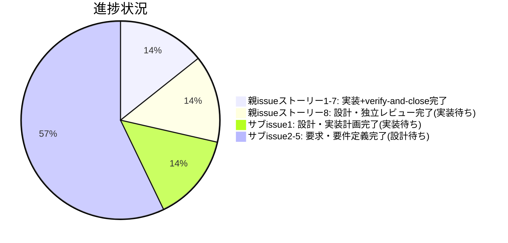

# Issue 一覧: agentsOS 汎用化・ポリシー統合

**プロジェクト名**: agentsOS 汎用化・ポリシー統合
**作成日**: 2026 年 07 月 11 日
**最終更新**: 2026 年 07 月 11 日（親 issue ストーリー1〜7 は実装完了・verify-and-close 完了＝指摘 0 件で収束、`04_review.md` 作成済み・書記記録済み（`workflow.db` rowid 246）。ストーリー8 は設計改訂が完了し、独立レビュー（fable、当初のストーリー1〜7レビュー担当・当初のネスト不採用判断を行った設計担当とは別エージェント）で**指摘 12 → 3 → 0 件まで収束済み**（`workflow.db` rowid 270〜273）。`00_要求定義.md`〜`03_実装計画.md` すべてが「ネスト統合案（`.agent-skill-chain/` 配下へ `.agents/`・`.agents-project/`・`.workflow/` を集約、安全な uninstall コマンド必須化）」の最終決定で整合済み・document_id 不変（詳細は下記「ストーリー8: 設計改訂の経緯と現状」）。**ストーリー8 は実装フェーズ（implement-feature）に進める状態だが、実装はまだ着手していない。**サブ issue 5 件はいずれも要求・要件定義完了、設計フェーズ待ち。**本セッションを通じて git commit は一度も行っていない**（詳細は「未解決事項」参照）。次セッションの再開手順は `memo/` 配下の引継ぎ記録を参照）

> **重要**: **このドキュメントは常に更新**: issue（またはタスク）の進捗状況、ステータス、優先度などの変更があった場合は、即座にこのドキュメントを更新してください。ドキュメントは「生きているドキュメント」として扱い、実装内容と常に同期させます。
>
> **用語**: [.agents/CONCEPTS.md §用語規約](../../../../.agents/CONCEPTS.md#用語規約) を参照。

---

## 親 issue の状況

**ディレクトリ**: `docs/maintainer/workflow/20260711_015030_agentsOS汎用化_ポリシー統合/`

- `00_要求定義.md` 〜 `03_実装計画.md` すべて完成。8 ストーリー構成。
  - ストーリー 1〜7: system-graph 由来ポリシーの汎用化、workflow.db 強制記録の検討、fable-like 行動規範の統合（docs-only な新規ポリシードキュメント追加）
  - ストーリー 8: `.agents/` 名前空間衝突安全化（当初「単純改名」→ 最終的に「統合ネスト」へ方針転換。下記参照）
- fable モデルによる徹底レビュー・修正反復を実施
  - 要求〜実装計画（ストーリー 1〜7 時点）: 4 サイクルで指摘 10 → 4 → 3 → 0 件
  - ストーリー 8 追加後の再レビュー（当初の単純改名案）: 4 サイクルで指摘 10 → 4 → 2 → 0 件（`memo/20260711_040348_review-docs.md` にサイクル4の収束記録あり）

### ストーリー 1〜7: 実装・レビュー完了

- **実装完了**（tasks1-7、sonnet 実装）。`.agents/EFFORT_POLICY.md`・`.agents/PLATFORM_SAFETY_RESPONSE.md`・`.agents/AGENT_CONDUCT.md`（新設）、`.agents/CLOSEOUT.md`・`.agents/CONTEXT_EFFICIENCY.md`・`.agents/HEARTBEAT.md`・`.agents/enforcement/README.md`・`.agents/enforcement/DESIGN.md`・`.agents/skills/agent/run_command.md`（追記）。
- **verify-and-close 完了**（fable 監査）。1 回目監査で `workflow.db` 証跡不備 2 件（`ts_utc` 非 ISO8601・`changed_files_json` 不正 JSON）を検出 → 正規経路（`write-workflow-log.sh`）で是正 → 再検証し**指摘 0 件で収束**。
- `04_review.md` 作成済み。書記（write-workflow-log）記録済み（`workflow.db` rowid 246）。
- **既知の未対応課題**: `src/agents-md.ts` の 5 箇所（547/574/576/611/624 行目）が `CODE_COMMENT_RULES.md` 違反（`audit.sh` #26 FAIL）。タスク 1〜7 の変更範囲外（コミット `9320214` 由来の既存事項）であり、`04_review.md §10` に「責任スレッドが拾う順送り」として記録済み。**ストーリー 8 実装時に同ファイルを変更するため、その際に併せて是正する方針**（ストーリー 8 の設計・実装計画（ネスト案採用・9 サブタスク）は確定済み。この是正方針は実装着手時にあらためて確認すること）。

### ストーリー 8: 設計改訂の経緯と現状（確定・実装フェーズへ移行可能）

ストーリー 8（`.agents/` 名前空間衝突安全化）は設計が複数回改訂され、独立レビューによる収束まで完了した。**実装はまだ着手されていない。**

1. **当初案**（`02_設計.md §2.6.2`〜`§2.6.6`）: `.agents/` を `.agent-skill-chain/` へ単純リネームのみ。`.agents-project/`・`.workflow/` は現状維持、`.summary/` はスコープ外。fable レビュー 4 サイクルで指摘 0 件収束（`memo/20260711_040348_review-docs.md`）。
2. **ユーザーからの異議**（複数回）: 「`.agent-skill-chain/` 配下に `.agents/`・`.agents-project/`・`.workflow/` を集約（ネスト）すべき」との指摘。設計担当が 2 回、独立した評価軸（`.workflow/` 衝突リスク＝`§2.6.7`・単一ルート集約の利便性＝`§2.6.5` 追記）を追加して再検証したが、いずれも「不採用」の結論を維持（`§2.6.8` に 4 ディレクトリの衝突リスク総括表あり）。
3. **ユーザーの最終決定**（`02_設計.md §2.6.9`）: orchestrator が提示した緩和策（`.git/` の前例＝システム領域とユーザーデータの同居は正規コマンド経由の操作が徹底されていれば許容される、および正規の安全な uninstall コマンドの必須化）を踏まえ、**「ネスト統合案を採用する」と明示的に最終決定**。`§2.6.9.0`（ADR形式の経緯）〜`§2.6.9.6`（06_設計判断の優先順位との整合）まで、確定事項5点（統合ルート`.agent-skill-chain/{source,project,runtime}/`・所有区分可視化命名・安全な uninstall コマンド必須実装・README 警告・移行パス）を含めて執筆済み。
4. **`02_設計.md §3.8`（機能設計・処理フロー）も §2.6.9 の確定内容と整合する形にすでに更新済み**（setup/init/upgrade のネスト分岐フローチャート・uninstall のネスト分岐フローチャートを含む）。
5. **`03_実装計画.md §2.8`（タスク 8 の実装計画）の全面改訂が完了**（`workflow.db` rowid 267〜268）。タスク 8 は 7 サブタスクから **9 サブタスク**（新規: ⑧安全な uninstall コマンド実装・⑨README 警告設置）へ拡張し、ネスト構造（`source/`・`project/`・`runtime/`）・所有区分命名・3 ディレクトリ統合移行パス・**影響範囲 122 件（union、`02_設計 §2.6.9.5` と整合）**・見積工数 4〜5.5 日を反映済み。旧「102 件」「ネスト不採用」の記述は解消されている。
6. **独立レビュー（fable。当初のストーリー1〜7レビュー担当、および当初のネスト不採用判断を行った設計担当とは別エージェント）を実施し、指摘 12 → 3 → 0 件まで収束済み**（`workflow.db` rowid 270〜273）。1 回目のレビュー（third-party・敵対的観点）で 12 件を検出し、以降 `03_実装計画.md`・`01_要件定義.md`・`00_要求定義.md` の順に修正を反復、最終的に指摘 0 件で収束した。`document_id` はいずれも不変。

**現状**: `00_要求定義.md`〜`03_実装計画.md` すべてが最終決定（ネスト統合・所有区分命名・安全な uninstall コマンド・移行パス）で整合しており、**ストーリー 8 は実装フェーズ（implement-feature）に進める状態**。ただし実装はまだ着手されていない。

**実装時の重要な注意（ユーザー指示）**: ストーリー 8 実装時、特に uninstall コマンドのテストは、`.agents-project/自己拡張ワークフロー.md §テストの tmp 隔離（必須）` に従い、**一時ディレクトリ（`mktemp -d`）にエージェント（本パッケージ）をコピーする等して安全に検証すること**。本番の `.agents/`・`.claude/`・`.cursor/`・`.workflow/`・`workflow.db` を変更・破壊してはならない。

---

## 確定起票順序表

下表は本親 issue（agentsOS 汎用化・ポリシー統合）配下のサブ issue 一覧である。本サブ issue はユーザーからの追加指示（「npmでの公開はやめる。代わりにAPM (Agent Package Manager)としたい」）を受けて起票した。

| 順 | サブ issue ディレクトリ名 | issue_id | 概要 | 優先度 | ステータス | リンク |
|----|---------------------------|----------|------|--------|------------|--------|
| 1 | npm公開中止_APM転換 | afa19b5b-0e1b-496d-acc0-23180f11f30c | npm 公開を取りやめ、Microsoft 公式 OSS [`microsoft/apm`](https://github.com/microsoft/apm)（Agent Package Manager）のパッケージ形式で配布する方針に確定（3 解釈候補のうち②配布チャネル変更を採用、①パッケージ名変更・③新コンセプト自作は却下）。apm.yml ドラフト・9 タスクの実装計画まで具体化済み | 🔴 高 | **要求・要件・設計・実装計画すべて完了、fable レビュー指摘 0 件、実装フェーズ待ち** | [詳細](./90_issues/20260711_024021_npm公開中止_APM転換/00_要求定義.md) |
| 2 | フィジビリティADR必須化 | a9c5404f-c2ac-40f7-b223-004cad769fb6 | 要件定義・設計フェーズでのフィジビリティ確認・一次情報調査・ADR 的意思決定記録を、verify-and-close の事後チェック（event）ではなく執筆プロセス（process）として義務化する。既存 CONCEPTS.md §外部根拠の必須化（evidence_source 分類）を正本のまま requirement-discovery / design-feature へ接続する（ユーザー指摘 2026-07-11 起点）。greenfield プロジェクトのアーキテクチャ・コーディング規約・ディレクトリ構成決定への ADR 適用（ストーリー 5）を追加。**関連分割提案**: 「システム仕様書が常に最新かつ正しい内容であることの継続的な強制」を目的とする姉妹サブ issue「システム仕様書の完備・強制・テンプレート刷新」の起票を本 issue の 01 §6 で提案（→ サブ issue 4 として起票済み） | 🔴 高 | **要求・要件定義完了（00/01 作成・改訂済み）、設計フェーズ待ち** | [詳細](./90_issues/20260711_055538_フィジビリティADR必須化/00_要求定義.md) |
| 3 | write-workflow-log_ts_utc検証 | 11059f78-5fdf-41a3-bc5c-ca1e978ec60a | `write-workflow-log.sh` の `TS_UTC`（第 4 引数）が非空チェックのみで ISO8601 形式バリデーションが無く、JST の memo プレフィックス形式（`YYYYMMDD_HHMMSS`）等の契約違反値がそのまま INSERT される欠陥への恒久対策。INSERT 前の fail-fast バリデーション（非適合なら exit 1＋期待形式の例と実際の値を含むエラーメッセージ）を追加する。ストーリー 7 実装中の書記記録契約違反（verify-and-close 監査で検出・データは是正済み）が起点。audit.sh の `bad_ts`（事後検知）との二重化で運用し、過去データ是正・audit 強化はスコープ外 | 🟡 中 | **要求・要件定義完了（00/01 作成済み）、設計フェーズ待ち** | [詳細](./90_issues/20260711_055602_write-workflow-log_ts_utc検証/00_要求定義.md) |
| 4 | システム仕様書完備強制テンプレート刷新 | b9ccf155-e7f1-4a9e-b087-001f0d148987 | **最上位目的＝「システム仕様書（`docs/`）が実装の変化に追随し、常に最新かつ正しい内容であることの継続的な強制」**（ユーザー意図の原文を 00 §1.1 に明記）。手段 5 点: (R-1) コーディング規約・ディレクトリ構成・アーキテクチャの greenfield 必須文書化、(R-2) enforcement 接続、(R-3) ノイズ排除（陳腐化・実装との矛盾記述）の強制、(R-4) `.workflow/templates/docs/` の大規模対応刷新（`system-graph/docs` の更新履歴・97_レビュー記録 51 件・規約ドメイン別分離＋索引・ID 全数採番を実地検証して参考化）、(R-5) issue close 前の docs レビュー・指摘対応反復（指摘 0 件まで）の必須化＝継続追随ゲート（verify-and-close の現行「必要に応じて」任意表現の必須化）。サブ issue 2「フィジビリティADR必須化」01 §6 の姉妹 issue 提案の実起票。ADR/evidence_source 定義は隣接 issue が正本（本 issue では再定義しない境界を 00 §4.1 に明記）。隣接 issue と関連するが独立進行可能 | 🔴 高 | **要求・要件定義完了（00/01 作成済み）、設計フェーズ待ち** | [詳細](./90_issues/20260711_061341_システム仕様書完備強制テンプレート刷新/00_要求定義.md) |
| 5 | workflowDB由来検知欠如是正 | 78423f63-e59c-457a-b02c-2a70148fa889 | 親 issue ストーリー8 の独立レビュー中、ユーザーからの「`.workflow/` も `.agents/` と同型の名前空間衝突リスクを抱えていないか」との再指摘を受けた検証（`02_設計.md §2.6.7`）で発見した派生課題。`setup.sh` の `init_workflow_db`・`write-workflow-log.sh` はいずれも `.workflow/workflow.db` の由来を検証せず、既存ファイルの存在確認のみでスキップする（実機検証済み: 非 sqlite3 ファイルを事前配置すると setup は無警告で完了し、後続の書記ステップで初めて sqlite3 エラーとして顕在化）。データ破壊は生じないため `.agent-skill-chain/` 本体と同水準のマーカー・fail-closed 導入は不要と判断済み（`02_設計.md §2.6.7` で確定）だが、setup 時点での軽量な警告表示を要件化する。CLOSEOUT.md 新設「課題の責任完遂」原則（起票は必要条件だが十分条件ではない）に従い、放置せず起票したもの | 🟢 低 | **要求・要件定義完了（00/01 作成済み）、設計フェーズ待ち（親 issue ストーリー8 実装完了後を目安）** | [詳細](./90_issues/20260711_062125_workflowDB由来検知欠如是正/00_要求定義.md) |

**Issue 詳細は各 issue ディレクトリ（`90_issues/{ディレクトリ名}/`）を参照すること。** 本ファイルは一覧・進捗・依存関係の index とする。

### サブ issue 1 件目の経緯補足

当初は「APM構想の 3 解釈候補（パッケージ名変更／配布チャネル変更／新コンセプト）」で要求・要件定義のみ完了し設計は保留していたが、その後ユーザーとの対話で `https://github.com/microsoft/apm`（Microsoft 公式 OSS、Agent Package Manager）の実在を確認。「①パッケージ名変更・③新コンセプト自作は却下、②配布チャネル変更を具体化し microsoft/apm のパッケージ形式で配布する」方針に確定した。00_要求定義.md 〜 03_実装計画.md すべて完成しており、microsoft/apm 公式ドキュメントを実際に WebFetch で取得した上で apm.yml ドラフト・9 タスクの実装計画を含む「実装可能レベル」の設計となっている。fable モデルによる徹底レビューを 3 サイクル実施し、指摘 25 → 8 → 0 件まで収束（リポジトリ名の誤り・リリーストリガの誤記述・E2E 設計の実行不能性など、一次情報との不一致を修正済み）。

---

## 実装順ロードマップ（ユーザー指示）

親 issue（ストーリー 1〜8）とサブ issue 1 件目はいずれも設計・実装計画が完了し実装待ちの状態にあるが、以下の順序で実装する方針がユーザーにより確定している。

| 順 | 対象 | 概要 |
|----|------|------|
| 1 | 親 issue ストーリー 1〜7 | docs-only な新規ポリシードキュメント追加。互いに独立しており並行実装可能、低リスク |
| 2 | 親 issue ストーリー 8 | `.agents/` → `.agent-skill-chain/` 改名。ストーリー 1〜7 完了後の必須最終タスク（03_実装計画.md タスク 8 として明記）。setup.sh・src/agents-md.ts・96 ファイルに及ぶ高リスクな変更のため、単独で丁寧に実行する |
| 3 | サブ issue（npm公開中止_APM転換） | 技術的にはストーリー 8 の実装順に直接依存しないが、apm.yml ドラフトが `.agents/` パスを前提にしているため、ストーリー 8 完了後に着手する方が手戻りが少ない |

### 決定理由

- **ストーリー 1〜7 を最初に置く理由**: いずれも新規ドキュメント追加のみで既存ファイルへの破壊的変更を伴わず、ストーリー間の依存もないため並行実装が可能。最も低リスクで着手しやすく、先行させることで早期に価値を確定できる。
- **ストーリー 8 を 2 番目に置く理由**: `.agents/` → `.agent-skill-chain/` の改名はリポジトリ全体（setup.sh・src/agents-md.ts を含む 96 ファイル）に影響する高リスクな変更であり、03_実装計画.md 上もタスク 1〜7 完了後の必須最終タスクと定義されている。ストーリー 1〜7 で追加されるドキュメントのパスも改名の影響を受けるため、先にドキュメント追加を終わらせてから改名を一括で行う方が手戻りが少ない。
- **サブ issue（APM転換）を 3 番目に置く理由**: npm 公開中止・APM 転換自体はストーリー 8 のディレクトリ改名と機能的に独立したタスクだが、既に確定している apm.yml ドラフトが `.agents/` パスを前提に記述されているため、ストーリー 8 の改名を先に完了させてから着手する方が apm.yml の書き直し・手戻りを避けられる。技術的な実装順序の強制ではなく、作業効率上の合理的な順序として採用する。

---

## 進捗状況

### 全体進捗

親 issue のうちストーリー 1〜7 は**実装＋verify-and-close 完了**（指摘 0 件収束、`04_review.md` 作成・書記記録済み）。ストーリー 8 は設計改訂・独立レビュー（指摘 12→3→0 件収束）まで完了し、**実装フェーズ（implement-feature）に進める状態だが実装は未着手**（詳細は上記「ストーリー8: 設計改訂の経緯と現状」参照）。サブ issue 1 件目は要求定義〜実装計画（および fable レビューによる収束）まで完了しており実装フェーズは未着手。サブ issue 2 件目（フィジビリティADR必須化）・3 件目（write-workflow-log_ts_utc検証）・4 件目（システム仕様書完備強制テンプレート刷新）・5 件目（workflowDB由来検知欠如是正）は要求・要件定義（00/01）まで完了し、設計フェーズ待ちである。

- **完了（実装＋verify-and-close 済）**: 親 issue はストーリー 1〜7 のみ完了（ストーリー 8 は設計・レビューは完了したが実装が未完了のため親 issue 全体としては未完了）。サブ issue は 0 / 5。
- **設計・実装計画完了／fable レビュー指摘 0 件・実装待ち**: 2 / 6（親 issue ストーリー 8・サブ issue 1 件目）
- **要求・要件定義完了・設計待ち**: 4 / 6（サブ issue 2 件目「フィジビリティADR必須化」・3 件目「write-workflow-log_ts_utc検証」・4 件目「システム仕様書完備強制テンプレート刷新」・5 件目「workflowDB由来検知欠如是正」）
- **未着手（未起票）**: 0

※ 親 issue はストーリー単位で進捗が分かれるため（1〜7 完了／8 は設計完了・実装待ち）、上記グラフでは親 issue を 2 区分に按分して表現している（厳密な issue 件数の円グラフではない点に注意）。

### 優先度別進捗

- **高優先度（🔴）**: 0 / 3
  - サブ issue 1「npm公開中止_APM転換」: 要求・要件・設計・実装計画すべて完了、fable レビュー指摘 0 件、実装は上記ロードマップの順序 3 番目で着手予定
  - サブ issue 2「フィジビリティADR必須化」: 要求・要件定義（00/01）完了。設計（design-feature）・実装は orchestrator が別途手配
  - サブ issue 4「システム仕様書完備強制テンプレート刷新」: 要求・要件定義（00/01）完了。サブ issue 2 と関連するが独立進行可能（ADR/evidence_source 定義はサブ issue 2 が正本、本 issue は docs の完備・強制・ノイズ排除・テンプレート・継続追随ゲートに専念）。設計（design-feature）・実装は orchestrator が別途手配
- **中優先度（🟡）**: 0 / 1
  - サブ issue 3「write-workflow-log_ts_utc検証」: 要求・要件定義（00/01）完了。`write-workflow-log.sh` への ts_utc ISO8601 バリデーション追加（局所的・低リスクな改修）。設計（design-feature）・実装は orchestrator が別途手配
- **低優先度（🟢）**: 0 / 1
  - サブ issue 5「workflowDB由来検知欠如是正」: 要求・要件定義（00/01）完了。`.workflow/workflow.db` の由来不明ファイルを setup 時点で軽量に警告する改修（データ破壊は伴わないため優先度は低）。親 issue ストーリー8 の実装完了後の着手を想定。設計（design-feature）・実装は orchestrator が別途手配
- **親 issue 本体**: ストーリー 1〜7 は実装・verify-and-close 完了（指摘 0 件）。ストーリー 8 は設計・独立レビュー完了（指摘 12→3→0 件収束）・実装フェーズへ進める状態だが実装未着手のため、親 issue 全体としては未完了（0 / 1）。

---

## 未解決事項（セッション引継ぎ時点）

**ストーリー8 の設計改訂（`03_実装計画.md §2.8` の全面改訂）は完了し、独立レビュー（fable、指摘 12→3→0 件収束）も完了した。以下のみが残る未解決事項である。**

1. **ストーリー 8 の実装着手**（最優先）: 設計・独立レビューは収束済みのため、実装フェーズ（implement-feature）に進めること。実装時は `.agents-project/自己拡張ワークフロー.md §テストの tmp 隔離（必須）` に従い、uninstall コマンド等のテストを `mktemp -d` による隔離環境で行い、本番の `.agents/`・`.claude/`・`.cursor/`・`.workflow/`・`workflow.db` を変更・破壊しないこと。
2. **`src/agents-md.ts` の `CODE_COMMENT_RULES.md` 違反 5 箇所**（547/574/576/611/624 行目、`audit.sh` #26 FAIL）: ストーリー 8 実装時に同ファイルを変更するため、その際に併せて是正する方針（`04_review.md §10` 記録済み）。ストーリー 8 のスコープ拡大（ネスト案採用）に伴い、この是正方針が変わらないか実装着手時に再確認すること。
3. **git commit 未実施**: 本セッションを通じて一度も commit していない。ストーリー 1〜7 の実装・ストーリー 8 の設計改訂・サブ issue 5 件の作成が、すべて未コミットの作業ツリー変更として残っている。次セッションで commit 粒度（CLOSEOUT.md の「1 サブ issue = 1 論理コミット」方針をどう当てはめるか。親 issue のストーリー単位・サブ issue 単位の切り方を含む）を判断すること。

---

## 参考資料

### プロジェクトドキュメント

このプロジェクトの全体ドキュメント：

- [`00_要求定義.md`](./00_要求定義.md) - 要求定義（本親 issue。agentsOS 汎用化・ポリシー統合）
- [`01_要件定義.md`](./01_要件定義.md) - 要件定義（8 ストーリー構成の BDD シナリオ）
- [`02_設計.md`](./02_設計.md) - 設計（§2.6.9 にストーリー 8 のネスト採用最終決定・ADR を記載）
- [`03_実装計画.md`](./03_実装計画.md) - 実装計画（タスク 1〜7 完了。タスク 8＝ストーリー 8 対応。**§2.8 は `02_設計.md §2.6.9` の最終決定に整合するよう全面改訂済み・独立レビューで指摘 0 件収束、実装フェーズ待ち**）
- [`04_review.md`](./04_review.md) - レビュー書（ストーリー 1〜7 の実装完了分のみが対象。指摘 0 件で収束済み。ストーリー 8 は別途レビュー予定）

### その他の参考資料

- サブ issue 1 の前提: [`../close/20260616_144601_npm公開を今後の課題化_自動リリース現状無効化/`](../close/20260616_144601_npm公開を今後の課題化_自動リリース現状無効化/00_要求定義.md)（npm 公開を「今後の課題」として保留する従来判断・close 済み）
- サブ issue 1 の一次情報: [microsoft/apm](https://github.com/microsoft/apm)（Microsoft 公式 OSS、Agent Package Manager）
