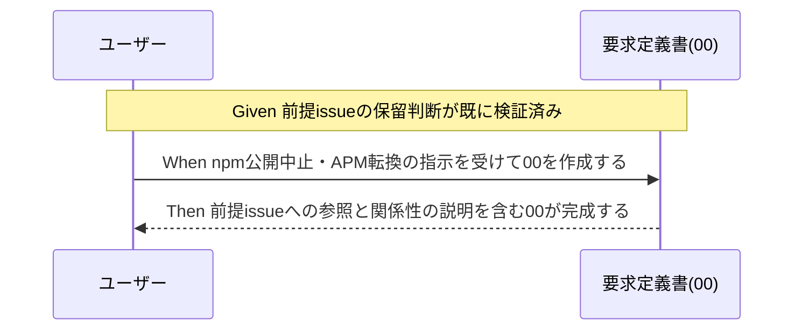

# 要件定義書: npm 公開を取りやめ、"APM (Agent Package Manager)" 構想へ転換する

**プロジェクト名**: npm 公開中止・APM (Agent Package Manager) 転換
**作成日**: 2026 年 07 月 11 日
**最終更新**: 2026 年 07 月 11 日

> **重要**: **このドキュメントは常に更新**: 要件の変更や追加があった場合は、即座にこのドキュメントを更新してください。ドキュメントは「生きているドキュメント」として扱い、実装内容と常に同期させます。
>
> **用語**: [.agents/CONCEPTS.md §用語規約](../../../../../../.agents/CONCEPTS.md#用語規約) を参照。

---

## 1. 概要

### 1.1 システム概要

本パッケージ（現行名 `agent-skill-chain`）は `.agents/` を正本に各 AI ツール（Claude Code / Cursor / Gemini / Copilot / Codex）へ配備する AI 実行契約・ワークフロー仕様パッケージである。従来 npm を主導線として配布する計画だったが、前提 issue（[`00_要求定義.md`](../../../close/20260616_144601_npm公開を今後の課題化_自動リリース現状無効化/00_要求定義.md)）で npm 公開に伴うリスク（削除困難・名前の永久消費・誤 publish 事故）を理由に「今後の課題」として保留した。本 issue はこの保留判断をさらに進め、**npm 公開自体を取りやめ、"APM (Agent Package Manager)" という構想へ転換する**という新方針の要求・要件を整理する。

> **確定した方針（ユーザー承認済み・2026-07-11）**: 当初、「APM (Agent Package Manager)」が具体的に何を指すかはユーザーの原文（「npmでの公開はやめる。のでこのissueのサブで対応して。代わりにAPM (Agent Package Manager)としたい。」）からは断定できず、3 つの解釈候補（①パッケージ名変更／②配布チャネル変更／③新コンセプト・新ツールとしての自作）を提示していた。ユーザーが実在する Microsoft 公式 OSS [`microsoft/apm`](https://github.com/microsoft/apm) と [Zenn 記事](https://zenn.dev/hirayuki/articles/66d27a9a1cfb89) を参照した上で、①・③を却下し、②を `microsoft/apm` パッケージ形式配布への転換として確定した（決着内容は [00_要求定義.md §1.2](./00_要求定義.md) を正とする）。本ドキュメントは、この確定方針に基づく事項のみを BDD シナリオ化する（apm.yml 等の具体的なファイル内容・API 詳細設計は 02_設計.md の範囲であり、本ドキュメントでは扱わない）。

### 1.2 用語集

| 用語 | 説明 |
| --- | --- |
| APM (Agent Package Manager) | 本 issue における確定方針の呼称。実在する Microsoft 公式 OSS [`microsoft/apm`](https://github.com/microsoft/apm)（MIT license）を指す。`apm.yml` マニフェスト＋`apm.lock.yaml` ロックファイルで instructions・skills・prompts・agents・hooks・plugins を宣言的に配布・再現するツールであり、本パッケージはこの `microsoft/apm` のパッケージ形式で配布できるようにする方向へ転換する（[00 §1.2](./00_要求定義.md) 参照）。 |
| microsoft/apm | 配布・インストール層を担う Microsoft 公式 OSS。README に「Built on open standards: AGENTS.md · Agent Skills · MCP」と明記されており、本パッケージが定義する AGENTS.md 標準を基盤にしている。agent-skill-chain（本パッケージ）とは競合ではなく補完関係（`microsoft/apm`=配布層、本パッケージ=実行契約・ワークフロー層）。 |
| 前提 issue | [`20260616_144601_npm公開を今後の課題化_自動リリース現状無効化`](../../../close/20260616_144601_npm公開を今後の課題化_自動リリース現状無効化/00_要求定義.md)。npm 公開を「今後の課題」として保留し `release.yml` を dormant 化した issue（close 済み）。 |
| dormant 化 | `release.yml` を `workflow_dispatch` のみのトリガ＋`RELEASE_ENABLED` ゲートに変更し、main マージでの自動発火を止めた可逆的な無効化措置（前提 issue で実施済み）。 |
| 影響を受けうる箇所 | パッケージ名・配布チャネルに言及する既存ファイル群。実際に変更が必要かは設計フェーズで判断するため、本 issue では「影響を受けうる」という不確定な扱いで列挙する（[00 §1.2 論点B](./00_要求定義.md) 参照）。 |

---

## 2. 機能要件

### 2.1 ユーザーストーリー

#### ストーリー 1: 方針転換の明文化

- **As a** 本パッケージの保守者
- **I want to** npm 公開を「取りやめる」という方針転換を、前提 issue の保留判断との関係を明示した形で記録したい
- **So that** 将来の意思決定者が、なぜ保留から中止へ転換したのかを issue 単体で追跡できる

**受け入れ基準**:

- 00_要求定義.md に、前提 issue（保留判断）への相対リンクが記載されている。
- 00_要求定義.md に、「今回はさらに一歩進めて npm 公開自体を取りやめる」という関係性の説明がある。

#### ストーリー 2: APM 構想の解釈決着と `microsoft/apm` パッケージ形式配布への転換

- **As a** 本パッケージの保守者
- **I want to** 「APM (Agent Package Manager)」が指しうる複数の解釈のうち、却下する解釈とその理由、および採用する解釈（`microsoft/apm` パッケージ形式配布への転換）を明記したい
- **So that** 後続の設計フェーズが同じ論点を再検討することなく、確定した方針の上で `apm.yml` 相当のマニフェスト設計に着手できる

**受け入れ基準**:

- 00・01 の双方に、3 つの解釈候補（①パッケージ名変更／②配布チャネル変更／③新コンセプト・新ツールとしての自作）が列挙され、①・③はそれぞれ却下理由（①名称衝突リスク、③車輪の再発明）とともに「不採用」と明記されている。
- ②が「`microsoft/apm` パッケージ形式配布への転換」として具体化・確定した方針であることが 00・01 に明記されている。
- `microsoft/apm`（GitHub リポジトリ）・参照した Zenn 記事の URL が 00・01 の参考資料に記載されている。
- 01 に、`apm.yml` 相当のマニフェストを本パッケージ配下に用意できること、および `apm install` で本パッケージの `.agents/` 一式が展開できることを検証する、という受け入れ基準（具体的なファイル内容・API 仕様は含まない粒度）が記載されている。

#### ストーリー 3: 影響範囲の一覧化

- **As a** 本パッケージの保守者
- **I want to** `bin/agents-md.js`・`npx agent-skill-chain init` 導線を含む、方針転換の影響を受けうる箇所を一覧化したい
- **So that** 後続の設計フェーズで見落としなく調査・対応できる

**受け入れ基準**:

- 00_要求定義.md に、影響を受けうるファイル・記述箇所の一覧（`package.json`・README・RELEASE.md・release.yml・src/agents-md.ts・adapters.md 等）がある。
- 一覧は「実際に変更するかどうか」を断定せず、「影響を受けうる」という留保付きで記載されている。

### 2.2 BDD ユースケース

#### ユースケース 1: 方針転換を 00 に記載する

過去の保留判断（前提 issue）を否定せず発展させる形で、npm 公開中止・APM 転換という新方針を要求定義書に記載する。

**シナリオ 1: 前提 issue への参照を含めて方針転換を記載する**

```gherkin
Feature: npm公開中止・APM転換の方針明文化
  Scenario: 前提issueとの関係を明示して00を作成する
    Given 前提issue（20260616_144601）でnpm公開を「今後の課題」として保留する判断が独立検証済みである
    When 本issueの00_要求定義.mdを作成する
    Then 00に前提issueの00_要求定義.mdおよび04_review.mdへの相対リンクが記載される
    And 「保留からさらに一歩進めて公開自体を取りやめる」という関係性が明記される
```

**処理フロー**（必要に応じて）:



**シナリオ 2: 除外要件で実施範囲を限定する**

```gherkin
Feature: npm公開中止・APM転換の方針明文化
  Scenario: 本issueのスコープをrequirement-discoveryに限定する
    Given microsoft/apmパッケージ形式配布への転換方針が確定している
    When 00の除外要件を記載する
    Then npm公開の実施検討・パッケージ名の実改名・release.ymlの実改変・apm.yml等の具体設計が除外要件に含まれる
    And 04_reviewの作成は実装前のため対象外と明記される
```

#### ユースケース 2: APM 構想の解釈を決着させ、`microsoft/apm` パッケージ形式配布への転換を確定する

「APM (Agent Package Manager)」の意味について、ユーザーが `microsoft/apm`（Microsoft 公式 OSS）と Zenn 記事を参照した上で承認した方針（①・③却下、②採用・具体化）を 00・01 に記録する。

**シナリオ 1: 却下した 2 解釈とその理由を明記する**

```gherkin
Feature: APM構想の解釈決着
  Scenario: パッケージ名変更・新コンセプト自作の却下理由を00・01の双方に記載する
    Given ユーザーがmicrosoft/apm（GitHubリポジトリ）とZenn記事を参照し方針を承認した
    When 00_要求定義.mdおよび01_要件定義.mdを更新する
    Then 解釈①（パッケージ名変更）は名称衝突リスクを理由に却下と明記される
    And 解釈③（新コンセプト・新ツールとしての自作）は車輪の再発明を理由に却下と明記される
    And 却下の経緯が後から追跡できる形で00に残る
```

**シナリオ 2: 採用した解釈（配布チャネル変更）を `microsoft/apm` 形式へ具体化する**

```gherkin
Feature: APM構想の解釈決着
  Scenario: 解釈②を microsoft/apm パッケージ形式配布への転換として確定する
    Given 解釈②（配布チャネル変更）が当初の3候補のうち唯一採用可能な方向である
    When 00_要求定義.mdおよび01_要件定義.mdを更新する
    Then npm公開をやめ本パッケージをmicrosoft/apmのパッケージ形式で配布できるようにする方針が明記される
    And apm install <org>/AGENTS.md のような形でのインストールを可能にする方向性が記載される
    And microsoft/apmとagent-skill-chain（本パッケージ）が配布層・実行契約層として補完関係にあることが明記される
```

**シナリオ 3: 確定方針を受け入れ基準に反映し、設計詳細は 02 へ委ねる**

```gherkin
Feature: APM構想の解釈決着
  Scenario: apm.yml相当のマニフェスト・apm installでの展開を受け入れ基準として記載する
    Given microsoft/apmパッケージ形式配布への転換が確定している
    When 01_要件定義.mdの受け入れ基準を記載する
    Then apm.yml相当のマニフェストを本パッケージ配下に用意できることが受け入れ基準に含まれる
    And apm installで本パッケージの.agents/一式が展開できることを検証する受け入れ基準が含まれる
    And apm.ymlの具体的なファイル内容・APIの詳細設計には踏み込まず02_設計.mdの範囲として切り分けられる
```

#### ユースケース 3: 影響を受けうる箇所を一覧化する

`bin/agents-md.js` や `npx agent-skill-chain init` 導線を含め、方針転換の影響を受けうる箇所を、断定せず一覧化する。

**シナリオ 1: grep による機械的な洗い出しを一覧に反映する**

```gherkin
Feature: 影響を受けうる箇所の一覧化
  Scenario: package.json・README・RELEASE.md等をgrepで洗い出し一覧化する
    Given リポジトリ内に"agent-skill-chain"という文字列を含むファイルが複数存在する
    When 00_要求定義.mdの論点Bを作成する
    Then package.json・README.md・docs/maintainer/RELEASE.md・.github/workflows/release.yml・src/agents-md.ts・docs/maintainer/adapters.md等が一覧に含まれる
    And 各項目は「影響を受けうる」という留保付きで記載され実際の変更要否は断定されない
```

### 2.3 ビジネスルール

- 推測で仕様を断定しない。APM の解釈はユーザー承認により決着済みとして記載し、確定していない論点（影響範囲の実際の変更要否、dormant 化資産の扱い）は「不明点・要確認事項」として明記し、設計フェーズで検討する事項として切り分ける。
- 前提 issue の dormant 化資産（`release.yml`・README・RELEASE.md の整合済み記述）は、本 issue（要求・要件フェーズ）では実改変しない。
- `apm.yml` 相当のマニフェスト・`apm.lock.yaml` 相当のロックファイルの具体的なファイル内容・API 詳細設計は、00・01 では扱わない（02_設計.md の範囲）。
- 04_review.md は実装完了前のため作成しない（実装完了後の verify-and-close でのみ作成する）。要求・要件フェーズの成果物は 00・01 であり、設計以降の成果物（02・03）は本サブ issue の後続フェーズで作成する（スコープは [00 §4.1](./00_要求定義.md) 参照）。

---

## 3. 非機能要件

### 3.1 パフォーマンス要件

- 該当なし（ドキュメント作成のみ）。

### 3.2 セキュリティ要件

- 前提 issue で整理された npm 公開リスク（削除困難・名前の永久消費・誤 publish 事故）の判断材料を否定せず引き継ぐ。

### 3.3 ユーザビリティ要件

- 第三者（将来の設計フェーズ担当者）が本 00・01 のみを読んで、方針転換の背景・確定した APM の解釈と却下理由・影響を受けうる箇所を把握できること。

### 3.4 可用性要件

- 該当なし。

---

## 4. 外部インターフェース要件

### 4.1 API 要件

- 該当なし。

### 4.2 データ形式要件

- 該当なし。

---

## 5. 制約事項

- 本 issue は当初 `requirement-discovery`（00・01 の作成）のみを扱う計画だったが、論点A の決着を受けて同一サブ issue 内で設計（02）・実装計画（03）・実装フェーズまで扱う（スコープ更新の正本は [00 §4.1](./00_要求定義.md) を参照）。`apm.yml` 等の具体的なファイル内容・API 詳細設計は 02_設計.md の範囲であり、00・01 では扱わない。
- 論点A（APM の解釈: パッケージ名変更／配布チャネル変更／新コンセプト再定義）は決着済み（②を `microsoft/apm` パッケージ形式配布への転換として採用、①・③は却下）。論点B（影響を受けうる箇所）・論点C（前提 issue の dormant 化資産の扱い）は、00・01 の時点では確定させず後続フェーズへの申し送り事項とした（その後 02_設計 §2.6.4 で決着済み）。
- 前提 issue の成果（dormant 化・README/RELEASE.md 整合）を破壊しない。

---

## 6. 参考資料

### プロジェクトドキュメント

- [`00_要求定義.md`](./00_要求定義.md) - 要求定義

### その他の参考資料

- 前提 issue: [`../../../close/20260616_144601_npm公開を今後の課題化_自動リリース現状無効化/00_要求定義.md`](../../../close/20260616_144601_npm公開を今後の課題化_自動リリース現状無効化/00_要求定義.md)
- 前提 issue: [`../../../close/20260616_144601_npm公開を今後の課題化_自動リリース現状無効化/04_review.md`](../../../close/20260616_144601_npm公開を今後の課題化_自動リリース現状無効化/04_review.md)
- 親 issue: [`../../00_要求定義.md`](../../00_要求定義.md)
- [`https://github.com/microsoft/apm`](https://github.com/microsoft/apm) — Microsoft 公式 OSS「Agent Package Manager」（MIT license）。本方針転換で採用する配布形式の一次情報源。
- [`https://zenn.dev/hirayuki/articles/66d27a9a1cfb89`](https://zenn.dev/hirayuki/articles/66d27a9a1cfb89) — `microsoft/apm` の紹介記事（Zenn）。

---

## 7. 前のステップ

この要件定義書は、以下のドキュメントを基に作成されています：

- **前**: [`00_要求定義.md`](./00_要求定義.md) - 要求定義フェーズ

---

## 8. 次のステップ

この要件定義書の承認後、以下のドキュメントを作成します：

- **次**: [`02_設計.md`](./02_設計.md) - 設計フェーズ（論点A は決着済みのため着手可能。`apm.yml` 相当のマニフェスト内容・`apm install` 導線等の具体設計を扱う）
