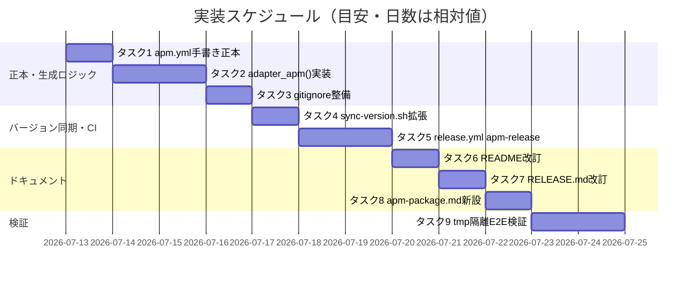
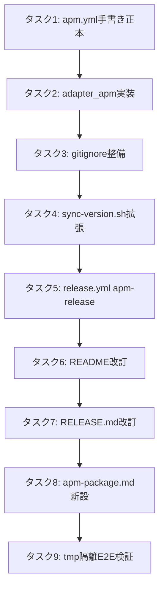

# 実装計画書: npm 公開中止・APM (Agent Package Manager) 転換

**プロジェクト名**: npm 公開中止・APM (Agent Package Manager) 転換
**作成日**: 2026 年 07 月 11 日
**最終更新**: 2026 年 07 月 11 日

> **重要**: **このドキュメントは常に更新**: 実装計画の変更、進捗状況の更新、バグの記録などがあった場合は、即座にこのドキュメントを更新してください。ドキュメントは「生きているドキュメント」として扱い、実装内容と常に同期させます。
> **必須項目**: 「必須」と明記した欄は空欄・抽象語のみで提出しないこと。テスト観点・BDD 仕様は具体ケースを 1 件以上記載すること。
>
> **用語**: [.agents/CONCEPTS.md §用語規約](../../../../../../.agents/CONCEPTS.md#用語規約) を参照。

---

## 1. 実装概要

### 1.1 実装方針（必須）

02_設計 の決定（§2.6.1 `.apm/` 型付きサブディレクトリ方式・§2.6.5 v1 は skills プリミティブのみ）に従い、正本 `.agents/` から決定性のある手順で `apm.yml`＋`.apm/skills/` を生成する `adapter_apm()` を `build-adapters.sh` に追加し、既存の dormant `release.yml` に新規ジョブ `apm-release` を足して `release/apm` ブランチへ発行する。既存の `.adapters/`（Claude/Cursor）・npm 配布導線（`bin/agents-md.js`）は破壊しない。

### 1.2 実装順序（必須）



---

## 2. タスク分解

**用語**: [.agents/CONCEPTS.md §用語規約](../../../../../../.agents/CONCEPTS.md#用語規約) を参照。01 の BDD（ユースケース1〜3）は「方針の明文化」を扱う要件フェーズの成果物であり、本 03 は 02 の設計を実装する具体タスクである。各タスクは 01 のどの確定方針を実現するかを「対応する01要件」欄に明記する。

### 2.1 タスク 1: `.agents/platforms/apm/apm.yml`（手書き正本）の新設

#### 2.1.1 概要（必須）

apm パッケージのメタデータ宣言を行う手書き正本ファイルを新設する。

#### 2.1.2 実装内容（必須）

- `.agents/platforms/apm/apm.yml` を新規作成する。内容は 02_設計 §3.1.3 のドラフトをそのまま用いる（`name: agent-skill-chain`／`version: 0.1.0`／`description`／`author`／`license: MIT`／`includes: auto`／`scripts: {}`／`dependencies.apm: []`／`dependencies.mcp: []`）。
- `version: 0.1.0` は初期値。以降はタスク4の `sync-version.sh --write` のみが更新する運用とする（本タスクではコメントでその旨を明記する）。
- `.agents/platforms/README.md` に `apm/apm.yml` の存在と役割（`.agents/platforms/claude/plugin.json` と同型の「手書き正本」）を追記する。

**対応する01要件**: ストーリー2 受け入れ基準「01に、apm.yml相当のマニフェストを本パッケージ配下に用意できる…という受け入れ基準」。

#### 2.1.3 テスト観点（必須）

##### 単体（必須 1 件以上）

- `.agents/platforms/apm/apm.yml` に `name`・`version` フィールドが存在し、YAML として parse 可能であること。
- `description` に apm・skills・正本一式（`agent-skill-chain-full`）配布の位置づけが明記されていること（空文字・プレースホルダのまま提出されていないこと。パッケージ管理ディレクトリ名のリテラル（`.agents/` 等）は埋め込まない＝02_設計 §2.6.6 の実装規約）。

##### 結合/API

- 該当なし（ドキュメント契約のため。02_設計 §6.1 と対応）。

##### E2E/受け入れ

- 未達（本タスク単独では E2E 対象外。タスク9でまとめて検証）。

##### バリデーション

- `license: MIT` がリポジトリ直下の `LICENSE` ファイルの内容と矛盾しないこと（目視確認）。

#### 2.1.4 単体テスト仕様（BDD）（必須）

```gherkin
Feature: apm.yml 手書き正本
  Scenario: 必須フィールドが揃っている
    Given .agents/platforms/apm/apm.yml が新規作成されている
    When YAML パーサでファイルを読み込む
    Then name フィールドが "agent-skill-chain" である
    And version フィールドが semver パターン（\d+\.\d+\.\d+）に一致する
```

```bash
# Given: .agents/platforms/apm/apm.yml が存在する
# When: node の js-yaml 等（devDependencies に追加せず、CI では python3 -c "import yaml" 等の既存ランタイムを使う）で読み込む
# Then: name/version が期待値であることを assert する
python3 - <<'EOF'
# Given: .agents/platforms/apm/apm.yml を開く
import yaml
with open(".agents/platforms/apm/apm.yml") as f:
    doc = yaml.safe_load(f)
# When: 必須フィールドを取り出す
name = doc.get("name")
version = doc.get("version")
# Then: 期待値と一致することを確認する
assert name == "agent-skill-chain", f"name mismatch: {name}"
import re
assert re.match(r"^\d+\.\d+\.\d+", str(version)), f"version not semver: {version}"
print("OK")
EOF
```

#### 2.1.5 依存関係

なし（最初のタスク）。

#### 2.1.6 見積もり

- **工数**: 0.5〜1 日
- **優先度**: 高

---

### 2.2 タスク 2: `build-adapters.sh` への `adapter_apm()` 追加

#### 2.2.1 概要（必須）

正本 `.agents/skills/` から `.apm/skills/{domain}__{capability}/` を、`.agents/` 一式から `.apm/skills/agent-skill-chain-full/` を、決定性のある手順で生成する `adapter_apm()` を追加する。

#### 2.2.2 実装内容（必須）

- `build-adapters.sh` の `SUPPORTED_TOOLS="claude cursor"` に `apm` を追加する（`SUPPORTED_TOOLS="claude cursor apm"`）。
- `adapter_apm()` 関数を新設し、以下を行う（02_設計 §3.2.2 のフロー図に対応）:
  1. リポジトリルート直下の既存 `apm.yml`・`.apm/` を削除（クリーンな再生成のため）。
  2. `.agents/platforms/apm/apm.yml` を `"$REPO_ROOT/apm.yml"` へコピーする。
  3. `deploy_skills_impl "$AGENTS/skills" "$REPO_ROOT/.apm/skills"` を呼び、既存共有関数（`lib/deploy-skills.sh`）で個々のスキルを配備する。
  4. `mkdir -p "$REPO_ROOT/.apm/skills/agent-skill-chain-full/reference"` し、`.apm/skills/agent-skill-chain-full/SKILL.md`（frontmatter: `name: agent-skill-chain-full`、`description` は 02_設計 §2.6.5 の文言）を書き込む。
  5. 既存 `bundle_agents_src` 関数を**無改変**で呼び出す: `bundle_agents_src "$REPO_ROOT/.apm/skills/agent-skill-chain-full/reference"`。既存仕様（`cp -R "$AGENTS" "$out/.agents"`）により `reference/.agents/` 配下に一式がコピーされ、既存除外規則（`scripts/setup.sh`・`scripts/build-plugin-claude.sh`・`scripts/build-adapters.sh`・`scripts/sync-version.sh`・`scripts/verify-npm-pack.sh`・`scripts/lib/` の除去）がそのまま適用される。関数へのリファクタは行わず、既存呼び出し元（`adapter_claude()`/`adapter_cursor()`）の挙動に一切影響を与えない。
  6. 配備件数（skill 数・バンドルファイル数）を `[build] apm: skills を N 件, agent-skill-chain-full を M ファイル配備しました。` の形式で標準出力する（既存ログ規約に合わせる）。
  7. **実装規約（02_設計 §2.6.6）**: `adapter_apm()` 内で `.agents` というリテラルパスを直書きしない。既存の `AGENTS` 変数（`build-adapters.sh` 冒頭で 1 箇所のみ定義）のみを参照する。
- `bash .agents/scripts/build-adapters.sh apm` 単独実行、および `bash .agents/scripts/build-adapters.sh claude cursor apm` の複合実行の両方が動作することを確認する。

**対応する01要件**: ストーリー2 受け入れ基準「`apm install`で本パッケージの`.agents/`一式が展開できることを検証する」の前段（配布物の生成）。

#### 2.2.3 テスト観点（必須）

##### 単体（必須 1 件以上）

- `deploy_skills_impl` が返す配備件数が、`find .agents/skills -name SKILL.md | wc -l` の件数と一致すること。
- `.apm/skills/agent-skill-chain-full/SKILL.md` の frontmatter に `name: agent-skill-chain-full` が含まれること。

##### 結合/API

- `bash .agents/scripts/build-adapters.sh apm` を tmp 隔離クローン（`.agents-project/自己拡張ワークフロー.md` §テストの tmp 隔離 に従い `git archive HEAD | tar -x` で再現）に対して 2 回連続実行し、生成された `.apm/` のファイルツリー・内容が bit-for-bit 一致すること（決定性検証）。
- `.adapters/claude/**`・`.adapters/cursor/**` が `adapter_apm()` 実行前後で変化しないこと（境界の遵守。02_設計 §2.1.2）。

##### E2E/受け入れ

- 未達（本タスク単独では E2E 対象外。タスク9でまとめて検証）。

##### バリデーション

- `.apm/skills/agent-skill-chain-full/reference/.agents/scripts/` 配下に `setup.sh`・`build-plugin-claude.sh`・`build-adapters.sh`・`sync-version.sh`・`verify-npm-pack.sh`・`lib/` が**含まれていない**こと（既存 `bundle_agents_src` の除外規則の踏襲確認）。

#### 2.2.4 単体テスト仕様（BDD）（必須）

```gherkin
Feature: adapter_apm() の決定性生成
  Scenario: 正本スキル件数とapm配備件数が一致する
    Given .agents/skills 配下に SKILL.md を持つ配備単位（capability ディレクトリ＋ドメイン直下 SKILL.md を持つ domain）が N 件存在する
    When bash .agents/scripts/build-adapters.sh apm を実行する
    Then .apm/skills/ 配下に {domain}__{capability} 形式（ドメイン直下スキルは {domain} 単独名）のディレクトリが N 件生成される
    And .apm/skills/agent-skill-chain-full/SKILL.md が存在する

  Scenario: 再生成の決定性
    Given build-adapters.sh apm を1回実行済みである
    When 同一の正本に対してもう一度 build-adapters.sh apm を実行する
    Then 生成された .apm/ ツリーの内容（ファイル一覧・各ファイルのハッシュ）が前回と完全一致する
```

```bash
# Given: tmp隔離クローンで .agents/skills 配下の SKILL.md 件数を数える
TMP=$(mktemp -d)
git archive HEAD | tar -x -C "$TMP"
cd "$TMP"
N=$(find .agents/skills -name SKILL.md | wc -l)

# When: adapter を実行する
bash .agents/scripts/build-adapters.sh apm

# Then: 個々スキルの配備件数が一致する（agent-skill-chain-full を除いた件数で比較）
M=$(find .apm/skills -mindepth 1 -maxdepth 1 -type d ! -name agent-skill-chain-full | wc -l)
[ "$N" -eq "$M" ] || { echo "FAIL: N=$N M=$M"; exit 1; }
[ -f .apm/skills/agent-skill-chain-full/SKILL.md ] || { echo "FAIL: bundle SKILL.md missing"; exit 1; }

# And: 決定性（再実行で差分ゼロ。中間ファイルも tmp 隔離内に置く）
find .apm -type f -exec sha256sum {} \; | sort > "$TMP/hash1.txt"
bash .agents/scripts/build-adapters.sh apm
find .apm -type f -exec sha256sum {} \; | sort > "$TMP/hash2.txt"
diff "$TMP/hash1.txt" "$TMP/hash2.txt" || { echo "FAIL: not deterministic"; exit 1; }
echo "OK"
cd / && rm -rf "$TMP"
```

#### 2.2.5 依存関係

- タスク1（`.agents/platforms/apm/apm.yml` が存在すること）



#### 2.2.6 見積もり

- **工数**: 1.5〜2 日
- **優先度**: 高

---

### 2.3 タスク 3: `.gitignore` 整備（生成物ゼロ原則の適用）

#### 2.3.1 概要（必須）

`apm.yml`（リポジトリルート）・`.apm/` を `main` にコミットしない生成物として `.gitignore` に登録する。

#### 2.3.2 実装内容（必須）

- `.gitignore` に以下を追記する（既存 `/.adapters/` のコメント・配置パターンに倣う）:

```gitignore
# apm（Agent Package Manager, microsoft/apm）配布用生成物。100% 生成物であり main には置かない。
# 手書き正本は .agents/platforms/apm/apm.yml。build-adapters.sh apm で生成し、
# release 時に CI（release.yml）が release/apm ブランチへ commit する。
/apm.yml
/.apm/
```

（コメントはコード/設定ファイル参照のみとし、issue ドキュメントへの参照は書かない＝[CODE_COMMENT_RULES.md](../../../../../../.agents/CODE_COMMENT_RULES.md) §2）

- `package.json` の `files` allowlist には追加しない（npm tarball に apm 生成物を含めない。02_設計 §2.6.4 のとおり npm と apm は独立配布チャネルのため）。

**対応する01要件**: 00 §4.2「前提issueの成果を破壊しない」との整合（既存の「main に生成物を置かない」方針を継承）。

#### 2.3.3 テスト観点（必須）

##### 単体（必須 1 件以上）

- タスク2実行後、`git status --porcelain` に `apm.yml`・`.apm/` が untracked/ignored として現れ、`git add -A` しても追跡対象に入らないこと。

##### 結合/API

該当なし。

##### E2E/受け入れ

未達（タスク9でまとめて検証）。

##### バリデーション

- `.agents/scripts/verify-npm-pack.sh`（既存の tarball リーク検査）を実行し、`apm.yml`・`.apm/` が npm tarball に混入していないこと。

#### 2.3.4 単体テスト仕様（BDD）（必須）

```gherkin
Feature: apm生成物のgit非追跡
  Scenario: apm.yml と .apm/ が追跡対象に入らない
    Given build-adapters.sh apm を実行しリポジトリルートに apm.yml と .apm/ が生成されている
    When git status --porcelain を実行する
    Then apm.yml と .apm/ 配下のファイルが一覧に含まれない（ignored 扱い）
```

```bash
# Given: tmp 隔離クローン（git archive には .git が無いため git init して .gitignore を有効化する）で
#        build-adapters.sh apm を実行済みにする
TMP=$(mktemp -d); git archive HEAD | tar -x -C "$TMP"; cd "$TMP"
git init -q && git add -A && git -c user.email=t@t -c user.name=t commit -qm init
bash .agents/scripts/build-adapters.sh apm
# When: git status を確認する
STATUS=$(git status --porcelain --ignored=no)
# Then: apm.yml/.apm/ が追跡候補に含まれないことを確認する
echo "$STATUS" | grep -q "apm.yml" && { echo "FAIL: apm.yml is tracked-candidate"; exit 1; }
echo "$STATUS" | grep -q "\.apm/" && { echo "FAIL: .apm/ is tracked-candidate"; exit 1; }
echo "OK"
cd / && rm -rf "$TMP"
```

#### 2.3.5 依存関係

- タスク2

#### 2.3.6 見積もり

- **工数**: 0.5 日
- **優先度**: 高

---

### 2.4 タスク 4: `sync-version.sh` 拡張（apm.yml の version 同期）

#### 2.4.1 概要（必須）

`package.json`（正本）・`plugin.json`（従属）に加え、`apm.yml` 手書き正本（`.agents/platforms/apm/apm.yml`）の `version` フィールドも同期対象にする。

#### 2.4.2 実装内容（必須）

- `sync-version.sh` に `APM_YML="$REPO_ROOT/.agents/platforms/apm/apm.yml"` を追加する。
- `--check` モード: `package.json`・`plugin.json`・`apm.yml` の 3 者の version が一致するか検証し、不一致なら非 0 で終了する。
- `--write` モード: `package.json` の version を `plugin.json` と `apm.yml` の両方に書き込む（YAML の `version:` 行を正規表現置換、または Node の YAML パーサ相当の最小実装で置換。既存が JSON専用実装のため、YAML 用の置換ロジックを追加する）。
- スクリプト冒頭のコメント（責務説明）を「package.json と plugin.json の」から「package.json・plugin.json・apm.yml の」に更新する。

**対応する01要件**: 直接の対応 BDD なし（02_設計の実装詳細）。00 §3.4 保守性の趣旨（version 管理の一元化）に沿う。

#### 2.4.3 テスト観点（必須）

##### 単体（必須 1 件以上）

- `package.json` の version を変更後 `--write` を実行すると、`apm.yml` の `version:` 行が同じ値に更新されること。
- 3 者の version が一致している状態で `--check` を実行すると終了コード 0 になること。
- 3 者のいずれか 1 つだけ不一致にした状態で `--check` を実行すると非 0 で終了すること。

##### 結合/API

該当なし。

##### E2E/受け入れ

未達（タスク9でまとめて検証）。

##### バリデーション

- `apm.yml` の他フィールド（`name`/`description`/`license` 等）が `--write` 実行前後で変化しないこと（`version:` 行のみを置換すること）。

#### 2.4.4 単体テスト仕様（BDD）（必須）

```gherkin
Feature: sync-version.sh の apm.yml 拡張
  Scenario: --write で apm.yml の version が同期される
    Given package.json の version が "0.2.0" に変更されている
    When bash .agents/scripts/sync-version.sh --write を実行する
    Then .agents/platforms/apm/apm.yml の version フィールドが "0.2.0" になる

  Scenario: --check で不一致を検出する
    Given apm.yml の version が package.json と異なる値になっている
    When bash .agents/scripts/sync-version.sh --check を実行する
    Then 終了コードが非 0 である
```

```bash
# Given: package.json の version を書き換える（tmp隔離クローンで実施）
TMP=$(mktemp -d); git archive HEAD | tar -x -C "$TMP"; cd "$TMP"
node -e "const fs=require('fs');const p=JSON.parse(fs.readFileSync('package.json'));p.version='0.2.0';fs.writeFileSync('package.json',JSON.stringify(p,null,2)+'\n');"

# When: --write を実行する
bash .agents/scripts/sync-version.sh --write

# Then: apm.yml の version が同期されていることを確認する
grep -q '^version: 0.2.0$' .agents/platforms/apm/apm.yml || { echo "FAIL: apm.yml not synced"; exit 1; }
echo "OK"
cd / && rm -rf "$TMP"
```

#### 2.4.5 依存関係

- タスク1

#### 2.4.6 見積もり

- **工数**: 0.5〜1 日
- **優先度**: 中

---

### 2.5 タスク 5: `release.yml` に `apm-release` ジョブを追加

#### 2.5.1 概要（必須）

release workflow 実行時に `.apm/` を決定性検証のうえ `release/apm` ブランチへ発行する新規ジョブを追加する。トリガは既存 release.yml のもの（現状 dormant＝`workflow_dispatch` のみ。再開後は main への push＝案C。タグ push トリガは存在しない）に相乗りし、独自トリガを追加しない。既存の dormant ゲートを継承し、自動発火はさせない。

#### 2.5.2 実装内容（必須）

- `.github/workflows/release.yml` に新規ジョブ `apm-release` を追加する。既存 `release-marketplace` ジョブと同型の構成（`actions/checkout`・`actions/setup-node` の SHA ピンは既存ジョブと同一値を踏襲）とし、以下を行う:
  1. checkout（fetch-depth: 0）
  2. `bash .agents/scripts/build-adapters.sh apm` を実行
  3. 再度 `build-adapters.sh apm` を実行し、直前の生成物とのファイルハッシュ diff がゼロであることを検証（既存 marketplace ジョブの「再生成 diff ゼロ」検証パターンを踏襲）
  4. `apm.yml`・`.apm/` を `release/apm` ブランチへ commit/push（既存 `release-marketplace` の「作業ツリー外へ退避 → ブランチ用意（無ければ orphan）→ 配置 → `git add -f` → commit/push」ロジックを流用。追跡対象は `apm.yml` と `.apm/` に読み替える）
  5. 同一コミットに `apm-vX.Y.Z`（`X.Y.Z` は `package.json` の version）タグを付与し push する
- `apm-release` ジョブの `if:` は既存 2 ジョブと**完全に同一の条件** `github.actor != 'github-actions[bot]' && vars.RELEASE_ENABLED == 'true'` とする（actor ガードを欠かさない。他ジョブと同じ dormant 状態を維持し、npm 公開中止の方針と矛盾する自動発火を作らない）。`needs: release-marketplace` を付与し、既存ジョブ群の後段に直列化する。
- ワークフロー冒頭のコメント（dormant 状態の説明）に `apm-release` ジョブも dormant である旨を追記する。

**対応する01要件**: ストーリー2 受け入れ基準「apm installで本パッケージの`.agents/`一式が展開できることを検証する」の配布経路整備。

#### 2.5.3 テスト観点（必須）

##### 単体

該当なし（ワークフロー定義ファイルのため、結合観点で扱う）。

##### 結合/API（該当時は必須 1 件以上）

- `actionlint`（または既存 CI が使用する YAML/Actions 構文チェッカー）で `release.yml` の構文エラーがないこと。
- `RELEASE_ENABLED` 未設定時、`apm-release` ジョブが `workflow_dispatch` 手動実行でも skip されること（ローカルでの `if:` 条件式の手動評価、または既存 dormant ジョブとの条件式の一致確認）。

##### E2E/受け入れ（未達時は理由記載）

- 未達: 実際の GitHub Actions 実行環境（`workflow_dispatch` の実行と `RELEASE_ENABLED=true` の設定）が必要なため、本 issue のスコープでは実行しない。理由: 破壊的操作（`apm-vX.Y.Z` の実タグ push・実ブランチ発行）を伴い、tmp 隔離での再現が困難なため、構文・ロジックレベルの検証（結合/API）にとどめる。実運用での最終検証は、保守者が `RELEASE_ENABLED=true` を設定し実際にリリースする際に行う。

##### バリデーション

- action の SHA ピン（既存 `release-marketplace` と同じ形式）が守られていること。

#### 2.5.4 単体テスト仕様（BDD）（必須）

```gherkin
Feature: apm-release ジョブの dormant ゲート
  Scenario: RELEASE_ENABLED 未設定では発火しない
    Given release.yml に apm-release ジョブが追加されている
    And リポジトリ変数 RELEASE_ENABLED が未設定である
    When workflow_dispatch を手動実行する（現状 release.yml に自動トリガは無い＝dormant）
    Then apm-release ジョブは if 条件により skip される
```

```yaml
# 実装例（release.yml 追記分の骨子。既存 release-marketplace ジョブの構成に倣う）
  apm-release:
    runs-on: ubuntu-latest
    # 既存 2 ジョブと同一の dormant ゲート（actor ガード＋ RELEASE_ENABLED）を維持する
    if: github.actor != 'github-actions[bot]' && vars.RELEASE_ENABLED == 'true'
    needs: release-marketplace
    env:
      RELEASE_BRANCH: release/apm
    steps:
      # Given: リポジトリを checkout する（SHA ピンは既存ジョブの actions/checkout と同一値）
      - uses: actions/checkout@34e114876b0b11c390a56381ad16ebd13914f8d5 # v4.3.1
        with:
          fetch-depth: 0
      # When: build-adapters.sh apm を実行し、再生成 diff ゼロを検証してから release/apm へ発行する
      - name: Build apm package
        run: bash .agents/scripts/build-adapters.sh apm
      - name: Verify determinism
        run: |
          work="$(mktemp -d)"
          find .apm apm.yml -type f -exec sha256sum {} \; | sort > "$work/hash1.txt"
          bash .agents/scripts/build-adapters.sh apm
          find .apm apm.yml -type f -exec sha256sum {} \; | sort > "$work/hash2.txt"
          diff "$work/hash1.txt" "$work/hash2.txt"
      # Then: release/apm ブランチへ commit/push し、同一コミットへ apm-vX.Y.Z タグを付与する
      #（既存 release-marketplace の「退避 → ブランチ用意 → 配置 → git add -f → commit/push」を
      #  apm.yml/.apm/ に読み替えて流用し、末尾に git tag "apm-v${version}" && git push origin <tag> を足す）
      - name: Publish to release/apm and tag
        run: |
          bash -c 'echo "release-marketplace の Publish step を apm.yml/.apm/ 対象に読み替えて実装する"'
```

#### 2.5.5 依存関係

- タスク2・タスク3

#### 2.5.6 見積もり

- **工数**: 1.5〜2 日
- **優先度**: 中

---

### 2.6 タスク 6: README.md §導入の改訂

#### 2.6.1 概要（必須）

`apm install` を一次配布導線として案内し、`npx agent-skill-chain init` を開発者向け補助導線に位置づけを変更する。

#### 2.6.2 実装内容（必須）

- README.md §導入に、以下の一次配布導線を追記する（リポジトリ実名は `techbeansjp-free/AGENTS.md`。npm パッケージ名 `agent-skill-chain` と混同しない）:

```bash
apm install techbeansjp-free/AGENTS.md#release/apm
# ハーネスマーカー（.claude/ .github/ 等）が無いプロジェクトでは --target を明示する
apm install techbeansjp-free/AGENTS.md#release/apm --target claude
```

- 既存の `npx agent-skill-chain init` 記述の直前に「開発者・自己拡張向けの補助導線（npm 公開は取りやめ済み）」という前置きを追加する（削除はしない。00 §5 除外要件で改名・実改変を最小限にする方針との整合）。
- `apm install` 実行後の配備先（`.agents/skills/{domain}__{capability}/`・`.agents/skills/agent-skill-chain-full/reference/.agents/`）を簡潔に説明する。

**対応する01要件**: ストーリー2 受け入れ基準「01に、…apm installで本パッケージの.agents/一式が展開できることを検証する、という受け入れ基準…が記載されている」の消費者向け実体化。

#### 2.6.3 テスト観点（必須）

##### 単体（必須 1 件以上）

- README.md に `apm install techbeansjp-free/AGENTS.md#release/apm` の文字列が含まれること。

##### 結合/API

該当なし。

##### E2E/受け入れ

未達（タスク9でまとめて検証。README に記載したコマンドが実際に動作することをタスク9で確認する）。

##### バリデーション

- Markdown リンク切れがないこと（既存の doc lint があれば実行）。

#### 2.6.4 単体テスト仕様（BDD）（必須）

```gherkin
Feature: README.md の apm install 導線
  Scenario: 一次配布導線としてapm installが案内されている
    Given README.md が改訂されている
    When README.md §導入を読む
    Then "apm install techbeansjp-free/AGENTS.md#release/apm" というコマンド例が記載されている
    And "npx agent-skill-chain init" は開発者向け補助導線として位置づけが変更されている
```

```bash
# Given/When: README.md を読む
# Then: 期待する文字列が含まれることを確認する
grep -q "apm install techbeansjp-free/AGENTS.md#release/apm" README.md || { echo "FAIL"; exit 1; }
echo "OK"
```

#### 2.6.5 依存関係

- タスク5（案内するブランチが実在する前提のため、実運用上はタスク5完了後に有効化するが、文言追記自体はタスク5と並行して先行実装してよい）

#### 2.6.6 見積もり

- **工数**: 0.5 日
- **優先度**: 中

---

### 2.7 タスク 7: `docs/maintainer/RELEASE.md` の改訂

#### 2.7.1 概要（必須）

`apm-release` ジョブの手順を追記し、npm・Claude marketplace・apm の 3 配布経路の関係を明文化する。

#### 2.7.2 実装内容（必須）

- 既存の npm publish／marketplace 手順に並記する形で、`apm-release` ジョブの手順（トリガ・`release/apm` ブランチ・`apm-vX.Y.Z` タグ）を追記する。
- 「確定既定」表（既存の `docs/maintainer/adapters.md` に類似の表）に apm 用の行を追加する: リリースブランチ `release/apm`、タグ `apm-vX.Y.Z`。

**対応する01要件**: 00 §1.2 論点B（影響を受けうる箇所として列挙済みの `docs/maintainer/RELEASE.md`）への対応。

#### 2.7.3 テスト観点（必須）

##### 単体（必須 1 件以上）

- `docs/maintainer/RELEASE.md` に `release/apm`・`apm-release` の記述が追加されていること。

##### 結合/API・E2E/受け入れ

該当なし（ドキュメントのため）。

##### バリデーション

- 既存の npm publish／marketplace 手順の記述が変更・削除されていないこと（差分確認）。

#### 2.7.4 単体テスト仕様（BDD）（必須）

```gherkin
Feature: RELEASE.md の apm-release 手順追記
  Scenario: apm-release ジョブの手順が記載されている
    Given docs/maintainer/RELEASE.md が改訂されている
    When ドキュメントを読む
    Then release/apm ブランチと apm-vX.Y.Z タグの説明が含まれている
    And 既存の npm publish / marketplace 手順が変更されていない
```

```bash
grep -q "release/apm" docs/maintainer/RELEASE.md || { echo "FAIL: release/apm not documented"; exit 1; }
grep -q "apm-release" docs/maintainer/RELEASE.md || { echo "FAIL: apm-release not documented"; exit 1; }
echo "OK"
```

#### 2.7.5 依存関係

- タスク5

#### 2.7.6 見積もり

- **工数**: 0.5 日
- **優先度**: 低

---

### 2.8 タスク 8: `docs/maintainer/apm-package.md` の新設

#### 2.8.1 概要（必須）

`docs/maintainer/adapters.md` と同型の保守者向け解説ドキュメントを新設し、`.apm/` の生成方式・配置理由・ビルド/配布手順を説明する。

#### 2.8.2 実装内容（必須）

- `docs/maintainer/apm-package.md` を新規作成する。構成は `docs/maintainer/adapters.md` に倣い、以下を含める:
  - `.apm/` は 100% 生成物であり手で編集しないこと。
  - 手書き正本は `.agents/platforms/apm/apm.yml`。
  - ビルドコマンド（`bash .agents/scripts/build-adapters.sh apm`）。
  - ローカル検証手順（tmp 隔離での `apm install <worktreeパス>`）。
  - `release/apm` ブランチへの発行フロー（`apm-release` ジョブ）。
  - v1 スコープの明記（skills のみ。02_設計 §2.6.5 の未実装事項一覧への参照リンク）。
- `docs/maintainer/adapters.md` の末尾に、`docs/maintainer/apm-package.md` への相互参照を追記する（「apm 経由の配布については apm-package.md を参照」）。

**対応する01要件**: 00 §1.2 論点B の一覧化（本タスクは新設ドキュメントのため 00 の一覧には無いが、README/RELEASE.md と対の保守ドキュメントとして整合させる）。

#### 2.8.3 テスト観点（必須）

##### 単体（必須 1 件以上）

- `docs/maintainer/apm-package.md` が存在し、上記実装内容の各項目（手書き正本の場所・ビルドコマンド・release/apm ブランチ）を含むこと。

##### 結合/API・E2E/受け入れ

該当なし（ドキュメントのため）。

##### バリデーション

- `docs/maintainer/adapters.md` からの相互参照リンクが有効であること。

#### 2.8.4 単体テスト仕様（BDD）（必須）

```gherkin
Feature: apm-package.md の新設
  Scenario: 保守者向け解説が一式揃っている
    Given docs/maintainer/apm-package.md が新規作成されている
    When ドキュメントを読む
    Then 手書き正本のパス(.agents/platforms/apm/apm.yml)が記載されている
    And ビルドコマンド(build-adapters.sh apm)が記載されている
    And release/apm ブランチへの発行フローが記載されている
```

```bash
test -f docs/maintainer/apm-package.md || { echo "FAIL: file missing"; exit 1; }
grep -q "platforms/apm/apm.yml" docs/maintainer/apm-package.md || { echo "FAIL: no manifest source ref"; exit 1; }
grep -q "build-adapters.sh apm" docs/maintainer/apm-package.md || { echo "FAIL: no build command"; exit 1; }
grep -q "release/apm" docs/maintainer/apm-package.md || { echo "FAIL: no release branch ref"; exit 1; }
echo "OK"
```

#### 2.8.5 依存関係

- タスク2・タスク5

#### 2.8.6 見積もり

- **工数**: 0.5〜1 日
- **優先度**: 低

---

### 2.9 タスク 9: tmp 隔離環境での E2E 検証（`apm install` ローカルパス検証）

#### 2.9.1 概要（必須）

01 の受け入れ基準「apm install で本パッケージの `.agents/` 一式が展開できることを検証する」を、tmp 隔離環境でのローカルパス install により実地検証する。

#### 2.9.2 実装内容（必須）

- `.agents-project/自己拡張ワークフロー.md` §テストの tmp 隔離 に従い、`mktemp -d` で 2 つの隔離ディレクトリを用意する: (a) 本パッケージの worktree コピー（`git archive HEAD | tar -x`）、(b) 消費者側プロジェクトを模した空ディレクトリ。
- (a) で `bash .agents/scripts/build-adapters.sh apm` を実行し、`apm.yml`・`.apm/skills/**` を生成する。
- apm CLI をインストールする（`curl -sSL https://aka.ms/apm-unix | sh`。CI/検証環境にネットワークアクセスがない場合は本タスクを「未達・理由: サンドボックスに外部ダウンロードの許可が必要」として明記し、保守者のローカル環境またはネットワークアクセス許可済みの CI ジョブで実施する）。
- (b) で `apm install <aの絶対パス> --target agent-skills` を実行し、以下を検証する（(b) は空ディレクトリでハーネスマーカーが無く auto-detect が exit 2 で失敗するため、`--target` の明示が**必須**＝02_設計 §0.2 事実4）:
  - 終了コードが 0 であること（`{domain}__{capability}` のアンダースコア含みディレクトリ名が install で受理されることの確認を兼ねる＝02_設計 §6.2 の要実機確認項目。拒否された場合は配備名規約の変更を別 issue として起票する）。
  - `apm.lock.yaml` が生成されること。
  - `.agents/skills/agent-skill-chain-full/reference/.agents/` 配下に (a) の一式（`agents/`・`commands/`・`boot/`・`workflow/`・`spec/`・`enforcement/` 等）が展開されていること。
  - `.agents/skills/{domain}__{capability}/SKILL.md`（例: `.agents/skills/architecture__define-boundaries/SKILL.md`）が個別に展開されていること。
  - install ログにセキュリティスキャンの critical finding が無いこと（隠れ Unicode 検知。critical は exit 1 でブロックされる）。
- 検証結果（コマンド・出力・成功可否）を memo または 04_review の証跡として記録する（verify-and-close フェーズで実施）。

**対応する01要件**: ストーリー2 受け入れ基準そのもの（01 §2.2 ユースケース2 シナリオ3）。

#### 2.9.3 テスト観点（必須）

##### 単体

該当なし（本タスクは E2E 専属）。

##### 結合/API

該当なし。

##### E2E/受け入れ（未達時は理由記載）

- 主要シナリオ: 上記実装内容のとおり。apm CLI のダウンロードに外部ネットワークアクセスが必要なため、実行環境によっては「未達・理由: サンドボックス制約」として 04_review に明記し、保守者のローカル環境での事後検証を申し送る運用を許容する。

##### バリデーション

- `apm install` の終了コードが 0 であること。
- 展開されたファイルの内容が (a) の生成物とバイト一致すること（例: `diff -r "$A/.apm/skills/agent-skill-chain-full/reference/.agents" "$B/.agents/skills/agent-skill-chain-full/reference/.agents"` で確認）。

#### 2.9.4 単体テスト仕様（BDD）（必須）

```gherkin
Feature: apm install によるローカルパス配備検証
  Scenario: .agents/ 一式がローカルpath installで展開される
    Given tmp隔離環境Aに本パッケージのworktreeコピーがあり、apm.yml と .apm/skills/ が生成済みである
    And tmp隔離環境Bに空の消費者プロジェクトディレクトリがある
    When 環境Bで apm install <Aの絶対パス> --target agent-skills を実行する
    Then 終了コードが 0 である（__ 含みディレクトリ名の受理を兼ねる）
    And apm.lock.yaml が環境Bに生成される
    And 環境Bの .agents/skills/agent-skill-chain-full/reference/.agents/ 配下に環境Aの一式が展開される
    And 環境Bの .agents/skills/architecture__define-boundaries/SKILL.md が存在する
```

```bash
# Given: 環境A（本パッケージ・apm.yml/.apm/生成済み）
A=$(mktemp -d); git archive HEAD | tar -x -C "$A"
( cd "$A" && bash .agents/scripts/build-adapters.sh apm )

# And: 環境B（空の消費者プロジェクト）
B=$(mktemp -d)

# When: 環境Bで apm install <Aの絶対パス> を実行する（空ディレクトリのため --target 明示が必須）
( cd "$B" && apm install "$A" --target agent-skills ) || { echo "FAIL: apm install exited non-zero"; exit 1; }

# Then: 一式・個別スキル・lockfile の三点が展開されていることを確認する
test -d "$B/.agents/skills/agent-skill-chain-full/reference/.agents" || { echo "FAIL: full bundle missing"; exit 1; }
test -f "$B/.agents/skills/architecture__define-boundaries/SKILL.md" || { echo "FAIL: individual skill missing"; exit 1; }
test -f "$B/apm.lock.yaml" || { echo "FAIL: lockfile missing"; exit 1; }
echo "OK"
rm -rf "$A" "$B"
```

#### 2.9.5 依存関係

- タスク2・タスク3（apm.yml・.apm/ の生成ロジック）

#### 2.9.6 見積もり

- **工数**: 1〜2 日（apm CLI インストールの環境依存を含む）
- **優先度**: 高（01 の受け入れ基準の直接検証のため）

---

## テスト観点

各タスクの §2.x.3 に具体ケースを記載済み。全体の要約: (1) 生成ロジックの決定性（タスク2・3）、(2) メタデータの版同期（タスク4）、(3) CI 発行フローの dormant ゲート遵守（タスク5）、(4) ドキュメントの整合（タスク6〜8）、(5) 実地 E2E（タスク9）の 5 観点を網羅する。

---

## 単体テスト

各タスクの §2.x.4 に BDD 仕様を記載済み。シェルスクリプト（`build-adapters.sh`／`sync-version.sh`）の検証は、既存命名規約（`test/test-<対象>.sh`）に従い次の 2 ファイルを新設し、`test/run-all.sh` の **TESTS 配列（テスト一覧の単一正本）** に登録する（登録漏れがあると `npm test` で実行されない）:

- `test/test-build-adapters-apm.sh` — タスク2（件数一致・決定性・`.adapters/` 非改変・除外規則）とタスク3（git 非追跡）の BDD を実装。tmp 隔離（`git archive HEAD | tar -x`）で実行する。
- `test/test-sync-version-apm.sh` — タスク4（`--write` 同期・`--check` 不一致検出・version 行のみ置換）の BDD を実装。tmp 隔離で実行する。

各テストは RULES のテスト BDD 形式（`ユースケース:`／`シナリオ:` の doc コメント＋ Given/When/Then インラインコメント）に従う。

---

## BDD

01_要件定義.md の BDD ユースケース1〜3（方針の明文化・確定）に対し、本 03 の BDD は「その確定方針を実装する」レベルの具体シナリオである。対応関係:

| 01 のユースケース | 03 の対応タスク |
|---|---|
| ユースケース1: 方針転換を00に記載する | （00・01で完了済み。03に対応タスクなし） |
| ユースケース2: APM構想の解釈決着と`microsoft/apm`パッケージ形式配布への転換 | タスク1〜9 全体（apm.yml整備・`.apm/`生成・release発行・E2E検証） |
| ユースケース3: 影響を受けうる箇所を一覧化する | タスク6（README）・タスク7（RELEASE.md）が 00 §1.2 論点B の一覧を実際に改訂する |

---

## 3. 実装スケジュール

### 3.1 マイルストーン

| マイルストーン | 期日 | 成果物 |
|---|---|---|
| M1: 生成ロジック完成 | タスク1〜3完了時 | `apm.yml`・`.apm/skills/**` がローカルで生成できる |
| M2: CI 発行フロー完成 | タスク4〜5完了時 | `release/apm` ブランチへの発行ロジックが実装される（dormant のため未発火） |
| M3: ドキュメント整合完成 | タスク6〜8完了時 | README/RELEASE.md/apm-package.md が整合する |
| M4: 受け入れ基準検証完了 | タスク9完了時 | 01 の受け入れ基準（apm install での `.agents/` 一式展開）が実地検証される |

### 3.2 実装フェーズ

#### フェーズ 1: 生成ロジック（タスク1〜3）

- **期間**: 2〜3 日
- **タスク**: タスク1, 2, 3

#### フェーズ 2: バージョン同期・CI（タスク4〜5）

- **期間**: 2〜3 日
- **タスク**: タスク4, 5

#### フェーズ 3: ドキュメント（タスク6〜8）

- **期間**: 1〜2 日
- **タスク**: タスク6, 7, 8

#### フェーズ 4: 検証（タスク9）

- **期間**: 1〜2 日
- **タスク**: タスク9

---

## 4. テスト計画

テスト観点・レベル・BDD 形式の定義は 02_設計 §6 および RULES のテスト戦略・TEST_BDD_FORMAT を参照。

### 4.1 テストの優先順位

- タスク2（生成ロジックの決定性）・タスク9（E2E 受け入れ検証）を最優先とする。生成ロジックが不正確だと後続タスクすべてに波及するため。
- タスク5（CI ジョブ）は dormant ゲート配下であり実運用への影響が小さいため、構文・ロジック検証で十分とする（§2.5.3）。

---

## 5. リスク管理

### 5.1 実装リスク

- **リスク**: apm CLI のインストール（`curl -sSL https://aka.ms/apm-unix | sh`）が検証環境のネットワークポリシーにより失敗し、タスク9の E2E 検証が実施できない。
  - **対策**: タスク9§2.9.2 のとおり「未達・理由」を明記した上で 04_review に記録し、保守者のローカル環境またはネットワークアクセス許可済みの CI ジョブでの事後検証を申し送る。ローカルパス install（`local_path_form`）を用いることで、少なくとも GitHub タグ発行を伴わない最小限の検証は可能である。
- **リスク**: `adapter_apm()` が共有関数（`deploy_skills_impl`・`bundle_agents_src`）を新たな出力先で呼ぶことにより、既存の `.adapters/claude/**`・`.adapters/cursor/**` 生成に意図せぬ副作用を与える（関数自体は無改変だが、呼び出し順・グローバル変数の共有による干渉の可能性）。
  - **対策**: タスク2の結合テストで「`.adapters/claude/**`・`.adapters/cursor/**` が `adapter_apm()` 実行前後で変化しないこと」を明示的に検証する（§2.2.3）。
- **リスク**: `.apm/skills/agent-skill-chain-full/` に `.agents/` 一式を丸ごと同梱することで、apm のセキュリティスキャン（隠れ Unicode・tag-character／bidi-override 検知。critical は install が exit 1 でブロックする＝02_設計 §0.2 の cli/install 調査）に、バンドルされた `reference/.agents/` 配下の個別ファイルが抵触する可能性がある（`agent-skill-chain-full/SKILL.md` 自体は簡潔な説明のみ）。
  - **対策**: タスク9の E2E 検証で `apm install` の終了コードとセキュリティスキャン結果（critical finding の有無）を確認し、問題があれば該当ファイルを個別に是正する（02_設計 §9.2 未実装事項と併せて後続issueで対応可否を判断）。

---

## 6. 参考資料

### プロジェクトドキュメント

- [`02_設計.md`](./02_設計.md) - 設計
- [`01_要件定義.md`](./01_要件定義.md) - 要件定義

### その他の参考資料

- 02_設計 §10 に記載の一次情報（`microsoft/apm` 公式ドキュメント各ページ、取得日 2026-07-11）

---

## 7. 前のステップ

この実装計画書は、以下のドキュメントを基に作成されています：

- **前**: [`02_設計.md`](./02_設計.md) - 設計フェーズ

---

## 8. 次のステップ

この実装計画書の承認後、以下のいずれかのステップに進みます：

- **プロジェクトが 1 つの issue（またはタスク）である場合**: 実装フェーズ（execution。implement-feature command）に直接進む。本実装計画はサブ issue 分割を行わない（単一の実装計画内でタスク粒度を分解済み。90_issues.md の追加作成は不要）。

**用語**: [.agents/CONCEPTS.md §用語規約](../../../../../../.agents/CONCEPTS.md#用語規約) を参照。
