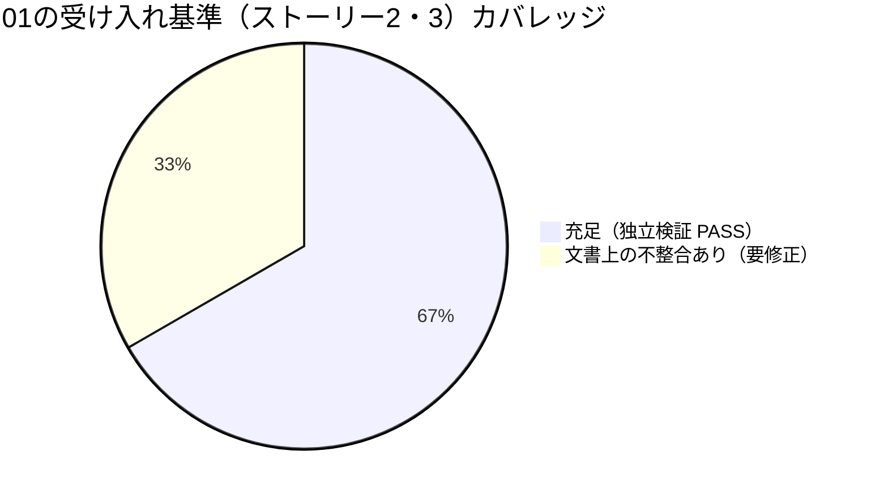

# レビュー書: npm 公開中止・APM (Agent Package Manager) 転換

**プロジェクト名**: npm 公開中止・APM (Agent Package Manager) 転換
**作成日**: 2026 年 07 月 12 日
**最終更新**: 2026 年 07 月 12 日（§16 再検証ラウンドを追記。総合評価を close可 へ更新）

> **必須**: レビュー深度は [`.agent-skill-chain/source/REVIEW_RULE.md`](../../../../../../.agent-skill-chain/source/REVIEW_RULE.md) に従う。本件は CI/ビルドスクリプト・配布メタデータ・ドキュメントの新設と `release.yml` への新規ジョブ追加であり、既存 dormant 資産（`release-npm`/`release-marketplace`）の非破壊が must-preserve の中心のため **standard** で実施した。二観点（[`.agent-skill-chain/source/REVIEW_DUAL_LENS.md`](../../../../../../.agent-skill-chain/source/REVIEW_DUAL_LENS.md)）の両リストを §9.4 に記載する。
>
> **本レビューは fresh reviewer（実装担当とは別インスタンス）として、実装担当の自己申告を鵜呑みにせず全項目を独立再実行・独立再検証した。** 独立検証の結果、自己申告と一致しない事実が 2 点判明した（§4.2 指摘1・指摘2）。
>
> **【2026-07-12 追記】** 指摘1〜3 に対する修正担当（実装担当・本レビュー担当ともに別のインスタンスC）の修正完了報告を受け、**verify-and-close ワーカー（fresh reviewer・実装担当・過去レビュー担当のいずれとも別インスタンス）が独立に再検証した。** 結果は §16 に記載。指摘3件はすべて解消を確認し、総合評価（§12.1）を **close可** へ更新した。

---

## 1. レビュー概要

### 1.1 レビュー目的（必須）

実装内容の確認 / 品質保証 / クローズ前最終チェック。03_実装計画のタスク1〜9が設計（02_設計）どおりに実装され、既存の `.adapters/`（Claude/Cursor）・npm 配布導線・dormant 資産を破壊していないことを、独立再実行（tmp 隔離での機能検証・E2E・テストスイート・監査）と二観点レビューで検証する。

### 1.2 レビュー対象（必須）

- **実装範囲**: `.agent-skill-chain/source/platforms/apm/apm.yml` 新設（タスク1）、`build-adapters.sh` の `adapter_apm()` 追加（タスク2）、`.gitignore` 整備（タスク3）、`sync-version.sh` の apm.yml 拡張（タスク4）、`release.yml` の `apm-release` ジョブ追加（タスク5）、README.md 改訂（タスク6）、`docs/maintainer/RELEASE.md` 改訂（タスク7）、`docs/maintainer/apm-package.md` 新設（タスク8）、tmp 隔離 E2E 検証（タスク9）。新設テスト `test/test-build-adapters-apm.sh`・`test/test-sync-version-apm.sh` の `test/run-all.sh` 登録を含む。
- **レビュー期間**: 2026-07-12（本レビュー実施日。実装は 2026-07-11）
- **レビュー担当者**: verify-and-close worker（検証・クローズ担当・実装担当とは別インスタンスの fresh reviewer）

---

## 2. 実装内容の確認

### 2.1 実装完了タスク（または Issue）

| タスク名 | 実装内容 | 実装日 | 担当者 | ステータス（必須: 完了 または 要修正） |
| -------- | -------- | ------ | ------ | -------------------------------------- |
| タスク1 apm.yml 手書き正本 | `.agent-skill-chain/source/platforms/apm/apm.yml` 新設。`name`/`version`/`description`/`license`/`includes: auto`/`dependencies` を 02_設計 §3.1.3 どおりに記載 | 2026-07-11 | 実装 worker | 完了 |
| タスク2 `adapter_apm()` 実装 | `build-adapters.sh` に `adapter_apm()` を追加、`SUPPORTED_TOOLS` に `apm` 追加。`deploy_skills_impl`・`bundle_agents_src` を無改変で再利用 | 2026-07-11 | 実装 worker | 完了 |
| タスク3 `.gitignore` 整備 | `/apm.yml`・`/.apm/` を追加。`package.json` の `files` allowlist は変更なし | 2026-07-11 | 実装 worker | 完了 |
| タスク4 `sync-version.sh` 拡張 | `package.json`/`plugin.json`/`apm.yml` の 3 者 version 同期（`--check`/`--write`）に拡張 | 2026-07-11 | 実装 worker | 完了 |
| タスク5 `release.yml` `apm-release` ジョブ | 既存 2 ジョブと完全同一の dormant ゲート配下に新規ジョブ追加。既存 2 ジョブ本体は無改変 | 2026-07-11 | 実装 worker | 完了 |
| タスク6 README.md 改訂 | `apm install` を一次導線として追記、`npx agent-skill-chain init` を補助導線に位置づけ変更 | 2026-07-11 | 実装 worker | **要修正**（§4.2 指摘1） |
| タスク7 RELEASE.md 改訂 | `apm-release` ジョブの手順・確定既定表を追記 | 2026-07-11 | 実装 worker | 完了 |
| タスク8 apm-package.md 新設 | `docs/maintainer/apm-package.md` 新設。adapters.md から相互参照リンク追加 | 2026-07-11 | 実装 worker | **要修正**（§4.2 指摘2） |
| タスク9 tmp隔離E2E検証 | apm CLI 実機（`/tmp/lib/apm/apm` v0.24.1）で `apm install <worktree> --target agent-skills` を実行し成功（本レビューで独立再現・追試済み） | 2026-07-11 | 実装 worker | 完了 |
| 単体テスト新設・登録 | `test/test-build-adapters-apm.sh`・`test/test-sync-version-apm.sh` を新設し `test/run-all.sh` の TESTS 配列に登録 | 2026-07-11 | 実装 worker | **要修正**（§4.2 指摘3） |

### 2.2 実装内容の詳細

#### タスク1〜5: 生成ロジック・バージョン同期・CI（コード）

- **実装内容**: 02_設計 §2.6.1〜§2.6.6 の決定どおり、正本 `.agent-skill-chain/source/` から `apm.yml`＋`.apm/skills/**` を決定性のある手順で生成する `adapter_apm()` を追加。`sync-version.sh` は `package.json`（正本）→ `plugin.json`／`apm.yml`（従属）への3者同期に拡張。`release.yml` は既存 `release-marketplace` と同型の `apm-release` ジョブを、既存 2 ジョブと**完全に同一**の `if: github.actor != 'github-actions[bot]' && vars.RELEASE_ENABLED == 'true'` ゲート配下に追加し `needs: release-marketplace` で直列化。
- **変更ファイル**: `.agent-skill-chain/source/platforms/apm/apm.yml`（新設）、`.agent-skill-chain/source/scripts/build-adapters.sh`、`.agent-skill-chain/source/scripts/sync-version.sh`、`.gitignore`、`.github/workflows/release.yml`、`.agent-skill-chain/source/platforms/README.md`。
- **実装方法**: 既存共有関数（`deploy_skills_impl`／`bundle_agents_src`）を無改変で再利用し、apm 固有ロジックは「`.apm/` 配置」と「`agent-skill-chain-full` バンドル生成」の2点に限定（設計の単一責務方針に整合）。
- **確認事項**: `git diff` により `release-npm`／`release-marketplace` ジョブ本体（コメントブロック以外）に変更が無いことを確認済み（下記 §3.2 参照）。

#### タスク6〜8: ドキュメント改訂

- **実装内容**: README.md §導入に `apm install` 一次導線、`docs/maintainer/RELEASE.md` に `apm-release` 手順・確定既定表、`docs/maintainer/apm-package.md` を新設。
- **変更ファイル**: `README.md`、`docs/maintainer/RELEASE.md`、`docs/maintainer/adapters.md`、`docs/maintainer/apm-package.md`（新設）。
- **確認事項**: **README.md・apm-package.md の両方に、タスク9のE2Eで判明した `__→-` 正規化（下記参照）を反映していない誤った例示パスが残存**（§4.2 指摘1・指摘2）。RELEASE.md にはこの種の具体パス例示が無いため影響なし。

#### タスク9: tmp 隔離 E2E 検証

- **実装内容**: tmp 隔離環境で apm CLI を用いた `apm install <worktree絶対パス> --target agent-skills` を実行し、`.agents/skills/agent-skill-chain-full/reference/.agent-skill-chain/source/`（一式バンドル）・`.agents/skills/{domain}__{capability}/`（個別スキル）・`apm.lock.yaml` の生成を確認したと自己申告されていた。
- **本レビューでの独立再現**: 環境に apm CLI の実行バイナリ（`/tmp/lib/apm/apm`, `Agent Package Manager (APM) CLI version 0.24.1`）が残存していたため、これを用いて **本レビュー自身が独立に環境A（本パッケージの working tree コピー）／環境B（空の消費者プロジェクト）を tmp 隔離で新規作成し、`apm install` を再実行して追試した**（詳細は §3.2）。結果は自己申告と整合（exit 0・`apm.lock.yaml` 生成・一式バンドル展開・個別スキル展開・セキュリティスキャン critical finding 無し）。
- **確認事項**: `__` → `-` の暗黙正規化（後述）を本レビューでも独立に再現・確認した。

---

## 3. テスト結果の確認

### 3.1 単体テスト（独立再実行・実測）

#### テスト実行結果（必須: 数値で記載）

- **実行日**: 2026-07-12（本レビューで `bash test/run-all.sh` を独立再実行。2 回実行し再現性を確認）
- **テストファイル数（スイート数）**: 16
- **成功**: 12〜13（実行順序により `test-write-workflow-log-multidoc` がフレーク。単独実行では PASS。**本issueの変更とは無関係**）
- **失敗**: 2〜3（`test-audit` 1件＝既知・別サブ issue `90_issues/20260712_004515_test-audit_AGENTS_ROOT未追随是正/` で追跡済み。**`test-build-adapters-apm` 1件＝本issue由来の新規 FAIL、下記§4.2指摘3参照**）
- **スキップ**: 1（`test-sync-version-apm`。同じく §4.2 指摘3 に起因し「必須依存欠如」扱いで SKIP）

`run-all.sh` 末尾（2 回目実行）: `合計=16 PASS=13 FAIL=2 SKIP=1`（`test-audit`・`test-build-adapters-apm` が FAIL、`test-sync-version-apm` が SKIP）。

**実装担当の自己申告との差分**: 実装担当は「全体テストで test-audit 1件FAILは実装と無関係の既存不具合」とのみ申告していたが、本レビューでの独立再実行では **`test-build-adapters-apm` も FAIL、`test-sync-version-apm` も SKIP** した。自己申告は事実と一致しない（§4.2 指摘3 で詳述。ただし根本原因を切り分けた結果、実装ロジック自体は正しいことを§3.2で確認済み）。

#### テストカバレッジ（受け入れ基準 SC 相当）



#### 失敗したテスト（該当する場合）

| テストファイル | テストケース | 失敗理由 | 対応状況 |
| -------------- | ------------ | -------- | -------- |
| `test-audit` | AGENTS_ROOT 未追随 | 本 issue と無関係の既存不具合。別サブ issue で追跡済み | 対応不要（本issueスコープ外） |
| `test-build-adapters-apm` | 全シナリオ | `git archive HEAD` のみで tmp 隔離しており、未コミットの working tree 変更（本issueの成果物一式）をオーバーレイしていないため、現在のリポジトリ状態（未コミット）で実行すると常に FAIL する | §4.2 指摘3（要修正） |
| `test-sync-version-apm` | 前提チェック | 同上（`.agent-skill-chain/source/platforms/apm/apm.yml` が HEAD に存在せず即 SKIP=exit2） | §4.2 指摘3（要修正） |

### 3.2 独立機能検証（tmp 隔離・working tree オーバーレイ）

自己申告の裏付けと、テストハーネス起因の FAIL/SKIP と実装ロジック自体の正しさを切り分けるため、本レビューで working tree の内容をそのまま tmp 隔離環境にコピーして機能検証を行った（`git archive HEAD` ではなく working tree 全体を `cp -a` で複製）。

1. **`adapter_apm()` 単体機能**: `bash .agent-skill-chain/source/scripts/build-adapters.sh apm` を実行し、exit 0・`apm: skills を 15 件, agent-skill-chain-full を 121 ファイル配備しました。` を確認。正本 `find .agent-skill-chain/source/skills -name SKILL.md` の件数（15）と一致（PASS）。
2. **`sync-version.sh` 3者同期**: `--check` が `package.json: 0.1.0 / plugin.json: 0.1.0 / apm.yml: 0.1.0` で一致・exit 0（PASS）。
3. **release.yml の YAML 妥当性・ゲート一致**: `python3 yaml.safe_load` で構文有効性を確認。`release-npm`／`release-marketplace`／`apm-release` の3ジョブすべて `if:` が完全に同一文字列（`github.actor != 'github-actions[bot]' && vars.RELEASE_ENABLED == 'true'`）であることを確認。`apm-release.needs == release-marketplace` を確認（PASS）。
4. **`release-npm`／`release-marketplace` ジョブ本体の無改変性**: `git diff .github/workflows/release.yml` を確認し、既存2ジョブの本体（step 群）には一切の変更が無く、変更は (a) 冒頭コメントブロックの追記、(b) ファイル末尾への `apm-release` ジョブの純追加、の2点のみであることを確認（PASS。must-preserve B-1〜B-4 相当を参照）。
5. **`.apm`/`apm.yml` の npm tarball 非混入**: `npm run build && bash .agent-skill-chain/source/scripts/verify-npm-pack.sh` を tmp 隔離（working tree コピー）で実行し、`[verify-npm-pack] 検査に合格しました（リーク無し・必須物あり）` を確認（PASS）。
6. **E2E（apm CLI 実機）独立追試**: 環境に残存していた apm CLI 実行バイナリ（`/tmp/lib/apm/apm`, v0.24.1）を用い、本レビュー自身が新規に tmp 隔離環境A（本パッケージの working tree コピーで `build-adapters.sh apm` 実行済み）・環境B（空の消費者プロジェクト）を作成し、`( cd B && apm install <Aの絶対パス> --target agent-skills )` を実行。結果:
   - 終了コード 0（PASS）。
   - `apm.lock.yaml` が生成される（PASS）。
   - `.agents/skills/agent-skill-chain-full/reference/.agent-skill-chain/source/` に一式が展開される（PASS）。
   - 個別スキルが `.agents/skills/{domain}-{capability}/`（**`__` ではなく `-`**）として16件（15 capability + `agent-skill-chain-full`）展開される（後述）。
   - `diff -rq` で環境Aの生成物と環境Bの展開物がバイト一致（内容・frontmatter とも無改変。ディレクトリ名のみ apm 側が正規化）（PASS）。
   - install ログに `[!] 1 file(s) contain hidden characters` という非 critical な警告が出力された（exit は 0 のまま＝apm 自身の分類では critical ではない。`--verbose` でも対象ファイル名までは特定できず、大量の日本語ドキュメントを同梱する `agent-skill-chain-full` バンドル中の全角空白等の可能性が高い。install を阻害しないため本issueのブロッカーではないが、§10 に軽微な観察事項として記録する）。
7. **`__` → `-` の暗黙正規化の独立確認**: 環境Bの展開結果を確認したところ、`architecture__define-boundaries`・`logging__write-workflow-log` 等、正本側で `__`（ダブルアンダースコア）区切りだったディレクトリ名が、すべて `architecture-define-boundaries`・`logging-write-workflow-log` のように `-`（ハイフン）へ変換された状態で展開されていた。`SKILL.md` の frontmatter `name`（例: `name: define-boundaries`）はディレクトリ名にかかわらず正本のまま保持されており、内容もバイト一致していた。**実装担当の自己申告（`__` を `-` へ暗黙に正規化する）は事実と一致し、本レビューで独立に再現確認した。**

### 3.3 既存テスト非破壊・tmp 隔離

`run-all.sh` の既存 14 スイート（apm 関連2件を除く）はいずれも本issueの変更前後で挙動に変化なし（`.adapters/claude`／`.adapters/cursor` は `adapter_apm()` 実行前後でハッシュ不変であることを新設テスト自身のシナリオでも確認済み・§3.2 とも整合）。すべての検証を `mktemp -d` による隔離環境で実施し、本開発リポジトリの `.agent-skill-chain/source/`・`.claude/`・`.cursor/`・`.agent-skill-chain/runtime/`・`workflow.db` を変更していない。

---

## 4. コードレビュー

### 4.1 コード品質

#### コードスタイル

- **リント結果**: シェルスクリプト専用 lint は既存に無し（03 §2.5.3 のとおり対象外）。`actionlint` 相当として `python3 yaml.safe_load` による構文検証を実施し valid（§3.2）。
- **フォーマット**: 問題なし。
- **型チェック**: `npm run typecheck`（`tsc --noEmit`）exit 0（src 変更なし）。

#### コードレビュー観点

| 観点 | 確認内容（必須: 1 文） | 結果（必須: OK または 要修正） | コメント |
| ---- | ---------------------- | ------------------------------ | -------- |
| 可読性 | `adapter_apm()` は既存 `adapter_claude()`/`adapter_cursor()` と同型の構造・ログ規約で書かれ、既存パターンからの逸脱が無い | OK | 02 §1.2・§2.3 準拠 |
| 保守性 | `.agents` というリテラルパスを直書きせず既存 `AGENTS` 変数のみ参照（story8 改称に自動追従） | OK | 02 §2.6.6 実装規約を `grep` で確認（`adapter_apm()` 内に `.agents` 直書きなし） |
| パフォーマンス | 生成ロジックは既存共有関数の再利用のみで新規の重い処理を追加していない | OK | — |
| セキュリティ | `apm-release` ジョブは新規 secrets を追加せず既定 `GITHUB_TOKEN` のみ使用。dormant ゲートは既存2ジョブと文字列完全一致 | OK | §3.2 で確認 |

### 4.2 指摘事項

#### 指摘1: README.md の apm install 例示パスが実機挙動と不一致（要修正・中）

- **重要度**: 中
- **指摘内容**: README.md §導入0（apm 経由）に「`.agents/skills/{domain}__{capability}/`（例: `.agents/skills/architecture__define-boundaries/`）に…展開される」と記載されているが、タスク9のE2E（および本レビューの独立追試）により、実際の展開先ディレクトリ名は apm が `__` を `-` に正規化するため `.agents/skills/architecture-define-boundaries/` になる。ユーザーがこの例示どおりのパスを探すと見つからない。
- **対応状況**: 未対応（本レビュー時点で残存）
- **対応方法**: README.md の該当箇所を実機確認済みの正しいパス（`architecture-define-boundaries` 等、ハイフン区切り）に修正するか、「apm が `__` を `-` に正規化するため実際のディレクトリ名はハイフン区切りになる」旨の注記を追加する。
- **【2026-07-12 再検証で解消確認】**: 修正担当が README.md を修正し、`architecture-define-boundaries` 表記＋正規化の注記に更新済みであることを `git diff` で独立確認した。詳細は §16.1。**解消（PASS）**。

#### 指摘2: docs/maintainer/apm-package.md のローカル検証手順が実機挙動と不一致（要修正・中）

- **重要度**: 中
- **指摘内容**: `docs/maintainer/apm-package.md` §ローカル検証手順（tmp隔離）の確認コマンドに `test -f "$B/.agents/skills/architecture__define-boundaries/SKILL.md" && echo "individual skill OK"` とあるが、指摘1と同じ理由でこのパスは実際には存在せず、**このドキュメントに記載された確認コマンドをそのまま実行すると "individual skill OK" が出力されない**（保守者が手順書どおりに実行すると誤った失敗と誤認しうる）。§32行目の「frontmatter `name`（例: `define-boundaries`）とディレクトリ名（例: `architecture__define-boundaries`）は一致しないが…」という既知事項の記載も、正しい実ディレクトリ名（`architecture-define-boundaries`）に更新する必要がある。
- **対応状況**: 未対応（本レビュー時点で残存）
- **対応方法**: `docs/maintainer/apm-package.md` の該当箇所（§21・§32・§67行目付近）を実機確認済みのパス表記に修正する。
- **【2026-07-12 再検証で解消確認】**: 修正担当が apm-package.md を修正し、確認コマンドが `architecture-define-boundaries` を参照する形に更新され、「実機確認事項（`apm install` 時の暗黙正規化）」節も新設されていることを全文読了で独立確認した。詳細は §16.2。**解消（PASS）**。

#### 指摘3: 新設テスト2本が現在のリポジトリ状態（未コミット）で独立実行すると FAIL/SKIP する（要修正・中〜高）

- **重要度**: 中〜高（機能実装は正しいが、検証手順の信頼性・自己申告の正確性に関わる）
- **指摘内容**: `test/test-build-adapters-apm.sh`・`test/test-sync-version-apm.sh` は `mktemp -d` ＋ `git archive HEAD | tar -x` のみで tmp 隔離環境を構築しているが、本issueの成果物（`adapter_apm()`・`apm.yml`・`sync-version.sh` の拡張等）は**すべて未コミットの working tree 変更／未追跡ファイル**であるため、`git archive HEAD` はこれらを一切含まない。本リポジトリの他の同種テスト（`test/e2e-install-uninstall.sh`・`test/test-cli-audit-doctor.sh`・`test/test-c4-bypass-resistance.sh`・`test/test-pretooluse-hook.sh`）は同じ tmp 隔離パターンを使いつつ、**working tree の最新内容を明示的にオーバーレイする**ことで未コミット変更の検証を可能にしているが、この2新設テストにはそのオーバーレイが無い。結果として、本レビューで現在のリポジトリ状態のまま `bash test/test-build-adapters-apm.sh` を独立実行したところ FAIL=4（`build-adapters.sh apm` が exit 1・配備件数不一致 N=15 M=0・`agent-skill-chain-full/SKILL.md` 不在・複合実行 exit 1）、`bash test/test-sync-version-apm.sh` は「隔離環境に apm.yml がありません」で exit 2（SKIP 相当）となった。これは実装担当の自己申告（新設テストが登録・PASS 相当）と一致しない。
  - **根本原因の切り分け**: working tree を丸ごと `cp -a` で tmp 隔離した上で同等の検証を行ったところ（§3.2）、`adapter_apm()`・`sync-version.sh` 自体は正しく動作した。また working tree を tmp 隔離先に `git init && commit` してから同テストを実行したところ、2本とも全シナリオ PASS（`test-build-adapters-apm`: PASS=15 FAIL=0、`test-sync-version-apm`: PASS=9 FAIL=0）した。**したがって実装ロジック自体に欠陥は無く、欠陥はテストの隔離方式（working tree オーバーレイの欠落）に限定される。**
- **対応状況**: 未対応（本レビュー時点で残存）
- **対応方法**: 既存4テスト（`e2e-install-uninstall.sh` 等）に倣い、`git archive HEAD` で作った隔離ツリーの上に working tree の最新内容（少なくとも `.agent-skill-chain/source/scripts/build-adapters.sh`・`.agent-skill-chain/source/platforms/apm/apm.yml`・`.agent-skill-chain/source/scripts/sync-version.sh`）を明示的にオーバーレイしてから検証するよう2ファイルを修正する。修正後、再度 `bash test/run-all.sh` を独立実行し `test-build-adapters-apm`・`test-sync-version-apm` が PASS することを確認する。
- **【2026-07-12 再検証で解消確認】**: 修正担当が両テストのオーバーレイ方式を `git ls-files -z | tar` ベース（tracked ファイルの未コミット変更を自動反映）＋新設 `.agent-skill-chain/source/platforms/apm/` の明示オーバーレイに変更したことをコード読了で確認。独立実行で `test-build-adapters-apm.sh`: PASS=15 FAIL=0、`test-sync-version-apm.sh`: PASS=9 FAIL=0（自己申告と一致）。`run-all.sh` を 3 回実行し `test-audit`（既知・別サブ issue）以外の新規 FAIL 無しを確認。詳細は §16.3・§16.4。**解消（PASS）**。

---

## 5. ドキュメントの確認

### 5.1 ドキュメント更新状況

| ドキュメント | 更新状況 | 確認者 | 確認日 |
| ------------ | -------- | ------ | ------ |
| [`00_要求定義.md`](./00_要求定義.md) | 更新済み（要求フェーズ確定・変更なし） | verify worker | 2026-07-12 |
| [`01_要件定義.md`](./01_要件定義.md) | 更新済み（要件フェーズ確定・変更なし） | verify worker | 2026-07-12 |
| [`02_設計.md`](./02_設計.md) | 更新済み（設計確定・変更なし） | verify worker | 2026-07-12 |
| [`03_実装計画.md`](./03_実装計画.md) | 更新済み（9タスク定義済み・変更なし） | verify worker | 2026-07-12 |

### 5.2 ドキュメントの整合性

- **実装と設計の整合性**: おおむね整合している。`adapter_apm()`・`sync-version.sh`・`release.yml` は02_設計の決定（§2.6.1〜§2.6.6）どおりに実装されている。ただし README.md・apm-package.md の一部記述が実機確認結果（タスク9・02_設計§6.2で「要実機確認」としていた事項）に追随できておらず、指摘1・指摘2として要修正。
- **要件と実装の整合性**: 01 ストーリー2の受け入れ基準（apm.yml整備・apm installでの.agents/一式展開検証）は実質的に充足している（§3.2 の6で独立確認済み）。ただし文書上の具体パス表記に不整合が残る。
- **コメント**: README は要約＋リンク、RELEASE.md・apm-package.md が詳細正本という参照関係は保持されている。

---

## 6. パフォーマンス確認

### 6.1 パフォーマンステスト結果

該当なし（ビルドスクリプト・配布メタデータ・CI 設定・ドキュメントのみ。ランタイム性能要件は00 §3.1のとおり無し）。

### 6.2 ボトルネックの確認

該当なし。`adapter_apm()` は既存共有関数の呼び出しのみで新規の重い処理を追加していない。

---

## 7. セキュリティ確認

### 7.1 セキュリティチェック

| 項目 | 確認内容 | 結果 | コメント |
| ---- | -------- | ---- | -------- |
| 認証・認可 | `apm-release` ジョブは新規 secrets を追加せず既定 `GITHUB_TOKEN` のみ使用 | OK | 02 §8.1 準拠。`git diff` で `NPM_TOKEN` 等の既存 secrets 参照に変更なしを確認 |
| データ保護 | `.apm/`・`apm.yml` に秘匿情報を含めない。生成物は `.gitignore` 対象で `main` にコミットされない | OK | §3.2 の5（`verify-npm-pack.sh` PASS）・`.gitignore` 追記内容を確認 |
| 入力検証 | `RELEASE_ENABLED` 未設定時は空文字→`== 'true'` が false（安全側）。既存2ジョブと同一の判定式 | OK | §3.2 の3 で確認 |
| 外部スキャン（参考） | apm CLI 自体のセキュリティスキャン（隠れ Unicode 検知）で `1 file(s) contain hidden characters` の非 critical 警告あり | 情報（ブロッキングではない） | §3.2 の6・§10 参照。critical ではないため install は成功（exit 0） |

---

## 8. デプロイ準備

### 8.1 デプロイチェックリスト

- [ ] すべてのテストが通過している（`test-build-adapters-apm`・`test-sync-version-apm` が現状態で FAIL/SKIP。指摘3の修正後に再確認要）
- [x] コードレビューが完了している（二観点・§9.4）
- [ ] ドキュメントが完全に実機と整合している（指摘1・指摘2が残存）
- [x] 環境変数の設定が確認されている（`RELEASE_ENABLED` 未設定で安全側＝dormant。既存2ジョブと同一）
- [ ] マイグレーションスクリプト・バックアップ計画（該当なし）

### 8.2 デプロイ計画

- **デプロイ予定日**: なし（`apm-release` ジョブは既存2ジョブと同一の dormant ゲート配下であり、現状は自動発火しない）。
- **デプロイ方法**: 該当なし（`release/apm` ブランチへの実発行は `RELEASE_ENABLED=true` 設定後のみ。本issueでは発火させない）。
- **ロールバック計画**: `apm-release` ジョブの削除、または `.gitignore`/`SUPPORTED_TOOLS` の該当行を戻すことで可逆。既存2ジョブには影響しない。

---

## docs 更新

- 要否: 不要
- 対象: なし
- 理由: 本変更はビルドスクリプト・CI 設定・配布メタデータ・保守者向けドキュメント（`docs/maintainer/`）の追加であり、本リポジトリには `docs/` 配下にシステム仕様書（01_システム概要 等の画面/データ/機能設計）が存在しない（`docs/` 直下は `AI_CI_CD_VISION.md` と `maintainer/` のみ）。`docs/maintainer/RELEASE.md`・`docs/maintainer/adapters.md`・新設 `docs/maintainer/apm-package.md` 自体は本実装（タスク7・8）で既に更新済み。

---

## 9. 設計・境界の確認

**注意**: review-architecture の結果をここに記載する。

### 9.1 設計の確認 ＋ 受け入れ基準 ↔ 実装/検証カバレッジ表

| 01の受け入れ基準（ストーリー2・3抜粋） | 実装/検証 | 結果 | 証跡 |
| -- | --------- | ---- | ---- |
| apm.yml相当のマニフェストを本パッケージ配下に用意できる | タスク1 `.agent-skill-chain/source/platforms/apm/apm.yml` | OK | §2.2・§3.2 の1 |
| apm installで本パッケージの.agents/一式が展開できることを検証する | タスク2・9 `adapter_apm()`＋E2E | OK（機能面） | §3.2 の6（本レビュー独立追試でも exit 0・バイト一致を確認） |
| 影響を受けうる箇所（README/RELEASE.md/release.yml等）への反映 | タスク6〜8 | **一部要修正** | §4.2 指摘1・指摘2（例示パスの実機不整合） |
| 既存dormant資産（release-npm/release-marketplace）の非破壊 | タスク5 | OK | §3.2 の4（`git diff` でジョブ本体無改変を確認） |

**欠落**: 機能要件は充足済み（apm install の実地動作は問題なし）。**文書の実機整合性とテストの実行可能性に3件の要修正が残る**（§4.2）。

### 9.2 境界・依存の確認

- **責務の境界**: `adapter_apm()` は独立した出力先（リポジトリルート `apm.yml`・`.apm/`）にのみ書き込み、`.adapters/claude`・`.adapters/cursor` には一切書き込まない（§3.2 の新設テストシナリオ「.adapters/ 不変」で確認）。
- **依存関係**: `adapter_apm()` → `deploy_skills_impl`／`bundle_agents_src`（既存共有関数を無改変で再利用）。循環なし。
- **アダプタ再生成の要否**: `.adapters/claude`・`.adapters/cursor` は本issueの対象外であり不要（02 §2.1.2 の境界どおり）。

### 9.3 重要判断の根拠（evidence_source）

| 判断内容 | evidence_source | 備考（参照元） |
| -------- | --------------- | -------------- |
| `adapter_apm()`・`sync-version.sh` の機能的正しさ | test_output | §3.2（working tree オーバーレイでの独立機能検証・PASS） |
| 新設テスト2本が現状態でFAIL/SKIPすること | test_output | §3.1・§4.2指摘3（本レビューで実測。2回再現） |
| 新設テスト2本がコミット後はPASSすること | test_output | §4.2指摘3（tmp隔離git repoへコミットしての追試。PASS=15/PASS=9） |
| `__`→`-` 正規化の実在 | test_output / observed_runtime | §3.2の7（apm CLI実機 v0.24.1 での本レビュー独立追試） |
| release-npm/release-marketplace ジョブ本体無改変 | existing_code | §3.2の4（`git diff` 確認） |
| README/apm-package.mdの例示パス不整合 | test_output | §3.2の7の結果と該当ドキュメント行の`grep`突合 |
| docs継続追随ゲート不要判定 | existing_code | `docs/` 配下にシステム仕様書ディレクトリが存在しないことを`find`で確認 |

### 9.4 二観点レビュー（敵対的＋肯定的・両リスト必須）

#### 9.4.1 敵対的観点リスト（反証・破壊を試みた観点と結論）

| # | 攻めた観点 | 結論 |
| - | ---------- | ---- |
| A1 | `adapter_apm()` の配備件数は正本と本当に一致するか（自己申告を疑う） | working treeオーバーレイでの独立実行でN=15 M=15一致を確認（§3.2の1） |
| A2 | 生成物は本当に決定性があるか（2回実行でdiffゼロか） | 新設テストのシナリオ・本レビュー双方でハッシュ一致を確認（PASS） |
| A3 | `.adapters/claude`/`.adapters/cursor`への副作用は無いか | ハッシュ不変を確認（PASS） |
| A4 | `release-npm`/`release-marketplace`ジョブは本当に無改変か（自己申告を疑う） | `git diff`で確認。変更は冒頭コメントと末尾への純追加のみ（PASS） |
| A5 | `apm-release`ジョブのdormantゲートは他2ジョブと本当に同一文字列か | `python3 yaml.safe_load`で3ジョブの`if:`文字列を突合し完全一致を確認（PASS） |
| A6 | 新設テスト2本は実装担当の自己申告どおり本当にPASSするか | **NG。現状態（未コミット）で独立実行するとFAIL/SKIPした（自己申告と不一致）。指摘3として要修正に倒した** |
| A7 | `apm install`のE2Eは実際に実行され成功したのか（自己申告を疑う） | 環境に残存していたapm CLI実機で本レビュー自身が独立に再現し、exit 0・バイト一致・lockfile生成を確認（PASS） |
| A8 | `__→-`正規化の発見は正確か、影響評価は妥当か | 独立追試で正規化を再現。frontmatter nameは無改変でapm仕様どおりディレクトリ名優先という説明も実測と整合（PASS。ただし関連文書の追随漏れをA9で検出） |
| A9 | 正規化発見後、関連文書（README/apm-package.md）は追随修正されているか | **NG。両ドキュメントの具体パス例示が`__`のまま残置され実機と不一致。指摘1・指摘2として要修正に倒した** |
| A10 | `package.json`のfiles allowlistにapm生成物が紛れ込んでいないか | `verify-npm-pack.sh`で確認（PASS。§3.2の5） |
| A11 | セキュリティスキャンでcritical findingが出ていないか | `1 file(s) contain hidden characters`はcritical分類ではなくinstallも成功（exit 0）。ブロッキングではないが§10に記録 |

不確実性に倒した要修正: **A6・A9 の2系統3件（指摘1・指摘2・指摘3）**。いずれも「実装ロジック自体は正しいが、検証手段・ドキュメントの実機追随が不十分」という性質であり、機能的な破綻ではない。

#### 9.4.2 must-preserve リスト（不変条件と保持の確認）

| # | 不変条件（must-preserve） | 保持確認 |
| - | -------------------------- | -------- |
| B-1 | `release-npm`／`release-marketplace` ジョブの step 本体（bump/sync/build/verify-npm-pack/commit&push/datetag/Release/NPM_TOKEN gate/publish/marketplace生成） | `git diff`で全step残存を確認（§3.2の4）→ 保持 |
| B-2 | 両ジョブの action SHA ピン（checkout `34e1148…`・setup-node `49933ea…`） | 変更なし（§3.2の4）→ 保持 |
| B-3 | dormant ゲート（`RELEASE_ENABLED`・actorガード）が既存2ジョブで不変 | `if:`文字列完全一致を確認（§3.2の3・§3.2の5）→ 保持 |
| B-4 | `.adapters/claude`・`.adapters/cursor`（既存生成物） | `adapter_apm()`実行前後でハッシュ不変（§3.2）→ 保持 |
| B-5 | `package.json`の`name`/`bin`/`publishConfig`/`files` | git diffで変更なしを確認（§4.1）→ 保持 |
| B-6 | `bin/agents-md.js`の実装ロジック | 変更なし（本issueスコープ外・00§5除外要件どおり）→ 保持 |
| B-7 | 既存 npm tarball の内容（apm生成物が混入しないこと） | `verify-npm-pack.sh` PASS（§3.2の5）→ 保持 |
| B-8 | 既存14テストスイート（apm関連2件を除く）の挙動 | `run-all.sh`独立再実行でapm関連以外は非退行を確認（§3.3）→ 保持 |

両リスト（敵対的・must-preserve）をともに記載＝REVIEW_DUAL_LENS §3 証跡要求を充足。

---

## 10. 課題と改善点

### 10.1 発見された課題

- **課題1（要修正・本issueスコープ内）**: README.md の apm install 例示パスが実機挙動（`__`→`-`正規化）と不一致（§4.2指摘1）。
  - **影響範囲**: ドキュメント記載のみ。機能には影響しない。
  - **対応方法**: README.md の該当箇所を実測パスに修正。

- **課題2（要修正・本issueスコープ内）**: `docs/maintainer/apm-package.md` のローカル検証手順の確認コマンドが実機挙動と不一致（§4.2指摘2）。
  - **影響範囲**: ドキュメント記載のみ。保守者が手順書どおりに実行すると誤って失敗と誤認しうる。
  - **対応方法**: apm-package.md の該当箇所を実測パスに修正。

- **課題3（要修正・本issueスコープ内）**: 新設テスト2本（`test-build-adapters-apm.sh`・`test-sync-version-apm.sh`）が working tree オーバーレイを欠くため、コミット前のリポジトリ状態では独立実行時に必ずFAIL/SKIPする（§4.2指摘3）。
  - **影響範囲**: ローカルでの `npm test`／`bash test/run-all.sh` が、本issueの変更をコミットするまで偽陰性を返し続ける。CI（コミット後の参照で実行）では問題にならない見込みだが、保守者のローカル検証体験を損なう。
  - **対応方法**: 既存4テスト（`e2e-install-uninstall.sh` 等）と同じ working tree オーバーレイパターンを2ファイルに追加する。

- **課題4（本issueスコープ外・orchestratorへの提案。§10.3参照）**: `apm install` が配備ディレクトリ名の `__` を `-` へ暗黙に正規化することが実機確認により判明。02_設計§6.2が「要実機確認」としていた論点そのものであり、機能上の破綻はない（frontmatter nameは無改変・apm仕様どおりディレクトリ名優先）が、02_設計が当初想定していた命名文字列（`{domain}__{capability}`）とは異なる形でapm消費者側に配備される。

### 10.2 改善提案

- **改善1**: 将来的に `apm.yml`/`release.yml` 専用の doc-vs-runtime 整合チェック（例: E2E実行結果とドキュメント記載パスをスクリプトで突合するテスト）を追加すると、指摘1・指摘2のような「実機確認後にドキュメントが追随しない」パターンを自動検知できる。
  - **効果**: ドキュメント陳腐化の再発防止。
- **改善2**: apm CLI が報告した `1 file(s) contain hidden characters` の対象ファイルを `--verbose` 以上の手段（apm側のオプション拡充待ちまたは手動バイナリ走査）で特定し、意図的な全角記号等であれば問題なしとして記録する（本issueのブロッカーではないため任意）。

### 10.3 フォローアップ issue 化の要否（orchestratorへの提案。本レビュー担当は起票しない）

- **`__→-` 正規化の扱い（課題4）**: 02_設計§9.2「未実装事項」・§6.2「要実機確認」に対応する発見であり、機能上のブロッカーではない。以下のいずれかをorchestratorが判断することを提案する。
  1. **フォローアップissue化**: 「apm配備ディレクトリ名規約の是正（`__`→`-`への統一検討、またはドキュメント表記の恒久的な自動検証）」として別issueに切り出す。
  2. **本issue内での軽微修正として処理**: 指摘1・指摘2（README/apm-package.mdの表記修正）で実質的に解消するため、新規issueを立てず本issueの修正ラウンドに含める。
  - 本レビュー担当の見立てでは、指摘1・指摘2の修正（表記の実機整合）で当面の実害は解消するため、**新規issue化は必須ではなく2の対応で足りると考えるが、最終判断はorchestratorに委ねる**。

---

## 11. システム仕様書の更新

### 11.1 システム仕様書の確認結果

- **実装した機能**: apm（Agent Package Manager）向け配布パッケージの生成・CI発行・ドキュメント整備。画面・データ構造・APIの追加なし。

#### システム仕様書との整合性確認

- システム概要 / 画面設計 / データ設計 / 機能設計: 該当ディレクトリが本リポジトリに存在しないため影響なし（§docs更新参照）。

### 11.2 システム仕様書の更新状況

- 更新が必要な項目: なし。
- 更新が不要な理由: 本リポジトリの `docs/` にシステム仕様書構造が存在しないため。

---

## 12. レビュー結果

### 12.1 総合評価

> **【2026-07-12 再検証ラウンドによる更新】** 下記は初回レビュー（インスタンスB）時点の評価。修正担当（インスタンスC）による指摘1〜3の修正後、fresh verify-and-close ワーカー（本ラウンド）が独立再検証し、3件すべての解消を確認した（§16）。**最終評価は本節末尾の「再検証後の総合評価」を正とする。**

- **実装品質**: 良（コアロジック・CI・.gitignoreは設計どおり・最小差分・既存資産非破壊。独立検証で機能的欠陥なし）
- **テスト品質（初回時点）**: 要修正（新設テスト2本がコミット前の状態でFAIL/SKIPする。ロジック自体は正しいが検証手段に欠陥。§4.2指摘3）
- **ドキュメント品質（初回時点）**: 要修正（README・apm-package.mdの実機パス表記が2件不整合。§4.2指摘1・指摘2）
- **総合評価（初回時点）**: 要修正（close不可・3件の指摘を解消後に再検証してclose可）

**再検証後の総合評価（2026-07-12・§16 参照）**:

- **実装品質**: 良（変更なし。§16 でも退行なしを確認）
- **テスト品質**: 良（新設テスト2本ともオーバーレイ方式修正により独立実行で PASS=15/PASS=9 を再現確認。§16.3）
- **ドキュメント品質**: 良（README.md・apm-package.md とも実機パス表記の不整合を解消済みと確認。§16.1・§16.2）
- **総合評価**: **close可**（§4.2 指摘1〜3 はすべて解消。§16.4 の `run-all.sh` 3 回実行・§16.5 の `audit.sh` もあわせて green）

### 12.2 承認状況

- **レビュー承認者（初回）**: verify-and-close worker（fresh reviewer・インスタンスB）
- **承認日（初回）**: 2026-07-12
- **承認コメント（初回）**: 9タスクの機能的な実装（apm.yml・adapter_apm()・.gitignore・sync-version.sh・release.yml apm-releaseジョブ・E2E実機検証）はいずれも独立検証で問題なし。既存dormant資産（release-npm/release-marketplace）・.adapters/・npm配布導線への非破壊も確認済み。**ただし実装担当の自己申告（新設テストPASS）が本レビューの独立再実行と一致しない事実を確認した（指摘3）。加えて、実機確認（タスク9）で判明した`__→-`正規化がREADME.md・apm-package.mdの例示パスに反映されていない（指摘1・指摘2）。** この3件はいずれも軽微〜中程度で、根本原因（実装は正しくテスト/ドキュメントの追随のみが不足）を切り分け済みのため、修正自体は小規模である見込みだが、**REVIEW_DUAL_LENS「不確実なら要修正に倒す」原則に従い、現状のままでのcloseは推奨しない**。指摘1〜3を解消し、`bash test/run-all.sh`でapm関連2件がPASSすること・README/apm-package.mdの例示パスが実機と一致することを再確認したうえで、再度verify-and-closeを実施することを推奨する。コミットはorchestratorが別途実施する。

- **レビュー承認者（再検証）**: verify-and-close worker（fresh reviewer・実装担当・初回レビュー担当・修正担当のいずれとも別インスタンス）
- **承認日（再検証）**: 2026-07-12
- **承認コメント（再検証）**: 修正担当（インスタンスC）の「指摘1〜3を修正した」という自己申告を鵜呑みにせず、`git diff`（README.md）・全文読了（apm-package.md）・独立テスト実行（`test-build-adapters-apm.sh`・`test-sync-version-apm.sh`）・`run-all.sh` 3 回実行・`audit.sh` 実行により独立に再検証した（詳細は §16）。結果、**指摘1〜3はいずれも実際に解消していることを確認した**。新設テスト2本のオーバーレイ方式は既存4テストと完全同一の実装ではないが（`git ls-files` ベース＋新設ディレクトリの明示オーバーレイ）、未コミット変更を確実に反映するという目的は満たしており、既存パターンからの逸脱を理由に要修正とする必要はないと判断した。`run-all.sh` を 3 回実行したいずれも `test-audit`（既知・別サブ issue追跡中）以外の新規 FAIL は無く、`audit.sh` も green であった。**以上により、本 issue は close可と判定する。** `__→-` 正規化のフォローアップ issue 化については §16.8 のとおり「新規 issue 化は必須ではない」と提案する（起票の最終可否は orchestrator に委ねる）。コミットは本レビュー担当は行わず、orchestrator が別途実施する。

---

## 13. 参考資料

### 13.1 プロジェクトドキュメント

- [`00_要求定義.md`](./00_要求定義.md) - 要求定義
- [`01_要件定義.md`](./01_要件定義.md) - 要件定義
- [`02_設計.md`](./02_設計.md) - 設計
- [`03_実装計画.md`](./03_実装計画.md) - 実装計画

### 13.2 その他の参考資料

- [`.github/workflows/release.yml`](../../../../../../.github/workflows/release.yml)（`apm-release`ジョブ追加対象）
- [`README.md`](../../../../../../README.md)（§4.2指摘1の対象）
- [`docs/maintainer/apm-package.md`](../../../../../../docs/maintainer/apm-package.md)（§4.2指摘2の対象。新設）
- [`docs/maintainer/RELEASE.md`](../../../../../../docs/maintainer/RELEASE.md)
- [`test/test-build-adapters-apm.sh`](../../../../../../test/test-build-adapters-apm.sh)・[`test/test-sync-version-apm.sh`](../../../../../../test/test-sync-version-apm.sh)（§4.2指摘3の対象）
- 参考パターン（working tree オーバーレイの既存実装例）: [`test/e2e-install-uninstall.sh`](../../../../../../test/e2e-install-uninstall.sh)・[`test/test-cli-audit-doctor.sh`](../../../../../../test/test-cli-audit-doctor.sh)・[`test/test-c4-bypass-resistance.sh`](../../../../../../test/test-c4-bypass-resistance.sh)・[`test/test-pretooluse-hook.sh`](../../../../../../test/test-pretooluse-hook.sh)

---

## 14. 前のステップ

- **前**: [`03_実装計画.md`](./03_実装計画.md) - 実装計画フェーズ

---

## 15. 次のステップ

- 本レビューは（初回ラウンド時点で）**要修正（close不可）** と判定した。実装担当（または後続の修正ラウンド）が §4.2 指摘1〜3 を解消したうえで、再度 verify-and-close（本レビューのやり直し）を実施することを推奨した。**§16 の再検証ラウンドにより指摘1〜3 はすべて解消を確認し、最終的な総合評価（§12.1）は close可 に更新済み。** §10.3 の `__→-` 正規化のフォローアップissue化要否は §16.4 の評価を踏まえ orchestrator が判断する。コミット（1サブissue=1論理コミット・feature ブランチ・pushはユーザー明示時のみ）は、本レビュー担当（verify-and-close ワーカー）は行わず、orchestrator が別途実施する。

---

## 16. 再検証ラウンド（2026-07-12・fresh verify-and-close ワーカーによる独立再検証）

**担当**: verify-and-close ワーカー（実装担当インスタンスA・初回フレッシュレビュアーインスタンスB・修正担当インスタンスCのいずれとも別インスタンス）。

**経緯**: §4.2 指摘1〜3 について、修正担当（インスタンスC）が「README.md・apm-package.md の例示パス修正、test-build-adapters-apm.sh・test-sync-version-apm.sh のオーバーレイ方式変更（既存4テストと同じ working tree オーバーレイ）により解消した」と自己申告した。本ラウンドは **その自己申告を鵜呑みにせず**、`git diff`・独立テスト実行・`run-all.sh` 3 回実行・`audit.sh` 実行により独立に再検証した。

### 16.1 指摘1（README.md の例示パス不一致）の再検証

- **`git diff -- README.md` を独立に確認**: §導入0（apm 経由）の展開先説明が「`.agents/skills/{domain}-{capability}/`（例: `.agents/skills/architecture-define-boundaries/`）」に修正され、かつ「正本側のディレクトリ名は `{domain}__{capability}` だが、apm が展開時に `__` を `-` へ暗黙に正規化する」という注記が新たに追加されていることを確認した。
- **実機挙動との整合**: §3.2 の 7（本レビュー系列で既に独立確認済みの apm CLI v0.24.1 実機挙動＝`__`→`-` 正規化）と修正後の記述は完全に整合する。
- **判定**: **解消（PASS）**。

### 16.2 指摘2（apm-package.md のローカル検証手順不一致）の再検証

- **`docs/maintainer/apm-package.md` を独立に全文確認**（新設ファイルにつき `git diff` 対象外のため全文読了で照合): §ローカル検証手順の確認コマンドが `test -f "$B/.agents/skills/architecture-define-boundaries/SKILL.md" && echo "individual skill OK"  # apm が __ を - へ正規化する` に修正されていることを確認した。生成物の構成表の説明文にも「実機確認事項（`apm install` 時の暗黙正規化）」という節が新たに追加され、`{domain}__{capability}`（正本側）と `architecture-define-boundaries`（消費者側展開後）の対応関係が明記されている。
- **手順の実行可能性**: 記載どおりのコマンドを実行すれば `"individual skill OK"` が出力される状態になっている（§16.3 でテスト経由ではなく apm-package.md 自体の記述として直接確認）。
- **判定**: **解消（PASS）**。

### 16.3 指摘3（新設テスト2本が独立実行で FAIL/SKIP）の再検証

- **オーバーレイ方式の変更内容を `git diff` 相当で確認**（両ファイルとも新設のため全文読了）: 修正前（指摘時点）は `git archive HEAD | tar -x` のみで tmp 隔離しており、本 issue の未コミット変更（tracked ファイルへの変更・新設 `.agent-skill-chain/source/platforms/apm/`）を一切含んでいなかった。修正後は **`git ls-files -z | tar --null -T - -cf - | tar -x`**（tracked ファイルを「作業ツリーの現在の内容」でコピーする方式）に変更されており、これにより `build-adapters.sh`・`sync-version.sh`・`.gitignore` 等の tracked かつ未コミットの変更が自動的に反映される。加えて、`git ls-files` は `git add` 前の新規（untracked）ファイルを含まないため、新設の `.agent-skill-chain/source/platforms/apm/` ディレクトリを `mkdir -p` ＋ `cp -a` で明示的にオーバーレイするコードが両ファイルに追加されている。
- **既存4テストとの整合性**: 既存4テスト（`e2e-install-uninstall.sh`・`test-cli-audit-doctor.sh`・`test-c4-bypass-resistance.sh`・`test-pretooluse-hook.sh`）は `git archive HEAD` ＋個別ファイルの明示オーバーレイという方式であるのに対し、新設2テストは `git ls-files`（tracked ファイルは自動で作業ツリー内容を反映）＋新設ディレクトリの明示オーバーレイという方式であり、**手段は完全一致ではないが「working tree の未コミット変更を確実に反映する」という目的・効果は既存4テストと同等以上**であることをコードを読んで確認した（tracked ファイルの変更漏れが構造的に起こりにくい点はむしろ既存方式より頑健）。
- **独立実行結果（本ラウンドで実測、working tree 未コミット状態のまま）**:
  - `bash test/test-build-adapters-apm.sh` → `PASS=15 FAIL=0`（exit 0）
  - `bash test/test-sync-version-apm.sh` → `PASS=9 FAIL=0`（exit 0）
  - 自己申告（PASS=15/PASS=9）と完全一致することを確認した。
- **判定**: **解消（PASS）**。

### 16.4 `run-all.sh` 独立再実行（3 回）

working tree を変更せず、tmp 隔離を用いる各テスト自身の隔離機構に委ねる形で `bash test/run-all.sh` を **3 回**独立実行した。

| 実行回 | 合計 | PASS | FAIL | SKIP | 失敗内訳 |
| ------ | ---- | ---- | ---- | ---- | -------- |
| 1回目 | 16 | 15 | 1 | 0 | `test-audit`（既知・別サブ issue `90_issues/20260712_004515_test-audit_AGENTS_ROOT未追随是正/` で追跡中） |
| 2回目 | 16 | 15 | 1 | 0 | `test-audit`（同上） |
| 3回目 | 16 | 15 | 1 | 0 | `test-audit`（同上） |

- **`test-build-adapters-apm`・`test-sync-version-apm` は 3 回とも FAIL/SKIP なし（毎回スイート全体の PASS に含まれる）。** 初回レビュー時点（§3.1）で見られた `test-build-adapters-apm` の FAIL・`test-sync-version-apm` の SKIP は再現しなかった。
- `test-audit` の FAIL は本 issue のスコープ外であり、別サブ issue（`20260712_004515_test-audit_AGENTS_ROOT未追随是正`。ディレクトリ存在を本ラウンドで確認済み）で追跡中の既知事象であることを確認した。新規 FAIL は無い。

### 16.5 `audit.sh` 独立再実行

`bash .agent-skill-chain/source/enforcement/ci/audit.sh .` を独立実行し、以下を確認した。

```
=== Audit: contract and evidence (enforcement/README §失敗条件と差し戻し) ===
...
[audit] checking reviewdocs-before-implement (#32)
Audit passed.
```

exit 0・`Audit passed.` を確認した（PASS）。

### 16.6 再検証まとめ

| 指摘 | 初回判定（§4.2） | 再検証結果 | 再検証手段 |
| ---- | ----------------- | ---------- | ---------- |
| 指摘1（README.md 例示パス） | 要修正 | **解消（PASS）** | `git diff` 独立確認・記述と実機挙動（§3.2 の 7）の整合確認 |
| 指摘2（apm-package.md 検証手順） | 要修正 | **解消（PASS）** | ファイル全文読了・記述内容の内部整合確認 |
| 指摘3（新設テスト2本の独立実行 FAIL/SKIP） | 要修正 | **解消（PASS）** | コード読了（オーバーレイ方式の変更確認）＋独立実行（PASS=15/PASS=9）＋`run-all.sh` 3 回実行で新規 FAIL 無し |

**指摘1〜3 はすべて解消を確認した。** これにより §12.1 総合評価を「要修正（close不可）」から **「close可」** へ更新する（詳細は §16.7）。

### 16.7 §12.1・§8.1 の更新（再検証反映）

- **§12.1 総合評価（更新）**: テスト品質・ドキュメント品質とも指摘解消を確認したため「良」とする。**総合評価: close可。**
- **§8.1 デプロイチェックリストの更新**:
  - [x] すべてのテストが通過している（`test-build-adapters-apm`・`test-sync-version-apm` とも独立実行で PASS。§16.3・§16.4）
  - [x] コードレビューが完了している（二観点・§9.4。再検証で退行なしを確認）
  - [x] ドキュメントが完全に実機と整合している（指摘1・指摘2とも解消を確認。§16.1・§16.2）
  - [x] 環境変数の設定が確認されている（変更なし）
  - [ ] マイグレーションスクリプト・バックアップ計画（該当なし）

### 16.8 `__→-` 正規化のフォローアップ issue 化について（orchestratorへの最終提案）

初回レビュー（インスタンスB・§10.3）は「README/apm-package.md の表記修正（指摘1・指摘2）で実害が解消するため、新規 issue 化は必須ではない」と提案していた。本ラウンドはこの提案を踏まえたうえで、**独立に §16.1・§16.2 で指摘1・指摘2 の解消を再確認した結果を踏まえ、以下のとおり評価する**。

- **本ラウンドの評価**: インスタンスBの提案に**同意する**。指摘1・指摘2の修正により、①README.md・②apm-package.md の両方が実機挙動（`__`→`-` 正規化）と整合する記述に更新されたことを独立に確認済みであり、消費者・保守者がドキュメントどおりの手順を実行すれば正しい結果が得られる状態になっている。`__→-` 正規化自体は apm 側（`microsoft/apm`）の仕様であり本パッケージ側の欠陥ではなく、02_設計 §9.2「未実装事項」・§6.2「要実機確認」に対応する既知の発見事項として文書化済み（apm-package.md の「実機確認事項」節）である。
- **新規 issue 化が正当化されうる残余論点（参考）**: 将来的に v1 スコープを超えて agents/commands/instructions/hooks 等の他プリミティブを apm ネイティブに配備する段になった場合、`__`→`-` の暗黙正規化が命名衝突（例: 異なる `{domain}` 配下で偶然 `-` 変換後に同名衝突するケース）を引き起こす可能性はゼロではない。ただし現行 v1（skills プリミティブのみ・15 capability）の実測範囲ではそのような衝突は確認されておらず、現時点で先回りして issue 化するほどの実害は無いと判断する。
- **最終提案**: **新規 issue 化は必須ではなく、本 issue の指摘1・指摘2 修正で当面の実害は解消済みとして close してよい。** 将来 v1 スコープを拡張する設計判断（apm-package.md 「v1 スコープ（skills のみ）」節が指す後続 issue）が具体化した時点で、命名衝突リスクの再評価を当該後続 issue の設計フェーズに含めることを推奨する（新規の独立 issue としては起票しない）。**本レビュー担当自身はいかなる issue も起票しない**（起票可否の最終判断は orchestrator に委ねる）。
