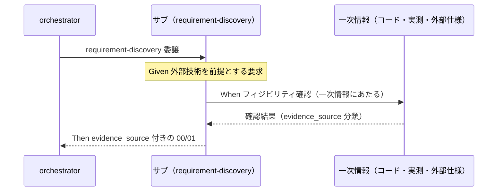

# 要件定義書: 上流フェーズ（要件定義・設計）でのフィジビリティ確認・ADR 的根拠記録の必須化

**プロジェクト名**: フィジビリティ・ADR 必須化（上流フェーズの根拠記録の process 化）
**作成日**: 2026 年 07 月 11 日
**最終更新**: 2026 年 07 月 11 日（ストーリー 5・AC-10/AC-11・ユースケース 4 を追加。姉妹サブ issue「システム仕様書の完備・強制・テンプレート刷新」提案スコープのプレビューを §6 末尾に追記）

> **重要**: **このドキュメントは常に更新**: 要件の変更や追加があった場合は、即座にこのドキュメントを更新してください。ドキュメントは「生きているドキュメント」として扱い、実装内容と常に同期させます。
>
> **用語**: [.agents/CONCEPTS.md §用語規約](../../../../../../.agents/CONCEPTS.md#用語規約) を参照。

---

## 1. 概要

### 1.1 システム概要

本パッケージ（agent-skill-chain）はシステム開発に特化したエージェント運用基盤であり、上流工程（要求・要件・設計）を requirement-discovery / design-feature の command（skill chain）で実行する。既存の [.agents/CONCEPTS.md §外部根拠の必須化](../../../../../../.agents/CONCEPTS.md#外部根拠の必須化external-anchor)（evidence_source 分類・inference_only 承認不可原則）は verify-and-close（事後の event）にのみ接続されている。本 issue は、この原則を上流 command の**執筆プロセス（process）**に接続し、フィジビリティ確認・一次情報調査・ADR 的意思決定記録を執筆時点で義務化する。

### 1.2 用語集

| 用語 | 説明 |
| -------- | ------ |
| evidence_source | 判断の根拠の種別。human_decision / observed_runtime / existing_code / external_spec / test_output / inference_only の 6 分類。正本は CONCEPTS.md §外部根拠の必須化（本書で再定義しない） |
| フィジビリティ確認 | 要求・設計が実現可能であることの確認。前提技術・外部仕様・既存コードの実在・整合を一次情報（inference_only 以外の evidence_source）で確かめる行為 |
| 一次情報 | 推論の連鎖ではなく、現物（既存コード・実測・外部公式仕様・テスト出力・人間の判断）に直接あたって得た情報 |
| ADR（Architecture Decision Records） | アーキテクチャ上の意思決定を「コンテキスト・検討した選択肢・決定・根拠・帰結」の形で記録するプラクティス |
| 重要判断 | 採否がその issue の成果物の構造・実現可能性・後続フェーズを左右する判断（例: 技術選定・外部依存の採用・既存資産の変更方針・要件の除外）。厳密な線引きは 02_設計で確定する |
| process / event | process＝執筆時点で行う継続的な義務。event＝レビュー時点（verify-and-close）で行う事後検証。本 issue は前者を追加し後者を維持する |
| 規模比例 | 適用の重さを issue の規模・リスクに比例させる原則（[.agents/CONTEXT_EFFICIENCY.md](../../../../../../.agents/CONTEXT_EFFICIENCY.md) §適用のスケーリング と同思想） |

---

## 2. 機能要件

### 2.1 ユーザーストーリー

#### ストーリー 1: 上流 command への根拠義務の接続

- **As a** 要件定義・設計を委譲されるサブエージェント
- **I want to** requirement-discovery / design-feature の command 定義（または skill chain）が、執筆時点でのフィジビリティ確認・evidence_source 記録を義務として指示してくれること
- **So that** 根拠収集が担当者の自発的判断ではなく、誰が実行しても再現されるプロセスになる

**受け入れ基準**:

- **AC-1**: `.agents/commands/requirement-discovery.md` に、00/01 執筆時のフィジビリティ確認・evidence_source 記録の義務が明記されている（`grep -n "evidence_source" .agents/commands/requirement-discovery.md` が 1 件以上ヒットする）。
- **AC-2**: `.agents/commands/design-feature.md` に、02/03 執筆時の同義務が明記されている（同様に grep で検証可能）。
- **AC-3**: 接続の実現方式（新規 skill 追加か、既存 skill／command 実行時の注意への追記か）は 02_設計で確定し、その設計判断自体が ADR 形式（AC-4 の形式）で記録されている。

#### ストーリー 2: ADR 形式の正本化

- **As a** 設計サブエージェント
- **I want to** 重要判断を「コンテキスト・検討した選択肢・決定・根拠（evidence_source 付き）・帰結」の形で 02_設計等に記録する正本化されたパターンがあること
- **So that** 親 issue の 02_設計「横断設計判断」節（§2.6）のような良い前例が、裁量ではなく標準として再現される

**受け入れ基準**:

- **AC-4**: ADR 的記録形式（最低限: コンテキスト／検討した選択肢／決定／根拠＝evidence_source 付き／帰結）が `.agents/` 配下の 1 か所に正本として定義され、02_設計テンプレートまたは design-feature command から参照で接続されている。
- **AC-5**: evidence_source の 6 分類の定義正本は CONCEPTS.md §外部根拠の必須化 の 1 か所のままである（新設・変更ファイルに分類表の重複定義がない。参照リンクのみ許可）。

#### ストーリー 3: inference_only の執筆時顕在化

- **As a** orchestrator（および人間のレビュー担当）
- **I want to** 上流成果物の重要判断が inference_only のみを根拠とする場合、執筆時点で「要人間確認」と明示されること
- **So that** 根拠のない前提の上に後続フェーズが積み上がる前に、レビューや人間判断を差し込める

**受け入れ基準**:

- **AC-6**: 「inference_only のみを根拠とする重要判断は、成果物中で要人間確認である旨を明示する」旨のルールが上流 command 側に接続されている（CONCEPTS.md の既存原則の参照で足りる。再定義しない）。
- **AC-7**: verify-and-close の既存の事後検証（evidence_source 記載チェック）は変更されず、process（執筆時）と event（レビュー時）の役割分担が接続先ドキュメントで読み取れる。

#### ストーリー 4: 規模比例の適用

- **As a** 軽量な issue（誤字修正・小規模ドキュメント整理等）を起票・執筆するサブエージェント
- **I want to** 重要判断を含まない issue では重い一次情報調査を強制されないこと
- **So that** 上流の義務化が軽量 issue の起票速度・コンテキスト効率を損なわない

**受け入れ基準**:

- **AC-8**: 義務の適用基準が「重要判断を含む場合」に限定される形で明文化され、重要判断を含まない軽量 issue の軽量パス（evidence_source の網羅付記を要求しない）が定義されている。
- **AC-9**: 適用基準は CONTEXT_EFFICIENCY.md §適用のスケーリング の規模比例の思想と矛盾しない（相互参照または整合の明記）。

#### ストーリー 5: greenfield プロジェクトのアーキテクチャ・コーディング規約・ディレクトリ構成決定への ADR 適用

- **As a** まだ開発環境・規約が定まっていない（greenfield）プロジェクトの要件定義・設計を担当するサブエージェント
- **I want to** アーキテクチャ・コーディング規約・ディレクトリ構成の決定が「重要判断」の一種として ADR 形式での記録対象に明示的に含まれること
- **So that** 根拠のないままこれらの土台となる決定がなされ、後続フェーズ・実装で手戻りが生じることを防ぐ

**受け入れ基準**:

- **AC-10**: 「アーキテクチャ・コーディング規約・ディレクトリ構成の決定」が「重要判断」の代表例として、接続先ドキュメント（02_設計 または design-feature command）に明記されている。
- **AC-11**: これらの決定を記録する際、既存の `.agents/spec/`（01_設計原則・02_ディレクトリ構造方針。汎用的な設計原則）と `docs/`（プロジェクト個別の具体仕様）の役割分担（spec/00_spec概要 §spec と docs の違い）を踏まえ、ADR 記録が spec の原則を上書きせず、プロジェクト個別の決定として docs 側に位置づけられることが明記されている。

### 2.2 BDD ユースケース

#### ユースケース 1: 要件定義フェーズでのフィジビリティ確認

requirement-discovery を委譲されたサブエージェントが、00/01 執筆時に根拠記録を行う。

**シナリオ 1: 外部技術を前提とする要求の根拠記録**

```gherkin
Feature: 上流フェーズでのフィジビリティ確認・根拠記録
  Scenario: 外部技術を前提とする要求の根拠記録
    Given requirement-discovery が委譲され、要求が外部技術（例: 外部OSS・API）の採用を前提としている
    When サブエージェントが 00_要求定義.md / 01_要件定義.md を執筆する
    Then command の指示に従い、当該前提の実在・実現可能性を一次情報（inference_only 以外の evidence_source）で確認し
    And 該当する重要判断に evidence_source を付記した成果物が作成される
```

**処理フロー**（必要に応じて）:



**シナリオ 2: inference_only のみの重要判断の顕在化**

```gherkin
Feature: 上流フェーズでのフィジビリティ確認・根拠記録
  Scenario: inference_only のみの重要判断の顕在化
    Given 00/01 の執筆中に、一次情報を得られない重要判断（推論のみ）が発生した
    When サブエージェントがその判断を成果物に記載する
    Then evidence_source: inference_only と明記され
    And 当該判断が「要人間確認」である旨が成果物中で明示される
```

#### ユースケース 2: 設計フェーズでの ADR 的記録

design-feature を委譲されたサブエージェントが、02_設計の重要判断を ADR 形式で記録する。

**シナリオ 1: 設計上の選択肢比較と決定の記録**

```gherkin
Feature: 設計フェーズでの ADR 的意思決定記録
  Scenario: 設計上の選択肢比較と決定の記録
    Given design-feature が委譲され、複数の実現方式（例: 新規skill追加 vs 既存skill追記）から選定する重要判断がある
    When サブエージェントが 02_設計.md を執筆する
    Then 当該判断が ADR 形式（コンテキスト・検討した選択肢・決定・根拠=evidence_source 付き・帰結）で記録される
```

**シナリオ 2: 事後検証（event）との接続**

```gherkin
Feature: 設計フェーズでの ADR 的意思決定記録
  Scenario: verify-and-close による事後検証との二重化
    Given 上流成果物に evidence_source 付きの重要判断が記録済みである
    When verify-and-close が実行される
    Then 既存の事後検証（外部根拠の必須化チェック）は執筆時記録を検証する側に回り
    And process（執筆時）と event（レビュー時）が重複定義なく両立する
```

#### ユースケース 3: 規模比例の軽量パス

**シナリオ 1: 重要判断を含まない軽量 issue**

```gherkin
Feature: 規模比例の適用
  Scenario: 重要判断を含まない軽量 issue の軽量パス
    Given 重要判断を含まない軽量 issue（例: 誤字修正・表現整理）の requirement-discovery が委譲された
    When サブエージェントが 00/01 を執筆する
    Then 網羅的な一次情報調査・evidence_source の全項目付記は要求されず
    And 既存テンプレートの必須セクション充足のみで完了できる
```

#### ユースケース 4: greenfield プロジェクトのアーキテクチャ・コーディング規約・ディレクトリ構成決定

**シナリオ 1: 土台となる決定を重要判断として ADR 記録する**

```gherkin
Feature: greenfield プロジェクトの土台決定への ADR 適用
  Scenario: アーキテクチャ・コーディング規約・ディレクトリ構成決定の ADR 記録
    Given まだ開発環境・規約が定まっていない greenfield プロジェクトの design-feature が委譲された
    When サブエージェントがアーキテクチャ・コーディング規約・ディレクトリ構成を決定する
    Then 当該決定は「重要判断」として扱われ、ADR 形式（コンテキスト・選択肢・決定・根拠=evidence_source 付き・帰結）で記録される
    And 記録は .agents/spec/ の汎用設計原則を上書きせず、プロジェクト個別の決定として docs 側に位置づけられる
```

### 2.3 ビジネスルール

- evidence_source の分類・「inference_only のみの重要判断は承認不可または要注意」原則の正本は CONCEPTS.md §外部根拠の必須化 の 1 か所のみとする（接続先は参照のみ）。
- 上流での根拠記録（process）は verify-and-close の事後検証（event）を置き換えない。両者は二重の安全網として共存する。
- 根拠の取得手段（WebFetch・コード grep・実測等）は特定ツールに固定しない。外部アクセス不能なランタイムでは existing_code / observed_runtime 等の到達可能な手段で代替し、不能な場合は inference_only として顕在化させる。
- 一次情報調査で高リスク操作（外部サービスへの書き込み等）を行う場合は、既存の事前確認ルール（CORE / RULES / enforcement）に従う（本 issue で緩和しない）。

---

## 3. 非機能要件

### 3.1 パフォーマンス要件

- 義務化による上流フェーズのコンテキスト・調査コスト増は、重要判断を含む issue に限定する（AC-8/AC-9 の規模比例）。
- 軽量 issue の起票所要（既存テンプレート充足のみ）を悪化させない。

### 3.2 セキュリティ要件

- 一次情報調査を口実とした高リスク操作（外部書き込み・大量削除等）の事前確認省略を許さない（既存ルール維持）。

### 3.3 ユーザビリティ要件

- 接続先の記述は、サブエージェントが command ファイルを読んだ時点で「何を・いつ・どの形式で記録するか」が一意に分かる具体性を持つこと（抽象的な訓示のみは不可）。

### 3.4 可用性要件

- 外部ネットワークアクセスが使えないランタイムでも義務が実行不能にならないこと（手段非依存の定義。§2.3 ビジネスルール参照）。

---

## 4. 外部インターフェース要件

### 4.1 API 要件

- 該当なし（本 issue はドキュメント（command / skill / テンプレート・ポリシー）の変更であり、外部 API は提供しない）。

### 4.2 データ形式要件

- evidence_source の値は CONCEPTS.md の 6 分類の表記（human_decision / observed_runtime / existing_code / external_spec / test_output / inference_only）をそのまま用いる（独自の別名・略記を導入しない）。
- ADR 的記録の必須フィールドは「コンテキスト・検討した選択肢・決定・根拠（evidence_source 付き）・帰結」を最小集合とする（詳細形式は 02_設計で確定）。

---

## 5. 制約事項

- 新規 skill 追加か既存 skill／command への追記かの設計判断は 02_設計フェーズで確定する（本書では AC-3 として論点の存在と検証方法のみ定める）。
- 1 ファイル 1 責務・重複禁止（CONCEPTS.md の正本性を崩さない）。
- verify-and-close・enforcement（audit）の既存チェックを弱めない。enforcement による自動検査の新設は必須範囲外（除外要件。00 §5）。
- 過去の close 済み issue への遡及適用はしない。implement-feature への拡張はしない（上流限定）。
- 本リポジトリでの成果物配置は [.agents-project/自己拡張ワークフロー.md](../../../../../../.agents-project/自己拡張ワークフロー.md) の上書き定義に従う。
- **姉妹サブ issue へ切り出す範囲**: 「システム仕様書が常に最新かつ正しい内容であることの継続的な強制」を最上位目的とする手段群（コーディング規約等の必須文書化・enforcement 接続・ノイズ排除の強制・テンプレート刷新・close 前レビュー必須化）は本 issue の対象外とし、姉妹サブ issue「システム仕様書の完備・強制・テンプレート刷新」への分割を提案する（詳細は §6 参考資料末尾のプレビュー節）。

---

## 6. 参考資料

### プロジェクトドキュメント

- [`00_要求定義.md`](./00_要求定義.md) - 要求定義

### その他の参考資料

- [.agents/CONCEPTS.md §外部根拠の必須化](../../../../../../.agents/CONCEPTS.md#外部根拠の必須化external-anchor) — evidence_source 分類の正本
- [.agents/commands/requirement-discovery.md](../../../../../../.agents/commands/requirement-discovery.md)・[.agents/commands/design-feature.md](../../../../../../.agents/commands/design-feature.md) — 接続対象（現状は根拠義務の記述なし。grep 実測）
- [.agents/commands/verify-and-close.md](../../../../../../.agents/commands/verify-and-close.md) — 既存の event 側接続（:82）
- [.agents/CONTEXT_EFFICIENCY.md](../../../../../../.agents/CONTEXT_EFFICIENCY.md) §適用のスケーリング — 規模比例の思想
- 親 issue [`02_設計.md`](../../02_設計.md) §2.6 横断設計判断 — ADR 相当の前例
- サブ issue [`npm公開中止_APM転換`](../20260711_024021_npm公開中止_APM転換/00_要求定義.md) — 一次情報確認（microsoft/apm の WebFetch 検証）の実践好例

### 姉妹サブ issue 提案スコープ（本 issue 対象外・プレビュー）

ユーザーからの追加指摘を踏まえ、以下を**姉妹サブ issue「システム仕様書の完備・強制・テンプレート刷新」**として別途起票することを提案する（本 issue には含めない。実際のディレクトリ作成は orchestrator が別途手配する）。

**最上位目的**: システム仕様書（`docs/`）が実装の変化に追随し、**常に最新かつ正しい内容であることを継続的に強制する**こと。以下の 5 点はいずれもこの目的を実現する**手段**であり、目的そのものではない。

1. コーディング規約・ディレクトリ構成・アーキテクチャの system-spec レベルでの必須文書化
2. enforcement（`.agents/enforcement/`）による強制接続
3. システム仕様書のノイズ排除の強制（`CODE_COMMENT_RULES.md` 相当の思想を docs へ。陳腐化・実装との矛盾記述の蓄積は「最新かつ正しい」状態の維持を妨げる要因として位置づける）
4. `.workflow/templates/docs/` の大規模プロジェクト対応・汎用化（`/home/adachi/projects/system-graph/docs` 参考: ADR 複製フォルダ・ドメイン別規約フォルダ・ID 命名管理・更新履歴による継続追随運用）
5. issue close 前のシステム仕様書レビュー・指摘対応反復の必須化（**実装変更のたびにシステム仕様書が追随しているかを検証する継続的ゲート**。一度書いたら終わりではない）

**受け入れ基準・BDD のプレビュー（姉妹 issue の 01 で正式化する）**:

```gherkin
Feature: システム仕様書の継続的な最新性・正確性の保証
  Scenario: 実装変更に対しシステム仕様書が追随しないままの issue 完了を防ぐ
    Given ある issue の実装（implement-feature）がシステム仕様書（docs/）の記載内容に影響する変更を含む
    When verify-and-close が実行され、当該 issue を close しようとする
    Then システム仕様書の該当箇所が実装内容と整合しているかのレビューが必須ゲートとして実施され
    And 指摘が 0 件に収束するまでレビュー・修正が反復され
    And 指摘が残ったまま（または未確認のまま）issue が完了状態にはならない
```

---

## 7. 前のステップ

この要件定義書は、以下のドキュメントを基に作成されています：

- **前**: [`00_要求定義.md`](./00_要求定義.md) - 要求定義フェーズ

---

## 8. 次のステップ

この要件定義書の承認後、以下のドキュメントを作成します：

- **次**: [`02_設計.md`](./02_設計.md) - 設計フェーズ
