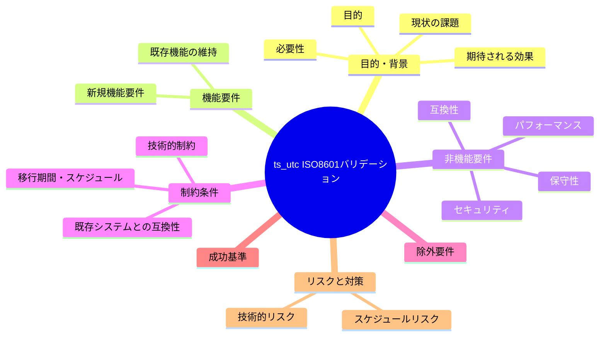

# 要求定義書: write-workflow-log.sh の ts_utc ISO8601 形式バリデーション追加

**プロジェクト名**: write-workflow-log.sh の ts_utc ISO8601 形式バリデーション追加（親 issue: agentsOS 汎用化・ポリシー統合 のサブ issue）
**作成日**: 2026 年 07 月 11 日
**最終更新**: 2026 年 07 月 11 日

> **重要**:
>
> - 要求定義書は、プロジェクトの全体像を把握するためのものです。詳細な技術仕様や実装方法は要件定義書以降で記載します。必要最低限の情報に収めることを心掛けてください。
> - **このドキュメントは常に更新**: 要求の変更や追加があった場合は、即座にこのドキュメントを更新してください。ドキュメントは「生きているドキュメント」として扱い、実装内容と常に同期させます。
> - **必須項目**: 以下の「必須」と明記した項目は空欄・抽象語のみ（例: 「{説明}」のまま）で提出しないこと。判定可能な形（目的は1文・成功基準は○/×で判定できる記載等）で記入すること。
>
> **用語**: [.agents/CONCEPTS.md §用語規約](../../../../../.agents/CONCEPTS.md#用語規約) を参照。

---

## 要求定義の全体像



**注意**:

- マインドマップは全体像を把握するためのものです。主要なセクション名程度に留め、詳細は記載しないでください。

---

## 1. 目的・背景

### 1.1 目的（必須）

`write-workflow-log.sh` に ts_utc の ISO8601 形式バリデーション（fail-fast）を追加し、契約違反データの新規混入を構造的に防止する。

### 1.2 背景

- **現状の課題**:
  - 親 issue のストーリー 7（fable-like 行動規範統合）実装中、書記記録（write-workflow-log）の 3 件の呼び出しで、`ts_utc` カラムに `20260711_052131`（JST の memo プレフィックス形式 `YYYYMMDD_HHMMSS`）が誤って渡され、[.agents/scribe/CONTRACT.md](../../../../../.agents/scribe/CONTRACT.md) が要求する「ISO8601 時刻」形式に違反した状態で INSERT された（verify-and-close 監査で検出）。
  - [.agents/scripts/write-workflow-log.sh](../../../../../.agents/scripts/write-workflow-log.sh) の `TS_UTC`（第 4 引数）は**非空チェックのみ**（同スクリプト 200〜203 行目）であり、ISO8601 形式であることのバリデーションが一切ない。`AGENT_ROLE=scribe .agents/scripts/write-workflow-log.sh implement-feature "テスト" 1 "20260101_000000"` のように非 ISO8601 文字列を渡しても、現行スクリプトはエラーなく成功し INSERT してしまう（再現確認済み）。
  - [.agents/enforcement/ci/audit.sh](../../../../../.agents/enforcement/ci/audit.sh) の `bad_ts` チェック（364 行目）は「ts_utc が数字を 1 文字も含まない場合のみ FAIL」（`ts_utc NOT GLOB '*[0-9]*'`）という緩い判定のため、`YYYYMMDD_HHMMSS` のような誤形式も CI をすり抜ける（サイレントな品質劣化）。
  - 根本原因の仮説: 同一リポジトリ内に「`ts_utc` は ISO8601 UTC 必須」（scribe/CONTRACT.md）という規約と「memo ファイル名・issue フォルダ名のプレフィックスは `TZ=Asia/Tokyo date +%Y%m%d_%H%M%S`（JST）」（run_command.md Constraints）という規約が併存しており、委譲実行者（サブエージェント）がこれを混同した可能性が高い。

- **必要性**:
  - 台帳（workflow.db）は証跡の正本であり、`ts_utc` の形式不整合は時系列ソート・順序監査・監査ツールの信頼性を直接損なう。規約文書（CONTRACT.md）だけでは委譲実行者の混同を防げないことが実証されたため、**スクリプト側での構造的な入力拒否（fail-fast）** が必要である。
  - 既存の同型バリデーション（DOCUMENT_ID 必須化・UUID 形式検証・dod_met の 0/1 検証・command 許可リスト検証）と同じく、「規約 → スクリプトで強制」の enforcement 思想を ts_utc にも適用し、一貫性を保つ必要がある。

### 1.3 期待される効果（必須: 1 件以上）

- **効果 1**: 非 ISO8601 形式の ts_utc を渡した `write-workflow-log.sh` 呼び出しが INSERT 前に exit 1 で失敗し、契約違反データが workflow.db に新規混入しなくなる（誤形式 `20260101_000000` を渡して exit 1 になることを実行で確認できれば○）。
- **効果 2**: 失敗時のエラーメッセージから、呼び出し側（書記）が「ISO8601 UTC 形式が必要」「JST の memo プレフィックス形式とは別物」であることを即座に理解でき、自己修正できる（エラーメッセージに期待形式の例が含まれていれば○）。

**現状と期待される状態の比較**:

```mermaid
flowchart LR
    subgraph 現状["現状"]
        A1[ts_utcは非空チェックのみ]
        A2[誤形式がINSERTされ台帳品質が劣化]
        A3[audit.shのbad_tsも緩くCIをすり抜け]
    end

    subgraph 期待される状態["期待される状態"]
        B1[ISO8601形式バリデーションでfail-fast]
        B2[契約違反データの新規混入ゼロ]
        B3[事前防止(スクリプト)と事後検知(audit)の二重化]
    end

    A1 -.->|解決| B1
    A2 -.->|解決| B2
    A3 -.->|解決| B3
```

---

## 2. 機能要件

### 2.1 既存機能の維持（該当する場合）

- `write-workflow-log.sh` の既存挙動をすべて維持する: `--print-head` サブコマンド、AGENT_ROLE=scribe ガード、command 許可リスト検証、UUID 形式検証（DOCUMENT_ID/ISSUE_ID/REVIEW_ID）、DOCUMENT_ID 必須化、summary 長チェック、dod_met 0/1 チェック、command 別必須パラメータ、flock 排他・リトライ付き INSERT、スキーマ検知・マイグレーション、prev_hash 自動連結、document_id 不変チェック。
- **正しい ISO8601 形式の ts_utc を渡す既存の正常系呼び出しは、改修前後で挙動が変わらない**（後方互換）。

### 2.2 新規機能要件

- **ts_utc の ISO8601 形式バリデーション（fail-fast）**: 第 4 引数 `TS_UTC` が ISO8601 形式（少なくとも `date -u +"%Y-%m-%dT%H:%M:%SZ"` の出力形式 `YYYY-MM-DDTHH:MM:SSZ` を受理）に適合しない場合、**INSERT を行う前に** exit 1 で失敗し、期待形式の例と実際に渡された値を含む分かりやすいエラーメッセージを stderr に出力する。受理する ISO8601 バリアントの正確な範囲（小数秒・タイムゾーンオフセット等の許否）は 02_設計で確定する。

---

## 3. 非機能要件

### 3.1 パフォーマンス

- バリデーションは正規表現 1 回程度の軽量な処理とし、スクリプトの実行時間に体感可能な影響を与えないこと。

### 3.2 セキュリティ

- バリデーションは INSERT（SQL 組み立て）より前に行い、不正入力の早期拒否として機能させること。外部コマンド・ネットワークアクセスを追加しないこと。

### 3.3 互換性

- 正しい ISO8601 形式を渡す既存呼び出し（各 command の書記記録・テスト）の成功挙動を変えないこと。
- 旧スキーマ（entry_id 無し）経路の INSERT に対しても同一のバリデーションを適用すること（バリデーションは共通必須チェック段階で行うため、両経路に等しく効く）。

### 3.4 保守性

- 既存バリデーション（UUID 形式検証・DOCUMENT_ID 必須化等）と同じ記述スタイル（正規表現＋ERROR メッセージ＋exit 1）で実装し、スクリプト内の一貫性を保つこと。
- 期待する形式の定義（正規表現）はスクリプト内 1 か所に集約し、二重定義しないこと。

---

## 4. 制約条件

### 4.1 技術的制約

- bash（`set -euo pipefail` 環境）＋ POSIX 互換の範囲で実装する。新規の外部依存（GNU date 拡張・python 等）をバリデーションに追加しない。
- バリデーション位置は、既存の共通必須チェック（command / summary / ts_utc 非空チェック）の直後〜DB 接続前とし、INSERT・DB 作成・ロック取得のいずれよりも前に失敗させる。

### 4.2 既存システムとの互換性

- `.agents/scribe/CONTRACT.md` の「ts_utc = ISO8601 時刻」の契約定義を正とし、契約自体は変更しない。
- `audit.sh` の `bad_ts` チェック（事後検知）は本 issue のスコープ外だが、役割分担（スクリプト＝事前防止、audit＝事後検知の二重化）を要件定義・設計で明記する。`bad_ts` の判定強化を行う場合は別 issue とする。
- 既に記録済みのデータへの影響は無い（workflow.db は追記のみの台帳であり、バリデーションは新規 INSERT の入口にのみ効く）。過去データの是正は本 issue の対象外（今回の実データ 3 件は是正 INSERT で修復済み・ハッシュチェーン健全）。

### 4.3 移行期間・スケジュール

- 単一スクリプトへの局所的な追加であり、移行期間は不要。影響を受ける呼び出し元は `write-workflow-log.sh` を呼ぶ全 command（requirement-discovery / design-feature / implement-feature / verify-and-close / review-docs / create-pr-review-issue）だが、正しい形式を渡している限り挙動は不変。

---

## 5. 除外要件

- 過去に記録済みの不正形式データの是正・書き換え（追記のみの台帳であり、今回の実データは是正 INSERT で修復済み。追加是正は不要）。
- `audit.sh` の `bad_ts` 判定ロジック自体の強化（事後検知の厳格化は必要なら別 issue で扱う。本 issue はスクリプト側の事前防止が対象）。
- `created_at` 等、ts_utc 以外のカラムのバリデーション追加。
- workflow.db スキーマ（CHECK 制約）の変更。
- 規約文書（CONTRACT.md 等）の契約定義の変更。

---

## 6. 成功基準（必須: 1 件以上）

1. `AGENT_ROLE=scribe .agents/scripts/write-workflow-log.sh implement-feature "テスト記録..." 1 "20260101_000000" ...`（非 ISO8601 の JST プレフィックス形式）が exit 1 で失敗し、workflow.db に行が INSERT されない（○/×: 隔離環境で実行して終了コードと行数を確認）。
2. 失敗時の stderr に、期待形式（ISO8601 UTC、例: `2026-07-11T00:00:00Z`）と実際に渡された値が含まれる（○/×: エラー出力を目視確認）。
3. `date -u +"%Y-%m-%dT%H:%M:%SZ"` の出力を ts_utc に渡した正常系呼び出しが従来どおり成功し、1 行 INSERT される（○/×: 隔離環境で実行して終了コードと行数を確認）。
4. 既存のテスト（test/ 配下の write-workflow-log 関連テスト）がすべて通過し、新規バリデーションのテスト（正常系・異常系）が追加されている（○/×: テスト実行結果で判定）。
5. バリデーションが INSERT より前（DB 作成・ロック取得より前）に位置している（○/×: コードレビューで位置を確認）。

---

## 7. リスクと対策

### 7.1 技術的リスク

- **リスク**: バリデーションの正規表現が厳しすぎて、正当な ISO8601 バリアント（小数秒付き・`+00:00` オフセット表記等）を誤って拒否し、既存の正常系呼び出しを壊す。
  - **対策**: 受理する形式の範囲を 02_設計で明確に定義し（最低限 `YYYY-MM-DDTHH:MM:SSZ` を受理）、既存呼び出し・既存テストが渡している形式を調査した上で正規表現を決定する。正常系テストを先に用意して回帰を検知する。
- **リスク**: バリデーション位置を誤り（INSERT 直前・ロック取得後等）、失敗時にロックファイルや空 DB 等の副作用を残す。
  - **対策**: 共通必須チェック段階（DB 接続・ロック取得より前）に配置することを受け入れ基準（成功基準 5）とし、レビューで位置を確認する。

### 7.2 スケジュールリスク

- **リスク**: 本サブ issue が親 issue の実装ロードマップ（ストーリー 1〜7 → 8 → APM 転換）と並走し、`.agents/` → `.agent-skill-chain/` 改名（ストーリー 8）とパス変更が競合する。
  - **対策**: 変更は `write-workflow-log.sh` 内の局所的な追加のみでパス構造に依存しない。ストーリー 8 の改名はディレクトリ名の一括変更であり、本改修のコード内容と衝突しない。着手順は orchestrator がロードマップと整合させる。

---

## 8. 参考資料

### プロジェクトドキュメント

- 親 issue: [`../../00_要求定義.md`](../../00_要求定義.md) - agentsOS 汎用化・ポリシー統合（本サブ issue はそのストーリー 7 実装中に検出された契約違反への恒久対策）
- 親 issue の issue 一覧: [`../../90_issues.md`](../../90_issues.md)

### その他の参考資料

- [.agents/scripts/write-workflow-log.sh](../../../../../.agents/scripts/write-workflow-log.sh) - 改修対象（TS_UTC は 200〜203 行目で非空チェックのみ）
- [.agents/scribe/CONTRACT.md](../../../../../.agents/scribe/CONTRACT.md) - ts_utc「ISO8601 時刻」の契約定義（正本）
- [.agents/enforcement/ci/audit.sh](../../../../../.agents/enforcement/ci/audit.sh) - `bad_ts` 事後検知（364 行目、`NOT GLOB '*[0-9]*'` の緩判定）
- [.agents/enforcement/README.md](../../../../../.agents/enforcement/README.md) - 失敗条件 #8「workflow.db 品質違反（ts_utc 形式異常）」
- [.agents/skills/logging/write-workflow-log/SKILL.md](../../../../../.agents/skills/logging/write-workflow-log/SKILL.md) - 書記 capability の手順

---

## 9. 次のステップ

この要求定義書の承認後、以下のドキュメントを作成します：

- **次**: [`01_要件定義.md`](./01_要件定義.md) - 要件定義フェーズ
