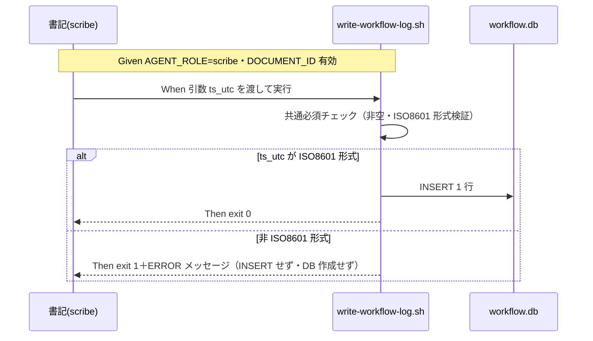

# 要件定義書: write-workflow-log.sh の ts_utc ISO8601 形式バリデーション追加

**プロジェクト名**: write-workflow-log.sh の ts_utc ISO8601 形式バリデーション追加（親 issue: agentsOS 汎用化・ポリシー統合 のサブ issue）
**作成日**: 2026 年 07 月 11 日
**最終更新**: 2026 年 07 月 11 日

> **重要**: **このドキュメントは常に更新**: 要件の変更や追加があった場合は、即座にこのドキュメントを更新してください。ドキュメントは「生きているドキュメント」として扱い、実装内容と常に同期させます。
>
> **用語**: [.agents/CONCEPTS.md §用語規約](../../../../../.agents/CONCEPTS.md#用語規約) を参照。

---

## 1. 概要

### 1.1 システム概要

`write-workflow-log.sh` は workflow.db（証跡台帳）への書記専用ラッパースクリプトであり、1 回の呼び出しで 1 行を INSERT する。現行実装では第 4 引数 `TS_UTC` に非空チェックしか無く、`.agents/scribe/CONTRACT.md` が要求する「ISO8601 時刻」に適合しない値（例: JST の memo プレフィックス形式 `YYYYMMDD_HHMMSS`）もそのまま INSERT される。本改修は、`TS_UTC` の ISO8601 形式バリデーションを INSERT 前の共通必須チェック段階に追加し、非適合なら exit 1＋分かりやすいエラーメッセージで fail-fast させる。

これにより、規約（CONTRACT.md＝事前の契約）・スクリプト（本改修＝事前防止）・audit.sh の `bad_ts`（事後検知）の三層で台帳の時刻品質を守る。本改修のスコープはスクリプトの事前防止のみであり、契約定義・事後検知・過去データは変更しない。

### 1.2 用語集

| 用語     | 説明   |
| -------- | ------ |
| ts_utc | workflow_log テーブルの必須カラム。CONTRACT.md で「ISO8601 時刻」と定義される。UTC 基準（例: `2026-07-11T00:00:00Z`）。 |
| ISO8601 UTC 形式 | 本 issue で受理必須とする形式。最低限 `date -u +"%Y-%m-%dT%H:%M:%SZ"` の出力（`YYYY-MM-DDTHH:MM:SSZ`）。受理バリアントの正確な範囲は 02_設計で確定。 |
| memo プレフィックス形式 | `TZ=Asia/Tokyo date +%Y%m%d_%H%M%S` で得る JST の `YYYYMMDD_HHMMSS`。memo ファイル名・issue フォルダ名専用であり、ts_utc に使ってはならない（今回の混同源）。 |
| fail-fast | 不正入力を副作用（INSERT・DB 作成・ロック取得）が生じる前に検知し、exit 1 で即座に失敗させる方針。 |
| 事前防止 / 事後検知 | 事前防止＝本改修のスクリプト内バリデーション。事後検知＝`audit.sh` の `bad_ts` チェック（緩判定のまま維持。強化は別 issue）。二重化で運用する。 |
| 書記（scribe） | write-workflow-log capability の実行主体。`AGENT_ROLE=scribe` でのみスクリプトを実行できる。 |

---

## 2. 機能要件

### 2.1 ユーザーストーリー

#### ストーリー 1: 契約違反 ts_utc の構造的拒否

- **As a** リポジトリ保守者（台帳の品質に責任を持つ者）
- **I want to** `write-workflow-log.sh` が非 ISO8601 形式の ts_utc を INSERT 前に exit 1 で拒否すること
- **So that** 委譲実行者が規約を混同しても、契約違反データが証跡台帳（workflow.db）に新規混入しない

**受け入れ基準**:

- 非 ISO8601 形式（例: `20260101_000000`、`2026/07/11 00:00:00`、`invalid`）を渡すと exit 1 で失敗し、workflow.db に行が追加されない。
- バリデーションは共通必須チェック段階（DB 作成・ロック取得・INSERT のいずれよりも前）で行われる。
- 旧スキーマ経路・新スキーマ経路の両方に同一のバリデーションが効く。

#### ストーリー 2: 誤りの自己修正を助けるエラーメッセージ

- **As a** 書記として委譲されたサブエージェント
- **I want to** 失敗時のエラーメッセージから、期待される形式（ISO8601 UTC）と自分が渡した値を即座に把握したい
- **So that** JST の memo プレフィックス形式との混同に気づき、`date -u +"%Y-%m-%dT%H:%M:%SZ"` で正しい値を再取得して自己修正できる

**受け入れ基準**:

- エラーメッセージ（stderr）に、(a) ts_utc が ISO8601 形式でない旨、(b) 期待形式の具体例（例: `2026-07-11T00:00:00Z`）、(c) 実際に渡された値、が含まれる。
- エラーメッセージは既存バリデーション（UUID 形式検証等）と同じ `ERROR: ...` スタイルに従う。

#### ストーリー 3: 正常系の完全な後方互換

- **As a** `write-workflow-log.sh` を呼ぶ全 command（requirement-discovery / design-feature / implement-feature / verify-and-close / review-docs / create-pr-review-issue）の書記
- **I want to** 正しい ISO8601 形式の ts_utc を渡す既存の呼び出しが改修前後で同じ挙動であること
- **So that** 既存の書記フロー・テスト・運用に一切の回帰が生じない

**受け入れ基準**:

- `date -u +"%Y-%m-%dT%H:%M:%SZ"` の出力を渡した呼び出しが従来どおり成功し、1 行 INSERT される。
- test/ 配下の既存 write-workflow-log 関連テストがすべて通過する。
- 新規バリデーションの単体テスト（正常系・異常系）が追加され、通過する。

### 2.2 BDD ユースケース

#### ユースケース 1: ts_utc の ISO8601 形式バリデーション

書記が `write-workflow-log.sh` を実行した際、ts_utc（第 4 引数）が ISO8601 形式かを INSERT 前に検証する。

**シナリオ 1: 正常系 — ISO8601 UTC 形式なら従来どおり成功する**

```gherkin
Feature: ts_utc の ISO8601 形式バリデーション
  Scenario: ISO8601 UTC 形式の ts_utc を渡すと INSERT に成功する
    Given 隔離環境（mktemp -d）に workflow.db が存在しない（または新スキーマで存在する）
    And AGENT_ROLE=scribe と有効な DOCUMENT_ID が設定されている
    When ts_utc に date -u +"%Y-%m-%dT%H:%M:%SZ" の出力（例: "2026-07-11T00:00:00Z"）を渡して write-workflow-log.sh を実行する
    Then 終了コードは 0 である
    And workflow_log に ts_utc がその値のまま 1 行 INSERT されている
```

**シナリオ 2: 異常系 — JST memo プレフィックス形式は INSERT 前に exit 1 で拒否される**

```gherkin
Feature: ts_utc の ISO8601 形式バリデーション
  Scenario: 非 ISO8601 形式（YYYYMMDD_HHMMSS）の ts_utc は fail-fast で拒否される
    Given 隔離環境（mktemp -d）で AGENT_ROLE=scribe と有効な DOCUMENT_ID が設定されている
    When ts_utc に "20260101_000000"（JST の memo プレフィックス形式）を渡して write-workflow-log.sh を実行する
    Then 終了コードは 1 である
    And stderr に「ts_utc が ISO8601 形式でない」旨・期待形式の例・実際に渡された値が出力される
    And workflow.db に行が INSERT されていない（実行前後で行数が不変。DB 未存在なら新規作成もされない）
```

**処理フロー**:



**シナリオ 3: 異常系 — その他の非 ISO8601 文字列も拒否される**

```gherkin
Feature: ts_utc の ISO8601 形式バリデーション
  Scenario Outline: 多様な非 ISO8601 形式が一律拒否される
    Given 隔離環境（mktemp -d）で AGENT_ROLE=scribe と有効な DOCUMENT_ID が設定されている
    When ts_utc に "<不正値>" を渡して write-workflow-log.sh を実行する
    Then 終了コードは 1 である
    And workflow.db に行が INSERT されていない

    Examples:
      | 不正値                |
      | 20260101_000000       |
      | 2026/07/11 00:00:00   |
      | 2026-07-11            |
      | invalid               |
      | 1720656000            |
```

#### ユースケース 2: 既存バリデーション・既存経路との共存

改修後も既存のチェック（AGENT_ROLE ガード・command 許可リスト・DOCUMENT_ID 必須・UUID 形式・summary 長・dod_met）と `--print-head` サブコマンドの挙動は不変である。

**シナリオ 1: --print-head は ts_utc バリデーションの影響を受けない**

```gherkin
Feature: 既存機能の維持
  Scenario: --print-head サブコマンドは従来どおり動作する
    Given workflow.db が新スキーマで存在し 1 件以上の記録がある
    When write-workflow-log.sh --print-head を実行する
    Then 終了コードは 0 で、最新 entry の entry_hash が出力される
```

**シナリオ 2: 旧スキーマ経路にもバリデーションが効く**

```gherkin
Feature: 旧スキーマ経路への適用
  Scenario: 旧スキーマ DB への INSERT でも非 ISO8601 の ts_utc は拒否される
    Given 隔離環境に旧スキーマ（entry_id カラム無し）の workflow.db が存在する
    And AGENT_ROLE=scribe と有効な DOCUMENT_ID が設定されている
    When ts_utc に "20260101_000000" を渡して write-workflow-log.sh を実行する
    Then 終了コードは 1 であり、行は INSERT されない
```

### 2.3 ビジネスルール

- ts_utc の契約定義の正本は `.agents/scribe/CONTRACT.md`（「ISO8601 時刻」）であり、本改修はこれを変更せずスクリプト側で強制する。
- 受理必須の最低ライン: `date -u +"%Y-%m-%dT%H:%M:%SZ"` の出力形式（`YYYY-MM-DDTHH:MM:SSZ`）。受理バリアント（小数秒・`+00:00` オフセット等）の正確な範囲は 02_設計で確定し、既存呼び出し・既存テストが渡している形式を壊さないことを優先する。
- 役割分担: スクリプト内バリデーション＝**事前防止**、`audit.sh` の `bad_ts`＝**事後検知**。二重化で運用し、`bad_ts` 判定の強化は本 issue のスコープ外（必要なら別 issue）。
- 過去に記録済みのデータは対象外（追記のみの台帳。今回の実データ 3 件は是正 INSERT で修復済み・ハッシュチェーン健全）。
- 形式定義（正規表現）はスクリプト内 1 か所に集約し二重定義しない。

---

## 3. 非機能要件

### 3.1 パフォーマンス要件

- バリデーションは bash 組み込みの正規表現マッチ 1 回程度で行い、外部プロセス起動を追加しない。
- スクリプト全体の実行時間に体感可能な影響（数 ms 超の増加）を与えない。

### 3.2 セキュリティ要件

- バリデーションは SQL 組み立て・INSERT より前に行い、不正入力の早期拒否として機能させる。
- 新規の外部依存（ネットワーク・追加コマンド）を導入しない。

### 3.3 ユーザビリティ要件

- エラーメッセージは既存の `ERROR: ...` スタイル（日本語・stderr）に統一し、期待形式の具体例と実際の値を含めて自己修正可能にする。

### 3.4 可用性要件

- バリデーション失敗時に副作用（ロックファイル・空 DB・部分書き込み）を残さない（fail-fast 位置を DB 接続・ロック取得より前に置く）。

---

## 4. 外部インターフェース要件

### 4.1 API 要件

- `write-workflow-log.sh` の呼び出しインターフェース（位置引数 `command summary dod_met ts_utc [issue_path] [changed_files]`・環境変数群・`--print-head`）は変更しない。追加されるのは ts_utc の形式検証のみ。
- 終了コード契約: 正常 0 ／ バリデーション失敗 1（既存のエラー系と同一）。

### 4.2 データ形式要件

- ts_utc に受理する形式: ISO8601（最低限 `YYYY-MM-DDTHH:MM:SSZ`。バリアント範囲は 02_設計で確定）。
- workflow_log テーブルのスキーマ・CHECK 制約は変更しない。

---

## 5. 制約事項

- bash（`set -euo pipefail`）＋ POSIX 互換の範囲で実装し、GNU date 拡張や python への依存をバリデーションに追加しない。
- 既存の他バリデーション（UUID 形式検証 `validate_uuid_if_set` 等）と同型の実装スタイル（正規表現定数＋ERROR＋exit 1）に合わせる。
- 変更対象は `.agents/scripts/write-workflow-log.sh`（およびテスト・関連ドキュメントの必要最小限の追記）のみ。CONTRACT.md の契約定義・audit.sh・スキーマは変更しない。
- テストは隔離環境（`mktemp -d`）で行い、本リポの `.workflow/workflow.db` 等を変更・破壊しない（`.agents-project/自己拡張ワークフロー.md` §テストの tmp 隔離）。

---

## 6. 参考資料

### プロジェクトドキュメント

- [`00_要求定義.md`](./00_要求定義.md) - 要求定義

### その他の参考資料

- 親 issue: [`../../00_要求定義.md`](../../00_要求定義.md)・[`../../90_issues.md`](../../90_issues.md)（本サブ issue はストーリー 7 実装中の書記記録契約違反への恒久対策として起票）
- [.agents/scripts/write-workflow-log.sh](../../../../../.agents/scripts/write-workflow-log.sh) - 改修対象（TS_UTC は非空チェックのみ: 200〜203 行目）
- [.agents/scribe/CONTRACT.md](../../../../../.agents/scribe/CONTRACT.md) - ts_utc「ISO8601 時刻」の契約定義（正本）
- [.agents/enforcement/ci/audit.sh](../../../../../.agents/enforcement/ci/audit.sh) - `bad_ts` 事後検知（364 行目）
- [.agents/enforcement/README.md](../../../../../.agents/enforcement/README.md) - 失敗条件 #8（workflow.db 品質違反）
- [.agents/skills/logging/write-workflow-log/SKILL.md](../../../../../.agents/skills/logging/write-workflow-log/SKILL.md) - 書記 capability

---

## 7. 前のステップ

この要件定義書は、以下のドキュメントを基に作成されています：

- **前**: [`00_要求定義.md`](./00_要求定義.md) - 要求定義フェーズ

---

## 8. 次のステップ

この要件定義書の承認後、以下のドキュメントを作成します：

- **次**: [`02_設計.md`](./02_設計.md) - 設計フェーズ
