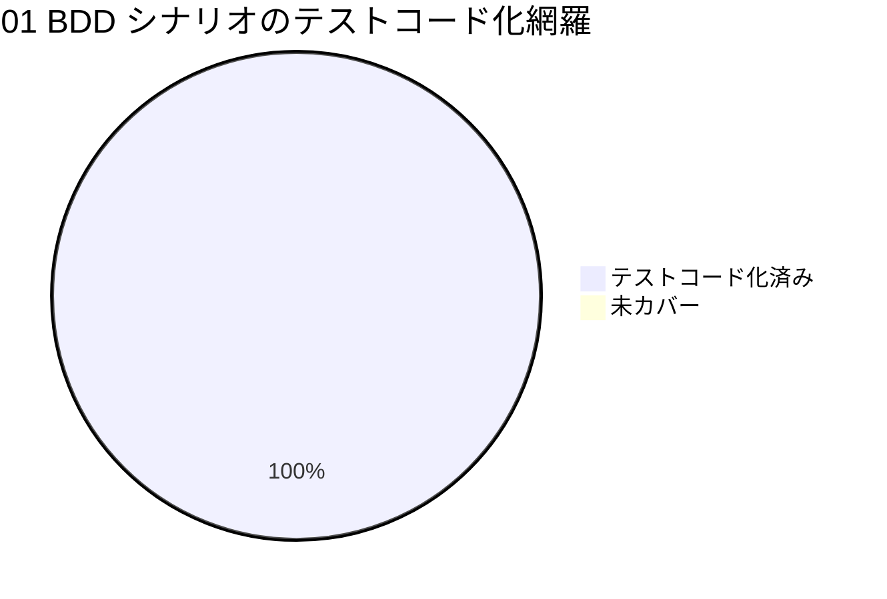

# レビュー書: write-workflow-log.sh の ts_utc ISO8601 形式バリデーション追加

**プロジェクト名**: write-workflow-log.sh の ts_utc ISO8601 形式バリデーション追加（親 issue: agentsOS 汎用化・ポリシー統合 のサブ issue）
**作成日**: 2026 年 07 月 11 日
**最終更新**: 2026 年 07 月 11 日

> **重要**: 本レビューは verify-and-close command（skill chain: generate-scenarios → map-coverage → review-code → review-architecture → write-workflow-log）に従い、監査者（scribe とは別ロール）が実装担当の自己申告を鵜呑みにせず、**独立にテストを再実行・SC/AC を再検証**して作成した。
>
> **用語**: [.agent-skill-chain/source/CONCEPTS.md §用語規約](../../../../../../.agent-skill-chain/source/CONCEPTS.md#用語規約) を参照。

---

## 1. レビュー概要

### 1.1 レビュー目的（必須）

実装内容の確認・品質保証・完了（close 相当）判定。`write-workflow-log.sh` への ts_utc ISO8601 UTC 形式バリデーション（fail-fast）追加が、00〜03 の要求・要件・設計・実装計画どおりに実装され、受け入れ基準（01 AC / 00 SC）を満たし、既存挙動に回帰が無く、契約違反データの新規混入を構造的に防止できることを独立に検証する。

### 1.2 レビュー対象（必須）

- **実装範囲**:
  - タスク 1: `.agent-skill-chain/source/scripts/write-workflow-log.sh` に定数 `TS_UTC_ISO8601_REGEX`（163 行目）＋ INSERT 前の fail-fast バリデーションブロック（209〜212 行目）を追加。
  - タスク 2: 新規テスト `test/test-write-workflow-log-ts-utc.sh`（正常系 2・異常系 6・エラーメッセージ・旧スキーマ・`--print-head`・本番 DB 非破壊）。
  - タスク 3: 既存テスト群（multidoc / prevhash / glob）の無回帰確認。
- **レビュー期間**: 2026-07-11 ～ 2026-07-11
- **レビュー担当者**: 監査者（auditor、verify-and-close 委譲ワーカー）
- **レビュー深度**: standard（単一スクリプトへの局所改修 ＋ 新規テスト。[RULES.md §実行モード] に基づく）

---

## 2. 実装内容の確認

### 2.1 実装完了タスク（または Issue）

| タスク名 | 実装内容 | 実装日 | 担当者 | ステータス |
| -------- | -------- | ------ | ------ | ---------- |
| タスク 1 本体実装 | `TS_UTC_ISO8601_REGEX` 定数 ＋ 共通必須チェック直後の fail-fast if ブロックを追加 | 2026-07-11 | 実装担当（sub） | 完了 |
| タスク 2 新規テスト | `test/test-write-workflow-log-ts-utc.sh`（PASS=44 FAIL=0） | 2026-07-11 | 実装担当（sub） | 完了 |
| タスク 3 既存無回帰 | multidoc(15) / prevhash(16) / glob(3) 全 PASS | 2026-07-11 | 実装担当（sub） | 完了 |

### 2.2 実装内容の詳細

#### タスク 1: 本体実装（定数 ＋ ts_utc 形式バリデーション）

- **実装内容**: 第 4 引数 `TS_UTC` が ISO8601 UTC 形式でなければ INSERT・DB 作成・ロック取得のいずれよりも前に `exit 1` で fail-fast する入口ガードを追加。
- **変更ファイル**: `.agent-skill-chain/source/scripts/write-workflow-log.sh`（working-tree diff = 追加 8 行の 2 ブロックのみ。既存行の削除・改変なし）。
- **実装方法（実コード確認済み）**:
  - 定数（163 行目、`UUID_REGEX` 直下・単一情報源）:
    `TS_UTC_ISO8601_REGEX='^[0-9]{4}-[0-9]{2}-[0-9]{2}T[0-9]{2}:[0-9]{2}:[0-9]{2}(\.[0-9]+)?Z$'`
  - バリデーション（209〜212 行目、共通必須チェック `-z "$TS_UTC"`（203 行目）の**直後**、`summary` 長・`dod_met` チェック・DB 作成（284 行目）・flock（250 行目）より**前**）:
    `if [[ ! "$TS_UTC" =~ $TS_UTC_ISO8601_REGEX ]]; then ... exit 1; fi`
- **確認事項**:
  - **正規表現のクォート**: 右辺 `$TS_UTC_ISO8601_REGEX` は**クォートされておらず**、bash `[[ =~ ]]` で正規表現として機能する（文字列一致に退化していない）。実コード 209 行目で確認し、正規表現マトリクス（§3.1）で実挙動も確認済み。03 §5.1 のリスク「右辺をクォートすると文字列一致になる」は正しく回避されている。
  - **配置位置（SC5）**: DB 作成・ロック取得より前で fail-fast する位置に配置されており、拒否時に空 DB・ロックファイルの副作用を残さない（§3.1 の実測で DB 未作成を確認）。

#### タスク 2: 新規テスト `test/test-write-workflow-log-ts-utc.sh`

- **実装内容**: T2-1 正常系（`Z`・小数秒 `Z`）／T2-2 異常系 Scenario Outline 6 値／T2-3 エラーメッセージ grep 検証／T2-4 旧スキーマ経路（異常＝拒否・正常＝INSERT）／T2-5 `--print-head` 無影響／T2-6 本番 DB 非破壊。全 44 アサーション。
- **変更ファイル**: `test/test-write-workflow-log-ts-utc.sh`（新規・未追跡）。
- **実装方法**: 既存 `test-write-workflow-log-multidoc.sh` と同型（`REPO_ROOT` 解決・`ok/ng/assert_eq`・全ケース `mktemp -d` 隔離・`PROJECT_ROOT` を tmp に向ける）。
- **確認事項**: ファイル冒頭に `ユースケース:` doc コメント、各テスト本文に `# シナリオ:`・`# Given:`・`# When:`・`# Then:` のインラインコメントを付与（TEST_BDD_FORMAT.md 準拠。BDD コメント 22 箇所・ユースケース 1 箇所を grep で確認）。

---

## 3. テスト結果の確認

### 3.1 単体テスト（監査者による独立再実行）

#### テスト実行結果（必須: 数値で記載）

- **実行日**: 2026-07-11（監査者が独立に再実行。実装担当の報告値と突合）
- **テストファイル数**: 4（新規 1 ＋ 既存 3）
- **新規 `test-write-workflow-log-ts-utc.sh`**: 3 回連続実行、いずれも **PASS=44 FAIL=0**（実装担当報告と一致）。
- **既存 `test-write-workflow-log-multidoc.sh`**: PASS=15 FAIL=0（安定時）。
- **既存 `test-write-workflow-log-prevhash.sh`**: PASS=16 FAIL=0。
- **既存 `test-write-workflow-log-glob.sh`**: PASS=3 FAIL=0。
- **失敗**: 新規テストは 0。既存 multidoc に**既存の flaky 失敗**を独立に再現（§3.3 で無関係と評価）。
- **スキップ**: 0。

#### 監査者による SC/AC 直接再検証（自己申告に依存しない実測）

| 検証項目 | 実行内容 | 結果 |
| -------- | -------- | ---- |
| SC1（異常系 fail-fast） | `implement-feature ... 1 "20260101_000000" "src/x.sh"` を隔離環境で実行 | rc=1・DB 未作成（副作用なし）。OK |
| SC2（エラーメッセージ） | 上記の stderr を目視 | 「ISO8601 UTC 形式ではありません」「期待形式: YYYY-MM-DDTHH:MM:SSZ（例: 2026-07-11T00:00:00Z）」「渡された値: '20260101_000000'」「memo/issue プレフィックス形式…とは別物」を含む。OK |
| SC3（正常系 後方互換） | `date -u +%Y-%m-%dT%H:%M:%SZ` の出力を渡して実行 | rc=0・1 行 INSERT。OK |
| SC4（既存テスト＋新規テスト） | 上記テスト群を再実行 | 新規全 PASS・既存は既存 flaky を除き全 PASS。OK |
| SC5（配置位置） | 実コード 203→209→214→250→284 行の順序をレビュー | 非空チェック直後・DB 作成/ロック前を確認。OK |

#### 正規表現 受理/拒否マトリクス（bash `[[ =~ ]]` 実挙動）

| 値 | 判定 | 期待（ADR-1） |
| -- | ---- | ------------- |
| `2026-07-11T00:00:00Z` | ACCEPT | ○ |
| `2026-07-11T00:00:00.123Z`（小数秒） | ACCEPT | ○ |
| `20260101_000000`（JST prefix） | REJECT | ○ |
| `2026/07/11 00:00:00` | REJECT | ○ |
| `2026-07-11`（日付のみ） | REJECT | ○ |
| `invalid` | REJECT | ○ |
| `1720656000`（epoch） | REJECT | ○ |
| `2026-07-11T00:00:00+09:00`（非 UTC offset） | REJECT | ○ |
| `2026-07-11T00:00:00+00:00`（UTC offset 表記） | REJECT | ○（末尾 Z 必須の設計どおり。ADR-1 の YAGNI 判断と一致） |

#### テストカバレッジ（BDD シナリオ対応）

01 §2.2 の BDD（UC1 シナリオ 1〜3、UC2 シナリオ 1〜2）はすべて新規テスト＋既存テストで機械検証されており、テストコード化できないシナリオは無い（§4 map-coverage 表を参照）。

### 3.2 統合テスト

CLI スクリプト単体で完結し外部システム連携が無いため E2E は不要（03 §2.1.3・2.2.3 の判断を追認）。結合相当（位置引数契約・`--print-head` 無影響・旧/新スキーマ両経路）は新規テスト T2-4/T2-5 と既存 multidoc の 00/01/02/03 連結でカバー。

### 3.3 既存 flaky 失敗の独立評価（重要）

実装担当は「既存テストで散発的な flaky 失敗を確認したが、変更が触れていないコード（スキーマ移行・document_id 不変チェック・prev_hash 連結）で発生し、変更前でも再現するため無関係」と報告した。**監査者はこの判断を鵜呑みにせず、独立に再現・根因特定・版比較を行い、妥当と評価した。**

- **再現**: multidoc テストを反復実行したところ、iteration 2 で M3（`同一 path 別 id が拒否されない #20+ 破れ` ＋ `before=0 after=1`）が失敗した。`before=0` は M3 の**セットアップ INSERT（doc_id 9999 の記録）が INSERT されていない**ことを示す。
- **根因特定**: セットアップ INSERT を隔離ループで反復したところ、失敗時の stderr は
  `Error: in prepare, duplicate column name: review_id` / `duplicate column name: document_path`（`ERROR: {review_id|document_path} マイグレーションに失敗しました`）であった。これは `ALTER TABLE … ADD COLUMN` のスキーマ移行検知（現スクリプト 300〜312 行目、`PRAGMA table_info` の grep 冪等判定）の**読み取り整合性/冪等性の既存不具合**であり、本 issue が触れた ts_utc バリデーション（163・209 行目）とは無関係な箇所である。
- **版比較（決定的証拠）**: 同一のセットアップ INSERT を **HEAD（改修前）版の write-workflow-log.sh** に対して反復実行したところ、同一の `duplicate column name: review_id` 失敗を再現した。**改修前でも発生する**ため、本改修が原因でないことが確定した。改修後（現行）版でも `duplicate column name: document_path` を独立に再現しており、両版で同一クラスの失敗が発生する。
- **evidence_source**: `observed_runtime`（隔離ループでの stderr 実測）＋ `existing_code`（移行判定は改修範囲外の 300〜312 行目、HEAD と現行で同一）。
- **結論**: **実装担当の「無関係・既存 flaky」判断は妥当。** 本 issue の受け入れ判定に影響しない。ただしこれは**別個の既存不具合**（スキーマ移行 ADD COLUMN の冪等性/読み取り整合性の flake）であり、フォローアップ issue 化を §10・完了報告でメイン（orchestrator）に**提案**する（サブによる独断起票はしない＝run_command §Forbidden）。

---

## 4. コードレビュー

### 4.1 コード品質

#### コードスタイル

- **リント結果**: shell 構文エラー 0（全テストが `set -euo pipefail` 下で実行・PASS）。
- **フォーマット**: 問題なし（既存 `UUID_REGEX` 定数・既存インライン必須チェックと同一スタイル）。
- **型チェック**: 該当なし（bash）。

#### map-coverage（受け入れ基準 × 実装/テスト 対応表）

| 受け入れ基準（01 AC / 00 SC） | 実装 | 検証方法（テスト） | 結果 |
| ----------------------------- | ---- | ------------------ | ---- |
| ストーリー1 AC: 非 ISO8601 は exit 1・非 INSERT | 209〜212 行 fail-fast | T2-2（6 値）・SC1 実測 | 通過 |
| ストーリー1 AC: 共通必須チェック段階で検証 | 203 行直後に配置 | SC5 コードレビュー | 通過 |
| ストーリー1 AC: 旧/新スキーマ両経路に効く | 分岐前段の共通チェック | T2-4（旧スキーマ拒否＋正常）・T2-1（新） | 通過 |
| ストーリー2 AC: stderr に (a)ISO非適合 (b)例 (c)実値 | 210 行 ERROR メッセージ | T2-3 grep・SC2 目視 | 通過 |
| ストーリー2 AC: `ERROR:` スタイル統一 | 既存と同一書式 | コードレビュー | 通過 |
| ストーリー3 AC: 正常系 1 行 INSERT | 変更なし（通過後は従来経路） | T2-1・SC3 実測 | 通過 |
| ストーリー3 AC: 既存テスト全 PASS | — | multidoc/prevhash/glob 再実行 | 通過（flaky は §3.3 で無関係） |
| ストーリー3 AC: 新規バリデーションテスト追加・通過 | — | 新規テスト PASS=44 | 通過 |
| 00 SC1〜SC5 | 上記に対応 | §3.1 で個別実測 | 全通過 |

**必須成果物欠落チェック**: 00/01/02/03 は必須セクション（要求全体像 mindmap・BDD・ADR・タスク別テスト観点/BDD）を充足。04（本書）を作成し PHASES「レビュー」DoD を満たす。欠落なし。

#### コードレビュー観点

| 観点 | 確認内容 | 結果 | コメント |
| ---- | -------- | ---- | -------- |
| 可読性 | 既存インライン必須チェック群と同じ場所・書式に揃え、入力ゲートが 1 箇所に集約 | OK | ADR-2 の意図どおり |
| 保守性 | 形式定義を単一定数 `TS_UTC_ISO8601_REGEX` に集約・二重定義なし（grep で 1 定義のみ確認） | OK | 要件 3.4 充足 |
| パフォーマンス | bash 組み込み `[[ =~ ]]` 1 回のみ・外部プロセス起動なし | OK | 要件 3.1 充足 |
| セキュリティ | SQL 組み立て・INSERT より前の入口フィルタ・外部依存追加なし | OK | 要件 3.2・§8 充足 |

### 4.2 指摘事項

#### 指摘 1: なし（本 issue のスコープ内に修正必須の指摘は無い）

- **重要度**: —
- **指摘内容**: 実装・テスト・ドキュメントいずれも要求どおりで、契約違反データの新規混入を構造的に防止できることを独立に確認した。修正を要する指摘は無い。
- **対応状況**: 完了
- **対応方法**: —

#### 指摘 2（参考・スコープ外・フォローアップ提案）: スキーマ移行 ADD COLUMN の既存 flaky

- **重要度**: 中（本 issue とは独立の既存不具合。本 issue の完了は妨げない）
- **指摘内容**: `write-workflow-log.sh` のスキーマ移行検知（300〜312 行目）が、`PRAGMA table_info` の読み取りと `ALTER TABLE ADD COLUMN` の冪等判定で散発的に `duplicate column name` を起こし INSERT に失敗する。改修前（HEAD）でも再現＝本改修と無関係（§3.3）。
- **対応状況**: 本 issue 対象外。フォローアップ issue 化をメインに提案。
- **対応方法**: 別 issue で ADD COLUMN の冪等化（例: `ALTER TABLE … ADD COLUMN` 失敗の握り込み、または table_info 再読込のリトライ）を検討。

---

## 5. ドキュメントの確認

### 5.1 ドキュメント更新状況

| ドキュメント | 更新状況 | 確認者 | 確認日 |
| ------------ | -------- | ------ | ------ |
| [`00_要求定義.md`](./00_要求定義.md) | 更新済み | 監査者 | 2026-07-11 |
| [`01_要件定義.md`](./01_要件定義.md) | 更新済み | 監査者 | 2026-07-11 |
| [`02_設計.md`](./02_設計.md) | 更新済み | 監査者 | 2026-07-11 |
| [`03_実装計画.md`](./03_実装計画.md) | 更新済み | 監査者 | 2026-07-11 |

### 5.2 ドキュメントの整合性

- **実装と設計の整合性**: 整合している（定数名 `TS_UTC_ISO8601_REGEX`・正規表現・配置位置・エラーメッセージ文面が 02 ADR-1/ADR-2・03 §2.1.2 の指定と一致）。
- **要件と実装の整合性**: 整合している（01 の全 AC が §4 map-coverage で通過）。
- **コメント**: document_id は 00〜03 とも frontmatter に既存 UUID を保持し、後からの変更・上書きは無い（git 差分でドキュメント本文の document_id 改変が無いことを確認）。

---

## 6. パフォーマンス確認

### 6.1 パフォーマンステスト結果

正規表現マッチ 1 回のみで外部プロセス起動を追加しないため、実行時間への体感可能な影響（数 ms 超）は無い（設計 §9.1 を追認）。

### 6.2 ボトルネックの確認

なし。

---

## 7. セキュリティ確認

### 7.1 セキュリティチェック

| 項目 | 確認内容 | 結果 | コメント |
| ---- | -------- | ---- | -------- |
| 認証・認可 | `AGENT_ROLE=scribe` ガード不変 | OK | 本改修は認可に非干渉 |
| データ保護 | INSERT/SQL 組み立て前の入口フィルタ・既存 `escape_sql`/`NULLIF` 不変 | OK | 攻撃面を増やさない |
| 入力検証 | ts_utc の ISO8601 UTC 形式を fail-fast で強制 | OK | 本 issue の主目的 |

---

## 8. デプロイ準備

### 8.1 デプロイチェックリスト

- [x] すべてのテストが通過している（新規 44・既存も既存 flaky を除き通過）
- [x] コードレビューが完了している（本書）
- [x] ドキュメントが更新されている（00〜04）
- [x] マイグレーションスクリプトが準備されている（スキーマ変更なし＝不要）
- [x] 環境変数の設定が確認されている（追加なし）
- [x] バックアップ計画が準備されている（追記のみの台帳・過去データ非改変）

### 8.2 デプロイ計画

- **デプロイ予定日**: 親 issue のロードマップに従う
- **デプロイ方法**: `.agent-skill-chain/source/` への局所改修（配布物正本）。commit はメインの承認後（本ワーカーは commit しない）。
- **ロールバック計画**: 追加 2 ブロックの revert のみで復旧可能（局所変更）。

---

## docs 更新

- 要否: **不要**
- 対象: なし
- 理由: 本改修は書記ラッパー内部の入口バリデーション追加であり、システム仕様書（docs/）に記載された利用者向け仕様・画面・API を変更しない。CONTRACT.md の契約定義（ts_utc=ISO8601 時刻）は既存のままで、実装がそれを強制するようになっただけ。

---

## 9. 設計・境界の確認

**review-architecture の結果。**

### 9.1 設計の確認

- **設計原則の準拠**: UNIX 哲学（入力ゲート 1 点の追加のみ・他責務不変）・単一責務（ts_utc 形式判定のみ）・AI フレンドリー（named constant ＋ 自己修正可能なエラーメッセージ）に準拠（spec/01・02 §1.2 を追認）。
- **ディレクトリ構成**: 変更は既存 `.agent-skill-chain/source/scripts/write-workflow-log.sh` と `test/` 配下のみ。新規ファイル・モジュールの追加なし（テストは既存命名規則 `test-write-workflow-log-*.sh` に一致）。
- **命名規則**: 定数 `TS_UTC_ISO8601_REGEX` は既存 `UUID_REGEX` と同じ大文字スネークで一貫。

### 9.2 境界・依存の確認

- **責務の境界**: 契約定義（CONTRACT.md）・事後検知（audit.sh `bad_ts`）・スキーマ（schema.sql）を変更せず、事前防止のみを追加。三層（契約→事前防止→事後検知）の役割分担が 02 §3.2 に明記され、実装もその境界を守る。**git working-tree diff で CONTRACT.md・audit.sh・schema.sql が無変更であることを独立に確認**（差分 0）。
- **依存関係**: バリデーションは `TS_UTC`（引数）と `TS_UTC_ISO8601_REGEX`（定数）のみ参照し、他関数（`to_json_array`/`gen_entry_hash`/`resolve_head_hash`）を呼ばず・呼ばれず。循環なし（02 §2.1.3 を追認）。
- **指摘・推奨**: Command/Query 分離（`--print-head` は引数解析前に exit）を保持し、T2-5 で無影響を実証。設計・境界の指摘は無し。

### 9.3 重要判断の根拠（evidence_source）

| 判断内容 | evidence_source | 備考 |
| -------- | --------------- | ---- |
| ts_utc バリデーションが要求どおり動作（SC1〜SC5） | observed_runtime / test_output | 監査者が隔離環境で直接実行（§3.1） |
| 既存 flaky 失敗は本改修と無関係 | observed_runtime / existing_code | HEAD 版でも再現・移行判定は改修範囲外（§3.3） |
| CONTRACT/audit/schema 無変更 | existing_code | `git diff HEAD` 差分 0（§9.2） |
| 正規表現が YAGNI どおり Z 必須・offset 拒否 | test_output | 受理/拒否マトリクス（§3.1） |
| 後方互換（既存呼び出しは全 `...SSZ`） | existing_code / test_output | 02 ADR-1 の全数調査＋既存テスト再実行 |

---

## 10. 課題と改善点

### 10.1 発見された課題

- **課題 1**: スキーマ移行 ADD COLUMN の既存 flaky（`duplicate column name`）
  - **影響範囲**: `write-workflow-log.sh` の migration 検知（300〜312 行目）。全書記記録の稀な INSERT 失敗。本 issue とは独立（改修前から存在）。
  - **対応方法**: 別 issue で冪等化を検討（本ワーカーは起票せず、メインに提案）。

### 10.2 改善提案

- **改善 1**: 新規テスト T2-6（本番 DB 非破壊）は本番 `.agent-skill-chain/runtime/workflow.db` の行数・mtime を前後比較するが、**並走する兄弟ワーカーの正規書記 INSERT** が同一 DB に書き込むと理論上 T2-6 が偽陽性で flaky になり得る（本監査の 3 回実行では通過）。
  - **効果**: 将来の並行実行での安定性向上（例: 本番 DB を触らず、記録件数のデルタではなく「自テスト由来行が無いこと」を検査する等）。スコープ外・任意。

---

## 11. システム仕様書の更新

### 11.1 システム仕様書の確認結果

#### 実装内容の確認

- **実装した機能**: ts_utc の ISO8601 UTC 形式バリデーション（fail-fast）。
- **実装した画面**: なし（CLI・stderr のエラーメッセージのみ）。
- **実装したデータ構造**: `TS_UTC_ISO8601_REGEX` 定数（スキーマ変更なし）。
- **実装した API**: なし（`write-workflow-log.sh` の位置引数契約は不変）。

#### システム仕様書との整合性確認

- **システム概要**: 整合（書記ラッパーの責務は不変）。
- **データ設計**: 整合（workflow_log スキーマ・CHECK 制約は無変更）。
- **機能設計**: 整合（契約 CONTRACT.md の ts_utc 定義を実装側で強制するだけ）。

### 11.2 システム仕様書の更新状況

#### 更新が不要な項目

- システム仕様書（docs/）: 利用者向け仕様・API・スキーマに影響しないため更新不要。

---

## 12. レビュー結果

### 12.1 総合評価

- **実装品質**: 良好（要求どおり・局所的・後方互換・正規表現クォート含む既知の罠を回避）。
- **テスト品質**: 良好（BDD 網羅・隔離・機械検証・44 アサーション、監査者の独立再実行で再現）。
- **ドキュメント品質**: 良好（00〜03 のテンプレート必須セクション・ADR・BDD 対応が充足、document_id 不変）。
- **総合評価**: **合格（close 相当と判断してよい）。** 修正必須の指摘は 0。既存 flaky は本 issue と無関係であることを独立に確認済み。

### 12.2 承認状況

- **レビュー承認者**: 監査者（verify-and-close ワーカー）
- **承認日**: 2026-07-11
- **承認コメント**: 00 SC1〜SC5・01 全 AC を監査者が独立に再検証し全通過。テストを独立再実行し新規 PASS=44・既存無回帰を確認。CONTRACT/audit/schema 無変更を git diff で確認。実装担当の「flaky は無関係」判断は HEAD 版での再現により妥当と評価。**本サブ issue は完了（close 相当）と判断する。** ただし trunk への commit・親 issue の close 移動判定・フォローアップ issue（スキーマ移行 flaky）起票はメイン（orchestrator）の承認事項。

### 12.3 二観点レビュー（REVIEW_DUAL_LENS §3・必須）

#### 敵対的観点リスト（このコードはどこで壊れるか）

- 右辺 `$TS_UTC_ISO8601_REGEX` をクォートすると正規表現でなく文字列一致に退化し全拒否 → **回避済み**（209 行目でクォートなし・マトリクスで実挙動確認）。
- 正規表現が緩く `+09:00` 等の非 UTC を通す → **回避済み**（末尾 `Z` 必須・offset は REJECT を実測）。
- 正規表現が厳しすぎて既存正常系（小数秒・過去テスト値）を壊す → **回避済み**（`(\.[0-9]+)?` で小数秒許容、既存全呼び出しは `...SSZ`、既存テスト再実行で無回帰）。
- 配置位置が遅く、拒否時に空 DB・ロックファイルの副作用を残す → **回避済み**（DB 作成/flock より前・T2-2 で DB 未作成を実測）。
- 旧スキーマ経路をすり抜ける → **回避済み**（共通チェック段階＝分岐前・T2-4 で旧スキーマ拒否を実測）。
- 本番 DB を破壊する → **回避済み**（全ケース mktemp 隔離・監査後 integrity=ok・自テスト由来行 0）。
- `--print-head`（Query）に影響 → **回避済み**（引数解析前 exit・T2-5 実証）。

#### must-preserve リスト（壊してはならない既存挙動）

- `--print-head` の read 専用挙動（exit 0・最新 entry_hash 出力）— 保持確認済み。
- `AGENT_ROLE=scribe` ガード・command 許可リスト・UUID 検証・DOCUMENT_ID 必須・summary 長・dod_met 0/1 — 変更なし（diff 上、既存行は無改変）。
- 新スキーマの prev_hash 自動連結・entry_hash 計算・document_id 不変チェック — 変更なし（既存テスト prevhash 16/multidoc 15 で確認）。
- スキーマ検知・マイグレーション・flock/リトライ INSERT — 変更なし。
- 正しい ISO8601 UTC を渡す全 command の既存書記記録 — 後方互換（SC3・既存テスト再実行で確認）。
- CONTRACT.md・audit.sh・schema.sql の無変更 — git diff で確認（差分 0）。

---

## 13. 参考資料

### 13.1 プロジェクトドキュメント

- [`00_要求定義.md`](./00_要求定義.md) - 要求定義
- [`01_要件定義.md`](./01_要件定義.md) - 要件定義
- [`02_設計.md`](./02_設計.md) - 設計
- [`03_実装計画.md`](./03_実装計画.md) - 実装計画

### 13.2 その他の参考資料

- [.agent-skill-chain/source/scripts/write-workflow-log.sh](../../../../../../.agent-skill-chain/source/scripts/write-workflow-log.sh) - 改修対象（163・209〜212 行目）
- [.agent-skill-chain/source/scribe/CONTRACT.md](../../../../../../.agent-skill-chain/source/scribe/CONTRACT.md) - ts_utc 契約定義（無変更）
- [.agent-skill-chain/source/enforcement/ci/audit.sh](../../../../../../.agent-skill-chain/source/enforcement/ci/audit.sh) - `bad_ts` 事後検知（無変更）
- [.agent-skill-chain/source/TEST_BDD_FORMAT.md](../../../../../../.agent-skill-chain/source/TEST_BDD_FORMAT.md) - BDD 記法
- `test/test-write-workflow-log-ts-utc.sh`（新規）・`test/test-write-workflow-log-multidoc.sh`（既存・隔離の型）

---

## 14. 前のステップ

- **前**: [`03_実装計画.md`](./03_実装計画.md) - 実装計画フェーズ

---

## 15. 次のステップ

- 外部設定が不要なコード改修のため、最終確認チェックリスト（05）は不要。**本サブ issue は完了（close 相当）。**
- 残: メインによる (1) commit（1 サブ issue = 1 論理コミット・feature ブランチ・push はユーザー明示時のみ）、(2) 親 issue の close 移動判定（親のトップレベル完了時のみ）、(3) スキーマ移行 flaky のフォローアップ issue 起票可否判断。
