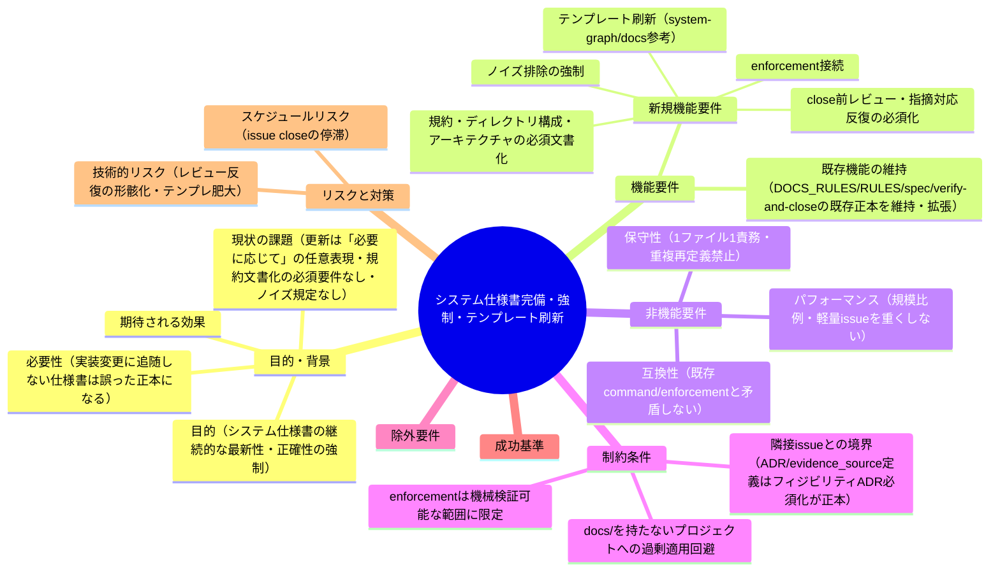
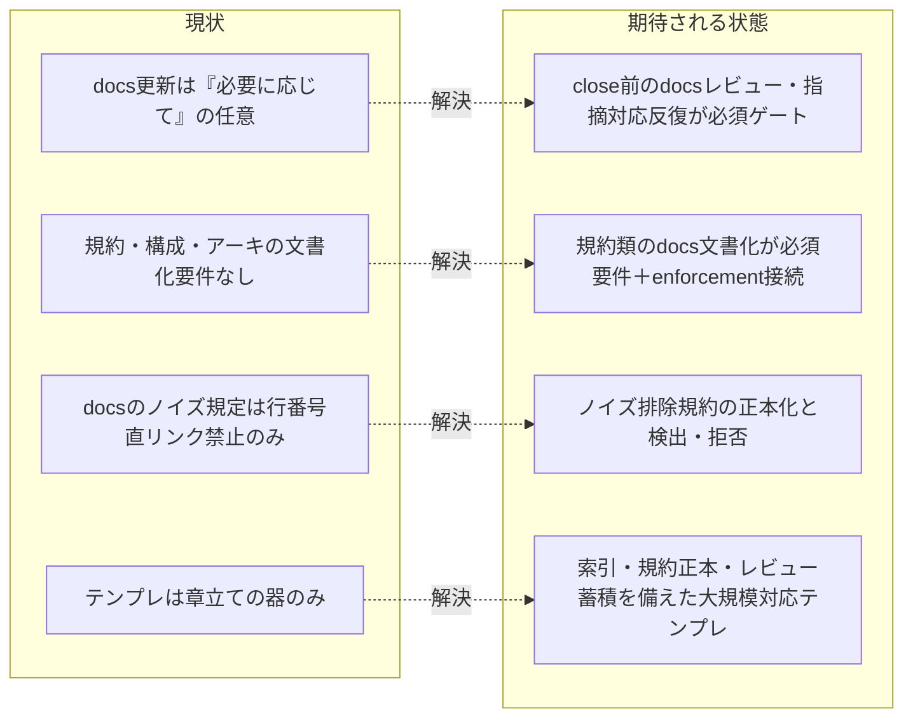

# 要求定義書: システム仕様書の完備・強制・テンプレート刷新（継続的な最新性・正確性の保証）

**プロジェクト名**: システム仕様書の完備・強制・テンプレート刷新
**作成日**: 2026 年 07 月 11 日
**最終更新**: 2026 年 07 月 11 日

> **重要**:
>
> - 要求定義書は、プロジェクトの全体像を把握するためのものです。詳細な技術仕様や実装方法は要件定義書以降で記載します。必要最低限の情報に収めることを心掛けてください。
> - **このドキュメントは常に更新**: 要求の変更や追加があった場合は、即座にこのドキュメントを更新してください。ドキュメントは「生きているドキュメント」として扱い、実装内容と常に同期させます。
> - **必須項目**: 以下の「必須」と明記した項目は空欄・抽象語のみ（例: 「{説明}」のまま）で提出しないこと。判定可能な形（目的は1文・成功基準は○/×で判定できる記載等）で記入すること。
>
> **用語**: [.agent-skill-chain/source/CONCEPTS.md §用語規約](../../../../../../.agent-skill-chain/source/CONCEPTS.md#用語規約) を参照。

---

## 要求定義の全体像

**注意**:

- マインドマップは全体像を把握するためのものであり、詳細は本文の各セクションに記載する。

---

## 1. 目的・背景

### 1.1 目的（必須）

システム仕様書（`docs/`）が実装の変化に追随し、常に最新かつ正しい内容であることを継続的に強制する。

> **ユーザーの最上位意図（原文。evidence_source: human_decision・2026-07-11）**: 「システム仕様書の完備・強制・ノイズ排除・テンプレート刷新・close 前レビュー必須化とは、システム仕様書が常に最新でただしい内容になっていることを強制するために依頼しています。」
> → 本 issue が扱う 5 手段（§2.2）はすべてこの単一目的に資する手段であり、目的そのものではない。

### 1.2 背景

- **現状の課題**:
  - **更新が任意表現**: [.agent-skill-chain/source/commands/verify-and-close.md](../../../../../../.agent-skill-chain/source/commands/verify-and-close.md) §実行時の注意は「システム仕様書（docs/）の更新: **必要に応じて**加筆修正する」であり、[.agent-skill-chain/runtime/templates/04_review.md](../../../../../../.agent-skill-chain/runtime/templates/04_review.md) §11 も「確認」は必須だが更新・レビュー指摘対応の**反復**までは強制していない（両ファイルで表現を確認済み。evidence_source: existing_code）。実装が変わっても仕様書が更新されないまま issue が close できる。
  - **規約類の文書化が必須要件でない**: greenfield（開発環境・規約が未整備）プロジェクトで最重要となるコーディング規約・ディレクトリ構成・アーキテクチャについて、[.agent-skill-chain/source/spec/](../../../../../../.agent-skill-chain/source/spec/) は抽象的な設計原則（01_設計原則・02_ディレクトリ構造方針）を置くのみで、**プロジェクト固有の規約を「誰が見ても理解できるシステム仕様書レベル」で `docs/` に必ず文書化させる要件が存在しない**。現行テンプレート `.agent-skill-chain/runtime/templates/docs/` の `01_システム概要/` は 01_プロジェクト概要・02_ステークホルダー・03_アーキテクチャ・04_ディレクトリ構成のみで、**規約（コーディングルール等）のセクションが無い**（ディレクトリ実在確認済み。evidence_source: existing_code）。
  - **ノイズ排除の規定がドキュメントに無い**: ソースコードには [.agent-skill-chain/source/CODE_COMMENT_RULES.md](../../../../../../.agent-skill-chain/source/CODE_COMMENT_RULES.md)（外部参照の陳腐化防止・CI grep 検出）があるが、システム仕様書に対しては [.agent-skill-chain/source/DOCS_RULES.md](../../../../../../.agent-skill-chain/source/DOCS_RULES.md) に「行番号直リンク禁止」があるのみで、**陳腐化した記述・実装と矛盾する記述（ノイズ）の混入を検出・拒否する包括的な規定が無い**（evidence_source: existing_code）。
  - **テンプレートが大規模プロジェクトに耐えない**: 現行 `.agent-skill-chain/runtime/templates/docs/` は章立て（01〜05・99・00_review）と更新履歴表の器のみで、規約正本のドメイン別分離・索引（探したいこと→正本ファイル）・レビュー記録の蓄積運用・ID 全数採番方針など、大規模化しても破綻しない構造を備えていない。
- **必要性**:
  - 実装に追随しないシステム仕様書は「誤った正本」となり、AI・人間の双方を誤誘導する。本パッケージの思想（正本 1 か所・陳腐化防止・enforcement による強制）をシステム仕様書そのものに適用する必要がある。
  - ユーザー要求（原文。evidence_source: human_decision・2026-07-11）: 「まだ開発環境がないようなプロジェクトの場合、規約の整理が最も重要です。ADR とともにコーディングルールやディレクトリ構成、アーキテクチャーを必ず決める必要があり、これらは誰が見ても理解できるシステム仕様書レベルに明記する必要があります。それらの強制も必要です。システム仕様書についてもソースコード同様にノイズが入らないように強制することも忘れずに。さらに /home/adachi/projects/system-graph/docs を参考にテンプレートを大規模に耐えうる汎用的かつ正しいものにしてください。また、各 issue 完了前に必ずシステム仕様書のレビュー指摘対応の反復なども強制させてください。」
- **参考実例（evidence_source: external_spec）**: `/home/adachi/projects/system-graph/docs` を実際に調査（Glob/Read で本 issue 起票時に再検証済み）。「実装変更のたびに仕様書を追随させ続ける」運用が実践されている。
  - `docs/README.md` の**更新履歴テーブル**: 版番号 1.0.0→2.8.0 まで、実装変更のたびに変更内容と対応レビュー記録（`97_レビュー記録/YYYYMMDD_HHMMSS_*.md`）へのリンクを追記し続けている（継続追随の具体例）。
  - `97_レビュー記録/`: **51 件**の docs×実装照合レビュー記録が蓄積。各記録は「指摘 N→0」の反復収束と「as-built 同期（向き＝実装→仕様）」を明記する運用。
  - `01_システム概要/05_規約/`: 規約正本を `00_索引と探し方`（「探したいこと→正本ファイル」表＋AI 向け grep ヒント表＋Diátaxis 位置づけ）と `10_フロントエンド`〜`90_横断関心` のドメイン別フォルダに分離。
  - `00_リポジトリ運用/adr/`: ADR-0006〜0016 の複製フォルダ（リポジトリ側正本）。
  - `99_ID命名規則と管理/`: G/F/API/S/T の ID 採番を一元管理し「全数採番」方針を明記。

### 1.3 期待される効果（必須: 1 件以上）

- **効果 1**: 実装変更を伴う issue の close 時に、システム仕様書の更新（または「更新不要」の根拠付き判定）とレビュー指摘対応の反復が必須ゲートとなり、更新漏れのまま close できなくなる（○/× 判定可能: verify-and-close の DoD・enforcement の失敗条件に該当項目が存在するか）。
- **効果 2**: greenfield プロジェクトでコーディング規約・ディレクトリ構成・アーキテクチャが `docs/` に必ず文書化され、grep で該当文書の存在を検証できる（○/× 判定可能）。
- **効果 3**: システム仕様書のノイズ（陳腐化・実装との矛盾記述）を禁止する規約が正本化され、レビュー・監査で検出・拒否できる（○/× 判定可能）。
- **効果 4**: `.agent-skill-chain/runtime/templates/docs/` が規約正本・索引・レビュー記録蓄積・更新履歴の継続運用を備えた大規模対応テンプレートに刷新される（○/× 判定可能: テンプレートに該当構造が存在するか）。

**現状と期待される状態の比較**:

---

## 2. 機能要件

### 2.1 既存機能の維持（該当する場合）

- [.agent-skill-chain/source/DOCS_RULES.md](../../../../../../.agent-skill-chain/source/DOCS_RULES.md) の「issue を立てない」「`docs/00_review/` にレビュー結果を記録」「`docs/README.md` 更新履歴に追記」の既存フローは維持し、**拡張**する（置き換えない）。
- [.agent-skill-chain/source/commands/verify-and-close.md](../../../../../../.agent-skill-chain/source/commands/verify-and-close.md) の既存 skill chain（generate-scenarios → map-coverage → review-code → review-architecture → write-workflow-log）の順序・DoD は維持し、システム仕様書ゲートを**追加**する。
- [.agent-skill-chain/source/CODE_COMMENT_RULES.md](../../../../../../.agent-skill-chain/source/CODE_COMMENT_RULES.md) はソースコード層の正本のまま維持する（本 issue はその思想の `docs/` 層への適用であり、同ファイルは変更しない）。
- [.agent-skill-chain/source/spec/](../../../../../../.agent-skill-chain/source/spec/) の「spec＝設計原則（全プロジェクト・低頻度変更）／docs＝具体仕様（個別プロジェクト・高頻度変更）」の区別（spec/00_spec概要.md）を維持する。

### 2.2 新規機能要件

最上位目的（§1.1）に資する 5 手段。番号は以後 R-1〜R-5 として参照する。

- **R-1 規約・構成・アーキテクチャの必須文書化**: コーディング規約・ディレクトリ構成・アーキテクチャを「誰が見ても理解できるシステム仕様書レベル」で `docs/` に文書化することを、greenfield プロジェクト（開発環境・規約が未整備のプロジェクト）で必須要件とする。文書化先の標準構造（`01_システム概要/05_規約/` 等）をテンプレートで提供する。
- **R-2 enforcement 接続**: R-1・R-3・R-5 の義務を [.agent-skill-chain/source/enforcement/](../../../../../../.agent-skill-chain/source/enforcement/README.md) の既存 4 層（platform 権限／PreToolUse hook／wrapper／CI audit）のいずれかに接続し、逸脱を検出・差し戻しできるようにする。機械検証可能な範囲（ファイル存在・grep 検出・証跡突合）に限定し、fail-open 方針等の既存設計と整合させる。
- **R-3 ノイズ排除の強制**: システム仕様書に対するノイズ（陳腐化した記述・実装と矛盾する記述・正本が別にある内容の重複記述・行番号直リンク等の壊れやすい参照）を禁止する規約を正本化する。CODE_COMMENT_RULES.md がソースコード層で行っている「陳腐化防止・grep 検出可能性」の思想をドキュメント層に適用する。
- **R-4 テンプレート刷新**: `.agent-skill-chain/runtime/templates/docs/` を `/home/adachi/projects/system-graph/docs` の実践を参考に、大規模プロジェクトに耐える汎用構造へ刷新する。最低限、(a) 規約正本のドメイン別分離＋索引（探したいこと→正本ファイル・grep ヒント）、(b) レビュー記録の蓄積・索引運用（97_レビュー記録相当＝本パッケージの `docs/00_review/`）、(c) 更新履歴とレビュー記録の相互リンク運用、(d) ID 採番の全数採番方針、を取り込む。
- **R-5 close 前レビュー反復の必須化**: 各 issue の close 前（verify-and-close）に、システム仕様書のレビュー→指摘対応→再レビューの反復を「指摘 0 件」まで必須化する。実装変更があるのに仕様書が未更新のまま close する経路を塞ぐ**継続追随ゲート**として位置づける（更新不要の場合は根拠付きの「更新不要」判定を証跡に残す）。

---

## 3. 非機能要件

### 3.1 パフォーマンス

- 規模比例の原則（[.agent-skill-chain/source/CONTEXT_EFFICIENCY.md](../../../../../../.agent-skill-chain/source/CONTEXT_EFFICIENCY.md) の思想）に従い、docs-only・軽微修正など実装変更を伴わない issue の close を重くしない。R-5 のゲートは「実装変更（コード・設定・契約の変更）を伴う issue」に比例して発動する。

### 3.2 セキュリティ

- enforcement 接続（R-2）は既存の PreToolUse hook の stdin JSON 契約・exit code 規約（違反=2／許可=0）・fail-open 方針を変更・緩和しない。

### 3.3 互換性

- 既存の command / skill chain の実行順序・DoD・audit 失敗条件と矛盾しないこと。既存の close 済み issue・既存プロジェクトの `docs/` に遡及適用しない。
- `docs/` を持たない（システム仕様書を採用していない）消費者プロジェクトでは、R-1〜R-5 のゲートが誤発動しないこと。

### 3.4 保守性

- 1 ファイル 1 責務・正本 1 か所。ノイズ排除規約（R-3）の正本は 1 ファイルに置き、verify-and-close・テンプレート等の接続先には参照のみを書く。テンプレート（R-4）は器と方針を提供し、プロジェクト固有内容はプレースホルダとする。

---

## 4. 制約条件

### 4.1 技術的制約

- **隣接 issue との境界（重複再定義禁止）**: ADR・evidence_source 関連の定義は隣接サブ issue [フィジビリティADR必須化](../20260711_055538_フィジビリティADR必須化/00_要求定義.md)（および [.agent-skill-chain/source/CONCEPTS.md §外部根拠の必須化](../../../../../../.agent-skill-chain/source/CONCEPTS.md#外部根拠の必須化external-anchor)）が正本であり、本 issue では再定義しない。本 issue は「システム仕様書のコンテンツ完備・強制・ノイズ排除・テンプレート・継続追随ゲート」に専念する。「規約を ADR として**決定・記録する**」のは隣接 issue、「決定された規約を**システム仕様書に文書化し追随させ続ける**」のが本 issue である。
- enforcement（R-2）で強制できるのは機械検証可能な範囲（ファイル存在・grep パターン・証跡突合）に限る。「内容が正しいか」の意味的検証はレビュー反復（R-5）と監査が担う二段構えとする。
- 新規ファイル追加か既存ファイル（DOCS_RULES.md・verify-and-close.md・04_review テンプレート等）への追記かの設計判断は 02_設計フェーズで確定する（本 00/01 では要件と受け入れ基準のみを定める）。

### 4.2 既存システムとの互換性

- CODE_COMMENT_RULES.md・DOCS_RULES.md・RULES.md（§システム仕様書）・spec/ の既存規定を変更する場合は「拡張・参照接続」に限り、既存の禁止・許可の意味を弱めない。
- 自己拡張ランタイム（本リポ）ではシステム仕様書相当の運用が `docs/maintainer/` 等で異なるため、`.agent-skill-chain/project/` による上書き余地を残す。

### 4.3 移行期間・スケジュール

- 本サブ issue は親 issue（agentsOS 汎用化・ポリシー統合）のストーリー 1〜8 実装完了後の設計フェーズ群に属する。実装は親 issue のストーリー 8（`.agent-skill-chain/source/` → `.agent-skill-chain/` 改名）の影響を受けるため、実装着手順は orchestrator が別途判断する。
- **隣接サブ issue「フィジビリティADR必須化」（`90_issues/20260711_055538_フィジビリティADR必須化/`）と関連するが、独立して進行可能である**（対象ファイル系統が異なる: あちらは commands/requirement-discovery・design-feature への evidence_source 接続、本 issue は `.agent-skill-chain/source/spec/`・`.agent-skill-chain/source/DOCS_RULES.md`・`.agent-skill-chain/runtime/templates/docs/`・`.agent-skill-chain/source/enforcement/`・`verify-and-close.md` が主対象）。

---

## 5. 除外要件

- ADR・evidence_source の定義・形式・command（requirement-discovery / design-feature）への接続は対象外（隣接サブ issue「フィジビリティADR必須化」の範囲）。
- 過去の close 済み issue・既存プロジェクトの `docs/` への遡及的な是正・再レビューは対象外。
- システム仕様書の内容の意味的正しさを完全自動検証する仕組み（LLM 判定の自動 CI 化等）は対象外（機械検証は存在・形式・証跡の範囲に限定し、意味的検証はレビュー反復で担う）。
- system-graph/docs の内容（個別プロジェクトの具体仕様）の移植は対象外（参考にするのは**構造と運用パターン**のみ）。
- implement-feature 等、close（verify-and-close）以外のフェーズへの docs ゲート追加は必須範囲外（02_設計で費用対効果を検討してよいが成功基準に含めない）。

---

## 6. 成功基準（必須: 1 件以上）

- **SC-1**（R-1）: greenfield プロジェクトにおいてコーディング規約・ディレクトリ構成・アーキテクチャを `docs/` に文書化することを必須とする要件が正本ファイルに明記され、grep で該当行を提示できる。
- **SC-2**（R-1/R-4）: `.agent-skill-chain/runtime/templates/docs/` に規約の標準構造（規約正本の置き場所＋索引）が存在し、コーディング規約・ディレクトリ構成・アーキテクチャの書き先がテンプレートとして提供されている。
- **SC-3**（R-2）: R-1・R-3・R-5 の義務のうち機械検証可能なものが enforcement（audit の失敗条件等）に接続され、違反時に FAIL となる検査が定義されている（検査の存在を enforcement 正本で grep 提示できる）。
- **SC-4**（R-3）: システム仕様書のノイズ排除規約（禁止パターン: 陳腐化記述・実装と矛盾する記述・正本重複・壊れやすい参照）が 1 か所の正本として存在し、DOCS_RULES.md 等から参照で接続されている（重複再定義が無い）。
- **SC-5**（R-4）: 刷新後のテンプレートが system-graph/docs 由来の 4 要素（規約ドメイン別分離＋索引／レビュー記録の蓄積・索引／更新履歴とレビュー記録の相互リンク／ID 全数採番方針）を備えている。
- **SC-6**（R-5）: verify-and-close（または接続先の正本）に「実装変更を伴う issue の close 前に、システム仕様書のレビュー→指摘対応→再レビューを指摘 0 件まで反復する（更新不要の場合は根拠付き判定を証跡に残す）」義務が明記され、現行の「必要に応じて」の任意表現が必須ゲート表現に置き換わっている。
- **SC-7**（境界）: ADR・evidence_source の分類・形式の定義が本 issue の成果物内に重複再定義されていない（隣接 issue・CONCEPTS.md への参照のみである）。
- **SC-8**（規模比例）: docs 更新ゲートの適用条件（実装変更を伴う issue に限る等）と軽量パスが明文化され、docs-only 軽量 issue の close が過剰に重くならない。

---

## 7. リスクと対策

### 7.1 技術的リスク

- **リスク**: レビュー反復の形骸化。「指摘 0 件」を出すためだけの儀式的レビューになり、実装との照合が行われない。
  - **対策**: レビュー記録に「照合した実装（ファイル・契約）と検証方法」の記載を必須とし（system-graph の 97_レビュー記録の「as-built 同期・向き＝実装→仕様」「指摘 N→0」形式を参考）、監査（audit）で証跡の存在・形式を検査する。
- **リスク**: テンプレート肥大。大規模対応を意識しすぎて小規模プロジェクトに過剰な器を強いる。
  - **対策**: SC-8 の規模比例を成功基準に含め、テンプレートは「必須の骨格＋任意の拡張」を区別して提供する。
- **リスク**: 二重定義。ノイズ排除規約が CODE_COMMENT_RULES.md・DOCS_RULES.md と重複し、将来の変更で分裂する。
  - **対策**: 正本 1 か所＋参照接続を SC-4 で検証する。責務境界（コード層＝CODE_COMMENT_RULES、docs 層＝本 issue の成果物）を 02_設計で明記する。

### 7.2 スケジュールリスク

- **リスク**: close 前ゲートの追加により issue close が停滞し、開発スループットが低下する。
  - **対策**: 適用条件を「実装変更を伴う issue」に限定（SC-8）し、更新不要の場合は根拠付き判定 1 件で通過できる軽量パスを設ける。

---

## 8. 参考資料

### プロジェクトドキュメント

- 親 issue: [`00_要求定義.md`](../../00_要求定義.md)・[`90_issues.md`](../../90_issues.md)
- 隣接サブ issue（境界の相手・分割元）: [`フィジビリティADR必須化/00_要求定義.md`](../20260711_055538_フィジビリティADR必須化/00_要求定義.md)（§5 除外要件・§9 分割提案が本 issue の起点）

### その他の参考資料

- [.agent-skill-chain/source/DOCS_RULES.md](../../../../../../.agent-skill-chain/source/DOCS_RULES.md) — システム仕様書の作成・更新ルール（本 issue が拡張する正本）
- [.agent-skill-chain/source/CODE_COMMENT_RULES.md](../../../../../../.agent-skill-chain/source/CODE_COMMENT_RULES.md) — ソースコード層のノイズ排除規約（R-3 の思想的比較対象）
- [.agent-skill-chain/source/RULES.md](../../../../../../.agent-skill-chain/source/RULES.md) §システム仕様書
- [.agent-skill-chain/source/spec/](../../../../../../.agent-skill-chain/source/spec/)（00_spec概要・01_設計原則・02_ディレクトリ構造方針）— spec と docs の役割区別
- [.agent-skill-chain/source/enforcement/README.md](../../../../../../.agent-skill-chain/source/enforcement/README.md)・[DESIGN.md](../../../../../../.agent-skill-chain/source/enforcement/DESIGN.md) — 強制の 4 層（R-2 の接続土台）
- [.agent-skill-chain/source/commands/verify-and-close.md](../../../../../../.agent-skill-chain/source/commands/verify-and-close.md)・[.agent-skill-chain/runtime/templates/04_review.md](../../../../../../.agent-skill-chain/runtime/templates/04_review.md) §11 — 現行の「必要に応じて」表現（R-5 の変更対象）
- [.agent-skill-chain/runtime/templates/docs/](../../../../../../.agent-skill-chain/runtime/templates/docs/) — 現行テンプレート（R-4 の刷新対象）
- [.agent-skill-chain/source/CONCEPTS.md §外部根拠の必須化](../../../../../../.agent-skill-chain/source/CONCEPTS.md#外部根拠の必須化external-anchor) — evidence_source の正本（本 issue では参照のみ）
- **参考実例**: `/home/adachi/projects/system-graph/docs`（別プロジェクト・読み取り専用参照。`README.md` 更新履歴 1.0.0→2.8.0 の継続追随運用、`97_レビュー記録/` 51 件の docs×実装照合記録、`01_システム概要/05_規約/` のドメイン別規約＋索引、`00_リポジトリ運用/adr/`、`99_ID命名規則と管理/` の全数採番方針。本 issue 起票時に Read/ls で実地検証済み）
- Diátaxis framework（system-graph の規約索引が採用するドキュメント分類。テンプレ設計の参考）

---

## 9. 次のステップ

この要求定義書の承認後、以下のドキュメントを作成します：

- **次**: [`01_要件定義.md`](./01_要件定義.md) - 要件定義フェーズ
