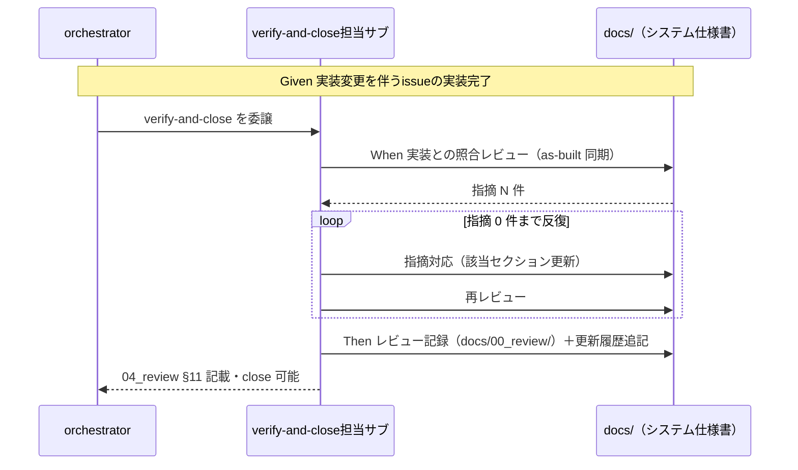

# 要件定義書: システム仕様書の完備・強制・テンプレート刷新（継続的な最新性・正確性の保証）

**プロジェクト名**: システム仕様書の完備・強制・テンプレート刷新
**作成日**: 2026 年 07 月 11 日
**最終更新**: 2026 年 07 月 11 日

> **重要**: **このドキュメントは常に更新**: 要件の変更や追加があった場合は、即座にこのドキュメントを更新してください。ドキュメントは「生きているドキュメント」として扱い、実装内容と常に同期させます。
>
> **用語**: [.agents/CONCEPTS.md §用語規約](../../../../../../.agents/CONCEPTS.md#用語規約) を参照。

---

## 1. 概要

### 1.1 システム概要

システム仕様書（`docs/`）が実装の変化に追随し、常に最新かつ正しい内容であることを継続的に強制するため、(R-1) 規約・ディレクトリ構成・アーキテクチャの必須文書化、(R-2) enforcement 接続、(R-3) ノイズ排除の強制、(R-4) `.workflow/templates/docs/` の大規模対応刷新、(R-5) issue close 前のシステム仕様書レビュー・指摘対応反復の必須化、の 5 手段を本パッケージ（agent-skill-chain）の規約・テンプレート・enforcement に組み込む。R-1〜R-5 の定義と成功基準（SC-1〜SC-8）の正本は [00_要求定義.md](./00_要求定義.md) にあり、本書では再定義せず参照する。

### 1.2 用語集

| 用語 | 説明 |
| -------- | ------ |
| システム仕様書 | 消費者プロジェクトの `docs/` 配下に置く納品物レベルの仕様書（[.agents/DOCS_RULES.md](../../../../../../.agents/DOCS_RULES.md) が運用ルールの正本）。spec（設計原則）とは区別される（spec/00_spec概要.md） |
| ノイズ | システム仕様書における、陳腐化した記述・実装と矛盾する記述・正本が別にある内容の重複記述・壊れやすい参照（行番号直リンク等）。「最新かつ正しい」状態の維持を妨げる記述の総称 |
| 継続追随ゲート | 実装変更を伴う issue の close 前に、システム仕様書が実装に追随しているかを検証し、指摘 0 件まで反復させる必須ゲート（R-5） |
| as-built 同期 | 実装の現状（as-built）を正として仕様書側を照合・更新するレビューの向き（実装→仕様）。system-graph/docs `97_レビュー記録/` で実践されている運用 |
| greenfield プロジェクト | 開発環境・規約が未整備の新規プロジェクト。R-1（規約類の必須文書化）の主対象 |
| 規約索引 | 「探したいこと→正本ファイル」対応表と AI 向け grep ヒント表からなる、規約正本への最短到達手段（system-graph の `05_規約/00_索引と探し方/` 相当） |
| 更新不要判定 | 実装変更が仕様書の記載範囲に影響しないことを根拠付きで判定した証跡。R-5 の軽量パス |

---

## 2. 機能要件

### 2.1 ユーザーストーリー

#### ストーリー 1: 継続追随ゲート（close 前レビュー反復の必須化・R-5）

- **As a** orchestrator / verify-and-close 担当サブエージェント
- **I want to** 実装変更を伴う issue の close 前に、システム仕様書のレビュー→指摘対応→再レビューを指摘 0 件まで必ず反復したい
- **So that** 実装だけが進んで仕様書が古いまま issue が完了する経路を塞ぎ、仕様書が常に最新かつ正しい状態を保てる

**受け入れ基準**:

- **AC-1a**: verify-and-close（または接続先正本）に、実装変更を伴う issue の close 前のシステム仕様書レビュー反復（指摘 0 件まで）の義務が明記されている。現行の「必要に応じて加筆修正する」（verify-and-close.md §実行時の注意）の任意表現が必須ゲート表現に置き換わっている（SC-6）。
- **AC-1b**: レビュー記録は `docs/00_review/YYYYMMDD_HHMMSS_review.md` に「照合した実装（ファイル・契約）・検証方法・指摘 N→0 の反復経過」を含めて記録され、`docs/README.md` 更新履歴とレビュー記録が相互リンクされる。
- **AC-1c**: 実装変更が仕様書の記載範囲に影響しない場合は、根拠付きの「更新不要判定」1 件で通過できる（軽量パス。SC-8）。
- **AC-1d**: 04_review.md（§11 システム仕様書の更新）に、レビュー反復の結果（更新内容 or 更新不要判定・対応レビュー記録への参照）が記載される。

#### ストーリー 2: 規約・構成・アーキテクチャの必須文書化（R-1）

- **As a** greenfield プロジェクトを立ち上げる開発チーム（および要求・設計フェーズの担当サブエージェント）
- **I want to** コーディング規約・ディレクトリ構成・アーキテクチャを「誰が見ても理解できるシステム仕様書レベル」で `docs/` に必ず文書化したい
- **So that** 規約が暗黙知のまま実装が進み、後から参照する AI・人間が誤った前提で作業することを防げる

**受け入れ基準**:

- **AC-2a**: greenfield プロジェクトでコーディング規約・ディレクトリ構成・アーキテクチャの `docs/` への文書化を必須とする要件が正本ファイルに明記されている（grep で提示可能。SC-1）。
- **AC-2b**: 文書化先の標準構造（規約正本の置き場所＋規約索引）が `.workflow/templates/docs/` に存在する（SC-2）。
- **AC-2c**: 「規約を ADR として決定・記録する」プロセスは隣接 issue（フィジビリティADR必須化）の成果物への参照で接続され、本 issue の成果物内に ADR 形式・evidence_source 分類の再定義が無い（SC-7）。

#### ストーリー 3: ノイズ排除の強制（R-3）

- **As a** システム仕様書を更新・レビューするエージェント
- **I want to** 陳腐化記述・実装と矛盾する記述・正本重複・壊れやすい参照をシステム仕様書に混入させない規約に従いたい（違反はレビュー・監査で検出・拒否されてほしい）
- **So that** ノイズの蓄積によって仕様書の「最新かつ正しい」状態が侵食されることを防げる

**受け入れ基準**:

- **AC-3a**: ノイズ排除規約（禁止パターンの列挙と判定基準）が 1 か所の正本として存在し、DOCS_RULES.md 等から参照で接続されている（SC-4）。
- **AC-3b**: 禁止パターンに最低限、(i) 実装と矛盾する記述、(ii) 陳腐化した記述（更新されず実態と乖離した記述）、(iii) 正本が別にある内容の重複記述、(iv) 壊れやすい参照（行番号直リンク等。既存の DOCS_RULES §行番号直リンク禁止を包含または参照）を含む。
- **AC-3c**: CODE_COMMENT_RULES.md（コード層）との責務境界が明記され、双方の禁止・許可の意味を変えない。

#### ストーリー 4: テンプレート刷新（R-4）

- **As a** 消費者プロジェクトでシステム仕様書を新規に立ち上げるエージェント
- **I want to** 大規模プロジェクトに耐える汎用的なシステム仕様書テンプレートから開始したい
- **So that** プロジェクトが成長しても仕様書構造が破綻せず、規約正本・レビュー記録・更新履歴の継続運用が最初から機能する

**受け入れ基準**:

- **AC-4a**: 刷新後の `.workflow/templates/docs/` が次の 4 要素を備える（SC-5）: (a) 規約正本のドメイン別分離＋規約索引（探したいこと→正本ファイル・grep ヒント）、(b) レビュー記録の蓄積・索引運用（`docs/00_review/` の索引化）、(c) `docs/README.md` 更新履歴とレビュー記録の相互リンク運用（版番号・変更内容・対応レビュー記録リンク）、(d) ID 採番の全数採番方針（既存 `99_ID命名規則と管理/` の拡張）。
- **AC-4b**: テンプレートは「必須の骨格」と「任意の拡張」を区別し、小規模プロジェクトに過剰な器を強いない（SC-8 と整合）。
- **AC-4c**: 既存テンプレート（01〜05・99・00_review・README の更新履歴表）と非互換な破壊的変更をしない（既存章立ては維持または上位互換で拡張する）。
- **AC-4d**: system-graph/docs の**個別プロジェクト固有内容は移植しない**（構造・運用パターンのみを汎用化して取り込む）。

#### ストーリー 5: enforcement 接続（R-2）

- **As a** リポジトリ管理者（および CI）
- **I want to** R-1・R-3・R-5 の義務のうち機械検証可能なものを enforcement（audit 等）で検査し、違反を FAIL・差し戻しにしたい
- **So that** 規約が「理解させる」止まりにならず「逸脱できない」状態になる

**受け入れ基準**:

- **AC-5a**: 機械検証可能な検査（例: 実装変更を伴う issue の close 証跡に docs レビュー記録または更新不要判定が存在するか、04_review §11 が記載されているか）が enforcement の失敗条件として定義されている（SC-3）。
- **AC-5b**: 検査は既存の 4 層設計（runtime hook は fail-open・最終保証は CI audit）と整合し、既存の失敗条件・exit code 規約を変更・緩和しない。
- **AC-5c**: `docs/` を持たないプロジェクト・実装変更を伴わない issue では検査が誤発動（false positive）しない条件が定義されている（SC-8）。
- **AC-5d**: 意味的検証（記述内容が実装と一致するか）は機械検査の対象外であることが明記され、レビュー反復（ストーリー 1）が担う二段構えとして設計される。

### 2.2 BDD ユースケース

#### ユースケース 1: 継続追随ゲート（実装変更に仕様書が追随しないまま close される事故の防止）

実装変更を伴う issue の verify-and-close 実行時に、システム仕様書の追随を検証・強制する。

**シナリオ 1: 実装変更があるのに仕様書未更新のまま close しようとして差し戻される**

```gherkin
Feature: issue close 前のシステム仕様書継続追随ゲート
  Scenario: 実装変更を伴う issue が docs 未更新・レビュー記録なしで close されようとする
    Given システム仕様書（docs/）を採用しているプロジェクトで、実装変更（コード・設定・契約の変更）を含む issue が実装フェーズを完了している
    And docs/ の該当セクションは実装変更の影響を受けるが更新されておらず、docs/00_review/ に本 issue 対応のレビュー記録も更新不要判定も存在しない
    When verify-and-close（または CI audit）が実行される
    Then システム仕様書レビューの証跡欠落が検出され、close は FAIL（差し戻し）となる
    And 差し戻し理由として「docs レビュー記録または更新不要判定が必要」が提示される
```

**シナリオ 2: レビュー→指摘対応→再レビューの反復で指摘 0 件になってから close できる**

```gherkin
Feature: issue close 前のシステム仕様書継続追随ゲート
  Scenario: docs レビューで指摘が出た場合、指摘 0 件まで反復してから close する
    Given 実装変更を伴う issue の verify-and-close で、docs/ と実装の照合レビューが実施され指摘が N 件（N>0）検出されている
    When 担当エージェントが指摘対応（docs/ の該当セクション更新）を行い、再レビューを実施する
    Then 指摘が 0 件になるまでレビューと修正が反復され、反復経過（指摘 N→0）が docs/00_review/ のレビュー記録に記録される
    And docs/README.md の更新履歴に版番号・変更内容・当該レビュー記録へのリンクが追記され、04_review.md §11 に結果が記載されてはじめて close 可能となる
```

**処理フロー**:



**シナリオ 3: 実装変更が仕様書に影響しない場合は根拠付き更新不要判定で通過する（軽量パス）**

```gherkin
Feature: issue close 前のシステム仕様書継続追随ゲート
  Scenario: 仕様書の記載範囲に影響しない実装変更は軽量パスで通過する
    Given 実装変更を伴う issue だが、変更内容がシステム仕様書の記載範囲（章立て・契約・規約）に影響しない
    When verify-and-close で更新要否が判定される
    Then 「更新不要」の判定が根拠（影響しないことの確認方法・対象範囲）付きで証跡に記録され、docs/ 本体の更新なしで close できる
```

**シナリオ 4: docs を採用しないプロジェクトではゲートが発動しない（誤発動防止）**

```gherkin
Feature: issue close 前のシステム仕様書継続追随ゲート
  Scenario: docs/（システム仕様書）を採用していないプロジェクトでの close
    Given システム仕様書（docs/）を採用していない消費者プロジェクトで issue が実装フェーズを完了している
    When verify-and-close（または CI audit）が実行される
    Then システム仕様書ゲートは発動せず、既存の close 手順のみで完了できる
```

#### ユースケース 2: ノイズ排除の強制（陳腐化・矛盾記述の検出・拒否）

システム仕様書の更新・レビュー時に、ノイズの混入を検出し拒否する。

**シナリオ 1: 実装と矛盾する記述（陳腐化ノイズ）がレビューで検出・拒否される**

```gherkin
Feature: システム仕様書のノイズ排除
  Scenario: 実装と矛盾する陳腐化記述が docs レビューで検出される
    Given システム仕様書のあるセクションに、過去の実装を前提とした記述（例: 廃止済み API・変更済みディレクトリ構成への言及）が残っている
    When 継続追随ゲートの docs レビュー（as-built 同期・向き＝実装→仕様）が実行される
    Then 当該記述はノイズ（実装との矛盾）として指摘され、是正（実装に合わせた更新または削除）されるまで指摘 0 件にならない
    And 指摘と是正の経過がレビュー記録に残る
```

**シナリオ 2: 正本重複・壊れやすい参照の混入が規約違反として拒否される**

```gherkin
Feature: システム仕様書のノイズ排除
  Scenario: 正本が別にある内容の重複記述や行番号直リンクを追記しようとする
    Given ノイズ排除規約が正本化されており、正本重複・行番号直リンク（<file>.md:NNN 形式）が禁止パターンに含まれている
    When エージェントがシステム仕様書に正本重複の長文コピーまたは行番号直リンクを含む更新を行う
    Then レビューまたは監査（機械検証可能なパターンは enforcement の grep 検査）が違反を検出し、参照接続（§アンカー参照・正本へのリンク 1 行）への是正を要求する
```

#### ユースケース 3: greenfield プロジェクトの規約必須文書化

規約未整備のプロジェクトで、規約・構成・アーキテクチャの文書化を必須にする。

**シナリオ 1: 規約類が文書化されないまま実装に進もうとして要件違反となる**

```gherkin
Feature: greenfield プロジェクトの規約・構成・アーキテクチャ必須文書化
  Scenario: コーディング規約・ディレクトリ構成・アーキテクチャが docs/ に無いまま実装フェーズへ進もうとする
    Given greenfield プロジェクト（開発環境・規約が未整備）で要求・設計フェーズが進行している
    And docs/ にコーディング規約・ディレクトリ構成・アーキテクチャの文書が存在しない
    When 実装フェーズへの遷移（または close）が試みられる
    Then 規約類の必須文書化要件（SC-1）への違反として検出され、docs/ の標準構造（テンプレート提供の規約置き場＋索引）への文書化が要求される
    And 規約の決定プロセス（ADR 的記録）は隣接 issue「フィジビリティADR必須化」の成果物が定める形式への参照で接続される
```

**シナリオ 2: テンプレートから規約索引つきのシステム仕様書を立ち上げる**

```gherkin
Feature: 大規模対応テンプレートによるシステム仕様書の立ち上げ
  Scenario: 刷新後テンプレートで docs/ を初期化する
    Given 刷新後の .workflow/templates/docs/ が規約正本のドメイン別分離・規約索引・レビュー記録索引・更新履歴相互リンク・ID 全数採番方針を備えている
    When 消費者プロジェクトがテンプレートから docs/ を初期化し、コーディング規約・ディレクトリ構成・アーキテクチャを記入する
    Then 「探したいこと→正本ファイル」の索引から各規約正本に最短到達でき、以後の issue close ごとに更新履歴とレビュー記録が蓄積される構造が最初から機能する
```

### 2.3 ビジネスルール

- **BR-1（最上位目的）**: R-1〜R-5 のすべての設計判断は「システム仕様書が常に最新かつ正しい内容であることの継続的な強制」に資するかで優先順位を決める（00 §1.1）。
- **BR-2（正本 1 か所）**: ノイズ排除規約・継続追随ゲートの定義はそれぞれ 1 か所の正本に置き、接続先（verify-and-close・04_review テンプレート・DOCS_RULES 等）には参照のみを書く。
- **BR-3（境界）**: ADR・evidence_source の定義は CONCEPTS.md §外部根拠の必須化と隣接 issue「フィジビリティADR必須化」が正本。本 issue の成果物はそれらを参照するのみで再定義しない。
- **BR-4（規模比例）**: ゲート・テンプレートの適用は実装変更の有無・プロジェクト規模に比例させ、軽量 issue・小規模プロジェクトに過剰適用しない。
- **BR-5（二段構え）**: 機械検証（enforcement）は存在・形式・証跡の範囲、意味的検証（実装との一致）はレビュー反復の範囲、と役割分担する。
- **BR-6（as-built 同期）**: docs レビューの照合の向きは「実装→仕様」（実装を正として仕様書を追随させる）を基本とし、仕様が正で実装が誤りの場合は issue 化して実装側を是正する。

---

## 3. 非機能要件

### 3.1 パフォーマンス要件

- 継続追随ゲートの追加によって、実装変更を伴わない issue（docs-only・規約整備等）の close 所要が実質増加しないこと（軽量パス・発動条件で担保。SC-8）。
- テンプレート刷新後も、小規模プロジェクトの docs/ 初期化が「必須の骨格」のみで開始できること。

### 3.2 セキュリティ要件

- enforcement 接続は既存 PreToolUse hook の stdin JSON 契約・exit code 規約（違反=2／許可=0）・fail-open 方針を変更しない。
- 外部プロジェクト（system-graph）への参照は設計時の読み取り専用参考に留め、成果物に外部プロジェクトの絶対パス依存を持ち込まない。

### 3.3 ユーザビリティ要件

- 規約索引（探したいこと→正本ファイル・grep ヒント）により、人間・AI 双方が規約正本へ最短到達できること。
- ゲートの差し戻しメッセージは「何が欠けているか・どこに何を書けば通過できるか」を提示すること。

### 3.4 可用性要件

- runtime hook が利用できない環境（advisory のみのツール）でも、CI audit が最終保証として同一の失敗条件を検査できること（既存のツール別強制力マトリクスと整合）。

---

## 4. 外部インターフェース要件

### 4.1 API 要件

- 該当なし（本 issue はドキュメント規約・テンプレート・enforcement 検査の整備であり、外部 API を新設しない）。
- enforcement 検査を追加する場合は、既存 `audit.sh` の失敗条件の枠組み（番号付き失敗条件・対応表）に従って追加する。

### 4.2 データ形式要件

- レビュー記録は既存形式 `docs/00_review/YYYYMMDD_HHMMSS_review.md`（テンプレート `.workflow/templates/docs/00_review/` 準拠）を拡張して用いる。
- 証跡は workflow.db（write-workflow-log 経由）を本則とする（既存 CONTRACT 準拠。新形式を発明しない）。
- テンプレート成果物の frontmatter には document_id（UUID）を付与する（既存テンプレート規約と同一）。

---

## 5. 制約事項

- 対象ファイル系統は `.agents/spec/`・`.agents/DOCS_RULES.md`・`.workflow/templates/docs/`・`.agents/enforcement/`・`.agents/commands/verify-and-close.md`（＋04_review テンプレート）を主とし、隣接 issue の対象（commands/requirement-discovery・design-feature・CONCEPTS.md）は変更しない。
- 新規ファイル追加か既存ファイル追記かの設計判断は 02_設計で確定する（00 §4.1）。
- 実装は親 issue ストーリー 8（`.agents/` → `.agent-skill-chain/` 改名）の影響を受けるため、実装着手順は orchestrator が判断する（00 §4.3）。
- 既存の close 済み issue・既存プロジェクトの docs/ に遡及適用しない（00 §5）。

---

## 6. 参考資料

### プロジェクトドキュメント

- [`00_要求定義.md`](./00_要求定義.md) - 要求定義（R-1〜R-5・SC-1〜SC-8 の正本）

### その他の参考資料

- 親 issue: [`00_要求定義.md`](../../00_要求定義.md)・[`90_issues.md`](../../90_issues.md)
- 隣接サブ issue（境界の相手）: [`フィジビリティADR必須化/00_要求定義.md`](../20260711_055538_フィジビリティADR必須化/00_要求定義.md)・[`01_要件定義.md`](../20260711_055538_フィジビリティADR必須化/01_要件定義.md)
- [.agents/DOCS_RULES.md](../../../../../../.agents/DOCS_RULES.md)・[.agents/CODE_COMMENT_RULES.md](../../../../../../.agents/CODE_COMMENT_RULES.md)・[.agents/RULES.md](../../../../../../.agents/RULES.md)
- [.agents/commands/verify-and-close.md](../../../../../../.agents/commands/verify-and-close.md)・[.workflow/templates/04_review.md](../../../../../../.workflow/templates/04_review.md)
- [.agents/enforcement/README.md](../../../../../../.agents/enforcement/README.md)・[.agents/enforcement/DESIGN.md](../../../../../../.agents/enforcement/DESIGN.md)
- [.workflow/templates/docs/](../../../../../../.workflow/templates/docs/)（刷新対象の現行テンプレート）
- 参考実例: `/home/adachi/projects/system-graph/docs`（更新履歴・97_レビュー記録 51 件・05_規約ドメイン別分離＋索引・adr 複製・ID 全数採番。起票時に実地検証済み）

---

## 7. 前のステップ

この要件定義書は、以下のドキュメントを基に作成されています：

- **前**: [`00_要求定義.md`](./00_要求定義.md) - 要求定義フェーズ

---

## 8. 次のステップ

この要件定義書の承認後、以下のドキュメントを作成します：

- **次**: [`02_設計.md`](./02_設計.md) - 設計フェーズ
