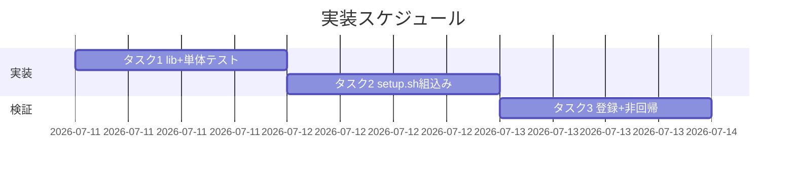

# 実装計画書: `.agent-skill-chain/runtime/workflow.db` 由来検知欠如の是正（setup 沈黙スキップの解消）

**プロジェクト名**: `.agent-skill-chain/runtime/workflow.db` 由来検知欠如の是正
**作成日**: 2026 年 07 月 11 日
**最終更新**: 2026 年 07 月 11 日

> **重要**: **このドキュメントは常に更新**: 実装計画の変更、進捗状況の更新、バグの記録などがあった場合は、即座にこのドキュメントを更新してください。
>
> **用語**: [.agent-skill-chain/source/CONCEPTS.md §用語規約](../../../../../../.agent-skill-chain/source/CONCEPTS.md#用語規約) を参照。

---

## 1. 実装概要

### 1.1 実装方針

02_設計に従い、由来検査＋警告を独立した sourced lib 関数 `warn_if_foreign_workflow_db`（`scripts/lib/workflow-db-guard.sh`・新設）に実装し、`setup.sh` の `init_workflow_db` スキップ直前に 1 行で呼び出す。検査は sqlite3 の 1 クエリ（`pragma_table_info('workflow_log')` の件数）で行い、不一致時のみ 3 要素警告を stderr へ出す。**非中止・非破壊・常に return 0**。TS 側ミラーは行わない（ADR-3）。

### 1.2 実装順序

1. **タスク1**: `scripts/lib/workflow-db-guard.sh` 新設＋単体テスト `test/test-workflow-db-guard.sh` 新設（TDD 相当・隔離）。
2. **タスク2**: `setup.sh` へ組込み（source 1 行＋`init_workflow_db` 1 行）。
3. **タスク3**: `test/run-all.sh` へ新テスト登録＋既存 `e2e-install-uninstall.sh`（R1〜R3）非回帰確認。



---

## 2. タスク分解

**必須**: 各タスクに「テスト観点」（2.x.3）と「単体テスト仕様（BDD）」（2.x.4）を記載する。観点定義は [02\_設計 §6](./02_設計.md) および [RULES のテスト戦略・TEST_BDD_FORMAT](../../../../../../.agent-skill-chain/source/RULES.md#テスト戦略必須要件) を参照。

### 2.1 タスク 1: `workflow-db-guard.sh` 新設＋単体テスト

#### 2.1.1 概要

由来検査＋警告を担う単一責務の sourced lib 関数と、その `mktemp -d` 隔離単体テストを新設する。

#### 2.1.2 実装内容

- `.agent-skill-chain/source/scripts/lib/workflow-db-guard.sh` を新設し、関数 `warn_if_foreign_workflow_db <db_path>` を定義する。
  - トップレベルで副作用を持たない（source 安全・`package-manifest.sh` と同型）。
  - 判定: `command -v sqlite3` が無ければ沈黙 `return 0`。あれば `cnt="$(sqlite3 "$db" "SELECT count(*) FROM pragma_table_info('workflow_log');" 2>/dev/null)"` を実行し、**sqlite3 失敗（`cnt` 空）または `cnt` が空/0 → 3 要素警告を stderr（`>&2`）→ `return 0`**、`cnt≥1` → 沈黙 `return 0`。
  - `set -e` 下でも異常終了しないよう、sqlite3 呼び出しは失敗を握りつぶす（`2>/dev/null` ＋ 代入で非致命化）。stdout へは何も出さない。
- `test/test-workflow-db-guard.sh` を新設し、lib を source して関数を直接呼ぶ単体テストを実装する。フィクスチャは `mktemp -d` 内に生成し、検証後 `rm -rf` する。

#### 2.1.3 テスト観点

**参照**: 観点定義は [02\_設計 §6.1](./02_設計.md) を参照。以下は本タスクの具体ケース。

##### 単体（必須 1 件以上）

- 非 sqlite3 テキストファイル（`printf 'not a database' > db`）を渡すと、警告が stderr に出力され、戻り値 0、ファイル内容が不変であること。
- 有効 sqlite3 だが `workflow_log` テーブル不在（`CREATE TABLE other(x)`）のとき、警告が出力され戻り値 0。
- 正規 DB（`workflow_log` を持つ）のとき、**警告が出力されず**戻り値 0。
- 警告文に 3 要素（**対象パス**・**推定される問題**・**確認手順**）が全て含まれること（`grep` で各要素を確認）。
- sqlite3 を PATH から外した状況（`PATH=` で sqlite3 不在を模擬 or ラップ）で沈黙 `return 0` すること（検査不能時の非致命化）。
- 引数パスが存在しない場合に沈黙 `return 0`（防御的）。

##### 結合/API

- 該当なし（純関数・外部 I/F を持たない）。

##### E2E/受け入れ

- 本タスク単体では該当なし（E2E はタスク3で既存 `e2e-install-uninstall.sh` の非回帰として確認）。

##### バリデーション

- 該当なし（入力は単一パス引数のみ）。

#### 2.1.4 単体テスト仕様（BDD）

**BDD 形式（01 ユースケース 1・2 に対応）**:

```gherkin
Feature: workflow.db 由来検知（軽量警告・warn_if_foreign_workflow_db）
  Scenario: 非 sqlite3 ファイルに対して警告する（01 UC1）
    Given mktemp -d 内に "not a database" を書いた workflow.db を用意する
    When warn_if_foreign_workflow_db を呼ぶ
    Then 3 要素（対象パス・推定問題・確認手順）を含む警告が stderr に出力され、戻り値は 0 で、ファイル内容は不変である

  Scenario: workflow_log を持たない sqlite3 に対して警告する（01 UC1）
    Given mktemp -d 内に workflow_log を持たない有効 sqlite3 DB を用意する
    When warn_if_foreign_workflow_db を呼ぶ
    Then 警告が stderr に出力され、戻り値は 0 である

  Scenario: 正規 DB に対しては警告しない（01 UC2・false positive 回避）
    Given mktemp -d 内に workflow_log テーブルを持つ DB を用意する
    When warn_if_foreign_workflow_db を呼ぶ
    Then 警告は出力されず、戻り値は 0 である
```

**テストコード例（bash・Given/When/Then インラインコメント必須）**

```bash
# Given: 非 sqlite3 のテキストファイルを一時 DB として用意する
tmp="$(mktemp -d)"; db="$tmp/workflow.db"; printf 'not a database' > "$db"
# When: 検査関数を呼び、stderr を捕捉する
err="$(warn_if_foreign_workflow_db "$db" 2>&1 1>/dev/null)"; rc=$?
# Then: 戻り値 0・3 要素警告・ファイル不変を検証する
[[ $rc -eq 0 ]] || fail "rc must be 0"
grep -q "$db" <<<"$err" && grep -q "workflow_log" <<<"$err" && grep -q "確認" <<<"$err" || fail "3 要素欠落"
[[ "$(cat "$db")" == "not a database" ]] || fail "ファイルが変更された"
rm -rf "$tmp"
```

#### 2.1.5 依存関係

- 依存タスクなし（本タスクが起点）。

#### 2.1.6 見積もり

- **工数**: 約 1〜2 時間
- **優先度**: 低（🟢。00 §4.3）

### 2.2 タスク 2: `setup.sh` への組込み

#### 2.2.1 概要

新設 lib を source し、`init_workflow_db` の既存スキップ分岐に検査呼び出しを 1 行追加する。

#### 2.2.2 実装内容

- `setup.sh` 冒頭の lib source 群（`package-manifest.sh`・`deploy-skills.sh` を source している付近）へ `. "$SCRIPT_DIR/lib/workflow-db-guard.sh"` を 1 行追加する。
- `init_workflow_db` のスキップ分岐を次に変更する（1 行追加のみ）:
  ```bash
  if [[ -f "$db" ]]; then
    warn_if_foreign_workflow_db "$db"
    return 0
  fi
  ```
- 既存の DB 新規作成ロジック・他の setup 処理は一切変更しない。

#### 2.2.3 テスト観点

**参照**: [02\_設計 §6.1](./02_設計.md)。

##### 単体（必須 1 件以上）

- 由来不明ファイルを配備先の `.agent-skill-chain/runtime/workflow.db` に事前配置して `setup.sh` を実行すると、警告が stderr に出て**かつ exit 0** で完了する（00 §6・01 UC1）。
- 既存の正規 DB がある状態で `setup.sh` を実行すると、警告が出ず既存 DB が保持される（01 UC2）。
- `workflow.db` 不在での新規作成の正常系が不変（既存挙動）。

##### 結合/API

- 該当なし。

##### E2E/受け入れ

- タスク3の `e2e-install-uninstall.sh` 非回帰で担保。

##### バリデーション

- 該当なし。

#### 2.2.4 単体テスト仕様（BDD）

```gherkin
Feature: setup 時点での由来不明 workflow.db 警告（init_workflow_db 組込み）
  Scenario: 由来不明ファイルが存在する状態で setup を実行する（01 UC1）
    Given クリーン clone を mktemp -d に展開し、.agent-skill-chain/runtime/workflow.db に非 sqlite3 ファイルを置く
    When bash .agent-skill-chain/source/scripts/setup.sh <tmp> を実行する
    Then 警告が stderr に出力され、exit code は 0 で、当該ファイルは変更されない
```

```bash
# Given: クリーン clone を隔離環境に展開し、由来不明 workflow.db を配置する
tmp="$(mktemp -d)"; git archive HEAD | tar -x -C "$tmp"
mkdir -p "$tmp/.agent-skill-chain/runtime"; printf 'not a database' > "$tmp/.agent-skill-chain/runtime/workflow.db"
# When: setup をターゲット指定で実行し、stderr と exit code を捕捉する
err="$(bash "$tmp/.agent-skill-chain/source/scripts/setup.sh" "$tmp" 2>&1 1>/dev/null)"; rc=$?
# Then: exit 0・警告出力・ファイル不変を検証する
[[ $rc -eq 0 ]] && grep -q "workflow_log" <<<"$err" && [[ "$(cat "$tmp/.agent-skill-chain/runtime/workflow.db")" == "not a database" ]]
rm -rf "$tmp"
```

#### 2.2.5 依存関係

- タスク1 完了後（関数が存在すること）。

#### 2.2.6 見積もり

- **工数**: 約 30 分
- **優先度**: 低（🟢）

### 2.3 タスク 3: テスト登録＋非回帰確認

#### 2.3.1 概要

新規単体テストを `run-all.sh` に登録し、既存 E2E（R1〜R3）が回帰しないことを確認する。

#### 2.3.2 実装内容

- `test/run-all.sh` に `test-workflow-db-guard.sh` を追加登録する（既存テスト群の登録様式に合わせる）。
- `test/e2e-install-uninstall.sh` を隔離環境で実行し、R1〜R3 シナリオが従来どおり成功することを確認する（本改修による回帰が無いこと。00 §6・01 §3.3）。

#### 2.3.3 テスト観点

##### 単体

- `run-all.sh` 実行で新テストが起動し PASS すること。

##### 結合/API

- 該当なし。

##### E2E/受け入れ（必須）

- `e2e-install-uninstall.sh` の R1〜R3 が PASS（回帰なし）。
- install 時に正規 `workflow.db` が生成される既存アサーション（e2e:106）が引き続き成立すること。

##### バリデーション

- 該当なし。

#### 2.3.4 単体テスト仕様（BDD）

```gherkin
Feature: 回帰防止
  Scenario: 既存 E2E が本改修後も成功する
    Given 本改修（タスク1・2）適用済みのツリー
    When test/run-all.sh（または e2e-install-uninstall.sh）を隔離環境で実行する
    Then R1〜R3 を含む全既存シナリオが PASS する
```

```bash
# Given: 改修適用済みツリー
# When: 全テストを実行する
bash test/run-all.sh
# Then: 既存シナリオ（R1〜R3）を含め非ゼロ終了しない（回帰なし）
[[ $? -eq 0 ]]
```

#### 2.3.5 依存関係

- タスク1・2 完了後。

#### 2.3.6 見積もり

- **工数**: 約 30 分
- **優先度**: 低（🟢）

---

## テスト観点

本実装のテスト観点の要約: (1) 非 sqlite3／`workflow_log` 不在で警告・正規 DB で沈黙・**常に return 0**・**既存ファイル不変**（タスク1 単体）、(2) setup 実行時に警告かつ exit 0・既存 DB 保持・新規作成正常系不変（タスク2）、(3) 既存 E2E（R1〜R3）非回帰（タスク3）。具体ケースは各 §2.x.3 を参照。

---

## 単体テスト

`test/test-workflow-db-guard.sh` に、`mktemp -d` 隔離下でフィクスチャ DB（非 sqlite3／テーブル不在／正規）を生成し `warn_if_foreign_workflow_db` を直接呼ぶ単体テストを実装する。本番の `.agent-skill-chain/runtime/workflow.db`・`source/`・`.claude/`・`.cursor/` には一切触れない（自己拡張ワークフロー §テストの tmp 隔離）。BDD 仕様は各タスク §2.x.4 に記載。

---

## BDD

BDD シナリオは各タスク §2.x.4 に記載（Given/When/Then・TEST_BDD_FORMAT 準拠）。01_要件定義のユースケース 1（UC1: 由来不明ファイルで警告）・ユースケース 2（UC2: 正規 DB で警告しない）と、タスク1 の 3 シナリオ・タスク2 の 1 シナリオが対応する。

---

## 3. 実装スケジュール

### 3.1 マイルストーン

| マイルストーン | 期日 | 成果物 |
| --- | --- | --- |
| lib＋単体テスト完成 | 着手日 | `workflow-db-guard.sh`・`test-workflow-db-guard.sh` |
| setup 組込み＋非回帰確認 | 着手日+1 | 更新済み `setup.sh`・`run-all.sh`・E2E PASS ログ |

### 3.2 実装フェーズ

#### フェーズ 1: 実装＋検証

- **期間**: 半日程度（低優先度・軽量）
- **タスク**: タスク1 → タスク2 → タスク3

---

## 4. テスト計画

テスト観点・レベル・BDD 形式の定義は 02\_設計 §6 および RULES のテスト戦略・TEST_BDD_FORMAT を参照。各タスクの §2.x.3・§2.x.4 に具体ケースと BDD を記載済み。

### 4.1 テストの優先順位

- クリティカル観点（**常に return 0**・**既存ファイル不変**・**setup exit 0**）を最優先で単体・E2E に含める。
- 既存 E2E（R1〜R3）は回帰テストに必ず含める。

---

## 5. リスク管理

### 5.1 実装リスク

- **リスク**: マイグレーション対象の旧スキーマ DB を「由来不明」と誤警告する（false positive）。
  - **対策**: 判定は `workflow_log` テーブルの**有無のみ**（`pragma_table_info` 件数≥1）とし、カラム構成は見ない（02 ADR-1 帰結）。旧スキーマでもテーブルが在れば沈黙する単体ケースを追加してもよい。
- **リスク**: `set -e` 下で sqlite3 の非ゼロ終了が setup を巻き込み中断する。
  - **対策**: sqlite3 呼び出しを `2>/dev/null` ＋代入で非致命化し、関数は常に `return 0`（02 §3.1.4）。タスク2 の setup 実行 BDD で exit 0 を検証する。
- **リスク**: sqlite3 未導入環境で検査不能。
  - **対策**: `command -v sqlite3` ガードで沈黙スキップ（既存 doctor/`write-workflow-log.sh` と一貫）。

---

## 6. 参考資料

### プロジェクトドキュメント

- [`02_設計.md`](./02_設計.md) - 設計
- [`01_要件定義.md`](./01_要件定義.md) - 要件定義

### その他の参考資料

- 現行実装: `.agent-skill-chain/source/scripts/setup.sh`（`init_workflow_db` 196〜207 行目）・`scripts/lib/package-manifest.sh`（sourced lib の先例）・`test/test-package-manifest-parity.sh`（テスト体裁の先例）

---

## 7. 前のステップ

この実装計画書は、以下のドキュメントを基に作成されています：

- **前**: [`02_設計.md`](./02_設計.md) - 設計フェーズ

---

## 8. 次のステップ

この実装計画書の承認後、実装フェーズ（execution）へ進みます（本 issue は単一 issue のため分割せず、implement-feature を委譲する）。

**用語**: [.agent-skill-chain/source/CONCEPTS.md §用語規約](../../../../../../.agent-skill-chain/source/CONCEPTS.md#用語規約) を参照。
