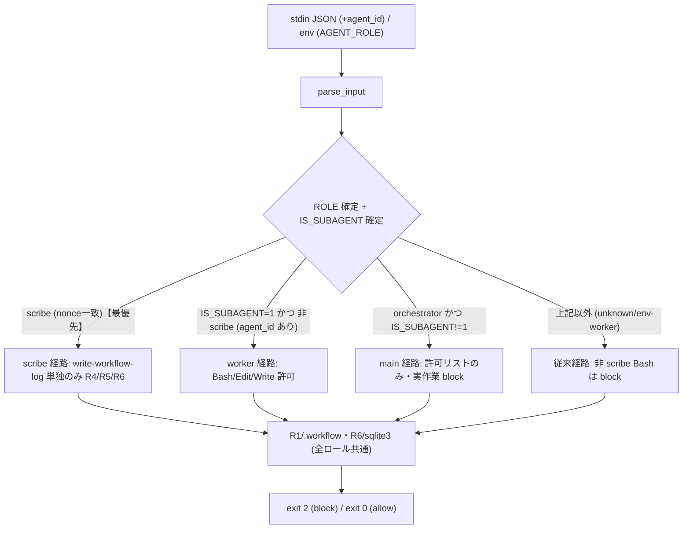
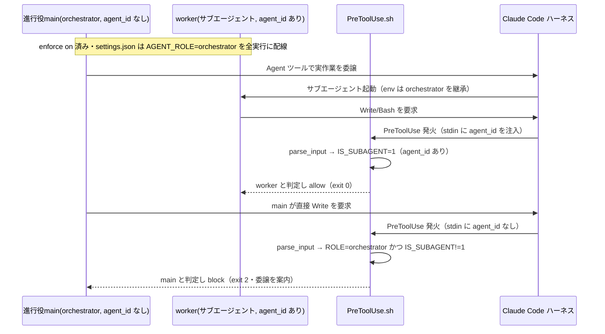
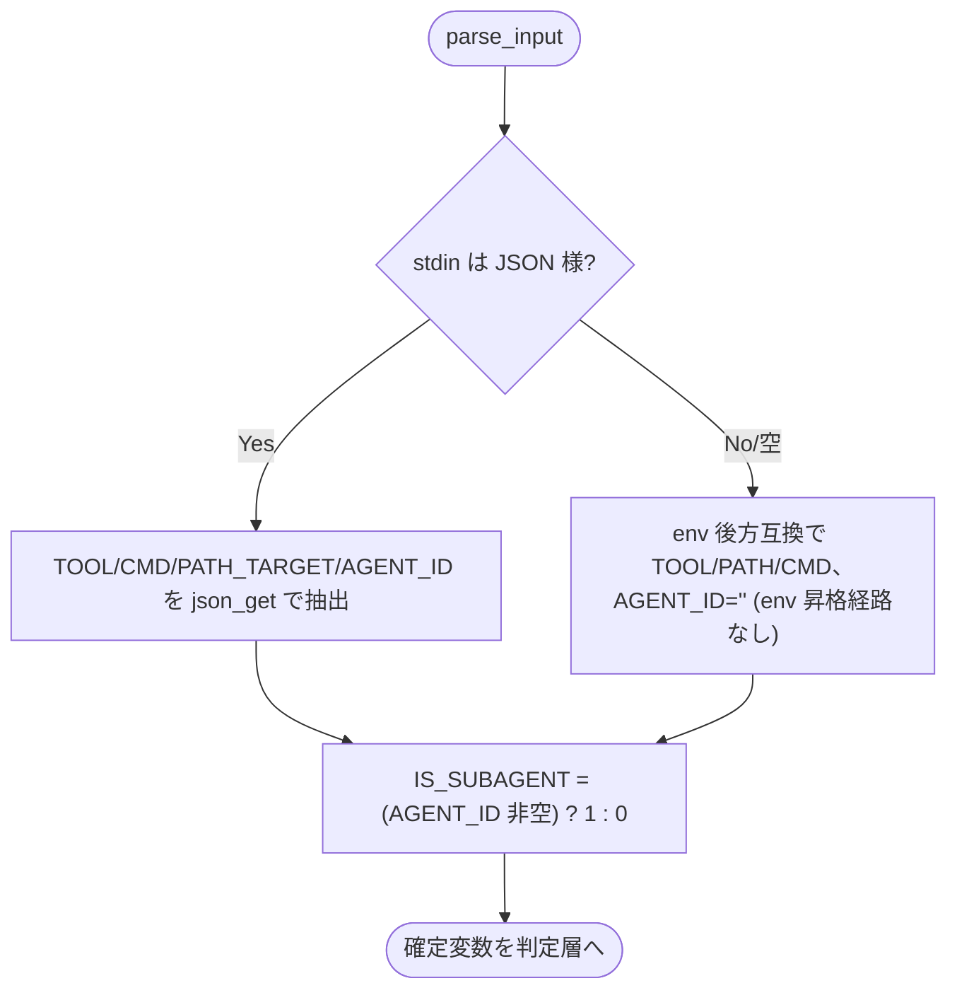
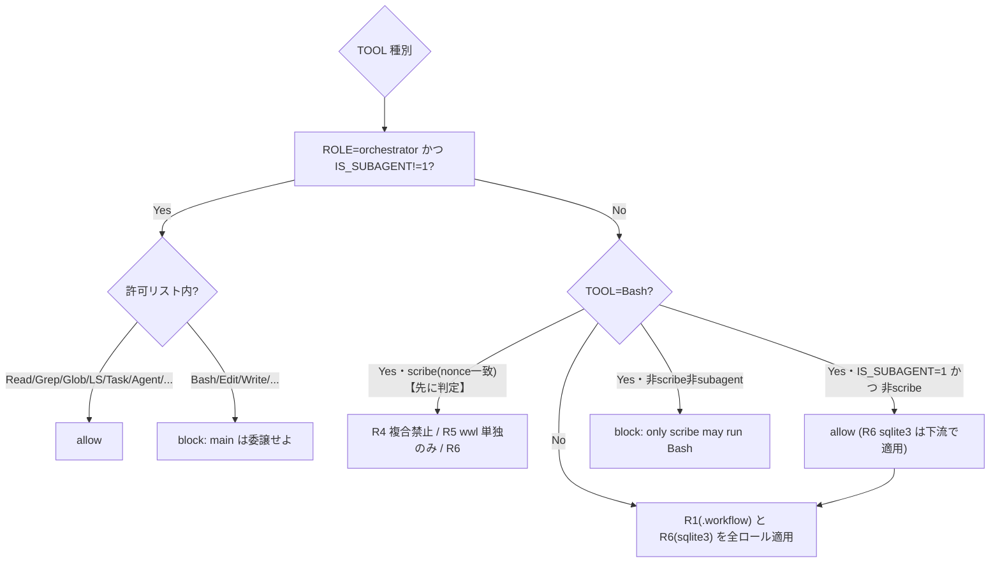

# 設計書: `AGENT_ROLE` スコープ問題の是正（enforce on が委譲を機能不全にする欠陥の解消）

**プロジェクト名**: `AGENT_ROLE` スコープ問題の是正
**作成日**: 2026 年 07 月 11 日
**最終更新**: 2026 年 07 月 11 日

> **重要**: **このドキュメントは常に更新**: 設計の変更や追加があった場合は、即座にこのドキュメントを更新してください。ドキュメントは「生きているドキュメント」として扱い、実装内容と常に同期させます。
>
> **用語**: [.agent-skill-chain/source/CONCEPTS.md §用語規約](../../../../../../.agent-skill-chain/source/CONCEPTS.md#用語規約) を参照。

---

## 1. 設計概要

**必須**: 設計方針・原則は [.agent-skill-chain/source/spec/01_設計原則.md](../../../../../../.agent-skill-chain/source/spec/01_設計原則.md) を**先に参照**した上で、本プロジェクトに**適用するものを選び**記載する。

### 1.1 設計方針

本是正は、**enforce on 時のロール強制ロジックを `PreToolUse.sh` 1 ファイルに集約したまま**、委譲先サブエージェント（worker）を「ハーネスが注入する識別信号」で判定して実作業ツールを許可し、進行役 main（orchestrator）の直接実作業ブロックは非劣化で維持する。settings テンプレート（`settings.enforce.json`）・`src/agents-md.ts`（enforce on のマージ処理）は**一切変更しない**（判定規則を複数箇所に分散させない＝01 §2.3・§3.4 保守性要件）。

### 1.2 設計原則（本プロジェクトで適用するもの）

- **UNIX哲学 / シンプルに保つ**: 既存の入力パース（stdin JSON→env フォールバック）と同型の軽量判定を 1 つ追加するだけに留め、新規スクリプト・新規 env 経路・新規設定ファイルを増やさない。
- **単一責務**: ロール判定・許可判定の正本を `PreToolUse.sh` の 1 か所に集約する。`settings.enforce.json` / `src/agents-md.ts` にロール分岐を持ち込まない。
- **明確な境界**: 「main（orchestrator）判定」「worker（subagent）判定」「scribe 昇格」の 3 経路の境界を、それぞれ別の入力信号（env `AGENT_ROLE` / stdin `agent_id` / nonce）で明示的に切り分ける。
- **AIフレンドリー設計**: 既存 hook の関数分割（`parse_input` / `block` / `allow`）・命名（`ROLE` / `TOOL` / `CMD`）を踏襲し、追加変数 `AGENT_ID` / `IS_SUBAGENT` も意図が読み取れる名前にする。

---

## 2. アーキテクチャ設計

### 2.1 責務・境界・参照関係

#### 2.1.1 責務一覧

| コンポーネント | 責務（1 文） |
| -------------- | ------------ |
| `PreToolUse.sh`（`parse_input`） | stdin JSON / env から `TOOL` / `PATH_TARGET` / `CMD` / `ROLE` に加え、**新たに `AGENT_ID`（サブエージェント識別）を抽出**し `IS_SUBAGENT` を確定する。 |
| `PreToolUse.sh`（`json_get`） | RAW から限定キー（既存 `tool_name` / `command` / `file_path` に **`agent_id` を追加**）を jq／非 jq の両系統で抽出する。 |
| `PreToolUse.sh`（R2 orchestrator 許可リスト判定） | **main（`ROLE=orchestrator` かつ `IS_SUBAGENT!=1`）のみ**に許可リスト方式を適用し、Bash/Edit/Write 等を block する。 |
| `PreToolUse.sh`（R3 Bash 判定） | **scribe（nonce 検証済み）を最優先で write-workflow-log 単独のみ許可**、次に **subagent worker（`IS_SUBAGENT=1` かつ 非scribe）は Bash allow**、main（orchestrator かつ `IS_SUBAGENT!=1`）は block、それ以外の非 scribe・非 subagent は従来どおり block。 |
| `PreToolUse.sh`（R1 / R6） | ロール非依存の保護（`.agent-skill-chain/runtime/` 直接編集禁止・sqlite3 直接実行禁止）を全ロール・全経路で維持する。 |
| `settings.enforce.json` / `src/agents-md.ts` | **本是正では不変**。`env.AGENT_ROLE=orchestrator` の静的配線・nonce 出所分離・`__agentsMdEnforce` マーカー運用を変更しない。 |
| `test/test-pretooluse-hook.sh` | subagent worker 昇格の新規シナリオ（agent_id 有/無 × jq 有/無）を追加し、既存シナリオの非回帰を検証する。 |

#### 2.1.2 境界

- **入力**: Claude Code が PreToolUse hook へ渡す **stdin JSON**（`tool_name` / `tool_input.{command,file_path}` に加え、サブエージェント実行時のみ付与される **`agent_id` / `agent_type`**）と、hook 起動コマンドが継承する **env**（`AGENT_ROLE` / `AGENTS_SCRIBE_NONCE` 等）。
- **出力**: 終了コード（違反 = `exit 2` block／許可・案内 = `exit 0` allow）と stderr の理由・案内メッセージ。
- **他責務との境界**: 本 issue は **Claude Code 系の runtime enforcement（`PreToolUse.sh`）のロールスコープ判定のみ**を対象とする。範囲外（00 §5 / 01 §5）: Cursor 等の他プラットフォーム、CI 側（`audit.sh` / subagent-guard）の失敗条件、enforce on/off の opt-in 既定方針、`Agent`/`Task` 許可（`4358a0f`）の再設計、`settings.enforce.json` テンプレートおよび `src/agents-md.ts` のマージ処理。

#### 2.1.3 参照関係

- `settings.enforce.json`（hook 結線）→ `.claude/hooks/PreToolUse.sh` を起動（`AGENT_ROLE` を env で渡す・**不変**）。
- Claude Code ハーネス → `PreToolUse.sh` の **stdin へ `agent_id` を注入**（サブエージェント実行時のみ・新たに参照する信号）。
- `PreToolUse.sh` `parse_input` → `json_get`（`agent_id` 抽出）。
- `test/test-pretooluse-hook.sh` → `PreToolUse.sh`（隔離環境で直接起動・合成 stdin を渡す）。
- 循環参照なし。ロール判定の一方向依存（stdin/env → 判定 → exit code）を保つ。

### 2.2 システムアーキテクチャ

**採用パターン**: パイプ&フィルタ（入力層 `parse_input` → 判定層 R1〜R6 → 出力層 `block`/`allow`）に**信号駆動のロール分岐**を追加する。

**根拠**: 既存 `PreToolUse.sh` が既にこの構造（唯一の入力層 `parse_input` が確定変数を作り、判定群が確定変数のみ参照）を採る。spec/01 §単一責務・§明確な境界、spec/06 §可読性 > 単一責務 > 仕様整合 の優先順位に従い、**新経路を足さず既存の入力層に信号を 1 つ足す**のが最小侵襲かつ可読性最良である（evidence_source: existing_code＝`PreToolUse.sh` L76-130 の `parse_input` 構造）。

#### 2.2.1 CQRS（Command/Query 分離）

- **Query（状態取得）**: `parse_input`・`json_get`（副作用なし。stdin/env を読んで確定変数を作るのみ）。
- **Command（状態変更）**: 本 hook はファイルシステムを変更しない（`exit 2`/`exit 0` のみが「出力」）。scribe nonce ファイルの生成は `src/agents-md.ts`（enforce on）側の責務で本 issue 範囲外。

#### 2.2.2 アーキテクチャ図（本プロジェクトの構成で記載）

### 2.3 コンポーネント構成

境界（`parse_input`＝入力層／R1〜R6＝判定層／`block`・`allow`＝出力層）を維持し、各判定は単一責務を保つ。本是正で追加・変更するのは以下のみ。

- **追加（入力層）**: `json_get agent_id`（新キー）と `parse_input` 内の `AGENT_ID` / `IS_SUBAGENT` 確定（1 箇所）。
- **変更（判定層）**: R2 orchestrator 許可リスト判定のガードに `&& IS_SUBAGENT != 1` を追加（main 限定化）。R3 Bash 判定は **scribe（nonce 検証済み）を先に判定**し、その後に「`IS_SUBAGENT=1 かつ 非scribe` の subagent worker は allow」分岐を置く。これにより scribe が委譲サブエージェント（`agent_id` あり）であっても worker allow へ落ちず、scribe 専用の R4/R5 制約を確実に受ける。
- **不変**: R1（`.agent-skill-chain/runtime/` 直接編集禁止・全ロール）、R6（sqlite3 直接実行禁止・全ロール）、scribe nonce 出所制御（C-4b）、`block`/`allow`/fail-safe（`set +e`・入力なし時 allow）。

### 2.4 データフロー

**発行イベント（「起きた事実」）の対応**: 本 hook はイベントを永続化しないが、判定の「起きた事実」を stderr メッセージで表現する。追加する事実は `WorkerSubagentAllowed`（subagent worker の実作業許可）相当の分岐であり、既存 `OrchestratorBlocked` / `ScribeBashAllowed` と同列に扱う。

### 2.5 横断設計判断（ADR）

#### ADR-1: 委譲先 worker と進行役 main を区別する信号として、PreToolUse stdin の `agent_id` を採用する

- **コンテキスト**: enforce on の `settings.json` は `env.AGENT_ROLE=orchestrator` を**全実行に静的固定**する。ドッグフーディングで委譲先 worker がこの orchestrator 制限で block された観測（observed_runtime）から、サブエージェント実行時にも settings.json の env・hook が効いている（＝env が継承されている）ことが**経験的に確認**できる（公式ドキュメントには env のサブエージェント継承を明示する記述は見当たらず、この点は要人間確認＝ADR-3・下記根拠を参照）。従って env `AGENT_ROLE` だけでは main と委譲先 worker を区別できない。hook 側が「この実行はサブエージェントか」を判定できる別信号が必要。
- **検討した選択肢**:
  1. **stdin JSON の `agent_id`（ハーネス注入信号）で判定**（採用）。`agent_id` はサブエージェント実行時のみ付与される。
  2. **サブエージェント定義（`.claude/agents/*.md` frontmatter）に `env` で `AGENT_ROLE=worker` を注入**。→ frontmatter に **`env` フィールドは存在しない**（未サポート）ため不可。
  3. **サブエージェント frontmatter の `tools:`/`disallowedTools:` 許可リスト、または per-subagent `hooks:`** でツール制御。→ 実現可能だが、判定が `.claude/agents/*.md`（本リポでは gitignore 対象の生成物）へ分散し、汎用 `Agent`/`Task` 委譲（無名サブ起動）を覆えない。保守性要件（判定を `PreToolUse.sh` に集約）に反する。
  4. **scribe と同型の nonce 昇格を worker に適用**。→ nonce は `settings.json` env で全実行に等しく継承されるため、main と worker が同じ nonce を持ち区別できない。原理的に不可。
- **決定**: 選択肢 1。`PreToolUse.sh` の入力層で `agent_id` を抽出し、`IS_SUBAGENT=1` のとき worker 実作業を許可する。`env.AGENT_ROLE` の静的配線・settings テンプレート・`src/agents-md.ts` は一切変更しない。
- **根拠**:
  - **evidence_source: external_doc** — Claude Code 公式ドキュメント `docs.claude.com/en/hooks.md` の **`In Subagents` 節**は、サブエージェント内で発火する PreToolUse の入力が `agent_id`（表の説明: "Unique identifier for the subagent"）と `agent_type`（"Name of the subagent"、例 `"Explore"`／`"security-reviewer"`＝frontmatter `name`。**ロール名ではなく subagent 名**）を含むと**明記**する。当該節が「サブエージェント実行時に」これらが付く旨を条件付きで記述しており、main スレッドでの付与は記述されていない（＝subagent 実行時のみ付与、を示す）。同 `sub-agents.md` の frontmatter サポート表に `env` は無く（選択肢 2 の否定）、`tools`/`disallowedTools`/`hooks` は有る（選択肢 3 の裏付け）。**（注: 一次調査で本節の存在・上記フィールド表を確認済み。ただし「settings.json 側の PreToolUse がサブエージェントのツール実行中に発火するか」「env がサブエージェントへ継承されるか」は公式ドキュメント上で明示されておらず曖昧＝ADR-3 の要人間確認事項。）**
  - **evidence_source: observed_runtime** — 親 issue ストーリー8 のドッグフーディングで「委譲先が orchestrator を継承して block される」逆機能が観測された事実は、**settings.json の PreToolUse hook がサブエージェントのツール実行に対しても発火し、かつ env `AGENT_ROLE=orchestrator` を継承する**ことを経験的に裏付ける（この観測がなければ問題自体が発生しない）。この observed_runtime が、ドキュメント未明記の env 継承・subagent 発火を補完する主根拠である。
  - **evidence_source: existing_code** — `PreToolUse.sh` L98 の `ROLE="${AGENT_ROLE:-${CLAUDE_AGENT_ROLE:-unknown}}"`、`settings.enforce.json` L4/L15 の `AGENT_ROLE` 静的固定が現状の単一ロール継承を示す。
- **帰結**: 是正は `PreToolUse.sh` のみに閉じる（テンプレート・TS のドリフトなし）。main（agent_id なし）の直接実作業ブロックは自然に維持される。**要人間確認（下記 ADR-3 参照）**: 「settings.json 側の PreToolUse hook が subagent 実行時に発火し、かつ `agent_id` が実際に populate される」ことは external_doc に基づくが、本設計フェーズでは enforce on 実機テストを禁止しているため**未実測**であり、実装フェーズで合成 stdin 単体テスト＋隔離クリーンクローンでの実機確認を経て確定する。

#### ADR-2: worker 昇格の偽装耐性 — `agent_id` はハーネス注入であり自己申告できない

- **コンテキスト**: 01 ストーリー3。worker 許可が「main が worker を騙って直接実作業する抜け穴（fail-open 化）」にならないこと。
- **検討した選択肢**:
  1. **`agent_id`（stdin・ハーネス注入）で昇格**（採用）。エージェントは hook の stdin を構築できず（`tool_input` の中身しか制御しない）、top-level `agent_id` を注入できない。
  2. **env `AGENT_ROLE=worker` の自己申告で昇格**。→ 手動 `export` で偽装可能。かつ enforce on 時は settings.json が `AGENT_ROLE=orchestrator` を全実行に上書き配線するため worker を名乗れない。採用しない。
- **決定**: 選択肢 1。worker 実作業許可は **`IS_SUBAGENT=1`（＝`agent_id` 非空）を必要条件**とし、env `AGENT_ROLE=worker` の自己申告だけでは Bash 実作業を許可しない（既存の `only scribe may run Bash` block を非 subagent 経路で維持）。**`agent_id` は stdin JSON のトップレベルからのみ読み、env 経路（`CLAUDE_AGENT_ID` 等の後方互換 twin）は意図的に設けない**。env は手動 `export` で自己申告できてしまうため（scribe が env `AGENT_ROLE=scribe` を nonce で裏取りするのと同じ理由）、`IS_SUBAGENT` に env 昇格経路を作らないことで非自己申告性を保つ。stdin 空/非 JSON の env フォールバック経路では `IS_SUBAGENT=0`（main 相当の保守側）に倒す。
- **根拠**: **evidence_source: external_doc**（hooks.md: `agent_id` はハーネスが hook 入力へ注入する。エージェントのツール入力＝`tool_input` とは別階層）。**evidence_source: existing_code**（`PreToolUse.sh` `json_get` は `tool_input.command`/`tool_input.file_path` のみをエージェント制御領域として扱う。`agent_id` は top-level で別階層）。
- **帰結**: 素朴な手動 `export AGENT_ROLE=worker` では orchestrator 制限を外せない（story3 の設計目標を満たす）。**限界（正直化）**: Claude Code の hook 入力構築を完全に掌握できる相手（env 空間・stdin 構築の乗っ取り）への完全防御ではない。これは scribe nonce の C-4b と同種の限界であり、最終保証は CI `audit.sh` #25（メイン直接作業の間接検出）＋外部証跡が担う（既存の enforcement/README §C-4b と同型）。

#### ADR-3: フィジビリティの残存不確実性と実装前検証ゲート（要人間確認）

- **コンテキスト**: 本設計の核心 ADR-1 は external_doc に依拠するが、①claude-code-guide の一次調査で「settings.json 側 PreToolUse は subagent 実行中に発火しない可能性」という**scoping からの推論**と、「PreToolUse 入力に subagent 実行時 `agent_id` が付く」という**明記事実**が併存し内部に緊張がある、②本設計フェーズは進行役ロックアウト回避のため enforce on 実機テストを禁止しており**ローカル実測が無い**。
- **検討した選択肢**:
  1. **external_doc を根拠に採用しつつ、実装フェーズで合成 stdin 単体テスト＋隔離実機確認を必須ゲートにする**（採用）。
  2. inference のみで「実現可能」と断定する。→ EVIDENCE_POLICY §節4 に反する（不採用）。
- **決定**: 選択肢 1。ADR-1/2 を採用方針として確定するが、**「settings.json PreToolUse が subagent 実行時に発火し `agent_id` が populate される」を load-bearing 前提として明示し、実装フェーズの検証ゲートで確定する**（03 タスク参照）。
- **根拠**: **evidence_source: external_doc**（hooks.md の明記）＋**evidence_source: observed_runtime**（ドッグフーディングの block 観測は「hook が subagent 実行に発火する」ことを示す）。ただし `agent_id` の実 populate 有無は**未実測**のため **inference が混在する重要判断＝要人間確認**として顕在化する（EVIDENCE_POLICY §節4）。
- **帰結**: 本設計は「安全側（main block の非劣化）」を保つ限りで fail-safe である。想定される 4 挙動:
  - (a) hook が subagent で発火し `agent_id` が付く（＝公式ドキュメント `In Subagents` 節どおり） → 設計どおり worker allow・main block（目標達成）。
  - (b) hook が subagent で発火しない → worker は元々 hook を通らず allow（story1 は別経路で達成。main block は不変）。
  - (c) hook が subagent で発火するが `agent_id` が空 → **可用性の失敗系（worker が block され続ける）**。実装フェーズの実機確認でこれを検出したら、フォールバック（`agent_type`＝subagent 名の presence を併用、または ADR-1 選択肢 3＝subagent frontmatter `tools:` 許可リスト）へ切替える。安全性（main block）は劣化しない。
  - (d) hook が **main スレッドでも `agent_id` を付与**する（ドキュメントの `In Subagents` 節の含意に反する挙動）→ main が `IS_SUBAGENT=1` と誤判定され worker allow に落ち、**orchestrator の直接実作業 block が fail-open で骨抜き**（story2・失敗条件 #25 の破れ。(c) より危険な**安全性の失敗系**）。**この (d) を検出するガードが T3 ゲートの「同一環境で orchestrator（main）の直接 Write が block される○/×」検査**であり、×（block されない）なら本方式を採らず ADR-1 選択肢 3（frontmatter `tools:` 許可リスト）等へ切替える。(c)(d) の分岐点を 03 T3 に検証タスクとして明記する。

---

## 3. 機能設計

### 3.1 機能 1: `agent_id` 抽出とサブエージェント判定（入力層）

#### 3.1.1 概要

`json_get` に `agent_id` キーを追加し、`parse_input` で `AGENT_ID` を抽出、`IS_SUBAGENT`（`agent_id` 非空なら `1`）を確定する。jq 経路（`.agent_id // empty`）と非 jq フォールバック（`"agent_id"` パターン）の両系統で同一に動く。**`agent_id` は stdin JSON（ハーネス注入・トップレベル）からのみ取得する。env フォールバック経路（stdin 空/非 JSON）では `AGENT_ID` を空にし `IS_SUBAGENT=0`（＝非 subagent・main 相当の保守側）に倒す。** env に自己申告可能なロール昇格経路（例: `CLAUDE_AGENT_ID` の後方互換参照）は**意図的に設けない**（ADR-2 の非自己申告性を担保するため。手動 `export` で `IS_SUBAGENT=1` を主張できる env twin を作らない）。

#### 3.1.2 処理フロー

#### 3.1.3 入力・出力

- **入力**: `RAW`（stdin 全量）。`agent_id` は stdin トップレベルのみを参照する（env からは取得しない）。
- **出力**: 確定変数 `AGENT_ID`（文字列）、`IS_SUBAGENT`（`0`/`1`）。

#### 3.1.4 エラーハンドリング

- 抽出失敗（および env フォールバック経路）は空文字（既存 `json_get` の誤検知抑制方針を踏襲）。`agent_id` が取れないときは `IS_SUBAGENT=0`（非 subagent 扱い）で保守的に倒す（＝main と同等の厳格判定側。ただし worker 実作業が塞がれる系のため、ADR-3(c) の検証ゲートで実 populate を確認する）。**env に自己申告可能な昇格経路を持たないため、この保守側の倒し込みが偽装耐性（ADR-2）と両立する。**

### 3.2 機能 2: main 限定化（R2 許可リスト）と subagent worker 許可（R3 Bash）

#### 3.2.1 概要

R2（orchestrator 許可リスト）のガードを `ROLE=orchestrator` **かつ** `IS_SUBAGENT!=1` に限定し、main のみに適用する。R3（Bash）は **scribe（nonce 検証済み）判定を最優先**に置き、その後に `IS_SUBAGENT=1 かつ 非scribe` を worker allow 分岐にする（scribe が委譲サブエージェントで `agent_id` を伴っても、worker allow に落ちず scribe 経路の R4/R5 制約を必ず受ける＝§8.1 の保証を無条件化）。R1/R6 は全ロール・全経路で不変。

#### 3.2.2 処理フロー

#### 3.2.3 入力・出力

- **入力**: 確定変数 `TOOL` / `ROLE` / `IS_SUBAGENT` / `CMD` / `PATH_TARGET`。
- **出力**: `exit 2`（block・理由 stderr）／`exit 0`（allow）。

#### 3.2.4 エラーハンドリング

- fail-safe を維持（`set +e`・入力なし＝`TOOL` 空時は allow）。判定不能時は既存方針どおり案内のみ `exit 0`（fail-open）。ただし main（orchestrator・agent_id なし）の直接実作業は従来どおり fail-closed で block（01 §2.3 ビジネスルール）。

---

## 4. データ設計

本 issue はデータモデル（DB テーブル・永続データ）を新設・変更しない。判定に用いる「確定変数」（プロセスローカルなシェル変数）のみを定義する。

| 変数 | 由来 | 型 | 説明 |
| ---- | ---- | -- | ---- |
| `TOOL` | stdin `.tool_name` / env | string | 実行ツール名（既存） |
| `PATH_TARGET` | stdin `.tool_input.file_path` / env | string | 対象ファイルパス（既存） |
| `CMD` | stdin `.tool_input.command` / env | string | Bash コマンド文字列（既存） |
| `ROLE` | env `AGENT_ROLE`（nonce 検証込み） | string | orchestrator/worker/scribe/unknown（既存） |
| `AGENT_ID` | stdin `.agent_id`（**トップレベルのみ・env 経路なし**） | string | **新規**。サブエージェント実行時のみ非空 |
| `IS_SUBAGENT` | `AGENT_ID` 非空判定 | 0/1 | **新規**。worker 経路の必要条件 |

---

## 5. API 設計

「API」＝`PreToolUse.sh` の外部インターフェース契約。**本 issue で変更しない**（01 §4.1）。判定分岐の追加のみ。

### 5.1 API 一覧

| インターフェース | 種別 | 説明 | 本 issue での変更 |
| ---------------- | ---- | ---- | ----------------- |
| PreToolUse hook 契約 | stdin JSON 入力 / exit code 出力 | `tool_name`・`tool_input.*`（＋新たに `agent_id` を**読むだけ**）／`exit 2`=block・`exit 0`=allow | 契約不変・入力の読取キー追加のみ |
| env 後方互換 | env 入力 | `AGENT_ROLE`・`CLAUDE_TOOL_NAME` 等（**`agent_id` の env 経路は追加しない**） | 変更なし（agent_id は stdin 専用） |
| enforce on/off/status | CLI（`src/agents-md.ts`） | enforcement 配線着脱 | **不変** |

### 5.2 API 詳細

#### API1: PreToolUse hook（stdin JSON 契約）

- **入力**: `{"tool_name": "...", "tool_input": {"command"/"file_path": "..."}, "agent_id"?: "...", "agent_type"?: "..."}`。`agent_id`/`agent_type` はサブエージェント実行時のみハーネスが付与。
- **出力**: `exit 2`（違反・stderr に理由）／`exit 0`（許可・案内）。
- **契約違反時の扱い**: 入力が取れない（`TOOL` 空）ときは保守的に allow（既存 BR-4）。`agent_id` が取れないときは非 subagent 扱い（main 相当の厳格側）。

---

## 6. テスト戦略

テスト観点の定義は [RULES.md のテスト戦略必須要件](../../../../../../.agent-skill-chain/source/RULES.md#テスト戦略必須要件) を、BDD 形式は [TEST_BDD_FORMAT.md](../../../../../../.agent-skill-chain/source/TEST_BDD_FORMAT.md) を参照。**検証は既存 `test/test-pretooluse-hook.sh` と同じく `mktemp -d`＋`git archive HEAD` のクリーンクローン隔離環境で `PreToolUse.sh` を直接起動し、合成 stdin JSON（`agent_id` 有/無）を渡して exit code を検査する。enforce on 実機フリップは行わない**（進行役ロックアウト回避・§9.2 参照）。

### 6.1 対象ごとのテスト割り当て

| 対象 | 単体 | 結合/API | E2E | クリティカル観点 | バリデーション観点 | 未達理由/補足 |
| ---- | ---- | -------- | --- | ---------------- | ------------------ | ------------- |
| `json_get agent_id` / `IS_SUBAGENT` 確定 | ○ | × | × | jq/非 jq で同一に `agent_id` 抽出 | agent_id 空/非空/欠如 | E2E 不要（純関数的抽出） |
| R2 main 限定化（allowlist） | ○ | × | △ | main(agent_id なし)は block 維持 | orchestrator×agent_id有/無 | E2E は enforce on 実機禁止のため隔離クリーンクローンに限定（§9.2） |
| R3 subagent worker 許可（Bash/Edit/Write） | ○ | × | △ | subagent は Bash/Edit/Write allow | agent_id有×各ツール | 同上 |
| R1/R6 不変（.workflow/sqlite3） | ○ | × | × | subagent でも R1/R6 は block 維持 | agent_id有×違反パス/コマンド | 回帰防止 |
| 既存 UC1〜UC7 非回帰 | ○ | × | × | agent_id 無しの全既存ケース不変 | jq/非 jq 両系統 | 成功基準の必須項目 |

### 6.2 監査・レビューでの確認（証跡）

§6.1 の割当表と 03 §2 のタスク別テスト観点・BDD が対応していることを確認する。01 の受け入れ基準（ストーリー1〜4）と 03 のテストケースが 1:1 で対応することを review-docs で検証する。

---

## 7. UI 設計

該当なし（CLI/hook のみ。画面 UI を持たない）。

---

## 8. セキュリティ設計

### 8.1 認証・認可（ロール昇格）

- **worker 昇格の出所制御**: worker 実作業許可は `agent_id`（ハーネス注入・エージェント非制御領域）を必要条件とする（ADR-2）。env `AGENT_ROLE=worker` の自己申告だけでは Bash 実作業を許可しない。
- **main（orchestrator）の fail-closed 維持**: agent_id が無い実行（main／識別不能）では、orchestrator の直接 Bash/Edit/Write を従来どおり `exit 2` で block する（失敗条件 #25 の非劣化）。
- **scribe 昇格との非干渉**: scribe（nonce 一致）判定は最優先で維持し、worker 判定がこれを破壊しない（scribe 経路の R4/R5/R6 制約は不変）。

### 8.2 データ保護

- R1（`.agent-skill-chain/runtime/` 直接編集禁止）・R6（sqlite3 直接実行禁止）は全ロール・subagent 含め不変。worker 昇格が証跡 DB・runtime 生成物への直接改変経路を開かない。

---

## 9. 非機能要件への対応

### 9.1 パフォーマンス

- 追加処理は `json_get agent_id` 1 回と非空判定のみ。既存の `tool_name`/`command`/`file_path` 抽出と同水準の軽量判定で、ツール実行前の待ち時間に有意な影響を与えない（01 §3.1）。

### 9.2 可用性・再テストの安全性（進行役ロックアウト回避）

- hook 自体の失敗が全ツール停止にならない fail-safe（`set +e`・内部エラーは `exit 0`）を維持（01 §3.4）。
- **enforce on 実機テストは実装フェーズでも本セッションの live `enforce on` フリップを行わない**。検証は (i) 隔離クリーンクローンでの hook 直接起動＋合成 stdin による単体テスト（`test/test-pretooluse-hook.sh` 拡張）を正とする。(ii) どうしても実機 e2e が必要な場合のみ、`mktemp -d` に `git archive HEAD` で展開した**別ディレクトリ・別 Claude Code インスタンス**で `enforce on` し、`enforce off` によるロールバック手段を確保してから行う。本リポの `.claude/`・`.agent-skill-chain/source/`・`workflow.db` を破壊しない（`.agent-skill-chain/project/自己拡張ワークフロー.md §テストの tmp 隔離`）。**進行役 main（本セッション）自身のロックアウトを招く live フリップは禁止**。

---

## 10. 参考資料

### プロジェクトドキュメント

- [`00_要求定義.md`](./00_要求定義.md) / [`01_要件定義.md`](./01_要件定義.md) - 本 issue の要求・要件
- 親 issue: [`../../00_要求定義.md`](../../00_要求定義.md)（ストーリー8 のドッグフーディングが発見源）
- 関連: [`../20260711_055538_フィジビリティADR必須化/00_要求定義.md`](../20260711_055538_フィジビリティADR必須化/00_要求定義.md)（ADR 必須化方針の準拠元）

### その他の参考資料

- [`../../../../../../.agent-skill-chain/source/enforcement/claude/PreToolUse.sh`](../../../../../../.agent-skill-chain/source/enforcement/claude/PreToolUse.sh)（R1〜R6・ロール判定の実装正本）
- [`../../../../../../.agent-skill-chain/source/platforms/claude/settings.enforce.json`](../../../../../../.agent-skill-chain/source/platforms/claude/settings.enforce.json)（`AGENT_ROLE` 静的配線・**不変**）
- [`../../../../../../.agent-skill-chain/source/enforcement/README.md`](../../../../../../.agent-skill-chain/source/enforcement/README.md)（§C-4b 出所制御・失敗条件 #25・物理強制の限界）
- [`../../../../../../.agent-skill-chain/source/EVIDENCE_POLICY.md`](../../../../../../.agent-skill-chain/source/EVIDENCE_POLICY.md)（ADR 形式・evidence_source・inference_only 顕在化）
- Claude Code 公式ドキュメント: `docs.claude.com/en/hooks.md` の `In Subagents` 節（サブエージェント実行時の PreToolUse 入力に `agent_id`／`agent_type` が付く旨を明記）、`docs.claude.com/en/sub-agents.md`（frontmatter サポート表＝`env` 非対応／`tools`・`disallowedTools`・`hooks` 対応）— evidence_source: external_doc。**settings.json PreToolUse の subagent 発火・env のサブエージェント継承はドキュメント未明記（曖昧）であり observed_runtime＋要人間確認で補完（ADR-3）。**

---

## 11. 前のステップ

この設計書は、以下のドキュメントを基に作成されています：

- **前**: [`01_要件定義.md`](./01_要件定義.md) - 要件定義フェーズ

---

## 12. 次のステップ

この設計書の承認後、以下のドキュメントを作成します：

- **次**: [`03_実装計画.md`](./03_実装計画.md) - 実装計画フェーズ
