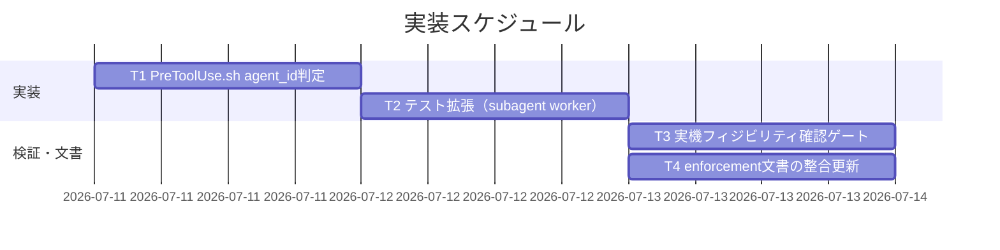
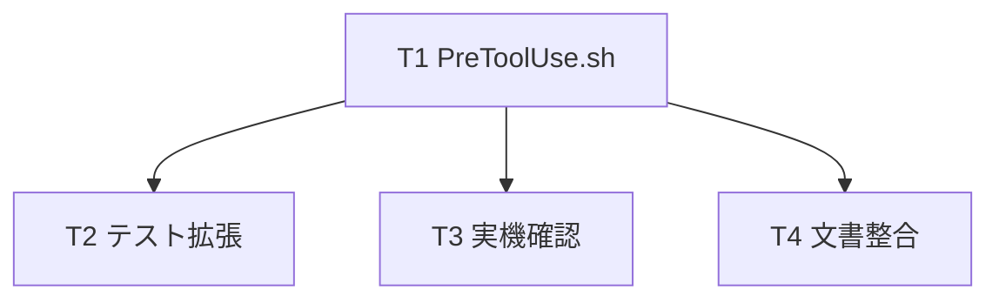

# 実装計画書: `AGENT_ROLE` スコープ問題の是正（enforce on が委譲を機能不全にする欠陥の解消）

**プロジェクト名**: `AGENT_ROLE` スコープ問題の是正
**作成日**: 2026 年 07 月 11 日
**最終更新**: 2026 年 07 月 11 日

> **重要**: **このドキュメントは常に更新**: 実装計画の変更、進捗状況の更新、バグの記録などがあった場合は、即座にこのドキュメントを更新してください。
> **必須項目**: 「必須」と明記した欄は空欄・抽象語のみで提出しないこと。テスト観点・BDD 仕様は具体ケースを 1 件以上記載すること。
>
> **用語**: [.agent-skill-chain/source/CONCEPTS.md §用語規約](../../../../../../.agent-skill-chain/source/CONCEPTS.md#用語規約) を参照。

---

## 1. 実装概要

### 1.1 実装方針（必須）

02 設計に従い、**ロール判定・許可判定を `PreToolUse.sh` の 1 ファイルに集約したまま**、`agent_id`（ハーネス注入）で委譲先 worker を判定して実作業ツールを許可し、main（orchestrator・agent_id なし）の直接実作業ブロックは非劣化で維持する。`settings.enforce.json` テンプレートと `src/agents-md.ts` は**変更しない**。検証は隔離クリーンクローンでの hook 直接起動（合成 stdin）に限定し、**live `enforce on` フリップは行わない**。

### 1.2 実装順序（必須: 1 件以上）



- **T1**（優先度 高）: `PreToolUse.sh` に `agent_id` 抽出・`IS_SUBAGENT` 確定・R2/R3 ガードを実装。
- **T2**（優先度 高）: `test/test-pretooluse-hook.sh` に subagent worker 昇格の新規シナリオを追加し、既存 UC1〜7 の非回帰を確認。
- **T3**（優先度 高・実装フェーズのゲート）: ADR-3 の load-bearing 前提（settings.json PreToolUse が subagent で発火し `agent_id` が populate されること）を隔離環境で実機確認する。
- **T4**（優先度 中）: `enforcement/README.md`・`DESIGN.md` に subagent worker 判定の記述を整合させる（ドリフト防止）。

---

## 2. タスク分解

**必須**: 各タスクには **「テスト観点」（2.x.3）** と **「単体テスト仕様（BDD）」（2.x.4）** を記載する。

### 2.1 タスク 1: `PreToolUse.sh` に `agent_id` 判定と R2/R3 ガードを実装

#### 2.1.1 概要（必須）

委譲先サブエージェント（`agent_id` 非空）を worker と判定し、実作業ツール（Bash/Edit/Write）を許可する分岐を追加する。main（agent_id なし）の orchestrator ブロックは維持する。

#### 2.1.2 実装内容（必須: 1 件以上）

- **`json_get` に `agent_id` キーを追加**: jq 経路 `jq -r '.agent_id // empty'`、非 jq フォールバックは `pat='"agent_id"'` を `case` に追加（既存 `tool_name`/`command`/`file_path` と同型）。
- **`parse_input` に `AGENT_ID`/`IS_SUBAGENT` 確定を追加**: JSON 様経路では `AGENT_ID="$(json_get agent_id)"`。**env フォールバック経路（stdin 空/非 JSON）では `AGENT_ID=""`（env 昇格 twin を設けない＝ADR-2 の非自己申告性担保。`CLAUDE_AGENT_ID` 等の env 参照は追加しない）**。両経路の後で `IS_SUBAGENT=0; [[ -n "$AGENT_ID" ]] && IS_SUBAGENT=1`。
- **R2（orchestrator 許可リスト）を main 限定化**: `if [[ "$ROLE" == "orchestrator" ]]` を `if [[ "$ROLE" == "orchestrator" && "$IS_SUBAGENT" != "1" ]]` に変更（Edit/Write は本 R2 で main のみ block。worker subagent は本ガードで除外され Edit/Write allow、scribe は `ROLE!=orchestrator` で本 R2 対象外）。
- **R3（Bash）を再構成（判定順が重要）**: `if [[ "$TOOL" == "Bash" ]]` の中を次の順で判定する。(a) **`ROLE==scribe`（nonce 検証済み）を最優先**に判定し、従来どおり R6-先行/R4（複合シェル）/R5（write-workflow-log.sh 単独）を適用する（scribe が委譲 subagent で `agent_id` を伴っても worker allow に落とさず、§8.1 の scribe 保証を無条件化する）。(b) 次に `IS_SUBAGENT==1 かつ 非scribe` は Bash を allow（scribe 専用の R4/R5 へ入らない。sqlite3 は下流の全ロール R6 で block）。(c) 次に `ROLE==orchestrator かつ IS_SUBAGENT!=1`（main）は `orchestrator cannot run Bash` を block。(d) それ以外（非 scribe・非 subagent・非 orchestrator＝unknown/env-worker 等）は従来どおり `only scribe may run Bash` を block。
- **R1（`.agent-skill-chain/runtime/` 直接編集禁止・全ロール）と末尾 R6（sqlite3・全ロール）は変更しない**（subagent でも block 維持）。
- **stderr メッセージ**: subagent worker が block された場合（R1/R6）と main が block された場合のメッセージが原因を示すこと（既存メッセージを流用。worker allow 時は追加メッセージ不要）。

#### 2.1.3 テスト観点（必須）

**参照**: 観点の定義は [02_設計 §6](./02_設計.md) および [RULES のテスト戦略・TEST_BDD_FORMAT](../../../../../../.agent-skill-chain/source/RULES.md#テスト戦略必須要件) を参照。

##### 単体（本タスクの具体ケース・必須 1 件以上）

- 正常系: `agent_id` 付き Write（`AGENT_ROLE=orchestrator`）→ `exit 0`（subagent が継承 orchestrator を上書きし allow）。
- 正常系: `agent_id` 付き Bash `ls` → `exit 0`。`agent_id` 付き Edit `src/x` → `exit 0`。
- 異常系: `agent_id` 付き Edit `.agent-skill-chain/runtime/x/00_要求定義.md` → `exit 2`（R1 不変）。
- 異常系: `agent_id` 付き Bash `sqlite3 ...` → `exit 2`（R6 不変）。
- 境界値: `agent_id` **無し** + `AGENT_ROLE=orchestrator` の Write/Edit/Bash → `exit 2`（main block 不変・story2）。
- 境界値: `AGENT_ROLE=worker` **かつ agent_id 無し**の Bash → `exit 2`（自己申告昇格の遮断・story3。既存 uc5_worker_bash_blocked と一致）。
- 境界値（scribe 最優先・§8.1）: `AGENT_ROLE=scribe`（nonce 検証済み）**かつ agent_id あり** の Bash `ls`（write-workflow-log 以外）→ `exit 2`（scribe が先に判定され R5 維持。worker allow に落ちない）。同 scribe+agent_id で `write-workflow-log.sh` 単独 → `exit 0`。

##### 結合/API（本タスクの具体ケース・該当時は必須 1 件以上）

- 該当なし（hook 単体・外部 API を持たない）。

##### E2E/受け入れ（本タスクの具体ケース・未達時は理由記載）

- 実機 e2e はタスク 3 の隔離フィジビリティ確認に集約。live `enforce on` フリップは進行役ロックアウト回避のため未実施（理由: 02 §9.2）。

##### バリデーション（該当する場合の具体ケース）

- jq 経路・非 jq 経路（`NOJQ_PATH`）の双方で `agent_id` 抽出が成立すること。

#### 2.1.4 単体テスト仕様（BDD）（必須）

```gherkin
Feature: enforce on 下で委譲先 worker（agent_id あり）が実作業できる
  Scenario: 継承 orchestrator の subagent が Write を許可される
    Given AGENT_ROLE=orchestrator を継承したサブエージェント実行
    And stdin JSON に agent_id が付与されている
    When Write でファイルを作成しようとする
    Then PreToolUse.sh は exit 0 で許可する

  Scenario: 進行役 main（agent_id なし）の直接 Write は拒否される
    Given AGENT_ROLE=orchestrator かつ stdin に agent_id が無い
    When 直接 Write を試みる
    Then PreToolUse.sh は exit 2 で block する
```

**テストコード例（bash・Given/When/Then インラインコメント必須）**

```bash
# Given: AGENT_ROLE=orchestrator を継承した subagent（stdin JSON に agent_id あり）
json='{"tool_name":"Write","tool_input":{"file_path":"src/x"},"agent_id":"abc-123","agent_type":"worker"}'
# When: 違反にならない Write を stdin で hook に渡す
run_pre "$PATH" orchestrator "$json"
# Then: subagent 判定で exit 0（allow）
assert_eq 0 "$RC" "subagent worker Write は exit 0"

# Given: 同じ orchestrator だが agent_id 無し（＝main 相当）
json_main='{"tool_name":"Write","tool_input":{"file_path":"src/x"}}'
# When: main が直接 Write を試みる
run_pre "$PATH" orchestrator "$json_main"
# Then: main は従来どおり exit 2（block・story2 非劣化）
assert_eq 2 "$RC" "main（agent_id なし）Write は exit 2"
```

#### 2.1.5 依存関係



#### 2.1.6 見積もり

- **工数**: 2–3 時間
- **優先度**: 高

### 2.2 タスク 2: `test/test-pretooluse-hook.sh` に subagent worker シナリオを追加

#### 2.2.1 概要（必須）

subagent worker 昇格の新規ユースケース（例: UC8）を追加し、`run_pre` を `agent_id` 入り JSON でも駆動できるようにして、jq 有/無の両系統で検証する。既存 UC1〜7 が非回帰であることを確認する。

#### 2.2.2 実装内容（必須: 1 件以上）

- **新規 UC8「subagent worker（agent_id）昇格」** を追加し、以下ケースを jq 経路・非 jq 経路（`NOJQ_PATH`）双方で実行:
  1. `agent_id` あり × `AGENT_ROLE=orchestrator` × Write(`src/x`) → `exit 0`（核心是正）。
  2. `agent_id` あり × Bash(`ls`) → `exit 0`。
  3. `agent_id` あり × Edit(`.agent-skill-chain/runtime/...`) → `exit 2`（R1 不変）。
  4. `agent_id` あり × Bash(`sqlite3 ...`) → `exit 2`（R6 不変）。
  5. `agent_id` **なし** × orchestrator × Write → `exit 2`（main block 不変）。
  6. `agent_id` あり × `AGENT_ROLE=scribe`（nonce 検証済み）× Bash(`ls`) → `exit 2`（scribe 最優先判定で R5 維持・§8.1。worker allow へ落ちないこと）。scribe 昇格判定を伴うため nonce 検証環境（`.scribe-nonce`／`AGENTS_SCRIBE_NONCE` 整合）でのケースとする。
- **jq シム更新**: `test/test-pretooluse-hook.sh` の jq シム（`make_jq_path`）に `.agent_id` フィルタ分岐を追加（python3 経路・素朴抽出経路の双方）。本物 jq がある環境ではシム不要（既存分岐を踏襲）。
- **非回帰確認**: 既存 UC1〜UC7（Agent/Task 許可・Bash/Edit 拒否・Grep 許可・scribe 経路等）の全 PASS を保つ。

#### 2.2.3 テスト観点（必須）

##### 単体（本タスクの具体ケース・必須 1 件以上）

- UC8 の 6 ケースが jq 経路・非 jq 経路の両方で期待 exit code になる（ケース6 の scribe+agent_id は nonce 検証環境で実施）。
- 既存 UC1〜UC7 の合否が変わらない（`PASS`/`FAIL` 総数で確認）。

##### 結合/API（該当時は必須 1 件以上）

- 該当なし。

##### E2E/受け入れ（未達時は理由記載）

- 実機 e2e はタスク 3 に集約（理由: live enforce on 禁止・02 §9.2）。

##### バリデーション（該当する場合の具体ケース）

- jq シムの `.agent_id` 抽出が本物 jq の `.agent_id // empty` と同一結果になること（jq 有/無の同一合否）。

#### 2.2.4 単体テスト仕様（BDD）（必須）

```gherkin
Feature: subagent worker シナリオの jq 有/無 同一合否
  Scenario: 非 jq 経路でも agent_id を抽出し subagent worker を許可する
    Given jq を除いた PATH（NOJQ_PATH）
    And agent_id 付き Bash JSON
    When hook を実行する
    Then exit 0（jq 経路と同一合否）
```

```bash
# Given: jq を除いた PATH、agent_id 付き Bash(ls) の JSON
json='{"tool_name":"Bash","tool_input":{"command":"ls"},"agent_id":"abc-123"}'
# When: 非 jq 経路で hook を実行
run_pre "$NOJQ_PATH" orchestrator "$json"
# Then: subagent worker として exit 0（jq 経路と一致）
assert_eq 0 "$RC" "非 jq: subagent worker Bash は exit 0"
```

#### 2.2.5 依存関係

- T1（`PreToolUse.sh` の実装）完了後に実施。

#### 2.2.6 見積もり

- **工数**: 2 時間
- **優先度**: 高

### 2.3 タスク 3: 実機フィジビリティ確認ゲート（ADR-3 の load-bearing 前提の実測）

#### 2.3.1 概要（必須）

「settings.json 側 PreToolUse hook が subagent 実行時に発火し、`agent_id` が実際に populate される」ことを**隔離環境で実測**し、ADR-3 の (a)/(b)/(c) いずれの挙動かを確定する。

#### 2.3.2 実装内容（必須: 1 件以上）

- `mktemp -d` に `git archive HEAD | tar -x` でクリーンクローンを展開し、その隔離ディレクトリで `agents-md enforce on` を実行（**本セッション・本リポの live 設定は変更しない**）。
- 隔離環境で**別 Claude Code インスタンス**を起動し、進行役から worker へ「1 ファイル作成」等の実作業を委譲。worker の Write が通るか（＝`agent_id` 判定が効くか）を観測する。
- **fail-open (d) の明示検査（必須）**: 同一隔離環境で **orchestrator（main）の直接 Write が block される（`exit 2`）ことを○/×で確認**する。×（block されない）なら、main スレッドにも `agent_id` が付与され `IS_SUBAGENT=1` へ誤判定されている＝orchestrator block の fail-open（ADR-3(d)・失敗条件 #25 の破れ）。この場合は本方式（stdin `agent_id`）を採らず ADR-1 選択肢 3（subagent frontmatter `tools:` 許可リスト）等へ切替える。
- 観測結果を memo（`docs/maintainer/workflow/<issue>/memo/`）へ記録し、ADR-3 の分岐に応じて対応:
  - (a) 期待どおり（worker allow・main block 両立） → 実装確定。
  - (c) hook 発火するが `agent_id` 空（worker が block され続ける・可用性の失敗系） → フォールバック（`agent_type`＝subagent 名の presence を併用 or subagent frontmatter `tools:` 許可リスト）へ切替え、T1/T2 を修正。
  - (d) main でも `agent_id` が付き orchestrator block が骨抜き（安全性の失敗系） → 本方式を不採用とし frontmatter `tools:` 許可リスト等へ切替え。
- **ロールバック手段の確保**: 検証後は隔離ディレクトリを `rm -rf`。万一 live に触れた場合に備え `agents-md enforce off` の手順を memo に明記。

#### 2.3.3 テスト観点（必須）

##### 単体（本タスクの具体ケース・必須 1 件以上）

- 隔離環境で `enforce on` 後、worker 委譲で Write が完遂できる（○/×）。
- 同環境で orchestrator（main）の直接 Write が block される（○/×）。

##### 結合/API（該当時は必須 1 件以上）

- 該当なし。

##### E2E/受け入れ（未達時は理由記載）

- 本タスク自体が隔離 e2e。**本セッションの live enforce on フリップは実施しない**（進行役ロックアウト回避）。

##### バリデーション（該当する場合の具体ケース）

- `agent_id` が空だった場合のフォールバック分岐（agent_type 併用等）が機能する。

#### 2.3.4 単体テスト仕様（BDD）（必須）

```gherkin
Feature: 隔離環境での enforce on 実機フィジビリティ確認
  Scenario: 委譲先 worker が実作業を完遂する
    Given mktemp -d のクリーンクローンで enforce on 済み（別 Claude Code インスタンス）
    When 進行役が worker に「1 ファイル作成」を委譲する
    Then worker は Write でファイルを作成し完了できる
    And 同環境で orchestrator の直接 Write は block される
```

```bash
# Given: 隔離クリーンクローンで enforce on（live リポは不変）
TMP="$(mktemp -d)"; ( cd "$REPO_ROOT" && git archive HEAD ) | tar -x -C "$TMP"
# When: 隔離環境で enforce on し、別インスタンスで委譲を実行（手順は memo に記録）
# Then: worker の Write 完遂 / main の Write block を目視 ○/× 記録し、検証後に破棄
rm -rf "$TMP"
```

#### 2.3.5 依存関係

- T1 完了後（実装済み hook を隔離環境へ載せて確認）。

#### 2.3.6 見積もり

- **工数**: 2–3 時間（別インスタンス起動・観測含む）
- **優先度**: 高（設計の load-bearing 前提の確定）

### 2.4 タスク 4: enforcement 文書の整合更新（ドリフト防止）

#### 2.4.1 概要（必須）

`enforcement/README.md`・`DESIGN.md` に「subagent worker は `agent_id` で判定して実作業を許可する」ロール判定の記述を反映し、`settings.enforce.json` テンプレートは不変である旨を明記して、実装とドキュメントのドリフトを防ぐ。

#### 2.4.2 実装内容（必須: 1 件以上）

- `enforcement/README.md §失敗条件 → 実装の所在 → 強制レベル 対応表` の「orchestrator の Write/Edit/Shell 拒否」行に、「subagent（`agent_id` あり）は worker として実作業許可・main（`agent_id` なし）のみ block」の補足を追記。
- `enforcement/DESIGN.md §Orchestrator 逸脱の検知` に、worker/main の識別が `agent_id`（ハーネス注入・自己申告不可）で行われる旨と偽装耐性の限界（ADR-2）を追記。
- **正本の単一性を維持**: ロール判定ロジックの実体は `PreToolUse.sh` のみ。文書は「実装の所在」への参照に留め、判定規則を文書側へ二重実装しない（01 §3.4 保守性）。

#### 2.4.3 テスト観点（必須）

##### 単体（本タスクの具体ケース・必須 1 件以上）

- 文書の記述が `PreToolUse.sh` の実挙動（agent_id 判定・R1/R6 不変）と一致していること（レビューで確認）。

##### 結合/API（該当時は必須 1 件以上）

- 該当なし。

##### E2E/受け入れ（未達時は理由記載）

- 該当なし（文書更新）。

##### バリデーション（該当する場合の具体ケース）

- `settings.enforce.json`・`src/agents-md.ts` の差分が 0 であること（不変の明示）。

#### 2.4.4 単体テスト仕様（BDD）（必須）

```gherkin
Feature: 文書と実装のドリフト防止
  Scenario: settings テンプレートが不変であることの確認
    Given 本 issue の実装差分
    When git diff で settings.enforce.json と src/agents-md.ts を確認する
    Then 差分は 0 件である
```

```bash
# Given: 本 issue の実装ブランチ
# When: settings テンプレートと enforce マージ処理の差分を確認
git diff --name-only | grep -E 'settings\.enforce\.json|src/agents-md\.ts' || echo "変更なし"
# Then: 「変更なし」が出力される（テンプレート・TS 不変）
```

#### 2.4.5 依存関係

- T1 の実装確定後（記述を実挙動に合わせる）。

#### 2.4.6 見積もり

- **工数**: 1 時間
- **優先度**: 中

---

## テスト観点

- **核心是正**: subagent（agent_id あり）× 継承 orchestrator が Bash/Edit/Write を allow される（ストーリー1）。
- **main 非劣化**: main（agent_id なし）× orchestrator の直接実作業は `exit 2` block（ストーリー2・失敗条件 #25）。
- **偽装耐性**: 自己申告 `AGENT_ROLE=worker`（agent_id なし）では Bash 実作業を許可しない（ストーリー3）。
- **不変条件**: R1（.workflow 直接編集）・R6（sqlite3）・scribe nonce・Agent/Task 許可・fail-safe を全経路で維持。**scribe（nonce 検証済み）は agent_id の有無に関わらず最優先で判定され R5（write-workflow-log 単独）を維持する**（§8.1・UC8 ケース6）。**agent_id は stdin 専用（env 昇格 twin なし）で偽装耐性を担保**。
- **一次情報/ADR**: フィジビリティ確認結果（agent_id の実 populate）を実測し ADR-3 の分岐を確定（ストーリー4）。
- **回帰**: 既存 `test/test-pretooluse-hook.sh` UC1〜7 全 PASS。

## 単体テスト

`test/test-pretooluse-hook.sh` を正とする。隔離クリーンクローン（`mktemp -d`＋`git archive HEAD`）で `PreToolUse.sh` を直接起動し、合成 stdin JSON（agent_id 有/無）で exit code を検査。jq 経路・非 jq 経路の両系統で同一合否を要求。

## BDD

各タスク §2.x.4 の Gherkin を参照。01 の受け入れ基準（ストーリー1〜4）と 1:1 対応。

---

## 3. 実装スケジュール

### 3.1 マイルストーン

| マイルストーン | 期日 | 成果物 |
| -------------- | ---- | ------ |
| M1 hook 実装 | T1 完了 | `PreToolUse.sh`（agent_id 判定） |
| M2 テスト緑 | T2 完了 | 拡張済み `test-pretooluse-hook.sh` 全 PASS |
| M3 前提確定 | T3 完了 | 実機フィジビリティ memo（ADR-3 分岐確定） |
| M4 文書整合 | T4 完了 | `enforcement/README.md`・`DESIGN.md` 更新 |

### 3.2 実装フェーズ

#### フェーズ 1: 実装＋単体テスト

- **タスク**: T1 → T2

#### フェーズ 2: 実機確認＋文書

- **タスク**: T3・T4（T2 完了後に並行可）

---

## 4. テスト計画

### 4.1 テストの優先順位

- 核心是正（subagent allow）と main 非劣化（main block）を最優先で厚くテスト。
- 影響範囲が広い R1/R6・scribe 経路・jq 非 jq 両系統は回帰テストに必ず含める。
- 既存 UC1〜7 の非回帰を成功基準の必須項目とする。

---

## 5. リスク管理

### 5.1 実装リスク

- **リスク**: `agent_id` が settings.json PreToolUse で実際には populate されない（ADR-3(c)・可用性の失敗系）。
  - **対策**: T3 の隔離実機確認をゲートにし、空だった場合は `agent_type` 併用または subagent frontmatter `tools:` 許可リストへフォールバック。設計は fail-safe（hook が subagent で発火しなければ worker は元々 allow）。
- **リスク（安全性・最重要）**: `agent_id` が **main スレッドにも付与**され、orchestrator が `IS_SUBAGENT=1` と誤判定されて直接実作業 block が fail-open で骨抜きになる（ADR-3(d)・失敗条件 #25 の破れ）。
  - **対策**: T3 で「orchestrator（main）の直接 Write が block される○/×」を必須検査し、×なら本方式を不採用（frontmatter `tools:` 許可リスト等へ切替え）。`agent_id` は stdin 専用で env 昇格 twin を設けず、agent 側からの誤付与経路を最小化。
- **リスク**: R3 Bash 再構成で scribe 経路（R4/R5）または非 scribe block を誤って緩める。
  - **対策**: 既存 UC5（scribe write-workflow-log 単独・複合禁止・sqlite3・非 scribe Bash block）を非回帰で全 PASS 維持。
- **リスク**: enforce on 実機テストで進行役 main（本セッション）自身がロックアウトされる。
  - **対策**: live フリップ禁止。隔離クリーンクローン・別インスタンス・`enforce off` ロールバック手段確保（02 §9.2・`.agent-skill-chain/project/自己拡張ワークフロー.md §テストの tmp 隔離`）。
- **リスク**: worker 昇格が main の抜け穴（fail-open 化）になる。
  - **対策**: 昇格は `agent_id`（自己申告不可）を必要条件とする。限界は ADR-2 に正直記載し CI `audit.sh` #25 で補完。

---

## 6. 参考資料

### プロジェクトドキュメント

- [`02_設計.md`](./02_設計.md) - 設計（ADR-1/2/3・責務・テスト戦略）
- [`00_要求定義.md`](./00_要求定義.md) / [`01_要件定義.md`](./01_要件定義.md) - 要求・要件

### その他の参考資料

- [`../../../../../../.agent-skill-chain/source/enforcement/claude/PreToolUse.sh`](../../../../../../.agent-skill-chain/source/enforcement/claude/PreToolUse.sh)
- [`../../../../../../test/test-pretooluse-hook.sh`](../../../../../../test/test-pretooluse-hook.sh)
- [`../../../../../../.agent-skill-chain/source/enforcement/README.md`](../../../../../../.agent-skill-chain/source/enforcement/README.md) / [`DESIGN.md`](../../../../../../.agent-skill-chain/source/enforcement/DESIGN.md)

---

## 7. 前のステップ

この実装計画書は、以下のドキュメントを基に作成されています：

- **前**: [`02_設計.md`](./02_設計.md) - 設計フェーズ

---

## 8. 次のステップ

この実装計画書の承認後、以下のステップに進みます：

- **必須ゲート**: implement-feature 着手前に [review-docs](../../../../../../.agent-skill-chain/source/commands/review-docs.md)（実装前ドキュメントレビュー）を経ること（全 issue 一律・免除なし）。
- 本 issue は 1 つの実装単位（サブ issue 分割なし）のため、review-docs 通過後に実装フェーズ（implement-feature）へ進む。

**用語**: [.agent-skill-chain/source/CONCEPTS.md §用語規約](../../../../../../.agent-skill-chain/source/CONCEPTS.md#用語規約) を参照。
