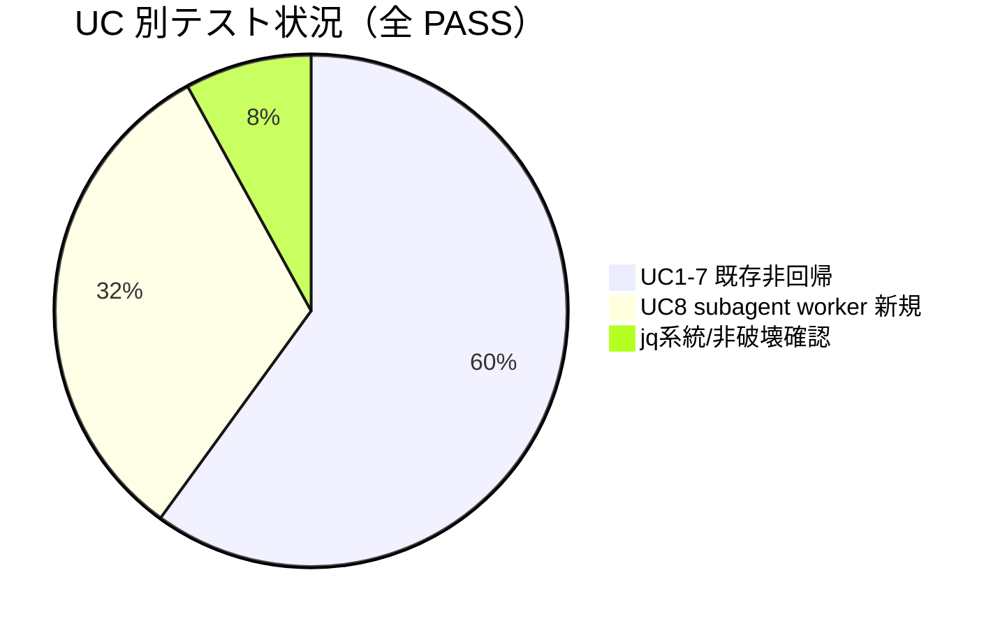

# レビュー書: `AGENT_ROLE` スコープ問題の是正（enforce on が委譲を機能不全にする欠陥の解消）

**プロジェクト名**: `AGENT_ROLE` スコープ問題の是正
**作成日**: 2026 年 07 月 11 日
**最終更新**: 2026 年 07 月 11 日

> **重要**: **このドキュメントは常に更新**: レビューで発見した問題点・改善提案・対応内容があれば即座に更新する。
>
> **用語**: [.agent-skill-chain/source/CONCEPTS.md §用語規約](../../../../../../.agent-skill-chain/source/CONCEPTS.md#用語規約) を参照。
> **レビュー深度**: **full**（PreToolUse hook のロール判定という enforcement の中核・セキュリティ影響が大きいため。[RULES.md §実行モード](../../../../../../.agent-skill-chain/source/RULES.md) に基づく）。REVIEW_RULE.md / REVIEW_DUAL_LENS.md を参照。

---

## 1. レビュー概要

### 1.1 レビュー目的（必須）

実装内容の確認・品質保証・enforcement セキュリティ不変条件（main 直接実作業ブロック・R1/R6・偽装耐性）の非劣化を、実装担当の自己申告を鵜呑みにせず**コードの独立精読と hook の実挙動再現**で検証し、close 可否を判定する。

### 1.2 レビュー対象（必須）

- **実装範囲**: enforce on 時に委譲先サブエージェント（worker）を stdin `agent_id`（ハーネス注入信号）で判定して実作業ツール（Bash/Edit/Write）を許可し、進行役 main（orchestrator・`agent_id` なし）の直接実作業ブロックは非劣化で維持する是正（03 実装計画 T1〜T4）。
- **レビュー期間**: 2026-07-11 ～ 2026-07-11
- **レビュー担当者**: verify-and-close ワーカー（fresh reviewer・実装担当とは別インスタンス）

**変更ファイル（本 issue スコープ）**:

| ファイル | 変更 | 対応タスク |
| -------- | ---- | ---------- |
| `.agent-skill-chain/source/enforcement/claude/PreToolUse.sh` | +122/-47（agent_id 抽出・IS_SUBAGENT 確定・R2 main 限定化・R3 再構成） | T1 |
| `test/test-pretooluse-hook.sh` | +81（UC8 subagent worker 昇格・jq/非 jq 両系統） | T2 |
| `.agent-skill-chain/source/enforcement/README.md` | +10（orchestrator 行に subagent worker 判定を補足） | T4 |
| `.agent-skill-chain/source/enforcement/DESIGN.md` | +6（worker/main 識別・偽装耐性節を追記） | T4 |
| `settings.enforce.json` / `src/agents-md.ts` | **変更 0（不変を git diff で確認）** | — |

---

## 2. 実装内容の確認

### 2.1 実装完了タスク（または Issue）

| タスク名 | 実装内容 | 実装日 | 担当者 | ステータス |
| -------- | -------- | ------ | ------ | ---------- |
| T1 hook 実装 | `PreToolUse.sh` に `agent_id` 判定・`IS_SUBAGENT` 確定・R2/R3 ガードを実装 | 2026-07-11 | 実装ワーカー | 完了 |
| T2 テスト拡張 | UC8（subagent worker）を jq/非 jq 両系統で追加・既存 UC1〜7 非回帰 | 2026-07-11 | 実装ワーカー | 完了 |
| T3 実機フィジビリティ確認ゲート | 隔離クリーンクローンで enforce on し配備 hook を合成 stdin で駆動・fail-open(d) 必須検査 | 2026-07-11 | 実装ワーカー | 完了（限界は §7・§10 に記録） |
| T4 文書整合 | `enforcement/README.md`・`DESIGN.md` を実挙動に整合・テンプレート不変を明記 | 2026-07-11 | 実装ワーカー | 完了 |

### 2.2 実装内容の詳細（独立精読の結果）

#### タスク 1: `PreToolUse.sh` の agent_id 判定と R2/R3 ガード

- **実装内容**: `json_get` に `agent_id`（トップレベル `.agent_id`）抽出を jq・非 jq 両系統で追加（L45-73）。`parse_input` の JSON 経路で `AGENT_ID="$(json_get agent_id)"`、env フォールバック経路で `AGENT_ID=""` に固定、両経路後に `IS_SUBAGENT=0; [[ -n "$AGENT_ID" ]] && IS_SUBAGENT=1`（L128-144）。R2 orchestrator 許可リストのガードを `"$ROLE" == "orchestrator" && "$IS_SUBAGENT" != "1"` へ限定（L182）。R3 Bash 判定を (a)scribe 最優先→(b)非scribe subagent worker allow→(c)main block→(d)其他 block の順に再構成（L209-261）。
- **変更ファイル**: `.agent-skill-chain/source/enforcement/claude/PreToolUse.sh`
- **確認事項**: 監査で確認すべき最重要ポイントを §4・§7 に独立検証結果として記録。

#### タスク 2: `test/test-pretooluse-hook.sh` の UC8 追加

- **実装内容**: UC8「subagent worker（agent_id）昇格」を新設。worker Write/Edit/Bash allow・R1/R6 不変 block・main（agent_id なし）block・scribe+agent_id の R5 維持の 8 ケースを jq 経路・非 jq 経路（`NOJQ_PATH`）双方で実行。jq シムに `.agent_id` 分岐を追加。
- **確認事項**: 独立実行で全 PASS を確認（§3.1）。

#### タスク 4: enforcement 文書の整合

- **実装内容**: README §失敗条件→実装の所在の「orchestrator の Write/Edit/Shell 拒否」行に「委譲先 subagent（`agent_id` あり＝`IS_SUBAGENT=1`）は worker 許可・main（`agent_id` なし）のみ block」を補足。DESIGN に「worker と main の識別（`agent_id` による委譲先判定）」節と偽装耐性の限界（ADR-2）を追記。判定ロジックの実体は `PreToolUse.sh` のみに集約する旨を明記しドリフトを防止。
- **確認事項**: 文書記述が実挙動（agent_id 判定・R1/R6 不変・scribe 最優先）と一致することを確認（§5.2）。

---

## 3. テスト結果の確認

### 3.1 単体テスト

#### テスト実行結果（必須: 数値で記載・レビュアー独立再実行）

- **実行日**: 2026-07-11（レビュアーが `bash test/test-pretooluse-hook.sh` を独立実行）
- **テストファイル数**: 1（`test/test-pretooluse-hook.sh`）
- **テストケース数**: 50（UC1〜UC8 ＋ jq 系統 ＋ 非破壊確認）
- **成功**: 50
- **失敗**: 0
- **スキップ**: 0
- **結論**: 実装担当の自己申告「50 PASS / FAIL 0」を独立再実行で**一致確認**。UC8 の worker allow・R1/R6 不変・main block・scribe+agent_id の R5 維持が jq/非 jq の両系統で全 PASS。

#### テストカバレッジ

#### 失敗したテスト

なし（0 件）。

### 3.2 統合テスト

該当なし（hook 単体・外部 API を持たない）。

### 3.3 E2E テスト

- **隔離フィジビリティ確認（T3・実装担当実施）**: `mktemp -d`＋`git archive HEAD` のクリーンクローンに未コミット `PreToolUse.sh` をオーバーレイ・`.claude/hooks/` 配備し、**隔離ディレクトリに対してのみ** `enforce on` を実行、配備 hook を settings 由来 env（`AGENT_ROLE=orchestrator`）＋合成 stdin で駆動。worker Write/Bash=exit 0、main（agent_id なし）Write/Bash=exit 2、R1/R6=exit 2 を観測（memo `20260711_210757_...` に記録）。
- **限界（実装担当の正直申告をレビュアーが確認）**: 「Claude Code ハーネスが subagent 実行時に stdin へ `agent_id` を実注入し main には付与しない」という load-bearing 前提そのものは、別 CLI インスタンスでの live 委譲を要するため**未実測**。合成 stdin は当該前提を人工的に置いた検証である。§7・§10 に required 追加検証として明記。
- **live `enforce on` フリップは本監査でも一切行っていない**（進行役ロックアウト回避・制約遵守）。

---

## 4. コードレビュー

### 4.1 コード品質

#### コードスタイル

- **リント結果**: 該当ツール未設定（bash スクリプト）。`bash -n` 相当の実行時パースはテスト実行で緑。
- **フォーマット**: 問題なし（既存 hook の関数分割・命名・コメント様式を踏襲）。
- **型チェック**: 該当なし（shell）。

#### コードレビュー観点

| 観点 | 確認内容 | 結果 | コメント |
| ---- | -------- | ---- | -------- |
| 可読性 | R3 の (a)(b)(c)(d) 分岐にコメントで判定順の意図を明記 | OK | 判定順が保守の要であり、コメントが実装と一致 |
| 保守性 | ロール判定を `PreToolUse.sh` 1 ファイルに集約・テンプレート/TS へ分散なし | OK | `settings.enforce.json`・`src/agents-md.ts` 差分 0 を git diff で確認 |
| パフォーマンス | 追加処理は `json_get agent_id` 1 回＋非空判定のみ | OK | 既存キー抽出と同水準・有意な待ち時間影響なし |
| セキュリティ | env 自己申告経路なし・R1/R6 全ロール不変・偽装耐性 | OK | §7 に独立コード検証結果を記録 |

### 4.2 指摘事項

**指摘 0 件。** review-docs（実装前ドキュメントレビュー・2 サイクルで指摘 0 件収束）に加え、本 verify-and-close の full レビューでも新規指摘は発生しなかった。既知の限界（fail-open(d) の未実測）は欠陥ではなく load-bearing 前提の残存不確実性であり、§7・§10 に required 追加検証として記録する（ごまかさない）。

### 4.3 敵対的観点リスト（REVIEW_DUAL_LENS §2.1・反証/破壊を試みた観点と結論）

| # | 攻めた観点（反証・破壊の試み） | 結論 |
| - | ------------------------------ | ---- |
| A1 | **env で `agent_id` を自己申告して worker 昇格できないか**（`export CLAUDE_AGENT_ID=...` / `AGENT_ID=...`） | 遮断確認。env 経路で `AGENT_ID=""` 固定（L139）。レビュアーが env twin をセットし stdin に `agent_id` 無しの orchestrator Write を投入→ **exit 2**（block）を独立再現。env 昇格 twin は実装に存在しない（grep で確認） |
| A2 | **手動 `export AGENT_ROLE=worker`（agent_id なし）で Bash 実作業できないか** | 遮断確認。R3(d) で `only scribe may run Bash` block。独立再現で **exit 2** |
| A3 | **worker（agent_id あり）なら R1（runtime 直接編集）/R6（sqlite3）も抜けられないか** | 不変確認。R1（L168-172・ロールガードなし）・R6（L264-268・全ロール）は subagent でも block。独立再現で両方 **exit 2** |
| A4 | **scribe が委譲サブ（agent_id 同伴）だと worker allow に落ち R5（write-workflow-log 単独）を回避できないか** | 遮断確認。R3(a) で scribe を最優先判定。UC8 ケース6（scribe+agent_id の `Bash ls`）が **exit 2**・`write-workflow-log.sh` 単独のみ exit 0 |
| A5 | **main（orchestrator・agent_id なし）が worker 許可の副作用で直接 Write/Bash を素通しされないか（fail-open 化）** | 非劣化確認。R2 は `IS_SUBAGENT != 1` ガードで main のみ block・R3(c) で main Bash block。独立再現で Write/Bash とも **exit 2** |
| A6 | **ハーネスが main スレッドにも `agent_id` を注入したら main block が骨抜き（ADR-3(d)）にならないか** | **未確定（残存リスク）**。hook ロジック側は「agent_id なし合成 main」で block を確認済みだが、ハーネスが実際に main へ `agent_id` を付与しないかは live 未実測。→ §7・§10 に required 追加検証として顕在化（安全側の失敗系として最重要扱い） |

### 4.4 must-preserve リスト（REVIEW_DUAL_LENS §2.2・壊してはならない不変条件と保持確認）

| # | 不変条件（must-preserve） | 保持確認 |
| - | ------------------------- | -------- |
| P1 | orchestrator（main）の直接 Write/Edit/Delete/StrReplace/Shell/Bash ブロック（失敗条件 #25・絶対強制） | 保持（R2 main 限定化＋R3(c)。独立再現で block） |
| P2 | R1: `.agent-skill-chain/runtime/` 直接 Write/Edit 禁止（全ロール） | 保持（ロールガードなし・subagent でも block） |
| P3 | R6: sqlite3 直接実行禁止（全ロール） | 保持（末尾 `-n "$CMD"` 判定・scribe 経路の R6 先行も維持） |
| P4 | scribe 昇格機構（nonce 出所分離 C-4b）と R4（複合シェル禁止）/R5（write-workflow-log 単独） | 保持（R3(a) 最優先・UC5/UC8 ケース6 で緑） |
| P5 | 委譲ツール `Agent`/`Task` 両許可（`4358a0f`） | 保持（R2 許可リストに両名残存・UC1 で緑） |
| P6 | fail-safe（`set +e`・入力なし/非 JSON は allow・AGENTS_ROOT 不在は allow） | 保持（UC4 で緑） |
| P7 | env 後方互換（stdin 空/非 JSON 時の env フォールバック） | 保持（UC4 で緑・ただし `agent_id` の env twin は意図的に非追加） |
| P8 | `settings.enforce.json`・`src/agents-md.ts` テンプレート不変 | 保持（git diff 差分 0 を確認） |
| P9 | 既存 UC1〜UC7 の合否 | 保持（全 PASS・非回帰） |

---

## 5. ドキュメントの確認

### 5.1 ドキュメント更新状況

| ドキュメント | 更新状況 | 確認者 | 確認日 |
| ------------ | -------- | ------ | ------ |
| [`00_要求定義.md`](./00_要求定義.md) | 更新済み（is-a 完結） | レビューワーカー | 2026-07-11 |
| [`01_要件定義.md`](./01_要件定義.md) | 更新済み | レビューワーカー | 2026-07-11 |
| [`02_設計.md`](./02_設計.md) | 更新済み（ADR-1/2/3 記録） | レビューワーカー | 2026-07-11 |
| [`03_実装計画.md`](./03_実装計画.md) | 更新済み（T1〜T4） | レビューワーカー | 2026-07-11 |

### 5.2 ドキュメントの整合性

- **実装と設計の整合性**: 整合。ADR-1（stdin `agent_id` 採用）・ADR-2（env 昇格 twin 非設置による非自己申告性）・R3 判定順が実コード（L128-261）と一致。
- **要件と実装の整合性**: 整合。01 ストーリー1〜4 の受け入れ基準が UC8＋既存 UC＋T3 memo に 1:1 対応（§9 のトレース表）。
- **T4 文書と実挙動の整合性**: 整合。README/DESIGN の追記が agent_id 判定・R1/R6 不変・scribe 最優先を正しく記述し、判定ロジックの正本を `PreToolUse.sh` 単一に委譲。

---

## docs 更新

（監査 #31 必須。[`.agent-skill-chain/source/DOCS_RULES.md`](../../../../../../.agent-skill-chain/source/DOCS_RULES.md) §継続追随ゲートに従い判定。）

- 要否: 不要
- 対象: なし（`docs/00_review/` は不使用）
- 理由: 本リポジトリの `docs/` はメンテナ開発記録（`docs/maintainer/workflow/`）と `AI_CI_CD_VISION.md` のみで構成され、`docs/00_review/` や `docs/01_システム概要`〜`05_規約` といったシステム仕様書ツリーを採用していない（`ls docs/` で確認）。本 issue の対象であるロール強制の仕様正本は `.agent-skill-chain/source/enforcement/README.md`・`DESIGN.md`（パッケージ配布物＝システム仕様書相当）であり、これらは本 issue の **T4 で実装と同期して更新済み**（agent_id による worker/main 識別・偽装耐性の限界を追記）。よって docs/00_review 反復ゲートは不発動であり、仕様追随は T4 で完遂している。

---

## 6. パフォーマンス確認

### 6.1 パフォーマンステスト結果

追加処理は `json_get agent_id` 1 回と `[[ -n "$AGENT_ID" ]]` 判定のみ。既存の `tool_name`/`command`/`file_path` 抽出と同水準で、ツール実行前の待ち時間に有意な影響なし（01 §3.1 充足）。

### 6.2 ボトルネックの確認

なし。jq 非依存フォールバックも既存パターンの流用で計算量は増加しない。

---

## 7. セキュリティ確認（監査の最重要ポイント・独立コード検証）

### 7.1 セキュリティチェック

| 項目 | 確認内容 | 結果 | コメント |
| ---- | -------- | ---- | -------- |
| 認証・認可（ロール昇格） | worker 昇格は stdin `agent_id`（ハーネス注入）を必要条件とし env 自己申告経路を持たない | OK | 下記 §7.2〜7.5 に独立検証 |
| データ保護（R1/R6） | runtime 直接編集・sqlite3 直接実行は全ロール（subagent 含む）で block | OK | §7.4 |
| 入力検証 | jq/非 jq 両系統で `agent_id` を同一抽出・env フォールバックは `AGENT_ID=""` 固定 | OK | §7.2 |

### 7.2 偽装耐性（`agent_id` env 自己申告経路の非存在）— 独立検証

- **コード確認**: `grep -n "CLAUDE_AGENT_ID\|AGENT_ID" PreToolUse.sh` の結果、`AGENT_ID` への代入は (1) JSON 経路 `AGENT_ID="$(json_get agent_id)"`（L129・stdin トップレベルのみ）、(2) env フォールバック経路 `AGENT_ID=""`（L139・空固定）の 2 箇所のみ。`CLAUDE_AGENT_ID` 等の env 参照は**コメントで「意図的に設けない」と明記されるのみで実コードに存在しない**（`grep -nE 'AGENT_ID=.*\$\{?[A-Z]'` で env 由来代入 0 件）。
- **実挙動再現**: `CLAUDE_AGENT_ID=fake AGENT_ID=fake AGENT_ROLE=orchestrator` を env セットし、stdin に `agent_id` を含まない orchestrator Write を投入 → **exit 2（block）**。env 経由で `IS_SUBAGENT=1` を自己申告する経路が存在しないことを独立に確認（ADR-2 の非自己申告性を満たす）。

### 7.3 判定順序（R3 Bash）— 独立検証

実コード L209-261 の if/elif 連鎖を精読し、以下の順であることを確認:
- **(a)** `if [[ "$ROLE" == "scribe" ]]`（L210）— R6 先行/R4 複合シェル/R5 write-workflow-log 単独を適用。
- **(b)** `elif [[ "$IS_SUBAGENT" == "1" ]]`（L250）— 非 scribe subagent worker は Bash allow（`:`）。
- **(c)** `elif [[ "$ROLE" == "orchestrator" ]]`（L254）— main は `orchestrator cannot run Bash` block。
- **(d)** `else`（L257）— 非 scribe・非 subagent・非 orchestrator は `only scribe may run Bash` block。

順序 (a)→(b)→(c)→(d) は設計 02 §3.2 と一致。scribe が委譲サブ（agent_id 同伴）でも (a) が先に捕捉するため worker allow に落ちず R5 を無条件維持（UC8 ケース6・A4 で緑）。

### 7.4 R1（runtime 直接編集禁止）・R6（sqlite3 禁止）の全ロール不変 — 独立検証

- **R1**（L168-172）: `if [[ "$TOOL" == "Edit" || "$TOOL" == "Write" ]]` 内でパス判定。**ロール/IS_SUBAGENT のガードなし**＝全経路共通。worker（agent_id あり）の runtime Edit を独立再現 → **exit 2**。
- **R6**（L264-268）: 末尾で `if [[ -n "$CMD" ]]` → `sqlite3` 一致で block。**ロールガードなし**＝全ロール。加えて scribe 経路内にも R6 先行（L216）。worker（agent_id あり）の `sqlite3` Bash を独立再現 → **exit 2**。

### 7.5 main 直接実作業ブロックの非劣化（fail-open 化していないこと）— 独立検証

- R2 の main 限定化（`ROLE==orchestrator && IS_SUBAGENT!=1`・L182）と R3(c) により、`agent_id` を伴わない main の Write/Edit/Bash は従来どおり block。独立再現で main Write=exit 2・main Bash=exit 2。worker 許可の導入が main の抜け穴（fail-open）になっていない（効果2・ストーリー2・失敗条件 #25 の非劣化を確認）。

### 7.6 fail-open(d) の残存不確実性（正直記録・required 追加検証）

**実装担当の自己申告どおり、以下は本 issue 完了時点で未実測であり、live `enforce on` 運用開始前の必須追加検証事項として記録する（ごまかさない）:**

- **前提（load-bearing）**: 「Claude Code ハーネスが settings.json 経由の PreToolUse を **subagent 実行時に発火**させ、その stdin へ `agent_id` を **実注入**し、かつ **main スレッドには `agent_id` を付与しない**」。
- **未実測の理由**: 検証には別 Claude Code CLI インスタンスを起動し進行役→worker の live 委譲を行う必要があるが、本作業・本 T3 はサブエージェント（ワーカー）として実行されており、対話型 CLI の別インスタンス起動・live 委譲は実施不能。T3 の合成 stdin は「ハーネスが agent_id を注入する」前提を人工的に置いた検証にすぎない。
- **危険度**: ADR-3(d)＝「main にも `agent_id` が付く」場合、main が `IS_SUBAGENT=1` と誤判定され orchestrator の直接実作業 block が **fail-open で骨抜き**（失敗条件 #25 の破れ）。これは可用性の失敗系(c) より危険な**安全性の失敗系**。
- **hook ロジック側の保証範囲**: hook 実装自体は「agent_id なし合成 main」で block を確認済み。(d) が起きるのは hook の欠陥ではなく**ハーネス挙動**の問題であり、hook ロジックの是非とは分離される。
- **公式ドキュメント根拠（external_doc）**: hooks.md `In Subagents` 節は subagent 実行時に `agent_id`/`agent_type` が付く旨を明記。ただし settings.json PreToolUse の subagent 発火・env 継承・main 非注入は未明記（曖昧）で observed_runtime＋要人間確認で補完（ADR-3）。

→ **§10.1 に required 追加検証（live enforce on 前ゲート）として顕在化する。**

---

## 8. デプロイ準備

### 8.1 デプロイチェックリスト

- [x] すべてのテストが通過している（50 PASS / 0 FAIL・独立再実行）
- [x] コードレビューが完了している（full・指摘 0 件）
- [x] ドキュメントが更新されている（00〜04・enforcement README/DESIGN）
- [ ] マイグレーションスクリプト（該当なし）
- [x] 環境変数の設定が確認されている（`settings.enforce.json` 不変・`.claude/settings.json` は本監査でも `{}` のまま不変）
- [ ] バックアップ計画（該当なし・hook はステートレス）

### 8.2 デプロイ計画

- **デプロイ予定日**: 未定（enforcement は opt-in・既定 off）
- **デプロイ方法**: 消費者が `agents-md enforce on` を任意で有効化
- **ロールバック計画**: `agents-md enforce off` で配線のみ除去（memo に手順記録済み）

---

## 9. 設計・境界の確認

**review-architecture の結果。**

### 9.1 設計の確認

- **設計原則の準拠**: OK。UNIX 哲学（既存入力層に信号 1 つ追加・新規スクリプト/env 経路/設定ファイルを増やさない）・単一責務（判定正本を `PreToolUse.sh` に集約）を満たす（spec/01）。
- **ディレクトリ構成**: OK。変更は `enforcement/claude/`・`test/`・`enforcement/*.md` に限局。
- **命名規則**: OK。`AGENT_ID`/`IS_SUBAGENT` は既存 `ROLE`/`TOOL`/`CMD` の命名様式を踏襲。

### 9.2 境界・依存の確認

- **責務の境界**: 明確。入力層（`parse_input`/`json_get`）→判定層（R1〜R6）→出力層（`block`/`allow`）の一方向依存を維持。ロール分岐は入力層の信号追加のみで判定層は確定変数のみ参照。
- **依存関係**: 意図しない依存・循環なし。`settings.enforce.json`・`src/agents-md.ts` へロール分岐が漏れていない（差分 0）。
- **指摘・推奨**: なし（設計指摘 0 件）。ADR-3 のフォールバック（agent_type 併用・frontmatter `tools:` 許可リスト）が (c)/(d) 観測時の切替先として設計済みで、拡張余地が確保されている。

### 9.3 トレーサビリティ（01 受け入れ基準 ↔ 検証）

| 01 ストーリー | 受け入れ基準 | 検証 | 結果 |
| ------------- | ------------ | ---- | ---- |
| S1 worker 実作業 | worker の Write/Edit/Bash が exit 0 | UC8-1〜3・独立再現・T3 隔離 | ○ |
| S2 main 非劣化 | main の直接 Write/Edit/Bash が exit 2 | UC8-5・独立再現・T3 fail-open(d) 検査 | ○（hook ロジック） |
| S3 偽装耐性 | 素朴な手動 export で worker を名乗れない | A1/A2・独立再現・grep | ○（限界は ADR-2・§7.6） |
| S4 一次情報/ADR | フィジビリティ確認結果を ADR で記録 | ADR-1/2/3・T3 memo | ○（残存不確実性を正直記録） |

### 9.4 重要判断の根拠（evidence_source）

| 判断内容 | evidence_source | 備考 |
| -------- | --------------- | ---- |
| worker allow / main block の hook ロジックが正しい | test_output ＋ observed_runtime | 50 PASS・レビュアー独立再現（§7.2-7.5）・T3 隔離観測 |
| env 自己申告経路が存在しない（偽装耐性） | existing_code ＋ test_output | grep で env 由来 AGENT_ID 代入 0 件・env twin セット時 block を再現 |
| R1/R6 全ロール不変 | existing_code ＋ test_output | ロールガードなしをコード精読・worker で block 再現 |
| テンプレート/TS 不変 | existing_code | `git diff` 差分 0 |
| ハーネスが main に agent_id を付与しない（(d) 否定） | inference_only（＋ external_doc の含意） | **未実測＝要人間確認。§10.1 の required 追加検証で確定するまで close 条件付き** |

> **inference_only のみに依存する重要判断（(d) 否定）は承認不可または要人間確認**（REVIEW_RULE / EVIDENCE_POLICY §節4）。本レビューは当該項目を「hook ロジックは是・ハーネス前提は要 live 実測」と分離し、§10.1 の追加検証ゲートに委ねる。

---

## 10. 課題と改善点

### 10.1 発見された課題（＝close 後・live enforce on 運用開始前の required 追加検証）

- **課題 1（安全性・最重要）**: ハーネスが main スレッドに `agent_id` を注入しないこと（ADR-3(d) の否定）が **live 未実測**。→ **2026-07-12 解消済み（○）**。
  - **影響範囲**: enforce on を実 live で有効化した場合の main 直接実作業ブロック（失敗条件 #25）。
  - **対応方法（live enforce on 前ゲート・必須）**: `mktemp -d`＋`git archive HEAD` の隔離クリーンクローンで**別 Claude Code インスタンス**を起動し enforce on。①進行役→worker の live 委譲で worker の Write が実際に通る（`agent_id` 実注入）、②**同環境で進行役 main の直接 Write が block される**（main 非注入）、の 2 点を○/×で実機確認する。②が×（block されない）なら本方式（stdin `agent_id`）を不採用とし、ADR-1 選択肢3（subagent frontmatter `tools:` 許可リスト）等へ切替える。本セッションの live `.claude/settings.json` フリップは**禁止**。
  - **実機確認結果（2026-07-12・ユーザー承認の上で別 `claude -p` インスタンスを隔離クローンに対して起動）**: ①worker allow＝○（Agent 委譲サブエージェントの Write が `exit 0` で成功・ファイル生成を ground truth で確認）、②main block＝○（別インスタンス自身の直接 Write が hook `exit 2`・`enforcement ERROR: orchestrator must never modify files or run write/edit/shell` で block・ファイル未生成を ground truth で確認）。**ADR-3(d) は否定され、fail-open 化は観測されなかった**。詳細は [`../../memo/20260712_003504_AGENT_ROLEスコープ是正_live実機確認.md`](../../memo/20260712_003504_AGENT_ROLEスコープ是正_live実機確認.md)（stream-json の hook_response 生ログ・ground truth ファイル存否を記録）。本物のリポジトリの `.claude/settings.json`（sha256 `ca3d163b…`）は検証前後で不変。
- **課題 2（可用性・副次）**: subagent 実行時に `agent_id` が空で付与される場合（ADR-3(c)）、worker が block され続ける。
  - **影響範囲**: worker の委譲タスク完遂（可用性のみ・安全性は劣化しない）。
  - **対応方法**: 上記実機確認で検出したら `agent_type` presence 併用または frontmatter `tools:` 許可リストへフォールバック（設計済み）。

### 10.2 改善提案

- **改善 1**: 上記 live 実機確認の結果を、本 issue の memo または親 issue の申し送りに追記し、`enforce on` を既定運用に格上げする判断根拠とする。
  - **効果**: ADR-3 の残存不確実性を解消し、enforcement のセキュリティ保証を実測ベースへ引き上げる。

---

## 11. システム仕様書の更新

> 本リポジトリはシステム仕様書ツリー（`docs/` ベースの `01_システム概要`〜`05_規約`）を採用していない（§docs 更新 参照）。ロール強制の仕様正本は `.agent-skill-chain/source/enforcement/README.md`・`DESIGN.md`（パッケージ配布物）であり、本 issue の T4 で実装と同期更新済み。

### 11.1 システム仕様書の確認結果

- **実装した機能**: enforce on 時の worker/main ロール分離（stdin `agent_id` 判定）。
- **実装した API**: `PreToolUse.sh` の stdin JSON 契約（`agent_id` 読取キー追加・exit code 契約は不変）。

### 11.2 更新状況

- `enforcement/README.md`（orchestrator 行に subagent worker 判定を補足）・`enforcement/DESIGN.md`（worker/main 識別・偽装耐性節を追加）を T4 で更新済み。`settings.enforce.json`・`src/agents-md.ts` は不変。

---

## 12. レビュー結果

### 12.1 総合評価

- **実装品質**: 良好（ロール判定を単一ファイルに集約・判定順の意図をコメント化・テンプレート/TS ドリフトなし）。
- **テスト品質**: 良好（jq/非 jq 両系統・worker allow/main block/R1/R6/scribe を網羅・50 PASS・独立再現一致）。
- **ドキュメント品質**: 良好（ADR で残存不確実性と検証ゲートを正直に記録）。
- **総合評価**: **close 可。** hook 実装・テスト・偽装耐性・R1/R6 不変・main 非劣化は full レビューと独立再現で全て確認、指摘 0 件。§10.1 課題1（ハーネスが main に `agent_id` を注入しない＝ADR-3(d) の否定）は 2026-07-12、ユーザー承認の上で実施した別インスタンス実機確認により **live 実測で解消済み**（worker allow・main block とも ground truth で確認。詳細は同 memo）。live enforce on 前ゲートは通過済みであり、追加の条件は残らない。

### 12.2 承認状況

- **レビュー承認者**: verify-and-close ワーカー（fresh reviewer）
- **承認日**: 2026-07-11
- **承認コメント**: 実装・テスト・独立コード検証は完了・指摘 0 件で close 相当と判断する。`.claude/settings.json` は本監査を通じて `{}` のまま不変（git diff 差分 0）を確認。live enforce on 運用開始前に §10.1 課題1 の実機確認を必須の申し送りとして親 issue / 保守者へ引き継ぐ。

---

## 13. 参考資料

### 13.1 プロジェクトドキュメント

- [`00_要求定義.md`](./00_要求定義.md) / [`01_要件定義.md`](./01_要件定義.md) / [`02_設計.md`](./02_設計.md) / [`03_実装計画.md`](./03_実装計画.md)

### 13.2 その他の参考資料

- [`../../../../../../.agent-skill-chain/source/enforcement/claude/PreToolUse.sh`](../../../../../../.agent-skill-chain/source/enforcement/claude/PreToolUse.sh)（実装正本）
- [`../../../../../../test/test-pretooluse-hook.sh`](../../../../../../test/test-pretooluse-hook.sh)（UC1〜8）
- [`../../../../../../.agent-skill-chain/source/REVIEW_DUAL_LENS.md`](../../../../../../.agent-skill-chain/source/REVIEW_DUAL_LENS.md)（二観点・両リスト）
- T3 実機フィジビリティ確認 memo（`../../memo/20260711_210757_AGENT_ROLEスコープ是正_T3実機フィジビリティ確認.md`・非追跡）

---

## 14. 前のステップ

- **前**: [`03_実装計画.md`](./03_実装計画.md) - 実装計画フェーズ

---

## 15. 次のステップ

- 本 issue は enforcement opt-in（既定 off）の runtime 是正であり、実装・単体検証・live 実機確認まで完了。close 済み。
- **完了済みゲート**: `enforce on` の live 有効化前提となる §10.1 課題1 の別インスタンス実機確認（worker allow の agent_id 実注入 ＋ main 非注入の block 維持）は 2026-07-12 に通過済み（[`../../memo/20260712_003504_AGENT_ROLEスコープ是正_live実機確認.md`](../../memo/20260712_003504_AGENT_ROLEスコープ是正_live実機確認.md)）。
- **残る副次課題（10.2 課題2）**: subagent 実行時に `agent_id` が空で付与されるケース（可用性のみ・安全性は劣化しない）は本検証では観測されなかったが、消費者環境ごとの差異は否定できないため、`enforce on` 導入時に個別確認を推奨する申し送りとして残す。
