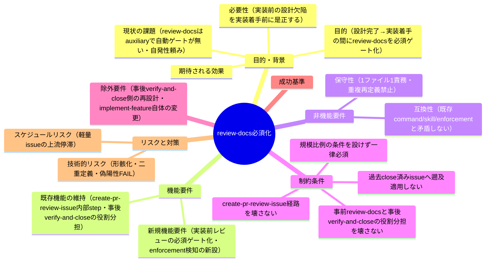
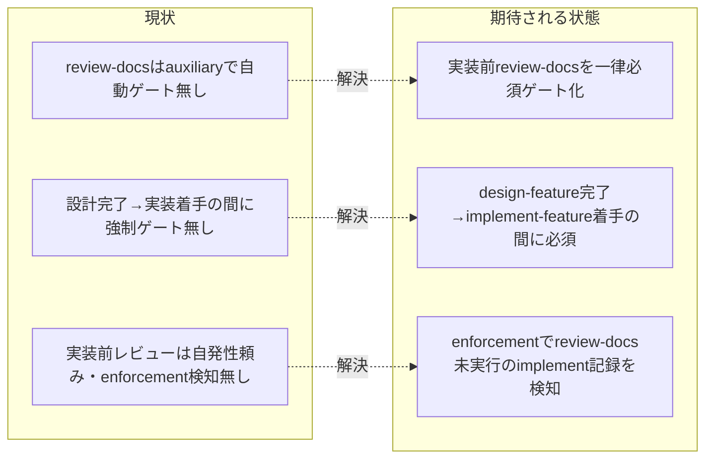

# 要求定義書: 実装前ドキュメントレビュー（review-docs）の全 issue 必須ゲート化

**プロジェクト名**: review-docs 必須化（design-feature 完了→implement-feature 着手の間の必須ゲート化）
**作成日**: 2026 年 07 月 11 日
**最終更新**: 2026 年 07 月 11 日

> **重要**:
>
> - 要求定義書は、プロジェクトの全体像を把握するためのものです。詳細な技術仕様や実装方法は要件定義書以降で記載します。必要最低限の情報に収めることを心掛けてください。
> - **このドキュメントは常に更新**: 要求の変更や追加があった場合は、即座にこのドキュメントを更新してください。ドキュメントは「生きているドキュメント」として扱い、実装内容と常に同期させます。
> - **必須項目**: 以下の「必須」と明記した項目は空欄・抽象語のみ（例: 「{説明}」のまま）で提出しないこと。判定可能な形（目的は1文・成功基準は○/×で判定できる記載等）で記入すること。
>
> **用語**: [.agent-skill-chain/source/CONCEPTS.md §用語規約](../../../../../../.agent-skill-chain/source/CONCEPTS.md#用語規約) を参照。

---

## 要求定義の全体像

**注意**:

- マインドマップは全体像を把握するためのものであり、詳細は本文の各セクションに記載する。

---

## 1. 目的・背景

### 1.1 目的（必須）

設計完了後・実装着手前の実装前ドキュメントレビュー（review-docs）を、規模比例条件を設けず全 issue で必須ゲート化する。

### 1.2 背景

- **現状の課題**:
  - 実装前ドキュメントレビューの command [.agent-skill-chain/source/commands/review-docs.md](../../../../../../.agent-skill-chain/source/commands/review-docs.md)（00/01/02/03 に対しレビュー＋修正を指摘 0 件まで反復する）は**存在する**（実物確認済み。evidence_source: existing_code）。しかし [.agent-skill-chain/source/workflow/PHASES.md](../../../../../../.agent-skill-chain/source/workflow/PHASES.md) §レビュー成果物の配置ルール（:65）および [.agent-skill-chain/source/workflow/PHASE_COMMAND_MAP.md](../../../../../../.agent-skill-chain/source/workflow/PHASE_COMMAND_MAP.md) §補助手順（auxiliary）（:25）に明記のとおり、review-docs は「**phase→command 表に載らない補助手順（auxiliary）**」であり、そのトリガーは (a) ユーザーの「ドキュメントレビューして」依頼、(b) `create-pr-review-issue` の内部 step の 2 経路のみである（evidence_source: existing_code）。
  - すなわち **design-feature 完了 → implement-feature 着手の間に、review-docs が自動的に実行される強制ゲートが存在しない**。`grep` で確認したところ、[.agent-skill-chain/source/commands/design-feature.md](../../../../../../.agent-skill-chain/source/commands/design-feature.md)・[.agent-skill-chain/source/commands/implement-feature.md](../../../../../../.agent-skill-chain/source/commands/implement-feature.md)・[.agent-skill-chain/source/skills/agent/run_command.md](../../../../../../.agent-skill-chain/source/skills/agent/run_command.md) のいずれにも「実装着手前に review-docs を必須で経る」旨のゲート記述は**一切ない**（該当ゼロ件を実測。evidence_source: existing_code）。
  - enforcement（[.agent-skill-chain/source/enforcement/ci/audit.sh](../../../../../../.agent-skill-chain/source/enforcement/ci/audit.sh)）も「review-docs が実行されたか」を検知する仕組みを**持たない**。既存の `#29 check_review_before_implement`（:801）は「実装/検証ログが 0 件なのに 04_review.md が存在する（＝実装前に 04 を誤作成した）」ことを防ぐチェックであり、**review-docs 実行有無の検知ではない**（実物確認済み。evidence_source: existing_code）。
  - その結果、実装前レビューは担当エージェントの**自主的判断に依存**している。親 issue「agentsOS 汎用化・ポリシー統合」ストーリー 1〜8 では「fable モデルによる 4 サイクル指摘 10→4→3→0 件」等の review-docs 相当のレビューを自主的に実施していたが（[../../90_issues.md](../../90_issues.md) 経緯参照）、これはハーネスの強制ではなく担当エージェントの自発的な上乗せであった（evidence_source: existing_code）。

- **必要性**:
  - 本セッションで、進行役（main）が design-feature 完了後・implement-feature 着手前に review-docs を経ずに実装へ進めてしまうケースが発生した（evidence_source: observed_runtime。本セッションで顕在化）。この設計ギャップは今後の全 issue の品質に影響するため、恒久的な必須ゲート化が必要である。
  - ユーザー決定（2026-07-11。evidence_source: human_decision）: 「実装前レビュー（review-docs）を**全 issue で必須化**する（規模比例の条件付きではなく一律）」「この修正は**新規サブ issue として正式に起票**する」の 2 点が明示的に決定された。
  - 事後（verify-and-close＝実装完了後のレビュー）だけでは、根拠・設計の欠陥が実装に反映されてから発覚し手戻りが大きい。**実装着手前（design-feature 完了直後）に review-docs を通す**ことで、設計段階での欠陥を実装前に是正できる。

### 1.3 期待される効果（必須: 1 件以上）

- **効果 1**: design-feature 完了後、review-docs を経ずに implement-feature へ進むことが**規約上禁止と明記**され、`grep` で該当箇所を提示できる（○/× 判定可能）。
- **効果 2**: enforcement（audit.sh）で「review-docs 未実行のまま implement-feature ログが記録される」パターンを機械検証可能な範囲で**検知できる**（○/× 判定可能）。
- **効果 3**: 実装前レビュー（review-docs＝process/事前）と実装完了後レビュー（verify-and-close＝event/事後）の**役割分担が明文化**され、二重定義なく両立する（○/× 判定可能）。
- **効果 4**: 規模比例の条件を設けず、全 issue で一律に実装前レビューが必須ゲートとして働く（軽量 issue への免除条項が新設されない。○/× 判定可能）。

**現状と期待される状態の比較**:

---

## 2. 機能要件

### 2.1 既存機能の維持（該当する場合）

- [.agent-skill-chain/source/commands/review-docs.md](../../../../../../.agent-skill-chain/source/commands/review-docs.md) の command 本体（レビュー＋修正を指摘 0 件まで反復し memo 証跡＋書記委譲で完了する）は維持する。本 issue はこれを**呼び出す経路（強制ゲート）を追加**するものであり、review-docs 自体の Process/DoD を変更しない。
- `create-pr-review-issue` の内部 step からの review-docs 呼び出し経路は維持する（本 issue で壊さない）。
- 実装完了後の verify-and-close（04_review.md 作成・書記記録）は維持する。本 issue はそれを置き換えるのではなく、実装**着手前**のゲートを追加する（役割分担: 事前=review-docs、事後=verify-and-close）。

### 2.2 新規機能要件

- **実装前レビューの必須ゲート化**: design-feature 完了後・implement-feature 着手前に review-docs を必須で経ることを、workflow の規約（PHASES / PHASE_COMMAND_MAP / run_command / design-feature / implement-feature）に明文化する。規模比例の条件は設けず全 issue 一律とする。
- **enforcement による未実行検知の新設**: 「当該 issue に implement-feature ログが存在するのに review-docs ログが（それより前に）1 件も存在しない」パターンを audit.sh で機械検証可能な範囲で検知する（既存 #29 と同型・非交差の新失敗条件として追加）。
- **役割分担の明文化**: 事前（review-docs）と事後（verify-and-close）の役割分担を接続先ドキュメントで読み取れる形にする（重複定義せず参照でつなぐ）。

---

## 3. 非機能要件

### 3.1 パフォーマンス

- 実装前レビューの追加は全 issue 一律必須とするが、review-docs の反復回数・深度は review-docs 側の既定（指摘 0 件まで反復）に委ね、本 issue で新たな重い調査を追加しない。

### 3.2 セキュリティ

- 本 issue はドキュメント・enforcement の変更であり、外部アクセス・高リスク操作の緩和は行わない。既存の高リスク操作の事前確認ルール（CORE / RULES / enforcement）を変更しない。

### 3.3 互換性

- 既存の command / skill chain の実行順序・DoD、および `create-pr-review-issue` からの review-docs 呼び出し経路・verify-and-close の事後レビューと矛盾しないこと。

### 3.4 保守性

- 1 ファイル 1 責務・重複禁止。review-docs の Process/DoD の正本は review-docs.md、レビュー成果物の配置ルールの正本は PHASES.md、phase→command の正本は PHASE_COMMAND_MAP.md、失敗条件の正本は enforcement/README.md とし、接続先には参照のみを書く。

---

## 4. 制約条件

### 4.1 技術的制約

- enforcement の検知は **workflow.db 採用時のみ**機械検証可能である（`review-docs` は既に workflow_log の許可 command かつ write-workflow-log.sh の `ALLOWED_COMMANDS` に含まれることを実物確認済み。evidence_source: existing_code）。DB 非採用ランタイムでは既存 #29 と同様に SKIP とし、規約（人手・AI 自律判断）で担保する。
- 「必須ゲート」を workflow の phase→command 表にどう表現するか（auxiliary 扱いの見直し／新しいサブフェーズの追加／design-feature の Next Phase への接続のいずれか）の**設計判断そのものは 02_設計フェーズで確定**する（本 00/01 では論点の存在と受け入れ基準のみを定める）。
- 誤 FAIL（偽陽性）を出さない安全側設計を要件とする（既存 #29 の「前方一致・close 配下除外・DB 不採用 SKIP」の設計方針を踏襲する）。

### 4.2 既存システムとの互換性

- `create-pr-review-issue` の内部 step からの review-docs 呼び出し経路を壊さない。verify-and-close の既存チェック（#3/#5/#9/#29 等）を弱めない。
- 過去の close 済み issue の成果物への遡及適用はしない（既存 #29 が close 配下を検知対象外とするのと同型）。

### 4.3 移行期間・スケジュール

- 本サブ issue は親 issue（agentsOS 汎用化・ポリシー統合）のストーリー 8（`.agent-skill-chain/` ネスト統合）の影響を受けうる（PHASES / audit.sh 等のパス）ため、実装着手順は orchestrator が別途判断する。

---

## 5. 除外要件

- 実装完了後の verify-and-close（事後レビュー）側の再設計・強化は対象外（既存のまま維持）。
- implement-feature の Process（implement-change / refactor-safely）自体の変更は対象外（ゲートの追加であり実装手順は変えない）。
- review-docs の Process/DoD（レビュー観点・反復・memo・書記）の変更は対象外（正本は review-docs.md のまま）。
- runtime hook（PreToolUse 等）による実行時の物理ブロックの新設は本 issue の必須範囲外（02_設計で費用対効果を検討してよいが、成功基準には含めない。最終保証は CI audit）。
- 過去の close 済み issue への遡及適用はしない。

---

## 6. 成功基準（必須: 1 件以上）

- **SC-1**: [.agent-skill-chain/source/workflow/PHASE_COMMAND_MAP.md](../../../../../../.agent-skill-chain/source/workflow/PHASE_COMMAND_MAP.md) に、design-feature（設計）完了後・implement-feature（実装）着手前に review-docs を必須で経ることが明記されている（`grep` で該当行を提示できる。現行の「補助手順（auxiliary）で表に載せない」注記と矛盾しない形で整合が取られている）。
- **SC-2**: [.agent-skill-chain/source/workflow/PHASES.md](../../../../../../.agent-skill-chain/source/workflow/PHASES.md) の review-docs の auxiliary 扱い（§レビュー成果物の配置ルール :65）が見直され、「実装着手前の必須ゲート」であることと矛盾しないよう更新されている（`grep` で確認できる）。
- **SC-3**: [.agent-skill-chain/source/skills/agent/run_command.md](../../../../../../.agent-skill-chain/source/skills/agent/run_command.md) の Constraints に、design-feature 完了後・implement-feature 委譲前に review-docs を必須で委譲する旨が明記されている（`grep` で該当行を提示できる）。
- **SC-4**: [.agent-skill-chain/source/commands/design-feature.md](../../../../../../.agent-skill-chain/source/commands/design-feature.md)（DoD または実行時の注意）から、次工程として実装着手前に review-docs が必須である旨が読み取れる形で接続されている（`grep` で確認できる）。
- **SC-5**: [.agent-skill-chain/source/commands/implement-feature.md](../../../../../../.agent-skill-chain/source/commands/implement-feature.md)（実行時の注意）に、実装着手の前提として review-docs 完了が必要である旨が明記されている（`grep` で確認できる）。
- **SC-6**: [.agent-skill-chain/source/enforcement/README.md](../../../../../../.agent-skill-chain/source/enforcement/README.md) の失敗条件一覧および対応表に、「review-docs 未実行のまま implement-feature ログが記録された」ことを検知する新失敗条件が追加され、[.agent-skill-chain/source/enforcement/ci/audit.sh](../../../../../../.agent-skill-chain/source/enforcement/ci/audit.sh) に該当チェック関数が実装されている（機械検証可能な範囲で。DB 非採用は SKIP・誤 FAIL を出さない安全側）。
- **SC-7**: 事前（review-docs）と事後（verify-and-close）の役割分担が接続先ドキュメントで読み取れ、重複定義がない（`create-pr-review-issue` の内部 step 呼び出し経路が壊れていないことを含む）。
- **SC-8**: 規模比例の免除条項（軽量 issue は review-docs を省略してよい等）が**新設されていない**（全 issue 一律必須が維持されている。○/× 判定可能）。

---

## 7. リスクと対策

### 7.1 技術的リスク

- **リスク**: 形骸化。review-docs ログを 1 件記録するだけで実質的なレビュー反復を行わない。
  - **対策**: review-docs.md の既存 DoD（指摘 0 件までの反復・memo 証跡・書記委譲）を正本のまま維持し、ゲートは「review-docs ログの存在」を最低条件とする。実質品質は review-docs の DoD と人手監査で担保する。
- **リスク**: 偽陽性 FAIL。close 移動・別 clone・DB 非採用等で誤って FAIL する。
  - **対策**: 既存 #29 の安全側設計（前方一致・close 配下除外・DB 不採用 SKIP・issue ディレクトリ名 basename 末尾一致の救済）を踏襲する（02_設計で確定）。
- **リスク**: 二重定義。役割分担・配置ルールが複数箇所に分裂する。
  - **対策**: 正本を 1 か所に固定し接続先は参照のみ（SC-7 で検証）。

### 7.2 スケジュールリスク

- **リスク**: 全 issue 一律必須化により、軽量 issue の上流が過度に重くなる。
  - **対策**: ユーザー決定により規模比例の条件は設けない（一律）が、review-docs の反復深度は指摘の実態に比例する（指摘が無ければ即 0 件収束）。ゲート追加自体はレビュー実施の有無を縛るのみで、重い調査を新たに課さない。

---

## 8. 参考資料

### プロジェクトドキュメント

- 親 issue: [`00_要求定義.md`](../../00_要求定義.md)・[`02_設計.md`](../../02_設計.md)・[`90_issues.md`](../../90_issues.md)
- 同種の前例（上流フェーズへの義務接続＋evidence パターン）: サブ issue [`フィジビリティADR必須化`](../20260711_055538_フィジビリティADR必須化/00_要求定義.md)（requirement-discovery / design-feature への義務接続の前例）

### その他の参考資料

- [.agent-skill-chain/source/commands/review-docs.md](../../../../../../.agent-skill-chain/source/commands/review-docs.md) — 実装前ドキュメントレビュー command の正本（Purpose / Process / DoD）
- [.agent-skill-chain/source/workflow/PHASES.md](../../../../../../.agent-skill-chain/source/workflow/PHASES.md) §レビュー成果物の配置ルール（:65 に review-docs の auxiliary 記述）
- [.agent-skill-chain/source/workflow/PHASE_COMMAND_MAP.md](../../../../../../.agent-skill-chain/source/workflow/PHASE_COMMAND_MAP.md) §補助手順（auxiliary）（:25）
- [.agent-skill-chain/source/skills/agent/run_command.md](../../../../../../.agent-skill-chain/source/skills/agent/run_command.md) §Constraints（実装前のドキュメントレビュー）
- [.agent-skill-chain/source/commands/design-feature.md](../../../../../../.agent-skill-chain/source/commands/design-feature.md)・[.agent-skill-chain/source/commands/implement-feature.md](../../../../../../.agent-skill-chain/source/commands/implement-feature.md)・[.agent-skill-chain/source/commands/verify-and-close.md](../../../../../../.agent-skill-chain/source/commands/verify-and-close.md)
- [.agent-skill-chain/source/enforcement/README.md](../../../../../../.agent-skill-chain/source/enforcement/README.md) §失敗条件と差し戻し（#29 check_review_before_implement は「実装前 04 検知」であり review-docs 実行検知ではない）・[.agent-skill-chain/source/enforcement/ci/audit.sh](../../../../../../.agent-skill-chain/source/enforcement/ci/audit.sh)（:801 check_review_before_implement）

---

## 9. 次のステップ

この要求定義書の承認後、以下のドキュメントを作成します：

- **次**: [`01_要件定義.md`](./01_要件定義.md) - 要件定義フェーズ
