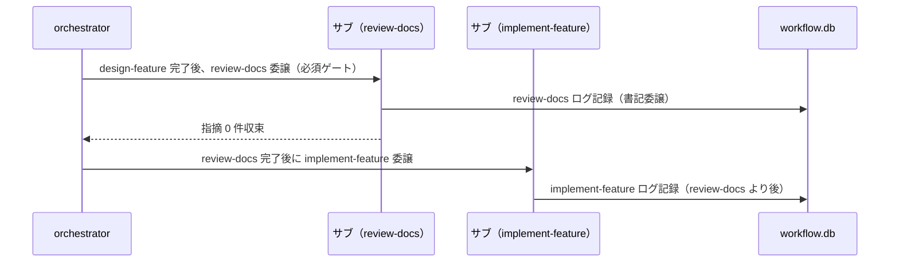

# 要件定義書: 実装前ドキュメントレビュー（review-docs）の全 issue 必須ゲート化

**プロジェクト名**: review-docs 必須化（design-feature 完了→implement-feature 着手の間の必須ゲート化）
**作成日**: 2026 年 07 月 11 日
**最終更新**: 2026 年 07 月 11 日

> **重要**: **このドキュメントは常に更新**: 要件の変更や追加があった場合は、即座にこのドキュメントを更新してください。ドキュメントは「生きているドキュメント」として扱い、実装内容と常に同期させます。
>
> **用語**: [.agent-skill-chain/source/CONCEPTS.md §用語規約](../../../../../../.agent-skill-chain/source/CONCEPTS.md#用語規約) を参照。

---

## 1. 概要

### 1.1 システム概要

本パッケージ（agent-skill-chain）は、システム開発に特化したエージェント運用基盤であり、workflow の各フェーズ（要求・要件・設計・実装計画・実装・レビュー）を command（skill chain）で実行する。実装前ドキュメントレビューの command [review-docs](../../../../../../.agent-skill-chain/source/commands/review-docs.md) は存在するが、[PHASE_COMMAND_MAP.md](../../../../../../.agent-skill-chain/source/workflow/PHASE_COMMAND_MAP.md) §補助手順（auxiliary）・[PHASES.md](../../../../../../.agent-skill-chain/source/workflow/PHASES.md) §レビュー成果物の配置ルール のとおり「phase→command 表に載らない補助手順（auxiliary）」であり、design-feature 完了→implement-feature 着手の間に自動実行される強制ゲートが存在しない。本 issue は、この実装前レビューを規模比例条件なしで全 issue に一律必須化し、enforcement で未実行を検知できるようにする。

### 1.2 用語集

| 用語 | 説明 |
| -------- | ------ |
| review-docs | 実装前の 00/01/02/03 に対するドキュメントレビュー command。レビュー＋修正を指摘 0 件まで反復し、memo 証跡＋書記委譲（write-workflow-log）で完了する。正本は commands/review-docs.md（本書で再定義しない） |
| auxiliary（補助手順） | 特定 phase に対応しない横断的な補助手順。現行の review-docs の位置づけ（PHASE_COMMAND_MAP §補助手順） |
| 必須ゲート | design-feature 完了後・implement-feature 着手前に、経由が省略できない工程として review-docs を通すこと |
| process / event | process＝実装着手前（設計完了直後）に行う事前レビュー＝review-docs。event＝実装完了後に行う事後レビュー＝verify-and-close。本 issue は前者をゲート化し後者を維持する |
| workflow_log | workflow.db の証跡テーブル。`review-docs` は既に許可 command 値（CHECK 制約・write-workflow-log.sh の ALLOWED_COMMANDS に含む。実物確認済み） |
| 規模比例 | 適用の重さを issue の規模・リスクに比例させる原則。本 issue では**適用しない**（ユーザー決定により全 issue 一律必須） |

---

## 2. 機能要件

### 2.1 ユーザーストーリー

#### ストーリー 1: 実装着手前の review-docs 必須ゲート化

- **As a** issue を進行する orchestrator（進行役）
- **I want to** design-feature（設計・実装計画）完了後・implement-feature（実装）委譲前に review-docs を必須で経ることが、workflow の規約に明文化されていること
- **So that** 実装着手前の設計欠陥を、担当者の自発性ではなくハーネスの規約として確実に是正できる

**受け入れ基準**:

- **AC-1**: `.agent-skill-chain/source/workflow/PHASE_COMMAND_MAP.md` に、design-feature 完了後・implement-feature 着手前に review-docs を必須で経る旨が明記されている（`grep -n "review-docs" .agent-skill-chain/source/workflow/PHASE_COMMAND_MAP.md` が該当行を返し、現行の「補助手順で表に載せない」注記と矛盾しない形で整合が取られている）。
- **AC-2**: `.agent-skill-chain/source/skills/agent/run_command.md` の Constraints に、design-feature 完了後・implement-feature 委譲前に review-docs を必須で委譲する旨が明記されている（`grep -n "review-docs" .agent-skill-chain/source/skills/agent/run_command.md` が該当行を返す）。
- **AC-3**: `.agent-skill-chain/source/commands/design-feature.md`（DoD または実行時の注意）から、次工程として実装着手前に review-docs が必須である旨が読み取れる（grep で確認可能）。
- **AC-4**: `.agent-skill-chain/source/commands/implement-feature.md`（実行時の注意）に、実装着手の前提として review-docs 完了が必要である旨が明記されている（grep で確認可能）。

#### ストーリー 2: auxiliary 扱いの見直しと整合

- **As a** 規約の保守者（および規約を読むサブエージェント）
- **I want to** review-docs が「auxiliary で表に載せない」とされている現行記述と、「実装着手前の必須ゲート」であることが矛盾しないよう整合されていること
- **So that** 「review-docs は表に無く phase から選べない／禁止対象」という誤読と、「必須ゲート」という新方針の齟齬が生じない

**受け入れ基準**:

- **AC-5**: `.agent-skill-chain/source/workflow/PHASES.md` §レビュー成果物の配置ルール（review-docs の auxiliary 記述）が、実装着手前の必須ゲートであることと矛盾しないよう更新されている（grep で確認可能）。
- **AC-6**: PHASE_COMMAND_MAP.md の「本表にない command の起動は禁止（phase からの選択経路に関する禁止）」と、review-docs を必須ゲートとして経ることとの整合が、いずれかのファイルで明示されている（補助手順の呼び出しは禁止対象外である旨と、必須ゲート化の両立が読み取れる）。

#### ストーリー 3: enforcement による未実行検知

- **As a** CI（audit.sh）／保守者
- **I want to** 「当該 issue に implement-feature ログが存在するのに review-docs ログが存在しない（＝実装前レビューを飛ばした）」パターンを機械検証可能な範囲で検知できること
- **So that** 規約の明文化だけでなく、実行漏れを push/merge 前に事後検知して差し戻せる

**受け入れ基準**:

- **AC-7**: `.agent-skill-chain/source/enforcement/README.md` の失敗条件一覧および「失敗条件 → 実装の所在 → 強制レベル 対応表」に、review-docs 未実行検知の新失敗条件（例: #31）が追加されている。
- **AC-8**: `.agent-skill-chain/source/enforcement/ci/audit.sh` に、当該検知を行うチェック関数が実装され、実行リストに登録されている（`grep` で関数定義と呼び出しの両方を確認できる）。
- **AC-9**: 当該チェックは **workflow.db 採用時のみ**動作し、DB 非採用時は SKIP する。既存 #29 と同型の安全側設計（前方一致・`close/` 配下除外・誤 FAIL を出さない）を踏襲する（設計の詳細は 02_設計で確定）。
- **AC-10**: 当該チェックは既存 #29（実装前 04 検知）とは検知対象が非交差であり、既存チェック（#3/#5/#9/#29 等）を弱めない（AC-13 と整合）。

#### ストーリー 4: 事前・事後レビューの役割分担の明文化

- **As a** レビューを実施するサブエージェント
- **I want to** 事前レビュー（review-docs＝process）と事後レビュー（verify-and-close＝event）の役割分担が接続先ドキュメントで一意に読み取れること
- **So that** 「実装前は memo 証跡・04 は作らない／実装後は 04_review.md を必須作成」という既存ルールと、必須ゲート化が二重定義なく両立する

**受け入れ基準**:

- **AC-11**: 事前（review-docs）と事後（verify-and-close）の役割分担が接続先ドキュメントで読み取れ、review-docs の Process/DoD の正本は review-docs.md、レビュー成果物の配置ルールの正本は PHASES.md のまま重複再定義されていない。
- **AC-12**: `create-pr-review-issue` の内部 step からの review-docs 呼び出し経路が壊れていない（既存の呼び出し記述が維持されている）。

#### ストーリー 5: 規模比例の免除を設けない一律必須

- **As a** ユーザー（意思決定者）
- **I want to** 軽量 issue であっても実装前レビューが免除されない（規模比例の条件付き適用を新設しない）こと
- **So that** ユーザー決定（全 issue 一律必須）が骨抜きにならない

**受け入れ基準**:

- **AC-13**: 変更後のドキュメント・enforcement に、review-docs を規模・リスクに応じて省略してよいとする免除条項が**新設されていない**（全 issue 一律必須が維持されている。grep で免除表現が存在しないことを確認できる）。
- **AC-14**: 過去の close 済み issue への遡及適用はしない（enforcement は `close/` 配下を検知対象外とし、既存 close 済み issue を誤 FAIL しない）。

### 2.2 BDD ユースケース

#### ユースケース 1: 設計完了後・実装着手前の必須ゲート

design-feature 完了後、implement-feature 着手前に review-docs を必須で経る。

**シナリオ 1: review-docs を経て実装へ進む正常系**

```gherkin
Feature: 実装着手前の review-docs 必須ゲート
  Scenario: design-feature 完了後に review-docs を経て implement-feature へ進む
    Given ある issue の 02_設計.md / 03_実装計画.md が design-feature で完成している
    When orchestrator が実装フェーズへ進もうとする
    Then 規約（PHASE_COMMAND_MAP / run_command / design-feature / implement-feature）に従い、implement-feature 委譲の前に review-docs を委譲し
    And review-docs が指摘 0 件まで反復・memo 証跡・書記委譲（write-workflow-log で review-docs ログ記録）を完了してから implement-feature を委譲する
```

**処理フロー**（必要に応じて）:



**シナリオ 2: review-docs を飛ばした場合の enforcement 検知**

```gherkin
Feature: 実装着手前の review-docs 必須ゲート
  Scenario: review-docs 未実行のまま implement-feature ログが記録された
    Given workflow.db を採用する環境で、ある in-progress issue に implement-feature ログが存在する
    And 当該 issue に review-docs ログが 1 件も存在しない
    When audit.sh が実行される
    Then 新失敗条件（review-docs 未実行検知）に該当し FAIL となり
    And 差し戻し先として「review-docs を実行してから implement-feature を再実行する」旨が案内される
```

#### ユースケース 2: auxiliary 扱いとの整合

**シナリオ 1: 補助手順の呼び出し禁止対象外と必須ゲートの両立**

```gherkin
Feature: auxiliary 扱いの見直しと整合
  Scenario: 「表にない command 起動禁止」と review-docs 必須ゲートの両立
    Given PHASE_COMMAND_MAP.md に「本表にない command の起動は禁止（phase からの選択経路に関する禁止）」がある
    When review-docs を実装着手前の必須ゲートとして経る
    Then 補助手順（別 command の step・依頼からの起動・必須ゲート）の呼び出しは当該禁止の対象外である旨が明示され
    And 「review-docs は表に無い／禁止対象」という誤読と必須ゲート化が矛盾しない
```

#### ユースケース 3: 事前・事後レビューの役割分担

**シナリオ 1: 実装前は memo・実装後は 04_review**

```gherkin
Feature: 事前・事後レビューの役割分担
  Scenario: review-docs（事前）と verify-and-close（事後）の非重複な両立
    Given ある issue で実装着手前に review-docs を実施し、memo に証跡を残した（04_review.md は作成しない）
    When 実装完了後に verify-and-close を実施する
    Then verify-and-close は 04_review.md を必須作成し（既存ルール維持）
    And review-docs（process）と verify-and-close（event）の役割分担が重複定義なく読み取れる
```

#### ユースケース 4: 規模比例の免除を設けない

**シナリオ 1: 軽量 issue でも実装前レビューは免除されない**

```gherkin
Feature: 規模比例の免除を設けない一律必須
  Scenario: 軽量 issue でも review-docs が必須ゲートとして働く
    Given 重要判断を含まない軽量 issue（例: 誤字修正・小規模整理）で design-feature（または設計相当）が完了している
    When 実装フェーズへ進もうとする
    Then 規模・リスクを理由に review-docs を省略する免除条項は存在せず
    And review-docs を必須で経る（ただし指摘が無ければ即 0 件収束するため過度な負荷にはならない）
```

### 2.3 ビジネスルール

- review-docs の Process/DoD の正本は commands/review-docs.md の 1 か所とする（本 issue で再定義しない）。レビュー成果物の配置ルールの正本は PHASES.md、phase→command の正本は PHASE_COMMAND_MAP.md、失敗条件の正本は enforcement/README.md とし、接続先は参照のみを書く。
- 実装前レビュー（review-docs＝process/事前）は、実装完了後レビュー（verify-and-close＝event/事後）を置き換えない。両者は二重の安全網として共存する（事前=review-docs、事後=verify-and-close）。
- 実装前レビューの正式証跡は memo（および review-docs の書記ログ）に残し、04_review.md は実装完了後の verify-and-close でのみ作成する（既存ルール維持。実装前に 04 を作ると #29 で FAIL）。
- enforcement の検知は workflow.db 採用時のみ機械検証可能とし、DB 非採用時は SKIP して規約・人手監査で担保する。誤 FAIL を出さない安全側設計を優先する。
- 規模比例による免除は設けない（全 issue 一律必須。ユーザー決定）。ただし review-docs の反復深度は指摘の実態に比例する。

---

## 3. 非機能要件

### 3.1 パフォーマンス要件

- 実装前レビューの追加により、review-docs の反復回数は review-docs 側の既定に従う。指摘が無い issue では即 0 件収束するため、ゲート追加自体が新たな重い調査を課さない。

### 3.2 セキュリティ要件

- 本 issue はドキュメント・enforcement の変更であり、高リスク操作の事前確認ルールを緩和しない（既存維持）。

### 3.3 ユーザビリティ要件

- 接続先の記述は、サブエージェント／orchestrator が command・規約ファイルを読んだ時点で「いつ（design-feature 完了後・implement-feature 着手前）・何を（review-docs）・どの条件で（一律必須）経るか」が一意に分かる具体性を持つこと（抽象的な訓示のみは不可）。

### 3.4 可用性要件

- workflow.db 非採用ランタイムでも規約（人手・AI 自律判断）で必須ゲートが機能し、enforcement の SKIP により誤 FAIL で作業が止まらないこと。

---

## 4. 外部インターフェース要件

### 4.1 API 要件

- 該当なし（本 issue は command / skill / 規約 / enforcement スクリプトの変更であり、外部 API は提供しない）。

### 4.2 データ形式要件

- enforcement の検知は既存の workflow_log スキーマ（`command` 列の許可値に `review-docs` を含む）をそのまま用い、新規カラム・新規スキーマを導入しない（既定義の範囲で判定する）。

---

## 5. 制約事項

- 「必須ゲート」を workflow の phase→command 表にどう表現するか（auxiliary 扱いの見直し／新サブフェーズ追加／design-feature の Next Phase への接続のいずれか）と、enforcement の具体的な検知アルゴリズム（前方一致・順序判定の粒度）は 02_設計フェーズで確定する（本書では AC として論点の存在と検証方法のみ定める）。
- 1 ファイル 1 責務・重複禁止。既存の正本（review-docs.md / PHASES.md / PHASE_COMMAND_MAP.md / enforcement/README.md）を崩さない。
- `create-pr-review-issue` の内部 step からの review-docs 呼び出し経路・verify-and-close の事後レビュー・既存 audit チェック（#3/#5/#9/#29 等）を弱めない。
- 過去の close 済み issue への遡及適用はしない。implement-feature の Process 自体は変更しない（ゲート追加のみ）。
- 本リポジトリでの成果物配置は [.agent-skill-chain/project/自己拡張ワークフロー.md](../../../../../../.agent-skill-chain/project/自己拡張ワークフロー.md) の上書き定義に従う。

---

## 6. 参考資料

### プロジェクトドキュメント

- [`00_要求定義.md`](./00_要求定義.md) - 要求定義

### その他の参考資料

- [.agent-skill-chain/source/commands/review-docs.md](../../../../../../.agent-skill-chain/source/commands/review-docs.md) — 実装前ドキュメントレビュー command の正本
- [.agent-skill-chain/source/workflow/PHASES.md](../../../../../../.agent-skill-chain/source/workflow/PHASES.md) §レビュー成果物の配置ルール（review-docs の auxiliary 記述 :65）
- [.agent-skill-chain/source/workflow/PHASE_COMMAND_MAP.md](../../../../../../.agent-skill-chain/source/workflow/PHASE_COMMAND_MAP.md) §補助手順（auxiliary）（:25）
- [.agent-skill-chain/source/skills/agent/run_command.md](../../../../../../.agent-skill-chain/source/skills/agent/run_command.md) §Constraints（実装前のドキュメントレビュー）
- [.agent-skill-chain/source/commands/design-feature.md](../../../../../../.agent-skill-chain/source/commands/design-feature.md)・[.agent-skill-chain/source/commands/implement-feature.md](../../../../../../.agent-skill-chain/source/commands/implement-feature.md)・[.agent-skill-chain/source/commands/verify-and-close.md](../../../../../../.agent-skill-chain/source/commands/verify-and-close.md)
- [.agent-skill-chain/source/enforcement/README.md](../../../../../../.agent-skill-chain/source/enforcement/README.md) §失敗条件と差し戻し・[.agent-skill-chain/source/enforcement/ci/audit.sh](../../../../../../.agent-skill-chain/source/enforcement/ci/audit.sh)（:801 check_review_before_implement は「実装前 04 検知」＝review-docs 実行検知ではない）
- 同種の前例: サブ issue [`フィジビリティADR必須化`](../20260711_055538_フィジビリティADR必須化/00_要求定義.md)（上流フェーズへの義務接続＋evidence パターン）

---

## 7. 前のステップ

この要件定義書は、以下のドキュメントを基に作成されています：

- **前**: [`00_要求定義.md`](./00_要求定義.md) - 要求定義フェーズ

---

## 8. 次のステップ

この要件定義書の承認後、以下のドキュメントを作成します：

- **次**: [`02_設計.md`](./02_設計.md) - 設計フェーズ
