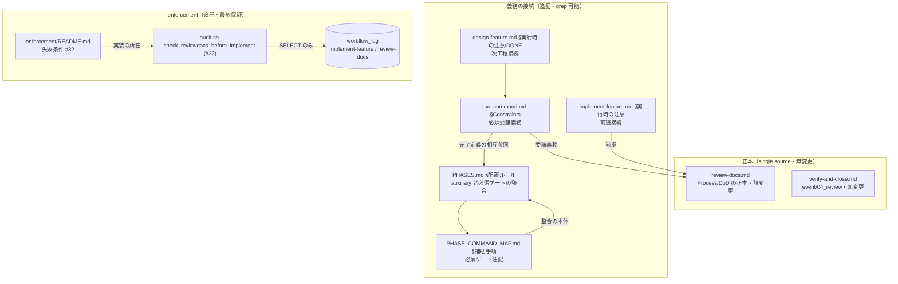
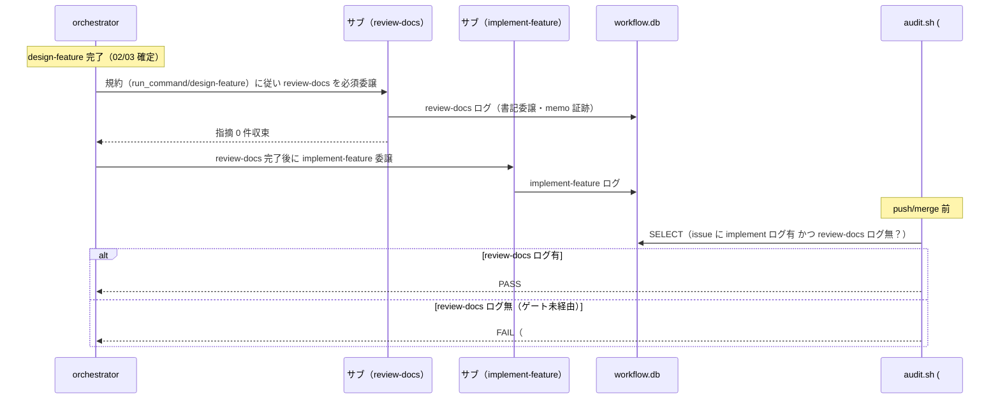
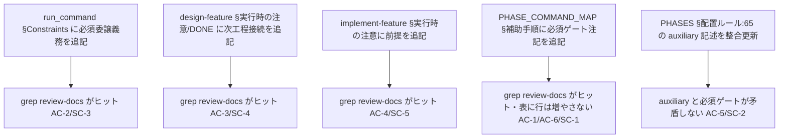
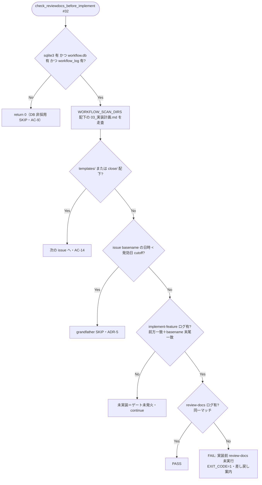

# 設計書: 実装前ドキュメントレビュー（review-docs）の全 issue 必須ゲート化

**プロジェクト名**: review-docs 必須化（design-feature 完了→implement-feature 着手の間の必須ゲート化）
**作成日**: 2026 年 07 月 11 日
**最終更新**: 2026 年 07 月 11 日

> **重要**: **このドキュメントは常に更新**: 設計の変更や追加があった場合は、即座にこのドキュメントを更新してください。ドキュメントは「生きているドキュメント」として扱い、実装内容と常に同期させます。
>
> **用語**: [.agent-skill-chain/source/CONCEPTS.md §用語規約](../../../../../../.agent-skill-chain/source/CONCEPTS.md#用語規約) を参照。

---

## 1. 設計概要

**必須**: 設計方針・原則は [.agent-skill-chain/source/spec/01\_設計原則.md](../../../../../../.agent-skill-chain/source/spec/01_設計原則.md) を**先に参照**した上で、本プロジェクトに**適用するものを選び**記載する。

### 1.1 設計方針

本 issue は新しいコード・サービスを作らない。**既存の review-docs command（正本＝[commands/review-docs.md](../../../../../../.agent-skill-chain/source/commands/review-docs.md)）を、design-feature 完了→implement-feature 着手の間の「必須ゲート」として規約に接続し、その未実行を CI（audit.sh）で機械検知する**、ドキュメント・ポリシー ＋ 1 チェック追加の設計である。review-docs の Process/DoD は変更せず、**呼び出す義務（ゲート）と未実行検知（enforcement）を追加**する。正本を 1 か所ずつに固定し（役割分担＝PHASES、phase→command＝PHASE_COMMAND_MAP、委譲義務＝run_command、失敗条件＝enforcement/README、実装＝audit.sh）、接続先には参照 1 行で結線する（1 ファイル 1 責務・正本一元化）。

前例は姉妹サブ issue [`フィジビリティADR必須化` §2.5 ADR-1](../20260711_055538_フィジビリティADR必須化/02_設計.md)（「新設ポリシー正本 + 既存への参照追記」）だが、本 issue は正本を新設せず**既存正本（review-docs.md）を参照結線する**点と、除外要件でなく **enforcement 検知を新設する**点が異なる。

### 1.2 設計原則（本プロジェクトで適用するもの）

- **単一責務**: 「必須ゲートの義務」「役割分担」「phase→command 上の位置づけ」「未実行検知の失敗条件」「検知の実装」をそれぞれ既存の単一正本（run_command / PHASES / PHASE_COMMAND_MAP / enforcement/README / audit.sh）に閉じ、review-docs.md の Process/DoD は侵さない（参照のみ）。
- **明確な境界**: 事前レビュー（review-docs＝process）と事後レビュー（verify-and-close＝event/04_review）を三たび混同させない。既存の「実装前は memo・実装後は 04」ルール（PHASES §レビュー成果物の配置ルール）を壊さない。
- **UNIX 哲学（組み合わせ可能・1 つのことをうまくやる）**: enforcement 検知は既存 #29（実装前 04）と同型の小さな関数を 1 つ追加し、既存チェックを一切弱めない（非交差・加算のみ）。
- **AIフレンドリー設計**: [01\_設計原則 §AIフレンドリー設計](../../../../../../.agent-skill-chain/source/spec/01_設計原則.md#aiフレンドリー設計)（小さなファイル・明確な責務・意図が分かる命名）に従い、接続点は grep 可能な参照行に限定し、検知関数は既存 `check_review_before_implement` の様式を踏襲して読みやすさを保つ。

> **AIフレンドリー設計**: 本設計は「正本 1 か所・参照結線」と「既存関数様式の踏襲」を徹底し、[01\_設計原則 §AIフレンドリー設計](../../../../../../.agent-skill-chain/source/spec/01_設計原則.md#aiフレンドリー設計) の「小さなファイル・明確な責務・深すぎないディレクトリ構造」を満たす。

---

## 2. アーキテクチャ設計

### 2.1 責務・境界・参照関係

[01\_設計原則 §明確な境界・§単一責務](../../../../../../.agent-skill-chain/source/spec/01_設計原則.md) に従い、コンポーネント（ここでは規約・ポリシー・command・enforcement の各ファイル）の責務・境界・参照関係を明示する。

#### 2.1.1 責務一覧

| コンポーネント | 変更種別 | 責務（1 文） |
| -------------- | -------- | ------------ |
| `commands/review-docs.md`（既存・**無変更**） | 無変更 | 実装前ドキュメントレビュー（00/01/02/03 のレビュー＋修正反復＋memo＋書記）の Process/DoD の**唯一の正本**。本 issue で変更しない（AC-11）。 |
| `skills/agent/run_command.md` §Constraints（既存・**追記**） | 追記 | 委譲義務の正本。design-feature 完了後・implement-feature 委譲前に review-docs を**必須で委譲する**義務行を、既存「worker 完了後は必ず verify-and-close」と同型に 1 項追加する（AC-2/SC-3）。 |
| `commands/design-feature.md` §実行時の注意・DONE（既存・**追記**） | 追記 | 次工程接続の正本。「本 command 完了後、implement-feature 着手前に review-docs を必須で経る（委譲する）」旨を実行時の注意と DoD に接続する（AC-3/SC-4）。 |
| `commands/implement-feature.md` §実行時の注意（既存・**追記**） | 追記 | 実装着手の前提として「同一 issue の review-docs 完了」を要する旨を接続する（AC-4/SC-5）。 |
| `workflow/PHASE_COMMAND_MAP.md` §補助手順（auxiliary）（既存・**追記**） | 追記 | phase→command の正本。review-docs は**表に行を持たない補助手順のまま**、design（設計・実装計画）完了と実装着手の**間の必須ゲート**であることを注記で明示し「本表にない command 起動禁止」と両立させる（AC-1/AC-6/SC-1）。 |
| `workflow/PHASES.md` §レビュー成果物の配置ルール（:65）（既存・**追記**） | 追記 | レビュー成果物の配置・役割分担の正本。review-docs の auxiliary 記述を「auxiliary（＝phase 選択対象外）だが実装着手前の必須ゲート」であることと矛盾しないよう更新する（AC-5/SC-2）。 |
| `enforcement/README.md` §失敗条件（既存・**追記**） | 追記 | 失敗条件の正本。**新失敗条件 #32（実装前 review-docs 未実行）**を、必須チェック列挙・対応表・判定ルール一覧・差し戻し先に追加する（AC-7/SC-6）。 |
| `enforcement/ci/audit.sh`（既存・**追記**） | 追記 | 検知の実装。新関数 `check_reviewdocs_before_implement`（#32）を追加し実行リストに登録する。#29 と非交差・安全側（AC-8/AC-9/AC-10/SC-6）。 |
| `test/test-audit.sh`（既存・**追記**） | 追記 | #32 の回帰テスト（正常系 pass・違反系 FAIL・grandfather SKIP・close SKIP・DB 非採用 SKIP）を追加する（BDD 検証）。 |
| `commands/verify-and-close.md`・`commands/create-pr-review-issue.md`（既存・**無変更**） | 無変更 | 事後レビュー（04_review）と PR 指摘対応起票（内部で review-docs を呼ぶ）を担う。本 issue で壊さない（AC-12・SC-7）。 |

#### 2.1.2 境界

- **入力**: design-feature を完了した issue（02/03 が存在）、および workflow.db の workflow_log（`command` 列に `implement-feature` / `review-docs` を含む既存スキーマ）。
- **出力**: (1) 「実装着手前に review-docs を必須で経る」ことが grep 可能に明文化された規約群、(2) 「implement-feature ログはあるが review-docs ログが無い」を FAIL する audit チェック。
- **他責務との境界**（本 issue の**範囲外**）:
  - review-docs の Process/DoD（レビュー観点・反復・memo・書記）の再定義 → review-docs.md の責務。本 issue は参照のみ（00 §5・01 §5）。
  - 事後レビュー（verify-and-close＝event/04_review）の再設計・強化 → verify-and-close.md の責務（除外要件）。
  - implement-feature の Process（implement-change / refactor-safely）自体の変更 → 範囲外（ゲート追加のみ）。
  - runtime hook（PreToolUse 等）による実行時物理ブロックの新設 → 必須範囲外（00 §5。最終保証は CI audit）。§2.5 ADR-4 で不採用を確定する。
  - review-docs の strict な**時刻順序**（review-docs が implement より前か）の厳密監査 → 誤 FAIL 回避のため**採らない**（§2.5 ADR-3。存在監査のみ）。

#### 2.1.3 参照関係

依存の向き（呼び出し元 → 参照先）を 1 行ずつ示す。循環は持たない。

- `run_command.md` §Constraints → `review-docs.md`（委譲義務の接続先）／`PHASES.md` §レビュー成果物の配置ルール（完了定義の相互参照）
- `design-feature.md` §実行時の注意・DONE → `run_command.md`（委譲義務）／`review-docs.md`（次工程）
- `implement-feature.md` §実行時の注意 → `review-docs.md`（前提）
- `PHASE_COMMAND_MAP.md` §補助手順 → `PHASES.md` §レビュー成果物の配置ルール（整合の本体）／`review-docs.md`
- `PHASES.md` §レビュー成果物の配置ルール → `PHASE_COMMAND_MAP.md` §補助手順（相互整合）／`run_command.md`
- `enforcement/README.md` §失敗条件 → `audit.sh`（#32 実装の所在）
- `audit.sh` `check_reviewdocs_before_implement` → workflow_log（`implement-feature` / `review-docs` 行の存在）

> 参照はすべて既存正本へ向かう一方向であり、review-docs.md（Process/DoD 正本）を新しい葉ノードとして扱う。review-docs.md は本 issue で追記しないため、循環（review-docs.md → 接続先）は生じない。

### 2.2 システムアーキテクチャ

**必須**: 設計判断は [.agent-skill-chain/source/spec/](../../../../../../.agent-skill-chain/source/spec/)（[00_spec概要.md](../../../../../../.agent-skill-chain/source/spec/00_spec概要.md)、[01\_設計原則.md](../../../../../../.agent-skill-chain/source/spec/01_設計原則.md)、[06\_設計判断の優先順位.md](../../../../../../.agent-skill-chain/source/spec/06_設計判断の優先順位.md)）を**先に**参照する。

- **採用パターン**: **既存正本への義務接続 ＋ 事後 CI 検知（obligation wiring + post-hoc CI detection）**。既存の command 実行契約（run_command / design-feature / implement-feature / PHASES / PHASE_COMMAND_MAP）に「必須ゲート」の義務を参照結線し、規約だけでは形骸化しうる部分を audit.sh の事後検知（最終保証）で締める。これは enforcement の基本思想「規約（advisory）＋ CI（最終保証）」（[enforcement/README.md](../../../../../../.agent-skill-chain/source/enforcement/README.md) §強制の 4 層）と同型である。
- **根拠**: [06\_設計判断の優先順位.md](../../../../../../.agent-skill-chain/source/spec/06_設計判断の優先順位.md) の「単一責務」「仕様との整合性」「変更容易性」に従い、既存の役割分担（事前=review-docs / 事後=verify-and-close）と正本配置を崩さず、最小の追加（義務行＋1 検知関数）で必須化を実現する。

#### 2.2.1 CQRS（Command/Query 分離）

- 本 issue はドキュメント・ポリシー変更 ＋ read-only な audit チェックであり、状態変更 API を持たない。audit.sh の #32 は workflow_log への **Query（SELECT）のみ**で、DB を変更しない（既存 audit 全チェックと同じ read-only 監査）。CQRS の新規適用は**該当なし**。

#### 2.2.2 アーキテクチャ図（本プロジェクトの構成で記載）

### 2.3 コンポーネント構成

**境界・単一責務**: 明確な境界（義務の接続 / 検知の実装 / 正本の無変更）を保ち、各ファイルは単一責務を満たす。

- **義務の接続（追記のみ・5 ファイル）**: `run_command.md`・`design-feature.md`・`implement-feature.md`・`PHASE_COMMAND_MAP.md`・`PHASES.md` に、必須ゲートの義務・整合注記を参照 1〜数行ずつ追加する。正本（review-docs.md）を複製しない。
- **検知の実装（追記のみ・2 ＋ 1 ファイル）**: `enforcement/README.md`（失敗条件 #32 の宣言）＋ `audit.sh`（`check_reviewdocs_before_implement` 実装・登録）＋ `test/test-audit.sh`（回帰テスト）。
- **無変更（3 ファイル）**: `review-docs.md`・`verify-and-close.md`・`create-pr-review-issue.md`。呼び出し経路・役割分担を壊さない。

### 2.4 データフロー

**イベント駆動**: 本 issue は「起きた事実」を表すシステムイベント（UserCreated 等）を発行しない。ここでの「フロー」はゲート運用（規約）と検知（CI）の 2 系統である（該当イベント: なし）。

### 2.5 横断設計判断（ADR）: 本 issue の主要設計判断

本節は、本 issue の**実現方式そのものを ADR 形式で記録**する（形式は [EVIDENCE_POLICY.md](../../../../../../.agent-skill-chain/source/EVIDENCE_POLICY.md) の ADR 形式＝コンテキスト・検討した選択肢・決定・根拠[evidence_source 付き]・帰結）。前例は親 issue [`02_設計.md` §2.5](../../02_設計.md) および姉妹 issue [`フィジビリティADR必須化` §2.5](../20260711_055538_フィジビリティADR必須化/02_設計.md)。

#### ADR-1: review-docs を phase→command 表に「行追加」せず、フェーズ間の「必須ゲート」として義務接続する

- **コンテキスト**: review-docs を design（設計・実装計画）完了と実装着手の間に必須化するとき、その位置づけを phase→command 表にどう表現するかが 01（AC-1・§5）で保留されていた。選択肢は「PHASE_COMMAND_MAP に正式行を追加」「auxiliary のまま義務接続」「新サブフェーズ追加」。
- **検討した選択肢**:
  - **(A) PHASE_COMMAND_MAP に review-docs の phase 行を追加**する。
  - **(B) auxiliary（phase 選択対象外）のまま維持し、design-feature 完了→implement-feature 着手の「間の必須ゲート」として run_command / design-feature / implement-feature の義務行で接続**する（＝既存「worker 完了後は必ず verify-and-close を指示」と同型のパターン）。
  - **(C) 「実装前レビュー」という新サブフェーズを PHASES に新設**する。
- **決定**: **(B) を採用**する。
- **根拠**:
  - review-docs は特定 phase の成果物（00/01/02/03/04）を生む工程ではなく、**2 つの phase の遷移を縛るゲート**である。phase→command 表は「phase を判定したら決定的に command を選ぶ」ための表（[PHASE_COMMAND_MAP.md](../../../../../../.agent-skill-chain/source/workflow/PHASE_COMMAND_MAP.md) 冒頭。evidence_source: existing_code）であり、「review-docs phase」は存在しないため (A) は表の意味論に馴染まない。また (A) は既存注記「本表にない command 起動禁止は phase 選択経路の禁止／補助手順の呼び出しは対象外」（同 :25/:39。evidence_source: existing_code）と整合させる追加編集を要し、かえって二重管理になる。
  - 既存に**同型の前例がある**: 「worker（監査・書記以外）完了後は必ず verify-and-close を指示」という義務は phase 行ではなく [CORE.md](../../../../../../.agent-skill-chain/source/boot/CORE.md) §メインとサブの役割・[run_command.md](../../../../../../.agent-skill-chain/source/skills/agent/run_command.md) §Constraints（:46）に置かれている（evidence_source: existing_code）。review-docs の必須ゲートも同じ場所・同じ表現様式で接続すれば、既存の読者モデルに乗る。
  - (C) は新フェーズ増設によりテンプレート・成果物モデル（00〜04）に影響し、review-docs が 04 を作らない（memo のみ）という既存ルールと衝突しやすい。過剰。
- **帰結**: 実装対象は「run_command / design-feature / implement-feature への義務行追記」＋「PHASE_COMMAND_MAP / PHASES の auxiliary 注記の整合更新」に確定する。review-docs は**表に行を持たない**まま（SC-8: 規模比例の免除条項を新設しない一律必須を、表構造ではなく義務文で表現）。AC-1 は「PHASE_COMMAND_MAP §補助手順に必須ゲートの明文がある（grep 可能）」で満たす（行追加ではなく注記追記）。

#### ADR-2: enforcement 検知は既存 #29 と同型・非交差の新失敗条件 #32 として追加する

- **コンテキスト**: 「implement-feature ログはあるが review-docs ログが無い（＝実装前レビューを飛ばした）」を CI で検知する必要がある（01 ストーリー3・AC-7/AC-8）。既存 #29 `check_review_before_implement`（[audit.sh:805](../../../../../../.agent-skill-chain/source/enforcement/ci/audit.sh)）は「implement/verify ログ 0 件なのに 04_review.md が存在＝実装前 04 の誤作成」を検知する別物である（実物確認済み。evidence_source: existing_code）。
- **検討した選択肢**: (A) #29 を拡張して両方向を 1 関数で判定する、(B) 新関数 `check_reviewdocs_before_implement`（#32）を #29 と同じ様式（filesystem 走査＋前方一致＋close/templates 除外＋DB 非採用 SKIP）で追加する。
- **決定**: **(B) を採用**する。
- **根拠**:
  - **非交差の証明**: #29 の発火条件は「implement/verify ログ**0 件** ∧ 04 存在」。#32 の発火条件は「implement-feature ログ**1 件以上** ∧ review-docs ログ 0 件」。両者は implement ログ件数（0 件 vs 1 件以上）で**排他**であり、同時に FAIL しない（AC-10。evidence_source: existing_code。#29 の SQL・条件を確認）。1 関数統合（A）は排他な 2 条件を 1 箇所に混載し単一責務（[06_設計判断の優先順位](../../../../../../.agent-skill-chain/source/spec/06_設計判断の優先順位.md)）を損なう。
  - #29 は既に「前方一致＋basename 末尾一致で 1 件でも拾えれば pass」「close/ 配下除外」「DB 不採用 SKIP」という**誤 FAIL を出さない安全側設計**を実装済み（evidence_source: existing_code。audit.sh:803-831 を確認）。#32 が同関数様式を踏襲すれば、レビュー・保守コストが最小になり誤 FAIL リスクも既知範囲に収まる（AC-9）。
- **帰結**: audit.sh に #32 の新関数を #29 直後（#31 の後の登録列）に追加し、既存チェックを一切変更しない（加算のみ）。enforcement/README.md の必須チェック列挙・対応表・判定ルール一覧・差し戻し先に #32 を追加する。

#### ADR-3: 検知は「存在監査」に限定し、review-docs と implement の厳密な時刻順序は監査しない

- **コンテキスト**: 理想は「review-docs が implement-feature より**時間的に前**」を検証することだが、workflow_log の `ts_utc` は環境時計・同秒・書記委譲遅延の影響を受ける。厳密順序監査は偽陽性（正しく前にレビューしたのに ts の逆転で FAIL）を招きうる。
- **検討した選択肢**: (A) `ts_utc` で review-docs < implement を厳密判定する、(B) 同一 issue に review-docs ログが**存在する**ことのみを判定する（順序は問わない）。
- **決定**: **(B) を採用**する（存在監査のみ）。
- **根拠**: enforcement の安全側思想（[enforcement/README.md](../../../../../../.agent-skill-chain/source/enforcement/README.md) §「誤 FAIL を絶対に出さない」・#29 の設計。evidence_source: existing_code）に従い、偽陰性（順序を偽装した見逃し）を許容してでも偽陽性を出さない。実運用上、同一 issue に review-docs ログが存在すれば「実装前レビューを完全に飛ばした」重大逸脱は捕捉でき、目的（00 §1.3 効果 2「機械検証可能な範囲で検知」）に十分である。
- **帰結**: #32 の SQL は `command='review-docs'` 行の存在有無のみを見る。ts 比較は行わない。この限界（順序偽装は検知不能）を enforcement/README.md の #32 説明に**正直に明記**する（過大な保証を主張しない）。

#### ADR-4: runtime hook（PreToolUse 等）による実装着手の物理ブロックは新設しない

- **コンテキスト**: 「review-docs 未完了なら implement-feature の委譲を物理的に止める」runtime hook が考えられるが、00 §5 で必須範囲外とされている。
- **検討した選択肢**: (A) SubagentStop / PreToolUse で implement 着手を block する hook を新設、(B) 新設せず、規約（advisory）＋ CI audit（最終保証）の二段で担保する。
- **決定**: **(B) を採用**する。
- **根拠**: 「同一 issue で review-docs 済みか」を hook が知るには workflow_log 突合が要り、hook 入力に issue との一意キーが渡らない前提（[enforcement/README.md](../../../../../../.agent-skill-chain/source/enforcement/README.md) §系統E。evidence_source: existing_code）では高信頼判定が難しく fail-open にせざるを得ない。既存の系統A/C/E と同様、hook 実体は将来課題とし、本 issue は CI 最終保証に閉じる（費用対効果・00 §5 と整合）。
- **帰結**: 本 issue の DoD に hook 実装を含めない。enforcement/README.md には「最終保証は CI audit（#32）」と記す。

#### ADR-5: 既存 issue（in-progress 含む）への遡及適用を、issue ディレクトリ名の発効日カットオフで防ぐ

- **コンテキスト**: 本リポの workflow.db には、本ルール以前（2026-06〜）に作られた issue の implement-feature ログが多数存在する（実測: `docs/maintainer/workflow/20260614_*` 等に implement-feature 記録あり。evidence_source: observed_runtime。sqlite3 で確認）。#32 を素朴に導入すると、それら**既存 in-progress issue で review-docs ログを欠くもの**が新たに FAIL し、自リポ CI が即座に壊れる（遡及適用の偽陽性）。close/ 除外だけでは in-progress の既存 issue を救えない。
- **検討した選択肢**:
  - **(A) close/ 除外のみ**（既存 #29 と同じ）。→ in-progress の既存 issue を救えず自リポ CI が壊れる。
  - **(B) 発効日カットオフ**: issue ディレクトリ名の `YYYYMMDD_HHMMSS_` プレフィックスを parse し、`REVIEWDOCS_GATE_EFFECTIVE_FROM`（既定値・env 上書き可）より**前**に作成された issue は #32 の対象外（SKIP）とする。
  - **(C) per-issue のオプトインマーカー**（issue 内に「gate 対象」フラグファイル）。→ 全新規 issue に追加作業を課し形骸化・煩雑。
- **決定**: **(B) を採用**する。既定 `REVIEWDOCS_GATE_EFFECTIVE_FROM=20260712_000000`（本ルール ship 日＝2026-07-11 の翌日 0 時 JST 相当の文字列）とし、env で上書き可能にする。
- **根拠**:
  - issue ディレクトリ名は規約上必ず `YYYYMMDD_HHMMSS_`（JST）プレフィックスを持つ（[run_command.md §issue フォルダ作成時](../../../../../../.agent-skill-chain/source/skills/agent/run_command.md)。evidence_source: existing_code）。よってディレクトリ名だけで作成時期が決定的に判定でき、DB の ts に依存しない頑健な grandfather になる。ゼロ埋め固定長のため文字列比較で日時順序が正しく求まる。
  - 既定を ship 日翌日に置くことで、2026-07-11 作成の全 issue（本サブ issue・親・姉妹サブ issue 群）を一括 grandfather し、**2026-07-12 以降に新規作成される issue から前向きに強制**する。これにより自リポ CI の即時破壊を回避しつつ、目的（今後の全 issue で必須）を満たす。env 上書きで消費者・将来の運用が発効日を調整できる。
  - 本 issue 自身の実装（enforcement 追加）が #32 で自らを FAIL させる自己参照を避けられる（grandfather 対象）。規約上は本 issue も review-docs 必須だが、CI の遡及 FAIL は出さない（安全側）。
- **帰結**: #32 の走査ループに「issue basename の日時プレフィックスが cutoff 未満なら continue」を入れる。cutoff は関数内定数（env 上書き可）とし、enforcement/README.md の #32 説明と audit.sh コメントに「発効日前は SKIP＝遡及適用しない」ことを明記する（AC-14 の close 除外に加え、in-progress 既存 issue も救済）。**SC-8 との両立**: これは「規模・リスクに応じた免除」ではなく「発効日前の既存 issue の遡及除外」であり、規模比例の免除条項ではない（一律必須は維持）。

---

## 3. 機能設計

### 3.1 機能 1: 必須ゲートの義務接続（規約 5 ファイルの追記）

#### 3.1.1 概要

design→implement の間に review-docs を必須で経る義務を、既存正本へ参照結線する。review-docs.md の本文は複製しない。

#### 3.1.2 処理フロー（追記箇所と grep 検証点）

#### 3.1.3 入力・出力

- **入力**: 既存の各正本ファイル。
- **出力（各接続行の要旨。文言は実装時に確定。正本の複製をしない参照表現に限定）**:
  - `run_command.md` §Constraints（新規 1 項。既存 :46「worker 完了後は必ず verify-and-close」と :53「実装前のドキュメントレビュー」の近傍）: 「**design-feature（設計・実装計画）完了後・implement-feature 委譲前に、当該 issue について review-docs を必須で委譲すること**（全 issue 一律・規模比例の免除なし）。完了定義は [PHASES §レビュー成果物の配置ルール](../../../../../../.agent-skill-chain/source/workflow/PHASES.md) に従う（memo＋反復＋書記）。未実行は enforcement #32 で FAIL」。`review-docs` の語を含む（AC-2 の grep 検証）。
  - `design-feature.md` §実行時の注意 ＋ §DONE: 「本 command 完了後、**実装着手前に review-docs を必須で経る（orchestrator は implement-feature 委譲前に review-docs を委譲する）**。DoD に『次工程＝実装着手前 review-docs が必須』を明記」。`review-docs` の語を含む（AC-3）。
  - `implement-feature.md` §実行時の注意: 「**実装着手の前提として、同一 issue の review-docs（実装前ドキュメントレビュー）が完了していること**。未完了なら先に review-docs を委譲する。未実行のまま implement-feature ログが残ると enforcement #32 で FAIL」。`review-docs` の語を含む（AC-4）。
  - `PHASE_COMMAND_MAP.md` §補助手順（auxiliary）ブロック（既存注記の末尾に追記）: 「review-docs は**本表に行を持たない補助手順のまま**だが、design（設計・実装計画）完了と実装着手の**間の必須ゲート**である（全 issue 一律）。『本表にない command 起動禁止』は phase 選択経路の禁止であり、**必須ゲートとしての呼び出しは対象外**。義務の正本は run_command §Constraints、整合の本体は PHASES §レビュー成果物の配置ルール」。`review-docs` の語を含む（AC-1/AC-6）。
  - `PHASES.md` §レビュー成果物の配置ルール :65（既存の auxiliary 文を更新）: 「review-docs は補助手順（auxiliary＝phase→command 表の選択対象外）である。**ただし design 完了→実装着手の間の必須ゲートであり**、全 issue で一律に経る（義務の正本は run_command §Constraints、未実行検知は enforcement #32）。auxiliary は『phase から選べない』の意であり『任意・省略可』の意ではない」。

#### 3.1.4 エラーハンドリング

- 追記は既存の見出し構造・skill chain 順序・成果物モデル（00〜04）を変更しない。正本（review-docs.md）の Process/DoD 文言を複製した場合は AC-11/SC-7 違反となるため、接続行は必ず「参照」表現に限定する。役割分担（事前=review-docs／事後=verify-and-close）と「実装前は memo・04 は実装後のみ」ルール（既存 #29）と矛盾する表現を書かない。

### 3.2 機能 2: enforcement による未実行検知（#32）

#### 3.2.1 概要

「同一 issue に implement-feature ログがあるのに review-docs ログが無い」を audit.sh で FAIL する。#29 と非交差・安全側。

#### 3.2.2 処理フロー

#### 3.2.3 入力・出力（関数仕様）

- **関数名**: `check_reviewdocs_before_implement`（#32）。既存 `check_review_before_implement`（#29・audit.sh:805）の様式を踏襲。
- **走査基点**: 既存 `WORKFLOW_SCAN_DIRS` 配列（既定 `.workflow` ＋ `docs/maintainer/workflow`。env `WORKFLOW_DIRS` で置換可。既存挙動を流用）。
- **走査対象**: 各 scan dir 配下の `03_実装計画.md`（design/plan 完了＝ゲート適用対象の目印）を `find "$PROJECT_ROOT/$_wfd" -name "03_実装計画.md" -type f -print0` で**深さ制限を付けず**列挙する（既存 #29 の `04_review.md` 走査と同じ unbounded find 様式を踏襲。ADR-2）。**深さ制限（`-maxdepth` 等）を付けない理由**: 本リポの issue の多くは `90_issues//`（scan dir から深さ 4）に置かれる**サブ issue**であり、`-maxdepth 3` 等では 90_issues 配下のサブ issue の 03 を取りこぼしてゲートが全く発火しない（実測: 本リポの `03_実装計画.md` 32 件中 11 件がサブ issue で深さ 4。本サブ issue 自身も該当）。ADR-5 の grandfather は**サブ issue 自身の日時プレフィックス**で判定し発効日以降の新規サブ issue を前向きに強制する設計であるため、走査もサブ issue（深さ 4 以上）を確実に含める必要がある。除外は §SKIP/除外ガードの `templates/`・`close/`・発効日 cutoff で行う（深さではなく内容で除外する）。
- **SKIP/除外ガード**（誤 FAIL を出さない・AC-9）:
  1. `sqlite3` 不在／`workflow.db` 不在／`workflow_log` テーブル不在 → `return 0`。
  2. パスに `/templates/` または `/close/` を含む → `continue`（既存 #29 と同型・AC-14）。
  3. issue ディレクトリ basename が `^[0-9]{8}_[0-9]{6}_` にマッチし、その `YYYYMMDD_HHMMSS` が `REVIEWDOCS_GATE_EFFECTIVE_FROM`（既定 `20260712_000000`・env 上書き可）**未満** → `continue`（ADR-5・遡及回避）。
  4. `WORKFLOW_SCAN_DIRS` が空 → `return 0`。
- **判定ロジック**（安全側・前方一致）:
  - `dir`＝issue ディレクトリの PROJECT_ROOT 相対パス、`base`＝basename。SQL 単一引用符は `''` にエスケープ（既存関数と同じ `${v//\'/\'\'}`）。
  - `hit_impl`＝`SELECT 1 FROM workflow_log WHERE command='implement-feature' AND (issue_path='<dir>' OR issue_path='<dir>/' OR issue_path LIKE '<dir>/%' OR issue_path LIKE '%/<base>' OR issue_path LIKE '%/<base>/%') LIMIT 1;`。空なら未実装 → `continue`。
  - `hit_rd`＝上と同じ WHERE で `command='review-docs'`。空なら **FAIL**（`echo "FAIL: 実装前 review-docs 未実行（implement-feature ログはあるが review-docs ログが 0 件）: <dir>"`、`echo "$ROLLBACK_MSG"`、`EXIT_CODE=1`）。
- **登録**: 既存の登録列（audit.sh 末尾 `check_review_before_implement` / `check_docs_review_evidence` の後）に `check_reviewdocs_before_implement` を 1 行追加。
- **出力**: FAIL 時に stderr へ FAIL 行＋ROLLBACK_MSG、`EXIT_CODE=1`。PASS/SKIP 時は既存同様に無出力または `[audit] checking ...` の進捗行のみ。read-only（DB 非変更）。

#### 3.2.4 エラーハンドリング

- SQL エラー・DB ロック時は既存関数と同じく `2>/dev/null || true` で握り、FAIL に倒さない（fail-open。誤 FAIL 回避）。
- `REVIEWDOCS_GATE_EFFECTIVE_FROM` が不正形式（非 `YYYYMMDD_HHMMSS`）の場合でも、basename 正規表現マッチ側が固定長 14 桁の前提で比較するため、cutoff が異常でも「発効日前判定」が全 issue に効きすぎて過剰 SKIP に倒れる（＝FAIL を増やさない安全側）。異常 cutoff は運用ミスとして README に注意記載。

### 3.3 機能 3: 回帰テスト（test-audit.sh 追記）

- 既存 `test/test-audit.sh` に #32 のシナリオを追加（tmp 隔離 `make_min_tree` / `make_git_tree` を流用。本番ファイルは read-only）。
- 追加シナリオ（§6.1 に対応）:
  1. **正常系 pass**: 発効日以降の issue に implement-feature ＋ review-docs 両ログ → FAIL しない。
  2. **違反系 FAIL**: 発効日以降の issue に implement-feature ログのみ（review-docs 無し）→ `実装前 review-docs 未実行` で FAIL。
  3. **grandfather SKIP**: 発効日前（例 `20260101_000000_*`）の issue に implement-feature ログのみ → FAIL しない。
  4. **close SKIP**: close/ 配下の issue に implement-feature ログのみ → FAIL しない。
  5. **DB 非採用 SKIP**: sqlite3/DB 無し → FAIL しない（既存の SKIP→PASS 方針）。
  6. **非交差確認**: #29（04 のみ・impl 0 件）と #32 が同一 DB で同時発火しない。
  7. **サブ issue（深さ 4）違反系 FAIL（回帰防止）**: `docs/maintainer/workflow/<親>/90_issues//`（scan dir から**深さ 4**・発効日以降）の issue に implement-feature ログのみ（review-docs 無し）→ **FAIL する**。unbounded find（§3.2.3・深さ制限撤廃）が 90_issues 配下の深さ 4 サブ issue を確実に走査することを lock し、`-maxdepth` 再導入による取りこぼし回帰を防ぐ。

---

## 4. データ設計

- **該当なし（スキーマ変更なし）**。#32 は既存 `workflow_log` の `command` 列（許可値に `review-docs`・`implement-feature` を含むことを実物確認済み。[write-workflow-log.sh:51](../../../../../../.agent-skill-chain/source/scripts/write-workflow-log.sh) の `ALLOWED_COMMANDS` および schema の CHECK 制約。evidence_source: existing_code）と `issue_path` 列のみを SELECT する。新規カラム・新規テーブル・新規 command 値を導入しない（01 §4.2）。既存 DB がどのスキーマ世代（旧/新）でも `command`・`issue_path` は共通に存在するため互換。

---

## 5. API 設計

- **該当なし（外部 API なし）**。「インターフェース」に相当するのは (1) 上流 command → review-docs への**委譲契約**（grep 可能な義務行の存在）、(2) audit.sh #32 の**環境変数契約** `REVIEWDOCS_GATE_EFFECTIVE_FROM`（`YYYYMMDD_HHMMSS` 文字列・未指定時は既定 `20260712_000000`）と `WORKFLOW_DIRS`（既存・走査基点置換）である。いずれも §3 に記載した。

---

## 6. テスト戦略

テスト戦略の**観点の定義**は [RULES.md のテスト戦略必須要件](../../../../../../.agent-skill-chain/source/RULES.md#テスト戦略必須要件) を、**BDD 形式の定義**は [TEST_BDD_FORMAT.md](../../../../../../.agent-skill-chain/source/TEST_BDD_FORMAT.md) を参照する。本 issue はドキュメント・ポリシー変更 ＋ bash 検知関数の追加のため、テストは (a) 規約側は**静的検証（grep・存在確認・リンク解決）**、(b) enforcement 側は **test-audit.sh による tmp 隔離の振る舞いテスト**が中心となる。

### 6.1 対象ごとのテスト割り当て

| 対象 | 単体 | 結合/API | E2E | クリティカル観点 | バリデーション観点 | 未達理由/補足 |
| ---- | ---- | -------- | --- | ---------------- | ------------------ | ------------- |
| run_command 接続（AC-2/SC-3） | ○ | × | × | `grep -n "review-docs" run_command.md` が必須委譲義務行を返す | 参照表現であり review-docs.md 本文の複製でない | 実行コードなし |
| design-feature 接続（AC-3/SC-4） | ○ | × | × | `grep -n "review-docs" design-feature.md` が次工程/DoD 行を返す | 同上 | 同上 |
| implement-feature 接続（AC-4/SC-5） | ○ | × | × | `grep -n "review-docs" implement-feature.md` が前提行を返す | 同上 | 同上 |
| PHASE_COMMAND_MAP 注記（AC-1/AC-6/SC-1） | ○ | × | × | 必須ゲート注記が grep でき、かつ表本体に review-docs 行が**増えていない** | 「本表にない command 起動禁止」と両立文がある | 同上 |
| PHASES auxiliary 整合（AC-5/SC-2） | ○ | × | × | :65 付近に「auxiliary だが必須ゲート」の整合文が grep できる | 「任意・省略可」と誤読させない | 同上 |
| 役割分担・非重複（AC-11/SC-7） | ○ | × | × | review-docs Process/DoD の正本が review-docs.md のみ（他所に複製が無い）／verify-and-close の 04 ルール不変 | 接続は参照のみ | 同上 |
| create-pr-review-issue 経路不変（AC-12） | ○ | × | × | `grep -n "review-docs" create-pr-review-issue.md` の既存 step 記述が維持 | 呼び出し文言を削除・改変していない | 同上 |
| #32 正常系（review-docs 有→pass） | ○ | ○ | × | test-audit.sh: impl＋review-docs 両ログで FAIL 行なし | 発効日以降でも pass | test-audit.sh |
| #32 違反系（review-docs 無→FAIL） | ○ | ○ | × | test-audit.sh: impl のみで `実装前 review-docs 未実行` FAIL | ゲート発火の正しさ | 同上 |
| #32 サブ issue 深さ4 FAIL（回帰・§3.3 の7） | ○ | ○ | × | test-audit.sh: `90_issues/` 深さ4・発効日以降・impl のみで FAIL | unbounded find が深さ4を走査（`-maxdepth` 撤廃 lock） | 同上 |
| #32 grandfather SKIP（ADR-5） | ○ | ○ | × | 発効日前 issue の impl のみで FAIL しない | 遡及適用なし | 同上 |
| #32 close SKIP（AC-14） | ○ | ○ | × | close/ 配下の impl のみで FAIL しない | close 除外 | 同上 |
| #32 DB 非採用 SKIP（AC-9） | ○ | × | × | sqlite3/DB 無しで FAIL しない | fail-open | 同上 |
| #29 と #32 非交差（AC-10） | ○ | ○ | × | 同一 DB で #29（04 のみ・impl 0）と #32 が同時発火しない | 排他条件の確認 | 同上 |
| 免除条項の非新設（SC-8/AC-13） | ○ | × | × | 変更後ドキュメントに「規模/リスクで review-docs を省略してよい／免除する」旨の**肯定的**免除表現が無い（肯定句のみの grep で不在。否定形「免除なし」等は適合表現で検出しない） | grandfather も否定形「免除ではない」も免除条項ではない | 同上 |
| リンク解決（全成果物） | ○ | × | × | 追加・変更 markdown リンクが realpath で解決（未解決 0 件） | 相対深度の正しさ | 同上 |

### 6.2 監査・レビューでの確認（証跡）

証跡の確認観点は RULES §テスト戦略必須要件および [workflow/PHASES.md の監査観点](../../../../../../.agent-skill-chain/source/workflow/PHASES.md) を参照。本設計書 §6.1 の割当表と 03\_実装計画のタスク別テスト観点・BDD が揃っていることを確認する。本 issue は verify-and-close（実装後レビュー）で、上記 grep 検証・リンク解決・`bash test/test-audit.sh` の再実行結果を 04_review に記載する。

---

## 7. UI 設計

- **該当なし**。本 issue は UI を持たない（規約・ポリシーファイルおよび bash スクリプトの変更のみ）。

---

## 8. セキュリティ設計

### 8.1 認証・認可

- **該当なし**。#32 は書記（scribe）ロールを要求しない read-only 監査であり、workflow_log への書き込みを行わない（DB 書き込みは既存どおり write-workflow-log.sh の scribe 経路のみ・本 issue で変更しない）。

### 8.2 データ保護

- 本 issue は外部アクセス・高リスク操作を追加しない。既存の高リスク操作の事前確認ルール（CORE / RULES / enforcement）を変更・緩和しない（01 §3.2）。#32 は SELECT のみで DB を変更せず、証跡改ざんの経路を増やさない。

---

## 9. 非機能要件への対応

### 9.1 パフォーマンス

- #32 は issue 数 × 定数回の軽量 SELECT（LIMIT 1）であり、既存 #29/#31 と同オーダー。ゲート追加自体は review-docs の反復深度を増やさず（指摘 0 件なら即収束。01 §3.1）、軽量 issue に重い調査を新設しない。

### 9.2 可用性

- workflow.db 非採用ランタイムでは #32 は冒頭 SKIP（return 0）となり、規約（人手・AI 自律判断）で必須ゲートを担保する。誤 FAIL で作業が止まらない（01 §3.4・AC-9）。

### 9.3 保守性・互換性

- 1 ファイル 1 責務・重複禁止。既存 command / skill chain の実行順序・DoD、`create-pr-review-issue` の review-docs 呼び出し経路、verify-and-close の事後レビュー、既存 audit チェック（#3/#5/#9/#29/#31 等）と矛盾しない（追記・加算のみ・01 §3.3）。過去の close 済み issue・発効日前 issue に遡及適用しない（ADR-5・AC-14）。

---

## 10. 参考資料

### プロジェクトドキュメント

- [`01_要件定義.md`](./01_要件定義.md) - 要件定義
- [`00_要求定義.md`](./00_要求定義.md) - 要求定義
- 親 issue [`02_設計.md`](../../02_設計.md) - ストーリー 8 ネスト・上流義務接続の前例
- 姉妹サブ issue [`フィジビリティADR必須化` 02_設計.md](../20260711_055538_フィジビリティADR必須化/02_設計.md) §2.5 - 上流フェーズへの義務接続 ADR の前例

### その他の参考資料

- [.agent-skill-chain/source/commands/review-docs.md](../../../../../../.agent-skill-chain/source/commands/review-docs.md) — 実装前ドキュメントレビュー command の正本（本 issue で無変更）
- [.agent-skill-chain/source/skills/agent/run_command.md](../../../../../../.agent-skill-chain/source/skills/agent/run_command.md) §Constraints — 委譲義務の正本
- [.agent-skill-chain/source/workflow/PHASES.md](../../../../../../.agent-skill-chain/source/workflow/PHASES.md) §レビュー成果物の配置ルール（:65）・[PHASE_COMMAND_MAP.md](../../../../../../.agent-skill-chain/source/workflow/PHASE_COMMAND_MAP.md) §補助手順（:25）
- [.agent-skill-chain/source/commands/design-feature.md](../../../../../../.agent-skill-chain/source/commands/design-feature.md)・[implement-feature.md](../../../../../../.agent-skill-chain/source/commands/implement-feature.md)・[create-pr-review-issue.md](../../../../../../.agent-skill-chain/source/commands/create-pr-review-issue.md)
- [.agent-skill-chain/source/enforcement/README.md](../../../../../../.agent-skill-chain/source/enforcement/README.md) §失敗条件と差し戻し・[enforcement/ci/audit.sh](../../../../../../.agent-skill-chain/source/enforcement/ci/audit.sh)（:805 `check_review_before_implement`＝#29 の様式）
- [.agent-skill-chain/source/scripts/write-workflow-log.sh](../../../../../../.agent-skill-chain/source/scripts/write-workflow-log.sh) `ALLOWED_COMMANDS`（review-docs が許可 command）
- [.agent-skill-chain/source/EVIDENCE_POLICY.md](../../../../../../.agent-skill-chain/source/EVIDENCE_POLICY.md) — ADR 記録形式

---

## 11. 前のステップ

この設計書は、以下のドキュメントを基に作成されています：

- **前**: [`01_要件定義.md`](./01_要件定義.md) - 要件定義フェーズ

---

## 12. 次のステップ

この設計書の承認後、以下のドキュメントを作成します：

- **次**: [`03_実装計画.md`](./03_実装計画.md) - 実装計画フェーズ
