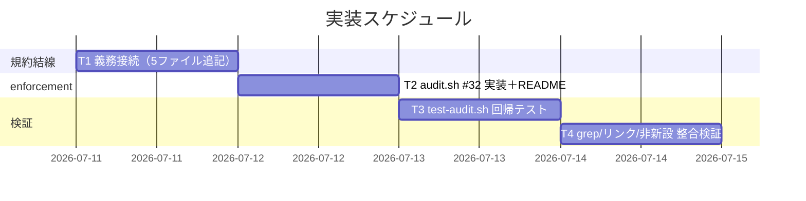
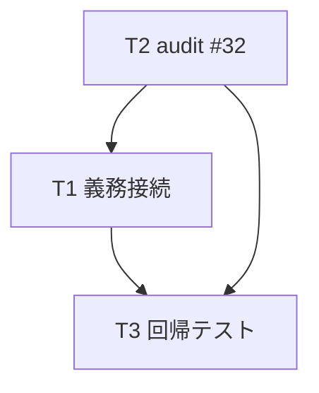
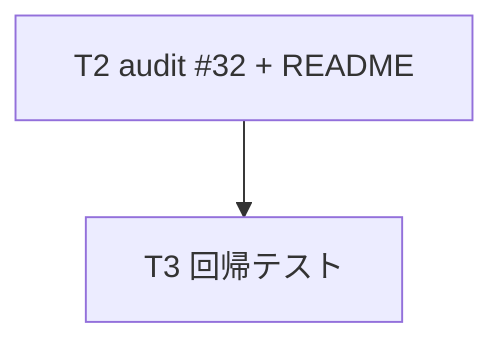
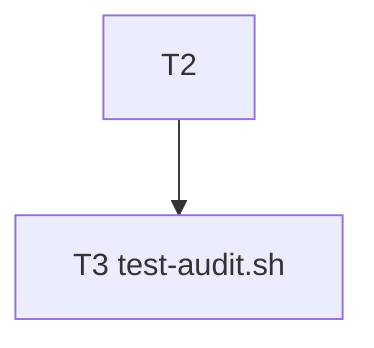

# 実装計画書: 実装前ドキュメントレビュー（review-docs）の全 issue 必須ゲート化

**プロジェクト名**: review-docs 必須化（design-feature 完了→implement-feature 着手の間の必須ゲート化）
**作成日**: 2026 年 07 月 11 日
**最終更新**: 2026 年 07 月 11 日

> **重要**: **このドキュメントは常に更新**: 実装計画の変更、進捗状況の更新、バグの記録などがあった場合は、即座にこのドキュメントを更新してください。ドキュメントは「生きているドキュメント」として扱い、実装内容と常に同期させます。
> **必須項目**: 「必須」と明記した欄は空欄・抽象語のみで提出しないこと。テスト観点・BDD 仕様は具体ケースを 1 件以上記載すること。
>
> **用語**: [.agent-skill-chain/source/CONCEPTS.md §用語規約](../../../../../../.agent-skill-chain/source/CONCEPTS.md#用語規約) を参照。

---

## 1. 実装概要

### 1.1 実装方針（必須）

[02\_設計](./02_設計.md) に従い、review-docs を design→implement の必須ゲートとして既存正本へ**参照結線（義務行の追記）**し、その未実行を audit.sh の**非交差・安全側の新チェック #32**（既存 #29 の様式踏襲）で検知する。review-docs.md / verify-and-close.md / create-pr-review-issue.md は無変更とし、既存 command / skill chain の順序・DoD・enforcement を弱めない（加算のみ）。

### 1.2 実装順序（必須: 1 件以上）

規約結線（T1）→ enforcement 実装（T2）→ 回帰テスト（T3）→ 整合・非新設検証（T4）の順で進める。T1 と T2 は独立だが、T2 の FAIL メッセージ・#32 番号を T1 の接続文（「未実行は #32 で FAIL」）が参照するため、番号は T2 実装で確定後に T1 の文言へ反映する（相互整合）。



---

## 2. タスク分解

**用語**: [.agent-skill-chain/source/CONCEPTS.md §用語規約](../../../../../../.agent-skill-chain/source/CONCEPTS.md#用語規約) を参照。

**必須**: 各タスクには **「テスト観点」（2.x.3）** と **「単体テスト仕様（BDD）」（2.x.4）** を必ず記載する。テスト観点の定義は **[02\_設計 §6](./02_設計.md)** および **RULES のテスト戦略・[TEST_BDD_FORMAT.md](../../../../../../.agent-skill-chain/source/TEST_BDD_FORMAT.md)** を参照し、本ドキュメントでは**タスクごとの具体ケース**のみ記載する。

### 2.1 タスク 1: 必須ゲートの義務接続（規約 5 ファイルの追記）

#### 2.1.1 概要（必須）

design→implement 間に review-docs を必須で経る義務を、既存 5 正本へ参照 1〜数行で結線する（02 §3.1）。

#### 2.1.2 実装内容（必須: 1 件以上）

- `skills/agent/run_command.md` §Constraints に「design-feature 完了後・implement-feature 委譲前に review-docs を必須委譲（全 issue 一律・免除なし・完了定義は PHASES・未実行は #32 で FAIL）」の 1 項を追記（既存 :46/:53 近傍）。
- `commands/design-feature.md` §実行時の注意 ＋ §DONE に「本 command 完了後・実装着手前に review-docs が必須」の接続を追記。
- `commands/implement-feature.md` §実行時の注意に「実装着手の前提＝同一 issue の review-docs 完了。未実行は #32 で FAIL」を追記。
- `workflow/PHASE_COMMAND_MAP.md` §補助手順（auxiliary）ブロックに「表に行を持たないまま design 完了→実装着手の間の必須ゲート／禁止対象外」の注記を追記（**表本体に review-docs 行を追加しない**）。
- `workflow/PHASES.md` §レビュー成果物の配置ルール :65 の auxiliary 文を「auxiliary＝phase 選択対象外だが実装着手前の必須ゲート・全 issue 一律」に整合更新（「任意・省略可」と誤読させない）。
- いずれも review-docs.md 本文を複製せず**参照表現に限定**（AC-11/SC-7）。規模比例の免除条項を書かない（SC-8/AC-13）。

#### 2.1.3 テスト観点（必須）

**参照**: 観点の定義は [02\_設計 §6](./02_設計.md) および [RULES のテスト戦略・TEST_BDD_FORMAT](../../../../../../.agent-skill-chain/source/RULES.md#テスト戦略必須要件) を参照。以下は**本タスクの具体ケース**。

##### 単体（本タスクの具体ケース・必須 1 件以上）

- `grep -n "review-docs" .agent-skill-chain/source/skills/agent/run_command.md` が必須委譲義務行を 1 件以上返す（AC-2/SC-3）。
- `grep -n "review-docs" .agent-skill-chain/source/commands/design-feature.md` が次工程/DoD 行を返す（AC-3/SC-4）。
- `grep -n "review-docs" .agent-skill-chain/source/commands/implement-feature.md` が前提行を返す（AC-4/SC-5）。
- `grep -n "review-docs" .agent-skill-chain/source/workflow/PHASE_COMMAND_MAP.md` が必須ゲート注記を返し、かつ表本体の行数（`| ... | ... |` の Phase 行）が変更前と同数（review-docs 行を増やしていない）（AC-1/AC-6/SC-1）。
- PHASES.md :65 付近に「auxiliary」と「必須ゲート」を両立させる文がある（AC-5/SC-2）。

##### 結合/API（本タスクの具体ケース・該当時は必須 1 件以上）

- 該当なし（規約テキスト変更。実行契約の結合は T3 の audit で検証）。

##### E2E/受け入れ（本タスクの具体ケース・未達時は理由記載）

- 該当なし（E2E 対象の実行フローを持たない。ゲート運用の検証は T3 の #32 振る舞いテストで代替）。

##### バリデーション（該当する場合の具体ケース）

- 変更後の 5 ファイルに「規模/リスクに応じて review-docs を省略してよい」旨の免除表現が存在しない（`grep -nE "省略してよい|省略して良い|免除する|免除される|免除対象|軽量.*(省略|免除)" <対象>` が該当ゼロ。SC-8/AC-13）。**パターンは肯定的な免除句のみを検出する**: 本 issue が接続文で用いる**否定形**（「規模比例の**免除なし**」「**免除**条項を書かない」「『任意・省略可』の意で**はない**」等）は一律必須を宣言する**適合表現**であり、違反ではない。素朴な bare `免除` grep はこれら否定形を誤検知するため用いない。

#### 2.1.4 単体テスト仕様（BDD）（必須）

```gherkin
Feature: 必須ゲートの義務接続
  Scenario: 規約ファイルから実装着手前 review-docs 必須が読み取れる
    Given run_command / design-feature / implement-feature / PHASE_COMMAND_MAP / PHASES を追記した
    When 各ファイルを grep -n "review-docs" する
    Then 各ファイルで必須ゲート（実装着手前に必須で経る）の接続行が 1 件以上ヒットし
    And PHASE_COMMAND_MAP の表本体には review-docs の phase 行が増えていない
```

**テストコード例（必須: インラインコメントで Given/When/Then を明記）**

```bash
# Given: 5 ファイルへの義務接続追記が完了している
files="run_command.md design-feature.md implement-feature.md PHASE_COMMAND_MAP.md PHASES.md"
# When: 各対象を grep する
# Then: review-docs 必須ゲートの接続行が各ファイルで 1 件以上ヒットする（値の確認は verify-and-close で実測）
grep -n "review-docs" .agent-skill-chain/source/workflow/PHASE_COMMAND_MAP.md
```

#### 2.1.5 依存関係

- T2 で確定する失敗条件番号（#32）を接続文へ反映するため、番号確定は T2 と相互参照（文言は T2 後に最終化）。



#### 2.1.6 見積もり

- **工数**: 1.0h
- **優先度**: 高

### 2.2 タスク 2: enforcement 実装（audit.sh #32 ＋ README）

#### 2.2.1 概要（必須）

「同一 issue に implement-feature ログがあるが review-docs ログが無い」を FAIL する #32 を、#29 の様式で追加し、README の失敗条件へ反映する（02 §3.2）。

#### 2.2.2 実装内容（必須: 1 件以上）

- `enforcement/ci/audit.sh` に `check_reviewdocs_before_implement`（#32）を追加（02 §3.2.3 の関数仕様どおり）: DB/テーブル SKIP・templates/close 除外・発効日 cutoff（`REVIEWDOCS_GATE_EFFECTIVE_FROM` 既定 `20260712_000000`・env 上書き可）・前方一致＋basename 末尾一致で implement-feature 有かつ review-docs 無なら FAIL。read-only。
- audit.sh 末尾の登録列（`check_review_before_implement` / `check_docs_review_evidence` の後）に `check_reviewdocs_before_implement` を追加。
- audit.sh 冒頭コメントの check 一覧に (32) を追記。
- `enforcement/README.md` に #32 を追加: (a)「audit.sh が実施する必須チェック」列挙、(b)「失敗条件 → 実装の所在 → 強制レベル 対応表」（`audit.sh check_reviewdocs_before_implement` / CI FAIL・DB 不採用/発効日前/close は SKIP）、(c)「失敗とみなす条件（判定ルール）一覧」表、(d)「差し戻し先の固定」表（差し戻し先＝「review-docs を実行してから implement-feature を再実行」）。#29 との非交差・存在監査（順序非監査）・発効日 grandfather の限界を正直に明記。

#### 2.2.3 テスト観点（必須）

**参照**: [02\_設計 §6](./02_設計.md)・[RULES テスト戦略](../../../../../../.agent-skill-chain/source/RULES.md#テスト戦略必須要件)。以下は本タスクの具体ケース。

##### 単体（本タスクの具体ケース・必須 1 件以上）

- `grep -n "check_reviewdocs_before_implement" audit.sh` が**関数定義と登録呼び出しの両方**を返す（AC-8）。
- `bash -n audit.sh`（構文チェック）が成功する。
- README に `#32` の行が対応表・判定ルール一覧・差し戻し先の各表に存在する（AC-7）。

##### 結合/API（本タスクの具体ケース・該当時は必須 1 件以上）

- 環境変数契約: `REVIEWDOCS_GATE_EFFECTIVE_FROM=20260101_000000 bash audit.sh <tmp>` で発効日を早めると、旧 issue でも #32 が発火する（cutoff が効くことの確認）。既定では発火しない。

##### E2E/受け入れ（本タスクの具体ケース・未達時は理由記載）

- `bash .agent-skill-chain/source/enforcement/ci/audit.sh .`（本リポ全体）を実行し、#32 起因の新規 FAIL が出ない（既存 2026-06/07 issue は発効日前 grandfather で SKIP。自リポ CI 非破壊の受け入れ）。tmp 隔離不要な read-only 実行だが、本番 DB を変更しないこと（SELECT のみ）を確認。

##### バリデーション（該当する場合の具体ケース）

- 不正 `REVIEWDOCS_GATE_EFFECTIVE_FROM`（空・非数値）でも audit がエラー終了せず、FAIL を増やさない（過剰 SKIP 側へ倒れる。02 §3.2.4）。

#### 2.2.4 単体テスト仕様（BDD）（必須）

```gherkin
Feature: 実装前 review-docs 未実行検知（#32）
  Scenario: implement-feature ログはあるが review-docs ログが無い issue を FAIL する
    Given workflow.db に発効日以降の issue の implement-feature ログが 1 件あり
    And 同 issue の review-docs ログが 0 件である
    When audit.sh を実行する
    Then "実装前 review-docs 未実行" を含む FAIL 行が出力され exit_code=1 となる
```

**テストコード例（必須: インラインコメントで Given/When/Then を明記）**

```bash
# Given: 発効日以降(20260712 以降)の issue dir に 03_実装計画.md と implement-feature ログのみ（review-docs 無し）
tree="$(make_git_tree)"; iss="docs/maintainer/workflow/20260801_000000_x"
mkdir -p "$tree/$iss"; : > "$tree/$iss/03_実装計画.md"
sqlite3 "$tree/.agent-skill-chain/runtime/workflow.db" \
  "INSERT INTO workflow_log VALUES ('e1', NULL, 'implement-feature', '$iss');"
# When: audit.sh を実行する
out="$(bash "$AUDIT" "$tree" 2>&1)"
# Then: #32 の FAIL が出る
grep -q "実装前 review-docs 未実行" <<< "$out"   # → true（FAIL 検出）
```

#### 2.2.5 依存関係

- なし（T1 と独立に着手可）。ただし #32 番号は T1 の接続文と相互参照。



#### 2.2.6 見積もり

- **工数**: 1.5h
- **優先度**: 高

### 2.3 タスク 3: 回帰テスト（test-audit.sh 追記）

#### 2.3.1 概要（必須）

#32 の正常系・違反系・grandfather/close/DB 非採用 SKIP・#29 非交差を tmp 隔離で検証するシナリオを `test/test-audit.sh` に追加する（02 §3.3）。

#### 2.3.2 実装内容（必須: 1 件以上）

- 既存 `make_min_tree` / `make_git_tree` を流用し、tmp 隔離（`mktemp -d`）で 7 シナリオを追加（02 §3.3 の 1〜7。うち 7 は `90_issues/<sub>/` 深さ 4 のサブ issue 違反系 FAIL＝maxdepth 撤廃の回帰防止）。本番ファイルは read-only。
- **テスト DB の用意（既存 T4 パターン踏襲）**: `make_min_tree` / `make_git_tree` は `workflow.db` を作らないため、各シナリオでは既存 T4（`test/test-audit.sh`）と同様に `sqlite3 "$tree/.agent-skill-chain/runtime/workflow.db" "CREATE TABLE workflow_log (entry_id TEXT PRIMARY KEY, parent_entry_id TEXT NULL, command TEXT NOT NULL, issue_path TEXT NULL);"` で 4 列の簡易テーブルを **CREATE してから** `INSERT` する（audit.sh は `command`・`issue_path` のみ参照するため 4 列で十分）。下記テストコード例（§2.3.4 等）の `INSERT` は、この CREATE を前提とした抜粋である。
- `test/run-all.sh` 経由で新シナリオが走ることを確認（既存 runner に自動包含。追加登録が要る場合のみ登録）。

#### 2.3.3 テスト観点（必須）

**参照**: [02\_設計 §6.1](./02_設計.md)。

##### 単体（本タスクの具体ケース・必須 1 件以上）

- 正常系: 発効日以降 issue に implement＋review-docs 両ログ → `bash test/test-audit.sh` の当該ケースが PASS（FAIL 行なし）。
- 違反系: 同 issue に implement のみ → `実装前 review-docs 未実行` FAIL を検出できることを PASS 判定する。

##### 結合/API（本タスクの具体ケース・該当時は必須 1 件以上）

- grandfather: 発効日前（`20260101_000000_*`）issue に implement のみ → FAIL しないことを PASS 判定。
- close: close/ 配下 issue に implement のみ → FAIL しないことを PASS 判定。

##### E2E/受け入れ（本タスクの具体ケース・未達時は理由記載）

- `bash test/run-all.sh`（または `test/test-audit.sh` 単体）が全 PASS で終了（既存テストの回帰なし）。

##### バリデーション（該当する場合の具体ケース）

- #29 非交差: 同一 DB に「04 のみ・impl 0 件」を仕込み、#29 は FAIL するが #32 は同 issue で発火しない（排他）ことを確認。

#### 2.3.4 単体テスト仕様（BDD）（必須）

```gherkin
Feature: #32 回帰テスト
  Scenario: grandfather された既存 issue は FAIL しない
    Given 発効日前(例 20260101_000000)の issue dir に implement-feature ログのみが存在する
    When test-audit.sh の #32 シナリオを実行する
    Then #32 の FAIL 行は出力されない（遡及適用なし）
```

**テストコード例（必須: インラインコメントで Given/When/Then を明記）**

```bash
# Given: 発効日前の issue に 03 と implement ログのみ（review-docs 無し）
tree="$(make_git_tree)"; iss="docs/maintainer/workflow/20260101_000000_old"
mkdir -p "$tree/$iss"; : > "$tree/$iss/03_実装計画.md"
sqlite3 "$tree/.agent-skill-chain/runtime/workflow.db" \
  "INSERT INTO workflow_log VALUES ('e1', NULL, 'implement-feature', '$iss');"
# When: audit を実行
out="$(bash "$AUDIT" "$tree" 2>&1)"
# Then: #32 の FAIL は出ない（grandfather）
if ! grep -q "実装前 review-docs 未実行" <<< "$out"; then ok "grandfather SKIP"; else ng "遡及適用された"; fi
```

#### 2.3.5 依存関係

- T2（#32 実装）完了後に着手。



#### 2.3.6 見積もり

- **工数**: 1.0h
- **優先度**: 高

### 2.4 タスク 4: 整合・非新設・リンク検証

#### 2.4.1 概要（必須）

役割分担の非重複（SC-7）・免除条項の非新設（SC-8）・create-pr-review-issue 経路不変（AC-12）・追加リンクの解決を静的検証する（02 §6.1）。

#### 2.4.2 実装内容（必須: 1 件以上）

- review-docs の Process/DoD 正本が review-docs.md のみで、他所に複製が無いことを grep で確認（AC-11）。
- `create-pr-review-issue.md` の review-docs 呼び出し step 記述が維持されていることを確認（AC-12）。
- 変更ファイル群に免除表現が無いことを確認（SC-8/AC-13）。
- 02/03 および変更した規約ファイルの追加・変更 markdown リンクを realpath で解決（未解決 0 件）。

#### 2.4.3 テスト観点（必須）

##### 単体（本タスクの具体ケース・必須 1 件以上）

- `grep -rn "実装前.*ドキュメントレビュー.*反復\|レビュー＋修正" .agent-skill-chain/source/` で review-docs.md 以外に Process/DoD の複製が無い（参照は可）。
- `grep -n "review-docs" .agent-skill-chain/source/commands/create-pr-review-issue.md` の既存行が残存（AC-12）。

##### 結合/API（本タスクの具体ケース・該当時は必須 1 件以上）

- 該当なし。

##### E2E/受け入れ（本タスクの具体ケース・未達時は理由記載）

- 02/03 の相対リンクを検証スクリプト（自己拡張ワークフロー §close 移動時の検証例に準拠）で解決し未解決 0 件。

##### バリデーション（該当する場合の具体ケース）

- 免除表現 grep（肯定的免除句のみ: `省略してよい|省略して良い|免除する|免除される|免除対象|軽量.*(省略|免除)`）が変更ファイルで該当ゼロ（SC-8/AC-13）。否定形（「免除なし」「免除ではない」等）は適合表現のため検出対象外（§2.1.3 の注記参照）。

#### 2.4.4 単体テスト仕様（BDD）（必須）

```gherkin
Feature: 非重複・非新設・不変の静的検証
  Scenario: review-docs 呼び出し経路と役割分担が壊れていない
    Given 規約 5 ファイルを追記した
    When create-pr-review-issue.md と review-docs.md を grep する
    Then create-pr-review-issue の review-docs 内部 step 記述が残り
    And review-docs の Process/DoD 正本が review-docs.md 以外に複製されていない
```

**テストコード例（必須: インラインコメントで Given/When/Then を明記）**

```bash
# Given: 追記後の source ツリー
# When: 肯定的な免除句のみを検索する（否定形「免除なし」等は適合表現なので検出しない）
# Then: 該当ゼロ（免除条項の非新設 SC-8）
if ! grep -rnE "省略してよい|省略して良い|免除する|免除される|免除対象|軽量.*(省略|免除)" \
   .agent-skill-chain/source/skills/agent/run_command.md \
   .agent-skill-chain/source/workflow/PHASES.md; then echo "OK: 免除条項なし"; fi
```

#### 2.4.5 依存関係

- T1〜T3 完了後の最終検証。

#### 2.4.6 見積もり

- **工数**: 0.5h
- **優先度**: 中

---

## テスト観点

本実装計画全体のテスト観点は以下に集約される（各タスク §2.x.3 に具体ケース）。

- **規約結線（静的検証）**: 5 ファイルの grep 一致・PHASE_COMMAND_MAP 表行の非増加・免除表現の不在（AC-1〜6・SC-1〜5・SC-8）。
- **enforcement 振る舞い**: #32 の正常系 pass／違反系 FAIL／grandfather・close・DB 非採用 SKIP／#29 非交差／自リポ全体 audit の非破壊（AC-7〜10・AC-14）。
- **非重複・不変**: review-docs.md 単一正本・verify-and-close 04 ルール不変・create-pr-review-issue 経路不変・リンク解決（AC-11・AC-12・SC-7）。

## 単体テスト

- 規約側は grep・行数・リンク解決の静的検証（実行コードなし）。
- enforcement 側は `test/test-audit.sh` に #32 の 7 シナリオを追加し `bash -n` 構文チェックと合わせて単体担保する。BDD 形式（`Feature:`/`Scenario:`・Given/When/Then インラインコメント）は [TEST_BDD_FORMAT.md](../../../../../../.agent-skill-chain/source/TEST_BDD_FORMAT.md) に従う。

## BDD

- 各タスク §2.x.4 の Gherkin を正とする。01 の BDD ユースケース対応:
  - UC1 シナリオ1（正常系ゲート通過）→ T3 正常系。
  - UC1 シナリオ2（未実行の enforcement 検知）→ T2/T3 違反系。
  - UC2（auxiliary と必須ゲートの両立）→ T1（PHASE_COMMAND_MAP/PHASES 整合）。
  - UC3（事前 memo・事後 04 の役割分担）→ T4（非重複検証）。
  - UC4（軽量 issue でも免除なし）→ T4（免除表現不在）＋ grandfather は免除でない旨（02 ADR-5）。

---

## 3. 実装スケジュール

### 3.1 マイルストーン

| マイルストーン | 期日 | 成果物 |
| -------------- | ---- | ------ |
| M1: 規約結線完了 | T1 完了時 | run_command / design-feature / implement-feature / PHASE_COMMAND_MAP / PHASES 追記 |
| M2: enforcement 実装完了 | T2 完了時 | audit.sh #32 ＋ README 反映 |
| M3: 検証完了 | T3/T4 完了時 | test-audit.sh 追記・全 audit/test PASS・リンク解決 |

### 3.2 実装フェーズ

#### フェーズ 1: 結線と検知

- **期間**: T1〜T2
- **タスク**: T1（規約 5 ファイル）・T2（audit.sh #32・README）

#### フェーズ 2: 検証

- **期間**: T3〜T4
- **タスク**: T3（回帰テスト）・T4（整合・非新設・リンク）

---

## 4. テスト計画

テスト観点・レベル・BDD 形式の定義は **[02\_設計 §6](./02_設計.md)** および **RULES のテスト戦略・TEST_BDD_FORMAT** を参照。本実装計画では各タスク §2.x.3 に具体ケース、§2.x.4 に BDD 仕様を記載した。

### 4.1 テストの優先順位

- クリティカル: #32 の grandfather SKIP（自リポ CI 非破壊）と #29 非交差（既存チェックを弱めない）を最優先で回帰テスト化する。
- 影響範囲が広い箇所: audit.sh は全 CI が参照するため、`bash -n` 構文チェックと自リポ全体 audit の非破壊を必ず回帰に含める。

---

## 5. リスク管理

### 5.1 実装リスク

- **リスク**: 発効日 cutoff の既定が早すぎ／遅すぎで、既存 issue を誤 FAIL または新規 issue を取り逃す。
  - **対策**: 既定 `20260712_000000`（ship 日翌日）で 2026-07-11 以前を全 grandfather。env `REVIEWDOCS_GATE_EFFECTIVE_FROM` で上書き可能にし、T2 の E2E で自リポ全体 audit の非破壊を実測確認（02 ADR-5）。
- **リスク**: 接続文が review-docs.md の Process/DoD を複製し二重定義になる（SC-7 違反）。
  - **対策**: 接続は参照表現に限定。T4 で複製不在を grep 検証。
- **リスク**: #32 が #29 と交差し二重 FAIL・既存チェック弱体化。
  - **対策**: implement ログ件数（0 vs 1 以上）で排他な条件を維持。T3 で非交差を回帰テスト（02 ADR-2）。
- **リスク**: PHASE_COMMAND_MAP に誤って phase 行を追加し「auxiliary のまま」方針を破る（AC-6 違反）。
  - **対策**: 注記追記のみとし、T1 で表本体の Phase 行数不変を検証。

---

## 6. 参考資料

### プロジェクトドキュメント

- [`02_設計.md`](./02_設計.md) - 設計
- [`01_要件定義.md`](./01_要件定義.md) - 要件定義
- [`00_要求定義.md`](./00_要求定義.md) - 要求定義

### その他の参考資料

- [.agent-skill-chain/source/enforcement/ci/audit.sh](../../../../../../.agent-skill-chain/source/enforcement/ci/audit.sh)（:805 `check_review_before_implement`＝#29 の様式）・[enforcement/README.md](../../../../../../.agent-skill-chain/source/enforcement/README.md) §失敗条件と差し戻し
- [.agent-skill-chain/source/skills/agent/run_command.md](../../../../../../.agent-skill-chain/source/skills/agent/run_command.md)・[commands/design-feature.md](../../../../../../.agent-skill-chain/source/commands/design-feature.md)・[implement-feature.md](../../../../../../.agent-skill-chain/source/commands/implement-feature.md)・[review-docs.md](../../../../../../.agent-skill-chain/source/commands/review-docs.md)・[create-pr-review-issue.md](../../../../../../.agent-skill-chain/source/commands/create-pr-review-issue.md)
- [.agent-skill-chain/source/workflow/PHASES.md](../../../../../../.agent-skill-chain/source/workflow/PHASES.md)・[PHASE_COMMAND_MAP.md](../../../../../../.agent-skill-chain/source/workflow/PHASE_COMMAND_MAP.md)
- [test/test-audit.sh](../../../../../../test/test-audit.sh)（tmp 隔離・回帰テストの前例）・[.agent-skill-chain/project/自己拡張ワークフロー.md](../../../../../../.agent-skill-chain/project/自己拡張ワークフロー.md) §テストの tmp 隔離
- [.agent-skill-chain/source/TEST_BDD_FORMAT.md](../../../../../../.agent-skill-chain/source/TEST_BDD_FORMAT.md)

---

## 7. 前のステップ

この実装計画書は、以下のドキュメントを基に作成されています：

- **前**: [`02_設計.md`](./02_設計.md) - 設計フェーズ

---

## 8. 次のステップ

この実装計画書の承認後、以下のいずれかのステップに進みます：

- 本サブ issue は 1 つのまとまりであり、サブ issue 分割は行わない。実装フェーズ（implement-feature）に直接進む。**ただし implement-feature 着手の前に、本設計・実装計画自体への実装前ドキュメントレビュー（review-docs）を経ること**（本 issue が導入しようとするゲートを、本 issue 自身にも適用する）。

**用語**: [.agent-skill-chain/source/CONCEPTS.md §用語規約](../../../../../../.agent-skill-chain/source/CONCEPTS.md#用語規約) を参照。
