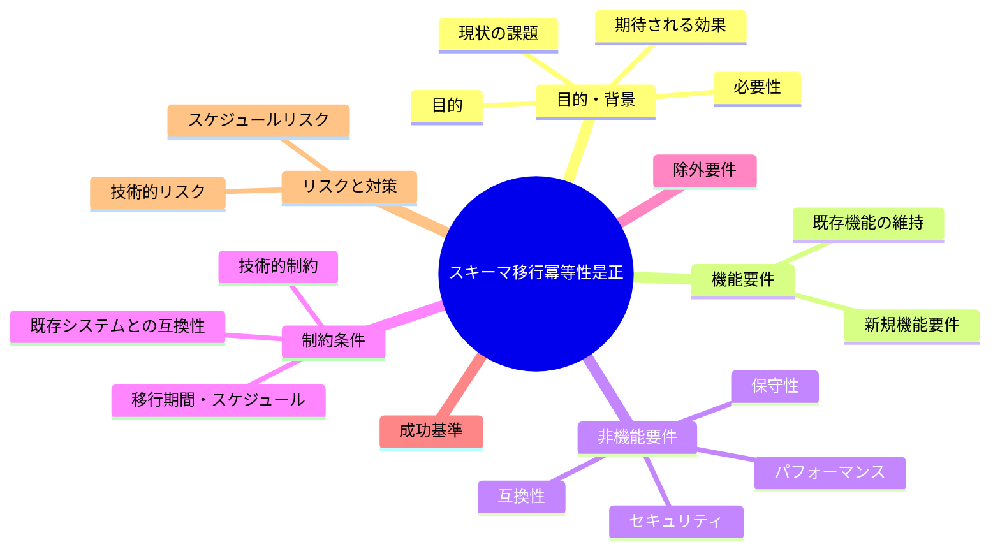
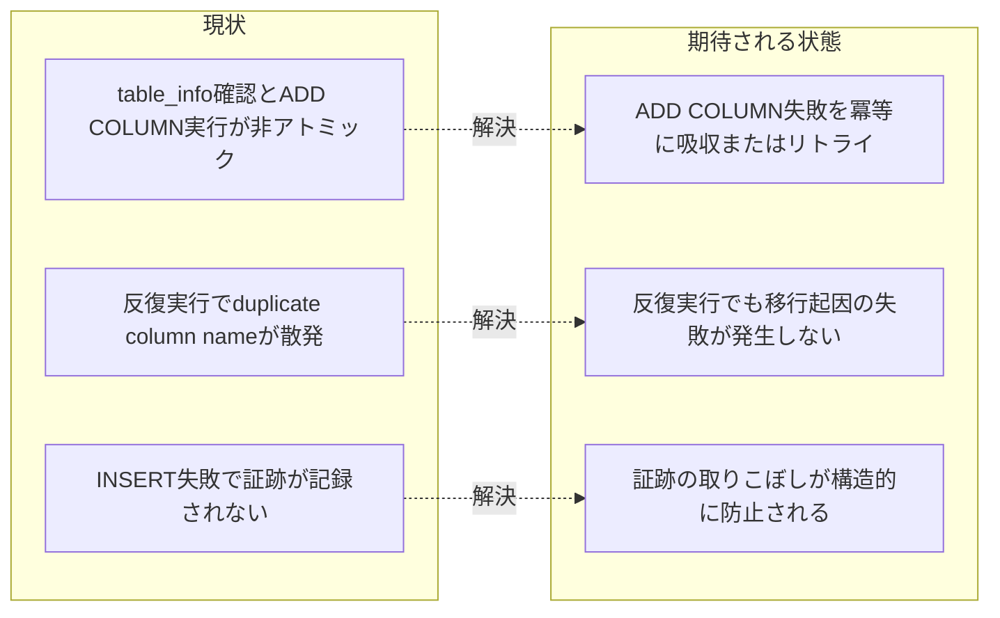

# 要求定義書: write-workflow-log.sh スキーマ移行 ADD COLUMN の冪等性是正

**プロジェクト名**: write-workflow-log.sh スキーマ移行 ADD COLUMN の冪等性是正（親 issue: agentsOS 汎用化・ポリシー統合 のサブ issue）
**作成日**: 2026 年 07 月 12 日
**最終更新**: 2026 年 07 月 12 日

> **重要**:
>
> - 要求定義書は、プロジェクトの全体像を把握するためのものです。詳細な技術仕様や実装方法は要件定義書以降で記載します。必要最低限の情報に収めることを心掛けてください。
> - **このドキュメントは常に更新**: 要求の変更や追加があった場合は、即座にこのドキュメントを更新してください。ドキュメントは「生きているドキュメント」として扱い、実装内容と常に同期させます。
> - **必須項目**: 以下の「必須」と明記した項目は空欄・抽象語のみ（例: 「{説明}」のまま）で提出しないこと。判定可能な形（目的は1文・成功基準は○/×で判定できる記載等）で記入すること。
>
> **用語**: [.agent-skill-chain/source/CONCEPTS.md §用語規約](../../../../../../.agent-skill-chain/source/CONCEPTS.md#用語規約) を参照。

---

## 要求定義の全体像

**注意**:

- マインドマップは全体像を把握するためのものです。主要なセクション名程度に留め、詳細は記載しないでください。

---

## 1. 目的・背景

### 1.1 目的（必須）

`write-workflow-log.sh` のスキーマ移行検知（ADD COLUMN 冪等判定）を、反復・並走実行下でも `duplicate column name` エラーを起こさず INSERT が失敗しないように是正する。

### 1.2 背景

- **現状の課題**:
  - 検出元: [`../20260711_055602_write-workflow-log_ts_utc検証/04_review.md`](../20260711_055602_write-workflow-log_ts_utc検証/04_review.md) §3.3（行 127-132）・§4.2 指摘 2（行 178-185）・§10.1 課題 1（行 289-293）。同 issue のレビュー担当者（監査者）が、`write-workflow-log.sh` の**別改修（ts_utc ISO8601 バリデーション追加）の監査中**に独立して発見した既存不具合であり、当該改修そのものが原因ではないことを HEAD（改修前）版との版比較で確定済み（同 04_review §3.3）。
  - `.agent-skill-chain/source/scripts/write-workflow-log.sh` のスキーマ移行検知（300〜312 行目付近）は、次の「読んでから書く」二段構成になっている。
    1. `PRAGMA table_info(workflow_log);` で現在のカラム一覧を取得する（300 行目）。
    2. 取得結果に対象カラム（`document_id`・`issue_id`・`review_id`・`document_path`）が **無い場合のみ** `ALTER TABLE workflow_log ADD COLUMN ...` を実行する（301〜312 行目）。
  - この「確認してから実行する（Check-Then-Act）」構成には、確認（1）から実行（2）までの間に**別プロセスが同じ ALTER TABLE を先に成功させてしまう**競合が生じ得るという構造的な弱点があり、確認時点では「カラムが無い」と判定していても、実行時点では既に他プロセスがカラムを追加済みで `ALTER TABLE ... ADD COLUMN` が `duplicate column name: review_id` / `duplicate column name: document_path` 等のエラーで失敗する。この失敗はスクリプト内で `|| { echo "ERROR: ... マイグレーションに失敗しました。" >&2; exit 1; }` により **非 0 終了**として扱われ、当該呼び出しの INSERT が丸ごと失敗する（workflow.db に証跡が記録されない）。
  - 前掲レビューでの再現手順（同 04_review §3.3）: 同一のセットアップ INSERT を隔離ループで反復実行したところ、iteration 2 で `duplicate column name: review_id` / 別実行で `duplicate column name: document_path` が発生し、`before=0`（セットアップ INSERT 自体が未実行）という失敗を確認した。同一のセットアップ INSERT を **HEAD（改修前）版**の `write-workflow-log.sh` に対しても反復実行し、同一クラスの失敗を再現しており、**特定の改修が原因ではなく、独立した既存の不具合**であると評価担当者が判定済み（同 04_review §3.3・§10.1 課題 1）。
  - 書記（write-workflow-log capability）は「証跡を省略してはならない」（CORE §禁止事項）の運用上、workflow.db への記録は複数の command・サブエージェントから随時（時には近接タイミングで）呼び出される。呼び出しのたびに毎回同じ ADD COLUMN 冪等判定ブロックを通過するため、隔離された単発実行では問題が顕在化しにくい一方、反復・近接実行（同一 issue 内での複数成果物記録・複数サブエージェントの並走等）では散発的に発生し得る flaky な失敗である。

- **必要性**:
  - workflow.db は証跡の正本（CORE §禁止事項「ログは書記に任せる」）であり、スキーマ移行起因の INSERT 失敗は、実施した作業の証跡が記録されないまま失われることを意味する。散発的（flaky）であるためテストや通常運用では見過ごされやすく、放置すると監査（audit）や順序監査（prev_hash 連結）の正しさの前提が損なわれる。
  - 既存の同種箇所（`insert_with_retries` 関数、251〜281 行目付近）は SQLITE_BUSY／locked に対してリトライで対処しており、「ロック・競合が起き得る箇所はリトライまたは冪等化で吸収する」という既存の設計方針がスクリプト内に既にある。スキーマ移行ブロックのみがこの方針から外れており、一貫性が無い。

### 1.3 期待される効果（必須: 1 件以上）

- **効果 1**: `write-workflow-log.sh` のスキーマ移行検知ブロックを隔離ループで反復実行しても、`duplicate column name` エラーによる INSERT 失敗が発生しなくなる（前掲レビューの再現手順と同等の反復実行で、失敗 0 件になることを実行確認できれば○）。
- **効果 2**: 既存のスキーマ移行の最終結果（4 カラム `document_id`・`issue_id`・`review_id`・`document_path` が過不足なく存在し、対応するインデックスが作成されている状態）は改修前後で変わらない（回帰なし）。

**現状と期待される状態の比較**:

---

## 2. 機能要件

### 2.1 既存機能の維持（該当する場合）

- `write-workflow-log.sh` の既存挙動をすべて維持する: `--print-head` サブコマンド、`AGENT_ROLE=scribe` ガード、command 許可リスト検証、UUID 形式検証、DOCUMENT_ID 必須化、summary 長チェック、dod_met 0/1 チェック、ts_utc ISO8601 バリデーション（前掲サブ issue で追加済み）、flock 排他・`insert_with_retries` によるリトライ付き INSERT、prev_hash 自動連結、document_id 不変チェック。
- 新スキーマ（`entry_id` カラムあり）・旧スキーマの両経路を維持する。
- 移行完了後の最終スキーマ状態（4 カラムとインデックスの存在）は現行と同一にする。

### 2.2 新規機能要件

- **ADD COLUMN の冪等化**: `document_id`・`issue_id`・`review_id`・`document_path` の各カラム追加ブロック（現行 301〜312 行目付近）を、対象カラムが既に存在する状態（＝他プロセスが先に追加済み）で実行されてもエラーとして扱わず INSERT 処理を継続できるようにする。具体的な実装方式（例: `ALTER TABLE ... ADD COLUMN` 失敗時に `duplicate column name` エラーのみを許容して握り込む、`table_info` の再読込によるリトライ、直列化のためのロック取得等）は 02_設計で比較・確定する。
- 是正後も、対象カラムが存在しないにもかかわらず ADD COLUMN が失敗した場合（`duplicate column name` 以外の真のエラー）は、従来どおり `exit 1` で fail-fast すること（冪等化によってエラーを一律に握り潰さない）。

---

## 3. 非機能要件

### 3.1 パフォーマンス

- 冪等化・リトライの追加によるオーバーヘッドは、スクリプトの実行時間に体感可能な影響（数百 ms 超）を与えないこと。

### 3.2 セキュリティ

- 変更は既存のスキーマ移行ロジックの堅牢化に限定し、SQL 組み立て・認可（`AGENT_ROLE=scribe` ガード）等の既存の安全設計を変更しないこと。

### 3.3 互換性

- 正常系（初回のスキーマ移行、または既に移行済みで ADD COLUMN が不要な場合）の既存挙動を変えないこと。
- 旧スキーマ（`entry_id` 無し）経路には現行同様スキーマ移行ブロックが適用されない（`HAS_NEW_SCHEMA` 判定に基づく現行の分岐を維持）。

### 3.4 保守性

- 既存の `insert_with_retries` 関数（251〜281 行目付近）と同様の記述スタイル・命名規則を踏襲し、スクリプト内の一貫性を保つこと。
- 4 カラムの ADD COLUMN ブロックが同型のロジックであることを踏まえ、重複コードを増やさない実装（共通化）を検討すること。

---

## 4. 制約条件

### 4.1 技術的制約

- bash（`set -euo pipefail` 環境）＋ sqlite3 CLI の範囲で実装する。新規の外部依存を追加しない。
- 変更対象は `.agent-skill-chain/source/scripts/write-workflow-log.sh` のスキーマ移行検知ブロック（現行 298〜319 行目付近）に限定し、契約定義（`.agent-skill-chain/source/scribe/CONTRACT.md`）・事後検知（`.agent-skill-chain/source/enforcement/ci/audit.sh`）・スキーマ正本（`ledger/schema.sql`）は変更しない。

### 4.2 既存システムとの互換性

- 4 カラムの最終的なスキーマ状態（型・NULL 許容・インデックス名）は現行の ADD COLUMN 文と同一を維持し、既存 DB との互換性を保つこと。
- 直後にある CHECK 制約再作成（`review-docs` / `create-pr-review-issue` 用のテーブル再作成、314〜行目付近）のロジックには影響を与えないこと（本 issue のスコープ外）。

### 4.3 移行期間・スケジュール

- 単一スクリプトへの局所的な追加・修正であり、移行期間は不要。影響を受けるのは `write-workflow-log.sh` を呼ぶ全 command（requirement-discovery / design-feature / implement-feature / verify-and-close / review-docs / create-pr-review-issue）だが、正常系の挙動は不変。

---

## 5. 除外要件

- `ts_utc` の ISO8601 バリデーション（既に別サブ issue [`../20260711_055602_write-workflow-log_ts_utc検証/`](../20260711_055602_write-workflow-log_ts_utc検証/) で対応済み）。
- CHECK 制約再作成（`review-docs` / `create-pr-review-issue` 用テーブル再作成ロジック、314 行目以降）の変更。
- workflow.db スキーマ正本（`ledger/schema.sql`）・契約定義（`CONTRACT.md`）の変更。
- `insert_with_retries` 関数（INSERT 本体のリトライ）自体のロジック変更（本 issue はスキーマ移行ブロックのみを対象とする。ただし冪等化の実装方式として当該関数のパターンを参考にすることは妨げない）。
- 04_review.md の新規テスト T2-6（本番 DB 非破壊、並走時の偽陽性可能性）の改善提案（前掲 04_review §10.2 改善提案 1）は別件・任意であり本 issue の対象外。

---

## 6. 成功基準（必須: 1 件以上）

1. 前掲レビュー（[`../20260711_055602_write-workflow-log_ts_utc検証/04_review.md`](../20260711_055602_write-workflow-log_ts_utc検証/04_review.md) §3.3）と同等の再現手順（新規作成した DB に対し、スキーマ移行を伴うセットアップ INSERT を隔離ループで複数回反復実行する）で、是正後は `duplicate column name` エラーによる INSERT 失敗が 0 件であることを確認できる（○/×: 隔離環境でのループ実行結果で判定）。
2. 是正前に再現していた失敗（`duplicate column name: review_id` / `duplicate column name: document_path`）を是正後の版で再実行し、再現しないことを確認できる（○/×: 実行結果で判定）。
3. 移行完了後のスキーマ状態（`document_id`・`issue_id`・`review_id`・`document_path` の 4 カラムおよび対応インデックスの存在）が改修前後で同一であることを確認できる（○/×: `PRAGMA table_info` / `PRAGMA index_list` の出力で判定）。
4. 既存のテスト（`test/test-write-workflow-log-multidoc.sh` 等）がすべて通過し、スキーマ移行の冪等性を検証する新規テスト（正常系・競合疑似再現の異常系）が追加されている（○/×: テスト実行結果で判定）。
5. 対象カラムが存在しないにもかかわらず ADD COLUMN が失敗した場合（`duplicate column name` 以外の真のエラー）には、従来どおり `exit 1` で失敗することを確認できる（○/×: コードレビューおよび疑似異常系テストで判定）。

---

## 7. リスクと対策

### 7.1 技術的リスク

- **リスク**: `duplicate column name` エラーの握り込み方式を採用した場合、エラーメッセージの文字列判定に依存するため、sqlite3 のバージョン・ロケールによってメッセージ文言が変わり判定漏れが起きる可能性がある。
  - **対策**: 02_設計でメッセージ文字列判定に依存しない方式（`table_info` の再読込によるリトライ確認、または `ALTER TABLE` 失敗後に再度 `table_info` を確認してカラムが存在すれば成功とみなす方式等）を優先候補として比較・検討する。文字列判定を採用する場合は既存コード（現行 273 行目 `grep -qi "locked\|busy"` 等）の判定方針と整合させ、テストで担保する。
- **リスク**: 冪等化のためのリトライ・再確認ロジックが、真の失敗（権限不足・ディスク不足等）まで隠蔽してしまい、問題の発見を遅らせる。
  - **対策**: 冪等化の対象を「対象カラムが既に存在する場合の ADD COLUMN 失敗」のみに限定し、それ以外のエラーは現行どおり `exit 1` で fail-fast させることを受け入れ基準（成功基準 5）とする。

### 7.2 スケジュールリスク

- **リスク**: flaky な競合状態の確定的な再現・検証には、隔離ループでの反復実行や複数プロセスの疑似並走が必要であり、テスト実装の手間が増える可能性がある。
  - **対策**: 前掲レビュー（04_review §3.3）が既に確立した再現手順（同一セットアップ INSERT を隔離ループで反復実行し版比較する）を踏襲し、ゼロから再現手順を組み立てるコストを避ける。

---

## 8. 参考資料

### プロジェクトドキュメント

- 親 issue: [`../../00_要求定義.md`](../../00_要求定義.md) - agentsOS 汎用化・ポリシー統合
- 親 issue の issue 一覧: [`../../90_issues.md`](../../90_issues.md)
- 検出元（本 issue の元ネタ）: [`../20260711_055602_write-workflow-log_ts_utc検証/04_review.md`](../20260711_055602_write-workflow-log_ts_utc検証/04_review.md) §3.3（行 127-132）・§4.2 指摘 2（行 178-185）・§10.1 課題 1（行 289-293）
- 関連サブ issue（先行・別件）: [`../20260711_055602_write-workflow-log_ts_utc検証/`](../20260711_055602_write-workflow-log_ts_utc検証/) - ts_utc ISO8601 バリデーション追加（本 issue と同一スクリプトの別改修。完了済み）

### その他の参考資料

- [.agent-skill-chain/source/scripts/write-workflow-log.sh](../../../../../../.agent-skill-chain/source/scripts/write-workflow-log.sh) - 改修対象（スキーマ移行検知ブロックは現行 298〜319 行目付近、`PRAGMA table_info` の grep 冪等判定と `ALTER TABLE ... ADD COLUMN`）
- [.agent-skill-chain/source/scribe/CONTRACT.md](../../../../../../.agent-skill-chain/source/scribe/CONTRACT.md) - workflow.db 記録契約（正本・変更なし）
- [.agent-skill-chain/source/ledger/schema.sql](../../../../../../.agent-skill-chain/source/ledger/schema.sql) - スキーマ正本（変更なし）
- [.agent-skill-chain/source/skills/logging/write-workflow-log/SKILL.md](../../../../../../.agent-skill-chain/source/skills/logging/write-workflow-log/SKILL.md) - 書記 capability の手順
- `test/test-write-workflow-log-multidoc.sh` - 既存テスト（前掲レビューが flaky を再現した反復実行の型）

---

## 9. 次のステップ

この要求定義書の承認後、以下のドキュメントを作成します：

- **次**: [`01_要件定義.md`](./01_要件定義.md) - 要件定義フェーズ
