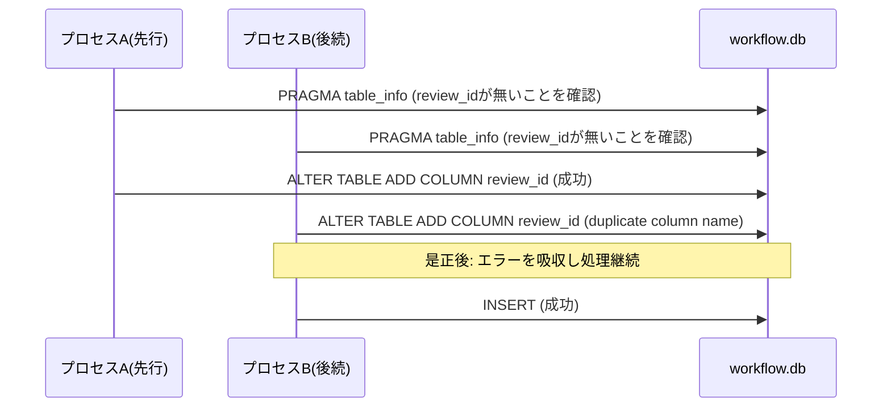

# 要件定義書: write-workflow-log.sh スキーマ移行 ADD COLUMN の冪等性是正

**プロジェクト名**: write-workflow-log.sh スキーマ移行 ADD COLUMN の冪等性是正（親 issue: agentsOS 汎用化・ポリシー統合 のサブ issue）
**作成日**: 2026 年 07 月 12 日
**最終更新**: 2026 年 07 月 12 日

> **重要**: **このドキュメントは常に更新**: 要件の変更や追加があった場合は、即座にこのドキュメントを更新してください。ドキュメントは「生きているドキュメント」として扱い、実装内容と常に同期させます。
>
> **用語**: [.agent-skill-chain/source/CONCEPTS.md §用語規約](../../../../../../.agent-skill-chain/source/CONCEPTS.md#用語規約) を参照。

---

## 1. 概要

### 1.1 システム概要

`write-workflow-log.sh` は workflow.db（SQLite）への 1 行 INSERT のみを行う書記専用ラッパーである。DB が旧スキーマ（`entry_id` カラム無し）から新スキーマへ移行済みかどうかを `PRAGMA table_info` で確認し、不足しているカラム（`document_id` / `issue_id` / `review_id` / `document_path`）があれば `ALTER TABLE ... ADD COLUMN` で追加してから INSERT を行う。本要件は、この「確認してから追加する」二段構成が反復・近接実行時に非アトミックであるために発生する `duplicate column name` エラー（INSERT 失敗・証跡欠落）を、冪等な処理に是正することを対象とする。

### 1.2 用語集

| 用語                 | 説明                                                                                                   |
| -------------------- | ------------------------------------------------------------------------------------------------------ |
| スキーマ移行検知ブロック | `write-workflow-log.sh` 内の、`PRAGMA table_info` の結果を見て不足カラムに `ALTER TABLE ADD COLUMN` を実行する処理（現行 298〜319 行目付近） |
| Check-Then-Act        | 状態を確認（Check）した後、その確認結果に基づいて行動（Act）する処理パターン。確認と行動の間に他プロセスが状態を変えると競合が生じる |
| 冪等（idempotent）    | 同じ操作を複数回実行しても、1 回実行した場合と同じ結果になる性質                                        |
| flaky（不安定）失敗   | 実行条件（タイミング・並走状況）によって成功したり失敗したりする、再現性が一定でない失敗                |
| duplicate column name | sqlite3 が `ALTER TABLE ... ADD COLUMN` 実行時に、対象カラムが既に存在する場合に返すエラーメッセージ    |

---

## 2. 機能要件

### 2.1 ユーザーストーリー

#### ストーリー 1: スキーマ移行ブロックの冪等化

- **As a** 書記（write-workflow-log capability を実行するサブエージェント・スクリプト呼び出し元）
- **I want to** `write-workflow-log.sh` のスキーマ移行検知ブロックが、対象カラムが既に他プロセスにより追加済みの状態で実行されてもエラーにならず処理を継続してほしい
- **So that** 反復・近接実行時にも `duplicate column name` による INSERT 失敗が発生せず、証跡（workflow.db への記録）が確実に残る

**受け入れ基準**:

- 対象カラム（`document_id` / `issue_id` / `review_id` / `document_path`）が既に存在する状態で `ALTER TABLE ... ADD COLUMN` が実行されても、スクリプト全体が `exit 1` で終了しない。
- 上記のケースでも、その後の INSERT 処理（`insert_with_retries` の呼び出し）まで正常に到達する。
- 4 カラムのうちどのカラムで競合が起きても（1 カラムのみ・複数カラム同時のいずれでも）同様に処理が継続する。

#### ストーリー 2: 真のエラーは従来どおり fail-fast する

- **As a** 運用者・監査者
- **I want to** 対象カラムが存在しないにもかかわらず ADD COLUMN が失敗する「本当の異常」（権限不足・ディスク不足・DB 破損等）は、従来どおり検知して停止してほしい
- **So that** 冪等化の導入によって、見過ごしてはならない致命的なエラーがサイレントに握り潰されることを防げる

**受け入れ基準**:

- `duplicate column name`（対象カラムが既に存在することに起因するエラー）以外の理由で `ALTER TABLE ... ADD COLUMN` が失敗した場合は、従来どおり `ERROR: ... マイグレーションに失敗しました。` を stderr に出力して `exit 1` する。
- 上記の判定は、既存の同様パターン（273 行目 `insert_with_retries` 内の `grep -qi "locked\|busy"` によるエラー種別判定）と一貫したスタイルで実装される。

#### ストーリー 3: 移行完了後のスキーマ状態は不変

- **As a** workflow.db の後続利用者（audit.sh・監査・レビュー）
- **I want to** 冪等化の実装によって、最終的なスキーマ（カラム構成・インデックス）が変わらないでほしい
- **So that** 既存の監査ツール・クエリ・スキーマ前提が壊れない

**受け入れ基準**:

- 是正後も、移行完了時点で `document_id` / `issue_id` / `review_id` / `document_path` の 4 カラムが過不足なく存在する。
- 各カラムに対応するインデックス（`idx_workflow_log_document_id` 等）が現行と同名・同定義で作成されている。
- 既存テスト（`test/test-write-workflow-log-multidoc.sh` / `test-write-workflow-log-prevhash.sh` / `test-write-workflow-log-glob.sh` / `test-write-workflow-log-ts-utc.sh`）がすべて通過する（無回帰）。

### 2.2 BDD ユースケース

#### ユースケース 1: 反復実行下でのスキーマ移行 ADD COLUMN 競合

反復・近接実行によって、あるプロセスがカラム追加を確認した直後に別プロセス（または直前の呼び出し）が既に同じカラムを追加済みという状況を疑似再現し、是正後は INSERT 失敗が起きないことを確認する。

**シナリオ 1: カラムが既に存在する状態での ADD COLUMN 実行**

```gherkin
Feature: スキーマ移行 ADD COLUMN の冪等性
  Scenario: 対象カラムが既に存在する状態でスキーマ移行ブロックが実行される
    Given 旧スキーマの workflow.db に対し、既に review_id カラムが ALTER TABLE ADD COLUMN で追加済みである
    When write-workflow-log.sh がスキーマ移行検知ブロックを実行し、review_id が不足していると誤って判定して ALTER TABLE ADD COLUMN を再実行する
    Then スクリプトは exit 1 せず、後続の INSERT 処理まで到達する
    And workflow.db に review_id カラムは 1 つだけ存在する
```

**処理フロー**（必要に応じて）:



**シナリオ 2: 隔離ループでの反復実行による再現確認**

```gherkin
Feature: スキーマ移行 ADD COLUMN の冪等性
  Scenario: セットアップINSERTを隔離ループで複数回反復実行する
    Given 新規作成された旧スキーマの workflow.db が隔離環境に用意されている
    When 同一のセットアップ INSERT（write-workflow-log.sh 呼び出し）を N 回連続で反復実行する
    Then N 回すべてで exit 0 となり、duplicate column name によるエラーが発生しない
    And workflow.db に N 件の記録が過不足なく残っている
```

#### ユースケース 2: 真のエラー（対象カラムが存在しないのに ADD COLUMN が失敗する）の fail-fast 維持

冪等化の導入後も、`duplicate column name` 以外の理由（例: 読み取り専用ファイルシステム・DB 破損）で ADD COLUMN が失敗した場合には、従来どおり明確に失敗することを確認する。

**シナリオ 1: duplicate column name 以外のエラーでの fail-fast**

```gherkin
Feature: スキーマ移行の真のエラー検知
  Scenario: duplicate column name 以外の理由で ALTER TABLE ADD COLUMN が失敗する
    Given 対象カラムが存在しない旧スキーマの workflow.db が、書き込み不可な状態（疑似異常系）になっている
    When write-workflow-log.sh がスキーマ移行検知ブロックを実行し ALTER TABLE ADD COLUMN を試みる
    Then duplicate column name 以外のエラーであるため、スクリプトは ERROR メッセージを stderr に出力して exit 1 する
    And INSERT 処理は実行されない
```

**シナリオ 2: 正常系（初回移行）の無回帰確認**

```gherkin
Feature: スキーマ移行の正常系
  Scenario: 対象カラムが存在しない旧スキーマから初回の移行を行う
    Given 対象カラム（document_id / issue_id / review_id / document_path）がいずれも存在しない旧スキーマの workflow.db が用意されている
    When write-workflow-log.sh を実行する
    Then 4 カラムがすべて追加され、対応するインデックスが作成される
    And 後続の INSERT が exit 0 で成功する
```

### 2.3 ビジネスルール

- 冪等化の対象は「対象カラムが既に存在することに起因する ADD COLUMN の失敗」のみであり、それ以外の失敗要因を握り潰してはならない（01 §7.1 リスク対策・ストーリー 2 の受け入れ基準）。
- 移行完了後の最終スキーマ状態（カラム構成・インデックス）は改修前後で同一でなければならない（ストーリー 3）。
- CHECK 制約再作成ロジック（`review-docs` / `create-pr-review-issue` 用テーブル再作成、現行 314 行目以降）は本要件の対象外であり、変更・影響を与えない。

---

## 3. 非機能要件

### 3.1 パフォーマンス要件

- 冪等化・エラー判定の追加によるオーバーヘッドは、スクリプト実行時間に体感可能な影響（数百 ms 超）を与えないこと。
- リトライ方式を採用する場合、リトライ上限・待機時間は既存の `insert_with_retries`（`MAX_RETRIES` / `RETRY_SLEEP_SEC`）と同等の桁数に収め、無限リトライを行わないこと。

### 3.2 セキュリティ要件

- 変更はスキーマ移行検知ブロックの堅牢化に限定し、SQL 組み立て・`AGENT_ROLE=scribe` 認可ガード等、既存のセキュリティ設計を変更しないこと。

### 3.3 ユーザビリティ要件

- 冪等化によって握り込まれたエラー（対象カラムが既に存在するために発生した `duplicate column name`）は、真のエラーと区別可能な形で扱い、真のエラー発生時のエラーメッセージは既存の文言スタイル（`ERROR: ... マイグレーションに失敗しました。`）を維持すること。

### 3.4 可用性要件

- 反復・近接実行（同一 issue 内での複数成果物記録・複数サブエージェントの並走等）が発生しても、スキーマ移行起因で INSERT が失敗し証跡が失われる状態を解消すること（01 §6 成功基準 1・2 に対応）。

---

## 4. 外部インターフェース要件

### 4.1 API 要件

- `write-workflow-log.sh` の位置引数・環境変数インターフェース（Usage コメント、1〜10 行目）は変更しない。

### 4.2 データ形式要件

- workflow.db のスキーマ（`ledger/schema.sql` が正本）のカラム定義・型は変更しない。移行完了後の状態を維持したまま、移行処理の堅牢性のみを是正する。

---

## 5. 制約事項

- bash（`set -euo pipefail`）＋ sqlite3 CLI の範囲で実装し、新規の外部依存を追加しない（00 §4.1）。
- 変更対象は `.agent-skill-chain/source/scripts/write-workflow-log.sh` のスキーマ移行検知ブロックに限定する（00 §4.1）。
- `.agent-skill-chain/source/scribe/CONTRACT.md`・`.agent-skill-chain/source/ledger/schema.sql`・`.agent-skill-chain/source/enforcement/ci/audit.sh` は変更しない（00 §4.1・§5）。

---

## 6. 参考資料

### プロジェクトドキュメント

- [`00_要求定義.md`](./00_要求定義.md) - 要求定義

### その他の参考資料

- 検出元: [`../20260711_055602_write-workflow-log_ts_utc検証/04_review.md`](../20260711_055602_write-workflow-log_ts_utc検証/04_review.md) §3.3・§4.2 指摘 2・§10.1 課題 1
- [.agent-skill-chain/source/scripts/write-workflow-log.sh](../../../../../../.agent-skill-chain/source/scripts/write-workflow-log.sh) - 改修対象
- [.agent-skill-chain/source/ledger/schema.sql](../../../../../../.agent-skill-chain/source/ledger/schema.sql) - スキーマ正本（変更なし）

---

## 7. 前のステップ

この要件定義書は、以下のドキュメントを基に作成されています：

- **前**: [`00_要求定義.md`](./00_要求定義.md) - 要求定義フェーズ

---

## 8. 次のステップ

この要件定義書の承認後、以下のドキュメントを作成します：

- **次**: [`02_設計.md`](./02_設計.md) - 設計フェーズ
