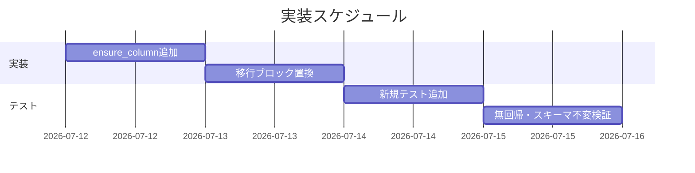
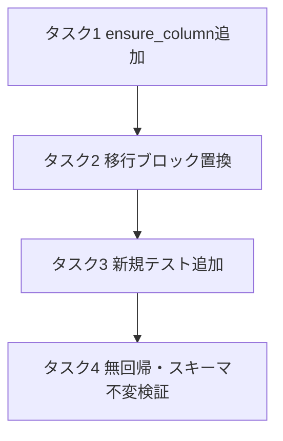

# 実装計画書: write-workflow-log.sh スキーマ移行 ADD COLUMN の冪等性是正

**プロジェクト名**: write-workflow-log.sh スキーマ移行 ADD COLUMN の冪等性是正（親 issue: agentsOS 汎用化・ポリシー統合 のサブ issue）
**作成日**: 2026 年 07 月 12 日
**最終更新**: 2026 年 07 月 12 日

> **重要**: **このドキュメントは常に更新**: 実装計画の変更、進捗状況の更新、バグの記録などがあった場合は、即座にこのドキュメントを更新してください。ドキュメントは「生きているドキュメント」として扱い、実装内容と常に同期させます。
> **必須項目**: 「必須」と明記した欄は空欄・抽象語のみで提出しないこと。テスト観点・BDD 仕様は具体ケースを 1 件以上記載すること。
>
> **用語**: [.agent-skill-chain/source/CONCEPTS.md §用語規約](../../../../../../.agent-skill-chain/source/CONCEPTS.md#用語規約) を参照。

---

## 1. 実装概要

### 1.1 実装方針（必須）

02_設計に従い、スキーマ移行検知ブロック（現行 298〜312 行目）へ `ensure_column <db> <col>` ヘルパー関数を導入し、`document_path` の不整合フォールバックを含む同型 4 ブロックを 4 行の宣言的委譲へ置換する。冪等化は「追加試行→失敗時 `PRAGMA table_info` 再確認（try-then-recheck・メッセージ非依存）」で行い、真のエラーのみ従来どおり `exit 1` する。変更は当該ブロックと関数定義追加に限定し、`ledger/schema.sql`・`CONTRACT.md`・`audit.sh`・CHECK 制約再作成ブロック（314 行目以降）・`insert_with_retries` 本体・位置引数/環境変数 IF は変更しない。

### 1.2 実装順序（必須: 1 件以上）

1. タスク 1: `ensure_column` ヘルパー関数の追加
2. タスク 2: スキーマ移行検知ブロックの `ensure_column` 委譲への置換（`document_path` フォールバック廃止）
3. タスク 3: 新規テスト `test/test-write-workflow-log-schema-idempotent.sh` の追加
4. タスク 4: 既存テスト無回帰確認と移行後スキーマ不変の検証



---

## 2. タスク分解

**必須**: 各タスクには「テスト観点」（2.x.3）と「単体テスト仕様（BDD）」（2.x.4）を必ず記載する。観点の定義は 02_設計 §6 および [RULES](../../../../../../.agent-skill-chain/source/RULES.md#テスト戦略必須要件) / [TEST_BDD_FORMAT.md](../../../../../../.agent-skill-chain/source/TEST_BDD_FORMAT.md) を参照し、本書ではタスクごとの具体ケースのみ記載する。

### 2.1 タスク 1: `ensure_column` ヘルパー関数の追加

#### 2.1.1 概要（必須）

指定カラムを workflow_log に冪等に存在保証する 1 責務の関数を、`insert_with_retries` 定義直後（呼び出しより前）に追加する。

#### 2.1.2 実装内容（必須: 1 件以上）

- `ensure_column() { ... }` を追加（引数 `$1`=DB パス、`$2`=カラム名）。ロジックは 02 §3.1.2 のフロー:
  1. `PRAGMA table_info` でカラム一覧を取得し、対象カラムが既存なら `return 0`（現行 skip 挙動維持）。
  2. `ALTER TABLE workflow_log ADD COLUMN <col> TEXT NULL; CREATE INDEX IF NOT EXISTS idx_workflow_log_<col> ON workflow_log(<col>);` を `if ...; then return 0; fi` の条件文で試行。
  3. 失敗時は `PRAGMA table_info` を再取得。対象カラムが存在すれば `CREATE INDEX IF NOT EXISTS`（中断された index 作成を補完）し `return 0`。存在しなければ `echo "ERROR: <col> マイグレーションに失敗しました。" >&2; return 1`。
- 既存関数と同じ記述スタイル（`local` 変数・小文字スネークケース・`sqlite3 -separator $'\t' ... | awk -F '\t' '{print $2}'`）を踏襲する。
- 参考実装（言語=bash）:

```bash
# 指定カラム＋インデックスを冪等に存在保証する（Check-Then-Act 競合を再確認で吸収）。
# duplicate column name は競合とみなし成功へ収束、それ以外の真の失敗のみ return 1。
ensure_column() {
  local db="$1" col="$2"
  local idx="idx_workflow_log_${col}"
  local cols
  cols="$(sqlite3 -separator $'\t' "$db" "PRAGMA table_info(workflow_log);" 2>/dev/null | awk -F '\t' '{print $2}')"
  if printf '%s' "$cols" | grep -qx "$col"; then
    return 0                                  # 既存: 現行 skip 挙動を維持
  fi
  if sqlite3 "$db" "ALTER TABLE workflow_log ADD COLUMN ${col} TEXT NULL; CREATE INDEX IF NOT EXISTS ${idx} ON workflow_log(${col});" 2>/dev/null; then
    return 0
  fi
  # ADD COLUMN 失敗: メッセージ非依存で table_info を再確認
  cols="$(sqlite3 -separator $'\t' "$db" "PRAGMA table_info(workflow_log);" 2>/dev/null | awk -F '\t' '{print $2}')"
  if printf '%s' "$cols" | grep -qx "$col"; then
    sqlite3 "$db" "CREATE INDEX IF NOT EXISTS ${idx} ON workflow_log(${col});" >/dev/null 2>&1 || true
    return 0                                  # 競合で他プロセスが追加済み
  fi
  echo "ERROR: ${col} マイグレーションに失敗しました。" >&2
  return 1                                    # 真のエラー
}
```

#### 2.1.3 テスト観点（必須）

**参照**: 観点定義は [02_設計 §6](./02_設計.md) および [RULES / TEST_BDD_FORMAT](../../../../../../.agent-skill-chain/source/RULES.md#テスト戦略必須要件)。以下は本タスクの具体ケース。

##### 単体（本タスクの具体ケース・必須 1 件以上）

- T-1 正常系（skip 経路・単一プロセスで決定的）: 対象カラムが**既存**の DB で `ensure_column` を通過すると、fast-path（既存チェック）で `return 0` し ALTER を試行せず exit 1 しない。カラムは 1 つのまま。
- T-2 正常系（新規追加経路・単一プロセスで決定的）: 対象カラムが**不足**する DB で `ensure_column` を通過すると、ALTER が成功し `return 0`（＝recovery 分岐に入らない通常経路）。カラム＋インデックスが 1 つずつ作成される。
- **注意（recovery 分岐の到達可能性）**: `ensure_column` の「ALTER 失敗→`table_info` 再確認→存在すれば `return 0`」という**recovery 分岐（本 issue の核心）は、単一プロセスでは到達不能**である。fast-path（開始時の存在チェック）が「不足」と判定した後に ALTER が `duplicate column name` で失敗するには、チェックと ALTER の**間に別プロセスが同一カラムを追加済み**である必要があり、これは**真の並走**でしか生じない。さらに本スクリプトは同一 `WF_DB` に対し flock 排他（250〜252 行目）で移行ブロックを**直列化**するため、flock が有効な同一ホスト内では並走しても競合窓が開かない（02 ADR-1 の「flock で直列化・冪等化は flock 不在/別ホスト NFS で効く」に対応）。したがって recovery 分岐の**実行時再現には「並列実行＋flock 無効化」が必須**であり、これを T-3 で担う。recovery 分岐のロジック妥当性自体は**コードレビュー**でも判定する（00 §6 成功基準 5 が「コードレビューおよび疑似異常系テストで判定」を許容）。
- T-4 異常系（真のエラーで fail-fast）: 書込不可な DB では、スクリプトは exit 1 で失敗し INSERT に到達しない（証跡が記録されない）。**ただし実測（sqlite3 3.45.1）では読み取り専用 DB は移行ブロック手前の `PRAGMA journal_mode=WAL`（290 行目）で `attempt to write a readonly database`（exit 8）となり `set -e` で先に停止する**ため、`ensure_column` の `ERROR: ... マイグレーションに失敗しました。` メッセージ自体は出力されない。よって T-4 は「書込不可 → exit≠0・INSERT 未実行・行数不変」を検証し、**移行ブロック固有の ERROR メッセージ分岐（recheck でも不在→`return 1`）はコードレビューで担保**する（00 §6 成功基準 5 の許容方式）。移行ブロックに限定して真のエラーを実行時再現したい場合は、`ensure_column` を関数単体で呼べるよう source 可能化した上で読み取り専用 DB に対し直接呼ぶ（WAL 強制を経由しないため ALTER 段で `readonly`（duplicate 以外）となり `return 1`＋メッセージを決定的に再現できる）方式を任意で追加する。

##### 結合/API（本タスクの具体ケース・該当時は必須 1 件以上）

- `write-workflow-log.sh` を実際に `requirement-discovery` command で呼び、移行ブロック→INSERT の一連が成功することを exit code・行数で確認（T-2/T-5 で実施）。

##### E2E/受け入れ（本タスクの具体ケース・未達時は理由記載）

- 該当なし（CLI スクリプト内部関数のため E2E 層は設けない。反復実行の受け入れは T-3 の並列反復（flock 無効化）で担保）。

##### バリデーション（該当する場合の具体ケース）

- カラム名は呼び出し側リテラル固定の 4 値のみ（外部入力なし）。入力バリデーションの新規追加は該当なし。

#### 2.1.4 単体テスト仕様（BDD）（必須）

**BDD 形式のテストケース（高レベル仕様・単一プロセスで決定的な skip 経路）**:

> UC1 S1（並走で ALTER が `duplicate column name` になり recheck で吸収される recovery 分岐）は**単一プロセスでは到達不能**（本節冒頭「recovery 分岐の到達可能性」）のため、その実行時再現は T-3（並列＋flock 無効化）で行う。ここでは fast-path の skip 経路（既存カラムでは ALTER を試行せず exit 1 しない＝冪等契約）を決定的に検証する。

```gherkin
Feature: ensure_column によるカラムの冪等存在保証
  Scenario: 対象カラムが既に存在する状態で移行ブロックを通過する（idempotent 契約・fast-path skip）
    Given 移行対象 4 カラムがすべて存在する（＝移行済みの）workflow.db がある
    When write-workflow-log.sh がスキーマ移行検知ブロックを実行する
    Then ensure_column は fast-path で return 0 し ALTER を試行せず、スクリプトは exit 1 せず INSERT まで到達する
    And workflow.db に review_id カラムは 1 つだけ存在する
```

**テストコード例（必須: インラインコメントで Given/When/Then を明記）**

```bash
# Given: 移行済み(全カラム存在)の隔離 DB を用意する（fast-path skip 経路を通す）
TMP="$(mktemp -d)"; DB="$TMP/.agent-skill-chain/runtime/workflow.db"; mkdir -p "$(dirname "$DB")"
sqlite3 "$DB" < "$SCHEMA"                                  # 新スキーマ正本(4 カラム込み)を流す＝全カラム存在

# When: write-workflow-log.sh を呼び、移行ブロックを通過させる（各 ensure_column は fast-path skip）
rc=0
PROJECT_ROOT="$TMP" AGENT_ROLE=scribe \
  DOCUMENT_ID="11111111-1111-1111-1111-111111111111" \
  DOCUMENT_PATH=".agent-skill-chain/runtime/x/02_設計.md" \
  "$WWL" design-feature "skip 経路テスト" 1 "2026-07-12T00:00:00Z" >/dev/null 2>&1 || rc=$?

# Then: exit 0 で INSERT まで到達し、review_id カラムは 1 つだけ（ALTER は試行されない）
assert_eq "$rc" "0" "既存カラムでも exit 0（skip）"
col_cnt="$(sqlite3 -separator $'\t' "$DB" "PRAGMA table_info(workflow_log);" | awk -F '\t' '$2=="review_id"' | wc -l)"
assert_eq "$col_cnt" "1" "review_id カラムは 1 つだけ"
rm -rf "$TMP"
```

#### 2.1.5 依存関係

- 依存タスクなし（先頭タスク）。タスク 2 が本タスクに依存。



#### 2.1.6 見積もり

- **工数**: 0.5 時間
- **優先度**: 高

### 2.2 タスク 2: スキーマ移行検知ブロックの `ensure_column` 委譲への置換

#### 2.2.1 概要（必須）

現行 302〜311 行目の同型 4 ブロック（`document_path` の不整合フォールバック含む）を `ensure_column ... || exit 1` の 4 行に置換する。

#### 2.2.2 実装内容（必須: 1 件以上）

- `HAS_NEW_SCHEMA` 分岐内・CHECK 制約再作成ブロック（314 行目以降）より前を以下へ置換:

```bash
if [[ -n "$HAS_NEW_SCHEMA" ]]; then
  ensure_column "$WF_DB" document_id   || exit 1
  ensure_column "$WF_DB" issue_id      || exit 1
  ensure_column "$WF_DB" review_id     || exit 1
  ensure_column "$WF_DB" document_path || exit 1
  # （以降の CHECK 制約再作成ブロックは現行のまま変更しない）
```

- 現行 300 行目の `CURRENT_COLS` 取得は `ensure_column` 内へ内包されるため呼び出し側からは削除（未使用変数を残さない）。
- `document_path`（現行 311 行目）の「index 無し ALTER 再試行」フォールバックは廃止し、他 3 カラムと同一経路に統一する（02 ADR-2）。

#### 2.2.3 テスト観点（必須）

##### 単体（本タスクの具体ケース・必須 1 件以上）

- T-5 正常系初回移行: 4 カラム不在の旧スキーマ DB に対し実行すると、4 カラムすべてが追加され対応インデックスが作成され、INSERT が exit 0 で成功する。
- 置換後も CHECK 制約再作成ブロック（`review-docs`/`create-pr-review-issue`）が現行どおり動作する（回帰なし）。

##### 結合/API（本タスクの具体ケース・該当時は必須 1 件以上）

- `review-docs` command で呼び出し、移行ブロック→CHECK 再作成→INSERT が exit 0 で通ることを確認（スコープ外ブロックへの非影響確認）。

##### E2E/受け入れ（本タスクの具体ケース・未達時は理由記載）

- 該当なし（理由: 内部ロジック変更で UI/E2E 面が無い。受け入れは T-3 の並列反復（flock 無効化）で担保）。

##### バリデーション（該当する場合の具体ケース）

- 該当なし。

#### 2.2.4 単体テスト仕様（BDD）（必須）

```gherkin
Feature: スキーマ移行の正常系（初回移行）
  Scenario: 4 カラムが存在しない旧スキーマから初回移行する（01 UC2 S2）
    Given document_id / issue_id / review_id / document_path がいずれも存在しない旧スキーマの workflow.db がある
    When write-workflow-log.sh を実行する
    Then 4 カラムがすべて追加され対応インデックスが作成される
    And 後続の INSERT が exit 0 で成功する
```

**テストコード例（必須: インラインコメントで Given/When/Then を明記）**

```bash
# Given: 4 カラムが無い旧スキーマ(entry_id あり・移行対象カラム無し)の隔離 DB を用意する
TMP="$(mktemp -d)"; DB="$TMP/.agent-skill-chain/runtime/workflow.db"; mkdir -p "$(dirname "$DB")"
sqlite3 "$DB" "CREATE TABLE workflow_log (entry_id TEXT PRIMARY KEY, ts_utc TEXT NOT NULL, created_at TEXT NOT NULL, actor_role TEXT NOT NULL, delegated_by_role TEXT NOT NULL, command TEXT NOT NULL, summary TEXT NOT NULL, dod_met INTEGER NOT NULL, entry_hash TEXT NOT NULL);"

# When: write-workflow-log.sh を実行し移行→INSERT させる
rc=0
PROJECT_ROOT="$TMP" AGENT_ROLE=scribe \
  DOCUMENT_ID="22222222-2222-2222-2222-222222222222" \
  DOCUMENT_PATH=".agent-skill-chain/runtime/x/02_設計.md" \
  "$WWL" design-feature "初回移行テスト" 1 "2026-07-12T00:00:00Z" >/dev/null 2>&1 || rc=$?

# Then: exit 0 で 4 カラム＋各インデックスが存在し 1 行 INSERT される
assert_eq "$rc" "0" "初回移行は exit 0"
for c in document_id issue_id review_id document_path; do
  has="$(sqlite3 -separator $'\t' "$DB" "PRAGMA table_info(workflow_log);" | awk -F '\t' -v c="$c" '$2==c' | wc -l)"
  assert_eq "$has" "1" "カラム $c が存在"
  idx="$(sqlite3 "$DB" "PRAGMA index_list(workflow_log);" | grep -c "idx_workflow_log_$c" || true)"
  assert_eq "$idx" "1" "インデックス idx_workflow_log_$c が存在"
done
assert_eq "$(sqlite3 "$DB" 'SELECT COUNT(*) FROM workflow_log;')" "1" "1 行 INSERT される"
rm -rf "$TMP"
```

#### 2.2.5 依存関係

- タスク 1 に依存（`ensure_column` 定義が前提）。

#### 2.2.6 見積もり

- **工数**: 0.5 時間
- **優先度**: 高

### 2.3 タスク 3: 新規テスト `test-write-workflow-log-schema-idempotent.sh` の追加

#### 2.3.1 概要（必須）

スキーマ移行冪等性の正常系（skip・通常追加）・競合 recovery の並列再現（flock 無効化）・真のエラー fail-fast を検証するテストを `test/` に追加する。

#### 2.3.2 実装内容（必須: 1 件以上）

- `test/test-write-workflow-log-schema-idempotent.sh` を新規作成。既存 `test-write-workflow-log-ts-utc.sh` の構造（`REPO_ROOT`/`WWL`/`SCHEMA` 解決、`ok`/`ng`/`assert_eq`、`mktemp -d` 隔離、本番 DB 非破壊の前後計測）を踏襲する。
- 収録ケース: T-1（既存カラム skip・単一プロセスで決定的）、T-2（不足カラムの通常追加・単一プロセスで決定的）、**T-3（競合 recovery の実行時再現＝「並列実行＋flock 無効化」でセットアップ INSERT を N 並列 × M ラウンド反復し、全 exit 0・`duplicate column name` 失敗 0 件・記録件数一致）**、T-4（書込不可 DB で fail-fast＝exit≠0・INSERT 未実行・行数不変。移行ブロック固有 ERROR メッセージ分岐はコードレビューで担保）、T-5（初回移行で 4 カラム＋インデックス作成・INSERT 成功、`index_list` で不変確認）、T-6（本番 workflow.db の行数・mtime 不変）。
- **T-3 の競合窓を開く条件（必須）**: 本スクリプトは同一 `WF_DB` に対し flock（250〜252 行目）で移行ブロックを直列化するため、flock 有効下では並列でも競合しない。実行時再現には flock を無効化する必要がある（推奨: `exit 0` だけの no-op `flock` シムを `PATH` 先頭に置く。実バイナリを温存しつつ `flock -x` を無効化でき、`flock` 不在環境の疑似再現より堅牢。§2.3.4 参照）。並列は `&` でバックグラウンド起動し `wait` で回収する。競合はタイミング依存で毎回は発火しないため、N（例 10〜20）並列 × M（例 5）ラウンドで発火確率を上げる。**フィックス版では競合が発火しても recovery で吸収され失敗 0 件**（バグ版では散発的に `duplicate column name` 失敗＝判別可能）。recovery 分岐のロジック妥当性は §2.1.3 の注記どおりコードレビューでも判定する（00 §6 成功基準 5）。
- T-4 の「書込不可」疑似は読み取り専用 DB ファイル（`chmod 444`）等で実現するが、**実測（sqlite3 3.45.1）では読み取り専用 DB は移行ブロック手前の `PRAGMA journal_mode=WAL`（290 行目）で `attempt to write a readonly database`（exit 8）となり `set -e` で先に停止する**。したがって T-4 は「exit≠0・INSERT 未実行（行数不変）」を検証対象とし、移行ブロック固有の `ERROR: <col> マイグレーションに失敗しました。` の出力までは要求しない（当該メッセージ分岐＝recheck でも不在時の `return 1` は §2.1.3 のとおりコードレビューで担保）。

#### 2.3.3 テスト観点（必須）

##### 単体（本タスクの具体ケース・必須 1 件以上）

- T-3 競合 recovery 再現（並列＋flock 無効化）: 新規旧スキーマ DB に同一セットアップ INSERT を N 並列 × M ラウンドで実行し、全て exit 0・stderr に `duplicate column name` が 0 件・`SELECT COUNT(*)` が総投入件数と一致。
- T-4: 書込不可状態でスクリプトが fail-fast（exit≠0）し INSERT 行が増えない（行数不変）。移行ブロック固有 ERROR メッセージ分岐はコードレビューで担保（§2.1.3・§2.3.2）。

##### 結合/API（本タスクの具体ケース・該当時は必須 1 件以上）

- 各ケースは `write-workflow-log.sh` を実 command 引数で起動する結合レベル（スクリプト全体を経路として使用）。

##### E2E/受け入れ（本タスクの具体ケース・未達時は理由記載）

- 並列反復＋flock 無効化（T-3）が 00 §6 成功基準 1/2 の受け入れ確認に相当。

##### バリデーション（該当する場合の具体ケース）

- 該当なし。

#### 2.3.4 単体テスト仕様（BDD）（必須）

```gherkin
Feature: スキーマ移行 ADD COLUMN の冪等性（並列＋flock 無効化による競合 recovery 再現）
  Scenario: セットアップ INSERT を並列実行し ADD COLUMN 競合を発火させる（01 UC1 S1/S2）
    Given 新規作成された旧スキーマの workflow.db が隔離環境に用意されている
    And flock が無効化されている（移行ブロックが直列化されず競合窓が開く）
    When 同一のセットアップ INSERT を N 並列 × M ラウンドで実行する
    Then すべての呼び出しが exit 0 となり duplicate column name による失敗が 0 件である
    And workflow.db に総投入件数と一致する記録が過不足なく残っている

Feature: スキーマ移行の真のエラー検知（fail-fast）
  Scenario: 書込不可な DB でスクリプトが fail-fast する（01 UC2 S1）
    Given 対象カラムが存在しない旧スキーマの workflow.db が読み取り専用（書き込み不可）である
    When write-workflow-log.sh を実行する
    Then スクリプトは exit≠0 で停止し INSERT 処理は実行されない（行数不変）
    # ※ 実測では移行手前の PRAGMA journal_mode=WAL が readonly で先に停止する。
    #    ensure_column の "マイグレーションに失敗しました。" 分岐はコードレビューで担保（00 §6 SC5）。
```

**テストコード例（必須: インラインコメントで Given/When/Then を明記）**

```bash
# --- T-3: 競合 recovery 再現（並列＋flock 無効化） ---
# Given: no-op の flock シムを PATH 先頭に置き、移行ブロックの直列化を無効化する（競合窓を開く）
#   ※ 実バイナリは温存しつつ flock だけ無効化できるため PATH 全体の張り替えより堅牢。
SHIM="$(mktemp -d)"; printf '#!/usr/bin/env bash\nexit 0\n' > "$SHIM/flock"; chmod +x "$SHIM/flock"
fail=0
# When: M ラウンド × N 並列で同一セットアップ INSERT を実行する
for round in 1 2 3 4 5; do
  TMP="$(mktemp -d)"; DB="$TMP/.agent-skill-chain/runtime/workflow.db"; mkdir -p "$(dirname "$DB")"
  sqlite3 "$DB" "CREATE TABLE workflow_log (entry_id TEXT PRIMARY KEY, ts_utc TEXT NOT NULL, created_at TEXT NOT NULL, actor_role TEXT NOT NULL, delegated_by_role TEXT NOT NULL, command TEXT NOT NULL, summary TEXT NOT NULL, dod_met INTEGER NOT NULL, entry_hash TEXT NOT NULL);"
  pids=(); errf="$TMP/err"; mkdir -p "$errf"
  for i in $(seq 1 12); do                 # N=12 並列
    ( PATH="$SHIM:$PATH" PROJECT_ROOT="$TMP" AGENT_ROLE=scribe \
        DOCUMENT_ID="$(printf '3333333%d-3333-3333-3333-3333333333%02d' "$round" "$i")" \
        DOCUMENT_PATH=".agent-skill-chain/runtime/x/02_設計.md" \
        "$WWL" design-feature "並列 $round-$i" 1 "2026-07-12T00:00:00Z" 2>"$errf/$i" 1>/dev/null ) &
    pids+=($!)
  done
  for pid in "${pids[@]}"; do wait "$pid" || fail=1; done   # いずれか非0なら fail
  grep -rqi "duplicate column" "$errf" && fail=1            # duplicate 失敗は 0 件であること
  cnt="$(sqlite3 "$DB" 'SELECT COUNT(*) FROM workflow_log;')"
  assert_eq "$cnt" "12" "ラウンド $round は 12 件記録"
  rm -rf "$TMP"
done
# Then: 全 exit 0・duplicate 0 件（フィックス版では競合が発火しても recovery で吸収）
assert_eq "$fail" "0" "並列反復で失敗・duplicate なし"
rm -rf "$SHIM"

# --- T-4: 真のエラー fail-fast（読み取り専用 DB） ---
# Given: 対象カラム無しの旧スキーマ DB を読み取り専用にする
TMP="$(mktemp -d)"; WFDIR="$TMP/.agent-skill-chain/runtime"; mkdir -p "$WFDIR"; DB="$WFDIR/workflow.db"
sqlite3 "$DB" "CREATE TABLE workflow_log (entry_id TEXT PRIMARY KEY, ts_utc TEXT NOT NULL, created_at TEXT NOT NULL, actor_role TEXT NOT NULL, delegated_by_role TEXT NOT NULL, command TEXT NOT NULL, summary TEXT NOT NULL, dod_met INTEGER NOT NULL, entry_hash TEXT NOT NULL);"
before="$(sqlite3 "$DB" 'SELECT COUNT(*) FROM workflow_log;')"
chmod 444 "$DB"                            # DB ファイルを読み取り専用に（書込を失敗させる）
# When: 実行する
rc=0
PROJECT_ROOT="$TMP" AGENT_ROLE=scribe \
  DOCUMENT_ID="44444444-4444-4444-4444-444444444444" \
  DOCUMENT_PATH=".agent-skill-chain/runtime/x/02_設計.md" \
  "$WWL" design-feature "真のエラーテスト" 1 "2026-07-12T00:00:00Z" >/dev/null 2>&1 || rc=$?
chmod 644 "$DB"                            # 後片付けのため権限を戻す
after="$(sqlite3 "$DB" 'SELECT COUNT(*) FROM workflow_log;')"
# Then: exit≠0 で停止し、行数不変（INSERT 未実行）
[ "$rc" -ne 0 ] && ok "書込不可は fail-fast（exit≠0）" || ng "fail-fast しなかった（rc=$rc）"
assert_eq "$after" "$before" "行数不変（INSERT 未実行）"
rm -rf "$TMP"
```

> **注 1（T-3 の発火性）**: 競合はタイミング依存のため、フィックス版では常に成功（失敗 0 件）に収束する一方、バグ版で確実に発火させるにはラウンド数 M・並列度 N を増やす。発火しない実行があっても、recovery 分岐のロジック妥当性はコードレビューで別途判定する（§2.1.3・00 §6 SC5）。**flock を無効化しないと移行ブロックが直列化され競合窓が開かない**点に注意。
> **注 2（T-4 の環境依存）**: root 実行では `chmod 444` の書込制限が効かないことがある。その場合は存在しないディレクトリ配下の DB パス等、別手段で書込を確実に失敗させる。いずれの場合も検証対象は「exit≠0・行数不変」であり、移行ブロック固有 ERROR メッセージの出力は要求しない（コードレビューで担保）。

#### 2.3.5 依存関係

- タスク 1・2 に依存（是正後スクリプトを対象に検証）。

#### 2.3.6 見積もり

- **工数**: 1.5 時間
- **優先度**: 高

### 2.4 タスク 4: 既存テスト無回帰・移行後スキーマ不変の検証

#### 2.4.1 概要（必須）

既存 4 テストの全通過と、移行後スキーマ（4 カラム＋インデックス）が改修前後で同一であることを検証する。

#### 2.4.2 実装内容（必須: 1 件以上）

- 既存テストを実行し全通過を確認: `test/test-write-workflow-log-multidoc.sh` / `test-write-workflow-log-prevhash.sh` / `test-write-workflow-log-glob.sh` / `test-write-workflow-log-ts-utc.sh`（`test/` の runner があればそれで一括実行）。
- 移行後スキーマ不変の証跡: 改修前後それぞれで初回移行を実行し `PRAGMA table_info(workflow_log)` と `PRAGMA index_list(workflow_log)` の出力が一致することを diff で確認（成功基準 3）。
- 新規テスト `test-write-workflow-log-schema-idempotent.sh` の全 PASS を確認。

#### 2.4.3 テスト観点（必須）

##### 単体（本タスクの具体ケース・必須 1 件以上）

- 既存 4 テストが FAIL 0 で通過する。

##### 結合/API（本タスクの具体ケース・該当時は必須 1 件以上）

- 改修前 HEAD 版と改修後版で、初回移行後の `table_info`/`index_list` 出力が同一（回帰なし）。

##### E2E/受け入れ（本タスクの具体ケース・未達時は理由記載）

- 該当なし（無回帰確認のためのテスト実行タスク）。

##### バリデーション（該当する場合の具体ケース）

- 該当なし。

#### 2.4.4 単体テスト仕様（BDD）（必須）

```gherkin
Feature: 移行後スキーマの不変性（無回帰）
  Scenario: 改修前後で移行後スキーマ状態が同一である（01 ストーリー3・成功基準3）
    Given 対象カラムが存在しない旧スキーマ DB を 2 つ用意する（片方 HEAD 版・片方是正版で移行）
    When それぞれで write-workflow-log.sh により初回移行を行う
    Then PRAGMA table_info と PRAGMA index_list の出力が両者で一致する
```

**テストコード例（必須: インラインコメントで Given/When/Then を明記）**

```bash
# Given: 是正版で初回移行済みの DB を用意し、期待スキーマを取得する
TMP="$(mktemp -d)"; DB="$TMP/.agent-skill-chain/runtime/workflow.db"; mkdir -p "$(dirname "$DB")"
sqlite3 "$DB" "CREATE TABLE workflow_log (entry_id TEXT PRIMARY KEY, ts_utc TEXT NOT NULL, created_at TEXT NOT NULL, actor_role TEXT NOT NULL, delegated_by_role TEXT NOT NULL, command TEXT NOT NULL, summary TEXT NOT NULL, dod_met INTEGER NOT NULL, entry_hash TEXT NOT NULL);"
PROJECT_ROOT="$TMP" AGENT_ROLE=scribe DOCUMENT_ID="55555555-5555-5555-5555-555555555555" \
  DOCUMENT_PATH=".agent-skill-chain/runtime/x/02_設計.md" \
  "$WWL" design-feature "スキーマ不変テスト" 1 "2026-07-12T00:00:00Z" >/dev/null 2>&1
# When: 移行後の table_info / index_list を取得する
info="$(sqlite3 "$DB" 'PRAGMA table_info(workflow_log);')"
idx="$(sqlite3 "$DB" 'PRAGMA index_list(workflow_log);' | grep -o 'idx_workflow_log_[a-z_]*' | sort)"
# Then: 4 カラムと 4 インデックスが期待どおり存在する（HEAD 版 diff は実装時に実施）
for c in document_id issue_id review_id document_path; do echo "$info" | grep -q "|$c|" && ok "col $c" || ng "col $c 欠落"; done
for c in document_id issue_id review_id document_path; do echo "$idx" | grep -qx "idx_workflow_log_$c" && ok "idx $c" || ng "idx $c 欠落"; done
rm -rf "$TMP"
```

#### 2.4.5 依存関係

- タスク 1〜3 に依存。

#### 2.4.6 見積もり

- **工数**: 0.5 時間
- **優先度**: 高

---

## テスト観点

本実装計画全体のテスト観点の要約（各タスク §2.x.3 に具体ケース）:

- **冪等性（クリティカル）**: 既存カラム skip（T-1）・不足カラムの通常追加（T-2）・競合 recovery の実行時再現＝並列＋flock 無効化での 0 失敗（T-3）＋recovery 分岐のコードレビュー。
- **fail-fast 維持（クリティカル）**: 書込不可 DB で exit≠0・INSERT 未実行・行数不変（T-4）＋移行ブロック固有 ERROR メッセージ分岐のコードレビュー。
- **無回帰（回帰）**: 初回移行の 4 カラム＋インデックス生成（T-5）、移行後スキーマ不変、既存 4 テスト全通過、本番 DB 非破壊（T-6）。

## 単体テスト

`ensure_column` の 4 経路を次で担保する: 既存 skip（T-1・単一プロセスで決定的）／追加成功（T-2・単一プロセスで決定的）／失敗後再確認で成功＝recovery（T-3・並列＋flock 無効化での実行時再現＋コードレビュー。単一プロセスでは到達不能）／失敗後再確認でも不在＝真のエラー return 1（コードレビュー。読み取り専用 DB は WAL 段で先に停止するため実行時にはメッセージまで到達しない）。新規テスト `test/test-write-workflow-log-schema-idempotent.sh` に集約。

## BDD

Given/When/Then は [TEST_BDD_FORMAT.md](../../../../../../.agent-skill-chain/source/TEST_BDD_FORMAT.md) に従い、各タスク §2.x.4 に記載。01_要件定義の BDD（UC1 S1/S2→T-3＋コードレビュー、UC2 S1→T-4＋コードレビュー、UC2 S2→T-2/T-5）と本計画のテスト観点が対応する（recovery 分岐の単一プロセス到達不能性は §2.1.3・下表の注記を参照）。

### 01 の BDD と 03 のテスト観点の対応表

| 01 の BDD | 対応する 03 のテスト | 対応する成功基準（00 §6） |
| --------- | -------------------- | ------------------------- |
| UC1 S1: 競合状態での ADD COLUMN（recovery 分岐） | T-3（§2.3.4・並列＋flock 無効化）＋コードレビュー（recovery ロジック） | 効果 1・成功基準 1・2 |
| UC1 S2: 反復実行での競合再現 | T-3（§2.3.4・N 並列 × M ラウンド） | 成功基準 1・2 |
| （補助）既存カラム skip の idempotent 契約 | T-1（§2.1.4） | 効果 1 |
| UC2 S1: 真のエラーで fail-fast | T-4（§2.3.4・exit≠0・行数不変）＋コードレビュー（ERROR メッセージ分岐） | 成功基準 5 |
| UC2 S2: 正常系初回移行 | T-2/T-5（§2.2.4） | 成功基準 3・4 |
| ストーリー3: 移行後スキーマ不変 | §2.4.4・T-5 | 成功基準 3 |
| ストーリー3: 既存テスト無回帰 | §2.4（既存 4 テスト） | 成功基準 4 |

> **UC1 S1 の実行時到達性（重要）**: `ensure_column` の recovery 分岐（ALTER 失敗→recheck→存在すれば return 0）は fast-path があるため**単一プロセスでは到達不能**で、**並列＋flock 無効化**でのみ実行時に発火する（§2.1.3・§2.3.2）。競合発火はタイミング依存のため、実行時再現（T-3）に加えロジック妥当性を**コードレビュー**で二重に担保する（00 §6 成功基準 5 が許容）。

---

## 3. 実装スケジュール

### 3.1 マイルストーン

| マイルストーン | 期日 | 成果物 |
| -------------- | ---- | ------ |
| 実装完了 | 実装フェーズ内 | `ensure_column` 追加＋移行ブロック置換済み `write-workflow-log.sh` |
| テスト完了 | 実装フェーズ内 | 新規テスト追加・既存テスト無回帰・スキーマ不変確認 |

### 3.2 実装フェーズ

#### フェーズ 1: スクリプト改修

- **期間**: 実装フェーズ内
- **タスク**: タスク 1・2

#### フェーズ 2: テスト

- **期間**: 実装フェーズ内
- **タスク**: タスク 3・4

---

## 4. テスト計画

テスト観点・レベル・BDD 形式の定義は 02_設計 §6 および [RULES / TEST_BDD_FORMAT](../../../../../../.agent-skill-chain/source/RULES.md#テスト戦略必須要件) を参照。各タスク §2.x.3/§2.x.4 に具体ケースを記載済み。

### 4.1 テストの優先順位

- クリティカル: 冪等性（T-2/T-3）と fail-fast 維持（T-4）を厚くテストする。
- 影響範囲が広い箇所: `write-workflow-log.sh` は全 command が呼ぶため、既存 4 テストを必ず回帰テストに含める。

---

## 5. リスク管理

### 5.1 実装リスク

- **リスク（recovery 分岐の検証困難性）**: 本 issue の核心である recovery 分岐（ALTER 失敗→recheck→吸収）は fast-path があるため**単一プロセスでは到達不能**で、実行時再現には**並列＋flock 無効化**が要る（flock 有効下は移行ブロックが直列化され競合窓が開かない）。しかも競合発火はタイミング依存で毎回は再現しない。
  - **対策**: T-3 は flock を PATH から除外して並列度 N・ラウンド数 M を上げ発火確率を確保する。加えて recovery ロジックの妥当性を**コードレビュー**で二重担保する（00 §6 成功基準 5 が「コードレビューおよび疑似異常系テストで判定」を許容。§2.1.3・§2.3.2・対応表の注記）。
- **リスク**: T-4（真のエラー疑似）が実行環境（root 実行・特殊 FS）で `chmod` 制限が効かず fail-fast を再現できない。加えて読み取り専用 DB は移行手前の `PRAGMA journal_mode=WAL`（290 行目）で先に停止する（実測 exit 8）ため、移行ブロック固有 ERROR メッセージは実行時に到達しない。
  - **対策**: T-4 の検証対象は「exit≠0・INSERT 未実行（行数不変）」に限定し、移行ブロック固有 ERROR メッセージ分岐はコードレビューで担保する。chmod が効かない環境では不正 DB パス等の代替で書込失敗を確実化する（§2.3.4 注 2）。
- **リスク**: `set -euo pipefail` 下で `ensure_column` 内の非 0 が意図せず即 exit する。
  - **対策**: ALTER 試行・grep 判定はすべて `if ...; then` 条件文に置き、`|| true` で保護。呼び出しは `ensure_column ... || exit 1` とし、fail-fast を明示制御する（02 §3.1.4）。
- **リスク**: `document_path` フォールバック廃止で既存移行に差分が出る。
  - **対策**: T-5・§2.4 のスキーマ不変検証（`table_info`/`index_list` 一致）で回帰を検出する。

---

## 6. 参考資料

### プロジェクトドキュメント

- [`02_設計.md`](./02_設計.md) - 設計
- [`01_要件定義.md`](./01_要件定義.md) - 要件定義
- [`00_要求定義.md`](./00_要求定義.md) - 要求定義

### その他の参考資料

- [.agent-skill-chain/source/scripts/write-workflow-log.sh](../../../../../../.agent-skill-chain/source/scripts/write-workflow-log.sh) - 改修対象
- [test/test-write-workflow-log-ts-utc.sh](../../../../../../test/test-write-workflow-log-ts-utc.sh) - 新規テストの構造・隔離・本番 DB 非破壊の型
- [.agent-skill-chain/source/TEST_BDD_FORMAT.md](../../../../../../.agent-skill-chain/source/TEST_BDD_FORMAT.md) - BDD 記法

---

## 7. 前のステップ

この実装計画書は、以下のドキュメントを基に作成されています：

- **前**: [`02_設計.md`](./02_設計.md) - 設計フェーズ

---

## 8. 次のステップ

この実装計画書の承認後、以下に進みます：

- **実装着手前の必須ゲート**: [review-docs](../../../../../../.agent-skill-chain/source/commands/review-docs.md)（実装前ドキュメントレビュー）を必ず経ること（全 issue 一律・免除なし）。review-docs 完了後に implement-feature（実装フェーズ）へ進む。本 issue は単一改修のため 90_issues への追加分割はしない。

**用語**: [.agent-skill-chain/source/CONCEPTS.md §用語規約](../../../../../../.agent-skill-chain/source/CONCEPTS.md#用語規約) を参照。
