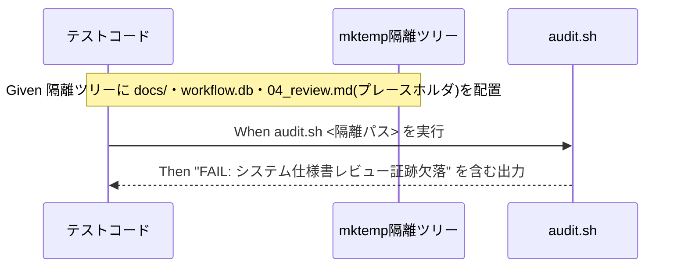

# 要件定義書: audit.sh #31（システム仕様書レビュー証跡欠落検知）の tmp 隔離検証を test/ 配下の恒久回帰テストへ固定化

**プロジェクト名**: audit.sh #31 tmp 隔離検証の恒久テスト化
**作成日**: 2026 年 07 月 12 日
**最終更新**: 2026 年 07 月 12 日

> **重要**: **このドキュメントは常に更新**: 要件の変更や追加があった場合は、即座にこのドキュメントを更新してください。ドキュメントは「生きているドキュメント」として扱い、実装内容と常に同期させます。
>
> **用語**: [.agent-skill-chain/source/CONCEPTS.md §用語規約](../../../../../../.agent-skill-chain/source/CONCEPTS.md#用語規約) を参照。

---

## 1. 概要

### 1.1 システム概要

`.agent-skill-chain/source/enforcement/ci/audit.sh` の監査項目 #31（`check_docs_review_evidence` 関数。行842-899）は、`workflow.db` 採用時・`docs/` 採用時に、実装変更ログ（`implement-feature`/`verify-and-close`）を伴う `04_review.md` の「## docs 更新」セクションについて、要=`docs/00_review/` への実タイムスタンプ形式（`YYYYMMDD_HHMMSS`）参照、または不要=プレースホルダでない実質的理由、のいずれかの内容が確認できない場合に FAIL するチェックである。既存 #5（同セクションの記載の**有無**のみを検査）とは検査対象が「有無」か「内容」かで非交差になるよう設計されている。

隣接サブ issue「システム仕様書完備強制テンプレート刷新」の verify-and-close（`04_review.md` §3.2）で、`mktemp -d` 隔離環境上で 7 ケース（A: FAIL、B/C: PASS、D/E/F/G: SKIP）を手動で独立再現し、期待どおりの挙動を確認したが、この検証は `test/` 配下の恒久回帰テストとして固定化されていない。本要件定義は、この手動検証内容を機械的・再実行可能なテストコードへ翻訳することを対象とする。

### 1.2 用語集

| 用語 | 説明 |
| ---- | ---- |
| #31 | `audit.sh` の `check_docs_review_evidence()` 関数（監査項目番号 31）。本 00/01 における対象そのもの。 |
| tmp 隔離 | `mktemp -d` で作成した一時ディレクトリ上に最小限のフィクスチャ（`docs/`・`workflow.db`・`04_review.md` 等）を構築し、本番リポジトリを変更せずに `audit.sh <隔離パス>` を実行する検証方式。`.agent-skill-chain/project/自己拡張ワークフロー.md §テストの tmp 隔離（必須）` に定義。 |
| ケース A〜G | 隣接 04_review.md §3.2 で定義された #31 の 7 通りのテストシナリオ（A=FAIL、B・C=PASS、D・E・F・G=SKIP）。本要件の SC/AC で 1:1 対応させる。 |
| 非交差 | #31（内容検査）と既存 #5（有無検査）が互いに干渉せず、独立に判定できること。ケース A（固定キーは存在するが内容が不備）で #5=PASS・#31=FAIL となることで実証される性質。 |

---

## 2. 機能要件

### 2.1 ユーザーストーリー

#### ストーリー 1: #31 の FAIL ケースの恒久テスト化

- **As a** 本リポジトリの保守者（enforcement/audit.sh を変更するエージェント・開発者）
- **I want to** `check_docs_review_evidence()` が想定どおり FAIL を発火するケース（docs/ 採用・実装変更ログあり・「## docs 更新」の要否がテンプレート既定のプレースホルダのまま）を `test/` 配下の自動テストとして実行したい
- **So that** 将来 `audit.sh` を変更した際に、#31 の FAIL 検知能力が意図せず失われていないかを CI・ローカルで機械的に検知できる

**受け入れ基準**:

- AC-1a: `mktemp -d` で構築した隔離ツリーに、`docs/` ディレクトリ、`workflow_log` テーブルを持つ `workflow.db`（sqlite3）、当該 issue に紐づく `implement-feature` または `verify-and-close` ログ 1 件以上、および「## docs 更新」セクションの `- 要否:` がテンプレート既定文言（プレースホルダ）のままの `04_review.md` を配置した状態で `audit.sh <隔離パス>` を実行すると、標準エラー出力に `FAIL: システム仕様書レビュー証跡欠落` を含む行が出力されること（04_review.md §3.2 ケース A に対応）。
- AC-1b: 上記実行時、`grep -q "^FAIL:"` 相当の判定で FAIL 検出が確認でき、`git status`（本番リポジトリ側）に差分が出ないこと（隔離環境のみへの書き込みであることの確認）。

#### ストーリー 2: #31 の PASS ケースの恒久テスト化

- **As a** 本リポジトリの保守者
- **I want to** 「## docs 更新」に要=実タイムスタンプ参照、または不要=実質的理由が記載されている場合に #31 が FAIL しない（PASS 相当）ことを自動テストで確認したい
- **So that** 正しく記入された 04_review.md が誤って FAIL 判定されない（誤検知が発生しない）ことを継続的に保証できる

**受け入れ基準**:

- AC-2a: 要否=「要」かつ `docs/00_review/YYYYMMDD_HHMMSS` 形式（実タイムスタンプ、テンプレートのプレースホルダ文字列そのものではない）の参照を含む `04_review.md` を配置した隔離ツリーで `audit.sh` を実行すると、#31 由来の `FAIL:` 行が出力されないこと（04_review.md §3.2 ケース B に対応）。
- AC-2b: 要否=「不要」かつ理由がプレースホルダ既定文言（`（要の場合`で始まる文言）ではない実質的な理由を含む `04_review.md` を配置した隔離ツリーで `audit.sh` を実行すると、#31 由来の `FAIL:` 行が出力されないこと（04_review.md §3.2 ケース C に対応）。

#### ストーリー 3: #31 の SKIP ケースの恒久テスト化（安全側ガード）

- **As a** 本リポジトリの保守者
- **I want to** #31 が発動すべきでない条件（docs/ 未採用・実装変更ログ 0 件・workflow.db 不在・04_review.md が templates/ 配下）で確実に SKIP（誤 FAIL を出さない）することを自動テストで確認したい
- **So that** #31 が対象外のケースで誤って FAIL を発火し、無関係な issue のクローズを妨げるリグレッションを防止できる

**受け入れ基準**:

- AC-3a: `docs/` ディレクトリが存在しない隔離ツリーで `audit.sh` を実行すると、#31 由来の `FAIL:` 行が出力されないこと（04_review.md §3.2 ケース D に対応）。
- AC-3b: 当該 issue に `implement-feature`/`verify-and-close` の workflow_log が 1 件も無い（例: `design-feature` ログのみ）隔離ツリーで `audit.sh` を実行すると、#31 由来の `FAIL:` 行が出力されないこと（04_review.md §3.2 ケース E に対応）。
- AC-3c: `workflow.db` が存在しない隔離ツリーで `audit.sh` を実行すると、#31 由来の `FAIL:` 行が出力されないこと（04_review.md §3.2 ケース F に対応）。
- AC-3d: `04_review.md` が `templates/` 配下に存在する隔離ツリーで `audit.sh` を実行すると、#31 由来の `FAIL:` 行が出力されないこと（04_review.md §3.2 ケース G に対応）。

#### ストーリー 4: #31 と既存 #5 の非交差性の恒久テスト化

- **As a** 本リポジトリの保守者
- **I want to** #31（内容検査）と既存 #5（`## docs 更新`・`- 要否:` の記載の有無のみを検査）が互いに独立して判定され、ケース A（固定キーは存在するが内容がプレースホルダのまま）で「#5 は PASS だが #31 は FAIL」となることを自動テストで確認したい
- **So that** 将来の変更で #31 と #5 の検査対象が意図せず重複・干渉し、二重 FAIL や誤 FAIL が発生するリグレッションを防止できる

**受け入れ基準**:

- AC-4a: ストーリー 1（ケース A）と同一のフィクスチャに対して `audit.sh` を実行した際、`## docs 更新` セクション自体および `- 要否:` 行は存在する（#5 の検査対象は満たす）状態で、#31 由来の `FAIL: システム仕様書レビュー証跡欠落` のみが出力され、#5 由来の `FAIL: docs 更新要否未記載` に相当する行は出力されないこと（#5 は PASS・#31 は FAIL という非交差性の実証）。

### 2.2 BDD ユースケース

#### ユースケース 1: audit.sh #31 の tmp 隔離自動テスト実行

`test/` 配下のテストコード（既存 `test-audit.sh` への追加、または新規テストファイル）から `mktemp -d` 隔離環境を都度構築し、`.agent-skill-chain/source/enforcement/ci/audit.sh` を隔離パス引数で実行して、ケースごとの FAIL/PASS/SKIP を検証する。

**シナリオ 1: ケース A（要否プレースホルダ）で FAIL する**

```gherkin
Feature: audit.sh #31 の tmp 隔離自動テスト
  Scenario: docs/ 採用・実装変更ログあり・要否がプレースホルダのままの 04_review.md で FAIL する
    Given mktemp -d で構築した隔離ツリーに docs/ ディレクトリと workflow_log テーブルを持つ workflow.db があり
    And 当該 issue ディレクトリに implement-feature ログが 1 件以上記録されており
    And 04_review.md の「## docs 更新」セクションの「- 要否:」がテンプレート既定のプレースホルダのままである
    When audit.sh <隔離パス> を実行する
    Then 標準エラー出力に "FAIL: システム仕様書レビュー証跡欠落" を含む行が出力される
```

**処理フロー**（必要に応じて）:



**シナリオ 2: ケース B（要=実タイムスタンプ参照）で FAIL しない**

```gherkin
Feature: audit.sh #31 の tmp 隔離自動テスト
  Scenario: 要否=要 かつ docs/00_review/ への実タイムスタンプ参照がある場合は FAIL しない
    Given 隔離ツリーの 04_review.md の「## docs 更新」に「- 要否: 要」と「docs/00_review/20260101_000000」等の実タイムスタンプ参照が記載されている
    When audit.sh <隔離パス> を実行する
    Then 標準エラー出力に #31 由来の "FAIL: システム仕様書レビュー証跡欠落" を含む行が出力されない
```

**シナリオ 3: ケース C（不要=実質的根拠）で FAIL しない**

```gherkin
Feature: audit.sh #31 の tmp 隔離自動テスト
  Scenario: 要否=不要 かつ理由がプレースホルダでない実質的な内容の場合は FAIL しない
    Given 隔離ツリーの 04_review.md の「## docs 更新」に「- 要否: 不要」と「（要の場合」で始まらない実質的な理由が記載されている
    When audit.sh <隔離パス> を実行する
    Then 標準エラー出力に #31 由来の "FAIL: システム仕様書レビュー証跡欠落" を含む行が出力されない
```

**シナリオ 4: ケース D〜G（SKIP ガード）で FAIL しない**

```gherkin
Feature: audit.sh #31 の tmp 隔離自動テスト
  Scenario Outline: SKIP ガード条件下では #31 由来の FAIL が発火しない
    Given 隔離ツリーが "<条件>" を満たす
    When audit.sh <隔離パス> を実行する
    Then 標準エラー出力に #31 由来の "FAIL: システム仕様書レビュー証跡欠落" を含む行が出力されない

    Examples:
      | 条件                                             |
      | docs/ ディレクトリが存在しない（ケースD）           |
      | 当該 issue に implement/verify ログが 0 件（ケースE） |
      | workflow.db が存在しない（ケースF）                 |
      | 04_review.md が templates/ 配下にある（ケースG）    |
```

#### ユースケース 2: #31 と既存 #5 の非交差性の自動検証

**シナリオ 1: ケース A のフィクスチャで #5 は PASS・#31 は FAIL**

```gherkin
Feature: #31 と既存 #5 の非交差性
  Scenario: 固定キーは存在するが内容がプレースホルダの 04_review.md で #5 は非発火・#31 のみ発火する
    Given ユースケース1シナリオ1（ケースA）と同一の隔離ツリー（## docs 更新・- 要否: の行自体は存在する）
    When audit.sh <隔離パス> を実行する
    Then 標準エラー出力に "FAIL: システム仕様書レビュー証跡欠落"（#31）は含まれる
    And 標準エラー出力に #5（docs 更新要否未記載＝記載の有無を理由とする FAIL）に相当する行は含まれない
```

### 2.3 ビジネスルール

- テストは `.agent-skill-chain/project/自己拡張ワークフロー.md §テストの tmp 隔離（必須）` に従い、`mktemp -d` 隔離環境で実行し、本番の `.agent-skill-chain/source/` `.claude/` `.cursor/` `.agent-skill-chain/runtime/` `workflow.db` を変更・破壊しない。
- テストは `.agent-skill-chain/source/TEST_BDD_FORMAT.md` の記法（`# シナリオ:` `# Given:` `# When:` `# Then:`）に従う。
- `check_docs_review_evidence()` の判定ロジック（`audit.sh` 行842-899）自体は変更しない。テスト追加のみを対象とする。
- sqlite3 コマンドが実行環境に無い場合、`check_docs_review_evidence()` は SKIP（return 0）するため、新規テストも既存 `test-audit.sh` シナリオ4 と同様に `command -v sqlite3` でガードし、無い場合は誤 FAIL を出さない。

---

## 3. 非機能要件

### 3.1 パフォーマンス要件

- 追加テストの実行時間は既存 `test-audit.sh` と同水準（数秒〜十数秒オーダー）に収まること。

### 3.2 セキュリティ要件

- 該当なし。

### 3.3 ユーザビリティ要件

- テスト失敗時のメッセージは、既存 `test-audit.sh` の `ok`/`ng` ヘルパー関数の出力形式（`[PASS]`/`[FAIL]` ラベル＋説明文）に準拠し、どのケース（A〜G）が失敗したか一目で分かること。

### 3.4 可用性要件

- 該当なし。

---

## 4. 外部インターフェース要件

### 4.1 API 要件

- 該当なし（シェルスクリプトのテストであり外部 API を持たない）。

### 4.2 データ形式要件

- テストが構築する `workflow.db` フィクスチャのスキーマは、`audit.sh` が参照する `workflow_log` テーブル（`entry_id`・`parent_entry_id`・`command`・`issue_path` 等）と一致させること（既存 `test-audit.sh` シナリオ4 の `CREATE TABLE workflow_log` 定義を参考にする）。

---

## 5. 制約事項

- `check_docs_review_evidence()` の判定ロジック自体は変更しない（テスト追加のみ）。
- 既存 `test-audit.sh` の既存シナリオ（T1〜T4 等）を破壊しない。
- 本番リポジトリのファイル（`.agent-skill-chain/source/` `.claude/` `.cursor/` `.agent-skill-chain/runtime/` `workflow.db`）を変更・破壊しない。

---

## 6. 参考資料

### プロジェクトドキュメント

- [`00_要求定義.md`](./00_要求定義.md) - 要求定義

### その他の参考資料

- 検出元: [`../20260711_061341_システム仕様書完備強制テンプレート刷新/04_review.md`](../20260711_061341_システム仕様書完備強制テンプレート刷新/04_review.md) §3.2（7 ケース A〜G の手動検証記録）・§10.2 改善1・§12.1
- 実装対象: `.agent-skill-chain/source/enforcement/ci/audit.sh` の `check_docs_review_evidence()`（行842-899）
- 既存テストパターン: `test/test-audit.sh`（`make_min_tree`・`TMP_DIRS`・`trap cleanup EXIT` の隔離パターン、シナリオ4 の sqlite3 ガード・workflow_log フィクスチャ構築パターン）
- `.agent-skill-chain/source/TEST_BDD_FORMAT.md`（BDD 記法規約）
- `.agent-skill-chain/project/自己拡張ワークフロー.md §テストの tmp 隔離（必須）`

---

## 7. 前のステップ

この要件定義書は、以下のドキュメントを基に作成されています：

- **前**: [`00_要求定義.md`](./00_要求定義.md) - 要求定義フェーズ

---

## 8. 次のステップ

この要件定義書の承認後、以下のドキュメントを作成します：

- **次**: [`02_設計.md`](./02_設計.md) - 設計フェーズ
