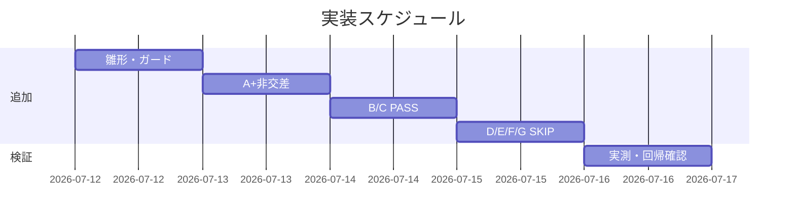

# 実装計画書: audit.sh #31（システム仕様書レビュー証跡欠落検知）の tmp 隔離検証を test/ 配下の恒久回帰テストへ固定化

**プロジェクト名**: audit.sh #31 tmp 隔離検証の恒久テスト化
**作成日**: 2026 年 07 月 12 日
**最終更新**: 2026 年 07 月 12 日

> **重要**: **このドキュメントは常に更新**: 実装計画の変更、進捗状況の更新、バグの記録などがあった場合は、即座にこのドキュメントを更新してください。ドキュメントは「生きているドキュメント」として扱い、実装内容と常に同期させます。
> **必須項目**: 「必須」と明記した欄は空欄・抽象語のみで提出しないこと。テスト観点・BDD 仕様は具体ケースを 1 件以上記載すること。
>
> **用語**: [.agent-skill-chain/source/CONCEPTS.md §用語規約](../../../../../../.agent-skill-chain/source/CONCEPTS.md#用語規約) を参照。

---

## 1. 実装概要

### 1.1 実装方針（必須）

`audit.sh` の判定ロジックを変更せず、`test/test-audit.sh` の末尾付近に `#31` セクション（`== #31 システム仕様書レビュー証跡欠落検知 ==`）を **append** し、既存 `make_min_tree`/`ok`/`ng`/`TMP_DIRS`/`trap cleanup EXIT`/`command -v sqlite3` ガードを再利用して 7 ケース（A〜G）＋ #5 非交差の黒箱テストを実装する（02\_設計 ADR-1〜3 準拠）。

### 1.2 実装順序（必須: 1 件以上）

1. タスク1: `#31` セクションの雛形（sqlite3 ガード・共通フィクスチャ構築ヘルパ）を追加。
2. タスク2: ケース A（FAIL）＋ #5 非交差（同一ツリーで #31=FAIL・#5=非FAIL）を実装。
3. タスク3: ケース B/C（PASS）を実装。
4. タスク4: ケース D/E/F/G（SKIP）を実装。
5. タスク5: 実測検証（`bash test/test-audit.sh` 全 PASS、`git status` 差分 0）。



---

## 2. タスク分解

**必須**: 各タスクに「テスト観点」（2.x.3）と「単体テスト仕様（BDD）」（2.x.4）を記載する。

### 2.1 タスク 1: `#31` セクション雛形と共通フィクスチャ構築

#### 2.1.1 概要（必須）

`test/test-audit.sh` に `#31` セクションと sqlite3 ガードを追加し、各ケースが共通で使うフィクスチャ構築手順（`make_min_tree` → `docs/` 配下 issue → `workflow.db`/`workflow_log` → `04_review.md`）を確立する。

#### 2.1.2 実装内容（必須: 1 件以上）

- `test/test-audit.sh` 末尾付近（`#32` セクション近傍・既存シナリオを壊さない append 位置）に `echo "== #31 システム仕様書レビュー証跡欠落検知 =="` と `if command -v sqlite3 >/dev/null 2>&1; then ... else echo "  [SKIP] #31 ...（sqlite3 不在）"; fi` を追加（02 ADR-2）。
- 04_review 本文を生成する `here-doc`（`## 敵対的観点`・`## must-preserve`・`## docs 更新` を含む・既存 T2/#32 の 04 生成パターン踏襲）を用意する。
- `workflow.db` は `<tree>/.agent-skill-chain/runtime/workflow.db`（`WF_DB` 解決先・audit.sh:357）に `CREATE TABLE workflow_log (entry_id TEXT PRIMARY KEY, parent_entry_id TEXT NULL, command TEXT NOT NULL, issue_path TEXT NULL);` で作成（既存 #32 と同一スキーマ）。

#### 2.1.3 テスト観点（必須）

##### 単体（本タスクの具体ケース・必須 1 件以上）

- sqlite3 が存在する環境で `#31` セクションが実行に入り、`[SKIP]` ではなくケース判定に進むこと。
- sqlite3 不在環境で `[SKIP] #31 ...` が 1 行出力され、`ok`/`ng` を呼ばず PASS/FAIL 集計を汚さないこと。

##### 結合/API（本タスクの具体ケース・該当時は必須 1 件以上）

- 構築した `workflow.db` に対し `audit.sh` が `[audit] checking docs review evidence (#31)` を stderr に出す（#31 が SKIP せず走る）こと（audit.sh:856）。

##### E2E/受け入れ（本タスクの具体ケース・未達時は理由記載）

- 該当なし（雛形タスク単独では受け入れ判定を持たない。E2E は タスク5 で集約）。

##### バリデーション（該当する場合の具体ケース）

- issue ディレクトリ名の日時プレフィックスに `#32` カットオフ未満（`20260101_000000_*`）を用い、#32 のノイズ発火を避ける（02 §3.2）。

#### 2.1.4 単体テスト仕様（BDD）（必須）

```gherkin
Feature: #31 テストセクションのガード
  Scenario: sqlite3 不在時はセクションを SKIP する
    Given sqlite3 コマンドが存在しない実行環境
    When test/test-audit.sh を実行する
    Then "[SKIP] #31" を含む行が出力され ok/ng が呼ばれない
```

**テストコード例（インラインコメントで Given/When/Then を明記）**

```bash
# Given: sqlite3 の有無で分岐するガード
if command -v sqlite3 >/dev/null 2>&1; then
  # When: 隔離ツリーを作り audit.sh を実行してケース判定に進む
  echo "== #31 システム仕様書レビュー証跡欠落検知 =="
  # ...（各ケースは後続タスクで追加）...
else
  # Then: sqlite3 不在は SKIP（集計を汚さない）
  echo "  [SKIP] #31 システム仕様書レビュー証跡欠落検知（sqlite3 不在）"
fi
```

#### 2.1.5 依存関係

- 既存 `make_min_tree`/`ok`/`ng`/`TMP_DIRS`/`trap cleanup EXIT`（`test-audit.sh` 内既存）。

#### 2.1.6 見積もり

- **工数**: 0.5h　**優先度**: 高

### 2.2 タスク 2: ケース A（FAIL）＋ #5 非交差

#### 2.2.1 概要（必須）

docs/ 採用・implement ログあり・要否プレースホルダの 04 で #31 が FAIL を発火し、かつ同一ツリーで #5（`docs 更新要否未記載`）が発火しないこと（非交差）を検証する。

#### 2.2.2 実装内容（必須: 1 件以上）

- `make_min_tree` 由来ツリーに `docs/maintainer/workflow/20260101_000000_a31/` を作り、`04_review.md`（`## docs 更新` に `- 要否: （要 / 不要）`・`- 対象: （...）`・`- 理由: （...）` のテンプレート既定プレースホルダ）を配置。
- `workflow.db` に `INSERT INTO workflow_log VALUES ('e1', NULL, 'implement-feature', 'docs/maintainer/workflow/20260101_000000_a31');`。
- `out="$(bash "$AUDIT" "$tree" 2>&1)"` に対し、`grep -q 'FAIL: システム仕様書レビュー証跡欠落'` で #31 発火を `ok`、`! grep -q 'FAIL: docs 更新要否未記載'` で #5 非発火を `ok`（02 ADR-3）。

#### 2.2.3 テスト観点（必須）

##### 単体（本タスクの具体ケース・必須 1 件以上）

- 要否がプレースホルダ `（要 / 不要）`（`grep -qF '要 / 不要'` に一致）→ #31 が `FAIL: システム仕様書レビュー証跡欠落` を出力する（AC-1a）。

##### 結合/API（本タスクの具体ケース・該当時は必須 1 件以上）

- 同一 `audit.sh` 実行の stderr で #31 FAIL が有り・#5 FAIL（`docs 更新要否未記載`）が無い（AC-4a・非交差）。

##### E2E/受け入れ（本タスクの具体ケース・未達時は理由記載）

- 本ケース実行前後で本番リポジトリの `git status` に差分が出ない（AC-1b・SC-2）。タスク5 で一括確認。

##### バリデーション（該当する場合の具体ケース）

- `- 要否:` 行および `## docs 更新` 見出しは存在する（#5 の検査対象は満たす）状態であること（非交差の前提）。

#### 2.2.4 単体テスト仕様（BDD）（必須）

```gherkin
Feature: audit.sh #31 の FAIL と #5 非交差
  Scenario: 要否プレースホルダの 04 で #31 は FAIL・#5 は非FAIL
    Given docs/ 実在・workflow_log に implement-feature 行・04_review の要否が （要 / 不要）
    When audit.sh <隔離パス> を実行する
    Then stderr に "FAIL: システム仕様書レビュー証跡欠落" を含む
    And stderr に "FAIL: docs 更新要否未記載" を含まない
```

**テストコード例（Given/When/Then インラインコメント必須）**

```bash
# Given: docs/ 実在＋implement ログ＋要否プレースホルダの 04_review
A_TREE="$(make_min_tree)"
A_ISS="docs/maintainer/workflow/20260101_000000_a31"
mkdir -p "$A_TREE/$A_ISS"
cat > "$A_TREE/$A_ISS/04_review.md" <<'EOF'
## docs 更新
- 要否: （要 / 不要）
- 対象: （...）
- 理由: （...）
EOF
A_DB="$A_TREE/.agent-skill-chain/runtime/workflow.db"
sqlite3 "$A_DB" "CREATE TABLE workflow_log (entry_id TEXT PRIMARY KEY, parent_entry_id TEXT NULL, command TEXT NOT NULL, issue_path TEXT NULL);"
sqlite3 "$A_DB" "INSERT INTO workflow_log VALUES ('e1', NULL, 'implement-feature', '$A_ISS');"
# When: audit.sh を隔離パスで実行
A_OUT="$(bash "$AUDIT" "$A_TREE" 2>&1)"
# Then: #31 は FAIL・#5 は非FAIL（非交差）
if grep -q 'FAIL: システム仕様書レビュー証跡欠落' <<< "$A_OUT"; then ok "#31-A 要否プレースホルダで FAIL"; else ng "#31-A FAIL せず: $A_OUT"; fi
if ! grep -q 'FAIL: docs 更新要否未記載' <<< "$A_OUT"; then ok "#31/#5 非交差（#5 は非発火）"; else ng "#5 が誤発火（非交差崩れ）: $A_OUT"; fi
```

#### 2.2.5 依存関係

- タスク1（雛形・sqlite3 ガード・スキーマ）。

#### 2.2.6 見積もり

- **工数**: 1h　**優先度**: 高

### 2.3 タスク 3: ケース B/C（PASS）

#### 2.3.1 概要（必須）

要=実タイムスタンプ参照（B）・不要=非プレースホルダ理由（C）の 04 で #31 が FAIL しない（誤検知なし）ことを検証する。

#### 2.3.2 実装内容（必須: 1 件以上）

- ケースB: `04_review.md` の `## docs 更新` に `- 要否: 要`・`- 対象: docs/00_review/20260101_000000_review.md`（`docs/00_review/YYYYMMDD_HHMMSS` 実タイムスタンプ形式）を配置し `! grep -q 'FAIL: システム仕様書レビュー証跡欠落'` を `ok`。
- ケースC: `- 要否: 不要`・`- 理由: 変更が仕様に影響しないため`（`（要の場合` で始まらない実質的理由）を配置し同様に `ok`。
- 両ケースとも docs/・implement ログは タスク2 と同型（#31 が SKIP せず内容判定へ到達する前提を満たす）。

#### 2.3.3 テスト観点（必須）

##### 単体（本タスクの具体ケース・必須 1 件以上）

- B: `docs/00_review/[0-9]{8}_[0-9]{6}` にマッチする参照があると ok=1 → 非FAIL（AC-2a・audit.sh:884-888）。
- C: `- 理由:` が `（要の場合` で始まらない実質内容だと ok=1 → 非FAIL（AC-2b・audit.sh:878-882）。

##### 結合/API（本タスクの具体ケース・該当時は必須 1 件以上）

- 該当なし（単一 `audit.sh` 実行の #31 出力有無のみを検査）。

##### E2E/受け入れ（本タスクの具体ケース・未達時は理由記載）

- 非破壊は タスク5 で一括確認。

##### バリデーション（該当する場合の具体ケース）

- B の参照はテンプレートの文字どおりのプレースホルダ `YYYYMMDD_HHMMSS` ではなく実数字であること（プレースホルダ文字列は正規表現に一致しない・audit.sh:884-885）。

#### 2.3.4 単体テスト仕様（BDD）（必須）

```gherkin
Feature: audit.sh #31 の PASS（誤検知なし）
  Scenario: 要=実タイムスタンプ参照 / 不要=実質理由 では #31 は FAIL しない
    Given 04_review の要否=要+docs/00_review/20260101_000000 参照 または 要否=不要+実質理由
    When audit.sh <隔離パス> を実行する
    Then stderr に #31 由来の "FAIL: システム仕様書レビュー証跡欠落" を含まない
```

**テストコード例（Given/When/Then インラインコメント必須）**

```bash
# Given: 要否=要 + 実タイムスタンプ参照（ケースB）
B_TREE="$(make_min_tree)"; B_ISS="docs/maintainer/workflow/20260101_000000_b31"
mkdir -p "$B_TREE/$B_ISS"
cat > "$B_TREE/$B_ISS/04_review.md" <<'EOF'
## docs 更新
- 要否: 要
- 対象: docs/00_review/20260101_000000_review.md
- 理由: 指摘 N→0 の反復を実施
EOF
B_DB="$B_TREE/.agent-skill-chain/runtime/workflow.db"
sqlite3 "$B_DB" "CREATE TABLE workflow_log (entry_id TEXT PRIMARY KEY, parent_entry_id TEXT NULL, command TEXT NOT NULL, issue_path TEXT NULL);"
sqlite3 "$B_DB" "INSERT INTO workflow_log VALUES ('e1', NULL, 'implement-feature', '$B_ISS');"
# When: audit.sh を実行
B_OUT="$(bash "$AUDIT" "$B_TREE" 2>&1)"
# Then: #31 由来 FAIL は出ない
if ! grep -q 'FAIL: システム仕様書レビュー証跡欠落' <<< "$B_OUT"; then ok "#31-B 要=実TS参照で非FAIL"; else ng "#31-B 誤 FAIL: $B_OUT"; fi
```

#### 2.3.5 依存関係

- タスク1・タスク2（フィクスチャ手順の共通化）。

#### 2.3.6 見積もり

- **工数**: 1h　**優先度**: 高

### 2.4 タスク 4: ケース D/E/F/G（SKIP ガード）

#### 2.4.1 概要（必須）

#31 が発動すべきでない 4 条件（docs 未採用・implement 0件・DB 不在・templates 配下）で #31 が FAIL しないことを検証する。

#### 2.4.2 実装内容（必須: 1 件以上）

- D: `docs/` を作らず issue を `.agent-skill-chain/runtime/20260101_000000_d31/` に配置（04 はプレースホルダ・implement ログあり）→ #31 は docs 未採用ガードで SKIP（audit.sh:854）。
- E: docs/ 採用・04 プレースホルダだが `workflow_log` に `design-feature` のみ（implement/verify 0件）→ hit 空で continue（audit.sh:869-870）。
- F: docs/ 採用・04 プレースホルダだが `workflow.db` を作らない → DB 不在ガードで SKIP（audit.sh:852）。
- G: 04 を `<tree>/.agent-skill-chain/runtime/templates/04_review.md`（または `docs/.../templates/` 配下）に配置。SKIP ガード（audit.sh:852/854）到達のため `docs/` ディレクトリと `workflow_log` テーブルを持つ `workflow.db` のみ用意する（implement ログは不要）。**templates 外に #31 を発火させうる 04 は置かない**（純粋に templates ガードのみを isolate）→ templates 除外で continue（audit.sh:860）。
- 各ケース `! grep -q 'FAIL: システム仕様書レビュー証跡欠落'` を `ok`。

#### 2.4.3 テスト観点（必須）

##### 単体（本タスクの具体ケース・必須 1 件以上）

- D: `docs/` 不在で #31 が `return 0`（AC-3a）。
- E: implement/verify ログ 0件で当該 04 を `continue`（AC-3b）。
- F: `workflow.db` 不在で #31 が `return 0`（AC-3c）。
- G: 04 が `templates/` 配下で `continue`（AC-3d）。

##### 結合/API（本タスクの具体ケース・該当時は必須 1 件以上）

- 該当なし。

##### E2E/受け入れ（本タスクの具体ケース・未達時は理由記載）

- 非破壊は タスク5 で一括確認。

##### バリデーション（該当する場合の具体ケース）

- G は「04 が templates 配下だから SKIP」を isolate するため、templates 外に #31 を発火させうる別 04 を置かない（純粋に templates ガードのみを検証）。

#### 2.4.4 単体テスト仕様（BDD）（必須）

```gherkin
Feature: audit.sh #31 の SKIP ガード
  Scenario Outline: SKIP 条件下では #31 由来 FAIL が発火しない
    Given 隔離ツリーが "<条件>" を満たす
    When audit.sh <隔離パス> を実行する
    Then stderr に #31 由来の "FAIL: システム仕様書レビュー証跡欠落" を含まない

    Examples:
      | 条件                                  |
      | docs/ 不在（ケースD）                  |
      | implement/verify ログ 0件（ケースE）   |
      | workflow.db 不在（ケースF）            |
      | 04 が templates/ 配下（ケースG）       |
```

**テストコード例（Given/When/Then インラインコメント必須）**

```bash
# Given: workflow.db を作らない（ケースF）
F_TREE="$(make_min_tree)"; F_ISS="docs/maintainer/workflow/20260101_000000_f31"
mkdir -p "$F_TREE/$F_ISS"
cat > "$F_TREE/$F_ISS/04_review.md" <<'EOF'
## docs 更新
- 要否: （要 / 不要）
EOF
# （workflow.db は作らない）
# When: audit.sh を実行
F_OUT="$(bash "$AUDIT" "$F_TREE" 2>&1)"
# Then: DB 不在ガードで #31 は SKIP（非FAIL）
if ! grep -q 'FAIL: システム仕様書レビュー証跡欠落' <<< "$F_OUT"; then ok "#31-F DB 不在 SKIP"; else ng "#31-F DB 不在でも FAIL: $F_OUT"; fi
```

#### 2.4.5 依存関係

- タスク1・タスク2。

#### 2.4.6 見積もり

- **工数**: 1.5h　**優先度**: 高

### 2.5 タスク 5: 実測検証・回帰確認

#### 2.5.1 概要（必須）

`bash test/test-audit.sh` を実行して追加 8 判定が全 PASS・既存全ケース PASS であること、および本番リポジトリが非破壊であることを実測する。

#### 2.5.2 実装内容（必須: 1 件以上）

- `bash test/test-audit.sh` を実行し末尾 `PASS=n FAIL=0`・exit 0 を確認。
- 実行前後で `git status --porcelain` に差分が無いことを確認（SC-2）。
- `bash -n test/test-audit.sh`（構文チェック）を確認。

#### 2.5.3 テスト観点（必須）

##### 単体（本タスクの具体ケース・必須 1 件以上）

- `bash test/test-audit.sh` の終了コードが 0（SC-1・SC-4）。

##### 結合/API（本タスクの具体ケース・該当時は必須 1 件以上）

- `test/run-all.sh` 経由でも `test-audit.sh` が PASS すること（既存経路互換・要件 §3.3）。

##### E2E/受け入れ（本タスクの具体ケース・未達時は理由記載）

- テスト実行前後で `git status` 差分 0（本番 `.agent-skill-chain/source/`・`.claude/`・`.cursor/`・`.agent-skill-chain/runtime/`・`workflow.db` 非破壊。SC-2）。

##### バリデーション（該当する場合の具体ケース）

- sqlite3 不在をエミュレート（PATH から外す等）した場合に `[SKIP]` になり FAIL 0 を維持すること（ADR-2・任意確認）。

#### 2.5.4 単体テスト仕様（BDD）（必須）

```gherkin
Feature: 追加後の回帰と非破壊
  Scenario: 追加後も全テスト PASS かつ本番非破壊
    Given #31 セクションを追加した test/test-audit.sh
    When bash test/test-audit.sh を実行する
    Then 末尾に "FAIL=0" が出力され exit 0 になる
    And 実行前後で git status に差分が出ない
```

**テストコード例（Given/When/Then インラインコメント必須）**

```bash
# Given: #31 追加後の test-audit.sh と実行前の git status
before="$(git status --porcelain)"
# When: テストを実行
bash test/test-audit.sh; rc=$?
after="$(git status --porcelain)"
# Then: 全 PASS かつ非破壊
[[ $rc -eq 0 ]] || echo "回帰: exit=$rc"
[[ "$before" == "$after" ]] || echo "非破壊違反: git status 差分あり"
```

#### 2.5.5 依存関係

- タスク2・3・4（全ケース実装完了後）。

#### 2.5.6 見積もり

- **工数**: 0.5h　**優先度**: 高

---

## テスト観点

- #31 の FAIL 検知能力（ケースA）・誤検知なし（ケースB/C）・SKIP ガードの安全側動作（ケースD/E/F/G）・#5 との非交差（ケースA 同時アサート）を、`mktemp -d` 隔離ツリー上の `audit.sh` 黒箱実行で固定する。
- 既存 `test-audit.sh` の T1〜T4・#7・GIT_RANGE・#32 ケースが追加後も全 PASS（回帰なし・SC-4）。
- 本番リポジトリ非破壊（SC-2）。

## 単体テスト

- 対象は既存関数 `check_docs_review_evidence()`（変更不可）であり、テストは `audit.sh <隔離パス>` 実行の stderr を固定文字列 grep で判定する黒箱方式。各ケースは独立ツリー（`make_min_tree`）で状態を共有しない。

## BDD

- 上記各タスク 2.x.4 の Gherkin（ケースA=FAIL＋#5非交差、B/C=PASS、D/E/F/G=SKIP、タスク5=回帰・非破壊）を正とする。Given/When/Then は `.agent-skill-chain/source/TEST_BDD_FORMAT.md` に従い、テストコード内に `# Given:`/`# When:`/`# Then:` を明記する。

---

## 3. 実装スケジュール

### 3.1 マイルストーン

| マイルストーン | 期日 | 成果物 |
| -------------- | ---- | ------ |
| #31 セクション実装完了 | 実装フェーズ内 | `test/test-audit.sh`（#31 追加） |
| 実測・回帰確認完了 | 実装フェーズ内 | 実行ログ（PASS=n FAIL=0・git status 差分0） |

### 3.2 実装フェーズ

#### フェーズ 1: テスト追加

- **タスク**: タスク1〜4（雛形→A＋非交差→B/C→D/E/F/G）。

#### フェーズ 2: 検証

- **タスク**: タスク5（実測・回帰・非破壊確認）。

---

## 4. テスト計画

### 4.1 テストの優先順位

- クリティカル: ケースA（FAIL 検知能力）と #5 非交差＝#31 の存在意義の核。厚く固定する。
- 回帰必須: 既存 `test-audit.sh` 全ケースと `run-all.sh` 経路を必ず含める。

---

## 5. リスク管理

### 5.1 実装リスク

- **リスク**: フィクスチャの再現粒度誤り（要否行の文言・タイムスタンプ形式・issue_path 前方一致の綴り）で意図しない SKIP や誤 FAIL が起きる。
  - **対策**: `audit.sh` 実装（行842-899）と #5（行291-301）を 1:1 で参照し、各 SKIP ガード（sqlite3/DB 不在・docs 未採用・templates 配下・implement 0件）と内容判定分岐（要=`docs/00_review/[0-9]{8}_[0-9]{6}`・不要=非`（要の場合`）をケースに対応付ける（02 §3.1.3 表）。タスク5 の実測で全ケース期待一致を確認する。
- **リスク**: sqlite3 不在環境での誤 FAIL。
  - **対策**: `command -v sqlite3` ガードで `[SKIP]`（ADR-2、既存 #32/シナリオ4 と同型）。

---

## 6. 参考資料

### プロジェクトドキュメント

- [`02_設計.md`](./02_設計.md) - 設計
- [`01_要件定義.md`](./01_要件定義.md) - 要件定義

### その他の参考資料

- 検証対象: `.agent-skill-chain/source/enforcement/ci/audit.sh`（#31 行842-899・#5 行291-301・`WF_DB` 行357）
- 既存テストパターン: `test/test-audit.sh`（`make_min_tree` 43-53・sqlite3 ガード 106-137・#32 セクション 329-456）
- 検出元: `../20260711_061341_システム仕様書完備強制テンプレート刷新/04_review.md` §3.2
- `.agent-skill-chain/source/TEST_BDD_FORMAT.md`・`.agent-skill-chain/project/自己拡張ワークフロー.md §テストの tmp 隔離（必須）`

---

## 7. 前のステップ

この実装計画書は、以下のドキュメントを基に作成されています：

- **前**: [`02_設計.md`](./02_設計.md) - 設計フェーズ

---

## 8. 次のステップ

この実装計画書の承認後、以下のステップに進みます：

- **プロジェクトが 1 つの issue（タスク）である場合**: 実装着手前の **review-docs**（実装前ドキュメントレビュー）を必須ゲートとして経てから、実装フェーズ（implement-feature）に進む。

**用語**: [.agent-skill-chain/source/CONCEPTS.md §用語規約](../../../../../../.agent-skill-chain/source/CONCEPTS.md#用語規約) を参照。
</content>
