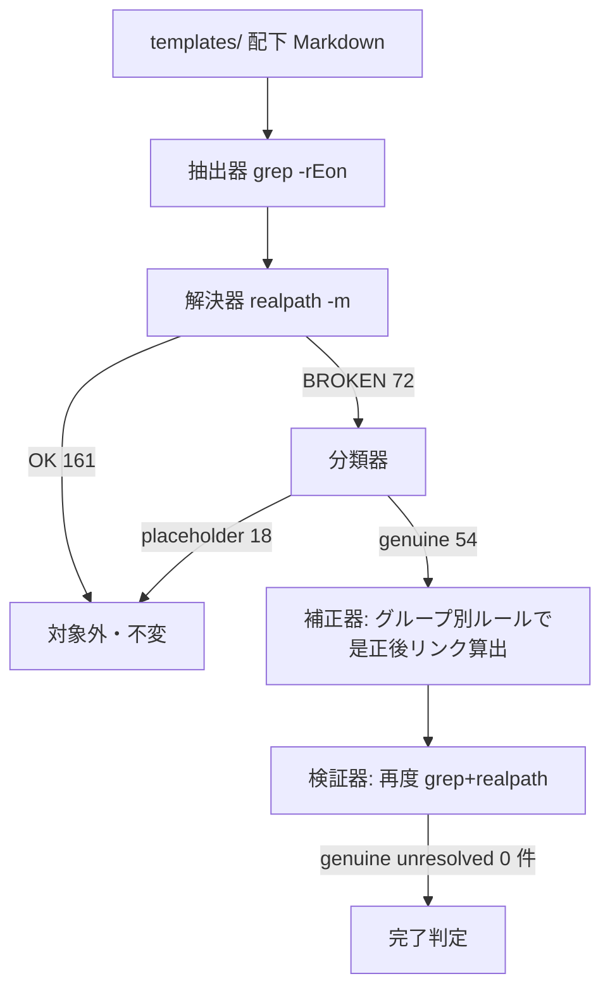
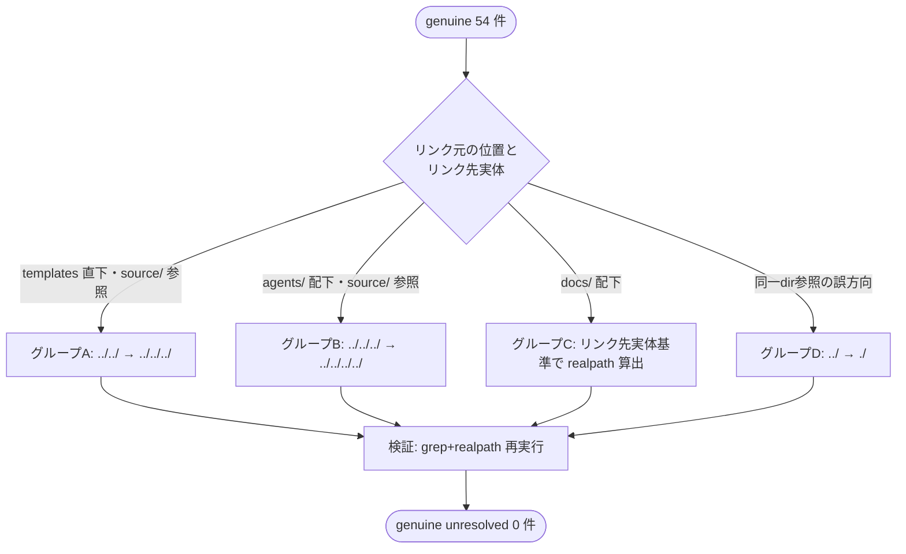

# 設計書: テンプレート群のクロス参照相対リンク深度是正

**プロジェクト名**: テンプレート相対リンク深度是正
**作成日**: 2026 年 07 月 12 日
**最終更新**: 2026 年 07 月 12 日

> **重要**: **このドキュメントは常に更新**: 設計の変更や追加があった場合は、即座にこのドキュメントを更新してください。ドキュメントは「生きているドキュメント」として扱い、実装内容と常に同期させます。
>
> **用語**: [.agent-skill-chain/source/CONCEPTS.md §用語規約](../../../../../../.agent-skill-chain/source/CONCEPTS.md#用語規約) を参照。

---

## 0. 本設計のスコープ（重要・先頭明示）

本設計は、01_要件定義.md で棚卸し済みの **genuine 深度不整合 54 件（対象 15 ファイル）** を是正するための**是正方針・分類基準・機械検証の仕組み**を設計する。設計フェーズ（design-feature）の成果物は **02_設計.md（本書）と 03_実装計画.md** であり、**実際のテンプレート編集（リンク文字列の書き換え）は本フェーズでは行わない**。編集の実行は後続の implement-feature フェーズが担う（01_要件定義.md §5「実際のリンク修正（design-feature・implement-feature 相当のフェーズ）は別途行う」と整合）。

- **本フェーズで確定するもの**: (1) genuine / placeholder の切り分け基準（01 で列挙済みの分類を設計基準として固定）、(2) ファイル群ごとの補正ルール（グループ A〜D）、(3) `docs/` 二重コンテキスト問題への対応方針（ADR-2 で決定）、(4) 再実行可能な機械検証の仕組み。
- **本フェーズで行わないもの**: テンプレート本文の実編集、恒久テスト（`test/` 配下）の実装（要否のみ ADR-3 で方針化）。
- 01 §2.2 ビジネスルールは、templates 直下・`agents/` 配下は「単一の深さへの機械的な一括補正（+1 階層）で足りる（設計フェーズでの確定事項候補）」、`docs/` 配下は「単純な一括『+1 階層』補正では不十分な可能性がある」とし、方針決定を設計フェーズに委ねている。本書はこれを実測で確定する。

---

## 1. 設計概要

**必須**: 設計方針・原則は [.agent-skill-chain/source/spec/01_設計原則.md](../../../../../../.agent-skill-chain/source/spec/01_設計原則.md) を先に参照した上で、本プロジェクトに適用するものを選び記載する。

### 1.1 設計方針

相対リンクの深度是正を「推測での一括置換」ではなく「**grep で抽出 → realpath で実在判定 → 分類 → ターゲット実体を基準に正しい相対パスを算出 → 再度 grep+realpath で検証**」という**機械検証可能なフィルタ列**として設計する。是正の正しさは人間の判断ではなく `realpath -m` による実在解決（未解決 0 件）で担保する。

### 1.2 設計原則（本プロジェクトで適用するもの）

- **UNIX哲学**: 抽出（grep）・解決（realpath）・分類・算出・検証を、それぞれ単機能の小さな処理として組み合わせる（パイプライン）。既存の `.agent-skill-chain/project/自己拡張ワークフロー.md` §close 移動時の相対リンク補正の検証コマンドと同じ道具立て（`grep -rEon` + `realpath -m`）を再利用し、新規ツールを作らない。
- **単一責務**: 「分類（genuine/placeholder）」「補正ルール適用」「検証」を独立した責務として分ける。分類基準は 01 で確定済みのものを不変の入力として扱い、補正ロジックはそれに手を加えない。
- **AIフレンドリー設計**: 補正はファイル群（グループ A〜D）ごとに規則化し、後続 implement-feature が機械的に適用できるよう、対象 file:line・現状リンク・是正後リンクを 03 に表として明示する。

---

## 2. アーキテクチャ設計

### 2.1 責務・境界・参照関係

[01_設計原則 §明確な境界・§単一責務](../../../../../../.agent-skill-chain/source/spec/01_設計原則.md) に従い、責務・境界・参照関係を明示する。

#### 2.1.1 責務一覧

| コンポーネント | 責務（1 文） |
| -------------- | ------------ |
| 抽出器（extractor） | `.agent-skill-chain/runtime/templates/` 配下の Markdown から `](../...)`・`](./...)` 形式の相対リンクを `grep -rEon` で抽出する。 |
| 解決器（resolver） | 抽出した各リンクを、リンク元ファイルのディレクトリを基準に `realpath -m` で解決し、in-repo での実在（OK / BROKEN）を判定する。 |
| 分類器（classifier） | BROKEN リンクを genuine 深度不整合と placeholder・例示に切り分ける。基準は 01_要件定義.md §5 で確定済みの列挙を不変の入力とする。 |
| 補正器（corrector） | genuine 54 件に対し、ファイル群ごとの補正ルール（§3、グループ A〜D）で是正後の相対リンク文字列を算出する。**実編集は implement-feature の責務**であり、本 issue の設計は「算出規則と是正後文字列の確定」までを担う。 |
| 検証器（verifier） | 補正後、抽出器＋解決器を再実行し、genuine unresolved が 0 件であること・placeholder 18 件は不変であることを機械確認する。 |

#### 2.1.2 境界

- **入力**: `.agent-skill-chain/runtime/templates/` 配下の全 Markdown。01_要件定義.md の棚卸し結果（総数 233・OK 161・BROKEN 72・genuine 54・placeholder 18）。
- **出力**: 是正後の相対リンク文字列（グループ別の補正表）＋機械検証コマンド。実編集された templates 群は本 issue の出力ではなく implement-feature の出力。
- **他責務との境界**:
  - **placeholder 是正は範囲外**（01 §5 の 18 件）。分類器はこれらに触れない。
  - **個別 issue（`docs/maintainer/workflow/{issue}/` 配下）の生成済みドキュメントは範囲外**（それらは `.agent-skill-chain/project/自己拡張ワークフロー.md` §close 移動時の相対リンク補正で別途扱う）。
  - **テンプレートの見出し・本文内容の変更は範囲外**（変更対象は `](...)` の相対パス深度のみ）。

#### 2.1.3 参照関係

- extractor → resolver → classifier → corrector → verifier の一方向パイプライン。循環参照なし。
- classifier は 01_要件定義.md §5（placeholder 列挙）を参照するのみで、corrector の出力には依存しない。
- 本設計の検証手法は `.agent-skill-chain/project/自己拡張ワークフロー.md` §close 移動時の相対リンク補正の検証パイプライン（`grep -rEon` + `realpath -m`）と**同一の道具立て**を用いる（重複実装せず手法を共有）。ただし補正対象が異なる（close は移動した issue 成果物の +1 階層、本 issue はテンプレートの構造的深度不整合の是正）。

### 2.2 システムアーキテクチャ

**必須**: 設計判断は [.agent-skill-chain/source/spec/](../../../../../../.agent-skill-chain/source/spec/)（[00_spec概要.md](../../../../../../.agent-skill-chain/source/spec/00_spec概要.md)、[01_設計原則.md](../../../../../../.agent-skill-chain/source/spec/01_設計原則.md)、[06_設計判断の優先順位.md](../../../../../../.agent-skill-chain/source/spec/06_設計判断の優先順位.md)）を先に参照する。

- **採用パターン**: フィルタ列（UNIX パイプライン）。抽出 → 解決 → 分類 → 補正 → 検証を単機能の段に分ける。
- **根拠**: spec/01_設計原則 の UNIX 哲学（小さく作る・組み合わせ可能）と、既存の close 補正手順との道具立て共有により、新規依存を持たず既存運用と整合するため。

#### 2.2.1 CQRS（Command/Query 分離）

- **Query（状態非変更）**: 抽出・解決・分類・検証（read only。テンプレートを一切変更しない）。本 issue の設計・03 の検証は Query 側のみで完結する。
- **Command（状態変更）**: 補正の実編集（リンク文字列の書き換え）。**これは implement-feature フェーズの Command であり、本設計フェーズでは発行しない**。

#### 2.2.2 アーキテクチャ図（本プロジェクトの構成で記載）



### 2.3 コンポーネント構成

本 issue はソフトウェアモジュールではなく「テンプレート群という静的資産」と「それを検査・是正する手順」から成る。境界は §2.1.2 の 3 点（placeholder 除外・個別 issue 成果物除外・本文不変）で規定する。各段（抽出/解決/分類/補正/検証）は単一責務を満たす。

### 2.4 データフロー

イベント駆動は該当しない（バッチ的な一括検査・是正）。データフローは §2.2.2 の一方向パイプラインに一致する。中間データは「リンクレコード（`file:line|link文字列|解決先絶対パス|OK|BROKEN`）」で表現し、01 の検出スクリプト出力形式と同一。

### 2.5 横断設計判断（ADR）

本 issue の重要判断を [EVIDENCE_POLICY.md](../../../../../../.agent-skill-chain/source/EVIDENCE_POLICY.md) の ADR 形式（コンテキスト・検討した選択肢・決定・根拠[evidence_source 付き]・帰結）で記録する。evidence_source の分類定義は [CONCEPTS.md §外部根拠の必須化](../../../../../../.agent-skill-chain/source/CONCEPTS.md#外部根拠の必須化external-anchor) を参照。

#### ADR-1: 補正は「一括 +1 階層」ではなく「ファイル群ごとのターゲット実体基準の realpath 解決」で行う

- **コンテキスト**: 01 §2.2 は templates 直下・`agents/` について「+1 階層で足りる」を設計フェーズの確定事項候補とした。一方 `docs/` 配下は単純 +1 では不十分な可能性があるとした。補正ルールを 1 つに統一するか、群ごとに分けるかを決める必要がある。
- **検討した選択肢**:
  - 案A: 全 genuine を一律 `../` を 1 段追加（+1 階層）で補正する。
  - 案B: ファイル群（templates 直下・`agents/`・`docs/`・同一ディレクトリ参照）ごとに、リンク先実体の物理位置を基準に `realpath` で正しい相対パスを算出する。
- **決定**: 案B を採用する。
- **根拠**（evidence_source: existing_code / observed_runtime）: 実測で以下を確認した。
  - templates 直下（33 件）は現状 2 階層上（`../../`）で、+1 して 3 階層上（`../../../`）にすると全件解決する（`realpath -m` で実測 OK）。
  - `agents/` 配下（13 件）は現状 3 階層上（`../../../`）で、+1 して 4 階層上（`../../../../`）にすると全件解決する（実測 OK）。
  - `docs/` 配下（7 件）は**一律 +1 では成立しない**。`DOCS_RULES.md` 参照は不足（例: `docs/README.md:7` は 2 階層上→正 4 階層上、`docs/01_システム概要/README.md:6` は 4 階層上→正 5 階層上）だが、`AGENTS_MERMAID_RULES.md` 参照は**過剰**（`docs/01_システム概要/README.md:7` は現状 3 階層上→正 2 階層上）。同一ファイル内でも +1 と -1 が混在する。これは `AGENTS_MERMAID_RULES.md` が `.agent-skill-chain/source/` ではなく `.agent-skill-chain/runtime/templates/` 直下に実在する（`find` で確認）ためで、リンク先実体ごとに正しい深さが異なる。
  - 特殊 1 件（`00_要求定義.md:182` の `../00_システム理解.md`）は深度ではなく参照方向の誤りで、同一ディレクトリ参照 `./00_システム理解.md` が正（実測 OK）。
- **帰結**: 補正は §3 のグループ A〜D に分けて定義する。グループ A・B は機械的 +1、グループ C はリンク先実体ごとの realpath 算出、グループ D は同一ディレクトリ参照への修正。検証は全群共通で grep+realpath 再実行に一本化する。

#### ADR-2: `docs/` 配下テンプレートの二重コンテキストは「テンプレート物理配置（in-repo）基準」で是正する

- **コンテキスト**: 01 §2.2 シナリオ3・AC-4/AC-5 は、`docs/` 配下テンプレートが (a) `.agent-skill-chain/runtime/templates/docs/...` という物理配置と、(b) 配備後に消費者がプロジェクトルート直下 `docs/...` として作成する配置、の 2 つの「正しい深さ」を持ちうるとし、方針候補（最低 2 案）を設計フェーズで決定するよう求めた。
- **検討した選択肢**:
  - 案(i) **テンプレート物理配置（in-repo）基準**: リンク先実体を基準に、テンプレートが物理的に置かれる `.agent-skill-chain/runtime/templates/docs/...` から解決できる深さに是正する。
  - 案(ii) **配備後消費者 `docs/` 直下基準**: 消費者がプロジェクトルート直下に作る `docs/...` から解決できる深さに是正する。
  - 案(iii) **相対リンク廃止**: `.agent-skill-chain/source/DOCS_RULES.md` 等への相対リンクをやめ、ルート基準の案内文・注記に置換する。
- **決定**: 案(i)（テンプレート物理配置基準）を採用する。
- **根拠**（evidence_source: observed_runtime / existing_code）:
  - `.agent-skill-chain/source/SETUP.md`（配備規約）を確認したところ、setup は `.agent-skill-chain/runtime/templates/` を消費者プロジェクトへ**同一パス**（`.agent-skill-chain/runtime/templates/`）でコピーする。テンプレート `docs/` はそのまま消費者の `.agent-skill-chain/runtime/templates/docs/` に置かれ、消費者の実 `docs/`（プロジェクトルート直下）は**別途新規作成される参照利用先**であって、テンプレートファイルそのものの移動先ではない（SETUP.md §コピー対象・01 §2.2 で確認済み）。したがってテンプレートファイルが実際に読まれる物理位置は in-repo・配備後とも `.agent-skill-chain/runtime/templates/docs/...` で一致し、二重コンテキストのうち意味を持つのは (a) 側である。
  - 現状の `docs/` 配下 OK リンクの多数（例: `docs/01_システム概要/05_規約/README.md:7` の 6 階層上、`docs/00_review/README.md:10` の 5 階層上、`docs/README.md:51` の 4 階層上）は既に (a) 物理配置基準で `realpath` 解決している。すなわちリポジトリの**既存の de facto 規約は (a)** であり、genuine 7 件はその規約から外れた少数の不整合にすぎない（existing_code）。
  - 案(ii) を採ると既存 OK リンク多数が逆に壊れ、案(iii) は本文構造の大幅改変となり 01 §2.1「見出し・本文内容は変更しない」に反する。
- **帰結**: `docs/` 配下 genuine 7 件は、`DOCS_RULES.md`（`.agent-skill-chain/source/DOCS_RULES.md`）はリポジトリルート基準の深さ（`docs/README.md`=4 階層上、`docs/{分類}/README.md`=5 階層上）へ、`AGENTS_MERMAID_RULES.md`（`.agent-skill-chain/runtime/templates/AGENTS_MERMAID_RULES.md`）は templates 直下参照の `../../AGENTS_MERMAID_RULES.md`（2 階層上）へ是正する。消費者が実 `docs/` を作成する際の相対深度差は、テンプレート利用者が作成時に個別調整する事項であり本 issue の是正対象外とする（境界として明記）。

#### ADR-3: 再発防止の機械検証は「再実行可能なコマンドの明文化」を採用し、恒久テスト化は要否のみ提示する

- **コンテキスト**: 01 §3.4 は「機械検証（grep + realpath）を再実行可能な形で残す」ことを要求し、恒久テスト化（`test/` 配下追加）の要否は設計フェーズ以降の検討候補とした。
- **検討した選択肢**:
  - 案X: 検証コマンドを 03 に明記し、implement-feature 実行時・以後の手動再検証で使う（テスト追加なし）。
  - 案Y: `test/` 配下に恒久テスト（templates の genuine unresolved が 0 件であることを assert）を追加する。
- **決定**: 案X を本 issue の範囲とし、案Y は「要否の提示のみ」に留める（実装は本 issue では行わない）。
- **根拠**（evidence_source: existing_code / project_docs）: 01 §3.4 が恒久テスト化の要否判断を「本 issue では判断せず、設計フェーズ以降の検討候補として記録する」と明示しており、また `.agent-skill-chain/project/自己拡張ワークフロー.md` の close 補正も検証コマンドの明文化で運用が定着している（テスト追加なしで機能している）。過剰な `test/` 追加は EVIDENCE_POLICY §節3 の規模比例に反しうる。
- **帰結**: 03 に再実行可能な検証コマンドをタスクとして明記する。案Y（`test/e2e` 等への「templates リンク健全性」テスト追加）は、`test/` が非配布・保守者自己テスト領域であること（自己拡張ワークフロー §理由）を踏まえ、**別 issue 候補として完了報告で提案する**（本 issue では起票も実装もしない。サブによる独断起票の禁止に従う）。

---

## 3. 機能設計（補正ルール）

### 3.1 分類基準（genuine / placeholder）

01_要件定義.md §5 で確定した placeholder 18 件（file:line 単位で列挙済み）を**不変の除外集合**として扱う。BROKEN 72 件のうち、この 18 件を除いた 54 件を genuine とする。分類器は新規判定を行わず、01 の列挙を唯一の基準とする（設計での再解釈・追加除外をしない）。

- placeholder 除外集合（18 件、是正しない）: `90_issues.md:22,23`／`docs/99_ID命名規則と管理/README.md:51,52,58,59,65,66`／`00_システム理解.md:33,34,35,192,285,286,287`／`docs/04_機能設計/機能名/README.md:126,127`／`docs/04_機能設計/README.md:43`。

### 3.2 補正ルール（グループ別）

genuine 54 件を、リンク先実体の物理位置に基づき 4 群に分ける（ADR-1）。処理フロー:



#### グループ A: templates 直下ファイルの `.agent-skill-chain/source/` 参照（33 件・機械的 +1）

- **対象**: `00_システム理解.md`(3)・`00_要求定義.md:20`(1)・`01_要件定義.md`(1)・`02_設計.md`(15)・`03_実装計画.md`(6)・`04_review.md`(4)・`05_最終確認チェックリスト.md`(1)・`90_issues.md:14`(1)・`99_PR.md`(1)。
- **ルール**: 先頭 `../../`（2 階層上）を `../../../`（3 階層上）に置換。
- **入力（現状）例**: `](../../.agent-skill-chain/source/CONCEPTS.md)` **出力（是正後）**: `](../../../.agent-skill-chain/source/CONCEPTS.md)`。
- **エラーハンドリング**: 対象行に `../../` が 2 回以上出現する行はないことを 01 の抽出で確認済み。置換は各リンクトークン単位（`](` 直後の相対パス先頭）に限定し、本文中の `../../` 言及は変更しない。

#### グループ B: `agents/` 配下ファイルの `.agent-skill-chain/source/` 参照（13 件・機械的 +1）

- **対象**: `agents/scribe_claude.md`(9)・`agents/scribe_cursor.md`(4)。
- **ルール**: 先頭 `../../../`（3 階層上）を `../../../../`（4 階層上）に置換。
- **入力例**: `](../../../.agent-skill-chain/source/scribe/CONTRACT.md)` **出力**: `](../../../../.agent-skill-chain/source/scribe/CONTRACT.md)`。

#### グループ C: `docs/` 配下ファイル（7 件・リンク先実体基準で算出。ADR-2）

- **対象と是正後**（実測で解決確認済み）:

  | file:line | 現状リンク | 是正後リンク | リンク先実体 |
  | --- | --- | --- | --- |
  | `docs/README.md:7` | `../../.agent-skill-chain/source/DOCS_RULES.md` | `../../../../.agent-skill-chain/source/DOCS_RULES.md` | `.agent-skill-chain/source/DOCS_RULES.md` |
  | `docs/01_システム概要/README.md:6` | `../../../../.agent-skill-chain/source/DOCS_RULES.md` | `../../../../../.agent-skill-chain/source/DOCS_RULES.md` | 同上 |
  | `docs/01_システム概要/README.md:7` | `../../../AGENTS_MERMAID_RULES.md` | `../../AGENTS_MERMAID_RULES.md` | `.agent-skill-chain/runtime/templates/AGENTS_MERMAID_RULES.md` |
  | `docs/02_画面設計/README.md:7` | `../../../../.agent-skill-chain/source/DOCS_RULES.md` | `../../../../../.agent-skill-chain/source/DOCS_RULES.md` | `.agent-skill-chain/source/DOCS_RULES.md` |
  | `docs/02_画面設計/README.md:8` | `../../../AGENTS_MERMAID_RULES.md` | `../../AGENTS_MERMAID_RULES.md` | `.agent-skill-chain/runtime/templates/AGENTS_MERMAID_RULES.md` |
  | `docs/03_データ設計/README.md:7` | `../../../../.agent-skill-chain/source/DOCS_RULES.md` | `../../../../../.agent-skill-chain/source/DOCS_RULES.md` | `.agent-skill-chain/source/DOCS_RULES.md` |
  | `docs/03_データ設計/README.md:8` | `../../../AGENTS_MERMAID_RULES.md` | `../../AGENTS_MERMAID_RULES.md` | `.agent-skill-chain/runtime/templates/AGENTS_MERMAID_RULES.md` |

- **注意（+1 でない）**: `DOCS_RULES.md` 参照は深さ不足（+1〜+2）だが、`AGENTS_MERMAID_RULES.md` 参照は深さ**過剰**（-1）である。同一ファイル内でも増減が混在するため、グループ C は一律置換を禁止しリンク先実体ごとに個別是正する。

#### グループ D: 参照方向の誤り（1 件）

- **対象**: `00_要求定義.md:182` の `../00_システム理解.md`（`.agent-skill-chain/runtime/00_システム理解.md` に誤解決）。
- **ルール**: 同一ディレクトリ参照 `./00_システム理解.md` に修正（`.agent-skill-chain/runtime/templates/00_システム理解.md` に解決。実測 OK）。

### 3.3 機械検証（再発防止）

- 01 §2.2 の検出スクリプトと同一のパイプラインを検証に用いる（重複定義しない）:
  ```bash
  grep -rEon '\]\((\.\./|\./)[^)]+\)' .agent-skill-chain/runtime/templates | while IFS=: read -r f n rest; do
    link=$(printf '%s' "$rest" | sed -E 's/^\]\(//; s/\).*$//; s/#.*$//')
    target=$(realpath -m "$(dirname "$f")/$link")
    [ -e "$target" ] && echo "OK|$f:$n|$link" || echo "BROKEN|$f:$n|$link|$target"
  done
  ```
- **合格基準**: 補正後、BROKEN のうち placeholder 18 件（01 §5 の file:line）を除いた **genuine unresolved が 0 件**。placeholder 18 件は BROKEN のまま不変であること（意図的未実在）。OK 総数は 161 + 54 = 215 に増える見込み（実測で確認）。

---

## 4. データ設計

該当なし（Markdown 内の相対リンク文字列のみを扱う）。中間表現は「リンクレコード」= `status|file:line|link|resolved_abspath` の行フォーマット（01 の検出出力と同一）。

---

## 5. API 設計

該当なし（HTTP API・外部インターフェースを持たない。検証は CLI パイプライン）。

---

## 6. テスト戦略

テスト戦略の観点定義は [RULES.md のテスト戦略必須要件](../../../../../../.agent-skill-chain/source/RULES.md#テスト戦略必須要件) を、BDD 形式の定義は [TEST_BDD_FORMAT.md](../../../../../../.agent-skill-chain/source/TEST_BDD_FORMAT.md) を参照。本書では対象ごとのテスト割当のみ記載する。

### 6.1 対象ごとのテスト割り当て

「単体」= 個々の補正ルールが対象 file:line を正しい相対パスへ変換し realpath 解決すること。「結合」= templates 全体を通した grep+realpath 再実行での網羅検証。「E2E/受け入れ」= 01 の成功基準（genuine unresolved 0 件・placeholder 不変・本文不変）。

| 対象 | 単体 | 結合/API | E2E | クリティカル観点 | バリデーション観点 | 未達理由/補足 |
| --- | --- | --- | --- | --- | --- | --- |
| グループA 補正（33件） | ○ | ○ | ○ | 全 33 件が `../../../` で解決 | 本文中 `../../` 言及を改変しない | 実編集は implement-feature |
| グループB 補正（13件） | ○ | ○ | ○ | 全 13 件が `../../../../` で解決 | agents/ 内の他リンク不変 | 同上 |
| グループC 補正（7件） | ○ | ○ | ○ | 実体別に DOCS_RULES=ルート基準深さ・MERMAID=`../../` で解決 | 一律 +1 を適用しない（過剰是正防止） | 同上 |
| グループD 補正（1件） | ○ | ○ | ○ | `./00_システム理解.md` で解決 | 深度でなく方向修正 | 同上 |
| placeholder 不変（18件） | ○ | ○ | ○ | 18 件が BROKEN のまま | 誤って実パス化しない | 回帰観点 |
| 機械検証コマンド | × | ○ | ○ | genuine unresolved=0 を出力 | 01 スクリプトと同一 | 独立検証で再現 |

### 6.2 監査・レビューでの確認（証跡）

証跡確認観点は RULES §テスト戦略必須要件・workflow/PHASES.md の監査観点を参照。本書 §6.1 の割当表と 03 のタスク別テスト観点・BDD が対応していることを確認する。実装前ドキュメントレビュー（review-docs）が本設計の次工程ゲートである。

---

## 7. UI 設計

該当なし。

---

## 8. セキュリティ設計

該当なし（外部サービス・認証・データ保護を伴わない。ローカルファイルの静的検査・是正のみ）。

---

## 9. 非機能要件への対応

### 9.1 パフォーマンス

該当なし（対象 233 リンク・15 ファイルの一括検査は数秒で完了。実測済み）。

### 9.2 保守性

再実行可能な検証コマンド（§3.3）を 03 に明記し、以後の再発を機械検知可能にする（ADR-3）。

---

## 10. 参考資料

### プロジェクトドキュメント

- [`01_要件定義.md`](./01_要件定義.md) - 要件定義（棚卸し実測値の正）
- [`00_要求定義.md`](./00_要求定義.md) - 要求定義

### その他の参考資料

- [.agent-skill-chain/source/SETUP.md](../../../../../../.agent-skill-chain/source/SETUP.md) - テンプレート配備規約（ADR-2 の一次情報）
- [.agent-skill-chain/source/DOCS_RULES.md](../../../../../../.agent-skill-chain/source/DOCS_RULES.md) - docs/ テンプレート運用ルール
- [.agent-skill-chain/source/EVIDENCE_POLICY.md](../../../../../../.agent-skill-chain/source/EVIDENCE_POLICY.md) - ADR 記録形式
- [.agent-skill-chain/project/自己拡張ワークフロー.md §close 移動時の相対リンク補正](../../../../../../.agent-skill-chain/project/自己拡張ワークフロー.md#close-移動時の相対リンク補正) - 検証パイプラインの先例

---

## 11. 前のステップ

この設計書は、以下のドキュメントを基に作成されています：

- **前**: [`01_要件定義.md`](./01_要件定義.md) - 要件定義フェーズ

---

## 12. 次のステップ

この設計書の承認後、以下のドキュメントを作成します：

- **次**: [`03_実装計画.md`](./03_実装計画.md) - 実装計画フェーズ
