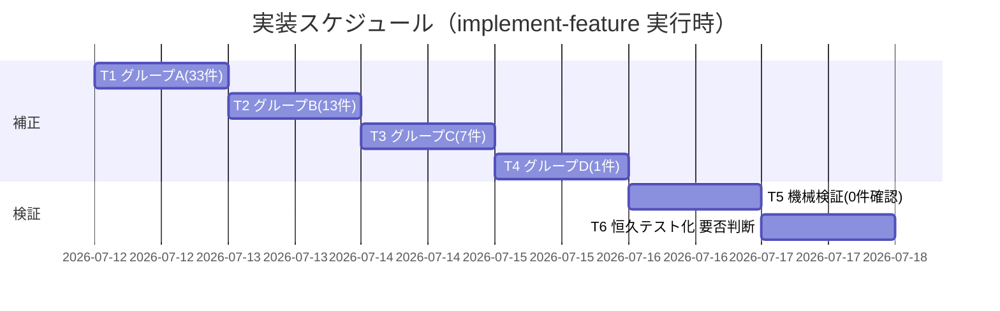

# 実装計画書: テンプレート群のクロス参照相対リンク深度是正

**プロジェクト名**: テンプレート相対リンク深度是正
**作成日**: 2026 年 07 月 12 日
**最終更新**: 2026 年 07 月 12 日

> **重要**: **このドキュメントは常に更新**: 実装計画の変更、進捗状況の更新、バグの記録などがあった場合は、即座にこのドキュメントを更新してください。
> **必須項目**: 「必須」と明記した欄は空欄・抽象語のみで提出しないこと。テスト観点・BDD 仕様は具体ケースを 1 件以上記載すること。
>
> **用語**: [.agent-skill-chain/source/CONCEPTS.md §用語規約](../../../../../../.agent-skill-chain/source/CONCEPTS.md#用語規約) を参照。

---

## 1. 実装概要

### 1.1 実装方針（必須）

02_設計.md §3 のグループ別補正ルール（A: templates 直下 +1、B: `agents/` +1、C: `docs/` はリンク先実体基準で個別算出、D: 参照方向修正）に従い、genuine 54 件の相対リンク文字列を是正する。是正の正しさは §3.3 の grep+realpath 再実行で「genuine unresolved 0 件・placeholder 18 件不変」を機械確認して担保する。**本計画のタスク（実編集）は後続 implement-feature フェーズで実行される**（本 issue の design-feature フェーズでは計画確定までを行い、テンプレートは編集しない。02 §0 のスコープに従う）。

### 1.2 実装順序（必須: 1 件以上）

グループ A → B → C → D の順に補正し、最後に検証タスク（T5）で全体を機械確認する。恒久テスト化の要否（T6）は判断のみ。



---

## 2. タスク分解

**必須**: 各タスクに「テスト観点」（2.x.3）と「単体テスト仕様（BDD）」（2.x.4）を記載する。観点定義は **02_設計 §6** および **RULES のテスト戦略・[TEST_BDD_FORMAT.md](../../../../../../.agent-skill-chain/source/TEST_BDD_FORMAT.md)** を参照。

### 2.1 タスク 1（T1）: グループ A 補正（templates 直下・source/ 参照 33 件）

#### 2.1.1 概要（必須）

templates 直下 9 ファイルの `.agent-skill-chain/source/` 参照 33 件を、先頭 `../../`（2 階層上）→ `../../../`（3 階層上）に是正する。

#### 2.1.2 実装内容（必須: 1 件以上）

- 対象: `00_システム理解.md:126`(spec 3 リンク)・`00_要求定義.md:20`・`01_要件定義.md:14`・`02_設計.md:14,20,37,45,66(4),73,89,95,118(2),256(2)`(15)・`03_実装計画.md:15,45,47,61,94,209`(6)・`04_review.md:14,16(2),37`(4)・`05_最終確認チェックリスト.md:21`・`90_issues.md:14`・`99_PR.md:16`。
- 各リンクトークン（`](` 直後）の先頭 `../../` を `../../../` に置換。**本文・バッククォート内の `../../` 言及は改変しない**（実リンクのみ対象。自己拡張ワークフロー §close 補正と同じ注意）。

#### 2.1.3 テスト観点（必須）

**参照**: 観点定義は [02_設計 §6](./02_設計.md) および [RULES のテスト戦略](../../../../../../.agent-skill-chain/source/RULES.md#テスト戦略必須要件)。以下は本タスクの具体ケース。

##### 単体（必須 1 件以上）

- 正常系: `02_設計.md:14` の `](../../.agent-skill-chain/source/CONCEPTS.md)` が `](../../../.agent-skill-chain/source/CONCEPTS.md)` になり realpath 解決する。
- 境界: 1 行に複数リンクがある `02_設計.md:66`（spec 4 リンク）で全リンクが是正され、各々解決する。

##### 結合/API（該当時は必須 1 件以上）

- グループ A 補正後、templates 直下 33 件が grep+realpath で全 OK になる。

##### E2E/受け入れ

- 01 成功基準のうち「templates 直下の genuine 0 件」を満たす。

##### バリデーション

- 本文中の `../../` を含む説明文（あれば）が変更されていないこと。

#### 2.1.4 単体テスト仕様（BDD）（必須）

```gherkin
Feature: グループA 補正（templates 直下の source/ 参照 +1 階層）
  Scenario: 2 階層上リンクを 3 階層上へ是正
    Given .agent-skill-chain/runtime/templates/02_設計.md:14 のリンクが "](../../.agent-skill-chain/source/CONCEPTS.md)" である
    When 先頭 ../../ を ../../../ に是正する
    Then "](../../../.agent-skill-chain/source/CONCEPTS.md)" は realpath -m で .agent-skill-chain/source/CONCEPTS.md に解決する
```

**検証コマンド例（Given/When/Then をインラインコメントで明記）**

```bash
# Given: 是正後の 02_設計.md をリンク元ディレクトリ基準で解決
f=.agent-skill-chain/runtime/templates/02_設計.md
# When: 是正後リンクを realpath で解決
tgt=$(realpath -m "$(dirname "$f")/../../../.agent-skill-chain/source/CONCEPTS.md")
# Then: 実在すれば OK
[ -e "$tgt" ] && echo OK || echo BROKEN
```

#### 2.1.5 依存関係

- なし（先頭タスク）。

#### 2.1.6 見積もり

- **工数**: 0.5 日 / **優先度**: 高

### 2.2 タスク 2（T2）: グループ B 補正（`agents/` 配下・source/ 参照 13 件）

#### 2.2.1 概要（必須）

`agents/scribe_claude.md`(9)・`agents/scribe_cursor.md`(4) の `.agent-skill-chain/source/` 参照を、先頭 `../../../`（3 階層上）→ `../../../../`（4 階層上）に是正する。

#### 2.2.2 実装内容（必須: 1 件以上）

- 対象: `agents/scribe_claude.md:19(3),20,21(2),31(2),32`・`agents/scribe_cursor.md:18,19,30(2)`。
- 各リンクトークンの先頭 `../../../` を `../../../../` に置換。

#### 2.2.3 テスト観点（必須）

##### 単体（必須 1 件以上）

- 正常系: `agents/scribe_claude.md:19` の `](../../../.agent-skill-chain/source/skills/agent/run_command.md)` → `](../../../../.agent-skill-chain/source/skills/agent/run_command.md)` が解決する。

##### 結合/API

- グループ B 補正後、`agents/` 配下 13 件が grep+realpath で全 OK。

##### E2E/受け入れ

- 「agents/ 配下の genuine 0 件」を満たす。

##### バリデーション

- `agents/` 内の同一ディレクトリ・他参照リンク（あれば）が不変。

#### 2.2.4 単体テスト仕様（BDD）（必須）

```gherkin
Feature: グループB 補正（agents/ の source/ 参照 +1 階層）
  Scenario: 3 階層上リンクを 4 階層上へ是正
    Given agents/scribe_cursor.md:18 のリンクが "](../../../.agent-skill-chain/source/scribe/CONTRACT.md)" である
    When 先頭 ../../../ を ../../../../ に是正する
    Then "](../../../../.agent-skill-chain/source/scribe/CONTRACT.md)" は realpath -m で解決する
```

```bash
# Given: 是正後の scribe_cursor.md をリンク元基準で解決
f=.agent-skill-chain/runtime/templates/agents/scribe_cursor.md
# When: 是正後リンクを realpath で解決
tgt=$(realpath -m "$(dirname "$f")/../../../../.agent-skill-chain/source/scribe/CONTRACT.md")
# Then: 実在すれば OK
[ -e "$tgt" ] && echo OK || echo BROKEN
```

#### 2.2.5 依存関係

- T1 と独立（並行可）。

#### 2.2.6 見積もり

- **工数**: 0.3 日 / **優先度**: 高

### 2.3 タスク 3（T3）: グループ C 補正（`docs/` 配下 7 件・リンク先実体基準）

#### 2.3.1 概要（必須）

`docs/` 配下 7 件を、02_設計 §3.2 グループ C の是正表に従い**リンク先実体ごとに個別**是正する（一律 +1 を適用しない。ADR-1/ADR-2）。

#### 2.3.2 実装内容（必須: 1 件以上）

- `DOCS_RULES.md`（`.agent-skill-chain/source/DOCS_RULES.md`）参照 4 件: `docs/README.md:7`→4 階層上、`docs/01_システム概要/README.md:6`・`docs/02_画面設計/README.md:7`・`docs/03_データ設計/README.md:7`→5 階層上（いずれも `.agent-skill-chain/source/DOCS_RULES.md` 付き）。
- `AGENTS_MERMAID_RULES.md`（`.agent-skill-chain/runtime/templates/AGENTS_MERMAID_RULES.md`）参照 3 件: `docs/01_システム概要/README.md:7`・`docs/02_画面設計/README.md:8`・`docs/03_データ設計/README.md:8`→ `../../AGENTS_MERMAID_RULES.md`（現状 3 階層上からの**短縮**）。
- 02_設計 §3.2 グループ C の表を唯一の是正基準とし、行ごとに現状→是正後を置換する。

#### 2.3.3 テスト観点（必須）

##### 単体（必須 1 件以上）

- 正常系(DOCS_RULES): `docs/README.md:7` が `](../../../../.agent-skill-chain/source/DOCS_RULES.md)` になり解決。
- 正常系(過剰是正の縮退): `docs/01_システム概要/README.md:7` の `](../../../AGENTS_MERMAID_RULES.md)`（3 階層上・過剰）が `](../../AGENTS_MERMAID_RULES.md)`（2 階層上）になり解決。
- 回帰: 同一ファイル内で DOCS_RULES 行は深く、MERMAID 行は浅く是正される（増減混在）ことを確認。

##### 結合/API

- グループ C 補正後、`docs/` 配下 7 件が grep+realpath で全 OK。既存 OK の `docs/` リンク（例 `05_規約/README.md:7` の 6 階層上）が壊れないこと。

##### E2E/受け入れ

- AC-4/AC-5 の対応方針（ADR-2: テンプレート物理配置基準）どおりに是正され、「docs/ 配下の genuine 0 件」を満たす。

##### バリデーション

- 一律 +1 を適用していないこと（MERMAID 参照が過剰是正されず短縮されている）。

#### 2.3.4 単体テスト仕様（BDD）（必須）

```gherkin
Feature: グループC 補正（docs/ はリンク先実体基準で個別是正）
  Scenario: DOCS_RULES 参照は深さ不足を補い、MERMAID 参照は過剰を縮める
    Given docs/01_システム概要/README.md:6 が "](../../../../.agent-skill-chain/source/DOCS_RULES.md)"、:7 が "](../../../AGENTS_MERMAID_RULES.md)" である
    When :6 を 5 階層上へ、:7 を 2 階層上（../../）へ是正する
    Then :6 は .agent-skill-chain/source/DOCS_RULES.md に、:7 は .agent-skill-chain/runtime/templates/AGENTS_MERMAID_RULES.md に解決する
```

```bash
# Given: docs/01_システム概要/README.md をリンク元基準で解決
d=.agent-skill-chain/runtime/templates/docs/01_システム概要
# When: 是正後の 2 リンクを realpath で解決
t1=$(realpath -m "$d/../../../../../.agent-skill-chain/source/DOCS_RULES.md")
t2=$(realpath -m "$d/../../AGENTS_MERMAID_RULES.md")
# Then: 両方実在すれば OK
{ [ -e "$t1" ] && [ -e "$t2" ]; } && echo OK || echo BROKEN
```

#### 2.3.5 依存関係

- T1・T2 と独立（並行可）。

#### 2.3.6 見積もり

- **工数**: 0.4 日 / **優先度**: 高（誤是正リスクが最も高い群のため最も慎重に）

### 2.4 タスク 4（T4）: グループ D 補正（参照方向修正 1 件）

#### 2.4.1 概要（必須）

`00_要求定義.md:182` の `../00_システム理解.md`（深度でなく参照方向の誤り）を同一ディレクトリ参照 `./00_システム理解.md` に是正する。

#### 2.4.2 実装内容（必須: 1 件以上）

- `](../00_システム理解.md)` → `](./00_システム理解.md)` に置換。

#### 2.4.3 テスト観点（必須）

##### 単体（必須 1 件以上）

- 正常系: 是正後 `./00_システム理解.md` が `.agent-skill-chain/runtime/templates/00_システム理解.md` に解決する。

##### 結合/API

- 補正後 grep+realpath で当該行が OK。

##### E2E/受け入れ

- 「同一ディレクトリ参照の genuine 0 件」を満たす。

##### バリデーション

- 深さ（`../` 段数）増減でなく `../`→`./` の方向修正であること。

#### 2.4.4 単体テスト仕様（BDD）（必須）

```gherkin
Feature: グループD 補正（参照方向の修正）
  Scenario: 上位参照を同一ディレクトリ参照へ修正
    Given 00_要求定義.md:182 が "](../00_システム理解.md)" で .agent-skill-chain/runtime/00_システム理解.md に誤解決する
    When "](./00_システム理解.md)" に修正する
    Then realpath -m は .agent-skill-chain/runtime/templates/00_システム理解.md に解決する
```

```bash
# Given: 00_要求定義.md をリンク元基準で解決
f=.agent-skill-chain/runtime/templates/00_要求定義.md
# When: 是正後リンクを realpath で解決
tgt=$(realpath -m "$(dirname "$f")/./00_システム理解.md")
# Then: 実在すれば OK
[ -e "$tgt" ] && echo OK || echo BROKEN
```

#### 2.4.5 依存関係

- T1〜T3 と独立。

#### 2.4.6 見積もり

- **工数**: 0.1 日 / **優先度**: 中

### 2.5 タスク 5（T5）: 全体機械検証（genuine unresolved 0 件・placeholder 不変）

#### 2.5.1 概要（必須）

T1〜T4 補正後、02_設計 §3.3 の検証パイプラインを templates 全体に再実行し、合格基準を機械確認する。

#### 2.5.2 実装内容（必須: 1 件以上）

- 02_設計 §3.3 の grep+realpath スクリプトを実行し、BROKEN 集合を得る。
- BROKEN から placeholder 18 件（01 §5 の file:line）を除いた genuine が **0 件**であることを確認。
- placeholder 18 件が BROKEN のまま**不変**であることを確認（誤って実パス化していない）。
- OK 総数が 215 件（161+54）に増加していることを確認。

#### 2.5.3 テスト観点（必須）

##### 単体（必須 1 件以上）

- 該当なし（本タスクは結合/E2E 検証タスク）。

##### 結合/API

- templates 全体 233 リンクの再解決で genuine unresolved=0。

##### E2E/受け入れ

- 01 §6 成功基準（genuine 0 件・placeholder 除外・本文不変）を全て満たす。

##### バリデーション

- placeholder 18 件が BROKEN のまま（回帰チェック）。

#### 2.5.4 単体テスト仕様（BDD）（必須）

```gherkin
Feature: 全体機械検証
  Scenario: 補正後に genuine 深度不整合が 0 件になる
    Given T1〜T4 の補正が templates/ 配下に適用されている
    When 02_設計 §3.3 の grep+realpath 検証を実行する
    Then BROKEN から placeholder 18 件を除いた genuine 件数は 0 になり、placeholder 18 件は不変である
```

```bash
# Given/When: 検証パイプラインを実行し BROKEN を集計
# Then: placeholder を除いた genuine が 0 であることを確認する（placeholder 集合は 01 §5 の file:line）
grep -rEon '\]\((\.\./|\./)[^)]+\)' .agent-skill-chain/runtime/templates | while IFS=: read -r f n rest; do
  link=$(printf '%s' "$rest" | sed -E 's/^\]\(//; s/\).*$//; s/#.*$//')
  [ -e "$(realpath -m "$(dirname "$f")/$link")" ] || echo "BROKEN|${f#*/templates/}:$n"
done   # 出力 BROKEN のうち placeholder 18 件以外が 0 件なら合格
```

#### 2.5.5 依存関係

- T1・T2・T3・T4 に依存（全補正完了後）。

#### 2.5.6 見積もり

- **工数**: 0.2 日 / **優先度**: 高

### 2.6 タスク 6（T6）: 恒久テスト化の要否判断（判断のみ・実装しない）

#### 2.6.1 概要（必須）

ADR-3 に基づき、`test/` 配下への「templates リンク健全性」恒久テスト追加の要否を判断する。本 issue では**実装せず**、要否と提案を完了報告に残す。

#### 2.6.2 実装内容（必須: 1 件以上）

- `test/` が非配布・保守者自己テスト領域であること（自己拡張ワークフロー §理由）を踏まえ、恒久テスト追加を別 issue 候補として提案するに留める（サブによる独断起票の禁止に従い、起票はメインの承認後）。

#### 2.6.3 テスト観点（必須）

##### 単体 / 結合 / E2E

- 該当なし（判断タスク・成果物なし）。

##### バリデーション

- 本 issue 内で `test/` を変更していないこと。

#### 2.6.4 単体テスト仕様（BDD）（必須）

```gherkin
Feature: 恒久テスト化の要否判断
  Scenario: 本 issue では test/ を変更しない
    Given ADR-3 が案X（検証コマンド明文化）を本 issue 範囲とする
    When 恒久テスト化の要否を判断する
    Then test/ 配下は変更されず、追加要否は別 issue 候補として提案される
```

#### 2.6.5 依存関係

- T5 完了後（検証コマンドが確立した後に恒久化要否を評価）。

#### 2.6.6 見積もり

- **工数**: 0.1 日 / **優先度**: 低

---

## テスト観点

全体のテスト観点は「補正後に genuine unresolved が 0 件」「placeholder 18 件は不変」「本文（見出し・説明文・バッククォート内の `../` 言及）は不変」の 3 点に集約される。各タスクの §2.x.3 に具体ケースを記載した。監査は本セクションと §2.x.3 の対応を検査する。

---

## 単体テスト

各タスクの補正ルールが対象 file:line を正しい相対パスへ変換し `realpath -m` で解決することを単体観点とする。BDD 仕様は各タスク §2.x.4 に記載。

---

## BDD

BDD シナリオは各タスク（T1〜T6）§2.x.4 に Given/When/Then 形式で記載。形式は [TEST_BDD_FORMAT.md](../../../../../../.agent-skill-chain/source/TEST_BDD_FORMAT.md) に従う。01_要件定義.md §2.2 の 3 シナリオ（棚卸し・source/ 系深さ・docs/ 二重コンテキスト）と本計画のタスクは次のとおり対応する: シナリオ1 → T5、シナリオ2 → T1/T2/T4、シナリオ3 → T3。

---

## 3. 実装スケジュール

### 3.1 マイルストーン

| マイルストーン | 期日 | 成果物 |
| --- | --- | --- |
| M1 補正完了（T1〜T4） | implement-feature 実行日 | 是正済み templates 群 |
| M2 検証合格（T5） | M1 当日 | genuine unresolved 0 件の検証出力 |
| M3 恒久化要否（T6） | M2 後 | 判断結果（完了報告に記載） |

### 3.2 実装フェーズ

#### フェーズ 1: 補正

- **期間**: 1 日 / **タスク**: T1・T2・T3・T4

#### フェーズ 2: 検証・判断

- **期間**: 1 日 / **タスク**: T5・T6

---

## 4. テスト計画

観点・レベル・BDD 形式の定義は **02_設計 §6** および **RULES のテスト戦略・TEST_BDD_FORMAT** を参照。本計画では各タスクの §2.x.3 に具体ケース、§2.x.4 に BDD を記載した。

### 4.1 テストの優先順位

- グループ C（docs/・7 件）は増減混在で誤是正リスクが最も高く、厚く検証する（既存 OK リンクの回帰を必ず含める）。
- T5 の全体再検証を回帰テストとして必ず含める。

---

## 5. リスク管理

### 5.1 実装リスク

- **リスク**: グループ C を誤って一律 +1 補正すると `AGENTS_MERMAID_RULES.md` 参照を過剰是正して壊す。
  - **対策**: グループ C は 02_設計 §3.2 の是正表（実体別）を唯一の基準とし、T3 のバリデーションで「一律 +1 でないこと」を確認する。
- **リスク**: 本文・バッククォート内の `../` 言及（過去レビュー証跡等）を実リンクと誤認して改変する。
  - **対策**: 置換対象を `](` 直後のリンクトークンに限定する（自己拡張ワークフロー §close 補正と同一注意）。T1 バリデーションで確認。
- **リスク**: placeholder 18 件を誤って実パス化する。
  - **対策**: 分類器は 01 §5 の列挙を不変集合として扱い触れない。T5 で placeholder が BROKEN のまま不変であることを回帰確認。

---

## 6. 参考資料

### プロジェクトドキュメント

- [`02_設計.md`](./02_設計.md) - 設計（補正ルール・ADR の正）
- [`01_要件定義.md`](./01_要件定義.md) - 要件定義（棚卸し実測値・placeholder 列挙の正）

### その他の参考資料

- [.agent-skill-chain/source/TEST_BDD_FORMAT.md](../../../../../../.agent-skill-chain/source/TEST_BDD_FORMAT.md) - BDD 形式
- [.agent-skill-chain/project/自己拡張ワークフロー.md §close 移動時の相対リンク補正](../../../../../../.agent-skill-chain/project/自己拡張ワークフロー.md#close-移動時の相対リンク補正) - 検証パイプラインの先例

---

## 7. 前のステップ

この実装計画書は、以下のドキュメントを基に作成されています：

- **前**: [`02_設計.md`](./02_設計.md) - 設計フェーズ

---

## 8. 次のステップ

この実装計画書の承認後、以下に進みます：

- **次工程（必須ゲート）**: [review-docs](../../../../../../.agent-skill-chain/source/commands/review-docs.md) - 実装着手前のドキュメントレビュー（design-feature 完了と implement-feature 着手の間の必須ゲート）。
- レビュー通過後: implement-feature フェーズで本計画（T1〜T6）を実行する（実際のテンプレート編集はそこで行う）。

**用語**: [.agent-skill-chain/source/CONCEPTS.md §用語規約](../../../../../../.agent-skill-chain/source/CONCEPTS.md#用語規約) を参照。
