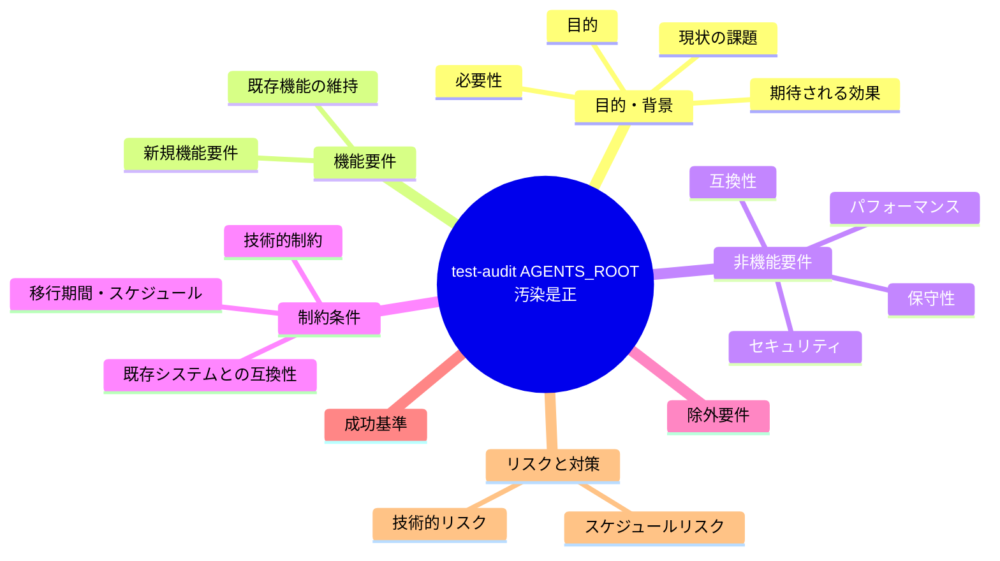
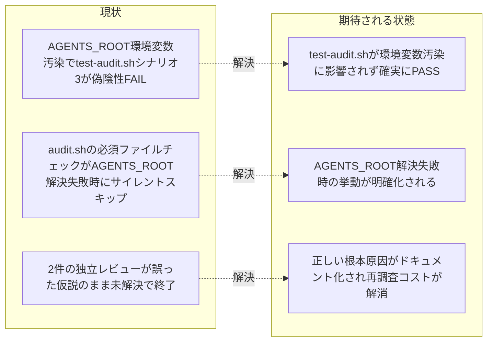

# 要求定義書: test-audit.sh 必須ファイル欠落検知の AGENTS_ROOT 環境変数汚染是正

**プロジェクト名**: test-audit.sh 必須ファイル欠落検知の AGENTS_ROOT 環境変数汚染是正
**作成日**: 2026 年 07 月 12 日
**最終更新**: 2026 年 07 月 12 日

> **重要**:
>
> - 要求定義書は、プロジェクトの全体像を把握するためのものです。詳細な技術仕様や実装方法は要件定義書以降で記載します。必要最低限の情報に収めることを心掛けてください。
> - **このドキュメントは常に更新**: 要求の変更や追加があった場合は、即座にこのドキュメントを更新してください。ドキュメントは「生きているドキュメント」として扱い、実装内容と常に同期させます。
> - **必須項目**: 以下の「必須」と明記した項目は空欄・抽象語のみ（例: 「{説明}」のまま）で提出しないこと。判定可能な形（目的は1文・成功基準は○/×で判定できる記載等）で記入すること。
>
> **用語**: [.agent-skill-chain/source/CONCEPTS.md §用語規約](../../../../../../.agent-skill-chain/source/CONCEPTS.md#用語規約) を参照。

---

## 要求定義の全体像

**注意**:

- 上記の「プロジェクト名」は例です。実際のプロジェクト名に置き換えてください。
- マインドマップは全体像を把握するためのものです。主要なセクション名程度に留め、詳細は記載しないでください。

---

## 1. 目的・背景

### 1.1 目的（必須）

test-audit.sh シナリオ3の環境変数汚染由来の偽陰性を是正し、必須ファイル欠落検知を実効化する

### 1.2 背景

- **現状の課題**:
  - `test/test-audit.sh` のシナリオ3（必須ファイル欠落検知。`make_min_tree` から `CORE.md` を削除して `.agent-skill-chain/source/enforcement/ci/audit.sh` を実行し、`exit != 0` かつ `Missing required file` メッセージが出ることを期待するテスト）が、本リポジトリを扱う一部の実行環境（本 issue 起票時点の Claude Code エージェントセッションを含む）で **FAIL** する（実際は `exit 0`・`Missing required file` メッセージなし）。
  - 本事象は 2 件の独立レビューで既に検出されている（[review-docs必須化/04_review.md §3.1・§10.1課題1](../20260711_194044_review-docs必須化/04_review.md)、[workflowDB由来検知欠如是正/04_review.md](../20260711_062125_workflowDB由来検知欠如是正/04_review.md)）。いずれも「HEAD 版 audit.sh でも同一挙動が再現する既存不具合であり自issueの変更が原因ではない」ことは確認済みだが、根本原因は「ストーリー8 の `.agents/`→`.agent-skill-chain/source/` ネスト移行に伴う `AGENTS_ROOT` 解決または `make_min_tree` 側の未追随の可能性」という**未確定の推測**にとどまり、実際の原因特定には至っていない。
  - 本 issue の要求定義作業として実際に再現・調査した結果、**ネスト移行とは無関係**であることが判明した。実際の原因は次の2点の複合である。
    1. **環境変数汚染**: 本 issue の作業環境のシェルには、すでに `AGENTS_ROOT=${CLAUDE_PROJECT_DIR}/.agent-skill-chain/source`（`CLAUDE_PROJECT_DIR` が未設定のため展開されない、壊れたテンプレート文字列）が事前に設定されている（`env | grep -i AGENTS_ROOT` で確認済み）。この値は本リポジトリの `.claude/settings.json`（内容は `{}`）にも、ホームディレクトリの設定・dotfile にも見当たらず、外部（呼び出し元の Claude Code ハーネス側のフック実行用環境変数注入）が発生源と推測される。
    2. **`audit.sh` 側の設計上のフォールバック欠如**: `audit.sh:83` の `AGENTS_ROOT="${AGENTS_ROOT:-.agent-skill-chain/source}"` は bash の仕様上、呼び出し元シェルで `AGENTS_ROOT` が**既に設定されている場合はデフォルト値を採用しない**。加えて `audit.sh:216-225` の必須ファイル存在チェック（#1）は `if [[ -d "$PROJECT_ROOT/$AGENTS_ROOT" ]]` という外側のディレクトリ存在ガードで丸ごと囲われており、`AGENTS_ROOT` が誤った値（存在しないパス）を指す場合、必須ファイルチェック自体が **FAIL させることなく黙ってスキップされる**（fail-open）。
  - `test/test-audit.sh` の `make_min_tree`（同ファイル:43-53）による隔離は `mktemp -d` によるファイルツリーの隔離のみを行っており、**呼び出し元シェルの環境変数（`AGENTS_ROOT` 等）は一切隔離していない**。このため、テスト実行環境に `AGENTS_ROOT` が事前設定されていると、テストの暗黙の前提（「未設定ならデフォルト値 `.agent-skill-chain/source` が使われる」）が崩れ、シナリオ3が意図した検証（必須ファイル欠落を検知できること）を実際には行わないまま「たまたま」結果が変わる。
  - 実際に `env -u AGENTS_ROOT bash .agent-skill-chain/source/enforcement/ci/audit.sh <tmp>`（`AGENTS_ROOT` を明示的に unset）で同一の最小ツリー（`CORE.md` 欠落）を実行したところ、期待どおり `FAIL: Missing required file ...` が出力され `exit 1` となることを確認した。すなわち **audit.sh の必須ファイルチェックのロジック自体は正しく動作する**。問題は「テストの環境分離が不十分」かつ「audit.sh がルート解決失敗時にサイレントスキップする」という 2 点にある。

- **必要性**:
  - `test-audit.sh` は `audit.sh` の必須ファイル欠落検知（#1）が正しく機能し続けることを保証する回帰テストである。この検知が実行環境（特にエージェントによる自動実行環境）に依存して無効化される状態を放置すると、将来 `CORE.md` 等の必須ファイルが誤って削除されても test が気づけず、リグレッションを見逃す。
  - 2 件の独立レビューが誤った仮説（ストーリー8 ネスト移行未追随）のまま「別 issue として追跡を推奨」で終わっている。今回の要求定義で正しい根本原因を記録することで、次に着手する担当者が同じ誤った仮説から出発して調査時間を浪費することを防ぐ。

### 1.3 期待される効果（必須: 1 件以上）

- **効果 1**: `test/test-audit.sh` のシナリオ3が、呼び出し元シェルの `AGENTS_ROOT` 環境変数汚染の有無に関わらず、確実に意図どおり動作する（○/×判定: `AGENTS_ROOT` を汚染した状態・していない状態のいずれで `bash test/test-audit.sh` を実行してもシナリオ3の 2 アサーション（`exit != 0`・`Missing required file` メッセージ）が PASS する）。
- **効果 2**: `audit.sh` の必須ファイル存在チェック（#1）について、`AGENTS_ROOT` 解決結果のディレクトリが見つからない場合の扱いが「無条件のサイレントスキップ」から、少なくとも意図が判別できる挙動（設計フェーズで fail-closed 化・WARN 出力等の選択肢を比較し決定）に是正される。

**現状と期待される状態の比較**:

---

## 2. 機能要件

### 2.1 既存機能の維持（該当する場合）

- `audit.sh` の既存チェック（#1〜#32）の判定ロジック・既存の正常経路（`AGENTS_ROOT` 未設定時のデフォルト動作）は変更しない。
- `test-audit.sh` の既存シナリオ（T1・T2・T4・SC1・SC4A/B・GUARD・EDGE・S32 系列 7 件など）の挙動・PASS 状態を壊さない。

### 2.2 新規機能要件

- `test/test-audit.sh` が `make_min_tree` を用いる各シナリオ（少なくともシナリオ3）を実行する際、呼び出し元シェルに `AGENTS_ROOT`（および同様の仕組みで汚染されうる関連環境変数）が事前設定されていても、その値の影響を受けず `audit.sh` のデフォルト解決（`.agent-skill-chain/source`）が使われることを保証する隔離手段を導入する。
- `audit.sh` の必須ファイル存在チェック（#1）について、`AGENTS_ROOT` 解決先ディレクトリが存在しない場合の挙動を再検討し、少なくとも「無条件でチェック全体をサイレントスキップする」以外の挙動（例: 明示的な WARN 出力、fail-closed 化、等。具体案は設計フェーズで比較検討し決定する）を導入する。

---

## 3. 非機能要件

### 3.1 パフォーマンス

- 特になし。既存テストスイート（`test/test-audit.sh` 全体・`test/run-all.sh`）の実行時間に大きな影響を与えないこと。

### 3.2 セキュリティ

- 本是正により、必須ファイル欠落検知という品質ゲートの fail-open な抜け穴を、環境変数汚染という外部要因に対して塞ぐ。

### 3.3 互換性

- 既存の `test-audit.sh` 全シナリオ、既存 CI（`.github/workflows/self-enforce.yml` の enforcement audit step 含む）の挙動に悪影響を与えないこと。
- `audit.sh` を利用する他の消費者プロジェクト（`AGENTS_ROOT` を独自に設定して使う可能性がある環境）に対する後方互換性を考慮すること。

### 3.4 保守性

- 根本原因（環境変数汚染・audit.sh のサイレントスキップ設計）を本ドキュメントに明記することで、以後同じ事象が再発した場合の無駄な再調査を防ぐ。

---

## 4. 制約条件

### 4.1 技術的制約

- bash の `${VAR:-default}` は、変数が「既に設定されている（空文字列を含む）」場合はその値をそのまま使う仕様であるため、外部環境変数汚染からテストを守るには明示的な `unset`/`env -u` 等の対策が必要である。
- `.agent-skill-chain/project/自己拡張ワークフロー.md §テストの tmp 隔離（必須）` に従い、検証は `mktemp -d` の隔離ツリーで行い、本開発リポジトリの `.agent-skill-chain/source/` `.claude/` `.cursor/` `.agent-skill-chain/runtime/` `workflow.db` を変更・破壊しないこと。

### 4.2 既存システムとの互換性

- `audit.sh` 側の挙動を変更する場合、既存の必須ファイルチェック（#1）が本来検知すべき「本物の欠落」を見逃さないこと。
- fail-closed 化などの強い変更を選択する場合、`AGENTS_ROOT` が指すディレクトリ自体が異なる配置になりうる消費者プロジェクト（本リポジトリ以外の `.agent-skill-chain/source` 配置系）を誤って FAIL させないよう、02_設計フェーズで影響範囲を十分検討すること。

### 4.3 移行期間・スケジュール

- 特になし。影響範囲の小さい是正であり、段階的移行は不要と見込む（設計フェーズで確定）。

---

## 5. 除外要件

- `test-audit.sh` の本事象以外の既存失敗シナリオ（もしあれば）の是正。
- `audit.sh` の #1（必須ファイル存在チェック）以外のチェック項目の見直し。
- ストーリー8 の `.agents/`→`.agent-skill-chain/source/` ネスト移行そのものの再検証（本 issue の調査により無関係と判明済み）。
- `AGENTS_ROOT` 環境変数を誰が・どこで事前設定しているか（呼び出し元 Claude Code ハーネス側の挙動）自体の是正。これは本リポジトリの管理外（外部ツール側の実装）であり、本 issue では「test-audit.sh 側で汚染に対して堅牢にする」対策に限定する。

---

## 6. 成功基準（必須: 1 件以上）

- `AGENTS_ROOT=${CLAUDE_PROJECT_DIR}/.agent-skill-chain/source` を事前 export した汚染環境で `bash test/test-audit.sh` を実行しても、シナリオ3の 2 アサーション（`exit != 0`・`Missing required file` メッセージあり）が PASS すること。
- `AGENTS_ROOT` 未設定のクリーンな環境で `bash test/test-audit.sh` を実行した場合、既存の PASS 件数（是正前の HEAD 時点で確認された FAIL=2 を除く全シナリオ）が退行しないこと。
- 是正後、`AGENTS_ROOT` を汚染した状態で `bash .agent-skill-chain/source/enforcement/ci/audit.sh <必須ファイル欠落済み最小ツリー>` を直接実行しても `FAIL: Missing required file` が出力されることを実測確認すること。

---

## 7. リスクと対策

### 7.1 技術的リスク

- **リスク**: `audit.sh` 側の fail-open 挙動を安易に fail-closed へ変更すると、`AGENTS_ROOT` を独自にプロジェクト外や別配置へ向ける消費者環境で誤 FAIL を誘発する可能性がある。
  - **対策**: 02_設計フェーズで、fail-closed 化・WARN 出力・その他の選択肢を複数比較検討し、既存消費者への影響を洗い出したうえで決定する。

### 7.2 スケジュールリスク

- **リスク**: 特になし（影響範囲の小さい是正）。
  - **対策**: 特になし。

---

## 8. 参考資料

### プロジェクトドキュメント

- 該当する既存 `00_システム理解.md` は本リポジトリ内に見当たらないため参照なし。

### その他の参考資料

- 検出元1: [review-docs必須化/04_review.md §3.1・§10.1課題1](../20260711_194044_review-docs必須化/04_review.md)
- 検出元2: [workflowDB由来検知欠如是正/04_review.md](../20260711_062125_workflowDB由来検知欠如是正/04_review.md)
- `test/test-audit.sh`（`make_min_tree` 関数・シナリオ3、同ファイル 43-53 行目・91-99 行目）
- `.agent-skill-chain/source/enforcement/ci/audit.sh`（`AGENTS_ROOT` 解決 83 行目、必須ファイル存在チェック #1・216-225 行目）

---

## 9. 次のステップ

この要求定義書の承認後、以下のドキュメントを作成します：

- **次**: [`01_要件定義.md`](./01_要件定義.md) - 要件定義フェーズ
