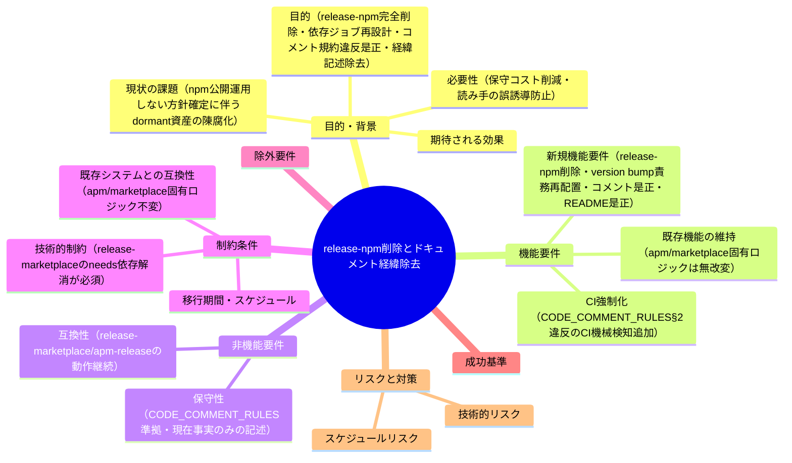
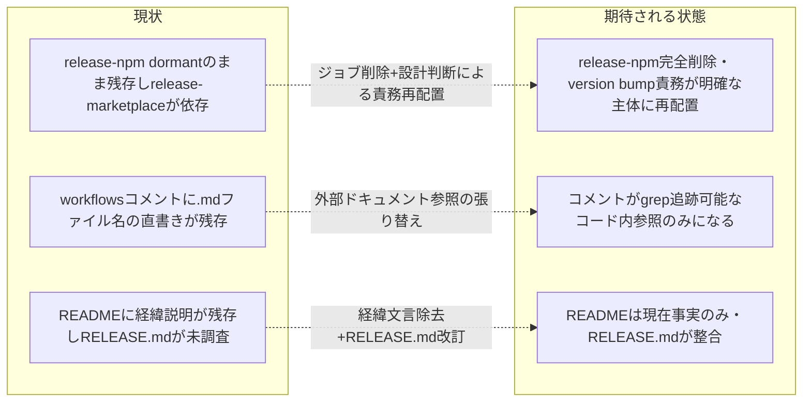

# 要求定義書: release-npm ジョブ完全削除とコメント/README の経緯記述除去

**プロジェクト名**: release-npm削除とドキュメント経緯除去
**作成日**: 2026 年 07 月 12 日
**最終更新**: 2026 年 07 月 12 日

> **重要**:
>
> - 要求定義書は、プロジェクトの全体像を把握するためのものです。詳細な技術仕様や実装方法は要件定義書以降で記載します。必要最低限の情報に収めることを心掛けてください。
> - **このドキュメントは常に更新**: 要求の変更や追加があった場合は、即座にこのドキュメントを更新してください。ドキュメントは「生きているドキュメント」として扱い、実装内容と常に同期させます。
> - **必須項目**: 以下の「必須」と明記した項目は空欄・抽象語のみ（例: 「{説明}」のまま）で提出しないこと。判定可能な形（目的は1文・成功基準は○/×で判定できる記載等）で記入すること。
>
> **用語**: [.agent-skill-chain/source/CONCEPTS.md §用語規約](../../../../.agent-skill-chain/source/CONCEPTS.md#用語規約) を参照。

---

## 要求定義の全体像

**注意**:

- 上記の「プロジェクト名」は例です。実際のプロジェクト名に置き換えてください。
- マインドマップは全体像を把握するためのものです。主要なセクション名程度に留め、詳細は記載しないでください。

---

## 1. 目的・背景

### 1.1 目的（必須）

release-npm ジョブを完全削除し依存関係を再設計、CODE_COMMENT_RULES 違反と README の経緯記述を是正する。

### 1.2 背景

- **現状の課題**:
  - **課題1（release-npm の存在意義喪失）**: npm 公開を運用しない方針が確定している（evidence_source: オーケストレータによるユーザー AskUserQuestion 確認、2026-07-12。「release-npm ジョブを完全に削除する」がユーザーの明示回答であり、dormant のまま残す選択肢は明示的に却下された）。二度と発火しないジョブ・`NPM_TOKEN` ゲート・関連コメントを保持し続ける理由がない。
  - **課題2（release-npm 削除が波及する依存関係）**: `.github/workflows/release.yml` を実地確認（evidence_source: 本ファイル読了によるオーケストレータの grep 結果引用）した結果、`release-marketplace` ジョブは `needs: release-npm` を持ち、`${{ needs.release-npm.outputs.version }}` を `release: v${version} adapters ...` という commit メッセージに使用している（release.yml 280行目付近）。`apm-release` ジョブは `needs: release-marketplace` で `package.json` から直接 version を読むため release-npm の outputs への直接依存はないが、release-npm が担っていた「main へのバージョン bump（patch +1）・書き戻し push・日時タグ作成・GitHub Release 作成」という一連の処理を行う主体が、release-npm 削除後には存在しなくなる。`release-marketplace`／`apm-release` は「bump 済みの main」を前提に動作しているため、この前提を満たす主体をどこに配置するかが本 issue の設計判断（02_設計.md の範囲）として必要になる。**00/01 の時点ではこの論点の存在を明記するにとどめ、断定しない**（選択肢例: release-marketplace に bump 処理を統合する／新規の軽量 bump ジョブを設ける／バージョン bump の自動化自体をやめ手動 `sync-version.sh` 運用にする、等）。
  - **課題3（CODE_COMMENT_RULES 違反の残存）**: `.agent-skill-chain/source/CODE_COMMENT_RULES.md` §2 は「仕様ドキュメント名（`XXX.md` 等）」「章節番号（`§3.2` 等）」「PR/issue/タスク番号」のコメント本文への直書きを禁止している。grep で確認した結果（evidence_source: オーケストレータによる grep、2026-07-12）、現在の作業ツリー（`docs/maintainer/workflow/close/20260712_093757_npm配布導線ノイズ是正/` の未コミット修正適用後）でも次の違反が残存している。
    - `.github/workflows/self-enforce.yml:16` `# 正本: docs/maintainer/workflow/close/20260614_124435_配布とパッケージ構成の再設計/03_実装計画.md`
    - `.github/workflows/self-enforce.yml:57` `# 正本: docs/maintainer/workflow/close/20260615_054810_カバレッジ計測の自リポ適用/02_設計.md, 03_実装計画.md`
    - `.github/workflows/self-enforce.yml:101` `# 正本: docs/maintainer/workflow/close/20260615_114305_bin生成物のgitignore化とpublish時ビルド/02_設計.md, 03_実装計画.md`
    - `.github/workflows/release.yml:19` `# │ （配布方法の確定・NPM_TOKEN 登録を含む詳細は docs/maintainer/RELEASE.md を参照） │`（release-npm 削除に伴い当該バナー段落自体が再設計対象になるため、削除設計と合わせて解消する）
    - 参考（境界事例。grep で検出したが性質が異なる）: `.github/workflows/self-enforce.yml:164` の `.agent-skill-chain/project/COVERAGE_EXCEPTIONS.md` 参照は、close 移動でリネームされる issue ドキュメントではなく安定パスのプロジェクト設定ファイルへの参照であり、§1 の陳腐化防止の趣旨（issue クローズ・章番号繰り上がりによる陳腐化）とは性質が異なる可能性がある。00/01 では「対象として認識している」ことのみ明記し、是正要否の判断は設計フェーズに委ねる。
    - **未コミットの先行修正との関係**: `docs/maintainer/workflow/close/20260712_093757_npm配布導線ノイズ是正/` の 01_要件定義.md ストーリー3 は、上記 self-enforce.yml の 3 箇所・release.yml のバナー参照 1 箇所について「`close/` を含む実在パスへの是正」（リンク切れ解消）のみを対象とし、**ドキュメントファイル名自体をコメントから除去する是正は明示的にスコープ外**としていた（同issue 00 §5 除外要件には直接の記載はないが、01 の受け入れ基準はパスの実在性のみを検証対象とし、CODE_COMMENT_RULES 準拠は扱っていない）。本 issue はその続き・深掘りとして、パスの実在性是正では解消しない「ドキュメントファイル名そのものをコメントに書かない」という規約準拠を扱う。**両者は矛盾しない**（前者はリンク切れ解消、本 issue は規約違反解消であり、対象行が重複していても是正の性質が異なる）。
  - **課題4（README.md の経緯・歴史説明）**: ユーザーが明示指摘（evidence_source: ユーザー発言、2026-07-12。「やめたという情報自体がノイズ。今の事実だけが分かればいいはずです。過去のいきさつは不要」）。README.md の以下箇所（grep 確認済み。行番号は現在の作業ツリー時点）が該当する。
    - 49行目付近: 「npm 公開は取りやめ済みであり、基本は `apm install` を推奨する。」
    - 73行目付近: 「npm 公開は取りやめ済みのため、`npx` は npm レジストリではなく GitHub リポジトリを直接参照する（`npx github:owner/repo` 記法）。」
    - 163〜165行目付近: 「現在 npm 公開は今後の課題として保留中であり、自動リリースは無効化（dormant）されている。」（この段落は release-npm 削除により内容自体も陳腐化する。§「リリース手順（メンテナ向け）」節全体を release-npm 削除後の実態に合わせて見直す必要がある）
    - この一般原則（経緯・理由の歴史的説明を書かず、現在の事実のみを記述する）は README 全体・コメント全体に適用されるべきであり、コード側の CODE_COMMENT_RULES.md と同根の思想である。
  - **課題5（`docs/maintainer/RELEASE.md` の整合性未調査）**: `docs/maintainer/RELEASE.md` は npm publish 手順の詳細正本であり、§5「自動リリースの現状（dormant）と再開手順」が release-npm ジョブの dormant 状態・2 手での再開手順を詳細に説明している。release-npm 削除後は「再開」という概念自体が成立しなくなる（削除は不可逆であり dormant とは異なる）ため、本ドキュメントの相当部分が実態と乖離する。調査の結果、`docs/maintainer/apm-package.md:86` にも `release-npm`/`release-marketplace` ジョブへの言及と `docs/maintainer/RELEASE.md §5` への参照があり、同様に陳腐化しうることを確認した（evidence_source: grep 結果）。RELEASE.md（および必要なら apm-package.md）をどう改訂するか（全面改訂／§5 相当の削除／別ドキュメントへの統合等）は設計判断であり、00/01 では「release-npm 削除後に整合性検証と必要な更新を行う」ことのみを要求として明記する。
  - **課題6（CODE_COMMENT_RULES §2 違反がCIで機械的に検知されない）**: 課題3で確認した §2 違反（self-enforce.yml 3 箇所・release.yml バナー 1 箇所）のように、同種の違反が繰り返し紛れ込み、その都度指摘・議論・修正が必要になっている（evidence_source: ユーザー指摘、2026-07-12）。`.agent-skill-chain/source/CODE_COMMENT_RULES.md §5` には「本規約はCI（audit.sh）のgrep検出対象とする」と明記されているが、実地確認（evidence_source: `.agent-skill-chain/source/enforcement/ci/audit.sh` 685〜755行目 check #26、`.github/workflows/self-enforce.yml` 182〜191行目の読了）の結果、次の2点が判明した。
    1. check #26 は既に実装されているが、走査対象を `src`/`app`/`components`（`CODE_COMMENT_SRC_DIRS` で上書き可）に限定し、`.agent-skill-chain/source/` と `.github/workflows/*.yml` を明示的に除外している。本リポジトリはこれらのソースディレクトリを持たない文書/フレームワーク専用パッケージであるため、check #26 は本リポジトリでは実質何も検出しない。
    2. `.github/workflows/self-enforce.yml` 182〜191行目で audit.sh の呼び出し自体が `continue-on-error: true` かつ `|| echo "...non-blocking..."` でラップされており、audit.sh のいかなる FAIL も self-enforce.yml の CI 結果には反映されない（本リポの issue が `docs/maintainer/workflow` 配下にあり `.workflow` 前提の他チェックが誤FAILするための意図的な非ブロッキング運用）。
    したがって「§5 に明記されている」ことと「本リポジトリで実効する強制」の間にはギャップがあり、このギャップが課題3のような違反の反復発生を許している。**00/01 の時点では実装方式（後述の論点）を断定せず、02_設計.md で確定する。**

- **必要性**:
  - npm 公開を運用しない方針が確定した以上、発火しないジョブ・ゲート・関連コメントを保持し続けることは保守コストとノイズを生むだけであり、除去する必要がある。
  - コメントに外部ドキュメント名を直書きする状態を放置すると、今後も issue の close 移動・リネームのたびに同種の陳腐化が再発する。根本原因（ドキュメント名の直書き）を除去する必要がある。
  - README の経緯説明は、現在の利用者にとって「今どう使うか」の判断を妨げるノイズであり、除去する必要がある。

### 1.3 期待される効果（必須: 1 件以上）

- **効果 1**: `.github/workflows/release.yml` から `release-npm` ジョブ（`NPM_TOKEN` ゲート・`npm publish` 一式）が完全に削除され、`release-marketplace`／`apm-release` が release-npm への `needs` 依存なしに動作する状態になる（達成判定: `release.yml` に `release-npm` という文字列が残っていないこと。`release-marketplace` の `needs:` に `release-npm` が含まれないこと）。
- **効果 2**: `release-marketplace`／`apm-release` が前提とする「バージョン bump 済みの main」を作る責務が、設計判断に基づき明確な主体へ再配置される（達成判定: 02_設計.md にバージョン bump 責務の配置先が明記され、release.yml の実装がそれに従っていること）。
- **効果 3**: `.github/workflows/release.yml`・`.github/workflows/self-enforce.yml` のコメントから、外部ドキュメントファイル名（`XXX.md`）・章節番号・issue 番号の直書きが除去される（達成判定: grep `\.md\b` で両ファイルのコメント行に issue ドキュメント名の直書きが検出されないこと。境界事例＝COVERAGE_EXCEPTIONS.md 相当は設計判断に従う）。
- **効果 4**: README.md から「npm 公開は取りやめ済み」等の経緯・過去の意思決定を理由として説明する文言が除去され、現在の事実（何を実行すればどうなるか）のみが記述される（達成判定: README.md の該当 3 箇所が現在事実のみの記述に書き換わっていること）。
- **効果 5**: `docs/maintainer/RELEASE.md` が release-npm 削除後の実態と整合する（達成判定: RELEASE.md に release-npm の再開手順として存在しないジョブへの言及が残っていないこと。必要な更新が実施されていること）。
- **効果 6**: CODE_COMMENT_RULES.md §2 の禁止パターン（仕様ドキュメント名・章節番号・PR/issue/タスク番号）が、`.github/workflows/*.yml` を対象に含む形でCIにより機械的に検知されるようになる（達成判定: 意図的に §2 禁止パターンを含むテスト用コメントを混入させるとCIが失敗し、含まれなければ成功すること）。

**現状と期待される状態の比較**（必要に応じて）:

---

## 2. 機能要件

### 2.1 既存機能の維持（該当する場合）

- `release-marketplace`／`apm-release` ジョブの **apm/marketplace 固有のロジック**（`build-adapters.sh` 呼び出し、決定性検証＝再生成 diff ゼロ検証等）は変更しない。
- `.claude-plugin/marketplace.json`・apm 配布経路（`release/apm` ブランチ・`apm-vX.Y.Z` タグ）の仕様は変更しない。
- README §0（apm 経由）・§2（Claude marketplace 経由の導入手順そのもの）・§3（ローカル配備）の手順自体は変更しない（経緯文言の除去のみ）。

### 2.2 新規機能要件

- **A. release-npm ジョブの完全削除**: `.github/workflows/release.yml` から `release-npm` ジョブ定義（bump・日時タグ・GitHub Release 作成・`NPM_TOKEN` ゲート・`npm publish` の全 step）を削除する。
- **B. バージョン bump 責務の再配置（設計判断・選択肢は 02 で確定）**: `release-marketplace`／`apm-release` が前提とする「bump 済みの main」を作る主体を設計フェーズで決定し実装する。
- **C. CODE_COMMENT_RULES 準拠のコメント是正**: `release.yml`・`self-enforce.yml` のコメントから外部ドキュメントファイル名（`XXX.md`）の直書きを除去し、§4（相互参照の張り替え）に従い、コード参照へ張り替えるか外部参照を伴わない自然文に書き換える。
- **D. README.md の経緯記述除去**: 課題4 で列挙した 3 箇所を含む README.md 全体について、「過去にやめた／保留していた」という経緯説明を除去し、現在の事実（何ができるか・何を実行すればどうなるか）のみを記述する形へ書き換える。§「リリース手順（メンテナ向け）」節は release-npm 削除後の実態に合わせて見直す。
- **E. `docs/maintainer/RELEASE.md` の整合性検証と必要な更新**: release-npm 削除後の実態と整合するよう、少なくとも §5「自動リリースの現状（dormant）と再開手順」を見直す。`docs/maintainer/apm-package.md:86` の関連参照についても整合性を確認する。
- **F. CODE_COMMENT_RULES §2 違反のCI機械検知の追加**: CODE_COMMENT_RULES.md §5 が明記する「CI（audit.sh）のgrep検出対象とする」を実効化する。既存の `audit.sh` check #26 は `.github/workflows/*.yml` を走査対象外としており、かつ `self-enforce.yml` からの呼び出しが `continue-on-error: true` で非ブロッキングであるため、本要件の範囲（少なくとも `.github/workflows/*.yml`）に対しては機能していない。このギャップを埋める実装方式（`self-enforce.yml` への新規blockingステップ追加／`audit.sh` check #26 の走査対象拡張＋呼び出し方法見直し、のいずれか）は設計フェーズ（02_設計.md）で確定する。**除外**: `CODE_COMMENT_RULES.md` 本文の改訂自体は対象外（検知の追加のみを対象とする）。

---

## 3. 非機能要件

### 3.1 パフォーマンス

- 特段の性能要件はない。CI 定義・ドキュメントの構造変更が中心である。

### 3.2 セキュリティ

- `NPM_TOKEN` secret への依存・参照が完全に無くなることで、使われない secret を保持し続けるリスクが低減する。

### 3.3 互換性

- `release-marketplace`／`apm-release` ジョブは、release-npm 削除後も既存の `RELEASE_ENABLED` ゲート・`workflow_dispatch` トリガ・生成物の決定性検証を維持したまま動作し続けること。
- `apm-release` の `apm-vX.Y.Z` タグ付与・`release-marketplace` の `release/marketplace` ブランチ運用は破壊しない。

### 3.4 保守性

- コメントが外部ドキュメントへの直書き参照を持たなくなることで、今後の issue close 移動・リネームによる陳腐化が再発しない。
- README・コメントが「現在の事実のみ」を記述する原則に統一されることで、今後のドキュメント追加・改訂時にも同じ原則が適用されやすくなる。
- CODE_COMMENT_RULES §2 違反がCIで機械的に検知されることで、課題3のような違反の混入がレビュー・議論を経ずに機械的に差し戻される。

---

## 4. 制約条件

### 4.1 技術的制約

- `release-marketplace` は現状 `needs: release-npm` の `outputs.version` を commit メッセージに使用している（release.yml 280行目付近）。release-npm 削除に伴い、この依存を解消する実装が必須である（`package.json` から直接 version を読む等）。
- バージョン bump 処理（`npm version patch --no-git-tag-version` 相当）・日時タグ・GitHub Release 作成という 3 つの処理は、release-npm 削除に伴い個別に「引き継ぐか／廃止するか」を設計判断する必要がある（例えば日時タグ・GitHub Release 作成は npm publish 固有の演出であり必須ではない可能性がある一方、version bump 自体は marketplace/apm 側のバージョン表示に必要）。
- CI検知の実装は、既存の `audit.sh` check #26（`src`/`app`/`components` 限定・`.github/workflows` 除外）および `self-enforce.yml` の `continue-on-error: true` による audit.sh 呼び出しの非ブロッキング運用という既存事実を踏まえ、これらとどう整合させるか（走査対象を拡張するか、別経路の新規ステップとするか）を設計判断とする。

### 4.2 既存システムとの互換性

- `release-marketplace`／`apm-release` ジョブの **apm/marketplace 固有のロジック**（`build-adapters.sh` 呼び出し、決定性検証等）は変更しない（00 §5 除外要件）。
- `docs/maintainer/workflow/close/20260711_015030_agentsOS汎用化_ポリシー統合/90_issues/20260711_024021_npm公開中止_APM転換/02_設計.md §2.6.4` の「既存 dormant 資産（release-npm/release-marketplace ジョブ・ゲート）は無改変で保持する」という過去の決定は、本 issue における「release-npm を完全削除する」というユーザーの新しい確定方針により**明示的に上書き・否定される**。§2.6.4 のうち release-marketplace／apm-release の存続・ゲート維持という部分は継続するが、release-npm 無改変保持の部分は本 issue で覆る。
- `docs/maintainer/workflow/close/20260712_093757_npm配布導線ノイズ是正/` の未コミット修正（`.github/workflows` の issue パス参照を `close/` を含む実在パスへ是正する内容）と矛盾しないこと。同修正は「パスの実在性是正」のみを対象とし、ドキュメントファイル名自体の除去は対象外だったため、本 issue はそれを引き継ぎ深掘りする関係にあり、対象行が重複しても内容として矛盾しない。

### 4.3 移行期間・スケジュール

- 特段の移行期間は不要。CI 定義・ドキュメントの改訂であり、マージ後即時反映される。実行モードは full（00→01→02→03→review-docs→実装→verify-and-close の全工程）とする。release-npm 削除は既存アーキテクチャの変更でありバージョン管理の再設計を伴うため、設計フェーズ（02）を省略しない。

---

## 5. 除外要件

- `release-marketplace`／`apm-release` ジョブの **apm/marketplace 固有のロジック**（`build-adapters.sh` 呼び出し、決定性検証等）の変更は対象外。
- npm publish の再開の検討・実施は対象外（npm 公開を運用しない方針は本 issue の前提であり覆さない）。
- パッケージ名・CLI コマンド名（`agent-skill-chain`／`agents-md`）の変更は対象外。
- `README.md` §0（apm 経由の手順自体）・§2（Claude marketplace 経由の手順自体）・§3（ローカル配備）の手順内容の変更は対象外（経緯文言の除去のみが対象）。
- `docs/maintainer/workflow/close/20260712_093757_npm配布導線ノイズ是正/` が対象とした「registry 前提の npx 記法の GitHub 直接参照への書き換え」（README §導入 1./SETUP.md/claude-hook-e2e.md）は対象外（既に別 issue で対応済み・未コミットで作業ツリーに存在）。
- `CODE_COMMENT_RULES.md` 本文（§1〜§5 の規約自体）の改訂は対象外（検知の追加のみが対象）。

---

## 6. 成功基準（必須: 1 件以上）

- **SC-1**: `.github/workflows/release.yml` に `release-npm` という文字列（ジョブ名・`needs:` 参照含む）が残っていない。
- **SC-2**: `release-marketplace` ジョブが release-npm への `needs` 依存なしに、version 情報を取得して正常に動作する設計・実装になっている。
- **SC-3**: `.github/workflows/release.yml`・`.github/workflows/self-enforce.yml` のコメントに、外部ドキュメントファイル名（`XXX.md`。境界事例の扱いは設計判断に従う）・章節番号・issue/PR 番号の直書きが残っていない（grep で検証可能）。
- **SC-4**: README.md の課題4 で列挙した 3 箇所（および同種の経緯説明があれば同様に）が、現在の事実のみを記述する文言に書き換わっている。
- **SC-5**: `docs/maintainer/RELEASE.md` が release-npm 削除後の実態と整合し、存在しないジョブの再開手順を案内する記述が残っていない。
- **SC-6**: verify-and-close（レビュー・監査・書記記録）が完了している。
- **SC-7**: CI（`self-enforce.yml`）実行時、CODE_COMMENT_RULES.md §2 禁止パターンを意図的に含むテスト用コメントを混入させると検知ステップが失敗し、含まれなければ成功することを確認できる。

---

## 7. リスクと対策

### 7.1 技術的リスク

- **リスク**: `release-marketplace` の version 取得方法を変更する際、`release-npm` が行っていた「main の最新化（rebase）」を怠ると、古い version を参照したまま生成物を作ってしまう可能性がある。
  - **対策**: 設計フェーズで `release-marketplace` 自体に「最新 main の取得 → bump（必要な場合）→ 生成」という一連の処理をどう組み込むかを明確にする。
- **リスク**: バージョン bump 処理の担い手が無くなる／変わることで、`package.json`/`plugin.json`/`apm.yml` の version 同期が崩れる可能性がある。
  - **対策**: 既存の `sync-version.sh --check` によるゲートを維持し、設計判断のいずれを選んでも同期検証は必ず通過することを実装計画に含める。

### 7.2 スケジュールリスク

- **リスク**: `.github/workflows` の 2 ファイルは稼働中の CI 定義であり、削除・書き換えを誤るとジョブが壊れる可能性がある。
  - **対策**: 実装フェーズでは `release-marketplace`／`apm-release` のロジック行（`if:`／`run:`／`needs:` 等）への影響を都度 `git diff` で確認し、apm/marketplace 固有のロジックには手を入れない。
- **リスク**: CODE_COMMENT_RULES §2 のCI検知用grepパターンが甘いと、§3 許可パターン（ファイルパス・シンボル参照）を誤検出し、正当なコード参照コメントがCIで弾かれる可能性がある。
  - **対策**: 設計フェーズで誤検出回避の正規表現を具体化する（既存 `audit.sh` check #26 の `pat_docname`/`pat_section`/`pat_ticket` 実装を参考にできる）。意図的な違反コメント混入テストと正常系コメントの両方で検証する。

---

## 8. 参考資料

### プロジェクトドキュメント

- 上書き対象の既存決定: [`../close/20260711_015030_agentsOS汎用化_ポリシー統合/90_issues/20260711_024021_npm公開中止_APM転換/02_設計.md`](../close/20260711_015030_agentsOS汎用化_ポリシー統合/90_issues/20260711_024021_npm公開中止_APM転換/02_設計.md) §2.6.4 — 「既存 dormant 資産は無改変で保持する」という過去の決定（本 issue で release-npm 部分を上書き）。
- 未コミットで作業ツリーに存在する隣接修正: [`../close/20260712_093757_npm配布導線ノイズ是正/00_要求定義.md`](../close/20260712_093757_npm配布導線ノイズ是正/00_要求定義.md)、[`../close/20260712_093757_npm配布導線ノイズ是正/01_要件定義.md`](../close/20260712_093757_npm配布導線ノイズ是正/01_要件定義.md) — `.github/workflows` の issue パス参照リンク切れ是正（本 issue とは対象行が一部重複するが是正の性質が異なり矛盾しない）。

### その他の参考資料

- [`../../../../.github/workflows/release.yml`](../../../../.github/workflows/release.yml) — release-npm 削除・依存再設計の対象。
- [`../../../../.github/workflows/self-enforce.yml`](../../../../.github/workflows/self-enforce.yml) — コメント是正の対象。
- [`../../../../README.md`](../../../../README.md) — 経緯記述除去の対象。
- [`../../RELEASE.md`](../../RELEASE.md) — 整合性調査・必要な更新の対象。
- [`../../apm-package.md`](../../apm-package.md) — release-npm 言及の整合性確認対象（grep で発見）。
- [`../../../../.agent-skill-chain/source/CODE_COMMENT_RULES.md`](../../../../.agent-skill-chain/source/CODE_COMMENT_RULES.md) — コメント規約の正本（§5 がCI検知対象と規定）。
- [`../../../../.agent-skill-chain/source/enforcement/ci/audit.sh`](../../../../.agent-skill-chain/source/enforcement/ci/audit.sh) — check #26（既存実装。走査対象拡張の要否を設計フェーズで検討）。
- [`../../../../.github/workflows/self-enforce.yml`](../../../../.github/workflows/self-enforce.yml) — CI検知ステップの追加候補、および既存の audit.sh 呼び出し（continue-on-error）との整合の検討対象。

---

## 9. 次のステップ

この要求定義書の承認後、以下のドキュメントを作成します：

- **次**: [`01_要件定義.md`](./01_要件定義.md) - 要件定義フェーズ
