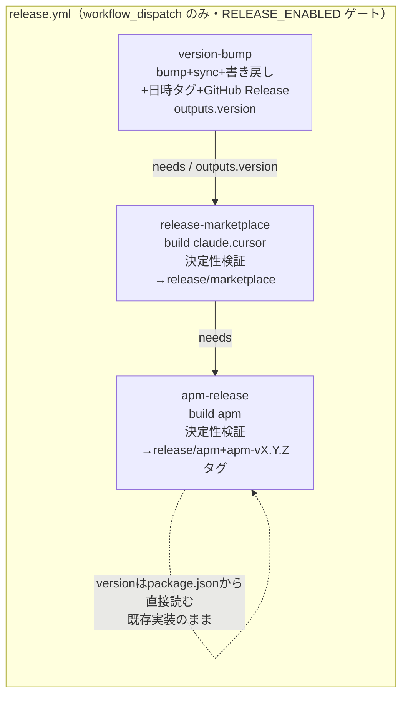
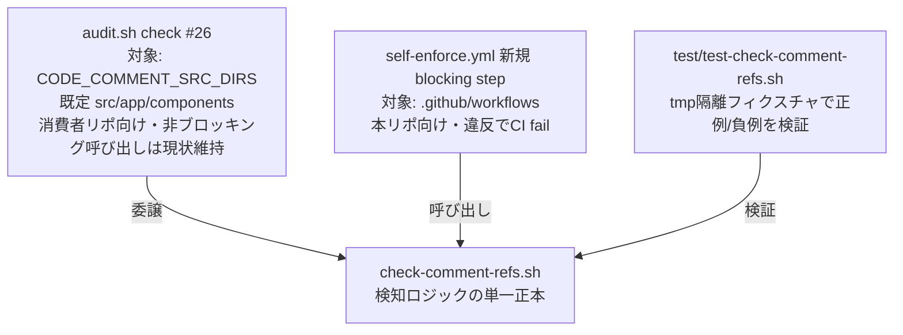

# 設計書: release-npm ジョブ完全削除とコメント/README の経緯記述除去

**プロジェクト名**: release-npm削除とドキュメント経緯除去
**作成日**: 2026 年 07 月 12 日
**最終更新**: 2026 年 07 月 12 日

> **重要**: **このドキュメントは常に更新**: 設計の変更や追加があった場合は、即座にこのドキュメントを更新してください。ドキュメントは「生きているドキュメント」として扱い、実装内容と常に同期させます。
>
> **用語**: [.agent-skill-chain/source/CONCEPTS.md §用語規約](../../../../.agent-skill-chain/source/CONCEPTS.md#用語規約) を参照。

---

## 1. 設計概要

**必須**: 設計方針・原則は [.agent-skill-chain/source/spec/01_設計原則.md](../../../../.agent-skill-chain/source/spec/01_設計原則.md) を**先に参照**した上で、本プロジェクトに**適用するものを選び**記載すること。

### 1.1 設計方針

本 issue は、(1) CI 定義（`release.yml`）からの `release-npm` ジョブ完全削除とバージョン bump 責務の再配置、(2) CI 定義 2 ファイルのコメント規約是正、(3) ドキュメント（README.md・RELEASE.md ほか）の経緯記述除去、(4) コメント規約違反の CI 機械検知の追加、の 4 論点で構成される。設計の主眼は次の 3 点である。

1. **単一責務の再配置**: release-npm が束ねていた「version bump」「日時タグ」「GitHub Release」「npm publish」の 4 責務を個別に棚卸しし、npm publish（`NPM_TOKEN` ゲート含む）のみを廃止、残る 3 責務（bump・日時タグ・GitHub Release 作成）を新規軽量ジョブ `version-bump` へ移す（ADR-2・ADR-3）。
2. **現在の事実のみを記述する文体原則**: README・CI コメント・保守ドキュメントから「過去にこうだったが今はこうなっている」という経緯・歴史説明を除去し、現在の事実（何を実行すればどうなるか）のみを残す（§2.6）。意思決定の理由・経緯の記録は本 02_設計.md（および 00/01）に置き、配布物・ドキュメント側には持ち込まない。
3. **検知ロジックの単一正本化**: コメント外部参照禁止の検知ロジックを新規スクリプト 1 本（`check-comment-refs.sh`）に集約し、`audit.sh` check #26 と self-enforce.yml の新規 blocking step の両方がそれを呼ぶ（ADR-5）。CI とローカルでロジックを二重化しない（本リポの既存慣行: `sync-version.sh`／`verify-npm-pack.sh`／`coverage-check.sh` と同型）。

### 1.2 設計原則（本プロジェクトで適用するもの）

- **単一責務**: `version-bump` ジョブは「bump 済み main を作り、リリースイベントを可視化する（日時タグ・GitHub Release 作成）」ことのみを担い、生成物公開（marketplace/apm）の責務を持たない。検知スクリプトは「与えられたパスのコメント行から禁止パターンを検出する」ことのみを担う。
- **明確な境界**: `release-marketplace`／`apm-release` の apm/marketplace 固有ロジック（`build-adapters.sh` 呼び出し・決定性検証・ブランチ/タグ公開）には一切触れない。ロジック行の変更は `needs:` と version 参照の張り替えのみ（§2.1.2。コメント行の文体是正は §2.6）。
- **UNIX哲学（小さく作る・組み合わせ可能にする）**: 検知スクリプトは引数でパスを受け取る小さな道具とし、audit.sh（消費者向け汎用監査）と self-enforce.yml（本リポの blocking ゲート）が同一の道具を別の対象に対して呼ぶ。
- **可読性（06_設計判断の優先順位 1 位）**: release.yml のヘッダコメントは経緯・再開手順・案名を全廃し、「今この workflow が何をするか」だけを短く記述する。

> 「CQRS」「イベント駆動」は該当なし（本 issue は CI 定義とドキュメントの改訂であり、ランタイムの状態変更/取得を持たない）。

---

## 2. アーキテクチャ設計

### 2.1 責務・境界・参照関係

#### 2.1.1 責務一覧

| コンポーネント | 責務（変更後） |
| --- | --- |
| `.github/workflows/release.yml` — `version-bump` ジョブ（**新設**） | 最新 main を取得し、`package.json` の semver patch を +1、`sync-version.sh --write/--check` で `plugin.json`/`apm.yml` へ従属同期し、**4 ファイルすべて**を main へ書き戻す（§2.5 ADR-2。現行 release-npm の apm.yml 未 commit 欠陥を是正）。さらに JST 日時タグ `vYYYYMMDD.HHMMSS` を決定し、同タグの GitHub Release（自動生成ノート）を作成する（タグ ref は `gh release create` が Release 作成時に生成する。独立した tag push step は現行にも存在せず、新設もしない。ADR-3。現行 release-npm からロジック無改変で移植）。`outputs.version` を後続へ供給する。 |
| `.github/workflows/release.yml` — `release-marketplace` ジョブ | **ロジック行**の変更は `needs: version-bump` への張り替えと `${{ needs.version-bump.outputs.version }}` への参照切替の 2 点のみ。build/決定性検証/公開ロジックは無改変。ジョブ内コメントの経緯語彙（案名・dormant 等）は §2.6 の文体原則でコメント行のみ是正する。 |
| `.github/workflows/release.yml` — `apm-release` ジョブ | **ロジック無改変**（`needs: release-marketplace` のまま。version は checkout 後の `package.json` から直接読む既存実装のまま）。ゲート説明コメントの release-npm 言及・経緯語彙のみ §2.6 で是正する。 |
| `.agent-skill-chain/source/enforcement/ci/check-comment-refs.sh`（**新設**） | 引数で受けたパス配下のコード/CI ファイルのコメント行から、外部ドキュメント名・章節番号・追跡番号の禁止パターンを検出し、`file:line` を列挙して非 0 で終了する（検知ロジックの単一正本）。 |
| `.agent-skill-chain/source/enforcement/ci/audit.sh` — check #26 | 走査対象の決定（`CODE_COMMENT_SRC_DIRS`、既定 `src`/`app`/`components`）と FAIL 集約のみを担い、**ファイル走査・パターン照合は check-comment-refs.sh へ委譲**する。 |
| `.github/workflows/self-enforce.yml` — 新規 blocking step | `check-comment-refs.sh .github/workflows` を呼び、違反があれば CI を fail させる（既存の non-blocking audit step とは独立の系統）。 |
| `README.md` | 現在の導入手順・現在のリリース手順のみを記述する（経緯記述を持たない）。 |
| `docs/maintainer/RELEASE.md` | marketplace／apm の**現在の**リリース手順の詳細正本（npm publish 手順の責務を持たない）。 |
| `docs/maintainer/apm-package.md`・`docs/maintainer/adapters.md` | 現在の release.yml のジョブ構成・トリガと整合した説明のみを持つ。 |

#### 2.1.2 境界（対象外・変更しないこと）

- `release-marketplace`／`apm-release` の **apm/marketplace 固有ロジック**（`build-adapters.sh` 呼び出し、再生成 diff ゼロ検証、`release/marketplace`・`release/apm` ブランチ運用、`apm-vX.Y.Z` タグ付与）は無改変（00 §5 除外要件）。
- `RELEASE_ENABLED` ゲート・`workflow_dispatch` のみのトリガ・`concurrency: group: release` は現状のまま維持する（3 ジョブとも）。
- npm publish の再開検討・パッケージ名/CLI 名変更・`CODE_COMMENT_RULES.md` 本文の改訂は対象外。
- `self-enforce.yml` の既存 step（E2E・カバレッジ・non-blocking audit 呼び出し等）のロジック行は変更しない（コメント是正と新規 step 追加のみ）。
- `package.json` の npm ツールチェーン（`build`/`typecheck`/`test`/`prepare`）・`verify-npm-pack.sh`・self-enforce.yml の npm pack leak check step は本 issue の対象外（`npx github:` 導線と CI 検証で現役のため存続。前提 issue「npm配布導線ノイズ是正」の未コミット修正と整合）。

#### 2.1.3 参照関係

- `version-bump` → `.agent-skill-chain/source/scripts/sync-version.sh`（`--write`/`--check`）
- `release-marketplace` → `needs: version-bump`（`outputs.version` を commit メッセージに使用）
- `apm-release` → `needs: release-marketplace`（既存のまま）
- `audit.sh` check #26 → `check-comment-refs.sh`（同一ディレクトリ `enforcement/ci/` 内の相対参照）
- `self-enforce.yml` 新規 step → `check-comment-refs.sh`（対象 `.github/workflows`）
- `test/test-check-comment-refs.sh`（新設）→ `check-comment-refs.sh`、`test/run-all.sh` → `test/test-check-comment-refs.sh`（TESTS 配列へ登録）
- `README.md` §リリース手順 → `docs/maintainer/RELEASE.md`（入口リンク・要約のみの関係は維持）
- 循環参照なし。いずれも一方向。

### 2.2 システムアーキテクチャ

**必須**: 設計判断は [.agent-skill-chain/source/spec/](../../../../.agent-skill-chain/source/spec/)（[00_spec概要.md](../../../../.agent-skill-chain/source/spec/00_spec概要.md)、[01_設計原則.md](../../../../.agent-skill-chain/source/spec/01_設計原則.md)、[06_設計判断の優先順位.md](../../../../.agent-skill-chain/source/spec/06_設計判断の優先順位.md)）を**先に**参照すること。

#### 2.2.1 release.yml 変更後のジョブ構成



#### 2.2.2 コメント規約検知の構成（単一正本＋2 呼び出し元）



### 2.3 コンポーネント構成

§2.1.1 のとおり。要点は 2 つの「単一正本」である: (1) version の正本は `package.json` 1 か所（`sync-version.sh` の既存不変条件を維持）、(2) コメント外部参照検知の正本は `check-comment-refs.sh` 1 か所（audit.sh と self-enforce.yml はそれを呼ぶだけ）。

### 2.4 データフロー（version の流れ）

1. `version-bump` が `npm version patch --no-git-tag-version` で `package.json` を +1 → `sync-version.sh --write` が `plugin.json`・`apm.yml` へ注入 → `--check` で三者一致を検証 → `package.json`・`package-lock.json`・`plugin.json`・**`apm.yml`** を main へ commit/push（`[skip ci]`・既定 `GITHUB_TOKEN`）→ JST 日時タグ `vYYYYMMDD.HHMMSS` を決定（同一秒衝突時は 秒+1 → `-2` → `-3` の 3 段リトライ）→ `gh release create --generate-notes` で GitHub Release を作成（既存タグなら作成スキップ・冪等。ADR-3）。
2. `release-marketplace` は bump 済み main を rebase 取得し、`sync-version.sh --check` 通過後に生成・公開。commit メッセージの version は `needs.version-bump.outputs.version`。
3. `apm-release` は bump 済み main を rebase 取得し、`package.json` から version を直接読んで `apm-vX.Y.Z` タグを付与（既存実装のまま）。

### 2.5 横断設計判断（ADR）

重要判断は [EVIDENCE_POLICY.md](../../../../.agent-skill-chain/source/EVIDENCE_POLICY.md) の ADR 形式で記録する。

#### ADR-1: release-npm ジョブの完全削除（過去決定の明示的上書き）

- **コンテキスト**: 過去 issue（[`../close/20260711_015030_agentsOS汎用化_ポリシー統合/90_issues/20260711_024021_npm公開中止_APM転換/02_設計.md`](../close/20260711_015030_agentsOS汎用化_ポリシー統合/90_issues/20260711_024021_npm公開中止_APM転換/02_設計.md) §2.6.4）は「既存 dormant 資産（release-npm ジョブ・NPM_TOKEN ゲート）は無改変で保持する」と決定していた。npm 公開を運用しない方針が確定した今、この決定を維持するか覆すかを確定する必要がある。
- **検討した選択肢**: (1) dormant のまま保持（過去決定の継続）。(2) 完全削除。
- **決定**: **(2) 完全削除**。§2.6.4 のうち「release-npm 無改変保持」の部分は本 ADR で明示的に上書きする（release-marketplace／apm-release の存続・ゲート維持の部分は継続する）。
- **根拠**: ユーザーの明示回答（evidence_source: user_provided。オーケストレータによる AskUserQuestion 確認、2026-07-12。「release-npm ジョブを完全に削除する」が回答であり、dormant 保持は明示的に却下された。00_要求定義.md §1.2 課題1 に記録済み）。
- **帰結**: `release.yml` から `release-npm` ジョブ定義が消える。うち `NPM_TOKEN` ゲート・`npm publish` step・publish 前検査 step（sqlite3 導入・`npm ci`/build・`verify-npm-pack.sh`）は廃止、bump 系 step は ADR-2、日時タグ・GitHub Release 作成 step は ADR-3 のとおり新設 `version-bump` へ移設される。`NPM_TOKEN` secret への参照が repo から完全に無くなる。`release-marketplace` の `needs: release-npm`・`needs.release-npm.outputs.version` の依存解消（ADR-2）が必須になる。

#### ADR-2: バージョン bump 責務の再配置 — 新規軽量 `version-bump` ジョブを新設する

- **コンテキスト**: `release-marketplace`（`needs: release-npm`、`${{ needs.release-npm.outputs.version }}` を commit メッセージに使用）と `apm-release`（bump 済み main を rebase 取得して `package.json` から version を読む）は、いずれも「bump 済み main」を前提に動作する（evidence_source: existing_code。`release.yml` の `needs:`/`outputs:`/`Sync latest main (rebase)` 各定義を読了・実測）。release-npm 削除後にこの前提を満たす主体が必要である。
- **検討した選択肢**（01_要件定義.md ストーリー 2 の 3 択）:

  | 観点 | (1) release-marketplace へ bump 統合 | (2) 新規軽量 version-bump ジョブ | (3) 自動 bump 廃止・手動 sync-version.sh 運用 |
  |---|---|---|---|
  | 単一責務（優先順位 2 位） | ✗ marketplace 公開ジョブが version 管理を兼務する | ○ bump のみの単一責務 | △ 責務の主体が人間（手順書）になる |
  | apm/marketplace 固有ロジック無改変の制約 | ✗ release-marketplace へ大量の step 追加＝改変リスク大 | ○ release-marketplace のロジック行変更は `needs:` と version 参照の 2 行のみ。apm-release はロジック無改変 | ○ ジョブ変更は version 参照の置換のみ |
  | bump 忘れリスク | ○ 自動 | ○ 自動 | ✗ bump を忘れると同一 version で再公開され、`apm-vX.Y.Z` タグが既存 skip されて新リリースがタグ無しで流れる（silent failure。7.1 リスクの顕在化） |
  | 実行順序・冪等性の既存特性の保存 | △ ジョブ内 step 順の再構成が必要 | ○ 現行と同一の直列構造（bump → marketplace → apm）を保存 | △ 「bump 済み main」保証が人間依存になる |

- **決定**: **(2) 新規軽量 `version-bump` ジョブを新設する**。step 構成は: Checkout（full）→ Setup Node → Sync latest main (rebase) → `npm version patch --no-git-tag-version`（`id: bump`、`outputs.version`）→ `sync-version.sh --write` + `--check` → commit & push（対象: `package.json`・`package-lock.json`・`plugin.json`・`apm.yml` の 4 ファイル。`[skip ci]`・non-fast-forward 時 rebase 再試行 1 回、現行踏襲）→ 日時タグ決定（`id: datetag`、衝突 3 段リトライ）→ GitHub Release 作成（`--generate-notes`・既存タグは skip。後段 2 step は ADR-3 の移植）。`if:` ゲート（`github.actor != 'github-actions[bot]' && vars.RELEASE_ENABLED == 'true'`）は他 2 ジョブと同一。sqlite3 導入・`npm ci`/`npm run build`・`verify-npm-pack.sh` は bump に不要のため持ち込まない（npm publish 前検査だった step は削除対象）。
- **根拠**:
  - 上表のとおり [06_設計判断の優先順位.md](../../../../.agent-skill-chain/source/spec/06_設計判断の優先順位.md) の「単一責務」と、00 §4.2 の互換性制約（apm/marketplace 固有ロジック無改変）を同時に満たすのは (2) のみ（evidence_source: existing_code。`release.yml` 全 3 ジョブの YAML 定義を読了して変更行数を机上算定）。
  - **現行 release-npm の潜在欠陥の発見**: `sync-version.sh --write` は `plugin.json` に加えて **`apm.yml` も書き換える**が、release-npm の「Commit & push version bump to main」step の `git diff --quiet` 判定と `git add` は `package.json`・`package-lock.json`・`plugin.json` の 3 ファイルのみを対象としており、**bump 後の `apm.yml` が commit されない**。この状態で発火すると、後続 `release-marketplace`／`apm-release` が fresh checkout した main 上で `sync-version.sh --check` が三者不一致で FAIL する（evidence_source: existing_code。`sync-version.sh` の `--write` 分岐と `release.yml` の commit step を読了・突合。2026-07-12）。選択肢 (1)(3) でもこの欠陥の別途是正が必要になるが、(2) は新設ジョブに最初から `apm.yml` を含めることで構造的に解消できる。
- **帰結**: `release-marketplace` のロジック行変更は `needs: version-bump` と `${{ needs.version-bump.outputs.version }}` の 2 点のみ。`apm-release` はロジック無改変（両ジョブともコメント行の文体是正は §2.6 で別途行う）。冪等性の特性は現行と同一: 再 dispatch のたびに patch +1 される（bump は dispatch 単位の意図された採番であり、同一 commit への二重 bump は `concurrency: group: release` の直列化・`[skip ci]`・actor ガード・既定 `GITHUB_TOKEN` の再トリガ抑止（GitHub 仕様）で防がれる——いずれも現行防御の維持であり新規リスクを持ち込まない）。bump 後に後続ジョブが失敗した場合「bump 済みだが未公開の main」が残る点も現行 release-npm と同一の特性（再 dispatch で次 patch として公開される）。

#### ADR-3: 日時タグ・GitHub Release 作成の維持 — version-bump ジョブへ移植（npm publish 関連のみ廃止）

- **コンテキスト**: release-npm は bump のほかに「JST 日時タグ `vYYYYMMDD.HHMMSS` 作成（同一秒衝突時 3 段リトライ）」「GitHub Release 作成（`gh release create --generate-notes`・既存タグは skip）」「npm publish（`NPM_TOKEN` ゲート）」を担っていた。00 §4.1 に従い、削除に伴い個別に引き継ぐか廃止するかを判断する。
- **検討した選択肢**: (1) version-bump ジョブへ日時タグ・GitHub Release を引き継ぐ（npm publish 関連のみ廃止）。(2) 両方廃止する。(3) GitHub Release のみ apm-release へ移す。
- **決定**: **(1) version-bump ジョブへ両方移植して維持する**。移植対象は「日時タグ決定 step（JST `vYYYYMMDD.HHMMSS`。同一秒衝突時は 秒+1 → サフィックス `-2` → `-3` の最大 3 段リトライ、尽きたら fail）」と「GitHub Release 作成 step（`gh release create --generate-notes`。既存タグなら作成スキップ・冪等）」の 2 step であり、ロジック行は無改変で移設する（コメント行のみ §2.6 の文体原則で新規に書く）。`NPM_TOKEN` ゲート・`npm publish` step 本体は**完全削除のまま**（ADR-1 の決定に変更なし）。
- **根拠（改訂経緯を含む）**: 本 ADR は当初「(2) 両方廃止」と判断していた（当初根拠: repo 全体 grep で日時タグ・GitHub Release を消費・参照する実装が 0 件。evidence_source: existing_code。2026-07-12）。しかしユーザーが「main マージ時にリリースノートの自動生成は必要」「日時タグ方式（`vYYYYMMDD.HHMMSS`・ドット区切り・既存方式そのまま）で問題ない」と明示回答したため（evidence_source: user_provided。2026-07-12）、決定を (1) へ改訂した。当初根拠の「grep で消費者ゼロ」は**自動化パイプライン上の機械的な消費者**が居ないことを示すに過ぎず、GitHub Release の自動生成ノートは人間（保守者・利用者）がリリース内容を把握するための可視化機能であって、その価値は機械的消費者の有無とは別問題である——当初判断はこの評価軸を取り違えていた。日時タグ・GitHub Release は npm publish とは独立した「リリースイベントの可視化」機能であり、npm publish 廃止に連動して廃止する必然性はない。(3) を採らない理由: apm-release は直列の最終段であり、bump commit と Release 対象 commit が乖離しうる。bump を行った version-bump 自身が bump 後の HEAD に対してタグ・Release を作るのが最も単純で、現行 release-npm と同一の実行順序・冪等特性を保存できる。
- **帰結**: version-bump の step 列は bump〜commit/push の後に「日時タグ決定 → GitHub Release 作成」が続く（§3.1.2）。リリースの目印は日時タグ（リリースイベントの可視化）・`apm-vX.Y.Z` タグ（apm 配布）・各 release ブランチ HEAD の 3 系統が現行どおり維持される。日時タグはジョブ外の消費者を持たない（`needs.release-npm.outputs.tag` の参照は repo 内 0 件。evidence_source: existing_code。grep 実測 2026-07-12）ため、job レベルの `outputs` は `version` のみ公開し `tag` は公開しない（§5.1。`release-marketplace` の commit メッセージも従来どおり version のみ使用）。GitHub Release 作成の `GH_TOKEN` は既定 `GITHUB_TOKEN`（§8）。RELEASE.md の配布経路別既定表から npm 行は削除するが、日時タグ・GitHub Release はリリース実行手順（version-bump の処理内容）として記載する（ADR-7）。

#### ADR-4: コメント是正の方式 — 「正本:」参照行は削除、境界事例は拡張子なし言及へ

- **コンテキスト**: `self-enforce.yml` の 3 箇所（16・57・101 行目）の `# 正本: docs/maintainer/workflow/close/<issue>/....md` と、境界事例の 164 行目 `COVERAGE_EXCEPTIONS.md` 参照、`release.yml` 19 行目のバナー内 `docs/maintainer/RELEASE.md` 参照を、[CODE_COMMENT_RULES.md](../../../../.agent-skill-chain/source/CODE_COMMENT_RULES.md) §4 に従いどう是正するか。
- **検討した選択肢**: (a) コード参照（スクリプト名・step 名）へ張り替える。(b) 外部参照を伴わない自然文に書き換える。(c) 参照行そのものを削除する（ドキュメント→コードの対応は issue の設計ドキュメント側から張る方向へ寄せる）。
- **決定**: 3 箇所の「正本:」行は **(c) 行削除**。各行の直前にある説明コメント（トリガ説明・kcov SKIP 説明・build 順序保証説明）は既に自然文で自己完結しており、参照行は情報を追加していないため。`release.yml` 19 行目はバナー全体の書き換え（§2.6・§3.1）の中で消滅する。164 行目の境界事例は **`.agent-skill-chain/project/ 配下の COVERAGE_EXCEPTIONS 台帳` という拡張子なしの言及**へ書き換える。
- **根拠**: CODE_COMMENT_RULES.md §4 は「ドキュメントとの対応はコメントではなく設計ドキュメント側でコード位置を指す方向に寄せる」と規定しており、(c) が最も整合する（evidence_source: existing_code。同規約 §4 読了）。境界事例については、機械検知（ADR-5）を「コメント中の `.md`/`.adoc` は一律違反」という単純規則にする（検知側に安定パス例外の分岐を持ち込むと誤検出・すり抜けの温床になる）ため、コメント側を拡張子なし言及へ寄せる。`COVERAGE_EXCEPTIONS` という文字列は grep 追跡可能であり、§3 の趣旨（リネーム追従・陳腐化検出）を保つ。
- **帰結**: `self-enforce.yml`・`release.yml` のコメントから `.md` 文字列が完全に消え、ADR-5 の blocking 検知を例外なしで通過する。01 ストーリー 3 受け入れ基準「判断結果が 02_設計.md に明記されていること」を本 ADR が充足する。

#### ADR-5: CI 機械検知の実装方式 — 単一正本スクリプト新設＋check #26 委譲＋blocking step

- **コンテキスト**: CODE_COMMENT_RULES.md §5 は「§2 違反は CI（`enforcement/ci/audit.sh`）の grep 検出対象とし、検出ロジックは enforcement 側で定義する」と規定する。しかし実地確認の結果: (i) check #26 の走査対象は `CODE_COMMENT_SRC_DIRS`（既定 `src`/`app`/`components`）のみで、find の拡張子リストに `*.yml` が無く `.github/workflows` はいかなる設定でも走査されない、(ii) `self-enforce.yml` の audit.sh 呼び出しは `continue-on-error: true` かつ `|| echo` で二重に非ブロッキング化されており本リポでは何も強制しない（evidence_source: existing_code。`audit.sh` check #26 実装 693〜755 行目と `self-enforce.yml` 184〜192 行目を読了。2026-07-12）。
- **検討した選択肢**:

  | 観点 | (a) self-enforce.yml に grep をインライン記述した新規 step | (b) check #26 を拡張し audit.sh 呼び出しを blocking 化 | (c) 検知スクリプトを新設して単一正本とし、check #26 はそれへ委譲、self-enforce.yml は blocking step で同スクリプトを呼ぶ |
  |---|---|---|---|
  | 検知ロジックの単一正本 | ✗ check #26 と二重定義（乖離リスク） | ○ | ○（スクリプト 1 本） |
  | 本リポでの blocking 実効性 | ○ | ✗ audit.sh 全体を blocking にすると他 check（`.workflow` 前提）が誤 FAIL して CI が壊れる。check 単位の選択実行機構は audit.sh に存在しない | ○（audit.sh を経由せず直接呼ぶ） |
  | CODE_COMMENT_RULES §5「検出ロジックは enforcement 側」との整合 | ✗ ロジックが CI YAML 側に漏れる | ○ | ○（enforcement/ci/ 配下に置く） |
  | ローカル再現性・テスト容易性 | ✗ YAML 内ロジックは単体テスト不能 | △ audit.sh 全体経由でしか駆動できない | ○（`test/test-check-comment-refs.sh` で tmp 隔離テスト可能） |
  | 消費者への影響 | なし | audit.sh の挙動変更が大きい | check #26 の検出意味論は維持（委譲のみ）。パターン強化（ADR-6）の影響は限定的 |

- **決定**: **(c)** を採用する。新設: `.agent-skill-chain/source/enforcement/ci/check-comment-refs.sh`（契約は §5.2）。`audit.sh` check #26 は走査対象ディレクトリの決定（`CODE_COMMENT_SRC_DIRS` の解釈・実在確認）と FAIL 集約（`ROLLBACK_MSG`・`EXIT_CODE`）を残し、ファイル走査＋パターン照合を同スクリプトへ委譲する。`self-enforce.yml` には blocking の新規 step（`continue-on-error` なし）を追加し、対象 `.github/workflows` を渡す。既存の non-blocking audit step は変更しない（本リポの issue 配置に起因する他 check の誤 FAIL 回避という意図的運用のため）。
- **根拠**: 上表のとおり、blocking 実効性・単一正本・§5 整合・テスト容易性の全観点を満たすのは (c) のみ。本リポの既存慣行（検証ロジックを単一スクリプトに集約し CI は呼ぶだけ: `verify-npm-pack.sh`・`sync-version.sh`・`coverage-check.sh`・E2E）とも同型（evidence_source: existing_code。`self-enforce.yml` の各 step 構成を読了）。フィジビリティ: check #26 と同一のコメント抽出 awk＋拡張パターンを現行 2 ファイルへ試走した結果、既知 5 違反のみを検出し誤検出 0 件であることを確認済み（evidence_source: observed_runtime。2026-07-12 実行。§6.2 に再現コマンド）。
- **帰結**: 検知対象ファイル拡張子に `*.yml`/`*.yaml` が加わる（スクリプトが dir を受けた場合の find 対象: `sh py js ts go rb rs java yml yaml`）。SC-7（違反混入で fail・非混入で pass）が self-enforce CI 上で成立する。新スクリプトは `INCLUDE_PATHS=.agent-skill-chain/source/scripts` のカバレッジ分母外（`enforcement/ci/` 配下）であり、カバレッジ例外台帳の追記は不要。テストは `test/test-check-comment-refs.sh` を新設し `run-all.sh` の TESTS 配列（テスト一覧の正本）へ登録する。**新スクリプト・新 step 自身のコメントも本規約に準拠させる**（規約名 `CODE_COMMENT_RULES.md` を直書きせず「コメント外部参照禁止規約」等の自然文とする）。

#### ADR-6: 禁止パターンの CJK 対応拡張（pat_docname の是正）

- **コンテキスト**: 現行 check #26 の `pat_docname='[A-Za-z0-9_]+\.(md|adoc)'` は、拡張子直前の文字に ASCII 英数を要求する。LC_ALL=C のバイト照合では CJK 文字は `[A-Za-z0-9_]` に一致しないため、`03_実装計画.md`・`02_設計.md` のような **CJK 文字で終わるドキュメント名を検出できない**。本 issue が是正対象とする self-enforce.yml の 3 違反はまさにこの形であり、現行パターンのままでは SC-7 の検知が成立しない（evidence_source: observed_runtime。現行パターンと拡張パターンの両方を実ファイルへ試走し、現行では 3 箇所が非検出・拡張後は検出されることを確認。2026-07-12）。
- **検討した選択肢**: (1) 現行パターン維持（ASCII 名のみ検出）。(2) `[^[:space:]]+\.(md|adoc)` へ拡張（直前が非空白バイトなら CJK も検出）。
- **決定**: **(2)** を採用し、`check-comment-refs.sh` の docname パターンとする（`pat_section`・`pat_ticket` は現行 check #26 の定義をそのまま移設。全角数字の列挙表現・LC_ALL=C 実行も踏襲）。**実装時の精緻化**: 拡張子に語末境界 `([^[:alnum:]]|$)` を付し `[^[:space:]]+\.(md|adoc)([^[:alnum:]]|$)` を最終パターンとする（実装で確定。`.cursor/rules/*.mdc` 等の別拡張子を `.md` と誤検出しないため。CJK 名検出・全角名検出は維持されることを verify-and-close で再検証済み）。
- **根拠**: (1) では本 issue の代表違反が素通りし要件（01 ストーリー 6）を満たさない。(2) の副作用（`*.md` のようなグロブ言及も一致しうる）は、現行 2 ファイルへの試走で誤検出 0 件であることを確認済みであり、将来グロブ言及が必要になった場合も自然文（「マークダウン生成物」等）で回避可能（evidence_source: observed_runtime。§6.2 の試走結果）。
- **帰結**: check #26 の委譲経由で消費者リポの検出も強化される（CJK 名ドキュメント参照が新たに検出される）。これは §2 の禁止範囲の正しい実装への是正であり、規約自体の変更ではない。

#### ADR-7: RELEASE.md の改訂方式 — 「marketplace／apm リリース手順の正本」への全面改訂

- **コンテキスト**: `docs/maintainer/RELEASE.md` は「npm publish 手順の詳細正本」を自認し、§0.1（npm 組織移管）・§3（publish dry-run）・§4（tarball CLI 確認）・§5（dormant と再開手順）が npm publish 前提で書かれている。release-npm 削除後は「再開」概念が成立しない。
- **検討した選択肢**: (1) §5 のみ修正（最小変更）。(2) ファイル削除し apm-package.md 等へ統合。(3) 「marketplace／apm リリース手順の正本」として全面改訂。
- **決定**: **(3) 全面改訂**。構成: 前提 → version 同期（sync-version.sh、既存 §1 を維持）→ リリース実行手順（workflow_dispatch 起動・`RELEASE_ENABLED=true` 設定・version-bump→release-marketplace→apm-release の直列実行内容。version-bump の処理内容として bump に加え日時タグ `vYYYYMMDD.HHMMSS`・GitHub Release 自動作成を記載する＝ADR-3）→ 配布経路別の確定既定表（npm 行を削除し marketplace/apm の 2 行）→ 参照。npm publish 固有の §0.1・§1.5・§2・§3・§4・§5 は削除する（§2 の pack 検査は CI の self-enforce step と `verify-npm-pack.sh` ヘッダに説明が残るため情報は失われない）。
- **根拠**: (1) は「npm publish 手順の詳細正本」という文書アイデンティティ自体が虚偽になるため不十分。(2) は README.md・apm-package.md からの既存リンク（`docs/maintainer/RELEASE.md` 参照が 3 箇所以上）を壊し、marketplace/apm のリリース手順の置き場が失われる（evidence_source: existing_code。grep で README.md:163〜174・apm-package.md:86,100 の参照を確認）。リリース手順の正本を 1 か所に保つ現行構造（README は要約＋リンク）は維持価値がある。
- **帰結**: RELEASE.md は現在のリリース手順のみを記述する（経緯・再開・dormant の語を持たない。§2.6 の文体原則）。**追加発見**: `docs/maintainer/adapters.md` §リリースフローも「タグ push `v*` トリガ」「`npm-publish` ジョブ」という実在しない旧構成を記述しており（evidence_source: existing_code。grep で adapters.md:57〜90 を確認。2026-07-12）、01 の列挙外だが同一の整合性要件（01 ストーリー 5 の趣旨）に該当するため、リリースフロー記述部分を現行構成（workflow_dispatch・version-bump/release-marketplace/apm-release）へ是正する対象に含める。アダプタ生成方式の説明部分は無改変。

### 2.6 各対象ファイルの書き換え方針（文体原則: 現在の事実のみ）

**原則（ユーザー明示、2026-07-12）**: README・コメント・保守ドキュメントに「過去にこうだったが、こう変更したので、今はこうなっている」という**経緯・歴史的説明を書かない**。**現在の事実**（何があるか・何を実行すればどうなるか）のみを書く。意思決定の理由・経緯の記録が必要な場合は、本 02_設計.md（および 00/01）に置く。本 issue の全変更はこの原則に従い、以下の禁止語彙を配布物・ドキュメント側に残さない: 「取りやめ済み」「保留中」「今後の課題」「dormant／無効化中」「再開手順」「〜は撤去した」「〜へ転換した」「以前は」。

| ファイル | 書き換え方針 |
| --- | --- |
| `release.yml` ヘッダコメント | dormant バナー・案C 説明・再開手順・無限ループ防止の経緯説明を全廃し、「本 workflow が今何をするか」（トリガ=workflow_dispatch のみ・`RELEASE_ENABLED` が `'true'` のときのみ実行・3 ジョブの現在の責務・version 正本は package.json・ループ防止の現在の仕組み）のみを記述。`.md` 名・章節番号・issue 名は書かない。 |
| `release.yml` `on:` 付近コメント | 「NOTE(dormant)〜再開時は戻す」を削除し、「自動発火は設定していない。手動 `workflow_dispatch` でのみ起動する」という現在事実のみに。 |
| `release.yml` ジョブ内・ジョブ区切りコメント（release-marketplace／apm-release／新設 version-bump） | ロジック行は無改変のまま、コメント行のみ文体是正する: (B)(C) ジョブ区切りバナー等の案名括弧書き（「（案A）」）を除去、「dormant 補助防御:」を「実行ゲート:」等の現在事実のゲート説明へ、「tag 起点比較は撤去済み。」等の経緯文を現在の検証内容のみの記述へ、apm-release の「他 2 job（release-npm/release-marketplace）と完全に同一のゲート」を「他ジョブと同一のゲート」へ。新設 version-bump のコメントは最初から本原則で書く。 |
| `self-enforce.yml` | 「正本:」3 行は削除（ADR-4）。164 行目は拡張子なし言及へ。100 行目相当の経緯文（「〜検証は不要（無意味化）になり削除した（使用前 build 方式へ転換）」）は「bin は非追跡のため追跡差分の検証対象に含めない」という現在事実のみへ書き換える。他コメントのロジック説明（自然文）と**外部環境の事実説明**（kcov の apt 提供状況等）は無改変——本原則の対象は本リポ自身の意思決定の経緯であり、外部環境の事実説明は対象外。 |
| `README.md` 49 行目 | 「**npm 公開は取りやめ済みであり、基本は `apm install` を推奨する。**」→「**基本は `apm install` を推奨する。**」。直後の補足行の「npm パッケージ名は `agent-skill-chain`（unscoped public / npmjs.com）」は npm レジストリ上の公開実態が無い以上、現在事実でないため「CLI コマンド名は `agents-md`。」を軸に書き換える（同種是正。01 ストーリー 4 受け入れ基準 4 項目め）。 |
| `README.md` 73 行目 | 「npm 公開は取りやめ済みのため、`npx` は〜」→「`npx` は GitHub リポジトリを直接参照する（`npx github:owner/repo` 記法）。〜」（理由節のみ除去、以降の仕組み説明は維持）。 |
| `README.md` §リリース手順（メンテナ向け） | dormant 宣言・再開手順 4 項を全廃し、現在のリリース手順の要約のみに: 「リリースは `release.yml` の `workflow_dispatch` を手動起動して行う。リポジトリ変数 `RELEASE_ENABLED` が `true` のときのみ実行され、version bump（patch +1）・日時タグ・GitHub Release 作成 → marketplace 公開 → apm release が直列に実行される。詳細正本は docs/maintainer/RELEASE.md」。`NPM_TOKEN` への言及は削除。 |
| `docs/maintainer/RELEASE.md` | ADR-7 のとおり全面改訂（現在のリリース手順のみ）。 |
| `docs/maintainer/apm-package.md` 86 行目・100 行目 | 「既存 `release-npm`/`release-marketplace` ジョブと完全に同一の dormant ゲート」→「`release-marketplace` ジョブと同一の実行ゲート（`github.actor != 'github-actions[bot]' && vars.RELEASE_ENABLED == 'true'`。トリガは `workflow_dispatch` のみ）」。「再開手順は RELEASE.md §5」→「リリース手順は RELEASE.md」。100 行目の括弧書きを「（version 同期・リリース実行手順）」へ。**追加（レビューで実測発見）**: 17 行目・102 行目の過去 issue への相対リンクは close 移動前のパス（`../maintainer/workflow/20260711_015030_…`）のままリンク切れになっているため、`close/` を含む実在パスへ是正する（リンク切れ解消のみ。リンク先・文言は不変。§6.1 の相対リンク実在検証の成立に必要）。 |
| `docs/maintainer/adapters.md` §リリースフロー | ADR-7 帰結のとおり、タグ push トリガ・`npm-publish` ジョブ・NPM_TOKEN ゲートの記述を現行 3 ジョブ構成の現在事実へ書き換え。npm publish の注記ブロック（89〜90 行目）は削除。 |

> 注: docs（`.md` ファイル）同士の相互リンク（README → RELEASE.md 等）は CODE_COMMENT_RULES の対象外（同規約は**コード中のコメント/docstring** を対象とする）であり、維持する。

---

## 3. 機能設計

### 3.1 機能 A: release-npm 削除と version-bump 新設（release.yml）

#### 3.1.1 概要

`jobs.release-npm` のジョブ定義を削除し（うち npm publish 関連＝`NPM_TOKEN` ゲート・publish step・publish 前検査 step は廃止、日時タグ決定・GitHub Release 作成の 2 step は ADR-3 のとおりロジック無改変で移植）、ADR-2 の `version-bump` ジョブを新設、`release-marketplace` の依存を張り替える。ヘッダ・`on:` コメントを §2.6 方針で書き換える。

#### 3.1.2 version-bump ジョブ定義（設計）

```yaml
version-bump:
  runs-on: ubuntu-latest
  if: github.actor != 'github-actions[bot]' && vars.RELEASE_ENABLED == 'true'
  outputs:
    version: ${{ steps.bump.outputs.version }}
  steps:
    - Checkout (fetch-depth: 0)              # actions/checkout@<既存と同一SHAピン>
    - Setup Node (node-version: "22")        # actions/setup-node@<既存と同一SHAピン>。registry-url は設定しない
    - Sync latest main (rebase)              # 現行 release-npm と同一（git config + fetch + pull --rebase）
    - Bump version (id: bump)                # npm version patch --no-git-tag-version → outputs.version
    - Sync & verify (sync-version.sh)        # --write → --check（plugin.json / apm.yml へ従属同期）
    - Commit & push version bump to main     # 対象: package.json package-lock.json plugin.json apm.yml（4ファイル。
                                             # git diff --quiet の判定対象も同じ 4 ファイル）
                                             # [skip ci] / non-fast-forward 時 rebase 再試行 1 回（現行踏襲）
    - Decide datetime tag (id: datetag)      # JST vYYYYMMDD.HHMMSS。既存タグ衝突時は 秒+1 → -2 → -3 の最大 3 段
                                             # リトライ、尽きたら fail（現行 release-npm の step をロジック無改変で移植。ADR-3）
    - Create GitHub Release (generate notes) # gh release create --generate-notes。既存タグなら作成スキップ（冪等）。
                                             # GH_TOKEN は既定 GITHUB_TOKEN（現行 release-npm の step をロジック無改変で移植。ADR-3）
```

> **注意（実装時）**: 上記スケッチの `#` 注記（「現行 release-npm と同一」「現行踏襲」等）は**本設計書側の説明**であり、実 YAML のコメントとしてそのまま転記してはならない。実 YAML のコメントは §2.6 の文体原則（現在事実のみ・`release-npm` 等の削除済みジョブ名や経緯語彙を書かない）で新規に書く。転記すると SC-1（`release-npm` 文字列 0 件）と T4 単体の禁止語彙 grep が FAIL する。

- `release-marketplace` の変更: `needs: release-npm` → `needs: version-bump`、`version="${{ needs.release-npm.outputs.version }}"` → `version="${{ needs.version-bump.outputs.version }}"`。それ以外の**ロジック行**は無改変（コメント行の文体是正は §2.6）。
- `apm-release`: ロジック無改変（ゲート説明コメントの release-npm 言及・経緯語彙のみ §2.6 で是正）。
- workflow 全体: `permissions: contents: write`・`concurrency`・`on: workflow_dispatch` は現状維持。

#### 3.1.3 エラーハンドリング

- `sync-version.sh --check` 失敗（三者不一致）→ ジョブ fail（後続 needs はスキップ。半端な公開は起きない）。
- push の non-fast-forward → rebase 後 1 回再試行（現行踏襲）。再失敗はジョブ fail。
- 日時タグ候補（最大 3 段リトライ）が全衝突 → ジョブ fail（現行踏襲。後続 needs はスキップ）。
- GitHub Release 作成失敗 → ジョブ fail。既存タグ・既存 Release の場合は作成スキップで正常続行（冪等・現行踏襲）。タグ/Release 失敗時は「bump 済みだがタグ・Release 無しの main」が残るが、再 dispatch で次 patch として回復する（ADR-2 帰結と同一の特性）。

### 3.2 機能 B: コメント是正（self-enforce.yml・release.yml）

§2.6 の表と ADR-4 のとおり。対象違反は実測で 5 件（release.yml:19、self-enforce.yml:16・57・101・164。evidence_source: observed_runtime。§6.2 の試走で列挙）であり、これ以外の残存が無いことは同じ試走コマンド（=新設スクリプト）の exit 0 で機械判定する。

### 3.3 機能 C: ドキュメントの経緯記述除去（README.md・RELEASE.md・apm-package.md・adapters.md）

§2.6 の表のとおり。README の導入手順そのもの（§0/§2/§3・コマンド例）は変更しない（00 §5 除外要件）。

### 3.4 機能 D: コメント外部参照検知の CI 機械化

ADR-5・ADR-6 のとおり。構成要素は 3 つ:

1. **`check-comment-refs.sh`**（新設・単一正本）: 契約は §5.2。コメント抽出 awk・パターン定義（LC_ALL=C・全角数字列挙）は現行 check #26 から移設し、docname パターンのみ ADR-6 で拡張。
2. **`audit.sh` check #26 の委譲リファクタ**: `check_code_comment_external_ref()` は src_dirs 解釈と実在確認を行い、実在 dir を引数に `check-comment-refs.sh` を呼ぶ。exit 1 なら従来同様 `FAIL: コメント外部参照禁止違反 (CODE_COMMENT_RULES):` ヘッダ＋違反行＋`ROLLBACK_MSG` を出力し `EXIT_CODE=1`。スクリプト不在時は従来ロジックへのフォールバックはせず SKIP（警告出力）とする（配布物一式に含まれるため不在は破損状態であり、静かな握りつぶしをしない）。
3. **`self-enforce.yml` 新規 blocking step**（step 8 相当・non-blocking audit step の後）:

```yaml
# 8) コメント外部参照禁止の検知（blocking）
#    .github/workflows 配下の CI 定義コメントに、外部ドキュメント名・章節番号・追跡番号の
#    直書きが無いことを検証する。検出ロジックは check-comment-refs.sh（単一正本）に集約。
- name: Comment external-ref check (blocking)
  run: |
    set -e
    bash .agent-skill-chain/source/enforcement/ci/check-comment-refs.sh .github/workflows
```

---

## 4. データ設計

該当なし（DB・データモデルを変更しない。workflow.db への記録は書記の既存契約のまま）。

---

## 5. API 設計（契約定義）

### 5.1 version-bump ジョブの出力契約

| 項目 | 契約 |
| --- | --- |
| `outputs.version` | bump 後の `package.json` の version（semver 文字列。例 `0.1.6`）。 |
| 消費者 | `release-marketplace` の commit メッセージ（`release: v${version} adapters ...`）のみ。 |
| main への副作用 | `package.json`・`package-lock.json`・`plugin.json`・`apm.yml` の 4 ファイルが同一 commit（`chore(release): vX.Y.Z [skip ci]`）で bump 済みになる。加えて bump 後の HEAD へ JST 日時タグ `vYYYYMMDD.HHMMSS` が付与され、同タグの GitHub Release（自動生成ノート）が作成される（タグ ref は `gh release create` が作成する。ADR-3）。 |
| 日時タグの非公開 | 日時タグはジョブ内 `steps.datetag.outputs.tag` の step 間参照で完結する。ジョブ外の消費者が存在しない（ADR-3 帰結）ため、job レベル `outputs` には `tag` を含めない（`version` のみ）。 |

### 5.2 check-comment-refs.sh の CLI 契約

| 項目 | 契約 |
| --- | --- |
| 使い方 | `check-comment-refs.sh <path>...`（path はディレクトリまたはファイル。1 個以上必須） |
| 走査対象 | ディレクトリの場合、拡張子 `sh py js ts go rb rs java yml yaml` のファイルを再帰列挙。ファイルの場合そのまま。実在しない path は警告してスキップ。 |
| コメント抽出 | 行頭/行中の `//` `#` `;;` `--`、または `/* * """` を含む行（現行 check #26 の awk と同一）。`import`/`require`/`include` 等で始まる行は除外。 |
| 禁止パターン | ①章節番号（`§N`・`第N節/章/条`・`セクション N`／`section N`。全角数字は列挙表現）②追跡番号（`PR/Issue/issue/チケット/task/タスク + 数字`、裸の `#NN` 2 桁以上）③ドキュメント名（`[^[:space:]]+\.(md|adoc)([^[:alnum:]]|$)`。ADR-6。拡張子後の語末境界で `.mdc` 等の誤検出を防ぐ）。照合は LC_ALL=C。 |
| 出力 | 違反を `<file>:<line>` 形式で stdout に列挙（file は引数 path からの相対または渡された形のまま）。 |
| 終了コード | `0`=違反なし（走査対象 0 件を含む）／`1`=違反 1 件以上／`2`=引数なし等の使用方法エラー。 |
| 自己準拠 | スクリプト自身のコメントに `.md` 名・章節番号を書かない（規約名は自然文で言及）。 |

---

## 6. テスト戦略

テスト戦略の**観点の定義**は [RULES.md のテスト戦略必須要件](../../../../.agent-skill-chain/source/RULES.md#テスト戦略必須要件) を、**BDD 形式の定義**は [TEST_BDD_FORMAT.md](../../../../.agent-skill-chain/source/TEST_BDD_FORMAT.md) を参照。対象ごとの割り当てのみ記す。

### 6.1 対象ごとのテスト割り当て

| 対象 | 単体 | 結合 | E2E | クリティカル観点 | バリデーション観点 | 未達理由/補足 |
| --- | --- | --- | --- | --- | --- | --- |
| release.yml（削除＋新設＋張替え） | ○ | ○ | × | `release-npm`/`NPM_TOKEN` 文字列 0 件・§2.6 禁止語彙（案名・dormant・撤去済み・再開）残存 0 件・YAML 構文妥当・needs 連鎖が version-bump→marketplace→apm | apm/marketplace 固有ロジック行に diff が無いこと（ジョブ単位の前後比較。コメント行の差分は §2.6 是正分のみ許容） | 実 CI 発火 E2E は `RELEASE_ENABLED` 未設定＋workflow_dispatch のみのため不可。bump step 列は tmp 隔離のローカル模擬で代替（03 T4） |
| version-bump の bump〜commit 系列 | ○ | ○ | × | `sync-version.sh --write` 後の 4 ファイルすべてが commit され、作業ツリーが clean になる（apm.yml 未 commit 欠陥の非再現） | `--check` が bump 後に exit 0 | 同上（ローカル模擬） |
| version-bump の日時タグ・GitHub Release 系列（ADR-3 移植分） | ○ | ○ | × | 同一秒衝突時の 3 段リトライ（秒+1 → -2 → -3）で未使用候補が選ばれ、全候補衝突で fail する（タグ決定ロジックの tmp 隔離検証。§6.2(d)） | 移植前後で 2 step のロジック行（`run:` 内容）が同一であること（HEAD 側 release-npm との機械 diff） | `gh release create` は GitHub API 依存でローカル実行不可。冪等分岐（`gh release view` 判定）は移植前後のロジック行同一性 diff で担保（03 T4） |
| check-comment-refs.sh | ○ | ○ | ○ | 違反フィクスチャで exit 1＋`file:line` 出力／CJK 名ドキュメント（`02_設計` 相当）も検出（ADR-6） | §3 許可（ファイルパス・シンボル・import 行）を誤検出しない／走査対象 0 件で exit 0 | E2E=実リポの `.github/workflows` へ適用して exit 0（是正完了後） |
| audit.sh check #26 委譲 | ○ | ○ | × | stub src dir の違反を従来どおり FAIL 検出（回帰） | `CODE_COMMENT_SRC_DIRS` 上書き・src 不在時の無検出が維持される | test-audit.sh へのケース追加（tmp 隔離） |
| self-enforce.yml 新規 blocking step | ○ | × | ○ | 違反を混入した複製ツリーで exit 1（SC-7 前段）・実ツリーで exit 0（SC-7 後段） | step に `continue-on-error` が無いこと | step の run 内容と同一コマンドをローカル実行して代替（CI 実走は PR 時に確認） |
| README.md・RELEASE.md・apm-package.md・adapters.md | ○ | × | × | 禁止語彙（§2.6）と `release-npm`・`NPM_TOKEN`・`再開` の残存 0 件（grep） | 相対リンク先の実在（`test -e`） | 静的検証で十分 |

### 6.2 監査・レビューでの確認（証跡・フィジビリティ試走の再現）

- **(a) 違反列挙の試走（設計時実施済み・実装後は exit 0 を確認）**: check #26 と同一の awk でコメント行を抽出し、ADR-6 拡張パターンで照合した結果、現行ワークツリーの `.github/workflows/*.yml` の違反は release.yml:19・self-enforce.yml:16,57,101,164 の 5 件のみで誤検出 0 件（evidence_source: observed_runtime。2026-07-12 実行）。実装後は新設スクリプト本体で `bash .agent-skill-chain/source/enforcement/ci/check-comment-refs.sh .github/workflows; echo $?` が `0` を出すことを確認する。
- **(b) 現行 pat_docname の検出漏れの実証（ADR-6 根拠）**: 現行パターン `[A-Za-z0-9_]+\.(md|adoc)` を self-enforce.yml:16 の行へ LC_ALL=C で適用すると `03_実装計画.md` に一致しない（直前バイトが CJK）ことを、拡張パターンとの対比で確認済み（evidence_source: observed_runtime）。
- **(c) apm.yml 未 commit 欠陥の非再現検証**: `mktemp -d` に `git archive HEAD | tar -x` した隔離コピーで、version-bump の step 列（`npm version patch --no-git-tag-version` → `sync-version.sh --write` → `--check` → 設計どおりの 4 ファイル `git add`＋commit）を実行し、`git status --porcelain` が空（＝apm.yml の取り残しなし）であることを確認する（03 T4 に検証コマンドを明記）。
- **(d) 日時タグ衝突リトライの隔離検証（ADR-3 移植分）**: `mktemp -d` の使い捨て git リポで、固定 base（例 `v20990101.000000`）とその秒+1 候補のタグを事前作成し、release.yml の候補選定ループと同一ロジック（`base`/`plus1` のみ固定値へ差し替え）を実行して `${base}-2` が採用されること、さらに `-2`/`-3` も作成した全候補衝突状態で打ち切り分岐（exit 1）へ入ることを確認する（03 T4 に検証コマンドを明記）。

---

## 7. UI 設計

該当なし。

## 8. セキュリティ設計

- `NPM_TOKEN` secret への参照が repo から完全に消える（`grep -rn NPM_TOKEN .github/` が 0 件）。未使用 secret を前提とする設定・ゲートを保持しない。
- `version-bump` の push・日時タグ付与・GitHub Release 作成（`gh` CLI の `GH_TOKEN`）は既定 `GITHUB_TOKEN`（`permissions: contents: write`）のみを使用し、PAT/deploy key を導入しない（現行防御の維持）。

## 9. 非機能要件への対応

### 9.1 互換性（01 §3.3）

`release-marketplace`／`apm-release` は `RELEASE_ENABLED` ゲート・`workflow_dispatch` トリガ・決定性検証・ブランチ/タグ運用を無改変で維持する。needs 連鎖の直列性（bump → marketplace → apm）も現行と同一。

### 9.2 保守性（01 §3.4）

コメント・README から外部ドキュメント直書きと経緯記述が消え、同種違反は blocking CI（ADR-5）が機械的に差し戻す。検知ロジックは 1 スクリプトに集約されローカル（`bash test/run-all.sh`）でも同一に再現できる。

---

## 10. 参考資料

### プロジェクトドキュメント

- [`00_要求定義.md`](./00_要求定義.md) / [`01_要件定義.md`](./01_要件定義.md)

### その他の参考資料

- 上書きした過去決定: [`../close/20260711_015030_agentsOS汎用化_ポリシー統合/90_issues/20260711_024021_npm公開中止_APM転換/02_設計.md`](../close/20260711_015030_agentsOS汎用化_ポリシー統合/90_issues/20260711_024021_npm公開中止_APM転換/02_設計.md) §2.6.4（ADR-1 で release-npm 保持部分を上書き）
- [`../../../../.agent-skill-chain/source/CODE_COMMENT_RULES.md`](../../../../.agent-skill-chain/source/CODE_COMMENT_RULES.md)（§2 禁止・§3 許可・§4 張り替え・§5 enforcement）
- [`../../../../.agent-skill-chain/source/enforcement/ci/audit.sh`](../../../../.agent-skill-chain/source/enforcement/ci/audit.sh)（check #26 現行実装・委譲リファクタ対象）
- [`../../../../.github/workflows/release.yml`](../../../../.github/workflows/release.yml) / [`../../../../.github/workflows/self-enforce.yml`](../../../../.github/workflows/self-enforce.yml)
- [`../../RELEASE.md`](../../RELEASE.md) / [`../../apm-package.md`](../../apm-package.md) / [`../../adapters.md`](../../adapters.md)（adapters.md は設計時調査で追加発見した整合対象。ADR-7 帰結）
- [`../../../../.agent-skill-chain/source/scripts/sync-version.sh`](../../../../.agent-skill-chain/source/scripts/sync-version.sh)（`--write` が apm.yml も書く実装。ADR-2 根拠）

---

## 11. 前のステップ

- **前**: [`01_要件定義.md`](./01_要件定義.md) - 要件定義フェーズ

## 12. 次のステップ

- **次**: [`03_実装計画.md`](./03_実装計画.md) - 実装計画フェーズ

> **必須ゲート**: design-feature（本 command）完了後、implement-feature 着手前に **review-docs（実装前ドキュメントレビュー）を必ず経ること**（免除なし。詳細は [03_実装計画.md](./03_実装計画.md) 末尾）。
